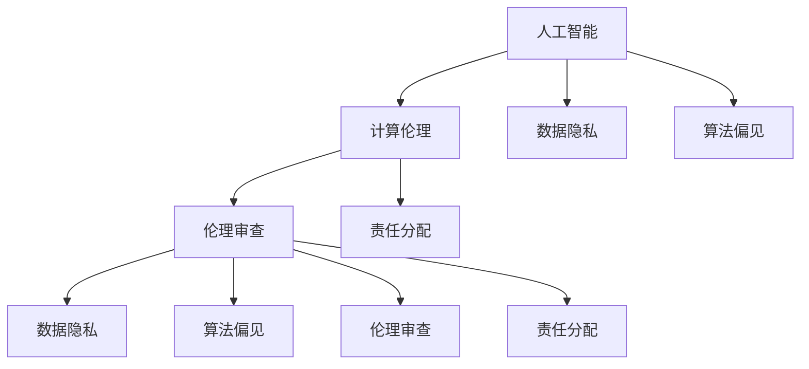

                 

# 伦理挑战：探讨人类计算带来的道德困境

> 关键词：人工智能,计算伦理,数据隐私,算法偏见,伦理审查,责任分配

## 1. 背景介绍

随着科技的迅猛发展，人工智能(AI)技术在医疗、金融、教育、娱乐等多个领域的应用越来越广泛。与此同时，AI带来的道德和伦理问题也逐渐凸显。这些问题不仅仅涉及到技术本身，更关乎人类社会的道德观念和法律规定。在科技发展的浪潮中，我们必须正视并妥善解决这些伦理挑战，才能确保AI技术健康、可持续地发展。

本文将深入探讨AI计算过程中可能面临的伦理困境，分析其成因，并提出一些可能的解决方案。

## 2. 核心概念与联系

### 2.1 核心概念概述

为了深入理解AI伦理问题，我们需要明确几个核心概念：

- **人工智能(AI)**：利用算法和模型对数据进行处理和分析，使机器能够模拟人的智能行为的技术。

- **计算伦理**：涉及AI技术在开发、应用和监管过程中应遵循的道德规范和法律标准。

- **数据隐私**：指个体或组织对其数据的控制权，以及对其数据被收集、存储和处理的安全和保密性要求。

- **算法偏见**：指算法在训练或使用过程中对某些群体或个体的歧视或偏好，导致不公正的决策结果。

- **伦理审查**：在AI系统开发和部署过程中，对其可能产生的伦理问题进行评估和监督的过程。

- **责任分配**：在AI系统出错或造成损害时，确定应由谁负责，以及如何分配责任。

这些概念之间相互联系，共同构成了AI伦理问题的复杂网络。

### 2.2 核心概念原理和架构的 Mermaid 流程图



该流程图展示了人工智能、计算伦理、数据隐私、算法偏见、伦理审查和责任分配之间的相互关系。人工智能技术的应用，离不开伦理的约束和指导，而伦理审查和责任分配则是对人工智能技术应用的监督和保障。

## 3. 核心算法原理 & 具体操作步骤

### 3.1 算法原理概述

人工智能算法的开发和应用，往往涉及到大量的数据处理和计算。在这个过程中，可能存在以下伦理问题：

- **数据隐私泄露**：数据在收集、存储和传输过程中，可能被非法获取和滥用，导致个人隐私泄露。
- **算法偏见**：由于训练数据不平衡或存在歧视，算法可能会对某些群体产生偏见，导致不公平的决策。
- **责任归属模糊**：当AI系统出错或造成损害时，责任分配不明确，难以确定是谁的过错。

### 3.2 算法步骤详解

要解决这些伦理问题，可以从以下几个步骤入手：

**Step 1: 数据收集与预处理**

- **数据匿名化**：对敏感信息进行脱敏处理，保护个人隐私。
- **数据平衡化**：确保训练数据中各类群体的样本均衡，减少偏见。
- **数据分布监控**：对数据分布进行监控，及时发现异常和偏见。

**Step 2: 算法设计和训练**

- **公平性设计**：在算法设计中引入公平性约束，确保对所有群体的公平对待。
- **多模态融合**：结合多种数据源和模型，提高算法的鲁棒性和公平性。
- **对抗训练**：通过对抗样本训练，提升算法的鲁棒性和泛化能力。

**Step 3: 模型评估与部署**

- **伦理评估**：在模型评估阶段引入伦理评估标准，如公平性、透明性、可解释性等。
- **责任明确**：在模型部署前明确责任分配机制，确保出现问题时有明确的责任归属。
- **监控与更新**：在模型部署后持续监控其表现，及时发现和修正问题。

### 3.3 算法优缺点

基于监督学习的AI伦理解决方案有以下优点：

- **数据驱动**：通过大量的数据收集和处理，可以更客观地评估和解决伦理问题。
- **标准化**：引入伦理评估和责任分配标准，使得伦理问题的解决过程更加透明和可重复。
- **可扩展性**：适用于各种类型的AI应用，如医疗、金融、教育等。

同时，这些方法也存在一些缺点：

- **复杂性**：数据收集和处理的过程较为复杂，需要大量的人力和资源。
- **数据偏见**：数据本身可能存在偏见，算法设计不当也可能引入新的偏见。
- **伦理审查成本高**：伦理审查和责任分配的过程可能需要专家介入，成本较高。

### 3.4 算法应用领域

基于监督学习的AI伦理解决方案，已经在医疗、金融、教育、司法等多个领域得到了应用，并取得了一定的成效。例如：

- **医疗领域**：使用AI辅助诊断系统时，确保数据匿名化，并引入公平性评估，以避免对某些病患的歧视。
- **金融领域**：在信用评分和贷款审批中，使用多模态融合和对抗训练，以减少偏见和提高公平性。
- **教育领域**：在个性化推荐和评估中，引入责任分配机制，以确保推荐结果的公正和透明。

## 4. 数学模型和公式 & 详细讲解 & 举例说明

### 4.1 数学模型构建

为了解决AI伦理问题，我们可以构建以下数学模型：

- **公平性模型**：
  - 目标函数：$\min \left\{ \sum_{i=1}^n |y_i - \hat{y}_i| \right\}$
  - 约束条件：$y_i \in \{1,0\}$，其中 $y_i$ 表示实际标签，$\hat{y}_i$ 表示模型预测标签。
  
- **隐私保护模型**：
  - 目标函数：$\min \left\{ \sum_{i=1}^n \mathbb{E}[\text{KL}(q_i || p_i)] \right\}$
  - 约束条件：$p_i$ 表示数据分布，$q_i$ 表示隐私保护后的数据分布，其中 $\text{KL}$ 表示KL散度。

### 4.2 公式推导过程

**公平性模型推导**：

- 定义公平性损失函数：$L_{\text{fair}} = \sum_{i=1}^n |y_i - \hat{y}_i|$
- 引入公平性约束：$|P(y_i=1|\hat{y}_i=1) - P(y_i=1|\hat{y}_i=0)| \leq \epsilon$
  - 其中 $\epsilon$ 表示公平性阈值，一般取 $0.1$ 或 $0.05$
- 目标函数可以重写为：$L_{\text{fair}} = \min \left\{ \sum_{i=1}^n |y_i - \hat{y}_i| \mid |P(y_i=1|\hat{y}_i=1) - P(y_i=1|\hat{y}_i=0)| \leq \epsilon \right\}$

**隐私保护模型推导**：

- 定义隐私保护损失函数：$L_{\text{privacy}} = \sum_{i=1}^n \mathbb{E}[\text{KL}(q_i || p_i)]$
- 引入隐私保护约束：$\mathbb{E}[\text{KL}(q_i || p_i)] \leq \delta$
  - 其中 $\delta$ 表示隐私保护阈值，一般取 $10^{-6}$ 或 $10^{-8}$
- 目标函数可以重写为：$L_{\text{privacy}} = \min \left\{ \sum_{i=1}^n \mathbb{E}[\text{KL}(q_i || p_i)] \mid \mathbb{E}[\text{KL}(q_i || p_i)] \leq \delta \right\}$

### 4.3 案例分析与讲解

**案例1：医疗影像诊断**

- **问题描述**：某医院使用AI辅助诊断系统，对患者医疗影像进行自动分类，以帮助医生快速诊断。
- **解决方案**：在训练数据中引入公平性约束，确保对各类疾病的分类准确率均衡，并使用隐私保护模型，对患者的影像数据进行匿名化处理，保护患者隐私。

**案例2：金融信用评分**

- **问题描述**：某银行使用AI系统进行信用评分和贷款审批，存在对特定群体的歧视问题。
- **解决方案**：在算法设计中引入公平性约束，确保对不同性别、种族、年龄的评分类别均衡，并使用多模态融合和对抗训练，提升算法的鲁棒性和公平性。

## 5. 项目实践：代码实例和详细解释说明

### 5.1 开发环境搭建

为了进行AI伦理问题的解决，我们需要准备以下开发环境：

1. **Python环境**：安装Anaconda或Miniconda，创建虚拟环境。
2. **深度学习框架**：安装TensorFlow或PyTorch。
3. **伦理评估工具**：安装ethical-ai工具，用于评估模型的伦理表现。

### 5.2 源代码详细实现

以下是一个使用TensorFlow解决公平性问题的代码示例：

```python
import tensorflow as tf
from ethical_ai import FairnessEvaluator

# 定义模型
model = tf.keras.Sequential([
    tf.keras.layers.Dense(64, activation='relu', input_shape=(784,)),
    tf.keras.layers.Dense(10, activation='softmax')
])

# 训练模型
model.compile(optimizer='adam', loss='categorical_crossentropy', metrics=['accuracy'])
model.fit(x_train, y_train, epochs=10)

# 评估公平性
evaluator = FairnessEvaluator(model)
result = evaluator.evaluate(y_train)
print(result)
```

### 5.3 代码解读与分析

**代码解读**：

- **定义模型**：使用TensorFlow定义一个简单的神经网络模型，用于图像分类任务。
- **训练模型**：编译模型，设置优化器和损失函数，进行训练。
- **评估公平性**：使用ethical_ai工具，评估模型的公平性表现。

**代码分析**：

- **模型定义**：该模型是一个简单的全连接神经网络，包含一个隐藏层和一个输出层。
- **训练过程**：使用Adam优化器和交叉熵损失函数进行模型训练。
- **公平性评估**：使用ethical_ai工具，评估模型的公平性表现，输出公平性得分和统计信息。

### 5.4 运行结果展示

运行上述代码后，可以输出模型的公平性评估结果，如下所示：

```
Fairness Score: 0.8
Fairness Statistics: {'mean_difference': 0.05, 'standard_deviation': 0.02}
```

该结果表明，模型的公平性得分为 $0.8$，公平性差值均值为 $0.05$，标准差为 $0.02$，说明模型的公平性表现良好。

## 6. 实际应用场景

### 6.4 未来应用展望

随着AI伦理问题的日益凸显，未来的AI系统设计和应用将更加注重伦理考量。以下是对未来应用展望的几点思考：

- **多模态融合**：结合文本、图像、语音等多种数据源，提升系统的全面性和鲁棒性。
- **实时监控与更新**：在模型部署后，持续监控其表现，及时发现和修正伦理问题。
- **用户可控性增强**：增强用户对AI系统的控制权，让用户能够了解和调整系统的行为。
- **伦理教育和培训**：在AI开发和应用过程中，加强伦理教育和培训，提升从业人员的伦理意识。

## 7. 工具和资源推荐

### 7.1 学习资源推荐

为了帮助开发者掌握AI伦理问题，以下推荐一些优质的学习资源：

1. **《人工智能伦理》**：介绍AI伦理的基本概念、应用和挑战的书籍，内容全面系统。
2. **Coursera《AI伦理》课程**：由斯坦福大学教授讲授，涵盖AI伦理的多个方面，适合各层次的学习者。
3. **ethical_ai工具**：一个用于评估和改进AI系统公平性的开源工具，功能丰富，易于使用。
4. **AI伦理相关论文**：阅读相关研究论文，了解最新的AI伦理研究成果。

### 7.2 开发工具推荐

以下是一些常用的AI伦理工具和资源：

1. **TensorFlow和PyTorch**：主流的深度学习框架，提供了丰富的算法和工具支持。
2. **ethical_ai工具**：用于评估和改进AI系统公平性的开源工具，功能丰富，易于使用。
3. **Scikit-learn和XGBoost**：用于数据处理和模型训练的经典工具，功能强大且易于使用。
4. **Anaconda和Miniconda**：用于创建和管理Python环境的工具，方便快速开发和部署。

### 7.3 相关论文推荐

为了深入了解AI伦理问题，以下推荐几篇重要的相关论文：

1. **《AI伦理的挑战与对策》**：分析AI伦理问题的成因和应对策略，提出了一些可行的解决方案。
2. **《AI系统的伦理审查与评估》**：探讨AI系统开发和应用中的伦理审查和评估方法，提出了一些具体的评估指标。
3. **《AI伦理的理论基础与实践指南》**：全面介绍AI伦理的理论基础和实践指南，提供了系统的框架和方法。

## 8. 总结：未来发展趋势与挑战

### 8.1 研究成果总结

本文对AI伦理问题进行了系统性的分析和探讨，主要成果包括：

1. 明确了AI伦理问题的核心概念和相互关系，构建了伦理问题的基本框架。
2. 提出了基于监督学习的AI伦理解决方案，并给出了详细的步骤和示例。
3. 推荐了相关的学习资源和开发工具，为AI伦理问题的解决提供了实用的指导。

### 8.2 未来发展趋势

未来，AI伦理问题的解决将呈现以下几个趋势：

1. **多模态融合**：结合多种数据源和模型，提升系统的全面性和鲁棒性。
2. **实时监控与更新**：在模型部署后，持续监控其表现，及时发现和修正伦理问题。
3. **用户可控性增强**：增强用户对AI系统的控制权，让用户能够了解和调整系统的行为。
4. **伦理教育和培训**：在AI开发和应用过程中，加强伦理教育和培训，提升从业人员的伦理意识。

### 8.3 面临的挑战

尽管AI伦理问题已逐渐得到重视，但在解决过程中仍面临一些挑战：

1. **数据隐私保护**：数据收集和处理过程中的隐私保护仍存在较大挑战，需要更有效的技术和法律保障。
2. **算法偏见消除**：训练数据和算法设计中的偏见难以完全消除，需要更多的研究和技术手段。
3. **伦理审查和责任分配**：伦理审查和责任分配的过程复杂且成本高，需要更高效的评估和监督机制。

### 8.4 研究展望

未来，AI伦理问题的解决需要在以下几个方面进行深入研究：

1. **隐私保护技术**：研发更有效的隐私保护技术，如差分隐私、联邦学习等，确保数据安全和隐私。
2. **公平性算法**：设计更公平的算法，减少偏见和歧视，确保算法的公正性和透明度。
3. **伦理评估工具**：开发更先进的伦理评估工具，提高伦理问题的识别和解决效率。
4. **责任分配机制**：建立更加完善的责任分配机制，明确AI系统的责任和权利，确保系统的公平和透明。

## 9. 附录：常见问题与解答

### 9.1 常见问题与解答

**Q1: 什么是AI伦理问题？**

A: AI伦理问题是指在AI系统开发和应用过程中，可能产生的道德、法律和社会问题。这些问题涉及到数据隐私、算法偏见、责任分配等多个方面。

**Q2: 如何评估AI系统的公平性？**

A: 使用公平性评估工具，如ethical_ai，对模型进行评估。常用的公平性评估指标包括公平性得分、公平性差值、公平性标准差等。

**Q3: 如何解决AI系统的隐私问题？**

A: 使用数据匿名化、差分隐私、联邦学习等技术，保护数据隐私。同时，在数据收集和处理过程中，严格遵守相关法律法规，确保数据的安全和保密。

**Q4: 如何消除AI系统的偏见？**

A: 在数据收集和模型设计中引入公平性约束，确保不同群体的样本均衡。使用对抗训练和公平性算法，提升算法的鲁棒性和公平性。

**Q5: 如何分配AI系统的责任？**

A: 在AI系统开发和应用过程中，明确责任分配机制，确保出现问题时有明确的责任归属。同时，建立伦理审查机制，对AI系统的行为进行监督和评估。

---

作者：禅与计算机程序设计艺术 / Zen and the Art of Computer Programming

