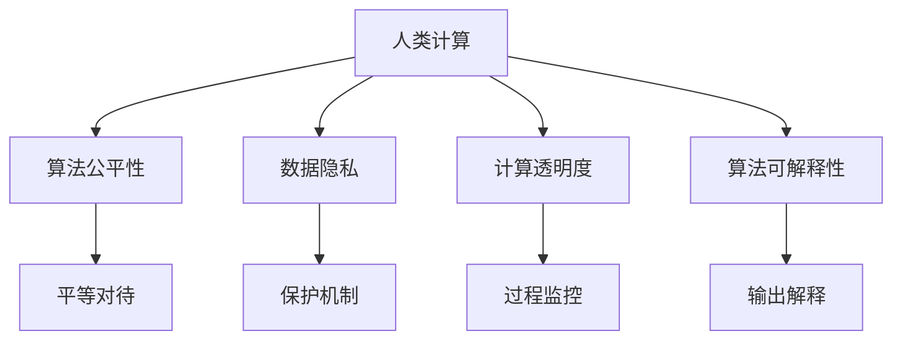

                 

# 伦理挑战：探讨人类计算带来的道德困境

## 1. 背景介绍

在当今信息时代，计算技术的飞速发展不仅极大地推动了科学研究的进步和人类社会的繁荣，也引发了一系列前所未有的伦理挑战。特别是在人类计算（Human Computation）领域，即通过设计高效算法和优化计算资源，以人类为中心地计算任务（如自然语言处理、图像识别、数据挖掘等）中，如何保障计算活动的道德性，成为技术工作者和社会各界共同关心的焦点问题。

本文将从伦理学、计算机科学和社会学多个角度，探讨人类计算中常见的道德困境，并结合最新的研究成果和实际应用案例，提出解决这些困境的可能路径和未来展望。

## 2. 核心概念与联系

### 2.1 核心概念概述

为了理解人类计算中的道德困境，我们先梳理几个核心概念：

- **人类计算（Human Computation）**：利用人类的智慧和能力，通过设计算法和优化资源，自动解决复杂计算任务的技术范式。相比传统的机器计算，人类计算更注重人的参与和贡献。

- **算法公平性**：指算法在处理数据时，能否对所有用户或群体提供平等的服务。公平性是衡量算法道德性的重要指标。

- **数据隐私**：指个人信息的保护，包括但不限于个人信息的收集、存储、使用和传播等各个环节。数据隐私是计算活动必须严格遵守的法律和伦理标准。

- **计算透明度**：指计算过程的可理解性和可追溯性，用户应能清楚地了解计算行为和结果的生成过程，避免“黑箱”算法的不透明性。

- **算法可解释性**：指算法输出结果的可解释性，即用户可以理解算法是如何得出某个决策的。这对决策过程的公正性和可信度至关重要。

### 2.2 核心概念原理和架构的 Mermaid 流程图(Mermaid 流程节点中不要有括号、逗号等特殊字符)



## 3. 核心算法原理 & 具体操作步骤

### 3.1 算法原理概述

在人类计算中，算法的公平性、数据隐私、透明度和可解释性是其道德性的四个核心维度。通过精心设计这些维度，可以在满足计算效率的同时，保障计算行为的道德性。

以自然语言处理(NLP)为例，一个典型的算法模型训练流程包括数据收集、预处理、模型训练、模型评估和模型部署等步骤。每个步骤都可能面临相应的伦理挑战。

### 3.2 算法步骤详解

**数据收集与预处理**：

1. **数据源选择**：首先，需确保数据源的合法性和代表性，避免数据偏见和歧视。

2. **数据匿名化**：对敏感信息进行脱敏处理，保护用户隐私。

3. **数据清洗**：去除噪声和异常数据，提升数据质量。

**模型训练**：

1. **算法设计**：选用不带有显性偏见的算法，并定期评估其公平性。

2. **正则化技术**：应用L2正则、Dropout等技术，避免过拟合，提升模型鲁棒性。

3. **公平性约束**：引入公平性损失函数，对模型进行约束，确保不同群体公平对待。

**模型评估**：

1. **多样性评估**：评估模型在不同数据集上的表现，避免数据分布偏差。

2. **解释性评估**：使用LIME、SHAP等工具，解释模型决策过程。

**模型部署**：

1. **算法透明度**：提供模型使用的算法框架和数据来源，增强透明性。

2. **反馈机制**：设置用户反馈通道，定期改进模型性能。

### 3.3 算法优缺点

**优点**：

- **提升计算效率**：通过算法优化，显著降低计算时间和资源消耗，提高处理能力。
- **提升决策质量**：通过透明和可解释性，增加计算结果的可信度和公正性。

**缺点**：

- **算法偏见**：如数据源选择不当，模型可能带有偏见，影响公平性。
- **数据隐私风险**：数据收集和处理过程中，可能泄露用户隐私，引发伦理问题。
- **计算不透明性**：复杂的算法和模型，可能难以解释其内部逻辑，增加决策不透明性。

### 3.4 算法应用领域

人类计算的应用领域非常广泛，包括但不限于以下几类：

- **自然语言处理(NLP)**：通过算法优化，提升文本分类、情感分析、机器翻译等任务的效率和效果。

- **计算机视觉**：通过算法优化，提升图像识别、目标检测、视频分析等任务的处理速度和准确率。

- **数据挖掘**：通过算法优化，从大数据中挖掘出有价值的信息，支持决策和预测。

- **推荐系统**：通过算法优化，提高个性化推荐服务的精准度和用户满意度。

## 4. 数学模型和公式 & 详细讲解 & 举例说明

### 4.1 数学模型构建

以推荐系统为例，我们假设用户集合为 $U$，物品集合为 $I$，用户对物品的评分矩阵为 $R$。推荐算法 $A$ 的目标是找到用户 $u$ 对物品 $i$ 的推荐评分 $r_{u,i}$。推荐模型的数学模型可以表示为：

$$
r_{u,i} = f_A(u,i)
$$

其中 $f_A$ 为推荐算法 $A$ 的评分函数。

### 4.2 公式推导过程

推荐模型的常见优化目标为最大化预测评分与实际评分之间的均方误差：

$$
\min_{\theta} \frac{1}{|U|} \sum_{u \in U} \frac{1}{|I|} \sum_{i \in I} (r_{u,i} - \hat{r}_{u,i})^2
$$

其中 $\theta$ 为推荐模型的参数。通过对上述目标函数求最小化，可以优化模型的预测评分函数 $f_A$。

### 4.3 案例分析与讲解

以协同过滤算法为例，其核心思想是通过分析用户间的相似性和物品间的关联性，预测用户对物品的评分。协同过滤算法在推荐系统中应用广泛，但也面临数据稀疏性、冷启动等问题。

为解决这些问题，研究人员提出了多种优化策略，如矩阵分解、梯度下降等。同时，在公平性方面，协同过滤算法也面临着不同用户间评分分布不均的问题。为提高算法公平性，引入了各种正则化技术，如基于群体的评分修正、基于标签的特征调节等。

## 5. 项目实践：代码实例和详细解释说明

### 5.1 开发环境搭建

假设我们使用Python和TensorFlow进行协同过滤算法的开发。以下是环境配置步骤：

1. 安装Anaconda：从官网下载并安装Anaconda，创建独立的Python环境。

2. 创建并激活虚拟环境：
```bash
conda create -n recsys python=3.8 
conda activate recsys
```

3. 安装TensorFlow：根据CUDA版本，从官网获取对应的安装命令。例如：
```bash
conda install tensorflow -c tensorflow -c pytorch -c conda-forge
```

4. 安装PyTorch：
```bash
conda install torch torchvision torchaudio -c pytorch
```

5. 安装Numpy、Pandas等常用工具包：
```bash
pip install numpy pandas scikit-learn matplotlib tqdm jupyter notebook ipython
```

### 5.2 源代码详细实现

假设我们已有一份用户-物品评分矩阵 $R$，需要开发协同过滤算法。以下是完整的代码实现：

```python
import tensorflow as tf
import numpy as np
import pandas as pd

# 创建用户-物品评分矩阵
R = pd.read_csv('ratings.csv', header=None)

# 创建用户和物品的id映射
user_id_to_index = {user: i for i, user in enumerate(set(R.iloc[:, 0]))}
item_id_to_index = {item: i for i, item in enumerate(set(R.iloc[:, 1]))}

# 将评分矩阵转换为数值矩阵
R = np.array([[user_id_to_index[user], item_id_to_index[item], rating] for user, item, rating in R.itertuples()]).T

# 创建模型参数
latent_dim = 10
model_params = {
    'user_bias': tf.Variable(tf.random.normal([len(user_id_to_index)])),
    'item_bias': tf.Variable(tf.random.normal([len(item_id_to_index)])),
    'user_factor': tf.Variable(tf.random.normal([len(user_id_to_index), latent_dim])),
    'item_factor': tf.Variable(tf.random.normal([len(item_id_to_index), latent_dim]))
}

# 定义评分函数
def rating(user_id, item_id):
    user_bias = model_params['user_bias'][user_id]
    item_bias = model_params['item_bias'][item_id]
    user_factor = model_params['user_factor'][user_id]
    item_factor = model_params['item_factor'][item_id]
    return tf.reduce_sum(user_factor * item_factor) + user_bias + item_bias

# 定义优化目标函数
def loss_function(R, user_id, item_id, rating):
    prediction = rating(user_id, item_id)
    return tf.reduce_mean(tf.square(prediction - rating))

# 定义优化器
optimizer = tf.keras.optimizers.Adam(learning_rate=0.01)

# 训练模型
epochs = 100
for epoch in range(epochs):
    for user_id, item_id, rating in R:
        with tf.GradientTape() as tape:
            loss = loss_function(R, user_id, item_id, rating)
        grads = tape.gradient(loss, model_params.values())
        optimizer.apply_gradients(zip(grads, model_params.values()))
```

### 5.3 代码解读与分析

以下是关键代码的解读和分析：

**评分函数**：
- 用户偏置 $\text{user\_bias}$ 和物品偏置 $\text{item\_bias}$ 分别表示每个用户和物品的固有评分。
- 用户因子和物品因子 $\text{user\_factor}$ 和 $\text{item\_factor}$ 分别表示用户和物品的潜在评分。

**损失函数**：
- 定义评分预测与实际评分之间的均方误差。

**优化器**：
- 使用Adam优化器，控制学习率。

**模型训练**：
- 通过循环迭代，不断更新模型参数，最小化损失函数。

## 6. 实际应用场景

### 6.1 推荐系统

协同过滤算法在推荐系统中应用广泛。通过分析用户历史评分，推荐系统可以预测用户对未评分物品的兴趣，提升个性化推荐效果。例如，Amazon和Netflix等电商平台，通过协同过滤算法，为用户提供精准的个性化推荐服务。

在实际应用中，推荐系统面临的道德挑战包括：

- **数据隐私**：用户历史评分数据可能包含个人隐私信息，需采取匿名化和加密等措施。
- **算法偏见**：如果评分数据存在偏见，推荐算法可能反映这些偏见，对特定用户群体产生歧视。

### 6.2 自然语言处理

在自然语言处理中，公平性和透明度问题同样重要。例如，情感分析模型可能对特定人群的情感表达有偏见，导致分析结果不公正。

为了应对这些挑战，研究者提出了多种公平性优化策略，如基于群体的公平性约束、引入多样性约束等。同时，可解释性工具如LIME、SHAP等，也被广泛应用于解释模型决策过程，增加计算透明度。

### 6.3 医疗诊断系统

医疗诊断系统通过数据分析，预测患者的健康状况。在数据采集和处理过程中，需严格遵守隐私保护和伦理约束，避免泄露患者敏感信息。

在模型设计上，公平性问题同样重要。医疗诊断模型需对所有种族、性别、年龄等群体的健康状态提供公平的预测。同时，模型的透明度和可解释性，有助于医生理解模型预测依据，增加其可信度。

### 6.4 未来应用展望

未来，人类计算的伦理挑战将更加复杂多样，涉及数据隐私、算法公平性、计算透明度和可解释性等多方面。以下是我们对未来应用展望的几点思考：

1. **数据隐私保护**：通过区块链、差分隐私等技术，保护数据隐私。

2. **算法公平性**：引入对抗性训练、多样性约束等技术，提升算法公平性。

3. **计算透明度**：开发更易解释的模型，如决策树、可解释性深度学习模型等。

4. **伦理机制**：建立伦理审查和反馈机制，定期评估和改进计算行为。

5. **跨学科合作**：与伦理学、社会学等学科合作，共同应对伦理挑战。

## 7. 工具和资源推荐

### 7.1 学习资源推荐

为了深入理解人类计算中的伦理问题，推荐以下学习资源：

1. 《算法与人工智能伦理》系列博文：详细讲解了算法公平性、数据隐私、计算透明度等伦理问题。

2. 《数据科学与人工智能伦理》课程：斯坦福大学开设的伦理课程，系统讲解了数据科学和人工智能中的伦理问题。

3. 《人工智能伦理：理论、方法与应用》书籍：介绍了人工智能伦理的基础理论、方法和应用实践。

4. 《数据隐私保护》在线课程：深入讲解了数据隐私保护的技术和策略。

5. 《机器学习伦理》开源项目：提供丰富的伦理知识和案例，助力开发者理解伦理问题。

### 7.2 开发工具推荐

以下是推荐的开发工具：

1. PyTorch：灵活的深度学习框架，支持自动微分和动态计算图，适合快速迭代研究。

2. TensorFlow：谷歌主导的深度学习框架，生产部署方便，适合大规模工程应用。

3. TensorBoard：TensorFlow配套的可视化工具，实时监测模型训练状态。

4. Jupyter Notebook：交互式编程环境，便于撰写和分享代码。

5. Weights & Biases：模型训练的实验跟踪工具，记录和可视化模型训练过程。

### 7.3 相关论文推荐

以下是几篇奠基性的相关论文，推荐阅读：

1. "The Ethical Implications of AI: A Global Perspective" 论文：探讨了人工智能在伦理层面的广泛影响，提供了多视角分析。

2. "Fairness in AI: Principles and Metrics for Decision Systems" 论文：提出了公平性评估的多种指标和方法，为算法设计提供指导。

3. "Explainable AI: Interpreting and Explaining Machine Learning" 论文：介绍了多种可解释性技术和工具，增强算法透明度。

4. "Differential Privacy: Privacy Preserving Data Analysis" 论文：介绍了差分隐私技术，保护数据隐私。

5. "Human-AI Collaboration: The Case for Transparency" 论文：探讨了人机协同的透明度问题，提出了提升透明度的路径。

## 8. 总结：未来发展趋势与挑战

### 8.1 研究成果总结

本文从伦理学、计算机科学和社会学多个角度，探讨了人类计算中的道德困境，并结合最新的研究成果和实际应用案例，提出了解决这些困境的可能路径和未来展望。

### 8.2 未来发展趋势

1. **数据隐私保护**：随着区块链、差分隐私等技术的进步，数据隐私保护将更上一层楼。

2. **算法公平性**：多种公平性优化策略将推动算法设计更公平、更公正。

3. **计算透明度**：更易解释的模型和算法将提升计算透明度。

4. **伦理机制**：跨学科合作和伦理审查机制将进一步规范计算行为。

### 8.3 面临的挑战

尽管人类计算中的伦理问题得到了越来越多的关注，但仍面临诸多挑战：

1. **数据隐私保护**：隐私保护技术需要不断提升，以应对数据泄露风险。

2. **算法公平性**：如何定义和量化公平性，仍然是一个复杂的问题。

3. **计算透明度**：复杂模型的解释性仍需进一步提升。

4. **伦理审查**：跨学科合作和伦理机制的建立仍需时间。

### 8.4 研究展望

未来，在数据隐私、算法公平性、计算透明度和伦理审查等方面，仍需持续努力和探索。通过不断创新和优化，人类计算将更好地服务于社会，造福人类。

## 9. 附录：常见问题与解答

**Q1: 如何确保推荐系统的公平性？**

A: 推荐系统需对所有用户和物品进行公平对待。可以通过引入多样性约束、基于群体的公平性约束等策略，提升推荐算法的公平性。

**Q2: 如何保护数据隐私？**

A: 数据隐私保护需从数据采集、存储、传输和使用的各个环节入手。采用匿名化、差分隐私等技术，严格控制数据泄露风险。

**Q3: 如何提升模型的可解释性？**

A: 使用可解释性模型如决策树、LIME、SHAP等，增加模型的透明度和可理解性。同时，定期评估模型输出，及时发现和修正潜在的偏见和错误。

**Q4: 如何设计高效的算法？**

A: 在设计算法时，需考虑公平性、透明性和可解释性。引入对抗性训练、多样性约束等策略，提升算法的公平性和鲁棒性。

**Q5: 如何应对算法的道德困境？**

A: 算法道德困境需要跨学科合作。与伦理学、社会学等学科共同探讨，建立伦理审查机制，定期评估和改进计算行为。

---

作者：禅与计算机程序设计艺术 / Zen and the Art of Computer Programming

