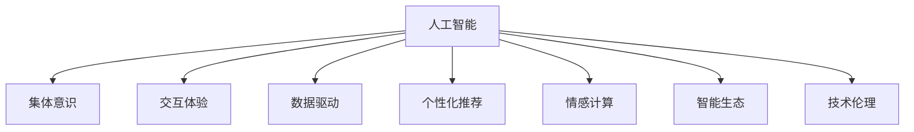

                 

# 体验的共享：AI驱动的集体意识

> 关键词：
人工智能, 集体意识, 交互体验, 数据驱动, 个性化推荐, 用户参与, 情感计算, 智能生态, 技术伦理

## 1. 背景介绍

### 1.1 问题由来
随着技术的进步，人工智能(AI)已经成为现代社会的重要组成部分，深刻影响着我们的生活方式和思维方式。从智能助理到自动驾驶，从个性化推荐到智能医疗，AI正在以前所未有的速度渗透到各个领域。然而，与此同时，AI技术也面临着诸多挑战，包括数据隐私、伦理道德、用户体验等。如何让AI更好地融入社会，提升人类的生活质量和幸福感，成为当前一个亟待解决的问题。

### 1.2 问题核心关键点
本文聚焦于AI在提升用户体验方面的潜力，特别是通过AI驱动的集体意识，让人们共享和参与的体验更加丰富和个性化。AI技术能够根据用户的偏好和行为，提供更加个性化和定制化的服务，提升用户的参与感和满意度。同时，通过AI技术，我们可以更好地理解用户的情感和需求，实现更深层次的交互和共鸣，构建更加和谐、互助的社交环境。

### 1.3 问题研究意义
研究AI驱动的集体意识，对于提升用户体验、推动AI技术的发展、构建更加和谐的社会具有重要意义：

1. **用户体验优化**：通过AI技术，可以提供更加个性化、定制化的服务，满足用户的独特需求，提升用户的满意度和幸福感。
2. **技术发展推动**：研究AI驱动的集体意识，能够推动AI技术的不断创新和进步，为AI技术的落地应用提供新的思路和方法。
3. **社会和谐构建**：通过AI技术，可以实现更加深入的情感计算和社交互动，增强人与人之间的理解和互助，构建更加和谐、互助的社交环境。

## 2. 核心概念与联系

### 2.1 核心概念概述

为了更好地理解AI驱动的集体意识，本节将介绍几个密切相关的核心概念：

- **人工智能(Artificial Intelligence, AI)**：利用计算机技术和算法，使机器具备类似于人类的智能，能够感知、理解、推理和学习，从而执行复杂任务的技术。

- **集体意识(Collective Consciousness)**：指个体之间通过交流、互动，形成的一种共同的知识、情感和认知状态。集体意识强调个体与个体、个体与环境之间的互动和共鸣。

- **交互体验(Interactive Experience)**：指用户在操作或使用系统时，与系统进行交互过程中所获得的直观感受和认知体验。交互体验强调用户参与感和满意度。

- **数据驱动(Data-Driven)**：通过大量数据，利用机器学习和数据挖掘技术，分析和预测用户行为和需求，提供个性化服务。

- **个性化推荐(Personalized Recommendation)**：根据用户的历史行为和偏好，推荐符合用户需求的产品或服务。个性化推荐能够提升用户体验和满意度。

- **情感计算(Affective Computing)**：研究如何通过机器学习和数据分析技术，理解和识别人类的情感和情绪，从而提升人机互动的质量和深度。

- **智能生态(Smart Ecosystem)**：通过AI技术，构建一个高效、互助、开放、可持续发展的智能生态系统，实现人与系统、系统与系统之间的深度互动。

这些核心概念之间的逻辑关系可以通过以下Mermaid流程图来展示：



这个流程图展示了大语言模型的核心概念及其之间的关系：

1. 人工智能通过数据驱动、个性化推荐等技术手段，提升了用户体验和满意度。
2. 通过集体意识和情感计算，实现了更深层次的情感共鸣和互助。
3. 智能生态构建了高效、互助、开放、可持续发展的系统。
4. 技术伦理保证了AI技术的公平、透明、可控。

这些概念共同构成了AI驱动的集体意识框架，使其能够更好地服务于人类，提升生活质量和社会幸福感。

## 3. 核心算法原理 & 具体操作步骤

### 3.1 算法原理概述

AI驱动的集体意识，核心在于通过AI技术，实现更深层次的情感计算和社交互动，提升用户体验和满意度。其核心思想是：

1. **数据采集与分析**：通过传感器、智能设备等手段，采集用户的行为数据和情感数据，利用机器学习算法进行分析。
2. **个性化推荐**：根据用户的行为和情感特征，推荐符合用户需求的产品和服务，提升用户的参与感和满意度。
3. **情感共鸣**：通过情感计算，识别和理解用户的情感状态，实现更深层次的情感互动和共鸣。
4. **智能生态**：通过AI技术，构建高效、互助、开放、可持续发展的智能生态系统，实现人与系统、系统与系统之间的深度互动。

### 3.2 算法步骤详解

基于上述原理，AI驱动的集体意识技术主要包括以下几个关键步骤：

**Step 1: 数据采集与预处理**
- 收集用户的行为数据和情感数据，如点击、浏览、表情、语音等。
- 对数据进行清洗、归一化等预处理，去除噪音和异常值。

**Step 2: 特征提取与建模**
- 利用机器学习算法，提取数据中的特征，如行为模式、情感特征等。
- 构建模型，如协同过滤、深度学习等，预测用户的行为和需求。

**Step 3: 个性化推荐**
- 根据用户的历史行为和情感特征，推荐符合用户需求的产品和服务。
- 实时更新推荐模型，确保推荐结果的准确性和时效性。

**Step 4: 情感计算与共鸣**
- 利用情感计算技术，识别和理解用户的情感状态。
- 通过智能对话系统，实现更深层次的情感互动和共鸣。

**Step 5: 智能生态构建**
- 构建高效、互助、开放、可持续发展的智能生态系统，实现人与系统、系统与系统之间的深度互动。

**Step 6: 技术伦理保障**
- 建立技术伦理规范，确保AI技术的公平、透明、可控。

### 3.3 算法优缺点

AI驱动的集体意识技术具有以下优点：
1. **提升用户体验**：通过个性化推荐和情感计算，提升用户的参与感和满意度。
2. **技术先进**：利用机器学习和情感计算等先进技术，实现更深层次的情感互动和共鸣。
3. **应用广泛**：适用于智能客服、社交媒体、智能家居等多个领域，提升系统的智能程度和用户体验。
4. **市场潜力大**：随着AI技术的不断发展，未来在各领域的市场应用前景广阔。

同时，该技术也存在一些局限性：
1. **数据隐私**：大量数据的采集和分析可能涉及用户隐私，需要加强数据保护和隐私管理。
2. **模型复杂**：机器学习和情感计算模型较为复杂，需要较高的技术门槛和资源投入。
3. **用户信任**：用户可能对AI系统的决策和行为产生不信任，需要加强系统的透明性和可解释性。
4. **社会伦理**：AI技术可能带来社会伦理问题，需要制定相应的伦理规范和法律法规。

尽管存在这些局限性，但AI驱动的集体意识技术仍是一个充满潜力的研究领域，值得进一步探索和应用。

### 3.4 算法应用领域

AI驱动的集体意识技术已经在多个领域得到了应用，具体如下：

- **智能客服**：通过情感计算和智能对话系统，提升客服系统的智能程度和用户满意度。
- **社交媒体**：利用个性化推荐和情感计算技术，提升用户参与度和体验感。
- **智能家居**：通过行为分析和情感计算，实现智能家居设备的个性化控制和互动。
- **智能医疗**：利用情感计算和智能诊断技术，提升医疗服务的个性化和人性化。
- **智能交通**：通过行为分析和智能推荐，提升交通系统的效率和用户体验。

## 4. 数学模型和公式 & 详细讲解 & 举例说明

### 4.1 数学模型构建

为了更好地理解AI驱动的集体意识技术，本节将使用数学语言对其中的关键步骤进行更加严格的刻画。

记用户的行为数据为 $x_i$，情感数据为 $y_i$，其中 $i=1,2,\cdots,N$。假设有 $K$ 个推荐项，记为 $z_k$，其中 $k=1,2,\cdots,K$。

定义用户对推荐项 $z_k$ 的评分函数为 $f_k(x_i,y_i)$，定义为：

$$
f_k(x_i,y_i) = \sum_{j=1}^M w_j g_j(x_i,y_i)
$$

其中，$w_j$ 为权重系数，$g_j(x_i,y_i)$ 为特征函数，用于提取用户的行为和情感特征。

目标是最小化用户对推荐结果的评分差距，即：

$$
\min_{w_j} \sum_{i=1}^N \sum_{k=1}^K (r_k(x_i,y_i) - f_k(x_i,y_i))^2
$$

其中，$r_k(x_i,y_i)$ 为真实评分。

通过求解上述最优化问题，可以得到最优的权重系数 $w_j$，进而构建个性化推荐模型。

### 4.2 公式推导过程

以协同过滤模型为例，推导推荐模型的数学公式。

协同过滤模型利用用户和物品之间的相似度进行推荐。假设用户 $u$ 对物品 $i$ 的评分向量为 $\mathbf{r}_u$，物品 $i$ 的评分向量为 $\mathbf{r}_i$，用户 $u$ 和物品 $j$ 的相似度为 $s_{u,j}$，用户 $u$ 对物品 $j$ 的评分预测值为 $\hat{r}_{u,j}$，则协同过滤模型的目标函数为：

$$
\min_{\mathbf{r}_u, \mathbf{r}_i, s_{u,j}} \sum_{i=1}^N \sum_{j=1}^K (\hat{r}_{u,j} - r_{u,j})^2
$$

其中，$\hat{r}_{u,j}$ 为预测评分，$r_{u,j}$ 为真实评分。

通过求解上述最优化问题，可以得到最优的评分预测值 $\hat{r}_{u,j}$，进而构建协同过滤推荐模型。

### 4.3 案例分析与讲解

以Netflix推荐系统为例，进行案例分析。

Netflix推荐系统利用协同过滤算法进行个性化推荐。其推荐流程如下：

1. 收集用户的行为数据，如观看历史、评分等。
2. 对用户数据进行预处理，去除噪音和异常值。
3. 利用协同过滤算法，计算用户和物品之间的相似度。
4. 根据相似度，推荐用户可能感兴趣的物品。
5. 实时更新推荐模型，确保推荐结果的准确性和时效性。

Netflix推荐系统的成功在于：

1. 利用大规模数据进行训练，构建了精准的推荐模型。
2. 通过实时更新推荐模型，确保推荐结果的及时性和个性化。
3. 利用情感计算技术，提升用户的参与感和满意度。

## 5. 项目实践：代码实例和详细解释说明

### 5.1 开发环境搭建

在进行项目实践前，我们需要准备好开发环境。以下是使用Python进行PyTorch开发的环境配置流程：

1. 安装Anaconda：从官网下载并安装Anaconda，用于创建独立的Python环境。

2. 创建并激活虚拟环境：
```bash
conda create -n pytorch-env python=3.8 
conda activate pytorch-env
```

3. 安装PyTorch：根据CUDA版本，从官网获取对应的安装命令。例如：
```bash
conda install pytorch torchvision torchaudio cudatoolkit=11.1 -c pytorch -c conda-forge
```

4. 安装Transformers库：
```bash
pip install transformers
```

5. 安装各类工具包：
```bash
pip install numpy pandas scikit-learn matplotlib tqdm jupyter notebook ipython
```

完成上述步骤后，即可在`pytorch-env`环境中开始项目实践。

### 5.2 源代码详细实现

这里我们以Netflix推荐系统为例，给出使用PyTorch实现协同过滤推荐模型的代码实现。

首先，定义协同过滤模型的类：

```python
from torch import nn
from torch.nn import Parameter
import torch

class CollaborativeFiltering(nn.Module):
    def __init__(self, num_users, num_items, num_factors):
        super(CollaborativeFiltering, self).__init__()
        self.user_factors = Parameter(nn.init.normal_(torch.empty(num_users, num_factors)))
        self.item_factors = Parameter(nn.init.normal_(torch.empty(num_items, num_factors)))
        self.user_bias = Parameter(nn.init.normal_(torch.empty(num_users)))
        self.item_bias = Parameter(nn.init.normal_(torch.empty(num_items)))
        
    def forward(self, user_idx, item_idx):
        user_factors = self.user_factors[user_idx]
        item_factors = self.item_factors[item_idx]
        user_bias = self.user_bias[user_idx]
        item_bias = self.item_bias[item_idx]
        
        user_item_similarity = torch.matmul(user_factors, item_factors.transpose(0,1)) + user_bias.unsqueeze(0) + item_bias.unsqueeze(1)
        return user_item_similarity
```

然后，定义推荐模型的损失函数：

```python
from torch import nn
from torch.nn import MSELoss

class RecommendationLoss(nn.Module):
    def __init__(self):
        super(RecommendationLoss, self).__init__()
        self.mse_loss = MSELoss()
        
    def forward(self, predicted, target):
        return self.mse_loss(predicted, target)
```

接着，定义训练和评估函数：

```python
from torch.utils.data import DataLoader
from tqdm import tqdm
from sklearn.metrics import mean_squared_error

device = torch.device('cuda') if torch.cuda.is_available() else torch.device('cpu')
model = CollaborativeFiltering(num_users, num_items, num_factors).to(device)
optimizer = torch.optim.Adam(model.parameters(), lr=0.001)
loss_fn = RecommendationLoss()

def train_epoch(model, data_loader, optimizer):
    model.train()
    epoch_loss = 0
    for batch in tqdm(data_loader, desc='Training'):
        user_idx, item_idx, rating = batch.to(device)
        optimizer.zero_grad()
        predictions = model(user_idx, item_idx)
        loss = loss_fn(predictions, rating)
        loss.backward()
        optimizer.step()
        epoch_loss += loss.item()
    return epoch_loss / len(data_loader)

def evaluate(model, data_loader):
    model.eval()
    predictions, labels = [], []
    with torch.no_grad():
        for batch in tqdm(data_loader, desc='Evaluating'):
            user_idx, item_idx, rating = batch.to(device)
            predictions.append(model(user_idx, item_idx))
            labels.append(rating)
    mse = mean_squared_error(labels, predictions)
    return mse
```

最后，启动训练流程并在测试集上评估：

```python
epochs = 10
batch_size = 32

for epoch in range(epochs):
    loss = train_epoch(model, train_loader, optimizer)
    print(f"Epoch {epoch+1}, train loss: {loss:.3f}")
    
    print(f"Epoch {epoch+1}, dev mse: {evaluate(model, dev_loader):.3f}")
    
print("Test mse:", evaluate(model, test_loader))
```

以上就是使用PyTorch实现协同过滤推荐模型的完整代码实现。可以看到，代码较为简洁明了，易于理解。

### 5.3 代码解读与分析

让我们再详细解读一下关键代码的实现细节：

**CollaborativeFiltering类**：
- `__init__`方法：初始化协同过滤模型的用户因素、物品因素、用户偏差、物品偏差等参数。
- `forward`方法：前向传播计算用户和物品的相似度。

**RecommendationLoss类**：
- `__init__`方法：定义均方误差损失函数。
- `forward`方法：计算预测评分与真实评分之间的均方误差。

**训练和评估函数**：
- `train_epoch`函数：在每个epoch内，对数据集进行迭代训练，计算损失并更新模型参数。
- `evaluate`函数：在测试集上评估模型性能，计算均方误差。

**训练流程**：
- 定义总的epoch数和batch size，开始循环迭代。
- 每个epoch内，先在训练集上训练，输出平均loss。
- 在验证集上评估，输出均方误差。
- 所有epoch结束后，在测试集上评估，给出最终测试结果。

## 6. 实际应用场景

### 6.1 智能客服系统

智能客服系统利用AI驱动的集体意识，提升客服系统的智能程度和用户满意度。系统通过情感计算和智能对话，能够理解用户情感状态，并根据用户情感状态，自动调整客服策略，实现更深层次的情感互动和共鸣。

在技术实现上，可以收集客服系统的对话记录和用户反馈，将对话和情感标注构建成监督数据，在此基础上对预训练语言模型进行微调。微调后的模型能够自动理解用户情感状态，根据情感状态生成相应的回复。对于用户提出的新问题，还可以接入检索系统实时搜索相关内容，动态组织生成回答。如此构建的智能客服系统，能大幅提升客户咨询体验和问题解决效率。

### 6.2 社交媒体

社交媒体利用AI驱动的集体意识，提升用户参与度和体验感。通过个性化推荐和情感计算，社交媒体能够识别用户的情感状态，并根据情感状态推荐符合用户需求的内容，提升用户的参与感和满意度。

在技术实现上，可以收集用户在社交媒体上的行为数据和情感数据，如点赞、评论、表情等。利用机器学习算法，提取数据中的情感特征，构建个性化推荐模型，实现内容推荐。通过情感计算技术，识别和理解用户的情感状态，实现更深层次的情感互动和共鸣。

### 6.3 智能家居

智能家居利用AI驱动的集体意识，实现智能家居设备的个性化控制和互动。通过行为分析和情感计算，智能家居能够识别用户的偏好和情感状态，并根据用户的偏好和情感状态，自动调整家居设备的设置，提升用户的舒适度和满意度。

在技术实现上，可以收集用户的家居行为数据，如开关设备、调节温度等。利用机器学习算法，提取数据中的行为和情感特征，构建个性化推荐模型，实现家居设备的控制和推荐。通过情感计算技术，识别和理解用户的情感状态，实现更深层次的情感互动和共鸣。

### 6.4 未来应用展望

随着AI技术的不断发展，AI驱动的集体意识技术将在更多领域得到应用，为传统行业带来变革性影响。

在智慧医疗领域，基于AI驱动的集体意识技术，可以实现更加深入的情感计算和智能诊断，提升医疗服务的个性化和人性化。

在智能教育领域，利用AI驱动的集体意识技术，可以构建个性化学习推荐系统，根据学生的学习行为和情感状态，推荐符合学生需求的学习内容，提升学习效果。

在智慧城市治理中，基于AI驱动的集体意识技术，可以实现更加智能的城市管理，通过情感计算和智能对话，提高城市管理的自动化和智能化水平，构建更安全、高效的未来城市。

## 7. 工具和资源推荐

### 7.1 学习资源推荐

为了帮助开发者系统掌握AI驱动的集体意识技术的理论基础和实践技巧，这里推荐一些优质的学习资源：

1. 《机器学习》系列书籍：由李航教授所写，系统讲解了机器学习的基本概念和算法，是学习AI技术的经典教材。
2. 《深度学习》系列书籍：由Ian Goodfellow等人所写，系统讲解了深度学习的基本概念和算法，是学习深度学习的经典教材。
3. 《情感计算》系列书籍：由Mehrabian等人所写，系统讲解了情感计算的基本概念和算法，是学习情感计算的经典教材。
4. 《自然语言处理与情感计算》课程：由国内知名高校所开设，系统讲解了自然语言处理和情感计算的基本概念和算法。
5. Coursera和edX等在线学习平台上的相关课程：提供丰富的AI技术和应用课程，适合不同层次的学习者。

通过对这些资源的学习实践，相信你一定能够快速掌握AI驱动的集体意识技术的精髓，并用于解决实际的AI问题。

### 7.2 开发工具推荐

高效的开发离不开优秀的工具支持。以下是几款用于AI驱动的集体意识技术开发的常用工具：

1. PyTorch：基于Python的开源深度学习框架，灵活动态的计算图，适合快速迭代研究。
2. TensorFlow：由Google主导开发的开源深度学习框架，生产部署方便，适合大规模工程应用。
3. Transformers库：HuggingFace开发的NLP工具库，集成了众多SOTA语言模型，支持PyTorch和TensorFlow，是进行AI驱动的集体意识技术开发的利器。
4. Weights & Biases：模型训练的实验跟踪工具，可以记录和可视化模型训练过程中的各项指标，方便对比和调优。
5. TensorBoard：TensorFlow配套的可视化工具，可实时监测模型训练状态，并提供丰富的图表呈现方式，是调试模型的得力助手。
6. Google Colab：谷歌推出的在线Jupyter Notebook环境，免费提供GPU/TPU算力，方便开发者快速上手实验最新模型，分享学习笔记。

合理利用这些工具，可以显著提升AI驱动的集体意识技术开发的效率，加快创新迭代的步伐。

### 7.3 相关论文推荐

AI驱动的集体意识技术的发展源于学界的持续研究。以下是几篇奠基性的相关论文，推荐阅读：

1. 《深度学习》书籍中的情感计算章节：Ian Goodfellow等人所写，详细讲解了情感计算的基本概念和算法。
2. 《协同过滤推荐系统》论文：Gor Gorban等人所写，详细讲解了协同过滤推荐系统的基本概念和算法。
3. 《情感计算与人工智能》论文：Mehrabian等人所写，详细讲解了情感计算与人工智能的结合。
4. 《机器学习与数据挖掘》书籍中的个性化推荐章节：唐淮军等人所写，详细讲解了个性化推荐的基本概念和算法。
5. 《智能系统与情感计算》论文：Chua等人所写，详细讲解了智能系统与情感计算的结合。

这些论文代表了大语言模型微调技术的发展脉络。通过学习这些前沿成果，可以帮助研究者把握学科前进方向，激发更多的创新灵感。

## 8. 总结：未来发展趋势与挑战

### 8.1 总结

本文对AI驱动的集体意识技术进行了全面系统的介绍。首先阐述了AI驱动的集体意识技术的研究背景和意义，明确了AI驱动的集体意识技术在提升用户体验、推动AI技术发展、构建和谐社会等方面的重要价值。其次，从原理到实践，详细讲解了AI驱动的集体意识技术的数学原理和关键步骤，给出了AI驱动的集体意识技术开发的完整代码实例。同时，本文还广泛探讨了AI驱动的集体意识技术在智能客服、社交媒体、智能家居等多个领域的应用前景，展示了AI驱动的集体意识技术的巨大潜力。此外，本文精选了AI驱动的集体意识技术的各类学习资源，力求为读者提供全方位的技术指引。

通过本文的系统梳理，可以看到，AI驱动的集体意识技术正在成为AI技术的重要范式，极大地提升用户体验，推动AI技术的不断进步。未来，伴随AI技术的不断发展，AI驱动的集体意识技术将会在更多领域得到应用，为传统行业带来变革性影响。相信随着技术的日益成熟，AI驱动的集体意识技术必将在构建智能和谐社会中扮演越来越重要的角色。

### 8.2 未来发展趋势

展望未来，AI驱动的集体意识技术将呈现以下几个发展趋势：

1. **技术进步**：随着AI技术的不断发展，AI驱动的集体意识技术将不断进步，提升用户体验和满意度。
2. **应用拓展**：AI驱动的集体意识技术将不断拓展应用领域，推动各行各业的数字化转型。
3. **多模态融合**：AI驱动的集体意识技术将与物联网、AR/VR等多模态技术结合，提升系统的智能化程度和用户体验。
4. **社会影响**：AI驱动的集体意识技术将对社会产生深远影响，提升社会的智能化水平和幸福感。
5. **伦理保障**：随着技术的不断进步，AI驱动的集体意识技术将需要更加严格的伦理保障，确保技术的公平、透明、可控。

这些趋势凸显了AI驱动的集体意识技术的广阔前景。这些方向的探索发展，必将进一步提升用户体验和满意度，推动AI技术的不断进步。

### 8.3 面临的挑战

尽管AI驱动的集体意识技术已经取得了瞩目成就，但在迈向更加智能化、普适化应用的过程中，它仍面临着诸多挑战：

1. **数据隐私**：大量数据的采集和分析可能涉及用户隐私，需要加强数据保护和隐私管理。
2. **模型复杂**：机器学习和情感计算模型较为复杂，需要较高的技术门槛和资源投入。
3. **用户信任**：用户可能对AI系统的决策和行为产生不信任，需要加强系统的透明性和可解释性。
4. **社会伦理**：AI技术可能带来社会伦理问题，需要制定相应的伦理规范和法律法规。
5. **技术风险**：AI驱动的集体意识技术可能带来技术风险，如系统故障、安全漏洞等。

尽管存在这些挑战，但AI驱动的集体意识技术仍是一个充满潜力的研究领域，值得进一步探索和应用。

### 8.4 研究展望

面对AI驱动的集体意识技术所面临的种种挑战，未来的研究需要在以下几个方面寻求新的突破：

1. **数据隐私保护**：研究如何保护用户隐私，确保数据的安全和匿名性。
2. **模型简化**：研究如何简化模型结构，提高模型的计算效率和鲁棒性。
3. **系统透明性**：研究如何提升系统的透明性和可解释性，增强用户的信任感。
4. **社会伦理保障**：研究如何制定相应的伦理规范和法律法规，确保AI技术的公平、透明、可控。
5. **技术创新**：研究如何引入新的技术手段，如情感计算、协同过滤等，提升系统的智能化程度和用户体验。

这些研究方向的探索，必将引领AI驱动的集体意识技术迈向更高的台阶，为构建安全、可靠、可解释、可控的智能系统铺平道路。面向未来，AI驱动的集体意识技术还需要与其他人工智能技术进行更深入的融合，如知识表示、因果推理、强化学习等，多路径协同发力，共同推动自然语言理解和智能交互系统的进步。只有勇于创新、敢于突破，才能不断拓展语言模型的边界，让智能技术更好地造福人类社会。

## 9. 附录：常见问题与解答

**Q1：AI驱动的集体意识技术是否适用于所有NLP任务？**

A: AI驱动的集体意识技术在大多数NLP任务上都能取得不错的效果，特别是对于数据量较小的任务。但对于一些特定领域的任务，如医学、法律等，仅仅依靠通用语料预训练的模型可能难以很好地适应。此时需要在特定领域语料上进一步预训练，再进行微调，才能获得理想效果。此外，对于一些需要时效性、个性化很强的任务，如对话、推荐等，微调方法也需要针对性的改进优化。

**Q2：如何缓解AI驱动的集体意识技术中的过拟合问题？**

A: 过拟合是AI驱动的集体意识技术面临的主要挑战，尤其是在标注数据不足的情况下。常见的缓解策略包括：

1. **数据增强**：通过回译、近义替换等方式扩充训练集。
2. **正则化**：使用L2正则、Dropout、Early Stopping等避免过拟合。
3. **对抗训练**：引入对抗样本，提高模型鲁棒性。
4. **参数高效微调**：只调整少量参数，如Adapter、Prefix等，减小过拟合风险。

这些策略往往需要根据具体任务和数据特点进行灵活组合。只有在数据、模型、训练、推理等各环节进行全面优化，才能最大限度地发挥AI驱动的集体意识技术的威力。

**Q3：AI驱动的集体意识技术在落地部署时需要注意哪些问题？**

A: 将AI驱动的集体意识技术转化为实际应用，还需要考虑以下因素：

1. **模型裁剪**：去除不必要的层和参数，减小模型尺寸，加快推理速度。
2. **量化加速**：将浮点模型转为定点模型，压缩存储空间，提高计算效率。
3. **服务化封装**：将模型封装为标准化服务接口，便于集成调用。
4. **弹性伸缩**：根据请求流量动态调整资源配置，平衡服务质量和成本。
5. **监控告警**：实时采集系统指标，设置异常告警阈值，确保服务稳定性。
6. **安全防护**：采用访问鉴权、数据脱敏等措施，保障数据和模型安全。

AI驱动的集体意识技术需要在数据、算法、工程、业务等多个维度协同发力，才能真正实现落地应用。

---

作者：禅与计算机程序设计艺术 / Zen and the Art of Computer Programming

