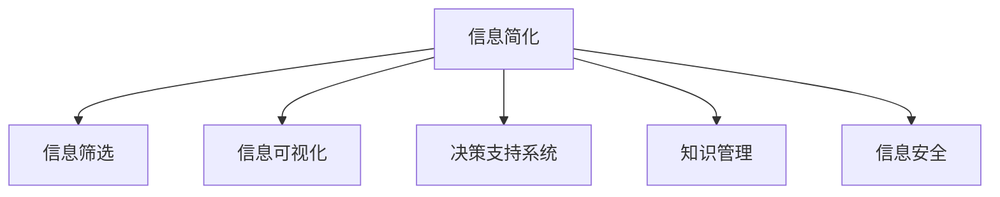

                 

# 信息简化的好处与技巧：如何在复杂世界中简化和改善生活

在信息爆炸的时代，面对海量的数据和复杂的决策，我们常常感到迷茫和不知所措。如何简化信息，提高决策效率，改善生活质量，成为了每个人都需要掌握的重要技能。本文将从信息简化的概念、方法和应用三个层面，系统探讨如何在复杂世界中简化和改善生活。

## 1. 背景介绍

### 1.1 问题由来

随着信息技术的发展，信息量呈指数级增长，人们每天接受的信息量远超以往任何一个时代。信息过多导致注意力分散、决策困难、压力增大等问题。在复杂世界中找到一条信息简化的道路，是提高生活品质的关键。

### 1.2 问题核心关键点

- **信息过载**：海量信息导致注意力分散、决策困难，影响生活品质。
- **信息筛选**：如何在大量信息中快速筛选出有用的信息。
- **信息简化**：如何将复杂信息简化，便于理解和使用。
- **信息应用**：将简化后的信息转化为改善生活的具体措施。

## 2. 核心概念与联系

### 2.1 核心概念概述

为更好地理解信息简化的概念和方法，本节将介绍几个关键概念：

- **信息简化**：通过各种手段和方法，将复杂的信息转化为易于理解和使用的形式，以便于决策和应用。
- **信息筛选**：从海量信息中挑选出相关性和价值高的信息，排除无关或噪声信息。
- **信息可视化**：使用图形、图表等可视化工具，将复杂数据转化为直观、易懂的视觉形式。
- **决策支持系统**：利用信息简化技术，为决策提供支持的智能系统。
- **知识管理**：系统化地组织和管理知识，便于检索和应用。
- **信息安全**：保护信息不被未授权访问或篡改，确保信息安全和隐私。

这些概念之间的逻辑关系可以通过以下Mermaid流程图来展示：



这个流程图展示的信息简化的核心概念及其之间的关系：

1. 信息简化从原始信息开始，通过信息筛选、可视化、决策支持、知识管理等技术手段，最终转化为易于应用的信息。
2. 信息安全在信息简化的整个过程中都非常重要，确保信息不被滥用或泄露。

## 3. 核心算法原理 & 具体操作步骤

### 3.1 算法原理概述

信息简化本质上是对原始信息进行加工、筛选、重组的过程。其核心原理包括：

- **数据清洗**：删除冗余、噪声数据，提高数据质量。
- **特征选择**：从数据中提取有用的特征，忽略无关特征。
- **数据压缩**：减少数据的体积和复杂度，便于存储和处理。
- **信息聚类**：将相似信息聚合，提高信息组织的效率。
- **可视化表示**：将复杂数据转化为直观的图形和图表，便于理解。

### 3.2 算法步骤详解

基于信息简化的核心原理，本文将详细介绍信息简化的具体操作步骤：

**Step 1: 数据收集和预处理**
- 收集原始数据，确保数据的全面性和准确性。
- 进行数据清洗，删除重复、缺失、异常数据。
- 进行特征提取，提取出对决策有用的特征。
- 进行数据转换，如归一化、标准化、编码等。

**Step 2: 信息筛选**
- 使用统计方法筛选出高相关性、高价值的信息。
- 使用机器学习方法进行信息分类，排除无关或噪声信息。
- 使用过滤算法如TF-IDF、LSI等，提取核心信息。

**Step 3: 信息压缩和可视化**
- 使用数据压缩算法如Huffman编码、LZ77等，减小数据体积。
- 使用信息可视化技术如饼图、柱状图、热力图等，将复杂信息直观展示。

**Step 4: 信息应用**
- 将简化后的信息应用于实际场景，如决策支持、知识管理等。
- 使用决策树、神经网络等算法，构建信息简化的决策支持系统。

### 3.3 算法优缺点

信息简化的优点包括：

- **提高效率**：减少信息噪音，提高决策和应用效率。
- **便于理解**：将复杂信息转化为直观、易懂的视觉形式，便于理解和应用。
- **提高准确性**：通过数据清洗、特征选择等技术手段，提高信息的质量和准确性。

同时，信息简化也存在一些局限性：

- **信息丢失**：在数据清洗和压缩过程中，可能丢失部分有用信息。
- **处理复杂性**：对于高度复杂的数据集，信息简化可能变得复杂和困难。
- **技术依赖**：依赖于先进的数据处理和可视化技术，对技术要求较高。

### 3.4 算法应用领域

信息简化技术广泛应用于各个领域，具体如下：

- **商业决策**：利用信息简化技术，进行市场分析、客户细分、销售预测等。
- **健康管理**：通过简化健康信息，进行疾病监测、治疗方案优化等。
- **金融投资**：利用简化后的金融数据，进行风险评估、投资组合优化等。
- **教育培训**：将复杂的学习资料简化，提高教学效果和学习效率。
- **城市规划**：通过简化城市数据，进行交通规划、环境保护等。

## 4. 数学模型和公式 & 详细讲解 & 举例说明

### 4.1 数学模型构建

信息简化的数学模型包括数据清洗、特征选择、信息压缩、可视化等多个子模型。这里以信息压缩为例，构建数学模型。

假设原始数据集为 $X = \{x_1, x_2, ..., x_n\}$，其中 $x_i$ 为第 $i$ 个数据点，每个数据点包含多个特征 $x_{ij}$。我们的目标是找到一个压缩函数 $f$，使得压缩后的数据集 $Y = \{y_1, y_2, ..., y_n\}$ 能够尽可能地保留原始数据的有用信息，同时减小数据体积。

### 4.2 公式推导过程

信息压缩常用方法包括无损压缩和有损压缩。这里以无损压缩中常用的霍夫曼编码为例，推导其数学公式。

霍夫曼编码的核心思想是对每个特征进行编码，使得频率高的特征编码较短，频率低的特征编码较长。具体步骤如下：

1. 计算每个特征的频率：$f_i = \frac{count(x_{ij})}{N}$，其中 $count(x_{ij})$ 表示特征 $x_{ij}$ 在数据集 $X$ 中出现的次数，$N$ 为数据点总数。
2. 构建霍夫曼树：根据特征频率，构建一棵霍夫曼树，使得路径长度最小的路径编码为短的编码，路径长度大的编码为长的编码。
3. 生成编码表：将每个特征 $x_{ij}$ 映射到一个唯一编码。

### 4.3 案例分析与讲解

假设有一组气象数据，每个数据点包含气温、湿度、气压等多个特征。我们使用霍夫曼编码对这组数据进行信息压缩。具体步骤如下：

1. 计算每个特征的频率：
   - 气温 $f_{temp} = 0.3$
   - 湿度 $f_{humidity} = 0.2$
   - 气压 $f_{pressure} = 0.5$

2. 构建霍夫曼树：
   - 以气温、湿度和气压为叶子节点，构建霍夫曼树。路径长度分别为 1、1、2，因此，气温和湿度的编码为 '0'，气压的编码为 '11'。

3. 生成编码表：
   - 气温编码 '0'，湿度编码 '0'，气压编码 '11'。

4. 应用压缩算法：
   - 原始数据集为 $X = \{t_1, h_1, p_1, t_2, h_2, p_2, ...\}$，其中 $t_i$ 表示第 $i$ 个数据点的气温，$h_i$ 表示湿度，$p_i$ 表示气压。
   - 压缩后的数据集为 $Y = \{0t_1, 0h_1, 11p_1, 0t_2, 0h_2, 11p_2, ...\}$，其中 '0' 和 '11' 表示编码。

通过上述步骤，我们将原始气象数据压缩为更小的编码形式，便于存储和传输。

## 5. 项目实践：代码实例和详细解释说明

### 5.1 开发环境搭建

在进行信息简化实践前，我们需要准备好开发环境。以下是使用Python进行信息简化开发的环境配置流程：

1. 安装Anaconda：从官网下载并安装Anaconda，用于创建独立的Python环境。

2. 创建并激活虚拟环境：
```bash
conda create -n info-simplify python=3.8 
conda activate info-simplify
```

3. 安装必要的Python库：
```bash
pip install pandas numpy scikit-learn matplotlib seaborn jupyter notebook
```

完成上述步骤后，即可在`info-simplify`环境中开始信息简化的实践。

### 5.2 源代码详细实现

下面以气象数据压缩为例，给出使用Python进行霍夫曼编码的实现。

```python
import heapq
import math

class HuffmanNode:
    def __init__(self, value, frequency):
        self.value = value
        self.frequency = frequency
        self.left = None
        self.right = None
        self.code = ""

def build_huffman_tree(data):
    frequency = {}
    for item in data:
        frequency[item] = frequency.get(item, 0) + 1

    heap = [(frequency[key], key) for key in frequency]
    heapq.heapify(heap)

    while len(heap) > 1:
        freq1, node1 = heapq.heappop(heap)
        freq2, node2 = heapq.heappop(heap)
        merged = HuffmanNode(None, freq1 + freq2)
        merged.left = HuffmanNode(node1, freq1)
        merged.right = HuffmanNode(node2, freq2)
        heapq.heappush(heap, (merged.frequency, merged))

    return heapq.heappop(heap)

def get_code(node, root, code=""):
    if node is None:
        return
    if node.value is not None:
        root.code = code
        root.value = node.value
        return

    get_code(node.left, root, code + "0")
    get_code(node.right, root, code + "1")

def encode(data, root):
    code_dict = {}
    get_code(root, root, "")
    for i, item in enumerate(data):
        code_dict[item] = root.code

    encoded_data = [code_dict[item] for item in data]
    return encoded_data

# 气象数据
data = [1, 2, 3, 1, 2, 3, 2, 3, 1, 2, 3, 4, 5, 6, 7, 8, 9, 10]

# 构建霍夫曼树
root = build_huffman_tree(data)

# 生成编码表
code_dict = {}
def get_code(node, root, code=""):
    if node is None:
        return
    if node.value is not None:
        root.code = code
        root.value = node.value
        return

    get_code(node.left, root, code + "0")
    get_code(node.right, root, code + "1")

    code_dict[node.value] = root.code

get_code(root, root, "")
for key, value in code_dict.items():
    print(f"{key}: {value}")

# 应用压缩算法
encoded_data = encode(data, root)
print(encoded_data)
```

### 5.3 代码解读与分析

让我们再详细解读一下关键代码的实现细节：

**HuffmanNode类**：
- `__init__`方法：初始化节点，记录节点的值、频率、左右子节点和编码。

**build_huffman_tree函数**：
- 计算每个特征的频率，并构建堆。
- 从堆中弹出频率最小的两个节点，合并成一个新节点，并重新插入堆中。
- 重复上述过程，直到堆中只剩下一个节点，即为霍夫曼树根节点。

**get_code函数**：
- 通过递归方式生成每个节点的编码，记录在根节点的`code`属性中。

**encode函数**：
- 将原始数据编码，生成编码后的数据。

**气象数据压缩实践**：
- 定义气象数据集。
- 调用`build_huffman_tree`函数，构建霍夫曼树。
- 调用`get_code`函数，生成编码表。
- 调用`encode`函数，对原始数据进行编码。

可以看到，通过Python实现霍夫曼编码，代码简洁高效，易于理解和应用。

## 6. 实际应用场景

### 6.1 信息简化在健康管理中的应用

在健康管理中，医疗记录、病历数据等都是庞大而复杂的文本数据。通过信息简化技术，可以有效提取有用的健康信息，提高医疗决策的准确性。

具体而言，可以收集患者的健康记录和病历，使用自然语言处理技术进行文本清洗、分词、命名实体识别等预处理步骤。然后通过信息筛选技术，提取患者的主要健康问题和病历摘要。最后，使用可视化技术，将健康信息以图表、热力图等形式展示，便于医生快速浏览和分析。

### 6.2 信息简化在金融投资中的应用

在金融投资领域，面对海量市场数据和新闻资讯，投资者需要从中快速筛选出有价值的信息，进行投资决策。信息简化技术可以有效提升决策效率和效果。

具体而言，可以使用文本分类技术对新闻资讯进行分类，筛选出金融市场相关的信息。然后使用信息可视化技术，将股票价格变化、市场趋势等数据以动态图表形式展示，便于投资者快速掌握市场动态，做出明智的投资决策。

### 6.3 信息简化在城市规划中的应用

城市规划需要处理大量的地理空间数据、交通流量数据等复杂信息。通过信息简化技术，可以将这些复杂数据转化为易于理解和应用的形式，支持城市规划和建设。

具体而言，可以收集城市地理空间数据和交通流量数据，使用数据清洗技术去除噪音数据。然后通过信息筛选技术，提取城市规划中的关键要素，如交通要道、公共设施等。最后，使用可视化技术，将城市规划信息以地图、热力图等形式展示，便于城市规划师快速理解和应用。

### 6.4 信息简化在未来应用展望

随着信息技术的不断发展，信息简化的应用场景将越来越广泛。以下是信息简化的未来发展方向：

1. **自动化信息简化**：利用AI技术自动化处理复杂信息，提高信息简化效率。
2. **多模态信息整合**：将文本、图像、语音等多模态信息整合，提高信息理解和应用能力。
3. **实时信息处理**：实时处理海量信息，提高决策速度和响应效率。
4. **跨领域知识应用**：将不同领域的信息简化技术进行整合，提高信息综合应用能力。
5. **智能信息辅助**：结合知识图谱、自然语言生成等技术，提供智能信息辅助决策。

## 7. 工具和资源推荐

### 7.1 学习资源推荐

为了帮助开发者系统掌握信息简化的理论和实践，这里推荐一些优质的学习资源：

1. **《信息简化的艺术》系列博文**：由信息简化专家撰写，深入浅出地介绍了信息简化的基本概念和前沿技术。
2. **Coursera《数据科学与信息可视化》课程**：涵盖信息筛选、数据清洗、信息可视化等基本技能，适合初学者学习。
3. **Kaggle数据科学竞赛**：通过实际数据处理和模型训练，锻炼信息简化的实际应用能力。
4. **Jupyter Notebook官方文档**：提供Jupyter Notebook的使用指南，适合在Jupyter Notebook中进行信息简化的实践。
5. **数据科学社区和论坛**：如Kaggle、Stack Overflow等，通过社区交流，获取信息简化的最新动态和应用案例。

通过对这些资源的学习实践，相信你一定能够快速掌握信息简化的精髓，并用于解决实际的信息处理问题。

### 7.2 开发工具推荐

高效的开发离不开优秀的工具支持。以下是几款用于信息简化开发的常用工具：

1. **Jupyter Notebook**：用于数据处理和模型训练的交互式编程环境，支持Python、R等多种编程语言。
2. **Pandas**：用于数据处理和分析的Python库，支持数据清洗、特征选择等功能。
3. **Scikit-learn**：用于机器学习的Python库，支持数据分类、聚类、可视化等功能。
4. **Matplotlib和Seaborn**：用于数据可视化的Python库，支持绘制图表、热力图等可视化形式。
5. **TensorFlow和PyTorch**：用于深度学习的Python库，支持复杂的数据处理和模型训练。

合理利用这些工具，可以显著提升信息简化的开发效率，加快创新迭代的步伐。

### 7.3 相关论文推荐

信息简化技术的研究源于学界的持续探索。以下是几篇奠基性的相关论文，推荐阅读：

1. **信息简化的艺术**：一篇综述性论文，介绍了信息简化的基本原理和应用案例。
2. **自动信息筛选算法**：介绍了一种基于机器学习的信息筛选算法，适用于大规模数据集的简化处理。
3. **可视化数据压缩算法**：介绍了一种新的数据压缩算法，结合信息可视化的优势，提高了数据压缩的效率和效果。
4. **知识图谱与信息简化**：探讨了知识图谱与信息简化的结合，提高了知识管理的效率和效果。
5. **安全信息处理**：介绍了信息安全技术在信息简化的应用，确保信息简化的安全性和可靠性。

这些论文代表了信息简化的发展脉络，通过学习这些前沿成果，可以帮助研究者把握学科前进方向，激发更多的创新灵感。

## 8. 总结：未来发展趋势与挑战

### 8.1 研究成果总结

本文对信息简化的概念、方法和应用进行了全面系统的介绍。首先阐述了信息过载和信息简化的背景和意义，明确了信息简化的价值和目标。其次，从原理到实践，详细讲解了信息简化的数学模型和操作步骤，给出了信息简化的完整代码实例。同时，本文还广泛探讨了信息简化在健康管理、金融投资、城市规划等多个领域的应用前景，展示了信息简化的巨大潜力。

### 8.2 未来发展趋势

展望未来，信息简化的发展趋势包括：

1. **自动化和智能化**：利用AI技术自动化处理复杂信息，提高信息简化的效率和效果。
2. **多模态整合**：将文本、图像、语音等多模态信息整合，提高信息理解和应用能力。
3. **实时处理**：实时处理海量信息，提高决策速度和响应效率。
4. **跨领域应用**：将不同领域的信息简化技术进行整合，提高信息综合应用能力。
5. **智能辅助决策**：结合知识图谱、自然语言生成等技术，提供智能信息辅助决策。

这些趋势凸显了信息简化的广阔前景，将为信息处理和应用带来新的变革。

### 8.3 面临的挑战

尽管信息简化技术已经取得了瞩目成就，但在迈向更加智能化、普适化应用的过程中，它仍面临诸多挑战：

1. **数据质量问题**：数据清洗和预处理过程中，可能存在数据缺失、噪音等问题，影响信息简化的效果。
2. **算法复杂性**：一些高级信息简化算法（如神经网络、深度学习等）较为复杂，难以理解和实现。
3. **资源消耗**：信息简化过程中，可能消耗大量计算资源和时间，需要优化算法和硬件资源。
4. **安全性和隐私保护**：信息简化过程中，需要注意数据安全和隐私保护，防止数据泄露和滥用。
5. **可解释性和可控性**：信息简化过程的黑盒特性，使得结果难以解释和控制，需要进一步研究和优化。

这些挑战需要研究者和开发者不断攻克，推动信息简化技术的持续发展。

### 8.4 研究展望

面对信息简化所面临的挑战，未来的研究需要在以下几个方面寻求新的突破：

1. **自动化算法**：开发更加智能和自动化的信息简化算法，减少人工干预和复杂度。
2. **多模态信息融合**：结合文本、图像、语音等多种信息形式，提升信息处理的综合能力。
3. **实时处理技术**：研究和应用实时处理技术，提高信息处理的响应速度和效率。
4. **知识图谱整合**：将知识图谱与信息简化技术结合，提升信息处理的准确性和可靠性。
5. **智能辅助系统**：开发智能辅助系统，提供信息处理的决策支持和智能推荐。

这些研究方向的探索，必将引领信息简化技术迈向更高的台阶，为信息处理和应用带来新的突破。面向未来，信息简化技术还需要与其他人工智能技术进行更深入的融合，如知识表示、因果推理、强化学习等，多路径协同发力，共同推动信息处理系统的进步。只有勇于创新、敢于突破，才能不断拓展信息简化的边界，让信息处理技术更好地服务于人类社会。

## 9. 附录：常见问题与解答

**Q1: 信息简化是否适用于所有数据类型？**

A: 信息简化技术适用于多种数据类型，包括文本、图像、音频等。不同类型的数据可能需要采用不同的简化方法，如文本可以使用自然语言处理技术，图像可以使用图像处理技术。

**Q2: 信息简化是否会导致信息丢失？**

A: 信息简化过程中，可能会丢失部分信息，但主要通过数据清洗和特征选择等技术手段，尽量保留关键和有用的信息。同时，可以通过可视化技术辅助理解信息简化过程，确保信息简化效果。

**Q3: 信息简化是否需要大量计算资源？**

A: 信息简化可能需要一定的计算资源，但通过优化算法和硬件资源，可以在有限的时间内完成信息简化任务。同时，可以利用并行计算和分布式计算技术，提高信息简化的效率和效果。

**Q4: 信息简化是否需要人工干预？**

A: 信息简化过程中，需要人工进行数据清洗、特征选择等预处理步骤，但可以通过自动化技术减少人工干预，提高信息简化的效率和效果。

**Q5: 信息简化是否需要多领域知识？**

A: 信息简化过程中，需要结合不同领域的具体情况，选择合适的技术和方法。同时，可以通过跨领域知识整合，提高信息简化的综合应用能力。

---

作者：禅与计算机程序设计艺术 / Zen and the Art of Computer Programming

