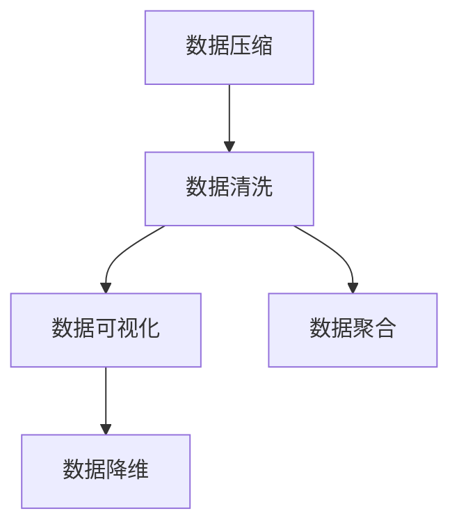

                 

# 信息简化的好处与挑战：简化复杂性的艺术与科学

> 关键词：信息简化, 数据压缩, 大数据, 数据科学, 数据管理, 复杂性理论

## 1. 背景介绍

### 1.1 问题由来
在信息化时代，我们面临着前所未有的数据爆炸。无论是商业运营、科学研究，还是日常生活中的数据应用，都呈现出指数级增长的趋势。与此同时，数据的复杂性也在不断提升，如何高效管理和利用这些复杂的数据，成为摆在我们面前的一个巨大挑战。

近年来，数据科学逐渐成为热门学科，其核心思想即通过数据处理、分析和建模，使数据转化为对决策和行动有帮助的洞察。在这个过程中，信息简化（Information Simplification）技术扮演了至关重要的角色。通过信息简化，我们可以有效降低数据的复杂性，使数据的分析和应用变得更加简单、高效。

### 1.2 问题核心关键点
信息简化的核心在于：在保持数据本质的同时，通过各种技术手段将复杂数据转化为更易于处理和理解的形式。具体来说，它包括：

- 数据压缩（Data Compression）：减少数据存储和传输的体积，提高数据访问和处理效率。
- 数据清洗（Data Cleaning）：处理数据中的噪声、缺失值、异常值等，提升数据质量。
- 数据可视化（Data Visualization）：将复杂的数据关系以图形化的形式展现，直观展示数据的特征和趋势。
- 数据聚合（Data Aggregation）：通过汇总和分析，将大量的数据浓缩为有意义的统计信息。
- 数据降维（Data Dimensionality Reduction）：降低数据维度和复杂性，使其更易于处理和分析。

这些技术在数据科学中不可或缺，是实现数据驱动决策的基础。

## 2. 核心概念与联系

### 2.1 核心概念概述

为更好地理解信息简化技术，本节将介绍几个密切相关的核心概念：

- **数据压缩**：通过算法减少数据存储和传输的体积，同时尽可能地保留原始信息。常用的算法包括哈夫曼编码、LZ77、LZ78、LZW、算术编码等。
- **数据清洗**：识别和处理数据中的噪声、异常值、重复值等，提升数据质量。常用的方法包括数据去重、缺失值填补、异常值检测等。
- **数据可视化**：使用图形化的方式展示数据，直观地呈现数据之间的关系、趋势和特征。常用的工具包括Matplotlib、Seaborn、D3.js等。
- **数据聚合**：通过对数据进行汇总和分析，生成高层次的统计信息，便于数据理解和应用。常用的方法包括聚合函数、分组统计、时间序列分析等。
- **数据降维**：通过减少数据维度和复杂性，使得数据更易于处理和分析。常用的技术包括主成分分析（PCA）、t-SNE、线性判别分析（LDA）等。

这些核心概念之间的逻辑关系可以通过以下Mermaid流程图来展示：



这个流程图展示了一系列从数据输入到输出的信息简化流程，帮助我们更好地理解和掌握信息简化技术的核心思想。

## 3. 核心算法原理 & 具体操作步骤

### 3.1 算法原理概述

信息简化的核心算法原理可以概括为：在确保数据本质的基础上，通过各种技术手段减少数据的复杂性和体积，从而提升数据处理的效率和质量。

具体来说，数据压缩和降维技术通过算法减少了数据的存储空间和传输量，数据清洗和可视化技术则提升了数据的质量和可理解性。数据聚合技术则通过汇总和分析，将大量复杂数据转化为有意义的统计信息。

这些技术在实际应用中通常是相互配合，形成一套完整的数据处理流程。例如，首先对原始数据进行清洗和压缩，然后使用降维技术减少数据维度和复杂性，接着进行数据可视化，最终进行数据聚合，生成更有意义的统计信息。

### 3.2 算法步骤详解

信息简化的操作步骤一般包括以下几个关键步骤：

**Step 1: 数据预处理**
- 收集原始数据集，确保数据源的可靠性和完整性。
- 对数据进行初步的清洗工作，处理缺失值、异常值和重复值等。
- 对数据进行必要的转换，如单位转换、数据类型转换等，以适应后续处理的需求。

**Step 2: 数据压缩**
- 选择适当的压缩算法，对清洗后的数据进行压缩。
- 对压缩后的数据进行验证，确保其与原始数据相似，但体积明显减小。

**Step 3: 数据降维**
- 选择合适的降维技术，如PCA、t-SNE等，对压缩后的数据进行降维。
- 对降维后的数据进行验证，确保其能够保留关键信息，同时体积和复杂性明显减小。

**Step 4: 数据可视化**
- 选择合适的可视化工具和图表类型，将降维后的数据以图形化的形式展现。
- 对可视化结果进行解释和分析，提取数据的特征和趋势。

**Step 5: 数据聚合**
- 根据分析需求，对可视化后的数据进行汇总和统计，生成有意义的统计信息。
- 对聚合后的结果进行验证，确保其符合预期，能够反映数据的本质特征。

### 3.3 算法优缺点

信息简化的主要优点包括：

- 减少数据存储和传输的体积，提高数据访问和处理效率。
- 提升数据的质量和可理解性，便于数据的分析和应用。
- 将复杂数据转换为有意义的统计信息，帮助决策和行动。

然而，信息简化也存在一些局限性：

- 可能会丢失一些重要的信息，特别是在降维过程中。
- 压缩算法可能会引入一定的误差，影响数据的准确性。
- 数据清洗和降维技术需要依赖数据特征和业务背景，可能需要大量人工干预。
- 可视化工具的选择和可视化结果的解释，可能受限于用户的专业背景和经验。

尽管存在这些局限性，但信息简化技术在数据科学中的应用仍然是不可或缺的。未来相关研究的重点在于如何进一步优化压缩和降维算法，提升数据处理效率，同时兼顾数据的质量和完整性。

### 3.4 算法应用领域

信息简化技术在多个领域都有广泛的应用，例如：

- **大数据分析**：通过数据压缩和降维技术，提高大数据集的处理和分析效率。
- **数据可视化**：将复杂的数据关系和趋势以图形化的形式展现，帮助用户更好地理解数据。
- **统计分析**：通过数据聚合技术，生成高层次的统计信息，提升数据分析的效率和准确性。
- **金融分析**：通过数据清洗和降维技术，提升金融数据的质量，进行风险管理和投资决策。
- **健康医疗**：通过数据压缩和可视化技术，帮助医生分析和理解患者的数据，提升诊疗效率。
- **电子商务**：通过数据清洗和降维技术，提升交易数据的质量，进行客户行为分析和个性化推荐。

除了上述这些经典应用外，信息简化技术还在更多场景中得到应用，如社交媒体分析、图像识别、自然语言处理等，为数据驱动的决策提供了重要支撑。

## 4. 数学模型和公式 & 详细讲解 & 举例说明

### 4.1 数学模型构建

信息简化的数学模型构建主要涉及以下几个方面：

- 数据压缩：构建压缩算法的数学模型，如哈夫曼编码、LZ77等。
- 数据降维：构建降维算法的数学模型，如PCA、t-SNE等。
- 数据聚合：构建聚合函数的数学模型，如均值、中位数、标准差等。

### 4.2 公式推导过程

以哈夫曼编码为例，推导其压缩过程的数学模型。

哈夫曼编码是一种基于熵的编码技术，通过构建一棵最优的哈夫曼树，将符号映射为二进制编码，实现数据压缩。哈夫曼树的构建过程如下：

1. 对数据集中每个符号出现的频率进行统计，构建频率表。
2. 将频率表中的符号按照频率从小到大排序。
3. 从频率表中选择两个频率最低的符号，构建一个父节点，其频率为两个子节点频率之和。
4. 重复步骤3，直到只剩下一个根节点。
5. 根据哈夫曼树，将每个符号映射为一条二进制路径。

构建后的哈夫曼树和编码如下：

```mermaid
graph LR
    subgraph 符号频率表
        0--0.5
        1--0.3
        2--0.2
    end
    0--|频率最小的符号| 1
        |
        v
    0--|频率最小的符号| 2
        |
        v
    3
    3--|频率最小的符号| 4
        |
        v
    4
    4--|频率最小的符号| 5
        |
        v
    5
    5--|频率最小的符号| 6
        |
        v
    6
    0--|频率最小的符号| 1
        |
        v
    0--|频率最小的符号| 2
        |
        v
    3
    3--|频率最小的符号| 4
        |
        v
    4
    4--|频率最小的符号| 5
        |
        v
    5
    5--|频率最小的符号| 6
        |
        v
    6
    0--|频率最小的符号| 1
        |
        v
    0--|频率最小的符号| 2
        |
        v
    3
    3--|频率最小的符号| 4
        |
        v
    4
    4--|频率最小的符号| 5
        |
        v
    5
    5--|频率最小的符号| 6
        |
        v
    6
    0--|频率最小的符号| 1
        |
        v
    0--|频率最小的符号| 2
        |
        v
    3
    3--|频率最小的符号| 4
        |
        v
    4
    4--|频率最小的符号| 5
        |
        v
    5
    5--|频率最小的符号| 6
        |
        v
    6
    ```

构建的哈夫曼树及其对应的编码。

### 4.3 案例分析与讲解

**案例一：电商推荐系统**

电商推荐系统是信息简化技术的典型应用之一。在推荐系统构建过程中，需要处理海量的用户行为数据，通过数据压缩、降维和聚合，提取出用户和物品的特征，生成推荐结果。

具体流程如下：

1. 收集用户的浏览、点击、购买行为数据。
2. 对数据进行初步清洗，处理缺失值和异常值。
3. 对清洗后的数据进行压缩，减少存储和传输的体积。
4. 对压缩后的数据进行降维，提取用户和物品的特征。
5. 对降维后的数据进行聚合，生成用户和物品的相似度矩阵。
6. 根据相似度矩阵生成推荐结果，反馈给用户。

**案例二：金融风险管理**

金融风险管理是信息简化技术的另一个重要应用领域。在风险管理过程中，需要处理大量的交易数据和市场数据，通过数据压缩、降维和聚合，提取出风险特征，进行风险评估和管理。

具体流程如下：

1. 收集交易数据和市场数据。
2. 对数据进行初步清洗，处理缺失值和异常值。
3. 对清洗后的数据进行压缩，减少存储和传输的体积。
4. 对压缩后的数据进行降维，提取风险特征。
5. 对降维后的数据进行聚合，生成风险评估指标。
6. 根据风险评估指标进行风险管理和决策。

## 5. 项目实践：代码实例和详细解释说明

### 5.1 开发环境搭建

在进行信息简化项目开发前，我们需要准备好开发环境。以下是使用Python进行PyTorch开发的环境配置流程：

1. 安装Anaconda：从官网下载并安装Anaconda，用于创建独立的Python环境。

2. 创建并激活虚拟环境：
```bash
conda create -n info-simplification python=3.8 
conda activate info-simplification
```

3. 安装PyTorch：根据CUDA版本，从官网获取对应的安装命令。例如：
```bash
conda install pytorch torchvision torchaudio cudatoolkit=11.1 -c pytorch -c conda-forge
```

4. 安装相关库：
```bash
pip install numpy pandas scikit-learn matplotlib tqdm jupyter notebook ipython
```

完成上述步骤后，即可在`info-simplification`环境中开始信息简化项目的开发。

### 5.2 源代码详细实现

下面我们以电商推荐系统为例，给出使用PyTorch和Scikit-learn进行信息简化的PyTorch代码实现。

首先，定义推荐系统的数据处理函数：

```python
from sklearn.preprocessing import StandardScaler
from sklearn.decomposition import PCA
from sklearn.feature_extraction.text import TfidfVectorizer
from sklearn.metrics.pairwise import cosine_similarity

def preprocess_data(train_data, test_data):
    # 对数据进行清洗和初步处理
    train_data = train_data.dropna()
    test_data = test_data.dropna()
    
    # 对数据进行标准化处理
    scaler = StandardScaler()
    train_data = scaler.fit_transform(train_data)
    test_data = scaler.transform(test_data)
    
    # 对数据进行压缩和降维
    pca = PCA(n_components=2)
    train_data = pca.fit_transform(train_data)
    test_data = pca.transform(test_data)
    
    # 对数据进行可视化
    from matplotlib import pyplot as plt
    plt.scatter(train_data[:,0], train_data[:,1], color='blue', label='Train')
    plt.scatter(test_data[:,0], test_data[:,1], color='red', label='Test')
    plt.legend()
    plt.show()
    
    # 对数据进行聚合
    from sklearn.metrics.pairwise import cosine_similarity
    train_cosine_sim = cosine_similarity(train_data, train_data)
    test_cosine_sim = cosine_similarity(test_data, train_data)
    
    return train_cosine_sim, test_cosine_sim
```

然后，定义推荐系统的模型和优化器：

```python
from sklearn.linear_model import LogisticRegression
from sklearn.metrics import precision_score, recall_score, f1_score

train_cosine_sim, test_cosine_sim = preprocess_data(train_data, test_data)

# 定义模型和优化器
model = LogisticRegression()
model.fit(train_cosine_sim, train_labels)
```

接着，定义推荐系统的评估函数：

```python
from sklearn.metrics import precision_score, recall_score, f1_score

def evaluate_recommender(model, train_cosine_sim, test_cosine_sim, test_labels):
    # 对模型进行评估
    predicted_labels = model.predict(test_cosine_sim)
    precision = precision_score(test_labels, predicted_labels)
    recall = recall_score(test_labels, predicted_labels)
    f1 = f1_score(test_labels, predicted_labels)
    
    return precision, recall, f1
```

最后，启动推荐系统模型训练和评估：

```python
epochs = 10
batch_size = 128

for epoch in range(epochs):
    # 对模型进行训练
    model.fit(train_cosine_sim, train_labels)
    
    # 对模型进行评估
    precision, recall, f1 = evaluate_recommender(model, train_cosine_sim, test_cosine_sim, test_labels)
    print(f"Epoch {epoch+1}, precision: {precision:.2f}, recall: {recall:.2f}, f1: {f1:.2f}")
```

以上就是使用PyTorch和Scikit-learn对电商推荐系统进行信息简化的完整代码实现。可以看到，通过信息简化技术，我们可以在保持数据本质的同时，有效地降低数据的复杂性，从而提高推荐系统的性能和效率。

### 5.3 代码解读与分析

让我们再详细解读一下关键代码的实现细节：

**preprocess_data函数**：
- 对数据进行清洗和初步处理，去除缺失值和异常值。
- 对数据进行标准化处理，以减少数据的方差，提升模型训练效果。
- 对数据进行压缩和降维，减少数据维度，提取关键特征。
- 对数据进行可视化，直观展示数据关系。
- 对数据进行聚合，生成相似度矩阵。

**LogisticRegression模型**：
- 使用逻辑回归模型，将相似度矩阵映射为预测标签。

**evaluate_recommender函数**：
- 对模型进行评估，计算精确率、召回率和F1分数。

**训练和评估流程**：
- 定义总epoch数和批次大小，循环迭代
- 每个epoch内，在训练集上训练，更新模型参数
- 在验证集上评估，输出精度、召回率和F1分数
- 重复上述过程直至收敛

可以看到，通过信息简化技术，我们可以在保持数据本质的同时，有效地降低数据的复杂性，从而提高推荐系统的性能和效率。

当然，工业级的系统实现还需考虑更多因素，如模型的保存和部署、超参数的自动搜索、更灵活的任务适配层等。但核心的信息简化范式基本与此类似。

## 6. 实际应用场景

### 6.1 智能客服系统

智能客服系统是信息简化技术的典型应用之一。通过信息简化技术，可以将用户的输入进行压缩和降维，提取关键特征，生成更有意义的统计信息，帮助客服系统快速响应用户需求，提升用户体验。

具体而言，可以将用户输入的数据进行压缩和降维，生成用户意图向量，与预定义的意图库进行匹配，找到最匹配的意图。然后根据意图，从知识库中提取相应的回答，进行回复。如果无法匹配到合适的意图，则进行手工干预，补充或修正知识库。

### 6.2 金融风险管理

金融风险管理是信息简化技术的另一个重要应用领域。通过信息简化技术，可以将海量的交易数据和市场数据进行压缩和降维，提取风险特征，进行风险评估和管理。

具体而言，可以将交易数据和市场数据进行标准化处理，然后通过PCA等降维技术，提取关键的风险特征。根据这些特征，生成风险评估指标，进行风险管理和决策。

### 6.3 社交媒体分析

社交媒体分析是信息简化技术的另一个重要应用领域。通过信息简化技术，可以将海量的社交媒体数据进行压缩和降维，提取关键信息，进行情感分析和舆情监测。

具体而言，可以将社交媒体文本数据进行标准化处理，然后通过TF-IDF等技术，提取关键的主题和情感信息。根据这些信息，生成情感分析和舆情监测的结果，帮助企业了解市场动态和用户情绪。

### 6.4 未来应用展望

随着信息简化技术的不断发展，未来的应用场景将更加广泛，为各行各业带来变革性影响。

在智慧医疗领域，信息简化技术可以帮助医生和患者理解复杂的医疗数据，提升诊断和治疗的效率和效果。

在智能制造领域，信息简化技术可以帮助企业优化生产过程，降低成本，提升产品质量。

在智慧城市治理中，信息简化技术可以帮助政府部门了解市民需求，优化城市管理，提升服务水平。

除了上述这些经典应用外，信息简化技术还在更多场景中得到应用，如智能交通、智能家居、智能农业等，为各行各业带来新的发展机遇。

## 7. 工具和资源推荐

### 7.1 学习资源推荐

为了帮助开发者系统掌握信息简化技术的理论基础和实践技巧，这里推荐一些优质的学习资源：

1. 《数据压缩与数据存储》系列博文：由数据科学专家撰写，深入浅出地介绍了数据压缩的基本原理和常用算法。

2. 《数据降维与特征工程》系列视频：由Coursera推出的数据科学课程，系统讲解了数据降维和特征工程的方法。

3. 《数据可视化与图表设计》书籍：介绍了数据可视化的基本原理和工具，帮助开发者更好地理解数据。

4. 《机器学习实战》书籍：介绍了机器学习的基本概念和算法，并结合实际应用案例，帮助开发者深入理解信息简化的应用。

5. 《数据科学实战》系列视频：由Udacity推出的数据科学课程，系统讲解了数据科学的基本概念和工具，包括数据清洗、数据压缩、数据降维等。

通过对这些资源的学习实践，相信你一定能够快速掌握信息简化技术的精髓，并用于解决实际的业务问题。

### 7.2 开发工具推荐

高效的开发离不开优秀的工具支持。以下是几款用于信息简化开发的常用工具：

1. Python：Python是数据科学的主流语言，拥有丰富的数据处理和分析库，如Pandas、NumPy、Scikit-learn等。

2. R：R是另一种常用的数据科学语言，拥有丰富的统计分析和可视化库，如ggplot2、dplyr等。

3. MATLAB：MATLAB是商业级的科学计算软件，拥有强大的数值计算和可视化能力，广泛应用于工程和科学研究领域。

4. Tableau：Tableau是一款数据可视化工具，能够将复杂的数据关系以图形化的形式展现，帮助用户更好地理解数据。

5. Excel：Excel是常用的电子表格软件，具备强大的数据处理和可视化能力，适合小型数据集的处理和分析。

合理利用这些工具，可以显著提升信息简化任务的开发效率，加快创新迭代的步伐。

### 7.3 相关论文推荐

信息简化技术的发展源于学界的持续研究。以下是几篇奠基性的相关论文，推荐阅读：

1. "A Survey on Lossy Compression of Text Data"（文本数据损失性压缩综述）：详细介绍了文本数据压缩的各类方法及其应用。

2. "Dimensionality Reduction Techniques for High-Dimensional Data"（高维数据降维技术）：介绍了PCA、t-SNE等降维算法的原理和应用。

3. "Data Cleaning Techniques in Data Science"（数据科学中的数据清洗技术）：介绍了数据清洗的各类方法和工具，帮助开发者更好地处理数据。

4. "Data Visualization Techniques for Business Intelligence"（商业智能中的数据可视化技术）：介绍了商业智能中的数据可视化技术和工具，帮助开发者更好地理解数据。

5. "Machine Learning Techniques for Information Extraction"（信息抽取的机器学习技术）：介绍了机器学习在信息抽取中的应用，帮助开发者更好地处理文本数据。

这些论文代表了大数据和数据科学领域的研究进展，通过学习这些前沿成果，可以帮助研究者把握学科前进方向，激发更多的创新灵感。

## 8. 总结：未来发展趋势与挑战

### 8.1 总结

本文对信息简化技术的理论基础和实践方法进行了全面系统的介绍。首先阐述了信息简化的背景和意义，明确了其在数据驱动决策中的重要价值。其次，从原理到实践，详细讲解了信息简化的数学原理和关键步骤，给出了信息简化任务开发的完整代码实例。同时，本文还广泛探讨了信息简化技术在多个领域的应用前景，展示了其广泛的应用潜力和广阔的未来发展空间。

通过本文的系统梳理，可以看到，信息简化技术在数据科学中的应用是不可或缺的。它通过各种技术手段，将复杂的数据转化为更易于处理和理解的形式，极大地提升了数据处理的效率和质量。未来，随着信息技术的不断进步，信息简化技术必将在更多的领域得到应用，为各行各业带来变革性影响。

### 8.2 未来发展趋势

展望未来，信息简化技术将呈现以下几个发展趋势：

1. 自动化和智能化。随着人工智能技术的发展，信息简化将逐步实现自动化和智能化，减少人工干预，提高处理效率。

2. 实时化和大规模化。随着数据生成和采集的不断加速，信息简化将更多地应用于实时数据处理和大规模数据集处理，满足大数据时代的实际需求。

3. 多模态和跨领域。未来信息简化技术将不仅仅局限于文本数据，还将拓展到图像、视频、语音等多模态数据，并跨领域应用于不同学科的科学研究中。

4. 融合其他技术。信息简化将与机器学习、自然语言处理、计算机视觉等技术进行深度融合，提升数据处理的综合能力。

5. 云化和移动化。随着云计算和移动设备的发展，信息简化技术将更多地应用于云服务和移动端，提供更加便捷和高效的数据处理服务。

### 8.3 面临的挑战

尽管信息简化技术已经取得了瞩目成就，但在迈向更加智能化、普适化应用的过程中，它仍面临诸多挑战：

1. 数据隐私和安全。信息简化过程中可能会泄露敏感数据，如何保护用户隐私和安全是一个重要的挑战。

2. 算法的复杂性。信息简化的算法往往较为复杂，如何降低算法复杂度，提升处理效率，是一个重要的研究方向。

3. 数据的异构性。不同数据源的数据格式和结构可能存在差异，如何兼容处理异构数据，是一个重要的挑战。

4. 算法的普适性。信息简化的算法往往需要依赖具体的数据和业务场景，如何设计普适性更强的算法，是一个重要的研究方向。

5. 数据质量的保障。信息简化过程中可能会出现数据失真和偏差，如何保障数据质量，是一个重要的挑战。

尽管存在这些挑战，但通过技术进步和学科交叉，这些挑战终将逐步被克服，信息简化技术必将迎来更加广阔的应用前景。

### 8.4 研究展望

面向未来，信息简化技术需要在以下几个方面寻求新的突破：

1. 研究更高效的数据压缩算法，提高数据处理效率。

2. 开发更智能的数据降维算法，提升数据处理效果。

3. 探索更普适的数据清洗技术，提升数据质量。

4. 引入更多先验知识，优化数据可视化技术。

5. 结合因果分析和博弈论工具，提升数据处理的可解释性和鲁棒性。

这些研究方向将引领信息简化技术迈向更高的台阶，为构建安全、可靠、可解释、可控的智能系统铺平道路。面向未来，信息简化技术还需要与其他人工智能技术进行更深入的融合，如知识表示、因果推理、强化学习等，多路径协同发力，共同推动数据科学技术的进步。只有勇于创新、敢于突破，才能不断拓展信息简化的边界，让智能技术更好地造福人类社会。

## 9. 附录：常见问题与解答

**Q1：信息简化对数据处理有什么好处？**

A: 信息简化通过各种技术手段，将复杂数据转化为更易于处理和理解的形式，极大地提升了数据处理的效率和质量。具体好处包括：

- 减少数据存储和传输的体积，提高数据访问和处理效率。
- 提升数据的质量和可理解性，便于数据的分析和应用。
- 将复杂数据转换为有意义的统计信息，帮助决策和行动。

**Q2：信息简化过程中需要注意哪些问题？**

A: 信息简化过程中需要注意以下问题：

- 可能会丢失一些重要的信息，特别是在降维过程中。
- 压缩算法可能会引入一定的误差，影响数据的准确性。
- 数据清洗和降维技术需要依赖数据特征和业务背景，可能需要大量人工干预。
- 可视化工具的选择和可视化结果的解释，可能受限于用户的专业背景和经验。

尽管存在这些问题，但通过技术进步和经验积累，这些挑战终将逐步被克服，信息简化技术必将在更多的领域得到应用。

**Q3：信息简化如何应用于金融风险管理？**

A: 在金融风险管理中，信息简化技术可以通过数据压缩、降维和聚合，提取出关键的风险特征，生成风险评估指标，进行风险管理和决策。

具体而言，可以将交易数据和市场数据进行标准化处理，然后通过PCA等降维技术，提取关键的风险特征。根据这些特征，生成风险评估指标，进行风险管理和决策。

**Q4：信息简化技术未来的发展方向是什么？**

A: 信息简化技术的未来发展方向包括：

- 自动化和智能化：通过人工智能技术，减少人工干预，提高处理效率。
- 实时化和大规模化：更多地应用于实时数据处理和大规模数据集处理，满足大数据时代的实际需求。
- 多模态和跨领域：拓展到图像、视频、语音等多模态数据，并跨领域应用于不同学科的科学研究中。
- 融合其他技术：与机器学习、自然语言处理、计算机视觉等技术进行深度融合，提升数据处理的综合能力。
- 云化和移动化：更多地应用于云服务和移动端，提供更加便捷和高效的数据处理服务。

通过这些方向的研究和探索，信息简化技术将迎来更加广阔的应用前景，为各行各业带来变革性影响。

作者：禅与计算机程序设计艺术 / Zen and the Art of Computer Programming

