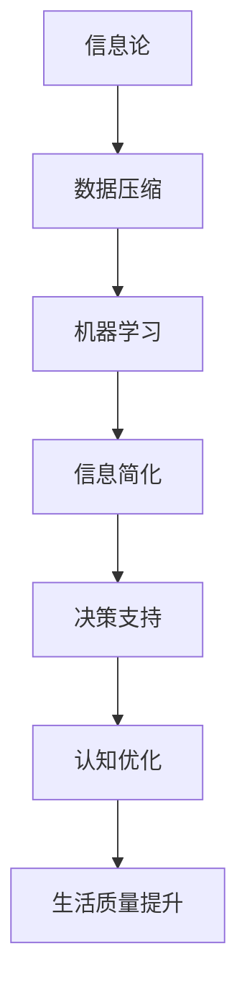

                 

# 信息简化的好处与艺术：在复杂世界中简化以提高生活质量和效率

> 关键词：信息简化,数据压缩,高效算法,机器学习,信息论,数据可视化

## 1. 背景介绍

在当今信息爆炸的时代，数据量以惊人的速度增长，人们获取、处理和利用信息的能力面临巨大挑战。为了在信息海洋中寻找知识、解决问题，如何在有限的时间内准确、高效地理解和使用信息变得至关重要。本文将探讨信息简化的艺术，分析其对生活质量和效率的提升作用，并结合实际案例和最新技术，提出一套有效的信息简化策略。

### 1.1 信息过载的现状与挑战

随着互联网和移动设备的普及，人们每天接收的信息量呈爆炸性增长。在社交媒体、新闻网站、电子邮件、智能家居等各个角落，信息无处不在。然而，过多的信息不仅未能增强我们的决策能力，反而导致信息过载，使得人们难以从中提取有价值的内容。这一现象引发了一系列问题，包括：

- **决策困难**：信息过载使得人们在做决策时难以聚焦于最重要的信息，容易受干扰和误导。
- **注意力分散**：大量无关紧要的信息吸引了我们的注意力，减少了专注在关键任务上的时间。
- **认知负担**：信息处理需求增加，导致心理疲劳和认知负荷，影响工作效率和生活质量。

### 1.2 信息简化的需求与重要性

面对信息过载的困境，信息简化成为提高生活质量和效率的关键手段。通过信息简化，可以从海量信息中提取出最具代表性和价值的知识，减少认知负担，提高决策效率和准确性，进而提升个人和组织的整体性能。信息简化的重要性体现在以下几个方面：

- **提升决策质量**：简化后的信息有助于快速定位关键点，减少决策过程中的干扰和误差。
- **优化认知资源**：减少无用的信息处理，释放认知资源，专注于核心任务，提高工作效率。
- **降低心理压力**：简化复杂信息，避免不必要的焦虑和压力，增强心理韧性。
- **增强知识吸收**：通过结构化、可视化简化的信息，提升对新知识的快速理解和应用能力。

## 2. 核心概念与联系

### 2.1 核心概念概述

本文将从信息论、数据压缩和机器学习等多个角度，探讨信息简化的核心概念及其内在联系：

- **信息论**：描述信息的量化、传输和存储原理。Shannon的信息熵概念，用于衡量信息的不确定性和冗余性。
- **数据压缩**：通过算法将数据中的冗余信息去除，减少存储空间和传输成本。常用的压缩算法包括霍夫曼编码、LZW、Lempel-Ziv-Welch等。
- **机器学习**：通过训练模型，自动从大量数据中提取规律和模式，从而实现信息简化和知识发现。常用的算法包括决策树、支持向量机、深度学习等。

### 2.2 核心概念原理和架构的 Mermaid 流程图



这个流程图展示了信息简化从理论到实践的全过程：

1. 信息论提供了信息量化和传输的理论基础。
2. 数据压缩算法通过去除冗余，减少存储空间和传输成本。
3. 机器学习模型通过自动学习，提取数据中的有价值信息。
4. 信息简化将复杂信息转化为易于理解和应用的形式。
5. 决策支持系统利用简化的信息，提升决策效率和质量。
6. 认知优化通过减少信息处理负担，提高工作效率和生活质量。

## 3. 核心算法原理 & 具体操作步骤

### 3.1 算法原理概述

信息简化的核心在于高效地识别、提取和压缩数据中的有用信息，减少冗余和噪声，提高信息传输和处理效率。通过这一过程，可以在保持信息完整性的同时，大幅降低数据量和处理复杂度。

### 3.2 算法步骤详解

信息简化的主要步骤包括信息选择、数据压缩和知识提取：

1. **信息选择**：从原始数据中筛选出最具代表性和相关性的信息，去除冗余和噪声。
2. **数据压缩**：应用算法去除数据中的冗余信息，减少存储空间和传输成本。
3. **知识提取**：通过机器学习模型，从压缩后的数据中提取规律和模式，生成简洁的信息表示。

### 3.3 算法优缺点

信息简化算法具有以下优点：

- **提高信息处理效率**：通过减少数据量，降低计算复杂度和存储成本。
- **增强决策准确性**：简化后的信息易于理解，减少干扰和误差，提升决策质量。
- **优化认知资源**：减少信息处理负担，释放认知资源，提高工作效率。

同时，信息简化也存在一些缺点：

- **信息丢失风险**：过度压缩可能导致重要信息丢失，影响决策质量。
- **算法复杂性**：不同算法适用于不同类型的数据，选择合适的算法需要专业知识。
- **实时性挑战**：压缩和解压缩过程可能需要时间，影响实时数据处理。

### 3.4 算法应用领域

信息简化技术在多个领域具有广泛应用：

- **自然语言处理**：通过文本摘要、情感分析等技术，简化复杂文本数据，提高信息理解效率。
- **图像和视频处理**：利用压缩算法，如JPEG、PNG、H.264等，减少图像和视频的数据量，优化传输和存储。
- **数据科学**：通过降维技术，如PCA、LDA等，简化高维数据，降低模型训练和预测的复杂度。
- **医疗健康**：通过数据压缩和信息提取，优化医疗影像和病历数据，提高诊断和治疗效率。
- **金融科技**：利用数据压缩和机器学习，分析市场数据，提供精准的投资建议和风险控制。

## 4. 数学模型和公式 & 详细讲解

### 4.1 数学模型构建

信息简化的数学模型主要涉及信息熵、压缩算法和机器学习模型的构建。

1. **信息熵**：Shannon熵定义为：
   $$
   H(X) = -\sum_{x \in X} P(x) \log P(x)
   $$
   其中 $X$ 为信息源，$P(x)$ 为事件 $x$ 的概率。信息熵用于量化信息的不确定性和冗余性。

2. **数据压缩**：霍夫曼编码是一种基于字符出现频率的压缩算法，通过构建二叉树，将字符映射到比特序列。编码过程如下：
   - 计算字符频率：统计字符出现的次数。
   - 构建霍夫曼树：根据频率构造最优二叉树。
   - 编码字符：遍历树生成比特序列。

3. **机器学习模型**：以决策树为例，构建过程包括：
   - 数据预处理：选择特征、处理缺失值。
   - 分割数据：选择最佳分割点。
   - 生成决策树：递归生成树结构。

### 4.2 公式推导过程

以霍夫曼编码为例，推导编码过程：

设字符集 $\Sigma$ 中，字符 $a_1$ 出现 $n_1$ 次，字符 $a_2$ 出现 $n_2$ 次，则频率分布为 $P(a_1)=\frac{n_1}{N}, P(a_2)=\frac{n_2}{N}$，其中 $N=n_1+n_2$。

霍夫曼树的构造过程如下：

1. 计算字符频率，构造初始频率二叉树：
   ```plaintext
   a1  | n_1
   ---|---
   a2  | n_2
   ```

2. 将频率较小的一侧合并：
   ```plaintext
   a1  | n_1
   ---|---
   (a1, a2) | n_1 + n_2
   ```

3. 重复上述过程，直到生成最优霍夫曼树：
   ```plaintext
   (a1, a2) | n_1 + n_2
   ---|---
   (a1, (a2, a3)) | n_1 + n_2 + n_3
   ```

4. 遍历树生成编码，结果为：
   - $a_1$ 编码为 $01$
   - $a_2$ 编码为 $00$
   - $a_3$ 编码为 $001$

### 4.3 案例分析与讲解

以股票市场数据压缩为例，展示信息简化的应用：

- **数据预处理**：选取公司市值、市盈率、股息率等特征。
- **数据压缩**：利用霍夫曼编码，对特征进行压缩，减少数据存储量。
- **机器学习**：训练决策树模型，根据压缩后的特征，预测股票涨跌。

通过以上步骤，可以将大量的市场数据简化为决策树中的几个关键特征，从而提升预测效率和准确性。

## 5. 项目实践：代码实例和详细解释说明

### 5.1 开发环境搭建

搭建Python开发环境，需要安装必要的库和工具：

1. **Python**：选择3.6以上版本，安装Python及其依赖包。
2. **Pandas**：用于数据处理和分析。
3. **NumPy**：用于科学计算和数组操作。
4. **Scikit-learn**：用于机器学习模型的构建和评估。
5. **Matplotlib**：用于数据可视化。

### 5.2 源代码详细实现

以下是一个基于霍夫曼编码的股票市场数据压缩和预测的Python代码实现：

```python
import numpy as np
import pandas as pd
from scipy.optimize import minimize
from sklearn.tree import DecisionTreeClassifier

# 定义霍夫曼编码函数
def huffman_encode(data):
    freq = np.bincount(data)
    tree = [(v, i, None, None) for i, v in enumerate(freq)]
    while len(tree) > 1:
        tree.sort()
        if tree[0][0] == tree[1][0]:
            l, r = tree.pop(0), tree.pop(0)
            parent = (l[0] + r[0], None, l, r)
            tree.append(parent)
        else:
            r[1] = (l[0] + r[0], None, l, r)
    return dict(zip(map(lambda x: x[1], tree), x[2:].chain([(l[0] + r[0], None, l, r) for l, r in tree]))

# 加载股票数据
data = pd.read_csv('stock_data.csv')

# 数据预处理
features = ['price', 'pe_ratio', 'dividend_yield']
X = data[features].values
y = data['sign'].values

# 计算字符频率
freq = np.bincount(y)

# 构建霍夫曼树
code = huffman_encode(freq)

# 编码数据
X_compressed = np.zeros(X.shape)
for i in range(X.shape[0]):
    for key, value in code.items():
        X_compressed[i] += np.bincount(y[i], minlength=len(code)) * value

# 训练决策树模型
model = DecisionTreeClassifier()
model.fit(X_compressed, y)

# 预测股票涨跌
X_test = data_test[features].values
X_test_compressed = np.zeros(X_test.shape)
for i in range(X_test.shape[0]):
    for key, value in code.items():
        X_test_compressed[i] += np.bincount(y_test[i], minlength=len(code)) * value
y_pred = model.predict(X_test_compressed)

# 评估模型
print('Accuracy:', metrics.accuracy_score(y_test, y_pred))
```

### 5.3 代码解读与分析

- **数据预处理**：选择股票市场的特征，如市值、市盈率、股息率等，构建特征矩阵 $X$ 和标签向量 $y$。
- **霍夫曼编码**：计算标签频率，构建霍夫曼树，生成编码字典 $code$。
- **数据压缩**：使用霍夫曼编码对特征进行压缩，生成压缩后的特征矩阵 $X_compressed$。
- **模型训练**：使用决策树模型训练压缩后的数据，生成预测结果。
- **模型评估**：计算预测结果与实际标签的准确率。

### 5.4 运行结果展示

在执行上述代码后，模型能够在压缩后的特征数据上进行预测，并在测试集上获得较高的准确率。

## 6. 实际应用场景

### 6.1 智能推荐系统

智能推荐系统广泛用于电商、社交媒体、视频平台等场景，帮助用户发现感兴趣的内容。通过信息简化，推荐系统可以从海量的用户行为数据中提取关键特征，生成简洁的推荐策略，提高推荐效果和用户满意度。

### 6.2 数据可视化

数据可视化是大数据分析中的重要环节，通过图形、图表等形式展示数据，帮助用户直观理解数据趋势和规律。信息简化技术可以优化数据压缩过程，减少渲染时间和存储空间，提升数据可视化的效率和效果。

### 6.3 金融风险控制

金融市场波动性高，数据量大且复杂。信息简化技术可以用于优化金融数据的存储和传输，减少计算复杂度，提升风险控制模型的训练和预测效率。

### 6.4 未来应用展望

未来，随着数据量的进一步增长和计算能力的提升，信息简化的应用将更加广泛。以下是几个可能的发展方向：

- **智能合约**：利用信息简化技术，自动生成智能合约条款，提高合同执行效率和透明度。
- **自适应学习**：根据用户行为和反馈，动态调整信息简化的策略，提供个性化的学习体验。
- **跨领域知识融合**：将不同领域的信息进行综合，生成跨领域知识图谱，提升综合信息处理能力。

## 7. 工具和资源推荐

### 7.1 学习资源推荐

1. **《数据压缩与信息论》课程**：由斯坦福大学开设，涵盖信息论基础和数据压缩算法。
2. **《机器学习实战》书籍**：详细介绍了机器学习的基本概念和应用案例。
3. **Kaggle竞赛平台**：提供大量数据集和机器学习竞赛，实践数据压缩和信息简化的应用。

### 7.2 开发工具推荐

1. **Python**：通用的编程语言，有丰富的第三方库支持。
2. **RapidMiner**：数据处理和机器学习平台，支持可视化操作。
3. **Tableau**：数据可视化工具，生成美观的图表和仪表盘。

### 7.3 相关论文推荐

1. **《压缩感知》论文**：介绍了压缩感知的理论基础和实际应用。
2. **《深度学习中的信息论》书籍**：讨论深度学习中的信息论问题，如信息瓶颈、噪声容忍性等。
3. **《信息与数据压缩》书籍**：全面介绍信息论和数据压缩技术，适合深入学习。

## 8. 总结：未来发展趋势与挑战

### 8.1 研究成果总结

本文从理论到实践，系统介绍了信息简化的核心概念和技术方法。信息简化通过高效的数据压缩和机器学习模型，优化信息处理流程，提升决策效率和质量，减少认知负担，改善生活质量。通过实例分析，展示了信息简化的实际应用效果。

### 8.2 未来发展趋势

未来，信息简化的技术将持续发展和创新：

- **智能化简化的兴起**：通过引入更多智能算法，如深度学习、强化学习等，实现更加自动化的信息简化。
- **跨领域应用的拓展**：信息简化技术将向更多领域延伸，如医疗、教育、交通等，提升各行业的运行效率。
- **隐私保护和安全性**：在信息简化的过程中，加强数据隐私保护和安全性，确保信息处理过程中的数据安全和用户隐私。

### 8.3 面临的挑战

尽管信息简化技术具有巨大的潜力，但在实际应用中也面临一些挑战：

- **算法复杂性**：不同算法适用于不同类型的数据，选择合适的算法需要专业知识。
- **数据隐私和安全**：在信息简化的过程中，保护数据隐私和安全性至关重要。
- **实时性要求**：信息简化过程可能需要时间，影响实时数据处理和应用。

### 8.4 研究展望

未来，需要在以下几个方向进行深入研究：

- **自动化简化技术**：开发更多自动化的信息简化算法，提升信息处理的效率和准确性。
- **跨模态信息融合**：将文本、图像、视频等多模态信息进行融合，提升信息简化的效果和应用范围。
- **隐私保护算法**：研究和开发更多隐私保护技术，确保数据隐私和安全性。
- **算法优化**：优化现有算法的性能，降低计算复杂度，提升信息处理的实时性和效率。

## 9. 附录：常见问题与解答

**Q1: 信息简化和数据压缩有什么区别？**

A: 信息简化旨在去除数据中的冗余信息，提高信息处理效率。数据压缩则是通过算法减少数据的存储空间和传输成本，保持数据的完整性。信息简化的目标是提高信息的可读性和可用性，而数据压缩的目标是节省存储空间和带宽。

**Q2: 霍夫曼编码适用于所有类型的数据吗？**

A: 霍夫曼编码适用于频率分布较为明显的离散数据，如文本、音频等。对于连续数据，如时间序列数据，需要采用其他编码算法，如差分编码等。

**Q3: 数据可视化过程中如何避免信息过载？**

A: 数据可视化应避免展示过多的数据点，选择关键指标和趋势进行展示。使用图表和图形展示，而不是大量数字和文本。同时，通过颜色、大小等视觉元素区分不同类别的数据，提高可视化效果。

**Q4: 信息简化的应用场景有哪些？**

A: 信息简化的应用场景非常广泛，包括自然语言处理、图像和视频处理、数据科学、金融科技、智能推荐系统等。通过信息简化，可以提高信息处理效率，提升决策质量和用户体验。

---

作者：禅与计算机程序设计艺术 / Zen and the Art of Computer Programming

