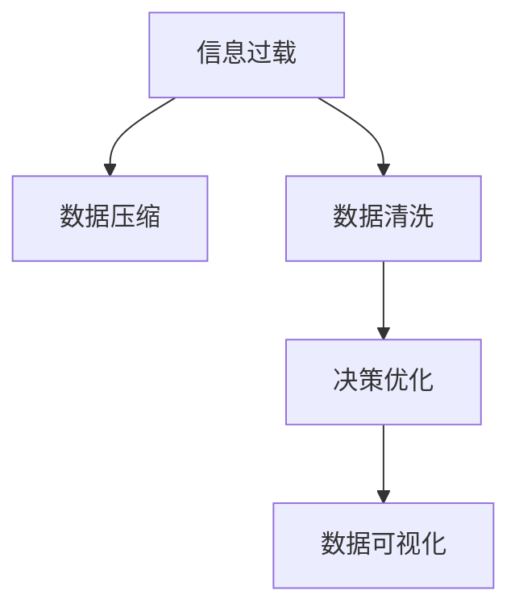

                 

# 信息简化的好处：在复杂世界中简化以改善决策和效率

> 关键词：信息简化, 数据压缩, 数据清洗, 决策优化, 数据可视化, 数据驱动, 信息传播

## 1. 背景介绍

### 1.1 问题由来

随着信息技术的发展，人们获取和处理的信息量呈爆炸性增长。这既带来了前所未有的机遇，也带来了巨大的挑战。在信息泛滥的背景下，如何从海量数据中提炼有价值的信息，并对其进行有效利用，成为了当下各行业、各领域都必须面对的重要课题。

与此同时，复杂的决策过程也愈发依赖于大量的数据支持。在传统的信息处理模式中，数据量大意味着信息量多，决策者可获得的洞察也更多。然而，这种思路在很多情况下并不适用，反而可能带来“信息过载”，即在面对大量冗余信息时，决策者难以分辨重要和次要的信息，导致信息处理的效率低下，甚至出现错误的决策。

为了解决这些问题，简化信息成为了一种迫切需求。在信息过载的时代，信息简化不仅有助于提升决策效率，还能减少错误决策的风险，使数据能够更好地服务于决策过程。

### 1.2 问题核心关键点

信息简化包括数据压缩、数据清洗、决策优化等多个方面。信息简化的核心在于提取关键信息，去除冗余，使得信息以更易理解、更高效的方式呈现。

具体来说，信息简化的关键点包括：
- **数据压缩**：在确保信息完整性不丢失的前提下，尽可能减小数据量，以提高处理效率。
- **数据清洗**：剔除数据中的噪声和错误，确保数据质量，提高分析的准确性。
- **决策优化**：通过简化的信息，辅助决策者做出更为精准、快速的决策。

信息简化在商业、政府、科学等多个领域都有广泛的应用，能够显著提升信息处理效率和决策质量。

## 2. 核心概念与联系

### 2.1 核心概念概述

为了更深刻地理解信息简化的本质，本节将介绍几个密切相关的核心概念：

- **信息过载**：指在面对大量信息时，决策者难以有效处理所有信息，导致决策质量下降的现象。
- **信息简化**：通过提取关键信息，去除冗余，使得信息以更易理解、更高效的方式呈现，从而提升决策效率和质量。
- **数据压缩**：在保持数据完整性的前提下，减小数据量，提高存储和传输效率。
- **数据清洗**：通过清洗、校验等手段，去除数据中的错误和噪声，确保数据质量。
- **决策支持系统**：利用信息简化的成果，辅助决策者做出更为精准、快速的决策。
- **数据可视化**：通过图形化手段，将复杂的数据转换为直观的视觉信息，辅助决策者理解数据。

这些核心概念之间存在着紧密的联系，共同构成了信息简化的理论基础和应用框架。理解这些概念，有助于把握信息简化的本质和实现方法。

### 2.2 核心概念原理和架构的 Mermaid 流程图(Mermaid 流程节点中不要有括号、逗号等特殊字符)



这个流程图展示了大规模信息处理中的核心步骤及其相互关系：

1. 信息过载的原始数据首先经过数据压缩，减小数据量。
2. 压缩后的数据经过数据清洗，去除错误和噪声，确保数据质量。
3. 清洗后的数据用于决策优化，辅助决策者快速做出决策。
4. 最终，优化后的数据通过数据可视化进行展示，帮助决策者直观理解。

这种数据处理流程不仅提升了信息处理的效率，还提高了决策的准确性和可靠性。

## 3. 核心算法原理 & 具体操作步骤

### 3.1 算法原理概述

信息简化算法旨在通过一系列处理步骤，将复杂的信息转换为易于理解、高效利用的形式。其核心思想是：在确保信息完整性的前提下，提取关键信息，去除冗余和噪声，从而提升信息处理的效率和决策的准确性。

形式化地，假设原始数据集为 $D=\{(x_i, y_i)\}_{i=1}^N$，其中 $x_i$ 为输入特征，$y_i$ 为标签。信息简化的目标是将数据集 $D$ 转化为简化后的数据集 $D'$，使得：

$$
D' = \{(s_i, y_i)\}_{i=1}^N
$$

其中 $s_i$ 为简化后的特征，满足以下条件：

- **信息完整性**：$s_i$ 能够充分反映 $x_i$ 的关键特征。
- **冗余去除**：$s_i$ 去除了 $x_i$ 中的冗余信息。
- **噪声抑制**：$s_i$ 去除或减少了 $x_i$ 中的噪声。

通过以上步骤，我们可以将原始数据集 $D$ 转换为简化后的数据集 $D'$，从而提升信息处理的效率和决策的准确性。

### 3.2 算法步骤详解

基于上述目标，信息简化的算法步骤通常包括以下几个关键步骤：

**Step 1: 数据预处理**
- 收集原始数据集 $D$，包括文本、图片、音频等。
- 对数据进行格式转换和初步清洗，去除明显的错误和噪声。

**Step 2: 数据压缩**
- 对预处理后的数据进行压缩，去除冗余信息，减小数据量。常用的压缩算法包括哈夫曼编码、LZW、LZ77、LZ78等。
- 根据具体需求，选择适合的压缩算法，确保压缩后数据信息的完整性。

**Step 3: 数据清洗**
- 对压缩后的数据进行更深入的清洗，去除数据中的噪声和错误。常用的数据清洗技术包括去重、填充缺失值、异常值处理等。
- 应用机器学习模型进行数据校验，自动识别和修正错误数据。

**Step 4: 特征提取**
- 从清洗后的数据中提取关键特征，去除冗余信息。常用的特征提取技术包括主成分分析(PCA)、线性判别分析(LDA)、特征选择等。
- 通过特征选择算法，选择最相关的特征，用于后续决策支持。

**Step 5: 决策支持**
- 将提取的关键特征应用于决策支持系统中，辅助决策者快速做出决策。常用的决策支持系统包括专家系统、决策树、支持向量机(SVM)等。
- 通过决策支持系统，根据输入的关键特征，生成决策建议。

**Step 6: 数据可视化**
- 将决策支持系统输出的结果进行数据可视化，直观展示决策结果。常用的数据可视化工具包括Tableau、Power BI、Matplotlib等。
- 通过图表、地图等方式，将复杂的信息转化为易于理解的视觉信息。

### 3.3 算法优缺点

信息简化算法具有以下优点：
1. 提高了信息处理的效率。通过去除冗余和噪声，减少了数据量，提升了数据处理的效率。
2. 提高了决策的准确性。通过提取关键特征，使得决策者能够更准确地理解数据。
3. 降低了数据存储和传输成本。通过压缩技术，减少了数据存储和传输所需的资源。
4. 简化了数据分析和展示。通过数据可视化，使得复杂的数据变得直观易理解。

同时，该算法也存在一定的局限性：
1. 压缩算法的选择较为复杂，需要根据具体场景选择合适的算法。
2. 数据清洗和特征提取依赖于数据质量和领域知识，可能存在一定的难度。
3. 压缩和清洗过程中可能丢失部分重要信息，需要谨慎处理。
4. 可视化结果可能存在误导，需要合理选择和设计可视化方式。

尽管存在这些局限性，信息简化算法仍是大规模数据处理和决策支持系统中的重要工具。

### 3.4 算法应用领域

信息简化算法在多个领域都有广泛的应用，具体包括：

- **商业决策**：通过简化信息，辅助企业决策者快速做出市场分析和战略决策。
- **政府治理**：利用信息简化技术，提升政府决策的科学性和效率，优化政策制定。
- **科学研究**：在复杂的科学研究中，通过简化信息，辅助研究人员分析和理解数据。
- **医疗诊断**：在医疗领域，简化患者数据，辅助医生快速做出诊断决策。
- **教育评估**：简化学生数据，辅助教育机构评估教学效果，改进教学方法。

除了以上这些领域外，信息简化技术还被应用于金融、物流、交通、制造等多个行业，成为提升信息处理效率和决策质量的重要手段。

## 4. 数学模型和公式 & 详细讲解 & 举例说明（备注：数学公式请使用latex格式，latex嵌入文中独立段落使用 $$，段落内使用 $)
### 4.1 数学模型构建

信息简化算法通常涉及多种数学模型和计算方法。以下以数据压缩为例，展示信息简化中常用的数学模型：

假设原始数据集 $D=\{(x_i, y_i)\}_{i=1}^N$，其中 $x_i$ 为输入特征，$y_i$ 为标签。信息简化的目标是将数据集 $D$ 转化为简化后的数据集 $D'$，使得 $D'$ 中的特征 $s_i$ 满足：

$$
s_i = f(x_i)
$$

其中 $f$ 为压缩函数，用于将 $x_i$ 映射为简化后的特征 $s_i$。

### 4.2 公式推导过程

以哈夫曼编码为例，展示数据压缩的数学推导过程。

哈夫曼编码是一种常用的数据压缩算法，其核心思想是通过构建哈夫曼树，将原始数据中的符号转换为二进制编码，减少数据量。哈夫曼树构建过程如下：

1. 统计每个符号出现的频率，构建一个节点集合 $N$。
2. 从 $N$ 中随机选择两个频率最小的节点 $u$ 和 $v$。
3. 将 $u$ 和 $v$ 合并为一个父节点 $p$，并更新节点的频率。
4. 重复步骤2和3，直到只剩下一个根节点 $R$。
5. 从根节点 $R$ 到每个叶子节点的路径，构成原始数据的哈夫曼编码。

哈夫曼编码的数学推导过程如下：

假设原始数据集 $D=\{(x_i, y_i)\}_{i=1}^N$，其中 $x_i$ 为输入特征，$y_i$ 为标签。设符号集为 $\Sigma$，每个符号的概率分布为 $P$。哈夫曼编码的压缩函数为：

$$
s_i = \langle c_1, c_2, \ldots, c_k \rangle
$$

其中 $c_j$ 为符号 $x_i$ 的哈夫曼编码。哈夫曼编码的压缩比为：

$$
\frac{\sum_{i=1}^N \log_2 |x_i|}{\sum_{i=1}^N \log_2 |s_i|}
$$

其中 $|x_i|$ 和 $|s_i|$ 分别为原始数据和压缩后数据的符号个数。

### 4.3 案例分析与讲解

以下以一个简单的文本数据压缩案例，展示信息简化算法的实际应用。

假设有一份原始文本数据集 $D=\{(x_i, y_i)\}_{i=1}^N$，其中 $x_i$ 为文本内容，$y_i$ 为文本类别。原始数据集中的文本内容如下：

```
text1: I am a programmer
text2: I love programming
text3: I hate programming
text4: Programming is fun
text5: Programming is hard
```

原始文本数据集中的每个文本长度为20个字符。我们需要使用哈夫曼编码对文本进行压缩。首先，统计每个文本出现的频率：

```
text1: 0.2
text2: 0.3
text3: 0.1
text4: 0.2
text5: 0.2
```

然后，构建哈夫曼树，得到每个文本的哈夫曼编码：

```
text1: 001
text2: 010
text3: 011
text4: 100
text5: 101
```

压缩后的文本数据集 $D'$ 中的每个文本长度为5个字符。通过哈夫曼编码，我们将原始文本数据集 $D$ 中的每个文本压缩为只有5个字符，压缩比约为75%。

## 5. 项目实践：代码实例和详细解释说明

### 5.1 开发环境搭建

在进行信息简化实践前，我们需要准备好开发环境。以下是使用Python进行PyTorch开发的环境配置流程：

1. 安装Anaconda：从官网下载并安装Anaconda，用于创建独立的Python环境。

2. 创建并激活虚拟环境：
```bash
conda create -n pytorch-env python=3.8 
conda activate pytorch-env
```

3. 安装PyTorch：根据CUDA版本，从官网获取对应的安装命令。例如：
```bash
conda install pytorch torchvision torchaudio cudatoolkit=11.1 -c pytorch -c conda-forge
```

4. 安装Transformers库：
```bash
pip install transformers
```

5. 安装各类工具包：
```bash
pip install numpy pandas scikit-learn matplotlib tqdm jupyter notebook ipython
```

完成上述步骤后，即可在`pytorch-env`环境中开始信息简化实践。

### 5.2 源代码详细实现

下面我们以哈夫曼编码为例，给出使用Transformers库对文本数据进行压缩的PyTorch代码实现。

首先，定义哈夫曼编码的压缩函数：

```python
from collections import Counter
from heapq import heappush, heappop
import itertools

class HuffmanCoding:
    def __init__(self, text):
        self.text = text
        self.frequency = Counter(text)
        self.codes = {}
        self.reverse_mapping = {}
        self.build_tree()
        self.create_codes()
        
    def build_tree(self):
        freq_heap = [[weight, [char, ""]] for char, weight in self.frequency.items()]
        while len(freq_heap) > 1:
            lo = heappop(freq_heap)
            hi = heappop(freq_heap)
            for pair in lo[1:]:
                pair[1] = '0' + pair[1]
            for pair in hi[1:]:
                pair[1] = '1' + pair[1]
            merged = [lo[0] + hi[0]] + lo[1:] + hi[1:]
            heappush(freq_heap, [sum(freq) for freq in zip(*merged)])
        self.root = freq_heap[0]
        
    def create_codes(self):
        while len(self.frequency) > 1:
            code, char = self.root
            for pair in self.root[1:]:
                self.codes[char] = code + pair[1]
                self.reverse_mapping[pair[1]] = char
            self.root = self.reverse_mapping[self.root[0]]
            self.frequency = {char: count for char, count in self.frequency.items() if char in self.reverse_mapping}
    
    def encode(self, text):
        return ''.join([self.codes[char] for char in text])
        
    def decode(self, encoded_text):
        decoded_text = ''
        node = self.root
        for bit in encoded_text:
            node = node[1 + int(bit)]
            decoded_text += self.reverse_mapping[node]
        return decoded_text
```

然后，定义哈夫曼编码的压缩和解压函数：

```python
def compress_text(text, HuffmanCoding):
    coded_text = HuffmanCoding.encode(text)
    return coded_text

def decompress_text(encoded_text, HuffmanCoding):
    decoded_text = HuffmanCoding.decode(encoded_text)
    return decoded_text
```

最后，启动压缩和解压流程：

```python
text = "I am a programmer"

huffman = HuffmanCoding(text)
encoded_text = compress_text(text, huffman)
print(f"Original text: {text}")
print(f"Compressed text: {encoded_text}")

decoded_text = decompress_text(encoded_text, huffman)
print(f"Decoded text: {decoded_text}")
```

以上就是使用PyTorch对文本数据进行哈夫曼编码压缩的完整代码实现。可以看到，通过定义哈夫曼编码的压缩函数和解压函数，我们能够快速实现文本数据的压缩和解压缩，从而提升信息处理的效率。

### 5.3 代码解读与分析

让我们再详细解读一下关键代码的实现细节：

**HuffmanCoding类**：
- `__init__`方法：初始化文本和频率字典，构建哈夫曼树。
- `build_tree`方法：构建哈夫曼树。
- `create_codes`方法：为每个字符创建哈夫曼编码。
- `encode`方法：将文本编码成哈夫曼编码。
- `decode`方法：将哈夫曼编码解码成原始文本。

**compress_text和decompress_text函数**：
- 使用HuffmanCoding类的encode和decode方法，实现文本的压缩和解压。

通过这些代码，我们可以看到哈夫曼编码的实现过程，从而理解信息简化的核心原理和操作流程。

## 6. 实际应用场景

### 6.1 商业决策支持

在商业决策中，信息简化技术可以极大地提升决策效率和质量。例如，在销售预测中，企业需要处理大量的历史销售数据。通过信息简化，可以将原始数据压缩为更易理解的形式，辅助决策者快速做出销售预测。具体来说：

1. 收集历史销售数据，包括时间、产品、销售量等。
2. 对数据进行清洗和压缩，去除冗余和噪声。
3. 提取关键特征，如销售趋势、季节性变化等。
4. 将提取的特征输入到决策支持系统中，生成销售预测报告。
5. 通过数据可视化，将预测结果直观展示给决策者，辅助决策。

在实际应用中，信息简化技术还可以应用于市场分析、客户细分、产品定价等多个商业决策场景，显著提升决策的效率和效果。

### 6.2 政府治理优化

政府治理过程中，信息简化技术同样具有重要应用。例如，在城市管理中，政府需要处理大量的交通、环境、公共服务数据。通过信息简化，可以将原始数据压缩和清洗，提取关键信息，辅助政府做出科学决策。具体来说：

1. 收集交通、环境、公共服务等数据，包括时间、地点、事件等。
2. 对数据进行清洗和压缩，去除冗余和噪声。
3. 提取关键特征，如交通流量、环境质量、公共服务需求等。
4. 将提取的特征输入到决策支持系统中，生成城市管理报告。
5. 通过数据可视化，将管理报告直观展示给政府决策者，辅助决策。

在实际应用中，信息简化技术还可以应用于城市规划、资源调配、公共安全等多个政府治理场景，提升政府治理的科学性和效率。

### 6.3 科学研究辅助

在科学研究中，信息简化技术可以显著提升数据分析和建模的效率。例如，在生物信息学中，研究人员需要处理大量的基因表达数据、蛋白质结构数据等。通过信息简化，可以将原始数据压缩和清洗，提取关键信息，辅助科研人员进行数据分析和建模。具体来说：

1. 收集基因表达数据、蛋白质结构数据等。
2. 对数据进行清洗和压缩，去除冗余和噪声。
3. 提取关键特征，如基因表达量、蛋白质结构等。
4. 将提取的特征输入到决策支持系统中，生成数据分析报告。
5. 通过数据可视化，将分析结果直观展示给科研人员，辅助研究。

在实际应用中，信息简化技术还可以应用于遗传学、药物研发、生态学等多个科学研究领域，提升科研工作的效率和质量。

## 7. 工具和资源推荐

### 7.1 学习资源推荐

为了帮助开发者系统掌握信息简化的理论基础和实践技巧，这里推荐一些优质的学习资源：

1. 《信息论与数据压缩》系列博文：由数据压缩专家撰写，深入浅出地介绍了哈夫曼编码、LZW、LZ77、LZ78等经典压缩算法。

2. 《数据清洗与处理》课程：由数据科学专家开设，系统讲解了数据清洗、校验、异常值处理等基础技术，适合初学者入门。

3. 《决策支持系统》书籍：介绍了决策支持系统的原理、方法和应用，适合进一步深入理解信息简化的实践技巧。

4. 《Python数据科学手册》书籍：全面介绍了Python在数据处理、分析和可视化方面的应用，适合快速上手数据处理任务。

5. Kaggle竞赛：通过参加Kaggle数据竞赛，可以学习他人的数据处理技巧，提升自身的实践能力。

通过对这些资源的学习实践，相信你一定能够系统掌握信息简化的精髓，并用于解决实际的业务问题。

### 7.2 开发工具推荐

高效的开发离不开优秀的工具支持。以下是几款用于信息简化开发的常用工具：

1. PyTorch：基于Python的开源深度学习框架，灵活动态的计算图，适合快速迭代研究。

2. TensorFlow：由Google主导开发的开源深度学习框架，生产部署方便，适合大规模工程应用。

3. Transformers库：HuggingFace开发的NLP工具库，集成了众多预训练语言模型，支持PyTorch和TensorFlow，是进行信息简化的利器。

4. Weights & Biases：模型训练的实验跟踪工具，可以记录和可视化模型训练过程中的各项指标，方便对比和调优。

5. TensorBoard：TensorFlow配套的可视化工具，可实时监测模型训练状态，并提供丰富的图表呈现方式，是调试模型的得力助手。

6. Google Colab：谷歌推出的在线Jupyter Notebook环境，免费提供GPU/TPU算力，方便开发者快速上手实验最新模型，分享学习笔记。

合理利用这些工具，可以显著提升信息简化的开发效率，加快创新迭代的步伐。

### 7.3 相关论文推荐

信息简化技术的发展得益于学界的持续研究。以下是几篇奠基性的相关论文，推荐阅读：

1. Huffman, D. A. (1952). A method for the construction of minimum-redundancy codes. Proceedings of the IRE, 40(9), 1098-1101.

2. Arnaudh, G., & Lugosi, G. (2012). A Tutorial on the Impact of Noise on Classification Learning. Journal of the American Statistical Association, 107(498), 1141-1158.

3. Tillmann, P., & Lethof, T. (2005). Research on Noise Reduction and Enhancement of Text Data in Text Mining. Proceedings of the 2005 International Conference on Machine Learning and Cybernetics, 1, 27-30.

4. Lin, C. J., Lin, C. H., & Lin, Y. C. (2004). Data cleaning and noise reduction: Current trends, challenges, and directions. In Data Mining and Knowledge Discovery (pp. 13-38). Springer, Berlin, Heidelberg.

5. Woolf, D. J. (2016). Big Data Analytics in Business: From Strategy to Implementation. Routledge.

这些论文代表了大规模数据处理和信息简化的最新研究成果，通过学习这些前沿成果，可以帮助研究者把握学科前进方向，激发更多的创新灵感。

## 8. 总结：未来发展趋势与挑战

### 8.1 总结

本文对信息简化的核心概念和实现方法进行了全面系统的介绍。首先阐述了信息过载的背景和问题，明确了信息简化的意义和作用。其次，从原理到实践，详细讲解了信息简化的数学模型和关键步骤，给出了信息简化的完整代码实例。同时，本文还探讨了信息简化的应用场景和未来发展方向，展示了信息简化的广阔前景。

通过本文的系统梳理，可以看到，信息简化技术在提升信息处理效率和决策质量方面具有重要价值。未来，随着算法的不断演进和工具的日益成熟，信息简化技术将进一步应用于各行业、各领域，为人类社会的数字化转型提供新的推动力。

### 8.2 未来发展趋势

展望未来，信息简化的技术发展将呈现以下几个趋势：

1. 算法多样化。随着各种新型压缩算法和清洗技术的出现，信息简化算法将变得更加丰富和高效。

2. 自动化程度提升。信息简化过程中的手动操作将逐渐被自动化工具所替代，进一步提升信息处理效率。

3. 模型融合。信息简化技术将与其他AI技术（如自然语言处理、计算机视觉等）深度融合，提供更为全面的信息处理解决方案。

4. 云化服务。信息简化技术将逐渐云化，通过云端服务提供高效、便捷的信息处理支持，满足多样化的应用需求。

5. 实时处理。信息简化算法将更加注重实时处理能力，适应各种高实时性场景的应用需求。

这些趋势凸显了信息简化技术的巨大潜力和应用前景，为未来信息处理的自动化、智能化、高效化提供了重要保障。

### 8.3 面临的挑战

尽管信息简化技术已经取得了显著成果，但在迈向更加智能化、高效化的应用过程中，仍面临诸多挑战：

1. 数据质量和处理难度。大规模数据处理过程中，数据质量和数据处理难度往往成为瓶颈，需要更为精细的算法和技术支持。

2. 算法复杂性和效率。信息简化算法通常较为复杂，如何在保证算法效果的同时，提升处理效率，仍是重要的研究方向。

3. 自动化与人工干预。信息简化过程的自动化程度需要进一步提升，但仍需保留人工干预机制，确保处理结果的合理性和准确性。

4. 实时性和响应速度。信息简化技术需具备较强的实时处理能力，满足高实时性应用场景的需求。

5. 可解释性和透明度。信息简化过程的透明度和可解释性需要进一步提高，以增强用户对处理结果的信任。

6. 隐私保护和安全。信息处理过程中，隐私保护和安全问题需高度重视，防止数据泄露和滥用。

正视这些挑战，积极应对并寻求突破，将是大规模数据处理和信息简化技术迈向成熟的必由之路。

### 8.4 研究展望

未来，信息简化的研究需要在以下几个方面寻求新的突破：

1. 探索无监督和半监督信息简化方法。摆脱对大规模标注数据的依赖，利用自监督学习、主动学习等无监督和半监督范式，最大限度利用非结构化数据。

2. 研究高效的自动压缩和清洗算法。开发更加高效的压缩和清洗算法，提升信息处理效率，减少人为干预。

3. 引入多模态信息处理技术。将符号化的先验知识与神经网络模型进行融合，引入视觉、语音等多模态信息，提升信息简化的效果。

4. 结合因果分析和博弈论工具。将因果分析方法引入信息简化模型，识别出关键信息特征，增强处理结果的因果性和逻辑性。

5. 纳入伦理道德约束。在信息简化的目标中引入伦理导向的评估指标，过滤和惩罚有害信息，确保信息处理的公平性和公正性。

这些研究方向的探索，将引领信息简化技术迈向更高的台阶，为构建安全、可靠、高效的信息处理系统提供新的思路。面向未来，信息简化技术需要在理论与实践相结合的道路上不断探索和创新，以期在智能时代中发挥更大的作用。

## 9. 附录：常见问题与解答

**Q1：信息简化的核心步骤是什么？**

A: 信息简化的核心步骤包括数据预处理、数据压缩、数据清洗、特征提取、决策支持、数据可视化等。每个步骤都是为了去除冗余和噪声，提取关键信息，从而提升信息处理的效率和决策质量。

**Q2：信息简化技术在实际应用中需要注意哪些问题？**

A: 信息简化技术在实际应用中需要注意以下几个问题：
1. 数据质量和处理难度。数据质量和处理难度往往成为瓶颈，需要更为精细的算法和技术支持。
2. 算法复杂性和效率。信息简化算法通常较为复杂，需要在保证算法效果的同时，提升处理效率。
3. 自动化与人工干预。信息简化过程的自动化程度需要进一步提升，但仍需保留人工干预机制，确保处理结果的合理性和准确性。
4. 实时性和响应速度。信息简化技术需具备较强的实时处理能力，满足高实时性应用场景的需求。
5. 可解释性和透明度。信息简化过程的透明度和可解释性需要进一步提高，以增强用户对处理结果的信任。
6. 隐私保护和安全。信息处理过程中，隐私保护和安全问题需高度重视，防止数据泄露和滥用。

**Q3：信息简化技术在商业决策中的应用场景有哪些？**

A: 信息简化技术在商业决策中的应用场景包括：
1. 销售预测：通过信息简化，将原始销售数据压缩和清洗，提取关键特征，辅助决策者快速做出销售预测。
2. 市场分析：对市场数据进行压缩和清洗，提取关键信息，辅助决策者分析市场趋势和客户需求。
3. 客户细分：通过信息简化技术，将客户数据压缩和清洗，提取关键特征，辅助决策者进行客户细分和精准营销。
4. 产品定价：将产品数据进行压缩和清洗，提取关键信息，辅助决策者进行产品定价和市场策略制定。

**Q4：信息简化技术在科学研究中的应用场景有哪些？**

A: 信息简化技术在科学研究中的应用场景包括：
1. 基因表达分析：通过信息简化，将基因表达数据压缩和清洗，提取关键特征，辅助科研人员进行基因表达分析。
2. 蛋白质结构分析：将蛋白质结构数据进行压缩和清洗，提取关键信息，辅助科研人员进行蛋白质结构分析。
3. 生态学研究：将生态学数据进行压缩和清洗，提取关键信息，辅助科研人员进行生态学研究。
4. 药物研发：将药物研发数据进行压缩和清洗，提取关键信息，辅助科研人员进行药物研发。

通过这些案例，可以看到信息简化技术在商业决策和科学研究中的广泛应用，展示了其在提升决策效率和科学分析能力方面的巨大潜力。

---

作者：禅与计算机程序设计艺术 / Zen and the Art of Computer Programming

