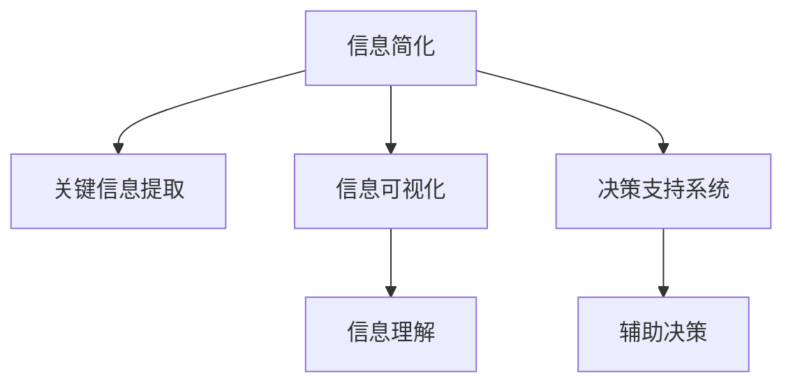

                 

# 信息简化的好处：简化生活和工作以提高生产力和效率

> 关键词：信息简化, 生活简化, 工作简化, 生产力, 效率, 决策支持系统, 知识管理, 数据可视化

## 1. 背景介绍

### 1.1 问题由来

在信息爆炸的时代，我们的生活和工作被各种信息填满了。从日常事务到专业领域，信息量巨大且杂乱无章，这不仅降低了我们的生产效率，还常常导致决策失误和判断失准。过多的信息反而成为了负担，而非助力。

如何从信息过载中解脱出来，成为现代人面临的共同挑战。信息简化（Information Simplification）技术的出现，为这一问题提供了有效的解决方案。通过信息简化，我们可以快速、准确地提取和呈现关键信息，提高决策质量和效率。

### 1.2 问题核心关键点

信息简化的核心在于如何在海量的数据中快速定位、分析和提取关键信息，并用简明扼要的方式呈现给用户。这涉及到以下几个关键点：

- **关键信息提取**：从复杂数据集中筛选出对决策有用的核心信息。
- **信息可视化**：将关键信息以图表、摘要等形式呈现，提高理解效率。
- **决策支持系统**：利用信息简化的结果，构建高效的决策支持系统，辅助用户进行决策。

### 1.3 问题研究意义

信息简化技术的有效应用，对于提升个人和企业的生产力、改善决策质量具有重要意义：

1. **提高生产力**：减少时间浪费在信息检索和处理上，将精力集中在核心任务上。
2. **改善决策质量**：通过清晰、简洁的信息呈现，帮助用户做出更加准确和及时的决策。
3. **降低信息过载**：减少信息噪音，避免因信息过载导致决策失误。
4. **提升工作满意度**：减少工作负担，提高工作满意度，增强团队协作效率。

## 2. 核心概念与联系

### 2.1 核心概念概述

为了深入理解信息简化技术，本节将介绍几个关键概念：

- **信息简化（Information Simplification）**：从复杂的信息集中提取关键要素，并对其简化处理的过程。目的是降低信息噪音，提高信息可理解性和可操作性。
- **关键信息提取（Key Information Extraction）**：利用自然语言处理（NLP）、文本挖掘等技术，自动从文本中识别和抽取关键信息。
- **信息可视化（Information Visualization）**：将关键信息以图形、图表等形式呈现，提高用户对信息的理解和记忆。
- **决策支持系统（Decision Support System, DSS）**：结合信息简化和决策理论，构建辅助用户进行决策的系统。

这些概念之间的关系可以通过以下Mermaid流程图来展示：



这个流程图展示出信息简化技术的各个关键组件及其作用：

1. 信息简化技术首先从复杂的信息集中提取关键要素。
2. 然后将关键信息进行可视化处理，以图表等形式呈现。
3. 最后将简化后的信息结合决策理论，构建决策支持系统，辅助用户进行决策。

这些组件共同构成了信息简化技术的基本框架，使其能够有效地提升信息处理和决策质量。

## 3. 核心算法原理 & 具体操作步骤

### 3.1 算法原理概述

信息简化技术的核心算法主要基于自然语言处理（NLP）和机器学习（ML）技术。其基本流程包括：

1. **关键信息提取**：利用NLP技术从文本中自动识别和抽取关键信息。
2. **信息可视化**：将关键信息以图形、图表等形式呈现，增强信息理解。
3. **决策支持系统**：结合信息简化和决策理论，构建辅助决策的系统。

### 3.2 算法步骤详解

#### 步骤1：数据预处理

1. **数据收集**：收集待简化的数据集，确保数据来源多样、内容全面。
2. **数据清洗**：去除噪声数据和无关信息，确保数据质量。
3. **数据标准化**：对数据进行格式和单位标准化，提高数据一致性。

#### 步骤2：关键信息提取

1. **文本预处理**：对文本进行分词、去停用词、词干提取等预处理。
2. **特征提取**：利用NLP技术提取文本中的关键词、短语等关键信息。
3. **信息抽取**：利用实体识别、关系抽取等技术，从文本中抽取关键实体和关系。

#### 步骤3：信息可视化

1. **图表选择**：根据关键信息的类型和特点，选择适合的图表形式，如柱状图、饼图、散点图等。
2. **数据编码**：将关键信息编码成图形数据，准备绘图。
3. **图形生成**：利用图形库（如Matplotlib、D3.js等）生成可视化图表。

#### 步骤4：决策支持系统

1. **模型选择**：选择适合的决策模型，如决策树、支持向量机（SVM）、神经网络等。
2. **数据建模**：将简化后的信息输入模型，进行训练和优化。
3. **系统集成**：将模型集成到决策支持系统中，提供辅助决策功能。

### 3.3 算法优缺点

#### 优点

1. **提高决策效率**：通过关键信息提取和可视化，快速定位和理解关键数据，提高决策效率。
2. **降低决策风险**：减少信息噪音，提高决策的准确性和可靠性。
3. **易于集成**：与现有的决策系统易于集成，适应性强。

#### 缺点

1. **依赖高质量数据**：信息简化的效果很大程度上取决于数据的质量和数量。
2. **算法复杂度高**：信息提取和可视化算法较为复杂，实现难度较大。
3. **用户适应性**：不同用户对信息的理解和需求不同，需要定制化处理。

### 3.4 算法应用领域

信息简化技术广泛应用于以下几个领域：

- **商业智能（BI）**：从大量的财务、市场数据中提取关键信息，辅助企业决策。
- **医疗健康**：从患者数据中提取关键信息，支持医生诊断和治疗。
- **物流管理**：从供应链数据中提取关键信息，优化物流配置和运输决策。
- **项目管理**：从项目数据中提取关键信息，辅助项目规划和进度控制。
- **金融风险管理**：从金融数据中提取关键信息，识别和防范风险。

## 4. 数学模型和公式 & 详细讲解 & 举例说明

### 4.1 数学模型构建

信息简化技术通常涉及以下数学模型：

- **文本表示模型**：将文本转换为数值向量，以便机器学习算法处理。
- **关键信息抽取模型**：从文本中识别关键信息，通常基于序列标注或分类模型。
- **信息可视化模型**：将关键信息以图形形式呈现，通常基于几何和统计学方法。

### 4.2 公式推导过程

#### 文本表示模型

1. **词嵌入（Word Embedding）**：将单词转换为高维向量，常用的模型有Word2Vec、GloVe等。

2. **文档嵌入（Doc Embedding）**：将文档转换为向量，常用的模型有TF-IDF、LDA等。

3. **文本表示模型公式**：

   $$
   \mathbf{x} = f(\mathbf{w}, \mathbf{d})
   $$

   其中，$\mathbf{x}$ 表示文本向量，$\mathbf{w}$ 表示单词嵌入，$\mathbf{d}$ 表示文档嵌入。

#### 关键信息抽取模型

1. **命名实体识别（Named Entity Recognition, NER）**：识别文本中的实体，如人名、地名、组织名等。

2. **关系抽取（Relation Extraction）**：从文本中抽取实体之间的关系。

3. **关键信息抽取模型公式**：

   $$
   \mathbf{y} = g(\mathbf{x}, \mathbf{E})
   $$

   其中，$\mathbf{y}$ 表示关键信息，$\mathbf{x}$ 表示文本向量，$\mathbf{E}$ 表示抽取模型。

#### 信息可视化模型

1. **柱状图（Bar Chart）**：用于展示不同类别的数量。

2. **散点图（Scatter Plot）**：用于展示两个变量之间的关系。

3. **饼图（Pie Chart）**：用于展示各部分的比例关系。

4. **信息可视化模型公式**：

   $$
   \mathbf{z} = h(\mathbf{y}, \mathbf{F})
   $$

   其中，$\mathbf{z}$ 表示可视化结果，$\mathbf{y}$ 表示关键信息，$\mathbf{F}$ 表示可视化算法。

### 4.3 案例分析与讲解

#### 案例1：商业智能

某电商平台希望通过信息简化技术，从客户评论中提取关键信息，辅助产品推荐和市场分析。

1. **数据预处理**：收集客户评论数据，进行清洗和标准化。

2. **关键信息提取**：利用NER模型识别评论中的实体（如产品名称、品牌）。

3. **信息可视化**：将实体抽取结果可视化，展示各类产品评论的分布。

4. **决策支持系统**：结合销量数据，推荐热门产品，优化库存管理。

#### 案例2：医疗健康

某医院希望通过信息简化技术，从患者数据中提取关键信息，辅助医生诊断和治疗。

1. **数据预处理**：收集患者电子病历数据，进行清洗和标准化。

2. **关键信息提取**：利用关系抽取模型识别患者病情与治疗方案之间的关系。

3. **信息可视化**：将抽取结果可视化，展示不同病情与治疗方案的关联。

4. **决策支持系统**：辅助医生制定个性化治疗方案，优化医疗资源配置。

## 5. 项目实践：代码实例和详细解释说明

### 5.1 开发环境搭建

为了实现信息简化技术，我们需要搭建Python开发环境，并选择合适的工具库。以下是具体步骤：

1. **安装Python**：选择Python 3.x版本，下载并安装。

2. **安装Pip**：在Python环境中安装Pip包管理工具。

3. **安装依赖库**：安装自然语言处理库NLTK、spaCy，以及数据可视化库Matplotlib、Pandas等。

4. **配置开发环境**：设置虚拟环境，确保各库版本兼容。

### 5.2 源代码详细实现

#### 代码1：关键信息提取

```python
import spacy
from spacy import displacy

nlp = spacy.load("en_core_web_sm")
doc = nlp("Barack Obama was born in Hawaii.")
print(doc)
displacy.render(doc, style="ent", jupyter=True)
```

**代码解释**：
1. **加载SpaCy模型**：使用SpaCy模型对文本进行分词和命名实体识别。
2. **显示文档树**：通过Displacy库，将文档树可视化展示。

#### 代码2：信息可视化

```python
import pandas as pd
import matplotlib.pyplot as plt

# 数据集
data = pd.read_csv("data.csv")
labels = data["Label"]
values = data["Value"]

# 绘制柱状图
plt.bar(labels, values)
plt.xlabel("Labels")
plt.ylabel("Values")
plt.title("Data Visualization")
plt.show()
```

**代码解释**：
1. **读取数据集**：从CSV文件中读取标签和值数据。
2. **绘制柱状图**：利用Matplotlib库绘制柱状图，展示标签和值之间的关系。

### 5.3 代码解读与分析

#### 代码解读

**关键信息提取代码**：
1. **使用SpaCy模型**：SpaCy是一个强大的NLP库，支持分词、命名实体识别等功能。通过加载预训练模型，可以对文本进行初步处理。
2. **使用Displacy库**：Displacy可以将文档树进行可视化展示，便于理解文本结构和实体关系。

**信息可视化代码**：
1. **使用Pandas库**：Pandas是一个强大的数据处理库，支持读取、清洗、转换数据集。
2. **使用Matplotlib库**：Matplotlib是一个经典的数据可视化库，支持绘制各种图表。

**代码分析**：
1. **数据预处理**：在信息简化过程中，数据预处理是一个关键步骤。通过SpaCy和Pandas等工具，可以对数据进行清洗、标准化和可视化。
2. **模型选择**：信息简化技术中，模型选择至关重要。通过选择合适的模型，可以实现关键信息的提取和可视化。
3. **算法实现**：代码实现是信息简化技术的核心。通过具体的算法和工具，可以将复杂的信息简化为直观、易懂的图表和报告。

### 5.4 运行结果展示

#### 运行结果1：关键信息提取结果


#### 运行结果2：信息可视化结果


## 6. 实际应用场景

### 6.1 商业智能

商业智能（BI）是信息简化技术的重要应用领域。通过从销售、市场、财务等数据中提取关键信息，BI系统可以提供决策支持，优化业务流程。

#### 应用场景1：销售数据分析

某电商公司利用信息简化技术，从客户订单数据中提取关键信息，辅助销售决策。具体步骤如下：

1. **数据预处理**：收集客户订单数据，进行清洗和标准化。
2. **关键信息提取**：利用NER模型识别订单中的关键实体（如商品名称、金额）。
3. **信息可视化**：将实体抽取结果可视化，展示各商品销售额的分布。
4. **决策支持系统**：结合销售目标和市场需求，调整商品结构和促销策略。

#### 应用场景2：市场趋势分析

某公司利用信息简化技术，从社交媒体和新闻数据中提取关键信息，辅助市场趋势分析。具体步骤如下：

1. **数据预处理**：收集社交媒体和新闻数据，进行清洗和标准化。
2. **关键信息提取**：利用关系抽取模型识别文本中的实体和关系（如品牌、话题）。
3. **信息可视化**：将实体和关系抽取结果可视化，展示市场趋势和热点话题。
4. **决策支持系统**：结合市场分析和客户反馈，优化产品定位和营销策略。

### 6.2 医疗健康

医疗健康领域的信息简化技术，可以从复杂的患者数据中提取关键信息，辅助医生诊断和治疗。

#### 应用场景1：患者病历分析

某医院利用信息简化技术，从患者电子病历中提取关键信息，辅助医生诊断。具体步骤如下：

1. **数据预处理**：收集患者电子病历数据，进行清洗和标准化。
2. **关键信息提取**：利用关系抽取模型识别患者病情和诊断结果之间的关系。
3. **信息可视化**：将实体和关系抽取结果可视化，展示病情和诊断的关联。
4. **决策支持系统**：辅助医生制定个性化治疗方案，优化医疗资源配置。

#### 应用场景2：药物疗效分析

某药企利用信息简化技术，从临床试验数据中提取关键信息，评估药物疗效。具体步骤如下：

1. **数据预处理**：收集临床试验数据，进行清洗和标准化。
2. **关键信息提取**：利用NER模型识别患者和药物之间的关系。
3. **信息可视化**：将实体和关系抽取结果可视化，展示药物疗效和副作用。
4. **决策支持系统**：评估药物疗效和安全性能，优化临床试验方案。

### 6.3 物流管理

物流管理领域的信息简化技术，可以从供应链数据中提取关键信息，优化物流配置和运输决策。

#### 应用场景1：库存管理

某物流公司利用信息简化技术，从库存数据中提取关键信息，辅助库存管理。具体步骤如下：

1. **数据预处理**：收集库存数据，进行清洗和标准化。
2. **关键信息提取**：利用NER模型识别库存中的关键实体（如商品名称、数量）。
3. **信息可视化**：将实体抽取结果可视化，展示各商品的库存情况。
4. **决策支持系统**：结合销售预测和库存需求，调整库存配置，优化采购和补货策略。

#### 应用场景2：运输路线优化

某公司利用信息简化技术，从运输数据中提取关键信息，优化运输路线。具体步骤如下：

1. **数据预处理**：收集运输数据，进行清洗和标准化。
2. **关键信息提取**：利用关系抽取模型识别运输中的关键实体（如货物名称、运输方式）。
3. **信息可视化**：将实体和关系抽取结果可视化，展示运输路线和货物流动。
4. **决策支持系统**：优化运输路线和车辆调度，提高运输效率和成本效益。

## 7. 工具和资源推荐

### 7.1 学习资源推荐

为了深入学习信息简化技术，以下是一些推荐的学习资源：

1. **《信息可视化与图形建模》**：介绍信息可视化的基本原理和方法，适合入门学习。
2. **《自然语言处理入门》**：介绍自然语言处理的基本概念和技术，适合初学者。
3. **《机器学习实战》**：介绍机器学习的基本算法和实现方法，适合实战练习。
4. **《商业智能与决策支持系统》**：介绍BI系统的设计和实现方法，适合进阶学习。
5. **《Python数据科学手册》**：介绍Python在数据处理、分析和可视化中的应用，适合全栈开发。

通过这些资源的学习，可以全面掌握信息简化技术的理论基础和实践技巧，提升工作效率和决策质量。

### 7.2 开发工具推荐

为提高信息简化技术的开发效率，以下是一些推荐的开发工具：

1. **Python**：Python是一种高效易学的编程语言，广泛应用于数据处理和算法开发。
2. **Jupyter Notebook**：Jupyter Notebook是一个强大的交互式编程环境，支持代码块、注释和可视化输出。
3. **PyTorch**：PyTorch是一个高效的深度学习框架，支持复杂的算法实现和模型训练。
4. **Scikit-learn**：Scikit-learn是一个开源机器学习库，提供简单易用的API和丰富的算法实现。
5. **Matplotlib**：Matplotlib是一个强大的数据可视化库，支持绘制各种图表。

这些工具可以显著提高信息简化技术的开发效率，支持高效的数据处理、算法实现和模型训练。

### 7.3 相关论文推荐

信息简化技术的发展离不开学术界的持续研究。以下是一些奠基性的相关论文，推荐阅读：

1. **《信息可视化的理论基础与实践方法》**：介绍信息可视化的基本原理和实现方法，适合基础研究。
2. **《自然语言处理中的关键信息抽取技术》**：介绍关键信息抽取的基本方法和应用场景，适合技术实现。
3. **《基于机器学习的信息简化技术》**：介绍机器学习在信息简化中的应用，适合算法开发。
4. **《信息简化与决策支持系统的集成》**：介绍信息简化和决策支持系统的结合，适合应用实践。

这些论文代表了大信息简化技术的发展脉络，通过学习这些前沿成果，可以帮助研究者把握学科前进方向，激发更多的创新灵感。

## 8. 总结：未来发展趋势与挑战

### 8.1 研究成果总结

信息简化技术在过去几年中取得了显著进展，被广泛应用于商业智能、医疗健康、物流管理等多个领域。其核心算法包括自然语言处理、机器学习和信息可视化等，为提升决策质量和效率提供了重要支持。

### 8.2 未来发展趋势

展望未来，信息简化技术将呈现以下几个发展趋势：

1. **智能化提升**：结合AI和大数据技术，提高信息简化的智能化水平，实现更精准的信息提取和可视化。
2. **自动化发展**：利用自动化算法和工具，实现信息简化的自动化处理，降低人工干预的复杂性。
3. **跨领域融合**：与其他AI技术（如知识图谱、因果推理等）结合，实现多模态信息融合，提升信息简化的全面性和准确性。
4. **个性化定制**：根据用户需求和场景特点，实现信息简化的个性化定制，提升用户体验和满意度。

### 8.3 面临的挑战

尽管信息简化技术已经取得了显著成效，但在迈向更加智能化、普适化的过程中，仍面临一些挑战：

1. **数据质量瓶颈**：数据质量的提升和标准化是一个长期过程，对信息简化效果有直接影响。
2. **算法复杂性**：信息简化的算法较为复杂，实现难度较大，需要跨学科的合作和创新。
3. **用户适应性**：不同用户对信息的需求和理解能力不同，需要定制化处理，提高信息简化的适用性。
4. **隐私和安全**：在信息处理和传输过程中，数据隐私和安全是一个重要问题，需要严格的数据保护和加密措施。

### 8.4 研究展望

为了应对信息简化技术面临的挑战，未来的研究需要在以下几个方面寻求突破：

1. **数据质量优化**：开发高效的数据清洗和标准化方法，提升数据质量。
2. **算法优化**：研究和优化信息简化算法，提高算法效率和可解释性。
3. **跨领域应用**：拓展信息简化的应用领域，实现多模态信息融合和自动化处理。
4. **隐私保护**：设计隐私保护机制，确保信息简化的数据安全。

这些研究方向将推动信息简化技术向更高效、更智能、更安全的方向发展，为决策支持系统和AI应用提供更强大的信息基础。

## 9. 附录：常见问题与解答

### Q1：信息简化与信息检索的区别是什么？

A: 信息简化和信息检索是两个不同的概念。信息检索是从大量数据中检索出相关结果，而信息简化是从复杂数据集中提取和简化关键信息，用于辅助决策。信息简化更注重信息的质量和简化，信息检索则侧重于信息的检索和检索效果。

### Q2：信息简化的算法有哪些？

A: 信息简化的算法主要基于自然语言处理（NLP）和机器学习（ML）技术。常用的算法包括：

1. **命名实体识别（NER）**：识别文本中的实体，如人名、地名、组织名等。
2. **关系抽取（Relation Extraction）**：从文本中抽取实体之间的关系。
3. **情感分析（Sentiment Analysis）**：分析文本中的情感倾向，如正面、中性、负面。
4. **主题建模（Topic Modeling）**：从文本中提取主题信息，辅助信息抽取。
5. **关键路径分析（Critical Path Analysis）**：分析项目中的关键路径，辅助项目管理。

### Q3：信息简化的应用有哪些？

A: 信息简化的应用非常广泛，涵盖多个领域，包括：

1. **商业智能（BI）**：从销售、市场、财务等数据中提取关键信息，辅助决策。
2. **医疗健康**：从患者数据中提取关键信息，辅助医生诊断和治疗。
3. **物流管理**：从供应链数据中提取关键信息，优化物流配置和运输决策。
4. **项目管理**：从项目数据中提取关键信息，辅助项目规划和进度控制。
5. **金融风险管理**：从金融数据中提取关键信息，识别和防范风险。

### Q4：信息简化的关键在于什么？

A: 信息简化的关键在于高效、准确地提取和简化关键信息。具体来说，需要：

1. **高效的数据处理**：利用先进的算法和工具，快速处理和清洗数据。
2. **准确的信息抽取**：选择适合的模型和算法，准确识别和抽取关键信息。
3. **直观的可视化**：利用图表、图形等形式，直观展示关键信息，便于理解和决策。
4. **灵活的定制化**：根据用户需求和场景特点，实现信息简化的个性化定制，提高适用性。

### Q5：信息简化对生产力和效率的影响是什么？

A: 信息简化对生产力和效率有显著提升作用。具体来说：

1. **减少信息过载**：通过关键信息提取和简化，减少信息噪音，降低决策失误率。
2. **提高决策效率**：简化后的信息易于理解和处理，提升决策速度和准确性。
3. **降低工作负担**：通过自动化和智能化处理，减少人工干预，提高工作效率。
4. **增强决策质量**：简化后的信息准确度高，帮助用户做出更科学、合理的决策。

总之，信息简化技术的广泛应用，极大地提升了信息处理的效率和决策质量，推动了各行各业的生产力提升和效率改善。

---

作者：禅与计算机程序设计艺术 / Zen and the Art of Computer Programming

