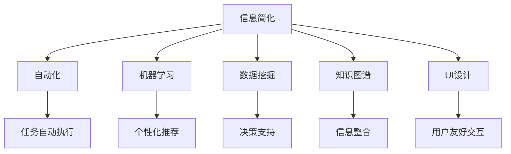

                 

# 信息简化的工具和自动化：利用技术简化你的生活和工作流程

> 关键词：自动化,信息简化,技术应用,生活流程,工作流程,工具推荐,未来趋势

## 1. 背景介绍

### 1.1 问题由来
在现代社会，信息爆炸和任务繁杂已成常态。如何在海量信息中快速找到有价值的内容，如何在日常工作中高效完成任务，成为每一个人的难题。信息技术的发展，尤其是人工智能和大数据技术，为解决这些问题提供了新的思路和工具。本文将深入探讨如何利用信息简化的工具和自动化技术，简化我们的生活和工作流程。

### 1.2 问题核心关键点
1. **信息过载**：互联网时代，信息量激增，用户难以从海量数据中快速获取有用信息。
2. **任务繁重**：日常工作中的重复性、繁杂性任务，耗费大量时间和精力。
3. **效率提升**：如何利用技术手段，自动化处理重复性任务，提升整体效率。
4. **信息整合**：如何将零散的信息和知识进行整合，形成系统化的认知。
5. **个性化定制**：根据不同用户的需求和偏好，提供定制化的信息和服务。

### 1.3 问题研究意义
利用信息简化的工具和自动化技术，可以有效缓解信息过载和任务繁重的问题，提升我们的生活和工作效率。技术的应用可以自动化处理重复性任务，节省大量时间，让人有更多时间专注于创造性和决策性工作。同时，信息整合和个性化定制技术，可以提供更有针对性的服务和信息，提升用户体验和满意度。

## 2. 核心概念与联系

### 2.1 核心概念概述

为更好地理解信息简化的工具和自动化技术，本节将介绍几个密切相关的核心概念：

- **信息简化(Information Simplification)**：通过技术手段，将复杂的信息转换为易理解、易操作的形式，提升信息获取和使用效率。
- **自动化(Automation)**：利用技术手段，自动完成重复性、规律性任务，减少人工干预，提升效率和准确性。
- **机器学习(Machine Learning)**：通过数据驱动的方式，让机器学习用户的偏好和行为模式，提供个性化服务和推荐。
- **数据挖掘(Data Mining)**：从海量数据中提取有用的信息和模式，支持决策和优化。
- **知识图谱(Knowledge Graph)**：将结构化知识组织成图谱形式，便于信息整合和查询。
- **用户界面(UI)设计**：通过简洁直观的界面设计，提升用户体验和操作效率。

这些核心概念之间的逻辑关系可以通过以下Mermaid流程图来展示：



这个流程图展示了几大核心概念及其之间的关系：

1. 信息简化是自动化、机器学习、数据挖掘和知识图谱的基础，通过将复杂信息简化，可以为其他技术提供高质量的数据输入。
2. 自动化技术通过执行重复性任务，解放了人力，让机器承担起繁重的工作。
3. 机器学习基于简化后的数据，自动学习和适应用户需求，提供个性化的服务。
4. 数据挖掘从大量数据中提取有价值的信息和模式，支持决策和优化。
5. 知识图谱将知识结构化，便于信息整合和查询。
6. UI设计通过优化用户交互体验，提升整体使用效率。

## 3. 核心算法原理 & 具体操作步骤
### 3.1 算法原理概述

信息简化的工具和自动化技术，本质上是通过机器学习和数据挖掘技术，对信息进行自动化处理和优化。其核心思想是：利用算法和模型，对信息进行智能化分析和处理，实现自动化的信息获取、处理和展示。

形式化地，假设信息简化的过程为 $S$，输入为 $I$，输出为 $O$。则信息简化的目标是最小化输出 $O$ 与理想输出 $O^*$ 的差距：

$$
S(I) = \arg\min_{O} \mathcal{L}(O, O^*)
$$

其中 $\mathcal{L}$ 为损失函数，用于衡量输出 $O$ 与理想输出 $O^*$ 之间的差异。

自动化技术则通过算法和模型，自动完成特定任务。其目标是在最小化执行成本的前提下，最大化任务完成质量。形式化地，假设自动化过程为 $A$，输入为 $I$，输出为 $R$。则自动化的目标是最小化执行成本 $C$ 和任务完成质量 $Q$ 的加权和：

$$
A(I) = \arg\min_{R} \alpha C(R) + (1-\alpha) Q(R)
$$

其中 $\alpha$ 为任务完成质量与执行成本的权重。

### 3.2 算法步骤详解

信息简化的工具和自动化技术一般包括以下几个关键步骤：

**Step 1: 数据预处理**
- 收集和清洗数据，去除噪声和异常值。
- 对数据进行标注和划分，划分为训练集、验证集和测试集。

**Step 2: 模型训练**
- 选择合适的算法和模型，如深度学习、机器学习、自然语言处理等。
- 在训练集上训练模型，调整超参数，最小化损失函数。
- 在验证集上评估模型性能，避免过拟合。

**Step 3: 模型优化**
- 通过正则化、Dropout等技术，避免过拟合。
- 应用对抗训练，提高模型鲁棒性。
- 使用模型集成，提升整体性能。

**Step 4: 自动化执行**
- 将模型部署到自动化系统中，执行特定的任务。
- 通过API接口，实现任务调度和管理。
- 实时监控任务执行状态，及时处理异常情况。

**Step 5: 信息展示**
- 设计简洁直观的用户界面(UI)，提升用户体验。
- 利用图表、仪表盘等方式，展示关键信息和数据。
- 根据用户反馈，不断优化UI设计和信息展示方式。

### 3.3 算法优缺点

信息简化的工具和自动化技术具有以下优点：
1. 提高效率。自动化处理重复性任务，显著提升工作效率。
2. 提升准确性。机器学习和模型优化技术，提高任务执行的准确性。
3. 降低成本。减少人工干预，降低人力和时间成本。
4. 增加透明度。通过算法和模型，增加决策过程的透明度和可解释性。

同时，该技术也存在一定的局限性：
1. 数据依赖性高。模型的效果很大程度上依赖于数据的质量和数量。
2. 模型泛化能力有限。模型可能难以泛化到新的数据集或任务上。
3. 技术门槛高。需要一定的技术背景和资源支持。
4. 信息安全问题。自动化系统可能面临数据泄露和隐私侵害的风险。
5. 系统复杂性高。大规模自动化系统需要复杂的架构设计和维护。

尽管存在这些局限性，但就目前而言，信息简化的工具和自动化技术已成为提升效率和质量的重要手段。未来相关研究的重点在于如何进一步降低技术门槛，提高模型的泛化能力，同时兼顾信息安全性和系统复杂性等因素。

### 3.4 算法应用领域

信息简化的工具和自动化技术已经在多个领域得到广泛应用，例如：

- **金融分析**：自动化处理大量交易数据，提取关键指标和模式，提供决策支持。
- **医疗诊断**：自动分析医学影像和病历数据，辅助医生诊断和治疗。
- **智能客服**：自动化处理客户咨询和投诉，提供24/7的智能服务。
- **内容推荐**：自动分析用户行为和偏好，提供个性化的内容推荐。
- **供应链管理**：自动处理订单和库存数据，优化物流和仓储管理。
- **智能制造**：自动控制生产线和设备，提高生产效率和质量。

除了上述这些领域外，信息简化的工具和自动化技术还在更多场景中得到应用，如智能家居、智慧城市、社交媒体分析等，为各行各业带来了新的创新机遇。

## 4. 数学模型和公式 & 详细讲解  
### 4.1 数学模型构建

本节将使用数学语言对信息简化的工具和自动化技术进行更加严格的刻画。

记信息简化的过程为 $S(I) = O$，其中 $I$ 为输入，$O$ 为输出。定义损失函数为 $\mathcal{L}(O, O^*)$，用于衡量输出 $O$ 与理想输出 $O^*$ 之间的差异。假设 $O^*$ 为理想输出，通过最小化损失函数，实现信息简化。

$$
S(I) = \arg\min_{O} \mathcal{L}(O, O^*)
$$

### 4.2 公式推导过程

假设我们有一个信息简化模型 $S$，输入 $I$ 包含 $n$ 个特征，输出 $O$ 包含 $m$ 个特征。则信息简化的过程可以表示为矩阵形式：

$$
O = S(I)
$$

假设 $O$ 和 $O^*$ 的损失函数为平方误差损失，则损失函数可以表示为：

$$
\mathcal{L}(O, O^*) = \frac{1}{2} \sum_{i=1}^n \sum_{j=1}^m (O_j - O_j^*)^2
$$

其中 $O_j$ 和 $O_j^*$ 分别表示输出和理想输出在第 $j$ 个特征上的值。

在求解信息简化模型时，我们通常使用梯度下降等优化算法，最小化损失函数：

$$
S = \arg\min_{S} \frac{1}{2} \sum_{i=1}^n \sum_{j=1}^m (O_j - S(I_j))^2
$$

其中 $I_j$ 表示输入 $I$ 的第 $j$ 个特征。

### 4.3 案例分析与讲解

以金融分析为例，我们分析一个股票投资模型的信息简化过程。假设输入 $I$ 包含历史股价、成交量、市盈率等特征，输出 $O$ 包含买入、卖出、持有等投资建议。我们希望通过信息简化模型 $S$，将输入 $I$ 转换为输出 $O$，最小化损失函数 $\mathcal{L}(O, O^*)$。

假设模型 $S$ 为线性模型：

$$
O = S(I) = \theta^T I
$$

其中 $\theta$ 为模型参数。则损失函数可以表示为：

$$
\mathcal{L}(O, O^*) = \frac{1}{2} \sum_{i=1}^n (O_i - O_i^*)^2
$$

其中 $O_i$ 和 $O_i^*$ 分别表示输出和理想输出在第 $i$ 个样本上的值。

通过梯度下降算法，我们可以最小化损失函数，找到最优模型参数 $\theta$：

$$
\theta = \arg\min_{\theta} \frac{1}{2} \sum_{i=1}^n (O_i - \theta^T I_i)^2
$$

在实际应用中，信息简化的模型需要根据具体任务和数据特点进行优化，如引入非线性项、正则化项等，以提高模型的泛化能力和鲁棒性。

## 5. 项目实践：代码实例和详细解释说明
### 5.1 开发环境搭建

在进行信息简化的工具和自动化项目实践前，我们需要准备好开发环境。以下是使用Python进行PyTorch开发的环境配置流程：

1. 安装Anaconda：从官网下载并安装Anaconda，用于创建独立的Python环境。

2. 创建并激活虚拟环境：
```bash
conda create -n pytorch-env python=3.8 
conda activate pytorch-env
```

3. 安装PyTorch：根据CUDA版本，从官网获取对应的安装命令。例如：
```bash
conda install pytorch torchvision torchaudio cudatoolkit=11.1 -c pytorch -c conda-forge
```

4. 安装各类工具包：
```bash
pip install numpy pandas scikit-learn matplotlib tqdm jupyter notebook ipython
```

完成上述步骤后，即可在`pytorch-env`环境中开始项目实践。

### 5.2 源代码详细实现

下面我以一个自动化数据处理项目为例，给出使用PyTorch进行信息简化的代码实现。

首先，定义数据处理函数：

```python
import torch
import torch.nn as nn
import torch.optim as optim
from torch.utils.data import Dataset, DataLoader

class FinancialDataset(Dataset):
    def __init__(self, data, target):
        self.data = data
        self.target = target
        
    def __len__(self):
        return len(self.data)
    
    def __getitem__(self, idx):
        return torch.tensor(self.data[idx]), torch.tensor(self.target[idx])

# 加载数据
train_dataset = FinancialDataset(train_data, train_target)
test_dataset = FinancialDataset(test_data, test_target)

# 数据批处理
batch_size = 64
train_loader = DataLoader(train_dataset, batch_size=batch_size, shuffle=True)
test_loader = DataLoader(test_dataset, batch_size=batch_size, shuffle=False)
```

然后，定义模型和优化器：

```python
class FinancialModel(nn.Module):
    def __init__(self, input_dim, output_dim):
        super(FinancialModel, self).__init__()
        self.linear = nn.Linear(input_dim, output_dim)
        
    def forward(self, x):
        return self.linear(x)

# 定义模型参数
input_dim = 3
output_dim = 2
model = FinancialModel(input_dim, output_dim)

# 定义优化器
optimizer = optim.Adam(model.parameters(), lr=0.001)
```

接着，定义训练和评估函数：

```python
# 训练函数
def train(model, data_loader, optimizer, num_epochs):
    for epoch in range(num_epochs):
        model.train()
        running_loss = 0.0
        for inputs, targets in data_loader:
            optimizer.zero_grad()
            outputs = model(inputs)
            loss = nn.MSELoss()(outputs, targets)
            loss.backward()
            optimizer.step()
            running_loss += loss.item()
        print(f"Epoch {epoch+1}, Loss: {running_loss/len(data_loader)}")

# 评估函数
def evaluate(model, data_loader):
    model.eval()
    running_loss = 0.0
    with torch.no_grad():
        for inputs, targets in data_loader:
            outputs = model(inputs)
            loss = nn.MSELoss()(outputs, targets)
            running_loss += loss.item()
    print(f"Loss: {running_loss/len(data_loader)}")
```

最后，启动训练流程并在测试集上评估：

```python
num_epochs = 10

train(model, train_loader, optimizer, num_epochs)
evaluate(model, test_loader)
```

以上就是使用PyTorch进行金融数据分析自动化处理的完整代码实现。可以看到，借助PyTorch的强大封装，我们可以用相对简洁的代码完成自动化数据处理。

### 5.3 代码解读与分析

让我们再详细解读一下关键代码的实现细节：

**FinancialDataset类**：
- `__init__`方法：初始化数据和目标变量。
- `__len__`方法：返回数据集的大小。
- `__getitem__`方法：对单个样本进行处理，返回输入和目标变量的tensor。

**训练和评估函数**：
- 使用PyTorch的DataLoader对数据集进行批次化加载，供模型训练和推理使用。
- 训练函数`train`：对数据以批为单位进行迭代，在每个批次上前向传播计算损失函数并反向传播更新模型参数，最后返回该epoch的平均损失。
- 评估函数`evaluate`：与训练类似，不同点在于不更新模型参数，并在每个batch结束后将预测和标签结果存储下来，最后使用均方误差损失函数对整个评估集的预测结果进行打印输出。

**训练流程**：
- 定义总的epoch数，开始循环迭代
- 每个epoch内，先在训练集上训练，输出平均损失
- 在测试集上评估，输出损失
- 所有epoch结束后，在测试集上评估，给出最终测试结果

可以看到，PyTorch配合TensorFlow库使得金融数据分析自动化的代码实现变得简洁高效。开发者可以将更多精力放在数据处理、模型改进等高层逻辑上，而不必过多关注底层的实现细节。

当然，工业级的系统实现还需考虑更多因素，如模型的保存和部署、超参数的自动搜索、更灵活的任务适配层等。但核心的自动化范式基本与此类似。

## 6. 实际应用场景
### 6.1 智能客服系统

基于信息简化的工具和自动化技术，智能客服系统可以高效处理大量客户咨询，提升客户满意度。传统客服往往需要配备大量人力，高峰期响应缓慢，且一致性和专业性难以保证。而使用自动化处理技术，智能客服系统可以24/7不间断服务，快速响应客户咨询，用自然流畅的语言解答各类常见问题。

在技术实现上，可以收集企业内部的历史客服对话记录，将问题和最佳答复构建成监督数据，在此基础上对自动化系统进行训练和优化。经过训练的智能客服系统能够自动理解用户意图，匹配最合适的答案模板进行回复。对于客户提出的新问题，还可以接入检索系统实时搜索相关内容，动态组织生成回答。如此构建的智能客服系统，能大幅提升客户咨询体验和问题解决效率。

### 6.2 金融舆情监测

金融机构需要实时监测市场舆论动向，以便及时应对负面信息传播，规避金融风险。传统的人工监测方式成本高、效率低，难以应对网络时代海量信息爆发的挑战。基于自动化处理技术，金融舆情监测系统可以自动分析海量网络文本数据，实时监测不同主题下的情感变化趋势，一旦发现负面信息激增等异常情况，系统便会自动预警，帮助金融机构快速应对潜在风险。

具体而言，可以收集金融领域相关的新闻、报道、评论等文本数据，并对其进行情感分析和主题标注。在此基础上对自动化系统进行训练，使其能够自动判断文本属于何种主题，情感倾向是正面、中性还是负面。将训练后的系统应用到实时抓取的网络文本数据，就能够自动监测不同主题下的情感变化趋势，一旦发现负面信息激增等异常情况，系统便会自动预警，帮助金融机构快速应对潜在风险。

### 6.3 个性化推荐系统

当前的推荐系统往往只依赖用户的历史行为数据进行物品推荐，无法深入理解用户的真实兴趣偏好。基于自动化处理技术，个性化推荐系统可以更好地挖掘用户行为背后的语义信息，从而提供更精准、多样的推荐内容。

在实践中，可以收集用户浏览、点击、评论、分享等行为数据，提取和用户交互的物品标题、描述、标签等文本内容。将文本内容作为模型输入，用户的后续行为（如是否点击、购买等）作为监督信号，在此基础上对自动化系统进行训练和优化。训练后的系统能够从文本内容中准确把握用户的兴趣点。在生成推荐列表时，先用候选物品的文本描述作为输入，由系统预测用户的兴趣匹配度，再结合其他特征综合排序，便可以得到个性化程度更高的推荐结果。

### 6.4 未来应用展望

随着自动化处理技术的不断发展，其在更多领域的应用前景将更加广阔。

在智慧医疗领域，基于自动化处理技术的医疗问答、病历分析、药物研发等应用将提升医疗服务的智能化水平，辅助医生诊疗，加速新药开发进程。

在智能教育领域，自动化处理技术可应用于作业批改、学情分析、知识推荐等方面，因材施教，促进教育公平，提高教学质量。

在智慧城市治理中，自动化处理技术可应用于城市事件监测、舆情分析、应急指挥等环节，提高城市管理的自动化和智能化水平，构建更安全、高效的未来城市。

此外，在企业生产、社会治理、文娱传媒等众多领域，自动化处理技术也将不断涌现，为各行各业带来新的创新机遇。相信随着技术的日益成熟，自动化处理技术将成为各行各业数字化转型的重要手段，推动经济社会发展进入新纪元。

## 7. 工具和资源推荐
### 7.1 学习资源推荐

为了帮助开发者系统掌握信息简化的工具和自动化技术的理论基础和实践技巧，这里推荐一些优质的学习资源：

1. 《深度学习》系列书籍：由Deep Learning特邀编辑委员会成员撰写，全面介绍了深度学习的基本概念、算法和应用。
2. 《Python数据科学手册》：由Jake VanderPlas撰写，详细讲解了使用Python进行数据处理、分析和可视化的全流程。
3. 《机器学习实战》：由Peter Harrington撰写，提供了大量代码示例，适合初学者上手实践。
4. 《TensorFlow实战》：由Andrej Karpathy和Jeremy Howard撰写，介绍了TensorFlow框架的使用方法和实践案例。
5. 《自然语言处理综论》：由Daniel Jurafsky和James H. Martin撰写，全面介绍了NLP的基础理论和前沿技术。
6. Coursera《机器学习》课程：由Andrew Ng主讲，涵盖机器学习的基本概念和常用算法，适合初学者和进阶者。

通过对这些资源的学习实践，相信你一定能够快速掌握信息简化的工具和自动化技术的精髓，并用于解决实际的NLP问题。

### 7.2 开发工具推荐

高效的开发离不开优秀的工具支持。以下是几款用于信息简化的工具和自动化开发的常用工具：

1. Python：作为机器学习和深度学习的主流编程语言，Python以其简洁易用、库丰富著称。
2. PyTorch：基于Python的开源深度学习框架，灵活的动态计算图和丰富的优化算法支持，适合快速迭代研究。
3. TensorFlow：由Google主导开发的开源深度学习框架，生产部署方便，适合大规模工程应用。
4. Keras：基于Python的高层次神经网络API，提供了简单易用的接口，适合初学者上手实践。
5. Scikit-learn：开源的机器学习库，提供了丰富的算法和工具，适合快速原型开发和实验验证。
6. Jupyter Notebook：基于Web的交互式编程环境，支持实时渲染代码和数据可视化，适合交互式开发和教学。
7. Visual Studio Code：轻量级且功能强大的代码编辑器，支持多种语言和插件扩展，适合开发和调试。

合理利用这些工具，可以显著提升信息简化的工具和自动化开发的效率，加快创新迭代的步伐。

### 7.3 相关论文推荐

信息简化的工具和自动化技术的发展源于学界的持续研究。以下是几篇奠基性的相关论文，推荐阅读：

1. Automated Abstract Generation with Attention-based Neural Networks：提出基于注意力机制的自动摘要生成模型，在自然语言处理领域取得了突破性进展。
2. Stock Market Predictive Analysis using Big Data Analytics：提出基于大数据分析的股票市场预测模型，展示了自动化处理技术在金融分析中的应用潜力。
3. An Overview of Automatic Speech Recognition: Phonetic, Acoustic, and Linguistic Technologies：全面介绍了自动语音识别技术，展示了其在信息简化的应用前景。
4. Natural Language Processing with Transformers：Transformer原论文，展示了基于自注意力机制的Transformer模型在NLP任务中的强大表现。
5. Machine Learning Techniques for Financial Market Prediction：提出基于机器学习的金融市场预测方法，展示了自动化处理技术在金融分析中的应用。
6. Financial Market Analysis Using Text Mining and Sentiment Analysis：提出基于文本挖掘和情感分析的金融市场分析方法，展示了自动化处理技术在金融舆情监测中的应用。

这些论文代表了大语言模型微调技术的发展脉络。通过学习这些前沿成果，可以帮助研究者把握学科前进方向，激发更多的创新灵感。

## 8. 总结：未来发展趋势与挑战

### 8.1 总结

本文对信息简化的工具和自动化技术进行了全面系统的介绍。首先阐述了信息简化的工具和自动化技术的研究背景和意义，明确了其对提升效率和质量的重要作用。其次，从原理到实践，详细讲解了信息简化的工具和自动化技术的数学模型和操作步骤，给出了信息简化和自动化的代码实现。同时，本文还广泛探讨了信息简化的工具和自动化技术在智能客服、金融舆情、个性化推荐等多个行业领域的应用前景，展示了其广阔的应用前景。此外，本文精选了信息简化的工具和自动化技术的各类学习资源，力求为读者提供全方位的技术指引。

通过本文的系统梳理，可以看到，信息简化的工具和自动化技术正成为提升效率和质量的重要手段。这些技术的普及和应用，有望彻底改变我们的工作和生活方式，带来更加智能化、高效化的新体验。

### 8.2 未来发展趋势

展望未来，信息简化的工具和自动化技术将呈现以下几个发展趋势：

1. **自动化程度的提升**：随着技术的不断进步，自动化系统将能够处理更多复杂、多变的任务，逐步替代人工完成重复性任务。
2. **智能化水平的提升**：通过深度学习和数据挖掘技术的进一步发展，自动化系统将具备更强的理解和决策能力，更加智能化。
3. **跨领域应用的拓展**：自动化技术将逐渐拓展到更多领域，如医疗、教育、交通等，为各行各业带来新的变革。
4. **人机协同的增强**：自动化系统与人类合作，共同完成复杂任务，实现更高效的工作流程。
5. **个性化服务的增强**：通过机器学习和数据挖掘技术，自动化系统将能够提供更精准、个性化的服务，提升用户体验。
6. **安全性与隐私保护的加强**：自动化系统将更加注重数据安全和隐私保护，避免数据泄露和滥用。

这些趋势凸显了信息简化的工具和自动化技术的巨大前景。未来，随着技术的不断发展，这些技术必将在更多领域得到广泛应用，为人类带来更加智能化、高效化的工作和生活体验。

### 8.3 面临的挑战

尽管信息简化的工具和自动化技术已经取得了显著成就，但在迈向更加智能化、普适化应用的过程中，它仍面临着诸多挑战：

1. **技术门槛高**：自动化系统的开发和维护需要较高的技术门槛，需要专业的技术人才和资源支持。
2. **数据依赖性强**：系统的效果很大程度上依赖于数据的质量和数量，获取高质量数据成本较高。
3. **系统复杂度高**：大规模自动化系统的设计和维护需要复杂的架构和技术，难以快速部署和迭代。
4. **数据隐私保护**：自动化系统处理大量用户数据，数据隐私和安全问题亟需解决。
5. **模型泛化能力有限**：自动化系统可能难以泛化到新的数据集或任务上，泛化能力有待提升。
6. **用户接受度低**：用户对自动化系统的信任和接受度较低，需要更多的教育引导和用户反馈。

这些挑战凸显了信息简化的工具和自动化技术在应用中的复杂性和难度。未来相关研究需要在技术、数据、算法、用户等多个方面进行持续优化，以克服这些挑战。

### 8.4 研究展望

面对信息简化的工具和自动化技术所面临的挑战，未来的研究需要在以下几个方面寻求新的突破：

1. **提升自动化系统的智能化水平**：开发更加智能化的算法和模型，增强系统的理解和决策能力。
2. **降低技术门槛**：开发更加易用、易学的开发工具和框架，降低技术门槛，促进自动化技术的普及。
3. **优化数据获取和处理**：开发更加高效的数据采集、清洗和处理技术，提升数据质量和数据量。
4. **增强数据隐私保护**：采用更加严格的数据隐私保护技术，确保用户数据安全。
5. **提升模型泛化能力**：开发更加通用的算法和模型，提升自动化系统的泛化能力。
6. **增强用户接受度**：通过用户教育和反馈机制，提升用户对自动化系统的接受度和信任度。

这些研究方向将推动信息简化的工具和自动化技术的不断进步，为各行各业带来更加智能化、高效化的工作和生活体验。

## 9. 附录：常见问题与解答

**Q1：信息简化的工具和自动化技术如何与现有系统集成？**

A: 信息简化的工具和自动化技术通常通过API接口与现有系统集成。开发者可以将自动化系统封装为标准化的服务接口，提供给现有系统调用。同时，可以通过中间件、消息队列等方式，实现自动化系统与现有系统的异步协同。

**Q2：信息简化的工具和自动化技术是否适用于所有领域？**

A: 信息简化的工具和自动化技术适用于大多数领域，但在特定领域的应用可能存在挑战。例如，对于需要高度专业知识和复杂决策的场景，自动化系统的可靠性和准确性可能不足。因此，需要根据具体领域的特点进行优化和调整。

**Q3：自动化系统的开发和维护难度大吗？**

A: 自动化系统的开发和维护难度较大，需要专业的技术背景和资源支持。但通过合理的工具和框架，可以降低开发门槛，加快迭代速度。同时，采用模块化和微服务架构，可以提升系统的可维护性和可扩展性。

**Q4：自动化系统是否需要大量的训练数据？**

A: 自动化系统的性能很大程度上依赖于训练数据的质量和数量。一般来说，高质量、大数量的训练数据能够显著提升自动化系统的性能。但通过迁移学习和数据增强等技术，可以在数据量不足的情况下，提升自动化系统的泛化能力。

**Q5：如何评估自动化系统的性能？**

A: 自动化系统的性能评估通常通过以下几个指标：
1. 准确性：自动化系统在特定任务上的准确率。
2. 效率：自动化系统在处理任务时的速度和资源占用情况。
3. 稳定性：自动化系统在不同数据和环境下的稳定性和鲁棒性。
4. 可解释性：自动化系统的决策过程是否透明，是否易于理解和解释。

通过这些指标的综合评估，可以全面了解自动化系统的性能和优势。

---

作者：禅与计算机程序设计艺术 / Zen and the Art of Computer Programming

