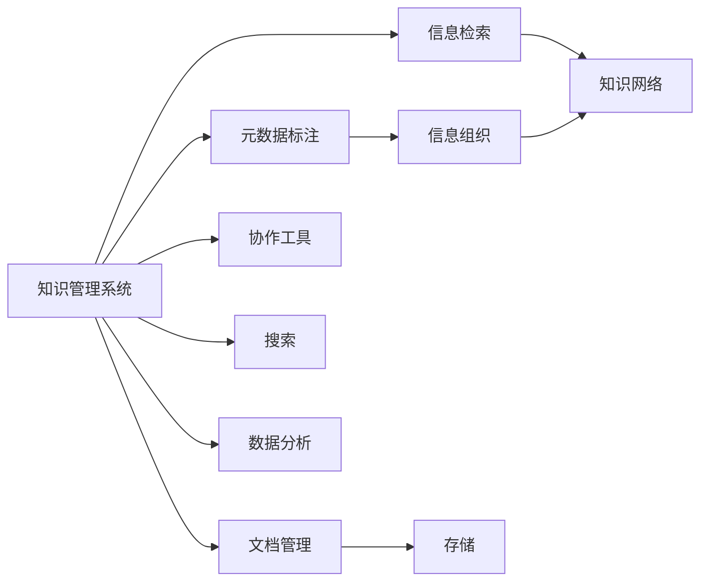

                 

# 信息过载与知识管理系统实施指南：有效组织和检索信息

## 1. 背景介绍

在信息化和数字化时代的浪潮下，信息量的爆炸性增长带来了前所未有的信息过载问题。个人和企业用户每天面对的海量信息，不仅仅是信息量的多，更在于如何高效组织、利用这些信息以提高决策效率和工作效率。在此背景下，知识管理系统(Knowledge Management Systems, KMS)作为一种能够有效组织和检索信息的工具，显得尤为重要。本文将深入探讨知识管理系统的核心原理和实践，帮助读者理解并实施知识管理系统的应用，以应对信息过载的挑战。

## 2. 核心概念与联系

### 2.1 核心概念概述

为了更好地理解知识管理系统的原理和架构，首先概述几个核心概念：

- **知识管理系统**：通过整合、存储、检索、共享知识库，辅助个人和团队高效获取和使用知识的系统。KMS可以支持文档管理、元数据标注、协作工具、搜索和数据分析等功能。

- **信息检索**：通过自动化的方式，快速定位和提取所需信息的过程。检索技术包括传统的文本匹配和现代的机器学习、深度学习等技术。

- **元数据**：描述数据的数据，包括文件的属性、结构、来源等，帮助更好地管理和组织数据。

- **语义网**：通过语义标注，将数据关联起来，形成更深层次的知识网络，提升信息的语义理解和智能关联。

- **信息可视化**：通过图表、仪表盘等形式，直观展示信息，辅助决策。

### 2.2 核心概念原理和架构的 Mermaid 流程图



该图展示了知识管理系统的核心组件及其相互关系：

1. **文档管理(B)**：存储和管理文档信息，是知识管理的基础。
2. **元数据标注(C)**：为文档添加结构化信息，帮助更好地组织和管理。
3. **信息检索(D)**：提供快速定位信息的能力。
4. **协作工具(E)**：支持团队协作，共享知识。
5. **搜索(F)**：提高信息的可发现性。
6. **数据分析(G)**：分析数据模式，挖掘知识。
7. **信息组织(H)**：通过元数据标注和分类，优化知识组织结构。
8. **知识网络(J)**：通过语义网技术，将知识关联起来，形成深层次的知识结构。

这些组件相互协作，共同实现知识管理系统的目标：有效组织和检索信息。

## 3. 核心算法原理 & 具体操作步骤

### 3.1 算法原理概述

知识管理系统在信息过载的背景下，通过以下核心算法原理，帮助用户高效组织和检索信息：

1. **元数据标注**：为文档添加结构化信息，如创建日期、作者、关键词等，便于分类和检索。
2. **信息检索**：通过索引和倒排索引等技术，快速定位所需信息。
3. **自然语言处理**：利用NLP技术，如分词、词向量、语义分析等，提升信息的语义理解能力。
4. **语义网**：通过RDF等语义网技术，将文档关联起来，形成知识网络。
5. **信息可视化**：通过图表、仪表盘等形式，直观展示信息，辅助决策。

### 3.2 算法步骤详解

#### 3.2.1 文档管理

文档管理是知识管理系统的基础，涉及数据的存储和组织。主要步骤包括：

1. **文档上传**：通过系统界面或API上传文档。
2. **版本控制**：支持文档的不同版本管理，保留历史信息。
3. **文档分类**：根据文档内容，自动或手动分类。
4. **文档标记**：为文档添加标签，帮助快速检索。

#### 3.2.2 元数据标注

元数据标注有助于更好地组织和管理文档。主要步骤包括：

1. **定义元数据结构**：根据需求定义元数据项，如作者、创建日期、关键词等。
2. **元数据提取**：自动或手动提取文档的元数据信息。
3. **元数据存储**：将元数据信息存储在文档或数据库中。
4. **元数据搜索**：支持基于元数据的搜索，快速定位相关文档。

#### 3.2.3 信息检索

信息检索是知识管理系统的核心功能，主要步骤包括：

1. **索引建立**：对文档进行索引，包括标题、关键词、摘要等。
2. **倒排索引构建**：建立倒排索引，快速定位包含特定关键词的文档。
3. **查询处理**：处理用户查询，包括自然语言查询和布尔查询。
4. **结果展示**：根据查询结果，展示文档列表，并提供预览功能。

#### 3.2.4 协作工具

协作工具支持团队协作和知识共享。主要步骤包括：

1. **权限控制**：根据角色和权限，控制文档的访问和编辑。
2. **任务管理**：支持任务分配和进度跟踪。
3. **评论和讨论**：支持在文档上添加评论和讨论，分享观点。
4. **知识库管理**：提供团队知识库，共享和检索知识。

#### 3.2.5 搜索

搜索功能提升信息可发现性，主要步骤包括：

1. **全文搜索**：支持全文搜索，快速定位包含特定关键词的文档。
2. **高级搜索**：支持高级搜索条件，如日期范围、作者、分类等。
3. **推荐系统**：根据用户行为和历史记录，推荐相关文档。

#### 3.2.6 数据分析

数据分析功能帮助挖掘知识，主要步骤包括：

1. **数据收集**：自动或手动收集文档数据，如文本、标签、分类等。
2. **数据清洗**：清洗数据，去除噪音和重复信息。
3. **数据可视化**：通过图表、仪表盘等形式，展示数据模式和趋势。
4. **数据挖掘**：使用机器学习算法，挖掘数据中的知识模式。

### 3.3 算法优缺点

知识管理系统在信息组织和检索方面具有以下优点：

1. **高效组织**：通过元数据标注和分类，可以高效组织和管理文档。
2. **快速检索**：通过索引和倒排索引，快速定位信息。
3. **智能检索**：利用NLP和机器学习技术，提升信息的语义理解能力。
4. **协作支持**：支持团队协作，共享知识。

同时，也存在一些局限性：

1. **依赖于标注质量**：元数据标注的质量直接影响信息组织效果。
2. **数据量大时效率低下**：大规模文档的管理和检索，对系统性能要求高。
3. **复杂性高**：系统实现复杂，需要考虑多方面因素。
4. **技术门槛高**：需要具备一定的技术背景才能使用和维护系统。

### 3.4 算法应用领域

知识管理系统广泛应用于以下领域：

1. **企业知识管理**：支持企业文档、项目、知识库的管理和检索，提升企业运营效率。
2. **学术研究**：支持论文、专利、研究成果的管理和检索，促进学术交流。
3. **医疗知识管理**：支持医疗文档、病例、研究论文的管理和检索，提升医疗水平。
4. **政府知识管理**：支持政府文件、政策、法规的管理和检索，提升政府治理能力。
5. **教育知识管理**：支持教学文档、课件、研究成果的管理和检索，提升教学质量。

## 4. 数学模型和公式 & 详细讲解 & 举例说明

### 4.1 数学模型构建

知识管理系统的数学模型主要包括以下几个部分：

1. **文档-元数据模型**：文档和元数据的结构化表示，如文档ID、标题、关键词等。
2. **索引-倒排索引模型**：索引和倒排索引的构建，支持快速检索。
3. **查询-检索模型**：用户查询的处理和检索结果的展示，如布尔查询、NLP查询。
4. **协作-社会网络模型**：协作工具中用户和文档的关联，支持知识共享和讨论。
5. **数据分析-机器学习模型**：利用机器学习算法，挖掘数据中的知识模式。

### 4.2 公式推导过程

#### 4.2.1 文档-元数据模型

文档和元数据可以通过关系数据库进行存储和检索，如MySQL、PostgreSQL等。假设文档的ID为$d$，元数据的ID为$t$，则文档-元数据的关系可以表示为：

$$
(d, t) \in \mathcal{D} \times \mathcal{T}
$$

其中，$\mathcal{D}$ 表示文档集合，$\mathcal{T}$ 表示元数据集合。

#### 4.2.2 索引-倒排索引模型

倒排索引是一种高效的信息检索技术，通过将索引和文档ID关联，支持快速定位文档。假设索引的ID为$i$，文档的ID为$d$，则索引-倒排索引的关系可以表示为：

$$
(i, d) \in \mathcal{I} \times \mathcal{D}
$$

其中，$\mathcal{I}$ 表示索引集合，$\mathcal{D}$ 表示文档集合。

#### 4.2.3 查询-检索模型

查询-检索模型主要涉及自然语言处理和机器学习算法，用于处理用户查询和检索文档。假设查询的ID为$q$，索引的ID为$i$，则查询-检索的关系可以表示为：

$$
(q, i) \in \mathcal{Q} \times \mathcal{I}
$$

其中，$\mathcal{Q}$ 表示查询集合，$\mathcal{I}$ 表示索引集合。

#### 4.2.4 协作-社会网络模型

协作-社会网络模型主要涉及用户和文档的关联，支持知识共享和讨论。假设用户的ID为$u$，文档的ID为$d$，则用户-文档的关系可以表示为：

$$
(u, d) \in \mathcal{U} \times \mathcal{D}
$$

其中，$\mathcal{U}$ 表示用户集合，$\mathcal{D}$ 表示文档集合。

#### 4.2.5 数据分析-机器学习模型

数据分析模型主要涉及机器学习算法，如分类、聚类、回归等，用于挖掘数据中的知识模式。假设数据点的ID为$p$，文档的ID为$d$，则数据点和文档的关系可以表示为：

$$
(p, d) \in \mathcal{P} \times \mathcal{D}
$$

其中，$\mathcal{P}$ 表示数据点集合，$\mathcal{D}$ 表示文档集合。

### 4.3 案例分析与讲解

#### 4.3.1 文档管理案例

某企业需要管理其内部的大量文档，包括项目文档、技术文档、市场文档等。企业可以使用知识管理系统，将文档上传到系统中，并通过元数据标注和分类，快速定位和管理文档。例如，对于项目文档，可以通过添加项目名称、负责人、完成时间等元数据，进行分类和检索。

#### 4.3.2 信息检索案例

某学术研究团队需要检索大量论文，以便进行科研合作。研究团队可以使用知识管理系统，通过标题、摘要、关键词等索引信息，快速定位相关论文。例如，可以使用布尔查询，检索包含特定关键词的论文，同时利用NLP技术，提升搜索结果的相关性。

#### 4.3.3 协作工具案例

某医疗团队需要共享病例和研究论文，以便协作开展研究。医疗团队可以使用知识管理系统，将病例和论文上传到系统中，并通过协作工具进行共享和讨论。例如，可以在文档上添加评论和讨论，分享观点和经验，同时支持任务管理和进度跟踪。

#### 4.3.4 数据分析案例

某企业需要分析其销售数据，以便制定营销策略。企业可以使用知识管理系统，将销售数据上传到系统中，并通过机器学习算法，挖掘数据中的知识模式。例如，可以使用分类算法，将销售数据分为高、中、低销售额的类别，并通过可视化工具，展示销售数据的趋势和模式。

## 5. 项目实践：代码实例和详细解释说明

### 5.1 开发环境搭建

在进行知识管理系统的项目实践前，需要准备好开发环境。以下是使用Python进行PyTorch开发的环境配置流程：

1. 安装Anaconda：从官网下载并安装Anaconda，用于创建独立的Python环境。

2. 创建并激活虚拟环境：
```bash
conda create -n pytorch-env python=3.8 
conda activate pytorch-env
```

3. 安装PyTorch：根据CUDA版本，从官网获取对应的安装命令。例如：
```bash
conda install pytorch torchvision torchaudio cudatoolkit=11.1 -c pytorch -c conda-forge
```

4. 安装TensorFlow：
```bash
pip install tensorflow
```

5. 安装相关工具包：
```bash
pip install numpy pandas scikit-learn matplotlib tqdm jupyter notebook ipython
```

完成上述步骤后，即可在`pytorch-env`环境中开始项目实践。

### 5.2 源代码详细实现

我们以一个简单的知识管理系统为例，给出使用PyTorch进行文档管理的代码实现。

首先，定义文档和元数据的数据结构：

```python
class Document:
    def __init__(self, id, title, content, tags=None):
        self.id = id
        self.title = title
        self.content = content
        self.tags = tags if tags else []

class Tag:
    def __init__(self, id, name):
        self.id = id
        self.name = name

# 文档-元数据关系
documents = {
    1: Document(1, '文档1', '内容1', [1, 2]),
    2: Document(2, '文档2', '内容2', [3, 4])
}

# 元数据
tags = {
    1: Tag(1, '标签1'),
    2: Tag(2, '标签2'),
    3: Tag(3, '标签3'),
    4: Tag(4, '标签4')
}

# 索引-倒排索引关系
index = {
    1: [1, 2],
    2: [2],
    3: [1, 3],
    4: [2, 4]
}
```

然后，实现基本的文档管理功能，包括上传、删除、修改和查询：

```python
def upload_document(title, content):
    document_id = len(documents) + 1
    document = Document(document_id, title, content)
    documents[document_id] = document
    return document_id

def delete_document(document_id):
    if document_id in documents:
        del documents[document_id]

def update_document(document_id, title=None, content=None, tags=None):
    if document_id in documents:
        document = documents[document_id]
        if title:
            document.title = title
        if content:
            document.content = content
        if tags:
            document.tags = tags
        return document
    return None

def query_document(document_id):
    if document_id in documents:
        return documents[document_id]
    return None
```

最后，实现基本的元数据标注功能，包括添加和删除元数据：

```python
def add_tag(document_id, tag_id):
    if document_id in documents and tag_id in tags:
        document = documents[document_id]
        if tag_id not in document.tags:
            document.tags.append(tag_id)
        return document
    return None

def remove_tag(document_id, tag_id):
    if document_id in documents and tag_id in tags:
        document = documents[document_id]
        if tag_id in document.tags:
            document.tags.remove(tag_id)
        return document
    return None
```

以上是使用PyTorch进行文档管理的代码实现。可以看到，通过简单的数据结构和函数定义，我们实现了基本的文档管理和元数据标注功能。

### 5.3 代码解读与分析

让我们再详细解读一下关键代码的实现细节：

**Document和Tag类**：
- `Document`类：表示文档，包括ID、标题、内容和标签。
- `Tag`类：表示元数据，包括ID和名称。

**文档-元数据关系**：
- 使用字典存储文档和元数据的关系，通过ID进行访问。

**索引-倒排索引关系**：
- 使用字典存储索引和文档ID的关系，通过索引ID访问包含特定关键词的文档。

**上传文档**：
- `upload_document`函数：根据上传的标题和内容创建新文档，并返回文档ID。

**删除文档**：
- `delete_document`函数：根据文档ID删除文档。

**修改文档**：
- `update_document`函数：根据文档ID修改文档的标题、内容和标签。

**查询文档**：
- `query_document`函数：根据文档ID查询文档。

**添加元数据**：
- `add_tag`函数：根据文档ID和标签ID添加标签。

**删除元数据**：
- `remove_tag`函数：根据文档ID和标签ID删除标签。

这些函数实现了知识管理系统的基本功能，可以支持文档的上传、删除、修改和查询，元数据的添加和删除。通过这些基本功能，开发者可以构建更复杂、更强大的知识管理系统。

## 6. 实际应用场景

### 6.1 智能客服系统

知识管理系统在智能客服系统中可以发挥重要作用。传统客服系统依赖于人工客服，效率低、成本高。使用知识管理系统，可以将常见问题及其解答存储在知识库中，客户可以通过自然语言查询快速获取答案，提升服务效率。

### 6.2 医疗知识管理

在医疗领域，知识管理系统可以支持病例和研究论文的管理和检索，帮助医生快速获取相关知识。例如，医生可以通过自然语言查询，检索包含特定症状和诊断的病例，进行病例分析和诊断。

### 6.3 教育知识管理

在教育领域，知识管理系统可以支持教学文档、课件和研究成果的管理和检索，提升教学质量。例如，教师可以通过自然语言查询，检索包含特定主题和知识点的课件，进行教学备课和内容更新。

### 6.4 未来应用展望

随着知识管理系统的不断进步，其应用场景将更加广泛，前景广阔。未来，知识管理系统可以在更多领域发挥作用，如政府知识管理、金融知识管理等，提升各行各业的知识管理和决策效率。

## 7. 工具和资源推荐

### 7.1 学习资源推荐

为了帮助开发者掌握知识管理系统的原理和实践，这里推荐一些优质的学习资源：

1. **《知识管理与组织》（Knowledge Management and Organization）**：一本介绍知识管理系统理论和实践的书籍，涵盖文档管理、元数据标注、信息检索等核心概念。

2. **CSCLP课程（Computational Social Science and Learning）**：斯坦福大学开设的在线课程，介绍知识管理系统和协作工具的实现。

3. **KnowledgeGraphs（知识图谱）**：HuggingFace官方文档，详细介绍知识图谱的构建和应用，支持语义网技术。

4. **Trello**：一款协作工具，支持文档管理和团队协作，可以与知识管理系统进行集成。

5. **Jupyter Notebook**：一款Jupyter格式的编程环境，支持代码编写和数据分析，可以用于知识管理系统的开发和实验。

通过学习这些资源，开发者可以更好地理解知识管理系统的核心原理，掌握其实现方法和应用技巧。

### 7.2 开发工具推荐

高效的开发离不开优秀的工具支持。以下是几款用于知识管理系统开发的常用工具：

1. **PyTorch**：基于Python的开源深度学习框架，灵活动态的计算图，适合快速迭代研究。

2. **TensorFlow**：由Google主导开发的开源深度学习框架，生产部署方便，适合大规模工程应用。

3. **Transformers库**：HuggingFace开发的NLP工具库，集成了众多SOTA语言模型，支持元数据标注和信息检索。

4. **Weights & Biases**：模型训练的实验跟踪工具，可以记录和可视化模型训练过程中的各项指标。

5. **TensorBoard**：TensorFlow配套的可视化工具，可实时监测模型训练状态，并提供丰富的图表呈现方式。

6. **Jupyter Notebook**：一款Jupyter格式的编程环境，支持代码编写和数据分析，可以用于知识管理系统的开发和实验。

合理利用这些工具，可以显著提升知识管理系统开发的效率，加快创新迭代的步伐。

### 7.3 相关论文推荐

知识管理系统的研究源于学界的持续研究。以下是几篇奠基性的相关论文，推荐阅读：

1. **《信息检索理论与技术》（Information Retrieval Theory and Technology）**：介绍信息检索技术的基本原理和算法。

2. **《知识工程与数据挖掘》（Knowledge Engineering and Data Mining）**：介绍知识工程和数据挖掘技术的基本概念和应用。

3. **《语义网与知识图谱》（Semantic Web and Knowledge Graph）**：介绍语义网和知识图谱技术的原理和应用。

4. **《智能问答系统》（Intelligent Question Answering Systems）**：介绍智能问答系统的基本原理和实现方法。

5. **《自然语言处理与知识管理》（Natural Language Processing and Knowledge Management）**：介绍自然语言处理和知识管理的融合应用。

这些论文代表了大语言模型微调技术的发展脉络。通过学习这些前沿成果，可以帮助研究者把握学科前进方向，激发更多的创新灵感。

## 8. 总结：未来发展趋势与挑战

### 8.1 研究成果总结

本文对知识管理系统进行了全面系统的介绍。首先阐述了知识管理系统的核心原理和实践，明确了其在信息过载背景下的重要价值。其次，从原理到实践，详细讲解了知识管理系统的实现方法和应用场景，给出了代码实现实例。同时，本文还探讨了知识管理系统的未来发展趋势和面临的挑战，为后续研究指明了方向。

通过本文的系统梳理，可以看到，知识管理系统在信息组织和检索方面具有重要意义，能够有效提升组织和利用信息的能力，应对信息过载的挑战。未来，知识管理系统将不断发展，在更多领域发挥作用，提升知识管理的智能化水平。

### 8.2 未来发展趋势

展望未来，知识管理系统的发展将呈现以下几个趋势：

1. **智能化水平提升**：随着NLP和机器学习技术的不断发展，知识管理系统的智能化水平将进一步提升，能够更好地理解和处理自然语言信息。

2. **多模态融合**：知识管理系统将融合多模态数据，如图像、视频、语音等，提升信息的综合利用能力。

3. **实时性增强**：知识管理系统将支持实时数据处理和分析，及时响应信息需求。

4. **隐私保护加强**：知识管理系统将加强隐私保护，确保用户数据的安全性。

5. **用户友好性提升**：知识管理系统将提升用户体验，提供更智能、更直观的操作界面。

### 8.3 面临的挑战

尽管知识管理系统在信息组织和检索方面取得了显著进展，但在迈向更加智能化、普适化应用的过程中，仍面临诸多挑战：

1. **数据量大时效率低下**：大规模文档的管理和检索，对系统性能要求高。

2. **技术门槛高**：需要具备一定的技术背景才能使用和维护系统。

3. **数据质量和标注依赖**：元数据标注的质量直接影响信息组织效果，需要高质量的数据和标注。

4. **跨领域适应性差**：知识管理系统在不同领域的应用，需要针对具体领域进行定制化开发。

5. **可扩展性差**：大规模系统需要考虑系统架构和性能优化。

### 8.4 研究展望

面对知识管理系统面临的挑战，未来的研究需要在以下几个方面寻求新的突破：

1. **高效索引技术**：开发高效索引算法，支持大规模文档的快速检索。

2. **智能问答系统**：构建智能问答系统，提升信息检索的智能化水平。

3. **多模态融合技术**：研究多模态数据的融合技术，提升信息的综合利用能力。

4. **用户友好界面**：设计用户友好界面，提升用户体验。

5. **隐私保护技术**：研究隐私保护技术，确保用户数据的安全性。

6. **分布式存储和计算**：研究分布式存储和计算技术，支持大规模系统的高性能运行。

这些研究方向将引领知识管理系统走向更高的台阶，为构建智能、高效、安全的信息组织和检索系统提供有力支撑。面向未来，知识管理系统需要与其他人工智能技术进行更深入的融合，多路径协同发力，共同推动知识管理的进步。只有勇于创新、敢于突破，才能不断拓展知识管理的边界，让智能技术更好地造福人类社会。

## 9. 附录：常见问题与解答

**Q1：知识管理系统能否适用于所有领域？**

A: 知识管理系统适用于大多数领域，但对于一些特定领域的知识管理需求，需要针对性地进行定制化开发。例如，医疗知识管理需要融合医疗领域的特殊数据和规则，教育知识管理需要适应教育领域的需求和标准。

**Q2：知识管理系统如何确保数据的安全性？**

A: 知识管理系统通过权限控制和加密技术，确保数据的安全性。例如，可以设置用户权限，限制数据的访问和修改；使用加密技术，保护数据的传输和存储安全。

**Q3：知识管理系统如何应对数据量大时的效率问题？**

A: 知识管理系统通过分布式存储和计算技术，应对数据量大时的效率问题。例如，使用分布式数据库，分散存储和管理数据；采用缓存技术，提升数据的访问速度。

**Q4：知识管理系统如何支持多模态数据融合？**

A: 知识管理系统可以通过统一的数据格式和元数据标准，支持多模态数据的融合。例如，使用语义标注技术，将不同模态的数据关联起来；采用深度学习技术，融合多模态数据的信息。

**Q5：知识管理系统如何提升智能化水平？**

A: 知识管理系统可以通过引入NLP和机器学习技术，提升智能化水平。例如，使用语义分析技术，提升信息检索的准确性；利用分类和聚类算法，挖掘数据中的知识模式。

---

作者：禅与计算机程序设计艺术 / Zen and the Art of Computer Programming

