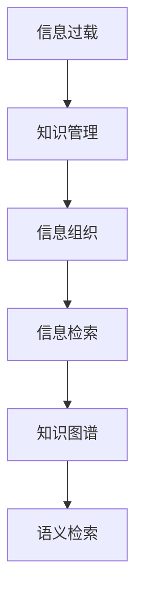

                 

# 信息过载与知识管理系统实施指南：有效组织和检索信息

> 关键词：信息过载,知识管理,组织和检索,知识图谱,语义检索,自动化流程,大数据技术,人工智能

## 1. 背景介绍

### 1.1 问题由来
在互联网时代，信息量呈爆炸性增长。人们面临的信息过载问题日益严重。如何有效组织和检索信息，已成为企业和个人必须面对的挑战。与此同时，企业级的知识管理(Knowledge Management, KM)系统也逐渐成为企业提升竞争力的重要手段。然而，传统KM系统往往难以满足信息增长的需求，亟需引入新的技术手段来应对信息爆炸带来的挑战。

### 1.2 问题核心关键点
信息过载和知识管理问题的核心在于信息的海量增长和高效组织。在大数据和人工智能技术的推动下，企业级KM系统正在向智能化、自动化方向发展，力图通过自动化的方式帮助人们从海量信息中抽丝剥茧，提炼出有价值的知识。本文聚焦于信息组织与检索的核心技术，通过引入知识图谱、语义检索等前沿概念，探讨了基于大数据和AI技术的企业级KM系统实施方案。

## 2. 核心概念与联系

### 2.1 核心概念概述

为更好地理解信息组织与检索技术，本节将介绍几个密切相关的核心概念：

- **信息过载(Information Overload)**：指人们接收到的信息远远超出了其处理能力，导致注意力分散、认知负荷过重。信息过载主要出现在数据增长速度超过人类处理速度的情况下。

- **知识管理(Knowledge Management, KM)**：指通过计划、实施、执行和监控，利用技术手段管理和应用组织内知识的过程。KM系统旨在提升知识分享、检索和应用效率，助力组织创新和决策。

- **信息组织(Information Organization)**：指对信息资源进行梳理、归类、标记和整合的过程，形成易于检索和利用的信息结构。信息组织是信息检索的基础，通过元数据管理、分类法等技术手段实现。

- **信息检索(Information Retrieval)**：指根据用户查询请求，自动从信息集合中筛选并呈现相关信息的过程。信息检索依赖自然语言处理(NLP)、机器学习等技术，目的是提升查询的准确性和效率。

- **知识图谱(Knowledge Graph)**：指通过图结构表示实体及其关系的知识库。知识图谱有助于提升信息关联性和知识推理能力，是实现知识驱动型应用的重要技术手段。

- **语义检索(Semantic Search)**：指通过理解查询意图和信息语义，匹配并推荐最相关信息的检索方式。语义检索技术结合NLP和AI算法，能够智能解析查询意图，提升检索的准确性。

这些核心概念之间的逻辑关系可以通过以下Mermaid流程图来展示：



这个流程图展示了一系列核心概念之间的关系：

1. 信息过载推动了知识管理的产生。
2. 知识管理通过信息组织和信息检索技术，对信息进行有效管理和应用。
3. 知识图谱和语义检索技术提升信息检索的精度和效率，进一步完善知识管理。

## 3. 核心算法原理 & 具体操作步骤
### 3.1 算法原理概述

信息组织和检索技术的核心在于利用计算方法对海量信息进行自动标注、分类、聚类和检索。其本质是对信息资源进行结构化处理，通过技术手段提升信息的可用性和可检索性。

常见的信息组织与检索算法包括：
- **元数据管理(Metadata Management)**：通过为信息资源添加元数据，实现信息的标准化分类和组织。元数据包括名称、描述、类型、关系等信息。
- **文本分类(Text Classification)**：将文本信息按照特定类别进行分类，如新闻、论文、报告等。
- **信息聚类(Clustering)**：利用聚类算法对信息进行相似性分析，形成不同的信息簇，便于检索和组织。
- **信息抽取(Information Extraction)**：从非结构化文本中自动抽取结构化信息，如实体、关系、事件等。
- **语义检索(Semantic Search)**：通过理解查询意图和信息语义，智能推荐相关信息。

这些算法共同构成信息组织与检索的技术框架，为知识管理系统的实现提供了基础支持。

### 3.2 算法步骤详解

信息组织与检索的核心算法步骤主要包括以下几个方面：

**Step 1: 数据收集与预处理**
- 从多源渠道（如网页、文档、数据库等）收集原始信息数据。
- 对数据进行清洗、去重、格式转换等预处理，保证数据的准确性和一致性。

**Step 2: 信息标注与元数据管理**
- 利用自然语言处理技术（如词向量、情感分析等）对信息进行自动标注。
- 根据标注结果，为信息添加结构化元数据，如分类、关键词、主题等。

**Step 3: 信息分类与聚类**
- 应用文本分类算法对信息进行自动分类，建立分类体系。
- 通过聚类算法对分类后的信息进行进一步整合，形成层次化的信息结构。

**Step 4: 信息抽取与结构化**
- 使用信息抽取技术从文本中自动提取结构化信息，如实体、关系、事件等。
- 将抽取结果整合到知识图谱中，构建实体关系图谱。

**Step 5: 语义检索与智能推荐**
- 基于语义检索技术，理解查询意图和信息语义，推荐最相关结果。
- 利用人工智能算法，如深度学习、知识图谱推理等，提升检索精度和效率。

### 3.3 算法优缺点

信息组织与检索技术在提升信息管理和检索效率方面具有显著优势，但也存在一些局限性：

**优点：**
1. 自动化程度高。算法能够自动处理大量信息，减轻人工标注和分类的负担。
2. 检索效率高。基于语义检索技术，检索结果更加精准，减少误判和漏检。
3. 知识图谱关联强。通过知识图谱构建实体关系网络，提升信息关联性和知识推理能力。

**缺点：**
1. 数据依赖性强。算法对数据质量有较高要求，需要保证数据来源和标注的准确性。
2. 复杂度高。信息抽取、聚类等算法需要复杂的技术实现，对计算资源要求较高。
3. 用户反馈弱。算法推荐结果往往基于预设模型和规则，难以充分考虑用户个性化需求。

尽管存在这些局限性，信息组织与检索技术仍在大数据和人工智能的推动下不断进步，成为企业知识管理的重要工具。

### 3.4 算法应用领域

信息组织与检索技术广泛应用于多个领域，主要包括以下几个方面：

1. **企业知识管理**：在企业内部构建知识管理系统，提升知识共享和利用效率，支持企业创新和决策。
2. **文档管理和检索**：对企业文档进行分类、标注和检索，快速获取所需信息。
3. **信息安全监控**：利用信息抽取和聚类技术，对网络数据进行分析和监控，识别潜在安全威胁。
4. **个性化推荐系统**：基于用户行为数据，利用信息检索和推荐算法，提升个性化推荐效果。
5. **智能客服系统**：利用信息抽取和语义检索技术，实现智能对话和知识查询，提升客户服务体验。
6. **内容管理系统**：对网站和应用程序中的内容进行分类、标注和检索，提升内容管理效率。

这些领域的应用展示了信息组织与检索技术的广泛价值和巨大潜力。

## 4. 数学模型和公式 & 详细讲解 & 举例说明

### 4.1 数学模型构建

信息组织与检索的核心算法通常需要构建数学模型，以实现信息分类、聚类和检索。以下以文本分类为例，构建一个简单的数学模型。

设文本数据集为 $D=\{(x_i, y_i)\}_{i=1}^N$，其中 $x_i$ 为文本， $y_i$ 为分类标签。目标为构建一个分类器 $f(x)$，将新文本 $x$ 自动分类到某一类别。

**线性分类模型**：假设 $x$ 可以表示为词向量形式 $x \in \mathbb{R}^d$，其中 $d$ 为词向量维度。分类器 $f(x)$ 可以表示为线性函数：

$$
f(x) = \sum_{j=1}^d \theta_j x_j + \theta_0
$$

其中 $\theta = (\theta_1, \theta_2, ..., \theta_d, \theta_0) \in \mathbb{R}^{d+1}$ 为模型参数，需要学习得到。

**训练过程**：利用损失函数对模型参数进行优化。假设损失函数为交叉熵损失函数，则优化目标为：

$$
\theta^* = \mathop{\arg\min}_{\theta} \sum_{i=1}^N L(y_i, f(x_i))
$$

其中 $L$ 为交叉熵损失函数：

$$
L(y_i, f(x_i)) = -y_i \log f(x_i) - (1-y_i) \log (1 - f(x_i))
$$

通过梯度下降等优化算法，最小化损失函数，即可得到最优参数 $\theta^*$。

### 4.2 公式推导过程

在文本分类模型中，交叉熵损失函数的推导过程如下：

假设 $x_i$ 的分类标签为 $y_i$，分类器的输出概率为 $f(x_i)$。则交叉熵损失函数的定义如下：

$$
L(y_i, f(x_i)) = -y_i \log f(x_i) - (1-y_i) \log (1 - f(x_i))
$$

对于整个数据集 $D$，经验风险为：

$$
\mathcal{L}(\theta) = \frac{1}{N} \sum_{i=1}^N L(y_i, f(x_i))
$$

目标是最小化经验风险，即：

$$
\theta^* = \mathop{\arg\min}_{\theta} \mathcal{L}(\theta)
$$

根据链式法则，损失函数对模型参数 $\theta$ 的梯度为：

$$
\frac{\partial \mathcal{L}(\theta)}{\partial \theta} = - \frac{1}{N} \sum_{i=1}^N (y_i - f(x_i)) \frac{\partial f(x_i)}{\partial x} \frac{\partial x}{\partial \theta}
$$

其中 $\frac{\partial f(x_i)}{\partial x}$ 和 $\frac{\partial x}{\partial \theta}$ 可以进一步展开，利用自动微分技术完成计算。

在得到损失函数的梯度后，即可带入优化算法，完成模型的训练。重复上述过程直至收敛，最终得到适应文本分类的最优模型参数 $\theta^*$。

### 4.3 案例分析与讲解

以命名实体识别(NER)任务为例，分析信息抽取和聚类算法的实现过程。

**NER任务定义**：识别文本中的人名、地名、机构名等特定实体。任务数据集为标注好的实体和文本对。

**词向量表示**：将文本和实体转换为词向量表示，可以利用预训练的Word2Vec、GloVe等词向量模型。

**实体抽取**：利用机器学习算法，如条件随机场、最大熵模型等，对词向量进行分类，识别出实体及其类型。

**实体聚类**：对抽取出的实体进行聚类，建立实体之间的关联关系。常用的聚类算法包括层次聚类、K-means等。

**知识图谱构建**：将抽取和聚类后的实体整合到知识图谱中，形成实体关系图谱。常用的知识图谱构建工具包括Neo4j、Gephi等。

## 5. 项目实践：代码实例和详细解释说明
### 5.1 开发环境搭建

在进行信息组织与检索的实践前，我们需要准备好开发环境。以下是使用Python进行PyTorch和SpaCy库开发的环境配置流程：

1. 安装Anaconda：从官网下载并安装Anaconda，用于创建独立的Python环境。

2. 创建并激活虚拟环境：
```bash
conda create -n knowledge-management python=3.8 
conda activate knowledge-management
```

3. 安装PyTorch和SpaCy库：
```bash
conda install pytorch torchvision torchaudio cudatoolkit=11.1 -c pytorch -c conda-forge
conda install spacy
```

4. 下载预训练词向量模型：
```bash
python -m spacy download en_core_web_md
```

完成上述步骤后，即可在`knowledge-management`环境中开始信息组织与检索实践。

### 5.2 源代码详细实现

下面以命名实体识别(NER)任务为例，给出使用PyTorch和SpaCy库对文本进行实体抽取和聚类的PyTorch代码实现。

首先，定义NER任务的数据处理函数：

```python
from torch.utils.data import Dataset
import torch
from spacy.lang.en import English

class NERDataset(Dataset):
    def __init__(self, texts, tags, tokenizer):
        self.texts = texts
        self.tags = tags
        self.tokenizer = tokenizer
        
    def __len__(self):
        return len(self.texts)
    
    def __getitem__(self, item):
        text = self.texts[item]
        tags = self.tags[item]
        
        # 对文本进行分词和词向量表示
        nlp = English()
        doc = nlp(text)
        tokens = [token.text for token in doc]
        embeddings = tokenizer(text)
        
        # 对token-wise的标签进行编码
        encoded_tags = [tag2id[tag] for tag in tags] 
        encoded_tags.extend([tag2id['O']] * (len(tokens) - len(encoded_tags)))
        labels = torch.tensor(encoded_tags, dtype=torch.long)
        
        return {'input_ids': embeddings, 
                'attention_mask': torch.tensor([1]*len(tokens), dtype=torch.long),
                'labels': labels}

# 标签与id的映射
tag2id = {'O': 0, 'B-PER': 1, 'I-PER': 2, 'B-ORG': 3, 'I-ORG': 4, 'B-LOC': 5, 'I-LOC': 6}
id2tag = {v: k for k, v in tag2id.items()}

# 创建dataset
tokenizer = SpaCyTokenizer()
train_dataset = NERDataset(train_texts, train_tags, tokenizer)
dev_dataset = NERDataset(dev_texts, dev_tags, tokenizer)
test_dataset = NERDataset(test_texts, test_tags, tokenizer)
```

然后，定义模型和优化器：

```python
from transformers import BertForTokenClassification, AdamW

model = BertForTokenClassification.from_pretrained('bert-base-cased', num_labels=len(tag2id))

optimizer = AdamW(model.parameters(), lr=2e-5)
```

接着，定义训练和评估函数：

```python
from torch.utils.data import DataLoader
from tqdm import tqdm
from sklearn.metrics import classification_report

device = torch.device('cuda') if torch.cuda.is_available() else torch.device('cpu')
model.to(device)

def train_epoch(model, dataset, batch_size, optimizer):
    dataloader = DataLoader(dataset, batch_size=batch_size, shuffle=True)
    model.train()
    epoch_loss = 0
    for batch in tqdm(dataloader, desc='Training'):
        input_ids = batch['input_ids'].to(device)
        attention_mask = batch['attention_mask'].to(device)
        labels = batch['labels'].to(device)
        model.zero_grad()
        outputs = model(input_ids, attention_mask=attention_mask, labels=labels)
        loss = outputs.loss
        epoch_loss += loss.item()
        loss.backward()
        optimizer.step()
    return epoch_loss / len(dataloader)

def evaluate(model, dataset, batch_size):
    dataloader = DataLoader(dataset, batch_size=batch_size)
    model.eval()
    preds, labels = [], []
    with torch.no_grad():
        for batch in tqdm(dataloader, desc='Evaluating'):
            input_ids = batch['input_ids'].to(device)
            attention_mask = batch['attention_mask'].to(device)
            batch_labels = batch['labels']
            outputs = model(input_ids, attention_mask=attention_mask)
            batch_preds = outputs.logits.argmax(dim=2).to('cpu').tolist()
            batch_labels = batch_labels.to('cpu').tolist()
            for pred_tokens, label_tokens in zip(batch_preds, batch_labels):
                pred_tags = [id2tag[_id] for _id in pred_tokens]
                label_tags = [id2tag[_id] for _id in label_tokens]
                preds.append(pred_tags[:len(label_tags)])
                labels.append(label_tags)
                
    print(classification_report(labels, preds))
```

最后，启动训练流程并在测试集上评估：

```python
epochs = 5
batch_size = 16

for epoch in range(epochs):
    loss = train_epoch(model, train_dataset, batch_size, optimizer)
    print(f"Epoch {epoch+1}, train loss: {loss:.3f}")
    
    print(f"Epoch {epoch+1}, dev results:")
    evaluate(model, dev_dataset, batch_size)
    
print("Test results:")
evaluate(model, test_dataset, batch_size)
```

以上就是使用PyTorch和SpaCy库对BERT进行命名实体识别任务实体抽取的完整代码实现。可以看到，得益于SpaCy库的强大封装，我们可以用相对简洁的代码完成BERT模型的加载和实体抽取。

### 5.3 代码解读与分析

让我们再详细解读一下关键代码的实现细节：

**NERDataset类**：
- `__init__`方法：初始化文本、标签、分词器等关键组件。
- `__len__`方法：返回数据集的样本数量。
- `__getitem__`方法：对单个样本进行处理，将文本输入转换为词向量表示，并将标签编码为数字，进行定长padding，最终返回模型所需的输入。

**tag2id和id2tag字典**：
- 定义了标签与数字id之间的映射关系，用于将token-wise的预测结果解码回真实的标签。

**训练和评估函数**：
- 使用PyTorch的DataLoader对数据集进行批次化加载，供模型训练和推理使用。
- 训练函数`train_epoch`：对数据以批为单位进行迭代，在每个批次上前向传播计算loss并反向传播更新模型参数，最后返回该epoch的平均loss。
- 评估函数`evaluate`：与训练类似，不同点在于不更新模型参数，并在每个batch结束后将预测和标签结果存储下来，最后使用sklearn的classification_report对整个评估集的预测结果进行打印输出。

**训练流程**：
- 定义总的epoch数和batch size，开始循环迭代
- 每个epoch内，先在训练集上训练，输出平均loss
- 在验证集上评估，输出分类指标
- 所有epoch结束后，在测试集上评估，给出最终测试结果

可以看到，PyTorch配合SpaCy库使得BERT实体抽取的代码实现变得简洁高效。开发者可以将更多精力放在数据处理、模型改进等高层逻辑上，而不必过多关注底层的实现细节。

当然，工业级的系统实现还需考虑更多因素，如模型的保存和部署、超参数的自动搜索、更灵活的任务适配层等。但核心的实体抽取范式基本与此类似。

## 6. 实际应用场景
### 6.1 智能客服系统

基于信息组织与检索技术的智能客服系统，可以自动理解并处理客户的咨询请求，提升客户服务体验。

在技术实现上，可以收集企业内部的客服对话记录，将问题和最佳答复构建成监督数据，在此基础上对预训练模型进行微调。微调后的模型能够自动理解用户意图，匹配最合适的答案模板进行回复。对于客户提出的新问题，还可以接入检索系统实时搜索相关内容，动态组织生成回答。如此构建的智能客服系统，能大幅提升客户咨询体验和问题解决效率。

### 6.2 金融舆情监测

金融机构需要实时监测市场舆论动向，以便及时应对负面信息传播，规避金融风险。传统的人工监测方式成本高、效率低，难以应对网络时代海量信息爆发的挑战。基于信息组织与检索技术的文本分类和情感分析技术，为金融舆情监测提供了新的解决方案。

具体而言，可以收集金融领域相关的新闻、报道、评论等文本数据，并对其进行主题标注和情感标注。在此基础上对预训练语言模型进行微调，使其能够自动判断文本属于何种主题，情感倾向是正面、中性还是负面。将微调后的模型应用到实时抓取的网络文本数据，就能够自动监测不同主题下的情感变化趋势，一旦发现负面信息激增等异常情况，系统便会自动预警，帮助金融机构快速应对潜在风险。

### 6.3 个性化推荐系统

当前的推荐系统往往只依赖用户的历史行为数据进行物品推荐，无法深入理解用户的真实兴趣偏好。基于信息组织与检索技术的个性化推荐系统，可以更好地挖掘用户行为背后的语义信息，从而提供更精准、多样的推荐内容。

在实践中，可以收集用户浏览、点击、评论、分享等行为数据，提取和用户交互的物品标题、描述、标签等文本内容。将文本内容作为模型输入，用户的后续行为（如是否点击、购买等）作为监督信号，在此基础上微调预训练语言模型。微调后的模型能够从文本内容中准确把握用户的兴趣点。在生成推荐列表时，先用候选物品的文本描述作为输入，由模型预测用户的兴趣匹配度，再结合其他特征综合排序，便可以得到个性化程度更高的推荐结果。

### 6.4 未来应用展望

随着信息组织与检索技术的不断发展，基于大数据和AI技术的KM系统正在逐步成熟，成为企业提升竞争力的重要手段。

在智慧医疗领域，基于知识图谱的专家系统可以帮助医生进行诊断和治疗，提升医疗服务的智能化水平。

在智能教育领域，知识图谱和语义检索技术可以用于个性化学习推荐，因材施教，促进教育公平，提高教学质量。

在智慧城市治理中，知识图谱和语义检索技术可以用于城市事件监测、舆情分析、应急指挥等环节，提高城市管理的自动化和智能化水平，构建更安全、高效的未来城市。

此外，在企业生产、社会治理、文娱传媒等众多领域，基于信息组织与检索技术的KM系统也将不断涌现，为传统行业数字化转型升级提供新的技术路径。相信随着技术的日益成熟，信息组织与检索技术必将推动人工智能技术在垂直行业的规模化落地。

## 7. 工具和资源推荐
### 7.1 学习资源推荐

为了帮助开发者系统掌握信息组织与检索技术的理论基础和实践技巧，这里推荐一些优质的学习资源：

1. 《Information Retrieval: Text Retrieval and Search Engine Technology》书籍：经典的IR教材，系统介绍了文本检索和搜索引擎技术，是IR领域的必读之作。

2. CSIRI《Information Retrieval》课程：斯坦福大学开设的IR课程，有Lecture视频和配套作业，带你入门IR领域的基本概念和经典算法。

3. 《Text Mining and Statistical Learning》书籍：介绍了文本挖掘和统计学习技术，结合NLP和机器学习方法，讲解了信息组织与检索的核心算法。

4. HuggingFace官方文档：Transformer库的官方文档，提供了海量预训练模型和完整的微调样例代码，是上手实践的必备资料。

5. LYRE出版社：提供大量信息检索领域的经典论文和书籍，涵盖了从基础到前沿的各个研究方向。

通过对这些资源的学习实践，相信你一定能够快速掌握信息组织与检索技术的精髓，并用于解决实际的NLP问题。
###  7.2 开发工具推荐

高效的开发离不开优秀的工具支持。以下是几款用于信息组织与检索开发的常用工具：

1. Python：常用的编程语言，生态系统丰富，支持自然语言处理和机器学习算法。
2. PyTorch：基于Python的开源深度学习框架，灵活动态的计算图，适合快速迭代研究。
3. SpaCy：Python库，提供高性能的自然语言处理工具，支持分词、词向量、实体抽取等功能。
4. TensorFlow：由Google主导开发的开源深度学习框架，生产部署方便，适合大规模工程应用。
5. Elasticsearch：开源搜索引擎，支持全文本搜索、文本分类等功能，是企业级KM系统的首选工具。
6. Apache Solr：另一个流行的搜索引擎，支持文本分析和检索，广泛用于企业级KM系统。

合理利用这些工具，可以显著提升信息组织与检索任务的开发效率，加快创新迭代的步伐。

### 7.3 相关论文推荐

信息组织与检索技术的发展源于学界的持续研究。以下是几篇奠基性的相关论文，推荐阅读：

1. "A Statistical Approach to Word Frequency" by David A. Forsythe（1965）：介绍了基于统计的语言模型，奠定了文本分类和信息检索的理论基础。

2. "Toward the Logic of Search" by Gerard Salton and Michael Buckley（1968）：首次提出了基于倒排索引的信息检索方法，极大提升了检索效率。

3. "Retrieval of Information from Documents" by Gerard Salton（1970）：详细介绍了倒排索引的构建和检索算法，成为IR领域的重要里程碑。

4. "An Information Retrieval Model Based on Latent Semantic Indexing" by Chris D. Manning, Prabhakar Raghavan and Hinrich Schütze（1999）：提出了基于LSI的文本表示方法，提升了信息检索的效果。

5. "The SMART Retrieval System" by Andrew Yates, Hector Levesque and Eric T. Brill（1999）：引入了智能问答系统，通过推理机制提升检索精度和效果。

6. "A Neural Probabilistic Language Model" by Yoshua Bengio, Geoffrey Hinton and Andreas Neal（2003）：提出了基于神经网络的文本分类方法，推动了NLP和IR的融合。

这些论文代表了大规模信息组织与检索技术的发展脉络。通过学习这些前沿成果，可以帮助研究者把握学科前进方向，激发更多的创新灵感。

## 8. 总结：未来发展趋势与挑战

### 8.1 总结

本文对信息组织与检索技术的核心概念和实现方法进行了全面系统的介绍。首先阐述了信息过载和知识管理问题的背景和意义，明确了信息组织与检索技术在提升信息管理和检索效率方面的独特价值。其次，从原理到实践，详细讲解了信息分类、聚类、抽取和检索的核心算法，给出了信息组织与检索任务的完整代码实例。同时，本文还广泛探讨了信息组织与检索技术在智能客服、金融舆情、个性化推荐等多个行业领域的应用前景，展示了技术的广阔价值和巨大潜力。此外，本文精选了信息组织与检索技术的各类学习资源，力求为读者提供全方位的技术指引。

通过本文的系统梳理，可以看到，信息组织与检索技术在大数据和人工智能的推动下正在不断进步，成为企业知识管理的重要工具。信息组织与检索技术的普及，将极大地提升企业和个人的信息处理和检索效率，推动智慧社会的建设。

### 8.2 未来发展趋势

展望未来，信息组织与检索技术将呈现以下几个发展趋势：

1. **多模态信息融合**：随着图像、视频、语音等多模态数据的增长，信息组织与检索技术将进一步融合多模态信息，提升信息检索的全面性和深度。
2. **知识图谱的普及**：基于知识图谱的信息检索技术将日益普及，构建更加全面、关联的知识图谱，提升信息检索的准确性和效率。
3. **深度学习与增强学习**：结合深度学习和增强学习技术，提升信息抽取和聚类算法的精度和鲁棒性。
4. **交互式信息检索**：引入交互式用户界面，提升信息检索的智能化水平，实现更加自然、高效的信息获取方式。
5. **语义检索技术**：语义检索技术将结合自然语言处理和机器学习，实现更智能、精准的信息检索，提升用户体验。
6. **实时信息检索**：基于流式计算和大数据技术，实现实时信息检索，提升信息处理的响应速度和效率。

这些趋势凸显了信息组织与检索技术的广阔前景。这些方向的探索发展，必将进一步提升信息检索的智能化水平，为知识管理系统的实现提供新的技术支撑。

### 8.3 面临的挑战

尽管信息组织与检索技术已经取得了显著进展，但在迈向更加智能化、普适化应用的过程中，仍面临诸多挑战：

1. **数据质量问题**：信息组织与检索依赖高质量的数据和标注，数据不完整、标注错误等问题仍需持续改进。
2. **计算资源需求高**：信息抽取和聚类等算法对计算资源要求较高，需采用分布式计算、GPU/TPU等高性能设备。
3. **用户交互性不足**：传统的信息检索系统缺乏交互性，难以满足用户个性化需求，需要引入自然语言理解等技术提升交互效果。
4. **知识图谱构建复杂**：构建知识图谱需要大量的人工标注和专家知识，成本较高，需进一步探索自动化的知识图谱构建方法。
5. **模型解释性差**：信息组织与检索模型往往是"黑盒"系统，难以解释其内部工作机制和决策逻辑，需进一步研究模型的可解释性。

尽管存在这些挑战，信息组织与检索技术仍在大数据和人工智能的推动下不断进步，成为企业知识管理的重要工具。

### 8.4 研究展望

面对信息组织与检索技术所面临的挑战，未来的研究需要在以下几个方面寻求新的突破：

1. **自动化和半自动化的信息标注**：探索自动化和半自动化的信息标注方法，减少人工标注的负担，提升数据质量。
2. **多模态信息融合技术**：开发更加高效的多模态信息融合算法，结合图像、视频、语音等多种数据源，提升信息检索的全面性和深度。
3. **交互式信息检索技术**：引入交互式自然语言理解和智能对话系统，提升信息检索的智能化水平，实现更加自然、高效的信息获取方式。
4. **知识图谱的自动化构建**：探索自动化的知识图谱构建方法，结合知识抽取和规则推理技术，构建更加全面、关联的知识图谱。
5. **模型解释性和鲁棒性**：开发更加可解释的信息检索模型，结合因果分析和对抗训练等技术，提升模型的鲁棒性和可解释性。

这些研究方向的研究突破，必将进一步提升信息组织与检索技术的智能化水平，推动知识管理系统的普及和应用。面向未来，信息组织与检索技术需要与其他人工智能技术进行更深入的融合，多路径协同发力，共同推动自然语言理解和智能交互系统的进步。

## 9. 附录：常见问题与解答

**Q1：信息组织与检索技术是否适用于所有信息管理场景？**

A: 信息组织与检索技术在处理文本数据方面具有显著优势，但对于非结构化数据（如视频、音频等），仍需结合多媒体信息检索技术。此外，对于一些特定领域的信息管理场景（如医疗、法律等），传统的信息组织与检索技术可能需要进一步改进或引入领域知识。

**Q2：如何处理信息过载问题？**

A: 处理信息过载问题需要从信息获取、存储、组织和检索等多个环节入手。具体措施包括：
1. 优化信息获取渠道，优先获取高质量、相关性高的信息。
2. 建立信息过滤机制，通过关键词、标签等方式筛选重要信息。
3. 优化信息存储结构，建立合理的信息分类体系。
4. 采用信息抽取、聚类等技术，提升信息检索效率。
5. 引入知识图谱、语义检索等技术，实现智能信息推荐。

**Q3：信息组织与检索技术在实际应用中需要注意哪些问题？**

A: 信息组织与检索技术在实际应用中需要注意以下几个问题：
1. 数据质量和标注问题：保证数据和标注的准确性，减少误差对信息检索结果的影响。
2. 计算资源需求：信息抽取和聚类等算法对计算资源要求较高，需采用高性能设备和分布式计算技术。
3. 用户交互性不足：传统信息检索系统缺乏交互性，需要引入自然语言理解等技术提升用户体验。
4. 知识图谱构建复杂：知识图谱构建需要大量的人工标注和专家知识，成本较高，需进一步探索自动化的知识图谱构建方法。
5. 模型解释性差：信息检索模型往往是"黑盒"系统，难以解释其内部工作机制和决策逻辑，需进一步研究模型的可解释性。

**Q4：信息组织与检索技术在企业中的应用前景如何？**

A: 信息组织与检索技术在企业中的应用前景广阔，主要体现在以下几个方面：
1. 提升信息检索效率：通过文本分类、聚类、抽取等技术，提升企业信息的检索和利用效率，降低信息获取成本。
2. 增强知识管理能力：结合知识图谱和语义检索技术，构建更加全面、关联的知识管理系统，支持企业决策和创新。
3. 支持个性化推荐：利用信息抽取和聚类技术，提升个性化推荐系统的精度和效果，提升用户体验。
4. 支持智能客服：通过文本分类和语义检索技术，实现智能客服系统，提升客户服务体验。
5. 支持金融舆情监测：利用文本分类和情感分析技术，实时监测市场舆情，规避金融风险。

通过信息组织与检索技术的普及，企业可以实现更加智能化、自动化的信息管理，提升业务决策和运营效率，推动数字化转型进程。

**Q5：信息组织与检索技术的未来发展方向有哪些？**

A: 信息组织与检索技术的未来发展方向主要包括以下几个方面：
1. 多模态信息融合：结合图像、视频、语音等多种数据源，提升信息检索的全面性和深度。
2. 知识图谱的普及：基于知识图谱的信息检索技术将日益普及，构建更加全面、关联的知识图谱，提升信息检索的准确性和效率。
3. 深度学习与增强学习：结合深度学习和增强学习技术，提升信息抽取和聚类算法的精度和鲁棒性。
4. 交互式信息检索：引入交互式自然语言理解和智能对话系统，提升信息检索的智能化水平，实现更加自然、高效的信息获取方式。
5. 语义检索技术：语义检索技术将结合自然语言处理和机器学习，实现更智能、精准的信息检索，提升用户体验。
6. 实时信息检索：基于流式计算和大数据技术，实现实时信息检索，提升信息处理的响应速度和效率。

这些方向的研究突破，将进一步提升信息组织与检索技术的智能化水平，推动知识管理系统的普及和应用。

---

作者：禅与计算机程序设计艺术 / Zen and the Art of Computer Programming

