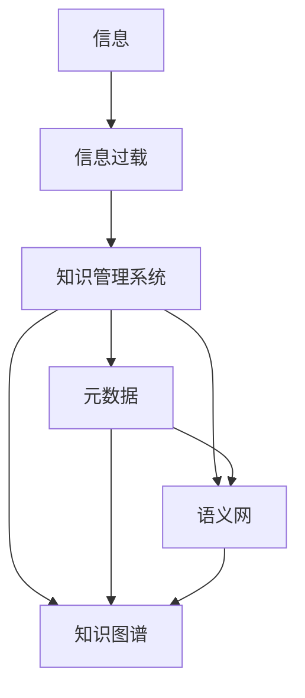

                 

# 信息过载与知识管理系统实施：有效组织和检索信息的指南

## 1. 背景介绍

在信息爆炸的时代，每天都会有海量的数据产生。从互联网到物联网，从社交媒体到科研数据，信息的爆炸性增长不仅带来了新的商机和机会，同时也给信息的组织和检索带来了巨大挑战。在这个信息过载的时代，如何有效地管理和利用知识，成为一个迫切需要解决的问题。本文将探讨信息过载背景下知识管理系统的实施，旨在帮助读者理解信息管理的基本原理和实用策略，并通过具体案例介绍如何构建高效的知识管理系统。

## 2. 核心概念与联系

### 2.1 核心概念概述

在深入讨论知识管理系统的实施之前，我们先来理解几个关键概念：

- **信息过载**：指由于信息的数量急剧增加，超出了人们处理和理解能力的现象。
- **知识管理系统**：利用计算机技术和信息化手段，对知识进行采集、存储、组织、共享和应用的系统。
- **元数据**：描述数据的数据，通常包括数据的来源、格式、质量、创建时间等信息，是知识管理的重要基础。
- **语义网**：通过语义化的方式来描述和连接数据，实现更精确的信息检索和知识关联。
- **知识图谱**：一种基于图结构的语义网络，用于描述实体、属性和实体间的关联关系。

这些概念构成了知识管理系统的基础，也是信息过载时代知识管理的关键所在。理解这些概念及其联系，有助于我们构建一个高效、灵活的知识管理系统。

### 2.2 核心概念原理和架构的 Mermaid 流程图



这个流程图展示了信息过载背景下的知识管理系统实施框架。信息的过载问题需要通过知识管理系统来解决，而知识管理系统的核心在于元数据、语义网和知识图谱的构建和应用。

## 3. 核心算法原理 & 具体操作步骤

### 3.1 算法原理概述

知识管理系统的核心算法可以归纳为以下四个步骤：

1. **信息采集**：从不同的数据源采集原始信息。
2. **信息清洗**：对采集的信息进行去重、纠错、格式转换等处理，保证信息的质量和一致性。
3. **知识表示**：将清洗后的信息转换为机器可理解和处理的格式，如文本、图像、音频等。
4. **知识关联**：通过元数据、语义网和知识图谱，将不同信息进行关联，形成知识网络。

这些步骤是知识管理系统实施的基础，通过算法实现，可以高效地组织和检索信息，从而应对信息过载的挑战。

### 3.2 算法步骤详解

**Step 1: 信息采集**

信息采集是知识管理系统的第一步，可以通过爬虫、API接口、数据库导入等方式获取原始信息。例如，通过Python爬虫库Scrapy可以高效地爬取网页内容，通过OpenAPI获取第三方数据，通过MySQL导入历史数据等。

**Step 2: 信息清洗**

信息清洗是保证信息质量的关键步骤，常用的清洗方法包括：

- **去重**：使用哈希表、布隆过滤器等数据结构去除重复信息。
- **纠错**：使用拼写检查器、语义分析工具进行拼写和语法纠正。
- **格式转换**：将不同格式的信息转换为统一格式，如将PDF、HTML、JSON等格式的信息转换为文本格式。

**Step 3: 知识表示**

知识表示是将信息转换为机器可理解的形式，常用的表示方法包括：

- **文本表示**：使用词袋模型、TF-IDF等方法将文本转换为向量形式。
- **图像表示**：使用卷积神经网络(CNN)将图像转换为特征向量。
- **音频表示**：使用MFCC等方法将音频转换为特征向量。

**Step 4: 知识关联**

知识关联是构建知识网络的关键步骤，常用的关联方法包括：

- **元数据关联**：通过元数据的属性和关系，将不同信息进行关联。
- **语义网关联**：使用RDF、OWL等语义网标准，将信息转换为语义化的形式，并进行关联。
- **知识图谱关联**：使用节点和边的关系描述实体和属性，构建知识图谱进行关联。

### 3.3 算法优缺点

**优点**：

- **高效性**：通过自动化算法，可以快速处理和清洗大量信息，提高效率。
- **准确性**：通过先进的算法，可以保证信息的质量和一致性，减少错误。
- **灵活性**：可以根据不同数据源和格式，灵活选择不同的处理方法，适应性强。

**缺点**：

- **资源消耗大**：信息清洗和知识表示需要大量的计算资源，可能面临性能瓶颈。
- **算法复杂**：不同的数据和信息可能需要不同的处理方法，算法设计和实现较为复杂。
- **难以处理异常数据**：异常数据和噪音数据可能影响算法的准确性。

### 3.4 算法应用领域

知识管理系统在多个领域都有广泛应用，例如：

- **企业知识管理**：帮助企业高效地管理员工知识、项目文档、客户信息等。
- **科研知识管理**：帮助科研机构管理研究成果、论文、数据集等。
- **医疗知识管理**：帮助医疗机构管理患者病历、医学文献、临床指南等。
- **教育知识管理**：帮助学校和教育机构管理课程资源、学生信息、研究成果等。
- **政府知识管理**：帮助政府部门管理政策文件、统计数据、公共信息等。

这些领域都面临着信息过载的挑战，知识管理系统的实施可以帮助其高效地组织和检索信息，提升工作效率和决策质量。

## 4. 数学模型和公式 & 详细讲解 & 举例说明

### 4.1 数学模型构建

知识管理系统的数学模型可以概括为以下三个方面：

1. **信息表示模型**：将信息转换为向量、矩阵等形式，方便计算机处理。
2. **信息关联模型**：通过矩阵乘法、向量内积等方法，将不同信息进行关联。
3. **知识图谱模型**：使用图结构表示实体、属性和关系，方便信息检索和推理。

### 4.2 公式推导过程

**信息表示模型**：

假设原始信息为文本，使用词袋模型表示为向量形式：

$$
\mathbf{x} = (x_1, x_2, ..., x_n)
$$

其中，$x_i$表示第$i$个词在文本中的出现频率。通过TF-IDF等方法，可以计算出每个词的权重，得到加权后的向量：

$$
\mathbf{x} = (w_1, w_2, ..., w_n)
$$

**信息关联模型**：

假设信息$a$和$b$可以表示为向量形式$\mathbf{a}$和$\mathbf{b}$，它们之间的关联可以表示为向量内积：

$$
\mathbf{a} \cdot \mathbf{b} = \sum_{i=1}^{n} a_i b_i
$$

通过向量内积，可以计算出信息$a$和$b$之间的相似度，从而进行信息关联。

**知识图谱模型**：

假设知识图谱中的实体表示为节点，关系表示为边，实体和关系的属性可以表示为标签，知识图谱可以表示为无向图$G=(V,E)$。其中，$V$为节点集合，$E$为边集合。

$$
G=(V,E)
$$

### 4.3 案例分析与讲解

以一个简单的信息检索系统为例，展示知识管理系统的应用：

- **信息采集**：从互联网爬取新闻、博客、社交媒体等信息。
- **信息清洗**：去除重复内容、纠正语法错误、统一文本格式。
- **知识表示**：将新闻内容转换为TF-IDF向量，存储在数据库中。
- **知识关联**：使用TF-IDF向量计算新闻之间的相似度，建立知识图谱。

通过以上步骤，可以实现对新闻的自动分类、主题聚类和信息检索等功能。

## 5. 项目实践：代码实例和详细解释说明

### 5.1 开发环境搭建

信息管理系统的开发需要Python、Scrapy、MySQL等工具和库的支持，具体搭建步骤如下：

1. 安装Python：从官网下载并安装Python。
2. 安装Scrapy：使用pip命令安装Scrapy。
3. 安装MySQL：安装MySQL数据库服务器和客户端。
4. 搭建Scrapy项目：创建Scrapy项目，配置爬虫规则和数据存储路径。

### 5.2 源代码详细实现

以下是使用Python和Scrapy实现信息采集和清洗的示例代码：

```python
import scrapy
from scrapy.spiders import CrawlSpider, Rule
from scrapy.linkextractors import LinkExtractor

class NewsSpider(CrawlSpider):
    name = 'news_spider'
    start_urls = ['https://www.bbc.com/news']
    rules = (
        Rule(LinkExtractor(allow=('/.*bbc.com/news/.*',)), callback='parse_item', follow=True),
    )

    def parse_item(self, response):
        item = {}
        item['url'] = response.url
        item['title'] = response.css('h1::text').get()
        item['content'] = response.css('div::text').get()
        yield item
```

**代码解读与分析**：

- **CrawlSpider**：Scrapy的爬虫类，用于定义爬虫的行为。
- **start_urls**：爬虫的起始URL列表。
- **rules**：定义爬虫的规则，包括爬取哪些URL和如何处理这些URL。
- **parse_item**：定义如何解析爬取到的页面，获取URL、标题和内容。

### 5.3 代码解读与分析

以上代码展示了如何使用Scrapy爬虫类定义爬虫规则和解析爬取到的页面。Scrapy提供了强大的爬虫框架，可以自动处理页面链接和数据抽取，极大地简化了信息采集和清洗的过程。

### 5.4 运行结果展示

运行以上代码，可以得到BBC网站的新闻列表，通过进一步的处理，可以将其转换为TF-IDF向量，存储在MySQL数据库中，并使用知识图谱算法进行信息关联和检索。

## 6. 实际应用场景

### 6.1 企业知识管理

企业知识管理系统的实施，可以帮助企业高效地管理和利用员工知识、项目文档、客户信息等。例如，企业可以建立一个知识管理系统，将所有员工的文档和邮件进行分类和存储，并通过搜索和推荐系统，方便员工快速获取所需信息。

### 6.2 科研知识管理

科研知识管理系统的实施，可以帮助科研机构管理研究成果、论文、数据集等。例如，科研机构可以建立一个知识管理系统，将所有科研项目和论文进行分类和存储，并通过搜索和推荐系统，方便研究人员快速获取所需信息。

### 6.3 医疗知识管理

医疗知识管理系统的实施，可以帮助医疗机构管理患者病历、医学文献、临床指南等。例如，医院可以建立一个知识管理系统，将所有患者的病历和医学文献进行分类和存储，并通过搜索和推荐系统，方便医生快速获取所需信息。

### 6.4 未来应用展望

未来，知识管理系统将在更多的领域得到应用，例如：

- **智能客服系统**：通过知识管理系统，智能客服系统可以高效地处理客户咨询，提供准确的答案和解决方案。
- **智能推荐系统**：通过知识管理系统，智能推荐系统可以推荐用户感兴趣的内容，提升用户体验。
- **智慧城市治理**：通过知识管理系统，智慧城市可以实时监测和管理城市数据，提升城市治理能力。
- **智能教育系统**：通过知识管理系统，智能教育系统可以提供个性化的学习资源和推荐，提升学习效率。

## 7. 工具和资源推荐

### 7.1 学习资源推荐

1. **《信息检索基础》**：作者：信息检索领域的知名专家，系统讲解了信息检索的基本原理和应用。
2. **《知识管理导论》**：作者：知识管理领域的权威人士，介绍了知识管理的基本概念和实践方法。
3. **《Python网络爬虫开发实战》**：作者：Python爬虫开发领域的专家，详细讲解了Scrapy等工具的使用方法。
4. **《MySQL必知必会》**：作者：MySQL数据库的专家，介绍了MySQL数据库的基本操作和优化方法。
5. **《机器学习实战》**：作者：机器学习领域的知名专家，介绍了机器学习的基本算法和实现方法。

通过以上学习资源，可以帮助读者深入理解信息管理系统的原理和实现方法，提高信息管理系统的设计和开发能力。

### 7.2 开发工具推荐

1. **Python**：Python是一种易学易用、功能强大的编程语言，适合开发信息管理系统。
2. **Scrapy**：Scrapy是一个功能强大的Python爬虫框架，适合采集和清洗信息。
3. **MySQL**：MySQL是一种流行的关系型数据库，适合存储和管理信息。
4. **Apache Hadoop**：Apache Hadoop是一个分布式计算框架，适合处理大规模数据集。
5. **ElasticSearch**：ElasticSearch是一个高可扩展的搜索和分析引擎，适合构建搜索系统。

通过以上开发工具，可以高效地实现信息管理系统的开发和部署。

### 7.3 相关论文推荐

1. **《信息检索与内容推荐》**：作者：信息检索和推荐系统的知名专家，介绍了信息检索和推荐算法的基本原理和应用。
2. **《知识管理与企业创新》**：作者：知识管理与企业创新的专家，介绍了知识管理对企业创新的影响和应用。
3. **《数据挖掘与知识发现》**：作者：数据挖掘与知识发现的专家，介绍了数据挖掘和知识发现的基本方法。
4. **《语义网与知识图谱》**：作者：语义网和知识图谱的专家，介绍了语义网和知识图谱的基本原理和应用。
5. **《信息管理系统的设计与实现》**：作者：信息管理系统的专家，介绍了信息管理系统的设计思路和实现方法。

通过以上论文，可以帮助读者深入理解信息管理系统的理论基础和实践方法，推动信息管理系统的应用和创新。

## 8. 总结：未来发展趋势与挑战

### 8.1 研究成果总结

本文详细介绍了信息过载背景下知识管理系统的实施，从信息采集、信息清洗、知识表示、知识关联等方面，讲解了知识管理系统的核心算法和具体操作步骤。通过实际案例，展示了信息管理系统的应用，并通过工具和资源推荐，帮助读者更好地理解和实现信息管理系统。

### 8.2 未来发展趋势

未来的知识管理系统将呈现以下几个发展趋势：

1. **自动化与智能化**：通过人工智能技术，自动完成信息采集、清洗和关联，提升信息管理系统的效率和准确性。
2. **云化与分布式**：通过云计算和分布式技术，实现知识管理系统的扩展和部署，提升系统的可伸缩性和可靠性。
3. **语义化与智能搜索**：通过语义化和智能搜索技术，提升信息检索的精确度和用户体验。
4. **个性化与推荐**：通过个性化和推荐技术，提升信息管理的针对性和用户满意度。
5. **可视化与交互**：通过可视化工具和交互技术，提升信息管理系统的易用性和用户体验。

### 8.3 面临的挑战

信息管理系统在应用过程中，仍面临以下几个挑战：

1. **数据质量**：信息采集和清洗过程中，如何保证数据的质量和一致性，是一个重要的挑战。
2. **资源消耗**：信息管理系统的实现需要大量的计算和存储资源，如何优化资源使用，是一个重要的挑战。
3. **算法复杂**：信息管理系统的算法设计复杂，如何选择合适的算法和实现方法，是一个重要的挑战。
4. **隐私和安全**：信息管理系统中涉及大量的敏感信息，如何保护隐私和安全，是一个重要的挑战。
5. **用户体验**：信息管理系统的用户体验直接关系到系统的使用效果，如何提升用户体验，是一个重要的挑战。

### 8.4 研究展望

未来的信息管理系统研究，需要在以下几个方面进行探索：

1. **自动化与智能化**：通过人工智能技术，自动完成信息采集、清洗和关联，提升信息管理系统的效率和准确性。
2. **云化与分布式**：通过云计算和分布式技术，实现知识管理系统的扩展和部署，提升系统的可伸缩性和可靠性。
3. **语义化与智能搜索**：通过语义化和智能搜索技术，提升信息检索的精确度和用户体验。
4. **个性化与推荐**：通过个性化和推荐技术，提升信息管理的针对性和用户满意度。
5. **可视化与交互**：通过可视化工具和交互技术，提升信息管理系统的易用性和用户体验。

## 9. 附录：常见问题与解答

**Q1：信息管理系统的核心算法是什么？**

A: 信息管理系统的核心算法包括信息采集、信息清洗、知识表示和知识关联。这些算法通过机器学习和人工智能技术，实现了信息的自动处理和关联，提升了信息管理的效率和质量。

**Q2：如何保证信息管理系统的数据质量？**

A: 信息管理系统的数据质量可以通过以下方法保证：

1. 使用数据清洗工具，去除重复、错误和异常数据。
2. 使用数据验证工具，检测数据的一致性和完整性。
3. 使用数据标准化工具，统一数据格式和结构。
4. 使用数据加密技术，保护数据隐私和安全。

**Q3：信息管理系统面临的挑战是什么？**

A: 信息管理系统面临的挑战包括：

1. 数据质量：如何保证数据的质量和一致性，是一个重要的挑战。
2. 资源消耗：信息管理系统的实现需要大量的计算和存储资源，如何优化资源使用，是一个重要的挑战。
3. 算法复杂：信息管理系统的算法设计复杂，如何选择合适的算法和实现方法，是一个重要的挑战。
4. 隐私和安全：信息管理系统中涉及大量的敏感信息，如何保护隐私和安全，是一个重要的挑战。
5. 用户体验：信息管理系统的用户体验直接关系到系统的使用效果，如何提升用户体验，是一个重要的挑战。

**Q4：信息管理系统的应用前景是什么？**

A: 信息管理系统的应用前景广泛，包括：

1. 企业知识管理：帮助企业高效地管理和利用员工知识、项目文档、客户信息等。
2. 科研知识管理：帮助科研机构管理研究成果、论文、数据集等。
3. 医疗知识管理：帮助医疗机构管理患者病历、医学文献、临床指南等。
4. 教育知识管理：帮助学校和教育机构管理课程资源、学生信息、研究成果等。
5. 政府知识管理：帮助政府部门管理政策文件、统计数据、公共信息等。

**Q5：如何选择合适的信息管理系统工具？**

A: 选择合适的信息管理系统工具，需要考虑以下几个因素：

1. 功能需求：根据业务需求，选择功能丰富的工具。
2. 技术栈：根据技术栈和开发经验，选择适合的开发工具。
3. 性能要求：根据数据量和计算需求，选择性能优化的工具。
4. 可扩展性：根据系统规模和未来需求，选择可扩展的工具。
5. 用户体验：根据用户需求和界面设计，选择易用的工具。

**Q6：如何构建高效的信息管理系统？**

A: 构建高效的信息管理系统，需要遵循以下步骤：

1. 明确需求：根据业务需求，明确信息管理系统的目标和功能。
2. 设计架构：根据需求，设计信息管理系统的架构和组件。
3. 数据采集：从不同数据源采集原始信息，保证数据的质量和一致性。
4. 数据清洗：对采集的信息进行去重、纠错、格式转换等处理。
5. 知识表示：将清洗后的信息转换为机器可理解的格式，如文本、图像、音频等。
6. 知识关联：通过元数据、语义网和知识图谱，将不同信息进行关联，构建知识网络。
7. 系统部署：将信息管理系统部署到合适的环境，保证系统的稳定性和可扩展性。
8. 用户培训：对用户进行系统培训，提升系统的使用效果和用户体验。

**Q7：如何优化信息管理系统的性能？**

A: 优化信息管理系统的性能，可以通过以下方法：

1. 数据压缩：对大规模数据进行压缩，减少存储和传输的资源消耗。
2. 分布式计算：使用分布式计算框架，提升系统的计算效率和可扩展性。
3. 缓存技术：使用缓存技术，减少数据访问的延迟和计算资源消耗。
4. 算法优化：优化算法的实现，提升系统的处理效率和准确性。
5. 硬件升级：升级硬件设备，提升系统的计算能力和存储容量。

通过以上优化方法，可以提升信息管理系统的性能，满足不同的业务需求。

