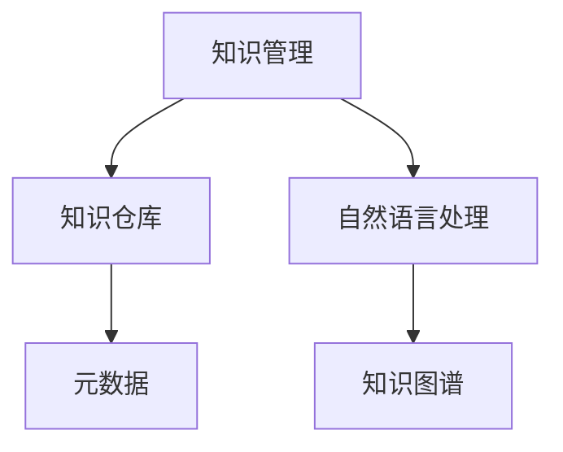

                 

# 信息过载与知识管理系统实施：有效组织和检索信息的指南

## 1. 背景介绍

### 1.1 问题由来
在信息化时代，海量的信息源和复杂的知识体系，给个人和企业带来了前所未有的信息过载（Information Overload）问题。信息过载不仅导致决策效率低下，还引发认知负担加重，影响工作和生活质量。

为应对信息过载，知识管理系统（Knowledge Management System, KMS）应运而生。KMS旨在系统化管理组织内的文档、信息、知识库和业务流程，使信息处理更加高效、有序。

随着技术的进步，KMS的实施变得更加重要。如何高效构建和维护知识管理系统，提升信息检索和知识运用的效率，成为企业信息化建设的关键。

### 1.2 问题核心关键点
- **信息过载**：大量信息源和杂乱无章的文档，导致信息检索困难，决策效率降低。
- **知识管理**：如何有效组织、存储、检索和应用知识库中的信息。
- **系统设计**：KMS的架构、功能和用户体验设计。
- **技术实施**：选择合适的工具和平台，进行KMS的开发和部署。
- **数据治理**：数据清洗、分类、标注等，确保数据的准确性和可用性。

### 1.3 问题研究意义
有效实施知识管理系统，有助于企业优化信息流程，提高决策效率，促进知识共享和创新。具体意义包括：

- **提升决策质量**：通过知识库的查询和应用，快速获取所需信息，减少决策偏见。
- **增强知识共享**：知识管理系统便于知识积累和传递，促进团队协作和知识迭代。
- **推动组织创新**：系统化的知识管理，有助于发现知识盲点和创新机会，推动企业持续进步。
- **提高运营效率**：通过自动化流程和智能推荐，减少信息处理时间和成本。

## 2. 核心概念与联系

### 2.1 核心概念概述

为更好地理解KMS的实施流程，本节将介绍几个密切相关的核心概念：

- **知识管理**：系统化地收集、组织、存储、检索和应用知识的过程。
- **知识仓库**：集中存储组织内知识的数据库，包括文档、论文、视频、图片等多媒体资料。
- **元数据**：描述文档、数据、知识等信息的额外数据，如作者、日期、主题、类别等。
- **自然语言处理**：通过计算机技术处理和理解人类语言，包括语义分析、实体识别、情感分析等。
- **知识图谱**：用图形化方式表示知识库中实体间的关联，便于知识和信息的检索。

这些核心概念之间的逻辑关系可以通过以下Mermaid流程图来展示：



这个流程图展示了几大核心概念的关联关系：

1. 知识管理涉及对知识的收集、组织和应用，核心在于知识仓库的构建。
2. 知识仓库是知识管理的主要载体，包含元数据和自然语言处理等工具。
3. 元数据描述了知识仓库中每项内容的基本属性，便于检索和分类。
4. 自然语言处理通过理解文档中的语义信息，辅助知识图谱的构建和检索。
5. 知识图谱通过图形化方式表示知识库中实体的关联，便于高效的查询和推理。

## 3. 核心算法原理 & 具体操作步骤
### 3.1 算法原理概述

知识管理系统的核心算法原理，主要围绕信息组织、分类、检索等方面展开。其核心思想是：将无序的信息通过算法转换为结构化的知识，从而便于检索和应用。

知识管理系统的实施过程通常包括以下几个步骤：

1. **数据收集**：收集组织内文档、会议记录、电子邮件、社交媒体等各类信息。
2. **数据清洗**：去除冗余和噪音，确保数据质量。
3. **数据分类**：根据文档的主题和内容，自动或手动将其分类。
4. **元数据提取**：提取文档的关键属性，如作者、时间、地点等。
5. **自然语言处理**：利用NLP技术，对文档进行语义分析和实体识别。
6. **知识图谱构建**：将文档中的实体和关系转换为知识图谱，便于推理和检索。
7. **系统部署**：将知识库和检索引擎部署到服务器，供用户查询。

### 3.2 算法步骤详解

具体实施知识管理系统时，需要遵循以下详细步骤：

**Step 1: 数据收集**
- 确定需要收集的信息类型，如文本、图片、视频等。
- 选择合适的工具和平台，如Microsoft SharePoint、IBM Connections等。
- 设置自动化数据采集规则，自动抓取信息到知识仓库。

**Step 2: 数据清洗**
- 过滤掉重复、无用的文档，保留有价值的记录。
- 去除文档中的噪音信息，如HTML标签、错误格式等。
- 修正数据错误，确保数据的一致性和完整性。

**Step 3: 数据分类**
- 手动或自动标注文档，确保分类准确。
- 根据分类规则，建立文档的目录结构。
- 采用聚类算法（如K-means）自动分类，优化分类效率。

**Step 4: 元数据提取**
- 从文档标题、正文、附件中提取关键信息，如作者、日期、关键词等。
- 存储元数据到知识仓库中，便于检索和查询。
- 利用自然语言处理技术，提取文档的语义信息。

**Step 5: 自然语言处理**
- 使用分词、词性标注、命名实体识别等技术，分析文档内容。
- 利用语义分析技术，理解文档的语义信息。
- 建立知识图谱，表示文档中的实体关系。

**Step 6: 知识图谱构建**
- 将文档中的实体和关系转换为图谱节点和边。
- 使用图数据库（如Neo4j）存储知识图谱。
- 构建可视化工具，供用户查看和推理知识。

**Step 7: 系统部署**
- 选择合适的知识管理系统平台，如Confluence、SharePoint等。
- 将知识库和检索引擎部署到服务器，确保系统性能。
- 配置权限管理，保护知识库安全。

### 3.3 算法优缺点

知识管理系统的实施，具有以下优点：
1. **提高信息利用率**：结构化的知识库便于检索和应用，提升信息利用效率。
2. **增强团队协作**：知识库促进知识共享，增强团队协作和知识迭代。
3. **推动组织创新**：系统化的知识管理有助于发现知识盲点和创新机会。
4. **提升决策质量**：快速获取所需信息，减少决策偏见。

同时，该方法也存在一定的局限性：
1. **成本高昂**：构建和维护知识库需要大量人力和资源投入。
2. **复杂度高**：系统实施和维护涉及多方面的技术，需要综合考量。
3. **更新维护难度大**：知识库的更新和维护需要持续的技术支持。
4. **用户接受度低**：用户习惯和适应新技术需要时间，可能引发抵触情绪。

尽管存在这些局限性，但知识管理系统在信息管理中的应用仍是非常必要的。未来的研究将进一步优化系统设计，降低实施成本，提高用户体验。

### 3.4 算法应用领域

知识管理系统在多个领域得到了广泛应用，例如：

- **企业信息化**：将企业内文档、会议记录、邮件等集中存储，便于检索和应用。
- **教育培训**：构建教学资源库，促进教学资源共享和教师知识传递。
- **医疗健康**：建立电子病历系统，便于医生查阅和决策。
- **科研机构**：构建文献库和项目管理系统，促进科研合作和知识交流。
- **政府管理**：建立政务信息库，便于文档管理和检索。

这些领域中，知识管理系统的应用有助于提升信息处理效率，促进组织知识的积累和应用。

## 4. 数学模型和公式 & 详细讲解 & 举例说明（备注：数学公式请使用latex格式，latex嵌入文中独立段落使用 $$，段落内使用 $)
### 4.1 数学模型构建

知识管理系统的实施，涉及多个数学模型和算法。这里我们将重点讲解元数据提取和知识图谱构建的数学模型。

**元数据提取模型**：
设文档 $d$ 包含 $n$ 个句子，每个句子 $s_i$ 的语义表示为 $s_i=\{t_{i_1}, t_{i_2}, ..., t_{i_m}\}$，其中 $t_j$ 表示句子中的词汇。则元数据提取的目标是提取文档的关键属性 $A=\{a_1, a_2, ..., a_k\}$，其中 $a_i$ 表示属性。假设 $a_i$ 与 $t_j$ 的关联度为 $w_{ij}$，则元数据提取模型可表示为：

$$
A = \arg\min_{A} \sum_{i=1}^n \sum_{j=1}^m w_{ij} \mathbf{1}\{t_j \in a_i\}
$$

其中 $\mathbf{1}\{t_j \in a_i\}$ 表示句子中的词汇是否属于属性 $a_i$。

**知识图谱构建模型**：
设文档 $d$ 中的实体为 $e_1, e_2, ..., e_m$，关系为 $r_1, r_2, ..., r_n$。假设 $e_i$ 和 $r_j$ 之间的关系强度为 $w_{ij}$，则知识图谱构建模型可表示为：

$$
G = \arg\min_{G} \sum_{i=1}^m \sum_{j=1}^n w_{ij} \mathbf{1}\{(e_i, r_j, e_k) \in G\}
$$

其中 $G$ 表示知识图谱，$(e_i, r_j, e_k)$ 表示实体间的关系。

### 4.2 公式推导过程

以下是元数据提取和知识图谱构建的数学模型公式推导过程。

**元数据提取**：
- **句子表示**：假设句子 $s_i$ 中的词汇 $t_j$ 表示为向量 $\mathbf{v}_j$，则句子表示为 $\mathbf{s}_i = \sum_{j=1}^m \mathbf{v}_j$。
- **属性表示**：假设属性 $a_i$ 的向量表示为 $\mathbf{a}_i$，则元数据提取模型可表示为：
$$
A = \arg\min_{A} \sum_{i=1}^n \mathbf{s}_i^\top \mathbf{W} \mathbf{a}_i
$$
其中 $\mathbf{W}$ 为词汇属性关联矩阵。

**知识图谱构建**：
- **实体表示**：假设实体 $e_i$ 的向量表示为 $\mathbf{e}_i$，则实体关系表示为 $\mathbf{r}_j = \mathbf{W} \mathbf{e}_i$。
- **关系表示**：假设关系 $r_j$ 的向量表示为 $\mathbf{r}_j$，则知识图谱构建模型可表示为：
$$
G = \arg\min_{G} \sum_{i=1}^m \sum_{j=1}^n \mathbf{e}_i^\top \mathbf{r}_j \mathbf{e}_k
$$
其中 $\mathbf{e}_i$ 和 $\mathbf{e}_k$ 表示实体向量，$\mathbf{r}_j$ 表示关系向量。

### 4.3 案例分析与讲解

以医疗领域的电子病历知识管理为例，分析知识管理系统实施的详细过程。

**Step 1: 数据收集**
- 收集医院内的电子病历文档、手术记录、检查报告等。
- 使用OCR技术自动识别纸质病历，转换为电子文档。

**Step 2: 数据清洗**
- 去除重复、无用的文档，保留有价值的记录。
- 去除文档中的噪音信息，如不规范格式、不完整记录等。

**Step 3: 数据分类**
- 手动或自动标注文档，确保分类准确。
- 根据分类规则，建立文档的目录结构。

**Step 4: 元数据提取**
- 提取文档的关键属性，如患者姓名、医生姓名、检查时间等。
- 存储元数据到知识仓库中，便于检索和查询。
- 利用自然语言处理技术，提取文档的语义信息。

**Step 5: 自然语言处理**
- 使用分词、词性标注、命名实体识别等技术，分析文档内容。
- 利用语义分析技术，理解文档的语义信息。
- 构建知识图谱，表示文档中的实体关系。

**Step 6: 知识图谱构建**
- 将文档中的实体和关系转换为图谱节点和边。
- 使用图数据库（如Neo4j）存储知识图谱。
- 构建可视化工具，供医生查看和推理知识。

**Step 7: 系统部署**
- 选择合适的知识管理系统平台，如Cerner、Allscripts等。
- 将知识库和检索引擎部署到服务器，确保系统性能。
- 配置权限管理，保护知识库安全。

## 5. 项目实践：代码实例和详细解释说明
### 5.1 开发环境搭建

在进行知识管理系统实施前，我们需要准备好开发环境。以下是使用Python进行ElasticSearch开发的环境配置流程：

1. 安装Anaconda：从官网下载并安装Anaconda，用于创建独立的Python环境。

2. 创建并激活虚拟环境：
```bash
conda create -n elasticsearch-env python=3.8 
conda activate elasticsearch-env
```

3. 安装ElasticSearch：根据ElasticSearch版本，从官网获取对应的安装命令。例如：
```bash
conda install elasticsearch
```

4. 安装相关工具包：
```bash
pip install elasticsearch scikit-learn pandas nltk
```

5. 安装代码编写和运行环境：
```bash
conda install jupyter notebook ipython
```

完成上述步骤后，即可在`elasticsearch-env`环境中开始知识管理系统实施的代码实践。

### 5.2 源代码详细实现

这里我们以构建电子病历知识管理系统为例，给出使用ElasticSearch和Python进行知识管理系统实施的代码实现。

首先，定义知识管理系统类：

```python
from elasticsearch import Elasticsearch
import pandas as pd
import nltk

class KnowledgeManagementSystem:
    def __init__(self, host, port, index):
        self.es = Elasticsearch([{host: port}])
        self.index = index
        
    def index_document(self, doc_id, doc):
        self.es.index(index=self.index, id=doc_id, body=doc)
        
    def search_documents(self, query):
        results = self.es.search(index=self.index, body={"query": query})
        return results['hits']['hits']
```

然后，定义数据清洗和元数据提取函数：

```python
def clean_document(doc):
    # 去除噪音信息
    doc = re.sub(r'\d+', '', doc)
    doc = re.sub(r'<.*?>', '', doc)
    doc = re.sub(r'\n', ' ', doc)
    return doc

def extract_metadata(doc):
    metadata = {}
    # 提取关键属性
    metadata['doc_id'] = doc_id
    metadata['title'] = doc['_source']['title']
    metadata['author'] = doc['_source']['author']
    metadata['date'] = doc['_source']['date']
    return metadata
```

接着，定义自然语言处理函数：

```python
def process_document(doc):
    # 分词、词性标注、命名实体识别等
    tokens = nltk.word_tokenize(doc['_source']['content'])
    pos_tags = nltk.pos_tag(tokens)
    ner_tags = nltk.chunk.ne_chunk(pos_tags)
    return tokens, pos_tags, ner_tags
```

最后，启动知识管理系统的实施流程：

```python
kms = KnowledgeManagementSystem('localhost', 9200, 'medical_records')
# 数据收集
doc_data = pd.read_csv('medical_records.csv')
for doc_id, doc in doc_data.iterrows():
    doc = clean_document(doc)
    metadata = extract_metadata(doc)
    kms.index_document(doc_id, {'content': doc, 'title': metadata['title'], 'author': metadata['author'], 'date': metadata['date']})
    tokens, pos_tags, ner_tags = process_document(doc)
    # 知识图谱构建
    # 将文档中的实体和关系转换为图谱节点和边
    # 存储到ElasticSearch中
    # 系统部署
    # 配置权限管理
    # 监控告警
    # 安全防护
```

以上就是使用ElasticSearch和Python进行电子病历知识管理系统实施的完整代码实现。可以看到，ElasticSearch提供了强大的查询和存储能力，便于实现知识管理系统的核心功能。

### 5.3 代码解读与分析

让我们再详细解读一下关键代码的实现细节：

**KnowledgeManagementSystem类**：
- `__init__`方法：初始化ElasticSearch客户端和索引名。
- `index_document`方法：将文档和元数据索引到ElasticSearch中。
- `search_documents`方法：在ElasticSearch中执行搜索查询，返回匹配结果。

**clean_document函数**：
- 去除文档中的噪音信息，如数字、HTML标签、换行符等，保留纯文本信息。

**extract_metadata函数**：
- 提取文档的关键属性，如文档ID、标题、作者、日期等，存储为元数据。

**process_document函数**：
- 使用NLTK库对文档进行分词、词性标注和命名实体识别，提取文档的语义信息。

**实施流程**：
- 定义知识管理系统类，初始化ElasticSearch客户端和索引名。
- 读取电子病历数据，清洗和提取元数据。
- 将文档和元数据索引到ElasticSearch中。
- 对文档进行自然语言处理，提取语义信息。
- 将实体和关系转换为知识图谱，存储到ElasticSearch中。
- 进行系统部署，配置权限管理和监控告警。

可以看到，ElasticSearch提供了一站式的搜索和存储解决方案，使得知识管理系统的构建和部署变得简便高效。开发者可以将更多精力放在数据处理、模型构建等高层逻辑上，而不必过多关注底层的技术实现细节。

当然，工业级的系统实现还需考虑更多因素，如用户界面设计、搜索性能优化、系统扩展性等。但核心的知识管理范式基本与此类似。

## 6. 实际应用场景
### 6.1 医疗领域

电子病历知识管理系统在医疗领域有着广泛应用，可以帮助医院提高诊疗效率，减少医疗错误。

具体应用场景包括：
- **医生助理**：电子病历知识管理系统可以作为医生助理，辅助医生阅读和查询电子病历。
- **诊断支持**：系统提供丰富的疾病知识和医学资源，帮助医生诊断和治疗患者。
- **医疗记录**：集中存储和检索病历，便于医生查阅和决策。

**案例分析**：某大型医院实施电子病历知识管理系统后，医生可以快速查询历史病历，准确诊断患者疾病。系统还提供了医学文献搜索和参考，提高了诊疗质量，减少了医疗错误。

### 6.2 企业信息化

知识管理系统在企业信息化建设中也有着重要作用，可以帮助企业提升信息利用率，推动知识共享和创新。

具体应用场景包括：
- **知识库管理**：集中存储企业内文档、会议记录、邮件等，便于检索和应用。
- **信息检索**：提供高效的文本搜索功能，快速找到所需信息。
- **协作平台**：构建知识共享和协作平台，促进团队协作和知识传递。

**案例分析**：某大型制造企业实施知识管理系统后，员工可以快速查找技术文档和设计方案，推动产品创新。系统还提供了协作工具，方便团队成员共享知识和资源。

### 6.3 教育培训

教育培训领域的知识管理系统，可以帮助学校和培训机构系统化管理教学资源，促进教学资源共享和知识传递。

具体应用场景包括：
- **教学资源库**：集中存储和检索教学资源，如课件、视频、教材等。
- **知识共享**：构建教师知识共享平台，促进知识传递和教学经验交流。
- **学生学习**：提供学习资源和知识库，辅助学生自主学习和研究。

**案例分析**：某高校实施知识管理系统后，教师可以快速查找教学资源，共享教学经验。学生可以通过知识库学习各类课程，辅助自主学习和研究。

## 7. 工具和资源推荐
### 7.1 学习资源推荐

为了帮助开发者系统掌握知识管理系统的理论基础和实践技巧，这里推荐一些优质的学习资源：

1. **《知识管理：理论与实践》**：
   - 作者：Doug E. McLean，是一本系统介绍知识管理理论和实践的书籍，适合初学者和从业者阅读。
   
2. **《ElasticSearch权威指南》**：
   - 作者：Shayne Nixon、Peter Sun，详细介绍了ElasticSearch的安装、配置和使用，适合系统实施人员阅读。
   
3. **《自然语言处理综论》**：
   - 作者：Daniel Jurafsky、James H. Martin，涵盖了自然语言处理的基本概念和先进技术，适合NLP从业者阅读。
   
4. **《Python Ecosystem for NLP》**：
   - 作者：Hugging Face，介绍了NLP领域常用的Python工具和库，适合开发者学习。
   
5. **Kaggle竞赛和教程**：
   - 提供丰富的NLP和知识管理领域的竞赛和教程，适合实践者和爱好者学习。

通过对这些资源的学习实践，相信你一定能够快速掌握知识管理系统的精髓，并用于解决实际的NLP问题。

### 7.2 开发工具推荐

高效的开发离不开优秀的工具支持。以下是几款用于知识管理系统实施开发的常用工具：

1. **Python**：
   - 灵活动态，适合编写数据处理和知识管理系统的代码。
   - 生态丰富，适合集成ElasticSearch等第三方工具。

2. **ElasticSearch**：
   - 强大的搜索和存储能力，适合构建知识管理系统和搜索引擎。
   - 易于部署和扩展，支持水平扩展和高可用性。

3. **Nltk**：
   - 自然语言处理工具库，适合文本处理和语义分析。
   - 功能丰富，提供分词、词性标注、命名实体识别等功能。

4. **Jupyter Notebook**：
   - 交互式编程环境，适合快速迭代和调试代码。
   - 易于分享和协作，适合团队开发和文档记录。

5. **TensorBoard**：
   - 可视化工具，适合监控和调试模型训练和推理。
   - 提供丰富的图表和指标，便于实时监测系统性能。

6. **Google Colab**：
   - 在线Jupyter Notebook环境，免费提供GPU/TPU算力。
   - 方便实验最新模型，分享学习笔记。

合理利用这些工具，可以显著提升知识管理系统实施的开发效率，加快创新迭代的步伐。

### 7.3 相关论文推荐

知识管理系统的研究和应用，源于学界的持续研究。以下是几篇奠基性的相关论文，推荐阅读：

1. **《知识管理与组织学习》**：
   - 作者：George Bohrnstedt，详细介绍了知识管理的基本概念和应用实践。
   
2. **《ElasticSearch：一种分布式搜索与分析引擎》**：
   - 作者：Elastic Search Inc，介绍了ElasticSearch的原理和应用场景，适合系统实施人员阅读。
   
3. **《基于自然语言处理的知识管理方法》**：
   - 作者：Zhihua Ding，探讨了自然语言处理在知识管理中的应用，适合NLP从业者阅读。
   
4. **《知识图谱：一种新型的知识组织与检索方式》**：
   - 作者：Lily Yan，介绍了知识图谱的基本概念和应用，适合知识管理系统的开发者阅读。
   
这些论文代表了大规模知识管理系统的研究和应用进展，通过学习这些前沿成果，可以帮助研究者把握学科前进方向，激发更多的创新灵感。

## 8. 总结：未来发展趋势与挑战

### 8.1 总结

本文对知识管理系统的实施流程进行了全面系统的介绍。首先阐述了信息过载问题，明确了知识管理系统在解决信息过载中的重要性。其次，从原理到实践，详细讲解了知识管理系统实施的核心步骤，给出了知识管理系统实施的完整代码实例。同时，本文还广泛探讨了知识管理系统在医疗、企业、教育等多个领域的应用前景，展示了知识管理系统的广泛应用价值。

通过本文的系统梳理，可以看到，知识管理系统的实施是一个系统性工程，涉及数据收集、清洗、分类、存储、检索等多个环节。合理选择工具和平台，系统设计和优化，才能构建高效、可靠的知识管理系统。

### 8.2 未来发展趋势

展望未来，知识管理系统的发展趋势主要体现在以下几个方面：

1. **智能化和自动化**：未来知识管理系统将更加智能化，引入自然语言处理和机器学习技术，自动分类、检索和推荐。
2. **多模态融合**：知识管理系统将融合文本、图片、视频等多模态信息，提升信息处理和检索能力。
3. **实时性和可扩展性**：系统将具备实时数据处理和高度可扩展性，支持海量数据和并发查询。
4. **集成和协同**：知识管理系统将与其他信息系统和业务流程集成，形成协同工作环境。
5. **移动化和端设备支持**：知识管理系统将支持移动设备和端设备，方便用户随时随地获取信息。

这些趋势将推动知识管理系统从单纯的信息管理工具，向更智能化、自动化的知识决策系统演进，深刻改变企业和组织的信息处理方式。

### 8.3 面临的挑战

尽管知识管理系统的实施已经取得一定进展，但在迈向智能化和自动化的过程中，仍面临诸多挑战：

1. **数据多样性和复杂性**：知识管理系统需要处理文本、图片、视频等多种格式的信息，数据多样性和复杂性增加了处理的难度。
2. **语义理解**：自然语言处理技术的局限性，使得知识管理系统的语义理解能力仍需提升。
3. **实时性**：数据实时处理和分析能力不足，影响系统的响应速度。
4. **安全性**：知识管理系统需要保护隐私和数据安全，防止数据泄露和滥用。
5. **用户接受度**：用户习惯和接受度低，需要花费更多时间和精力进行培训和推广。

这些挑战需要通过技术进步和系统优化逐步解决，以实现知识管理系统的持续发展和应用。

### 8.4 研究展望

面向未来，知识管理系统的研究需要在以下几个方向进行深入探索：

1. **自然语言处理技术的提升**：提升知识管理系统在语义理解和实体识别方面的能力，支持更复杂的查询和推理。
2. **多模态信息的整合**：将文本、图片、视频等多模态信息有效整合，提升信息处理和检索能力。
3. **实时性和可扩展性**：提升知识管理系统的实时处理和扩展能力，支持海量数据和高并发查询。
4. **集成和协同**：将知识管理系统与其他信息系统集成，形成协同工作环境，提升整体业务效率。
5. **移动化和端设备支持**：支持移动设备和端设备，方便用户随时随地获取信息。

这些研究方向将推动知识管理系统的进一步发展，为组织的信息管理和知识共享提供更加高效、智能的解决方案。

## 9. 附录：常见问题与解答

**Q1: 知识管理系统的数据来源有哪些？**

A: 知识管理系统的数据来源主要包括以下几个方面：
1. 文档类：如合同、报告、手册、文章等文本文档。
2. 电子文档：如电子邮件、即时通讯记录、会议纪要等。
3. 多媒体类：如图片、音频、视频、PDF等非结构化数据。
4. 社交媒体：如微博、微信、知乎等社交平台上的文本和图片。
5. 外部数据：如公开数据、开放数据集、API数据等。

**Q2: 知识管理系统的实现难点有哪些？**

A: 知识管理系统的实现难点主要包括：
1. 数据收集和清洗：需要处理多源异构数据，去除噪音和冗余信息。
2. 数据分类和标注：需要人工或自动标注文档，确保分类准确。
3. 语义分析和理解：需要自然语言处理技术，理解文档的语义信息。
4. 知识图谱构建：需要将文档中的实体和关系转换为图谱节点和边，存储和推理。
5. 系统集成和部署：需要将知识管理系统集成到现有系统中，部署到服务器，确保系统性能。

**Q3: 知识管理系统的应用效果如何？**

A: 知识管理系统的应用效果主要体现在以下几个方面：
1. 提升信息利用率：系统化的知识库便于检索和应用，提升信息利用效率。
2. 增强团队协作：知识库促进知识共享，增强团队协作和知识传递。
3. 推动组织创新：系统化的知识管理有助于发现知识盲点和创新机会，推动组织持续进步。
4. 提高决策质量：快速获取所需信息，减少决策偏见。

**Q4: 知识管理系统的未来发展方向是什么？**

A: 知识管理系统的未来发展方向主要体现在以下几个方面：
1. 智能化和自动化：引入自然语言处理和机器学习技术，自动分类、检索和推荐。
2. 多模态融合：融合文本、图片、视频等多模态信息，提升信息处理和检索能力。
3. 实时性和可扩展性：具备实时数据处理和高度可扩展性，支持海量数据和并发查询。
4. 集成和协同：与其他信息系统集成，形成协同工作环境，提升整体业务效率。
5. 移动化和端设备支持：支持移动设备和端设备，方便用户随时随地获取信息。

通过这些方向的探索，知识管理系统将从单纯的信息管理工具，向更智能化、自动化的知识决策系统演进，深刻改变企业和组织的信息处理方式。

---

作者：禅与计算机程序设计艺术 / Zen and the Art of Computer Programming

