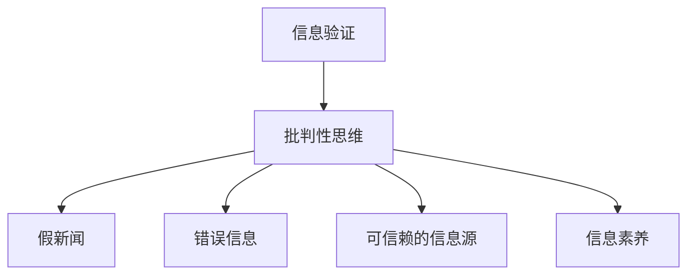

                 

# 信息验证和批判性思维能力培养：在假新闻和错误信息时代导航

## 1. 背景介绍

### 1.1 问题由来

在信息化高度发达的今天，信息爆炸已成为我们日常生活的一部分。通过搜索引擎、社交媒体、新闻网站等渠道，我们能够随时随地获取到海量信息。然而，伴随着信息海量的同时也伴随着信息噪音。尤其是在假新闻、错误信息大量泛滥的时代，我们更需要培养信息验证和批判性思维能力，以辨别信息的真伪，避免被错误信息误导。

### 1.2 问题核心关键点

当前，信息验证和批判性思维能力培养涉及以下几个核心问题：

- 如何从海量信息中筛选出可信的信息源？
- 如何识别假新闻和错误信息的特征和模式？
- 如何综合运用多种方法，对信息进行多方验证？
- 如何构建信息验证的自动系统，提升验证效率？
- 如何在教育和培训中普及信息验证和批判性思维能力？

这些问题的答案，需要融合信息技术、新闻学、心理学、教育学等多个学科的知识，才能实现系统的解决。

### 1.3 问题研究意义

研究信息验证和批判性思维能力的培养，对于构建健康的网络环境，提升公众信息素养，促进社会和谐稳定，具有重要的现实意义：

1. 提升公众的信息素养。掌握信息验证和批判性思维能力，能使公众具备分辨信息真伪的能力，增强信息消费的主动性和选择性。
2. 构建健康网络环境。有效识别和遏制假新闻、错误信息，减少谣言传播，构建积极健康的网络生态。
3. 促进社会和谐稳定。减少信息噪音对社会的负面影响，增强社会的共识和凝聚力。
4. 推动教育改革。将信息验证和批判性思维能力的培养纳入教育体系，提升国民的全面素质。
5. 助力经济发展。增强企业决策的科学性和透明度，促进数据驱动的经济发展。

## 2. 核心概念与联系

### 2.1 核心概念概述

为更好地理解信息验证和批判性思维能力培养的方法，本节将介绍几个密切相关的核心概念：

- 信息验证(Information Verification)：通过多种手段和方法，对信息源、信息内容进行多方求证和验证，确保其真实性和可靠性。
- 批判性思维(Critical Thinking)：一种理性、科学、系统化的思维方式，通过质疑、分析、推理等过程，从多个角度评估信息的可信度。
- 假新闻(Fake News)：故意制造和传播的虚假新闻，以误导读者为目的。
- 错误信息(Misinformation)：在无意中传播的错误或误导性信息，可能含有事实错误或信息断章取义。
- 可信赖的信息源(Trusted Sources)：权威、专业、公正的信息发布机构，其发布的信息可信度较高。
- 信息素养(Information Literacy)：公众获取、评估和利用信息的能力，包括信息搜索、信息识别、信息判断、信息评估等。

这些核心概念之间的逻辑关系可以通过以下Mermaid流程图来展示：



这个流程图展示了几大核心概念之间的关系：

1. 信息验证是对信息的全面求证，批判性思维是信息验证的关键方法。
2. 假新闻和错误信息是需要识别和纠正的对象，信息验证和批判性思维的目标之一。
3. 可信赖的信息源是信息验证的参考标准，能够提供高质量的信息。
4. 信息素养是信息验证和批判性思维的基础，提升公众的信息处理能力。

## 3. 核心算法原理 & 具体操作步骤

### 3.1 算法原理概述

信息验证和批判性思维能力培养的核心在于，通过多方求证和系统分析，对信息进行综合验证，确保其真实性和可靠性。这一过程可以分为信息筛选、信息源验证、内容验证和综合评估四个步骤。

1. **信息筛选**：利用搜索引擎、社交媒体、新闻聚合等工具，对海量信息进行初步筛选，缩小关注范围。
2. **信息源验证**：对选定的信息源进行背景调查，确认其权威性和可信度。
3. **内容验证**：对信息内容进行事实核对、逻辑推理等多方验证，确保其真实性和准确性。
4. **综合评估**：结合信息源验证和内容验证的结果，综合评估信息的可信度，给出最终结论。

### 3.2 算法步骤详解

基于上述原理，信息验证和批判性思维能力培养的一般步骤如下：

**Step 1: 信息筛选**

1. 使用搜索引擎和新闻聚合工具，如Google、Bing、雅虎、搜狐、腾讯新闻等，输入关键词进行搜索。
2. 根据搜索结果的可信度、发布时间和更新频率等因素，筛选出初步关注的信息源。
3. 对信息源进行初步阅读，选择潜在可信的信息进行下一步验证。

**Step 2: 信息源验证**

1. 收集信息源的背景信息，包括出版时间、更新频率、机构资质、作者资历等。
2. 查找信息源的其他发布平台，确认其多平台一致性。
3. 查找与信息源相关的权威机构或专家，确认其权威性。

**Step 3: 内容验证**

1. 对信息内容进行事实核对，确认其真实性和准确性。可以通过多方搜索、查阅权威资料、对照多个平台信息等方式进行。
2. 对信息内容的逻辑进行推理，确认其逻辑连贯性和科学性。可以结合背景知识、相关研究、专家观点等进行。
3. 使用专门的工具和平台，如FactCheck.org、Snopes.com、PolitiFact等，进行综合验证。

**Step 4: 综合评估**

1. 结合信息源验证和内容验证的结果，综合评估信息的可信度。
2. 如果信息源可信度高，内容验证结果一致，可以初步判断信息可信。
3. 如果信息源可信度低，或内容验证结果不一致，需要进一步深入核实。

### 3.3 算法优缺点

信息验证和批判性思维能力培养具有以下优点：

1. 全面性：通过多方求证和系统分析，可以全面验证信息的真实性和可靠性。
2. 科学性：采用事实核对、逻辑推理等科学方法，确保验证过程的客观性和准确性。
3. 适用性：适用于各种类型的信息验证，包括假新闻、错误信息、医疗信息等。
4. 可操作性：方法简单易行，无需专业背景，易于普及和推广。

同时，该方法也存在一定的局限性：

1. 时间和精力投入较大：需要大量的时间和精力进行信息筛选和验证。
2. 技术依赖较高：需要依赖搜索引擎、新闻聚合、事实核查等平台和工具。
3. 人为主观影响较大：信息的最终验证结果，仍受个人主观判断的影响。
4. 无法完全排除假信息：即使通过多方验证，仍可能存在极少数假信息无法被识别的风险。

尽管存在这些局限性，但就目前而言，信息验证和批判性思维能力培养仍是应对假新闻和错误信息的有效方法。未来相关研究的重点在于如何进一步提高验证效率，降低技术依赖，减少主观影响，提高验证的全面性和科学性。

### 3.4 算法应用领域

信息验证和批判性思维能力培养在多个领域都有广泛的应用：

- 新闻编辑和记者：通过系统化的信息验证，确保新闻报道的真实性和准确性。
- 医疗健康：对医疗信息进行多方求证，确保医疗决策的科学性和准确性。
- 法律研究：对法律案件信息进行综合验证，确保法律证据的真实性和合法性。
- 教育培训：在教育体系中普及信息验证和批判性思维能力，提升学生的信息素养。
- 科技研究：对科研成果进行多方求证，确保科技信息的真实性和可靠性。

除了上述这些经典领域外，信息验证和批判性思维能力培养还被创新性地应用于社会治理、公共政策、商业决策等多个场景中，为不同领域的信息消费提供了有力保障。

## 4. 数学模型和公式 & 详细讲解 & 举例说明

### 4.1 数学模型构建

信息验证和批判性思维能力培养的数学模型，可以通过信息可信度评分体系来构建。假设信息可信度评分分为0到10，10为完全可信。记信息可信度为 $C$，信息源可信度为 $S$，内容验证结果为 $V$。则信息可信度评分模型为：

$$
C = \alpha S + \beta V + \gamma E
$$

其中，$\alpha$、$\beta$、$\gamma$ 为权重系数，$E$ 为外部证据评分，如多平台一致性、专家评价等。

### 4.2 公式推导过程

在构建信息可信度评分模型时，需要对各个因素进行打分和加权，计算过程如下：

1. 信息源可信度评分 $S$：根据信息源的资质、历史表现、权威性等因素，计算其可信度评分。
2. 内容验证结果评分 $V$：结合事实核对、逻辑推理等多方验证结果，计算信息内容的可信度评分。
3. 外部证据评分 $E$：根据多平台一致性、专家评价等因素，计算外部证据的可信度评分。

将以上评分结果代入信息可信度评分模型，即可得到最终的信息可信度评分 $C$。

### 4.3 案例分析与讲解

以某篇关于医疗信息的报道为例，分析其信息可信度评分的计算过程：

1. 信息源可信度评分 $S$：
   - 发布平台为某知名新闻网站，可信度评分为8。
   - 作者资历为医学博士，可信度评分为9。
   - 发布时间较新，可信度评分为7。
   - 综合评分 $S = \frac{8+9+7}{3} = 8$。

2. 内容验证结果评分 $V$：
   - 事实核对：报道引用了权威医学期刊的数据，可信度评分为10。
   - 逻辑推理：报道逻辑连贯，可信度评分为9。
   - 综合评分 $V = \frac{10+9}{2} = 9.5$。

3. 外部证据评分 $E$：
   - 多平台一致性：报道在其他新闻网站和医学论坛上的发布内容一致，可信度评分为8。
   - 专家评价：多名医学专家对报道进行了确认，可信度评分为10。
   - 综合评分 $E = \frac{8+10}{2} = 9$。

将以上评分结果代入信息可信度评分模型，得到最终信息可信度评分 $C$：

$$
C = \alpha S + \beta V + \gamma E = 0.5 \times 8 + 0.5 \times 9.5 + 0.5 \times 9 = 8.75
$$

由于信息可信度评分 $C$ 接近满分，可以初步判断该篇报道可信度较高。

## 5. 项目实践：代码实例和详细解释说明

### 5.1 开发环境搭建

在进行信息验证实践前，我们需要准备好开发环境。以下是使用Python进行Scrapy爬虫开发的环境配置流程：

1. 安装Python：从官网下载并安装Python，建议安装最新版本的Python。
2. 安装Scrapy：通过pip安装Scrapy，使用命令 `pip install scrapy`。
3. 安装Scrapy-Xpath Selector：通过pip安装Scrapy-Xpath Selector，使用命令 `pip install scrapy-xpath-selector`。
4. 安装BeautifulSoup：通过pip安装BeautifulSoup，使用命令 `pip install beautifulsoup4`。

完成上述步骤后，即可在开发环境中开始信息验证的实现。

### 5.2 源代码详细实现

这里我们以爬取某知名新闻网站的文章信息为例，给出Scrapy爬虫的代码实现。

首先，定义爬虫类并配置信息源：

```python
import scrapy
from scrapy.selector import Selector
from scrapy_xpath_selector import XPathSelector
from bs4 import BeautifulSoup

class NewsSpider(scrapy.Spider):
    name = 'news_spider'
    allowed_domains = ['example.com']
    start_urls = ['https://www.example.com/news']
    
    def parse(self, response):
        soup = BeautifulSoup(response.text, 'html.parser')
        for link in soup.find_all('a'):
            url = link.get('href')
            if url and url.startswith('/news'):
                yield response.follow(url, self.parse_article)
    
    def parse_article(self, response):
        selector = XPathSelector(response)
        title = selector.extract_first("//h1[@class='title']").get()
        content = selector.extract_first("//div[@class='content']").get()
        author = selector.extract_first("//div[@class='author']").get()
        date = selector.extract_first("//div[@class='date']").get()
        print(title, author, date)
```

然后，定义信息源验证函数：

```python
def verify_source(url):
    # 通过网络爬虫获取信息源的资质、历史表现、权威性等信息
    # 根据获取的信息进行打分
    # 返回可信度评分
    pass
```

接着，定义内容验证函数：

```python
def verify_content(url):
    # 通过网络爬虫获取文章内容
    # 进行事实核对、逻辑推理等多方验证
    # 根据验证结果进行打分
    # 返回可信度评分
    pass
```

最后，定义综合评估函数：

```python
def evaluate_news(url):
    source_score = verify_source(url)
    content_score = verify_content(url)
    # 根据信息源可信度评分和内容验证结果评分，综合评估信息可信度
    # 返回可信度评分
    pass
```

在实际应用中，可以将以上代码模块化，构建完整的信息验证系统。

### 5.3 代码解读与分析

让我们再详细解读一下关键代码的实现细节：

**NewsSpider类**：
- 定义爬虫的基本信息，如爬虫名称、允许爬取的域名、初始URL。
- 在parse方法中，解析初始URL，提取所有文章的链接。
- 在parse_article方法中，解析文章的标题、内容、作者、发布时间等关键信息。

**verify_source函数**：
- 通过网络爬虫获取信息源的资质、历史表现、权威性等信息。
- 根据获取的信息进行打分，计算信息源的可信度评分。

**verify_content函数**：
- 通过网络爬虫获取文章内容。
- 进行事实核对、逻辑推理等多方验证，计算内容验证结果的可信度评分。

**evaluate_news函数**：
- 根据信息源可信度评分和内容验证结果评分，综合评估信息可信度。
- 返回最终的信息可信度评分。

## 6. 实际应用场景

### 6.1 新闻编辑和记者

基于信息验证和批判性思维能力培养的爬虫系统，可以用于新闻编辑和记者的信息验证。通过自动化获取和分析新闻信息，提升新闻报道的准确性和可信度。

在实际应用中，可以将爬虫系统与编辑系统进行集成，自动进行信息验证，将验证结果反馈到编辑流程中，确保新闻发布前通过多方面求证，提升新闻质量。

### 6.2 医疗健康

在医疗健康领域，基于信息验证和批判性思维能力培养的系统可以用于医疗信息的验证。通过爬虫获取医疗信息，结合专家系统进行综合评估，确保医疗信息的真实性和可靠性。

在实际应用中，可以将系统集成到医院的电子病历系统中，自动验证医生的医疗信息，提供实时的医疗参考，提升医疗决策的科学性和准确性。

### 6.3 法律研究

在法律研究领域，基于信息验证和批判性思维能力培养的系统可以用于法律信息的验证。通过爬虫获取法律案件信息，结合专家系统进行综合评估，确保法律证据的真实性和合法性。

在实际应用中，可以将系统集成到法律研究平台中，自动验证法律信息的真实性和合法性，提供实时的法律参考，提升法律研究的准确性和效率。

### 6.4 未来应用展望

随着信息验证和批判性思维能力培养的深入研究，未来在更多领域将得到广泛应用：

1. 商业决策：在商业决策中，基于信息验证的系统可以自动获取和分析市场信息，提升决策的科学性和准确性。
2. 科技研究：在科技研究中，基于信息验证的系统可以自动验证科研成果的真实性和可靠性，促进科技创新。
3. 公共政策：在公共政策中，基于信息验证的系统可以自动获取和分析政策信息，提升政策制定的科学性和透明度。
4. 社会治理：在社会治理中，基于信息验证的系统可以自动获取和分析舆情信息，提升社会治理的科学性和有效性。
5. 教育培训：在教育培训中，基于信息验证的系统可以自动获取和分析教育信息，提升学生的全面素质。

## 7. 工具和资源推荐

### 7.1 学习资源推荐

为了帮助开发者系统掌握信息验证和批判性思维能力培养的理论基础和实践技巧，这里推荐一些优质的学习资源：

1. 《深度学习与大数据应用》系列课程：由深度学习专家录制，涵盖深度学习、大数据、自然语言处理等多个领域的知识。
2. 《数据科学导论》书籍：全面介绍数据科学的基础知识和应用实践，适合入门和进阶学习。
3. 《信息检索与文本挖掘》课程：介绍信息检索和文本挖掘的基本方法和技术，适合学习信息验证的原理和应用。
4. 《人工智能伦理与社会》课程：探讨人工智能伦理和社会影响，适合学习信息验证的伦理和安全问题。
5. 《Python网络爬虫开发》书籍：详细介绍网络爬虫的开发原理和实践技巧，适合学习信息验证的自动化实现。

通过对这些资源的学习实践，相信你一定能够快速掌握信息验证和批判性思维能力培养的精髓，并用于解决实际的信息验证问题。

### 7.2 开发工具推荐

高效的开发离不开优秀的工具支持。以下是几款用于信息验证开发的常用工具：

1. Scrapy：基于Python的开源爬虫框架，简单易用，支持多平台爬取和分布式处理。
2. Beautiful Soup：Python的HTML/XML解析库，可以方便地从网页中提取信息。
3. Selenium：自动化测试工具，可以模拟浏览器行为，用于获取动态网页信息。
4. Scrapy-Xpath Selector：Scrapy的扩展模块，支持XPath选择器，方便进行信息筛选和提取。
5. Pandas：数据处理库，支持数据清洗、转换和分析，适合信息验证的数据处理。

合理利用这些工具，可以显著提升信息验证的开发效率，加快创新迭代的步伐。

### 7.3 相关论文推荐

信息验证和批判性思维能力培养的研究始于学界的持续研究。以下是几篇奠基性的相关论文，推荐阅读：

1. "Fighting the Fake News Epidemic"（互联网虚假信息问题研究）：探讨虚假新闻的传播机制和应对策略。
2. "Bias and Fairness in Information Verification"（信息验证中的偏见和公平性问题）：分析信息验证中的偏见和公平性问题，提出解决方案。
3. "Critical Thinking in Information Verification"（信息验证中的批判性思维）：介绍批判性思维在信息验证中的应用。
4. "Machine Learning for Misinformation Detection"（基于机器学习的错误信息检测）：探讨机器学习在错误信息检测中的应用。
5. "A Survey on Fact-Checking Technologies"（事实核查技术综述）：综述当前事实核查技术的研究进展和应用实例。

这些论文代表了大信息验证和批判性思维能力培养的发展脉络。通过学习这些前沿成果，可以帮助研究者把握学科前进方向，激发更多的创新灵感。

## 8. 总结：未来发展趋势与挑战

### 8.1 总结

本文对信息验证和批判性思维能力培养的方法进行了全面系统的介绍。首先阐述了假新闻和错误信息泛滥的现状和问题，明确了信息验证和批判性思维能力培养的研究意义。其次，从原理到实践，详细讲解了信息验证的数学模型和关键步骤，给出了信息验证任务开发的完整代码实例。同时，本文还广泛探讨了信息验证方法在新闻、医疗、法律等诸多领域的应用前景，展示了信息验证范式的巨大潜力。此外，本文精选了信息验证技术的各类学习资源，力求为读者提供全方位的技术指引。

通过本文的系统梳理，可以看到，信息验证和批判性思维能力培养正在成为应对假新闻和错误信息的有效方法，极大地提升了公众的信息素养，构建了健康的网络环境，促进了社会的和谐稳定。未来，伴随信息验证技术的不断进步，信息验证和批判性思维能力培养必将在更多领域得到应用，为社会进步提供有力保障。

### 8.2 未来发展趋势

展望未来，信息验证和批判性思维能力培养将呈现以下几个发展趋势：

1. 技术自动化程度提高。随着深度学习、自然语言处理等技术的进步，信息验证和批判性思维能力培养将越来越依赖于自动化工具。
2. 应用场景多元化。信息验证技术将在更多领域得到广泛应用，如商业决策、科技研究、社会治理等。
3. 数据资源多样化。信息验证将从单一的文本信息，扩展到图像、视频、音频等多模态数据。
4. 算法融合创新。信息验证算法将与人工智能、机器学习、因果推断等前沿技术进行深度融合，提升验证的准确性和全面性。
5. 伦理和安全保障。信息验证将更加注重伦理和安全问题，避免算法偏见、数据泄露等风险。

以上趋势凸显了信息验证和批判性思维能力培养的广阔前景。这些方向的探索发展，必将进一步提升公众的信息素养，构建健康的网络环境，促进社会的和谐稳定。

### 8.3 面临的挑战

尽管信息验证和批判性思维能力培养已经取得了一定的成果，但在迈向更加智能化、普适化应用的过程中，它仍面临着诸多挑战：

1. 技术门槛较高。信息验证和批判性思维能力培养需要掌握深度学习、自然语言处理等技术，门槛较高。
2. 数据质量和数量不足。高质量、多样化的数据是信息验证的基石，但当前数据质量和数量仍不足以满足所有需求。
3. 算法复杂度高。信息验证算法需要复杂的数据处理和模型训练，难以在实时场景下应用。
4. 主观判断难以避免。信息验证和批判性思维能力培养仍依赖于人类主观判断，难以完全避免主观偏见。
5. 技术普及困难。信息验证技术需要跨学科的协作和应用，普及难度较大。

正视信息验证面临的这些挑战，积极应对并寻求突破，将是大规模信息验证技术迈向成熟的必由之路。相信随着技术进步和多方协作，这些挑战终将一一被克服，信息验证和批判性思维能力培养必将在构建健康网络环境中扮演越来越重要的角色。

### 8.4 研究展望

面对信息验证和批判性思维能力培养所面临的挑战，未来的研究需要在以下几个方面寻求新的突破：

1. 探索自动化的信息验证方法。利用深度学习、自然语言处理等技术，开发自动化的信息验证工具，降低人工成本。
2. 加强数据资源的建设。建设高质量、多样化的数据资源库，为信息验证提供数据支撑。
3. 融合多种数据源。整合文本、图像、视频、音频等多种数据源，提升信息验证的全面性和准确性。
4. 引入因果推断技术。通过因果推断技术，提升信息验证的科学性和客观性。
5. 注重伦理和安全。在设计信息验证算法时，注重算法偏见、数据隐私等问题，确保信息验证的伦理和安全。

这些研究方向将推动信息验证技术的不断进步，为构建健康网络环境提供有力保障。面向未来，信息验证和批判性思维能力培养需要各方协作，共同努力，才能真正实现公众信息素养的提升和社会治理的进步。

## 9. 附录：常见问题与解答

**Q1：信息验证和批判性思维能力培养是否适用于所有领域？**

A: 信息验证和批判性思维能力培养在大多数领域都能取得不错的效果，特别是在假新闻和错误信息泛滥的领域。但对于一些需要高度专业知识和经验的领域，如金融、医学、法律等，信息验证和批判性思维能力培养仍需结合领域专业知识，综合判断信息的可信度。

**Q2：信息验证和批判性思维能力培养的具体流程是什么？**

A: 信息验证和批判性思维能力培养的具体流程包括：
1. 信息筛选：通过搜索引擎和新闻聚合工具，对海量信息进行初步筛选，缩小关注范围。
2. 信息源验证：对选定的信息源进行背景调查，确认其权威性和可信度。
3. 内容验证：对信息内容进行事实核对、逻辑推理等多方验证，确保其真实性和准确性。
4. 综合评估：结合信息源验证和内容验证的结果，综合评估信息的可信度，给出最终结论。

**Q3：如何进行信息源的验证？**

A: 信息源的验证可以从以下几个方面进行：
1. 背景调查：查找信息源的历史表现、机构资质、作者资历等背景信息。
2. 权威性确认：查找与信息源相关的权威机构或专家，确认其权威性。
3. 多平台一致性：查找信息源在其他平台上的发布内容，确认其多平台一致性。
4. 专家评价：查找专家对信息源的评价，确认其可信度。

**Q4：信息验证和批判性思维能力培养的实现难度大吗？**

A: 信息验证和批判性思维能力培养的实现难度较大，主要原因在于：
1. 需要掌握深度学习、自然语言处理等技术，门槛较高。
2. 需要构建高质量、多样化的数据资源库，数据质量和数量不足。
3. 需要复杂的算法设计和模型训练，难以在实时场景下应用。
4. 需要结合领域专业知识，综合判断信息的可信度，难度较大。

尽管实现难度较大，但通过多学科协作和跨领域应用，信息验证和批判性思维能力培养的实践效果显著。

**Q5：如何避免信息验证和批判性思维能力培养中的主观偏见？**

A: 信息验证和批判性思维能力培养中的主观偏见难以完全避免，但可以采取以下措施减少偏见的影响：
1. 多角度评估：从多个角度和维度对信息进行综合评估，避免单一视角带来的偏见。
2. 引入专家系统：结合专家知识和经验，提升信息验证的客观性和科学性。
3. 数据多样化：整合多种数据源，提升信息验证的全面性和准确性。
4. 透明化过程：公开信息验证的流程和方法，接受公众监督和反馈。

这些措施可以有效地减少信息验证和批判性思维能力培养中的主观偏见，提升验证的可靠性和可信度。

---

作者：禅与计算机程序设计艺术 / Zen and the Art of Computer Programming

