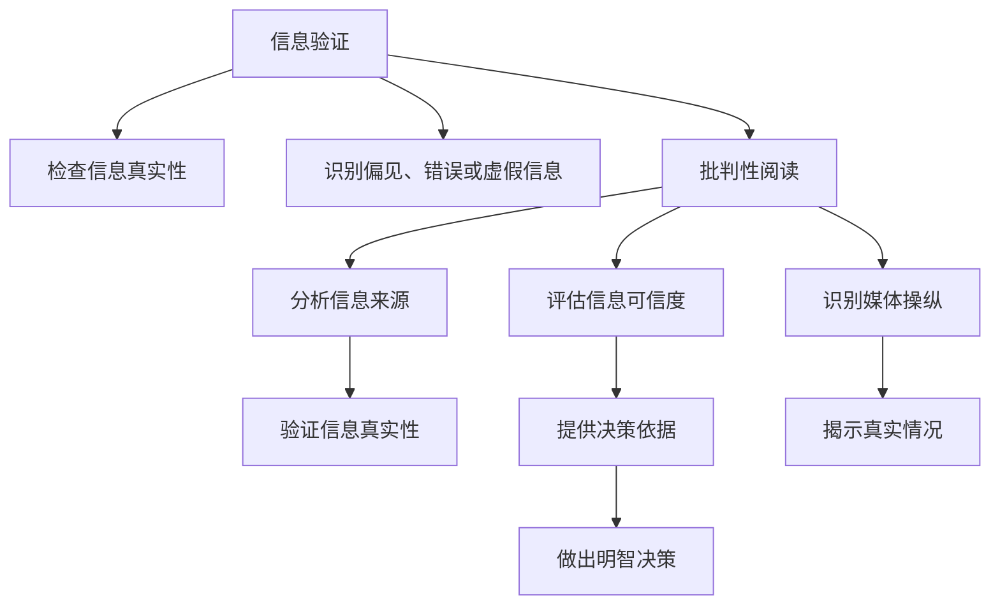

                 

## 1. 背景介绍

在信息爆炸的今天，假新闻和媒体操纵已经成为全球性的问题。人们面临着从未有过的信息洪流，如何辨别信息的真伪，避免被误导，成为一个重要而紧迫的任务。本文旨在提供一份信息验证和批判性阅读指南，帮助人们在假新闻和媒体操纵的时代导航，做出明智的决策。

## 2. 核心概念与联系

### 2.1 核心概念概述

- **信息验证**：通过科学的方法和工具，检查信息的真实性和可靠性，识别出可能存在的偏见、错误或虚假信息。
- **批判性阅读**：以理性和客观的态度，分析信息来源、内容和背景，评估其可信度，避免被片面或不准确的信息误导。
- **假新闻**：故意制造和传播虚假信息，以误导公众、损害他人或达成某种目的。
- **媒体操纵**：通过故意扭曲或夸大事实，引导公众观点和行为，达到特定的宣传或政治目的。
- **数据素养**：掌握处理、分析和解释数据的能力，能对信息进行科学的验证和批判。

这些核心概念相互关联，共同构成了信息时代导航的基础。

### 2.2 核心概念原理和架构的 Mermaid 流程图



## 3. 核心算法原理 & 具体操作步骤

### 3.1 算法原理概述

信息验证和批判性阅读的核心算法原理包括数据挖掘、自然语言处理和机器学习等。这些技术可以用于自动检测虚假信息、识别偏见、评估信息来源和可信度等。

### 3.2 算法步骤详解

1. **信息收集**：收集相关信息的多种来源，包括新闻网站、社交媒体、政府发布的信息等。
2. **数据预处理**：清洗和格式化数据，去除噪音，提取出有用的信息片段。
3. **信息验证**：使用自然语言处理技术，如文本分类、实体识别、情感分析等，识别出可能存在的虚假信息、偏见和媒体操纵。
4. **批判性阅读**：结合历史、文化和经济背景，对信息进行深入分析，评估其真实性和可信度。
5. **结果输出**：将验证结果以直观的方式呈现，如标记、注释、评分等，帮助用户做出明智决策。

### 3.3 算法优缺点

**优点**：
- 高效性：自动化信息验证和批判性阅读，节省时间和精力。
- 客观性：使用数据和算法，减少主观偏见和情感干扰。
- 可扩展性：适用于多种数据源和信息类型。

**缺点**：
- 依赖数据：信息验证和批判性阅读的效果取决于数据的质量和完整性。
- 复杂性：算法原理复杂，需要专业知识和技术支持。
- 误判风险：自动化系统可能出现误判，误标记真实信息或漏掉虚假信息。

### 3.4 算法应用领域

信息验证和批判性阅读的应用领域广泛，包括新闻业、社交媒体、政治宣传、市场营销、法律等领域。这些技术可以用于检测虚假信息、识别偏见、评估可信度、揭露媒体操纵等，帮助用户做出更明智的决策。

## 4. 数学模型和公式 & 详细讲解 & 举例说明

### 4.1 数学模型构建

信息验证和批判性阅读的数学模型通常包括文本分类模型、情感分析模型和实体识别模型等。这些模型通过训练大量标注数据，学习如何识别和分类不同类型的信息。

### 4.2 公式推导过程

以文本分类模型为例，其基本公式为：

$$
P(C_i|x) = \frac{P(x|C_i)P(C_i)}{P(x)}
$$

其中，$C_i$ 表示信息类别，$x$ 表示文本内容，$P(x|C_i)$ 表示在类别 $C_i$ 下文本 $x$ 的概率，$P(C_i)$ 表示类别 $C_i$ 的概率，$P(x)$ 表示文本 $x$ 在所有类别下的总概率。

### 4.3 案例分析与讲解

假设我们要验证一篇关于新冠疫苗的文章的真实性。首先，我们可以使用文本分类模型对文章进行分类，判断其属于新闻、评论、广告等类别。然后，使用情感分析模型评估文章的情感倾向，识别出可能的偏见和误导。最后，使用实体识别模型查找文章中提及的关键实体，如疫苗名称、发布机构等，进行进一步的验证。

## 5. 项目实践：代码实例和详细解释说明

### 5.1 开发环境搭建

开发环境搭建主要涉及 Python 环境和相关库的安装。以 PyTorch 为例，需要先安装 PyTorch 和 Transformers 库，然后搭建相应的开发环境。

```bash
pip install torch torchvision transformers
```

### 5.2 源代码详细实现

以下是一个简单的 Python 代码实例，用于文本分类模型的构建和训练：

```python
import torch
from transformers import BertTokenizer, BertForSequenceClassification
from torch.utils.data import Dataset, DataLoader

class NewsDataset(Dataset):
    def __init__(self, texts, labels):
        self.tokenizer = BertTokenizer.from_pretrained('bert-base-uncased')
        self.texts = texts
        self.labels = labels

    def __len__(self):
        return len(self.texts)

    def __getitem__(self, idx):
        text = self.texts[idx]
        tokens = self.tokenizer.encode(text, add_special_tokens=True)
        input_ids = torch.tensor(tokens, dtype=torch.long)
        return {'input_ids': input_ids, 'labels': torch.tensor(self.labels[idx])}

# 训练模型
model = BertForSequenceClassification.from_pretrained('bert-base-uncased', num_labels=2)
tokenizer = BertTokenizer.from_pretrained('bert-base-uncased')
train_dataset = NewsDataset(train_texts, train_labels)
test_dataset = NewsDataset(test_texts, test_labels)
train_loader = DataLoader(train_dataset, batch_size=16)
test_loader = DataLoader(test_dataset, batch_size=16)
optimizer = AdamW(model.parameters(), lr=1e-5)
for epoch in range(10):
    model.train()
    for batch in train_loader:
        input_ids = batch['input_ids']
        labels = batch['labels']
        outputs = model(input_ids)
        loss = outputs.loss
        loss.backward()
        optimizer.step()
```

### 5.3 代码解读与分析

- `NewsDataset` 类：用于数据预处理和格式化，将文本转换为模型所需的输入。
- `BertForSequenceClassification`：用于构建文本分类模型。
- `BertTokenizer`：用于将文本转换为模型可以处理的格式。
- 模型训练：使用 AdamW 优化器进行训练，梯度累积等技术用于加速训练。

### 5.4 运行结果展示

训练完成后，我们可以使用测试集对模型进行评估，输出模型的准确率和召回率等指标。

## 6. 实际应用场景

### 6.1 新闻媒体平台

新闻媒体平台可以引入信息验证和批判性阅读技术，对用户提交的内容进行自动审核，识别出虚假信息和媒体操纵，避免发布不实消息。

### 6.2 社交媒体

社交媒体平台可以使用这些技术对用户发布的内容进行自动检测，识别出可能的虚假信息、偏见和媒体操纵，增强平台的信息透明度。

### 6.3 教育培训

教育培训机构可以引入这些技术，帮助学生培养信息素养和批判性思维能力，提升他们对信息的处理和分析能力。

### 6.4 未来应用展望

未来，随着技术的不断进步，信息验证和批判性阅读将更加智能化和自动化，能够更好地帮助用户在信息爆炸的时代做出明智的决策。

## 7. 工具和资源推荐

### 7.1 学习资源推荐

- Coursera 和 Udacity 等在线教育平台：提供信息验证和批判性阅读相关的课程和讲座。
- Google Scholar 和 arXiv：查找最新的学术论文和技术报告。

### 7.2 开发工具推荐

- Python：信息验证和批判性阅读开发的主流编程语言，灵活性强。
- PyTorch 和 TensorFlow：流行的深度学习框架，支持文本分类、情感分析等任务。
- NLTK 和 spaCy：常用的自然语言处理库，提供多种文本处理功能。

### 7.3 相关论文推荐

- "A Survey on Information Verification and Fact-Checking Technologies"（信息验证和事实核查技术的综述）
- "Critical Reading and Critical Thinking"（批判性阅读和批判性思维）
- "The Problem of Fake News"（假新闻问题）

## 8. 总结：未来发展趋势与挑战

### 8.1 研究成果总结

信息验证和批判性阅读技术的发展，已经取得了显著进展。这些技术在新闻媒体、社交媒体、教育培训等领域得到了广泛应用，帮助用户更好地应对信息洪流和媒体操纵。

### 8.2 未来发展趋势

未来，信息验证和批判性阅读技术将继续向智能化、自动化方向发展，结合更多先进技术，如自然语言生成、跨模态融合等，提升信息处理的准确性和效率。

### 8.3 面临的挑战

尽管信息验证和批判性阅读技术取得了一定的进展，但仍面临一些挑战：
- 数据质量和多样性：高质量、多样化的数据对模型训练至关重要。
- 技术复杂性：信息验证和批判性阅读涉及多种技术和方法，需要专业知识和技术支持。
- 误判风险：自动化系统可能出现误判，影响用户决策。

### 8.4 研究展望

未来的研究应关注以下几个方向：
- 多模态融合：结合文本、图像、视频等不同模态的信息，提升信息验证和批判性阅读的准确性。
- 解释性和可解释性：增强模型的可解释性，让用户理解模型的决策过程。
- 跨领域应用：探索信息验证和批判性阅读在更多领域的应用，如医疗、金融等。

## 9. 附录：常见问题与解答

**Q1: 信息验证和批判性阅读技术能完全解决假新闻问题吗？**

A: 信息验证和批判性阅读技术可以在一定程度上减少假新闻的影响，但完全解决假新闻问题仍然需要社会的共同努力，包括教育、立法和公众意识的提高。

**Q2: 信息验证和批判性阅读技术如何应用在社交媒体平台？**

A: 社交媒体平台可以通过自动检测和标记虚假信息、偏见和媒体操纵，增强信息透明度，提升用户信任度。

**Q3: 信息验证和批判性阅读技术在教育培训中的应用前景如何？**

A: 信息验证和批判性阅读技术在教育培训中具有广阔的应用前景，可以帮助学生培养信息素养和批判性思维能力，提升他们的信息处理能力。

**Q4: 信息验证和批判性阅读技术的局限性有哪些？**

A: 信息验证和批判性阅读技术的局限性包括数据质量和多样性、技术复杂性和误判风险等，需要在实际应用中不断优化和改进。

---

作者：禅与计算机程序设计艺术 / Zen and the Art of Computer Programming

