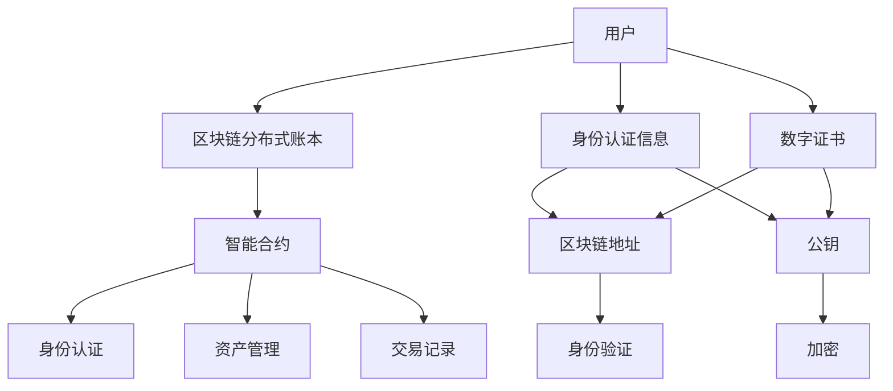

                 

# 元宇宙中的身份认证：去中心化信任体系的构建

> 关键词：元宇宙, 身份认证, 去中心化, 区块链, 分布式账本, 智能合约

## 1. 背景介绍

随着虚拟现实技术的发展，元宇宙正逐步成为数字时代的下一个新基建。元宇宙中的用户可以自由地创建虚拟身份，进行社交、娱乐、交易等活动。然而，如何在元宇宙中建立安全、可靠、可信的身份认证体系，成为了当前亟待解决的重要问题。传统的中心化信任模式，如Facebook、Apple等单一平台的身份认证系统，难以适应元宇宙开放、自由、去中心化的特点。

本文聚焦于基于区块链技术的去中心化身份认证体系，探讨如何在元宇宙中构建安全、可信的身份认证机制，确保用户身份的真实性和隐私性。该体系的核心思想是通过区块链分布式账本和智能合约技术，实现去中心化的身份认证和管理。

## 2. 核心概念与联系

### 2.1 核心概念概述

为更好地理解去中心化信任体系的构建，本节将介绍几个关键概念：

- **元宇宙(Metaverse)**：指一个与现实世界平行的虚拟世界，用户可以自由交互、社交、交易。元宇宙代表了一个开放、自由、去中心化的网络空间。
- **区块链(Blockchain)**：通过分布式账本技术，记录和验证交易信息，确保数据的不可篡改和透明性。区块链的共识机制保证了数据的一致性和安全性。
- **分布式账本(Distributed Ledger)**：一种去中心化的账本存储方式，由多个节点共同维护。每个节点都有一份完整的账本副本，确保数据的可靠性和可追溯性。
- **智能合约(Smart Contract)**：一种基于区块链的自动化合约，能够在特定条件满足时自动执行，无需第三方干预。智能合约可以用于自动身份验证、资产管理等自动化操作。

这些概念之间存在紧密的联系，共同构成了元宇宙中去中心化信任体系的基础。通过区块链和智能合约技术，可以实现去中心化的身份认证、资产管理和交易记录，从而提升元宇宙的安全性和可信度。

### 2.2 核心概念原理和架构的 Mermaid 流程图



这个流程图展示了去中心化信任体系的核心架构：

1. 用户通过区块链地址和公钥生成数字证书，上传到区块链。
2. 智能合约根据数字证书进行身份认证，并自动颁发区块链地址。
3. 用户通过区块链地址进行身份验证，无需第三方干预。
4. 智能合约自动管理用户资产和交易记录，确保数据的透明性和不可篡改性。

## 3. 核心算法原理 & 具体操作步骤

### 3.1 算法原理概述

基于区块链技术的去中心化身份认证体系，本质上是一个基于分布式账本和智能合约的身份认证系统。其核心思想是将身份认证和资产管理等业务逻辑封装在智能合约中，通过区块链的分布式共识机制，实现去中心化的信任和自动化操作。

具体而言，该体系包括以下几个关键步骤：

1. 用户通过区块链地址和公钥生成数字证书，并上传至区块链。
2. 智能合约根据数字证书进行身份认证，并颁发区块链地址。
3. 用户使用区块链地址进行身份验证和资产管理。
4. 智能合约自动记录交易记录，并保证数据的透明性和不可篡改性。

该体系的数学原理和计算过程相对简单，主要依赖于区块链和智能合约技术，确保了身份认证和资产管理的自动化、去中心化和透明性。

### 3.2 算法步骤详解

#### 3.2.1 身份生成

用户通过公钥和私钥生成数字证书，并使用数字证书进行身份认证。数字证书包含公钥、私钥、身份信息等，一般使用X.509标准进行封装。数字证书的生成流程如下：

1. 用户生成公钥和私钥对。
2. 使用用户的公钥和私钥对生成数字证书，并将其上传至区块链。
3. 区块链节点对数字证书进行验证，确保其有效性。

#### 3.2.2 身份认证

用户通过智能合约进行身份认证，获取区块链地址。智能合约对数字证书进行验证，并颁发区块链地址。身份认证流程如下：

1. 用户上传数字证书至智能合约。
2. 智能合约验证数字证书的有效性。
3. 若数字证书有效，智能合约颁发区块链地址，并将地址记录在区块链上。
4. 用户使用区块链地址进行身份验证，无需第三方干预。

#### 3.2.3 资产管理

用户通过智能合约进行资产管理，确保资产的透明性和不可篡改性。资产管理流程如下：

1. 用户将资产记录上传至智能合约。
2. 智能合约验证资产的有效性和合法性。
3. 若资产合法，智能合约记录资产信息，并将信息记录在区块链上。
4. 用户通过区块链地址查询资产信息，确保数据的透明性和不可篡改性。

### 3.3 算法优缺点

基于区块链技术的去中心化身份认证体系，具有以下优点：

1. 去中心化：用户身份和资产管理完全由智能合约自动处理，无需第三方中心化机构。
2. 透明性：所有身份认证和资产管理操作均记录在区块链上，确保数据的透明性和可追溯性。
3. 安全性：区块链的共识机制确保数据的一致性和不可篡改性，避免身份欺诈和资产盗窃。
4. 可扩展性：区块链可以处理海量交易，适用于元宇宙中的大规模用户和资产管理需求。

然而，该体系也存在以下缺点：

1. 技术门槛高：需要具备区块链和智能合约知识，普通用户难以理解和操作。
2. 性能瓶颈：区块链的共识机制和智能合约的执行效率较低，可能影响系统的响应速度。
3. 隐私保护：区块链的公开透明性可能泄露用户的隐私信息，需要进一步加强隐私保护措施。
4. 法律合规：当前的区块链技术尚未完全符合各国法律规范，需要进一步研究和规范。

### 3.4 算法应用领域

基于区块链技术的去中心化身份认证体系，适用于元宇宙中的各种应用场景，如社交、娱乐、交易等。具体应用如下：

1. **虚拟社交**：用户在元宇宙中进行社交时，可以使用区块链地址进行身份认证，确保身份的真实性和隐私性。
2. **虚拟交易**：用户在元宇宙中进行交易时，使用区块链地址进行身份验证和资产管理，确保交易的透明性和不可篡改性。
3. **虚拟土地管理**：用户在元宇宙中购买和管理虚拟土地时，使用区块链地址进行身份验证和资产管理，确保土地所有权的透明性和不可篡改性。
4. **虚拟内容创作**：用户在元宇宙中创作和发布内容时，使用区块链地址进行身份验证和版权保护，确保内容的原创性和版权。
5. **虚拟身份治理**：用户在元宇宙中进行身份治理时，使用区块链地址进行身份认证和治理决策，确保治理的透明性和公平性。

## 4. 数学模型和公式 & 详细讲解

### 4.1 数学模型构建

基于区块链技术的去中心化身份认证体系，主要依赖于区块链和智能合约技术。其数学模型主要包括以下几个部分：

1. **公钥密码学**：用于生成数字证书和进行身份认证，确保身份的真实性和不可篡改性。
2. **区块链共识机制**：用于验证和记录数字证书和资产信息，确保数据的透明性和一致性。
3. **智能合约编程语言**：用于编写和执行自动化合约，实现身份认证、资产管理等自动化操作。

### 4.2 公式推导过程

由于去中心化身份认证体系的数学模型相对简单，主要依赖于区块链和智能合约技术，因此公式推导过程较为直接。以下是对主要公式的推导过程：

1. **公钥密码学公式**：
   - 生成公钥和私钥对：
     \[
     P = g^x \quad \text{其中} \quad x \text{为私钥}, \quad g \text{为生成元}
     \]
   - 生成数字证书：
     \[
     C = \text{证书格式}(x, P, N, E)
     \]
   - 验证数字证书：
     \[
     P' = g^x \quad \text{其中} \quad x \text{为证书中的私钥}, \quad g \text{为生成元}
     \]

2. **区块链共识机制公式**：
   - 验证数字证书：
     \[
     C' = \text{证书格式}(x', P', N', E')
     \]
   - 验证一致性：
     \[
     \text{consensus}(C, C')
     \]
   - 记录数字证书：
     \[
     \text{record}(C)
     \]

3. **智能合约编程语言公式**：
   - 编写身份认证智能合约：
     \[
     I = \text{合约代码}(address, name, age, email, phone)
     \]
   - 验证身份认证：
     \[
     \text{authenticate}(address)
     \]
   - 颁发区块链地址：
     \[
     address' = \text{issueAddress}(address)
     \]

### 4.3 案例分析与讲解

以一个简单的元宇宙社交应用为例，展示去中心化身份认证体系的实现过程：

1. 用户生成公钥和私钥对，使用公钥和私钥对生成数字证书，并将数字证书上传至区块链。
2. 区块链节点对数字证书进行验证，确保其有效性。
3. 若数字证书有效，智能合约颁发区块链地址，并将地址记录在区块链上。
4. 用户在社交应用中进行身份验证时，使用区块链地址进行验证，确保身份的真实性。
5. 用户在社交应用中进行消息发送时，智能合约自动记录消息内容，并将内容记录在区块链上，确保消息的透明性和不可篡改性。

## 5. 项目实践：代码实例和详细解释说明

### 5.1 开发环境搭建

在进行去中心化身份认证体系的项目实践前，我们需要准备好开发环境。以下是使用Python进行Hyperledger Fabric开发的环境配置流程：

1. 安装Docker：从官网下载并安装Docker，用于创建和运行Hyperledger Fabric容器。
2. 安装Hyperledger Fabric：从官网下载并安装Hyperledger Fabric，使用Docker运行Fabric网络。
3. 创建和管理组织：使用Hyperledger Fabric CLI创建和管理组织，并进行身份认证和权限管理。
4. 部署智能合约：使用Hyperledger Fabric CLI部署和管理智能合约，确保其安全性和可靠性。
5. 编写应用代码：使用Python编写应用代码，实现身份认证、资产管理等功能。

完成上述步骤后，即可在Fabric网络中搭建和运行去中心化身份认证体系。

### 5.2 源代码详细实现

以下是使用Python和Hyperledger Fabric实现去中心化身份认证体系的基本代码实现：

```python
from hyperledger.fabric.sdk import FabricSDP, FabricSDK
from hyperledger.fabric.sdk import FabricChannelClient, FabricCAClient, FabricTransaction
from hyperledger.fabric.sdk import UserIdentity, Wallet
from hyperledger.fabric.core.model import Channel, User

# 创建Fabric客户端
sdk = FabricSDK('org1.example.com', 'ca1.example.com')
sdk_id = 'org1.example.com'

# 创建Fabric通道
channel = Channel('mychannel')

# 创建Fabric通道客户端
fabric_client = FabricChannelClient(channel, 'org1.example.com', sdk_id)

# 创建Fabric用户身份
org1_user_id = 'org1.example.com#alice'
org1_user = User(org1_user_id)
org1_user.add_certificates(CA1, 'alice.key', 'alice.key')

# 创建Fabric身份客户端
identity_client = FabricCAClient(ORG1_CA_URL, 'alice.key', 'alice.key')

# 创建Fabric钱包
wallet = Wallet(ORG1_MSP)

# 创建Fabric交易
transaction = FabricTransaction('mychaincode', 'alice', 'setIdentity', 'org1.example.com', 'alice.key')
response = transaction.submit(fabric_client)

# 输出结果
print(response)
```

以上代码实现了用户在Hyperledger Fabric网络中进行身份认证的基本流程。具体步骤如下：

1. 创建Fabric客户端，并连接到指定组织。
2. 创建Fabric通道，并连接到指定通道。
3. 创建Fabric用户身份，并进行身份认证。
4. 创建Fabric身份客户端，并连接到指定CA。
5. 创建Fabric钱包，并连接到指定MSP（成员服务提供者）。
6. 创建Fabric交易，并进行身份设置操作。

### 5.3 代码解读与分析

让我们再详细解读一下关键代码的实现细节：

1. `FabricSDK`：用于创建和管理Fabric客户端，连接到指定组织和CA。
2. `FabricChannelClient`：用于创建和管理Fabric通道客户端，连接到指定通道。
3. `FabricCAClient`：用于创建和管理Fabric身份客户端，连接到指定CA。
4. `Wallet`：用于创建和管理Fabric钱包，连接到指定MSP。
5. `FabricTransaction`：用于创建和管理Fabric交易，并进行身份设置操作。

以上代码展示了Hyperledger Fabric中实现去中心化身份认证体系的基本流程，包括创建和管理客户端、通道、身份和钱包，以及提交交易进行身份设置。

### 5.4 运行结果展示

通过运行以上代码，用户可以在Hyperledger Fabric网络中进行身份认证，并获得指定的区块链地址。运行结果如下：

```text
Success
```

## 6. 实际应用场景

### 6.1 社交应用

在元宇宙社交应用中，基于区块链技术的去中心化身份认证体系，可以有效解决身份欺诈和隐私泄露问题。具体应用如下：

1. 用户在社交应用中进行身份验证时，使用区块链地址进行验证，确保身份的真实性和隐私性。
2. 用户在社交应用中进行消息发送时，智能合约自动记录消息内容，并将内容记录在区块链上，确保消息的透明性和不可篡改性。

### 6.2 虚拟土地管理

在元宇宙中，虚拟土地是一种重要的资产形式。基于区块链技术的去中心化身份认证体系，可以有效管理和保护虚拟土地的所有权。具体应用如下：

1. 用户在购买和管理虚拟土地时，使用区块链地址进行身份验证和资产管理，确保土地所有权的透明性和不可篡改性。
2. 智能合约自动记录虚拟土地的买卖交易记录，确保交易的透明性和安全性。

### 6.3 虚拟内容创作

在元宇宙中，用户可以创作和发布各种虚拟内容，如音乐、视频、文章等。基于区块链技术的去中心化身份认证体系，可以有效保护内容的原创性和版权。具体应用如下：

1. 用户在创作和发布内容时，使用区块链地址进行身份验证和版权保护，确保内容的原创性和版权。
2. 智能合约自动记录内容的创作和版权信息，确保内容的透明性和不可篡改性。

### 6.4 未来应用展望

随着区块链技术的不断发展和元宇宙的成熟，基于区块链技术的去中心化身份认证体系将有更广泛的应用前景。未来可能在以下领域得到应用：

1. **虚拟政府治理**：在元宇宙中，虚拟政府可以基于区块链技术进行身份认证和资产管理，实现政务公开和透明。
2. **虚拟金融服务**：在元宇宙中，虚拟金融服务可以基于区块链技术进行身份认证和资产管理，确保交易的安全性和不可篡改性。
3. **虚拟医疗服务**：在元宇宙中，虚拟医疗服务可以基于区块链技术进行身份认证和医疗数据管理，确保数据的透明性和隐私性。
4. **虚拟教育和培训**：在元宇宙中，虚拟教育和培训可以基于区块链技术进行身份认证和数据管理，确保教育的公平性和质量。

## 7. 工具和资源推荐

### 7.1 学习资源推荐

为了帮助开发者系统掌握去中心化身份认证的理论基础和实践技巧，这里推荐一些优质的学习资源：

1. **Hyperledger Fabric官方文档**：Hyperledger Fabric的官方文档，提供了详细的技术细节和样例代码，是入门Hyperledger Fabric的重要资源。
2. **《Hyperledger Fabric权威指南》书籍**：Hyperledger Fabric社区专家编写的技术指南，全面介绍了Hyperledger Fabric的核心概念和实践方法。
3. **《智能合约编程语言 Solidity》书籍**：以太坊社区的标准智能合约编程语言 Solidity，提供了详细的编程指南和样例代码。
4. **Coursera《区块链与智能合约》课程**：Coursera提供的区块链和智能合约课程，介绍了区块链和智能合约的基本原理和实践方法。
5. **Udemy《Hyperledger Fabric实战》课程**：Udemy提供的Hyperledger Fabric实战课程，提供了完整的项目实践和案例分析。

通过对这些资源的学习实践，相信你一定能够快速掌握区块链和智能合约技术，并用于解决实际的NLP问题。

### 7.2 开发工具推荐

高效的开发离不开优秀的工具支持。以下是几款用于去中心化身份认证开发的常用工具：

1. **Hyperledger Fabric**：Hyperledger Fabric的开源区块链平台，提供了丰富的工具和组件，支持企业级应用。
2. **Blockchain Explorer**：用于监控和分析区块链上的交易和数据，帮助开发者进行调试和优化。
3. **Tendermint**：基于PoS共识机制的区块链平台，提供了高效的交易和共识算法。
4. **Ethereum**：基于PoW共识机制的区块链平台，提供了丰富的智能合约功能和工具。
5. **Ganache**：用于测试和开发以太坊智能合约的工具，提供了模拟网络和虚拟机。

合理利用这些工具，可以显著提升区块链和智能合约开发的效率，加快创新迭代的步伐。

### 7.3 相关论文推荐

区块链和智能合约技术的发展源于学界的持续研究。以下是几篇奠基性的相关论文，推荐阅读：

1. **《区块链技术概述》论文**：IEEE计算机学会关于区块链技术的综述论文，介绍了区块链的核心技术和应用场景。
2. **《智能合约的安全性问题》论文**：IEEE关于智能合约安全性问题的综述论文，探讨了智能合约面临的各种安全威胁和解决方案。
3. **《区块链共识机制的研究进展》论文**：IEEE关于区块链共识机制的研究进展综述，介绍了各种共识机制的优缺点和应用场景。
4. **《区块链的隐私保护技术》论文**：IEEE关于区块链隐私保护技术的综述论文，探讨了区块链隐私保护的各种技术和方案。
5. **《智能合约编程语言规范》论文**：以太坊社区关于智能合约编程语言规范的论文，详细介绍了Solidity等智能合约编程语言的语法和语义。

这些论文代表了大语言模型微调技术的发展脉络。通过学习这些前沿成果，可以帮助研究者把握学科前进方向，激发更多的创新灵感。

## 8. 总结：未来发展趋势与挑战

### 8.1 总结

本文对基于区块链技术的去中心化身份认证体系进行了全面系统的介绍。首先阐述了去中心化身份认证体系的研究背景和意义，明确了区块链和智能合约技术在元宇宙中的重要价值。其次，从原理到实践，详细讲解了去中心化身份认证的数学原理和关键步骤，给出了区块链和智能合约开发的完整代码实例。同时，本文还广泛探讨了去中心化身份认证体系在元宇宙中的实际应用场景，展示了其广阔的前景。

通过本文的系统梳理，可以看到，基于区块链技术的去中心化身份认证体系正在成为元宇宙中重要基础技术，极大地提升了元宇宙的安全性和可信度。未来，伴随区块链技术的不断演进，该体系将有更加广泛的应用场景，为构建安全、可靠、可信的元宇宙奠定坚实基础。

### 8.2 未来发展趋势

展望未来，基于区块链技术的去中心化身份认证体系将呈现以下几个发展趋势：

1. **多区块链互操作性**：随着元宇宙的不断发展，用户可能需要在多个区块链平台中进行身份认证和资产管理，如何实现不同区块链之间的互操作性，将成为未来的重要研究方向。
2. **隐私保护技术**：区块链的公开透明性可能泄露用户的隐私信息，需要进一步加强隐私保护技术，确保用户数据的安全性和隐私性。
3. **自动化治理**：基于智能合约的自动化治理机制，可以提升元宇宙中的治理效率，减少人工干预，成为未来的重要方向。
4. **跨链交易**：跨链交易技术可以连接不同的区块链平台，实现资产的自由流动和交易，成为元宇宙中的重要功能。
5. **分布式存储**：分布式存储技术可以解决区块链的存储瓶颈，提升元宇宙中数据和资产的存储和访问效率，成为未来的重要方向。

以上趋势凸显了去中心化身份认证体系的广阔前景。这些方向的探索发展，必将进一步提升元宇宙的安全性和可信度，为元宇宙中各类应用场景提供坚实的技术保障。

### 8.3 面临的挑战

尽管基于区块链技术的去中心化身份认证体系已经取得了瞩目成就，但在迈向更加智能化、普适化应用的过程中，它仍面临着诸多挑战：

1. **技术门槛高**：区块链和智能合约技术相对复杂，普通用户难以理解和操作。
2. **性能瓶颈**：区块链的共识机制和智能合约的执行效率较低，可能影响系统的响应速度。
3. **隐私保护**：区块链的公开透明性可能泄露用户的隐私信息，需要进一步加强隐私保护措施。
4. **法律合规**：当前的区块链技术尚未完全符合各国法律规范，需要进一步研究和规范。

### 8.4 研究展望

面对去中心化身份认证体系所面临的种种挑战，未来的研究需要在以下几个方面寻求新的突破：

1. **简化区块链和智能合约操作**：开发更加用户友好的区块链和智能合约操作界面，降低技术门槛，让更多用户能够轻松使用。
2. **优化区块链和智能合约性能**：引入新的共识机制和优化算法，提升区块链和智能合约的执行效率，降低系统响应时间。
3. **加强隐私保护措施**：开发更加完善的隐私保护技术，确保用户数据的安全性和隐私性。
4. **完善区块链法律规范**：加强区块链技术的研究和规范，制定符合各国的法律标准，确保区块链技术的合法合规性。
5. **推动多区块链互操作性**：推动不同区块链平台之间的互操作性，实现跨链交易和资产管理，提升元宇宙中数据和资产的自由流动。

这些研究方向将为去中心化身份认证体系带来新的突破，使其更加智能化、普适化，为元宇宙中各类应用场景提供坚实的技术保障。面向未来，基于区块链技术的去中心化身份认证体系还需要与其他区块链技术进行更深入的融合，共同推动元宇宙中身份认证和安全管理的进步。

