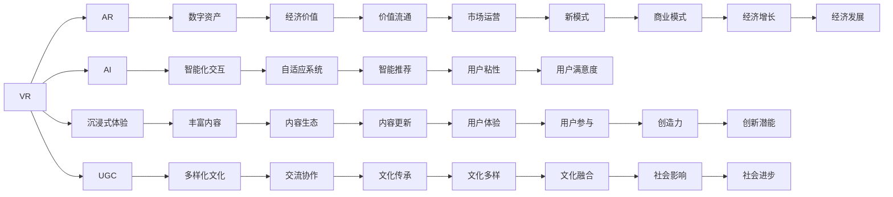

                 

# 元宇宙创意产业：激发人类想象力的新疆界

> 关键词：元宇宙,创意产业,虚拟现实(VR),增强现实(AR),人工智能(AI),沉浸式体验,用户生成内容(UGC),数字资产

## 1. 背景介绍

### 1.1 问题由来

随着技术的快速发展和经济全球化，人们对于数字生活体验的追求愈发强烈。面对传统媒介的限制，元宇宙（Metaverse）这一概念应运而生。元宇宙旨在通过虚拟现实（Virtual Reality, VR）和增强现实（Augmented Reality, AR）等技术，构建一个沉浸式、互动性的数字世界，使人们能够在虚拟空间中进行社交、学习、工作、娱乐等。

### 1.2 问题核心关键点

元宇宙创意产业的核心问题在于如何通过先进的数字技术和创意内容，激发人类无限的想象力和创造力，从而实现新一轮的文化、艺术、商业和社会变革。

核心关键点包括：
- 技术基础：如何高效整合VR、AR、AI等前沿技术，构建沉浸式体验。
- 内容创意：如何激发和培养用户生成内容(UGC)，提升创意品质。
- 商业模式：如何建立元宇宙数字经济，实现新业态、新市场、新模式的创新。
- 社会价值：如何促进社会协作、知识共享、文化传承，推动社会进步。

### 1.3 问题研究意义

探索元宇宙创意产业的开发与运营，不仅能够推动数字技术与创意内容的深度融合，释放人类的创新潜能，还将为艺术、文化、商业等传统领域带来革命性的变化，催生新的经济增长点。

1. **文化革新**：元宇宙提供了一个全新的创意平台，推动艺术创作、文化传播的数字化和全球化。
2. **商业模式变革**：元宇宙催生了虚拟经济和数字资产的概念，提供了更多元、更具活力的市场运营机制。
3. **社会创新**：元宇宙的虚拟空间促进了跨地域、跨文化的交流与协作，提升了社会整体的创新力和竞争力。
4. **技术突破**：元宇宙技术推动了VR、AR、AI等技术的创新与应用，推动了信息通信技术的整体发展。

## 2. 核心概念与联系

### 2.1 核心概念概述

元宇宙创意产业的开发，离不开几个核心概念的支撑：

- **虚拟现实（VR）**：一种通过计算机生成的模拟环境，使佩戴者能够沉浸其中，产生身临其境的感觉。
- **增强现实（AR）**：将虚拟信息与现实世界相结合，增强用户的感知体验。
- **人工智能（AI）**：通过机器学习等技术，赋予虚拟世界高度的智能化和自适应性。
- **沉浸式体验（Immersive Experience）**：通过视觉、听觉、触觉等多感官的交互，实现用户与虚拟环境的深度融合。
- **用户生成内容（UGC）**：用户参与内容创作，丰富虚拟世界的文化多样性和互动性。
- **数字资产（Digital Assets）**：在元宇宙中，用户创作的虚拟物品（如艺术品、角色、道具等）可以转化为具有经济价值的数字资产。

这些概念共同构成了元宇宙创意产业的技术基础和内容源泉，它们之间的相互联系和交互，共同推动了元宇宙创意产业的持续发展和创新。

### 2.2 核心概念原理和架构的 Mermaid 流程图



这个流程图展示了元宇宙创意产业中各个概念的相互联系，以及它们在内容创作、用户互动、社会影响和经济增长等方面的综合作用。

## 3. 核心算法原理 & 具体操作步骤

### 3.1 算法原理概述

元宇宙创意产业的算法原理，主要包括：

- **虚拟现实技术（VR）**：通过计算机生成虚拟环境，实现三维立体显示和交互。核心算法包括头显跟踪、手势识别、触觉反馈等。
- **增强现实技术（AR）**：将虚拟信息叠加到现实世界中，实现透明层叠加显示。核心算法包括摄像头识别、图像融合、空间定位等。
- **人工智能算法**：通过深度学习、自然语言处理等技术，实现用户行为预测、内容智能推荐、语音识别与合成等。
- **沉浸式体验算法**：通过多感官交互、实时渲染、场景生成等技术，提供高真实感的虚拟环境。
- **用户生成内容算法**：通过协作创作、社交网络、内容审核等机制，鼓励和规范用户参与内容创作。
- **数字资产管理算法**：通过区块链、数字货币等技术，实现数字资产的注册、交易、转让等。

这些算法相互协作，共同构建了元宇宙创意产业的技术生态。

### 3.2 算法步骤详解

#### 3.2.1 虚拟现实技术（VR）

**步骤1：设备配置与安装**
- 配置VR头盔、手柄、控制器等硬件设备。
- 安装相关驱动和软件，确保设备与计算机连接正常。

**步骤2：环境映射与渲染**
- 使用传感器收集用户头显和手柄的位置、姿态信息。
- 通过环境映射算法，生成虚拟环境三维模型。
- 通过渲染引擎（如Unity、Unreal Engine），实现动态场景渲染和光照处理。

**步骤3：手势识别与反馈**
- 通过深度学习算法（如卷积神经网络、时序模型），实现用户手势的识别和解码。
- 通过力反馈设备（如震动电机、气动手柄），为用户提供触觉反馈。

#### 3.2.2 增强现实技术（AR）

**步骤1：环境识别与定位**
- 使用摄像头采集现实世界图像。
- 通过图像识别算法（如卷积神经网络），识别环境特征。
- 通过空间定位算法（如SLAM、IMU），实现用户位置的精确跟踪。

**步骤2：虚拟信息生成与融合**
- 根据用户行为和环境特征，生成虚拟信息（如文字、图像、动画）。
- 通过图像融合算法（如Alpha混合），将虚拟信息与现实世界图像进行叠加。

**步骤3：交互控制与优化**
- 通过触觉识别技术（如电容传感器、电阻传感器），实现用户与虚拟信息的交互。
- 通过AI算法（如强化学习），优化虚拟信息展示和交互方式。

#### 3.2.3 人工智能算法

**步骤1：数据采集与预处理**
- 采集用户行为数据（如点击、滑动、语音等）。
- 对数据进行清洗、去噪、归一化处理。

**步骤2：特征提取与模型训练**
- 使用特征提取算法（如PCA、LDA），提取用户行为特征。
- 使用深度学习模型（如卷积神经网络、循环神经网络），训练用户行为预测模型。

**步骤3：智能推荐与反馈**
- 根据用户行为预测结果，推荐相关内容。
- 通过反馈机制（如用户评分、推荐点击率），持续优化推荐模型。

#### 3.2.4 沉浸式体验算法

**步骤1：多感官输入与处理**
- 收集用户的声音、动作、触觉等多感官数据。
- 使用信号处理算法（如降噪算法、时域滤波），提取多感官信息。

**步骤2：场景生成与渲染**
- 使用场景生成算法（如地图渲染、对象建模），生成虚拟场景。
- 使用渲染引擎（如CUDA、OpenGL），实现实时渲染和动态效果。

**步骤3：用户交互与反馈**
- 实现用户与虚拟环境的交互（如碰撞检测、物理模拟）。
- 通过反馈机制（如声音提示、震动反馈），增强用户沉浸感。

#### 3.2.5 用户生成内容算法

**步骤1：内容创建与发布**
- 提供用户界面，让用户能够创建、编辑和发布内容。
- 使用协作编辑工具（如文本编辑器、图形设计软件），支持用户共同创作。

**步骤2：内容审核与推荐**
- 设置内容审核机制，避免低俗、违法等不良内容。
- 使用内容推荐算法（如协同过滤、热门标签），推荐高质量内容。

**步骤3：用户互动与交流**
- 提供社交网络平台，支持用户之间互动和交流。
- 使用情感分析算法（如文本情感分析），提升用户互动质量。

#### 3.2.6 数字资产管理算法

**步骤1：数字资产注册与验证**
- 使用区块链技术（如比特币、以太坊），实现数字资产的注册和验证。
- 通过智能合约（如Solidity），自动执行资产转让和验证。

**步骤2：数字资产交易与转让**
- 使用数字货币交易平台，实现数字资产的交易和转让。
- 通过加密算法（如AES、RSA），保障交易的安全性。

**步骤3：数字资产管理与流通**
- 建立数字资产管理平台，实现资产的存储、查询和转让。
- 使用分布式账本技术（如Hyperledger），保障数据的一致性和可靠性。

### 3.3 算法优缺点

**优点：**
- **沉浸感与互动性**：VR、AR技术实现了用户与虚拟环境的深度互动，增强了沉浸感。
- **智能化与自适应**：AI算法实现了用户行为的智能预测和内容推荐，提升了用户体验。
- **多样性与创造性**：UGC机制鼓励用户参与内容创作，丰富了内容多样性。
- **经济价值与流通性**：数字资产管理算法保障了资产的合法性、安全性和流通性。

**缺点：**
- **设备成本高**：VR、AR设备的硬件成本较高，限制了大众普及。
- **技术复杂度高**：算法实现涉及多个领域，技术门槛较高。
- **内容质量参差不齐**：UGC内容质量不一，可能存在低质和违规内容。
- **用户隐私保护**：用户行为数据隐私保护存在挑战，需要加强安全技术。

### 3.4 算法应用领域

**1. 虚拟旅游与探险**
- 通过VR技术，用户可以进入虚拟的旅游景点，进行沉浸式游览。
- 结合AR技术，展示历史遗迹、自然景观等详细信息。

**2. 教育培训**
- 使用VR、AR技术，提供虚拟教室和实验环境，增强教学互动性。
- 通过AI算法，实现个性化学习推荐和内容生成。

**3. 虚拟社交与娱乐**
- 构建虚拟社交平台，支持用户进行虚拟聚会、游戏等活动。
- 使用UGC机制，增加社交互动和内容多样性。

**4. 文化传承与展示**
- 利用VR、AR技术，展示历史文物、文化遗产等。
- 通过沉浸式体验，提升文化传承的吸引力和教育效果。

**5. 虚拟商业与营销**
- 建立虚拟购物中心、展示厅等商业场景，提供沉浸式购物体验。
- 通过智能推荐算法，提升用户体验和销售转化率。

**6. 虚拟医疗与咨询**
- 提供虚拟医院、诊所等医疗环境，进行远程医疗咨询。
- 结合AI算法，实现疾病预测和智能诊断。

## 4. 数学模型和公式 & 详细讲解 & 举例说明

### 4.1 数学模型构建

元宇宙创意产业的数学模型，主要包括以下几个方面：

- **虚拟现实技术（VR）**：三维空间几何模型、位姿估计算法等。
- **增强现实技术（AR）**：图像识别算法、空间定位算法等。
- **人工智能算法**：深度学习模型、自然语言处理模型等。
- **沉浸式体验算法**：物理模拟算法、渲染引擎算法等。
- **用户生成内容算法**：协同过滤算法、情感分析算法等。
- **数字资产管理算法**：区块链算法、加密算法等。

### 4.2 公式推导过程

#### 4.2.1 虚拟现实技术（VR）

**步骤1：三维空间几何模型**
- 使用三维坐标系表示用户头显和手柄的位置。
- 三维空间几何模型公式：
  $$
  \mathbf{X} = (x, y, z)
  $$

**步骤2：位姿估计算法**
- 使用传感器数据，估计用户头显和手柄的位姿信息。
- 位姿估计算法公式：
  $$
  \mathbf{P} = \mathbf{R} \cdot \mathbf{T} + \mathbf{X}
  $$
  其中，$\mathbf{R}$为旋转矩阵，$\mathbf{T}$为平移向量。

#### 4.2.2 增强现实技术（AR）

**步骤1：图像识别算法**
- 使用卷积神经网络（CNN），对现实世界图像进行特征提取。
- 图像识别算法公式：
  $$
  \mathbf{f} = \mathbf{W} \cdot \mathbf{x} + \mathbf{b}
  $$
  其中，$\mathbf{f}$为特征向量，$\mathbf{W}$为权重矩阵，$\mathbf{b}$为偏置向量。

**步骤2：空间定位算法**
- 使用SLAM算法，对用户位置进行实时跟踪。
- 空间定位算法公式：
  $$
  \mathbf{p} = \mathbf{R} \cdot \mathbf{v} + \mathbf{s}
  $$
  其中，$\mathbf{p}$为位置向量，$\mathbf{R}$为旋转矩阵，$\mathbf{v}$为速度向量，$\mathbf{s}$为初始位置向量。

#### 4.2.3 人工智能算法

**步骤1：深度学习模型**
- 使用卷积神经网络（CNN），提取用户行为数据特征。
- 深度学习模型公式：
  $$
  \mathbf{h} = \sigma(\mathbf{W} \cdot \mathbf{x} + \mathbf{b})
  $$
  其中，$\mathbf{h}$为隐藏层输出，$\sigma$为激活函数，$\mathbf{W}$为权重矩阵，$\mathbf{b}$为偏置向量。

**步骤2：自然语言处理模型**
- 使用递归神经网络（RNN），进行自然语言处理。
- 自然语言处理模型公式：
  $$
  \mathbf{y} = \tanh(\mathbf{W} \cdot \mathbf{x} + \mathbf{b})
  $$
  其中，$\mathbf{y}$为预测结果，$\mathbf{W}$为权重矩阵，$\mathbf{b}$为偏置向量。

#### 4.2.4 沉浸式体验算法

**步骤1：物理模拟算法**
- 使用牛顿力学方程，模拟虚拟物体的运动和碰撞。
- 物理模拟算法公式：
  $$
  \mathbf{a} = \frac{\mathbf{F}}{m}
  $$
  其中，$\mathbf{a}$为加速度，$\mathbf{F}$为作用力，$m$为质量。

**步骤2：渲染引擎算法**
- 使用图形渲染技术，生成虚拟场景的图像。
- 渲染引擎算法公式：
  $$
  \mathbf{I} = \mathbf{L}(\mathbf{E}, \mathbf{C})
  $$
  其中，$\mathbf{I}$为渲染结果图像，$\mathbf{L}$为光照模型，$\mathbf{E}$为环境光照，$\mathbf{C}$为材质属性。

#### 4.2.5 用户生成内容算法

**步骤1：协同过滤算法**
- 使用协同过滤算法，推荐高质量的内容。
- 协同过滤算法公式：
  $$
  \mathbf{r} = \mathbf{U} \cdot \mathbf{V}^T
  $$
  其中，$\mathbf{r}$为用户对内容的评分，$\mathbf{U}$为用户特征矩阵，$\mathbf{V}$为内容特征矩阵。

**步骤2：情感分析算法**
- 使用情感分析算法，评估用户互动情感。
- 情感分析算法公式：
  $$
  \mathbf{s} = \mathbf{S}(\mathbf{t})
  $$
  其中，$\mathbf{s}$为情感得分，$\mathbf{t}$为用户互动文本。

#### 4.2.6 数字资产管理算法

**步骤1：区块链算法**
- 使用区块链算法，实现数字资产的分布式存储和验证。
- 区块链算法公式：
  $$
  \mathbf{B} = \mathbf{C} + \mathbf{S} + \mathbf{H}
  $$
  其中，$\mathbf{B}$为区块链块，$\mathbf{C}$为交易数据，$\mathbf{S}$为区块头，$\mathbf{H}$为哈希值。

**步骤2：加密算法**
- 使用加密算法，保障数字资产的安全性。
- 加密算法公式：
  $$
  \mathbf{E} = \mathbf{K} \cdot \mathbf{P}
  $$
  其中，$\mathbf{E}$为加密结果，$\mathbf{K}$为密钥，$\mathbf{P}$为明文数据。

### 4.3 案例分析与讲解

**案例分析：虚拟旅游与探险**

- **项目背景**：某旅游公司希望利用元宇宙技术，开发虚拟旅游体验项目。
- **技术需求**：实现用户头显和手柄的位姿估计算法，生成三维空间模型。
- **解决方案**：使用三维坐标系表示用户位置，结合深度学习算法进行位姿估计，生成三维空间模型。
- **案例分析**：
  - 使用VR头盔捕捉用户头显位置，通过传感器采集手柄位置信息。
  - 利用三维坐标系，构建虚拟旅游场景。
  - 结合SLAM算法，实时跟踪用户位置。
  - 使用渲染引擎，生成动态场景图像。

**案例分析：虚拟社交与娱乐**

- **项目背景**：某社交平台希望利用AR技术，提供沉浸式社交体验。
- **技术需求**：实现图像识别和空间定位算法，增强社交互动。
- **解决方案**：使用CNN进行图像识别，结合SLAM进行空间定位。
- **案例分析**：
  - 通过摄像头采集现实世界图像，使用CNN进行特征提取。
  - 结合SLAM算法，实时跟踪用户位置。
  - 在虚拟场景中，展示历史遗迹、自然景观等信息。
  - 利用增强现实技术，展示虚拟信息，增强社交互动。

**案例分析：虚拟商业与营销**

- **项目背景**：某电商平台希望利用元宇宙技术，提供沉浸式购物体验。
- **技术需求**：实现用户行为预测和智能推荐算法，提升购物体验。
- **解决方案**：使用深度学习算法进行行为预测，结合协同过滤算法进行内容推荐。
- **案例分析**：
  - 采集用户点击、浏览等行为数据，使用深度学习算法进行预测。
  - 结合协同过滤算法，推荐相关商品。
  - 利用AR技术，展示商品详细信息。
  - 通过智能推荐算法，提升用户购物体验。

## 5. 项目实践：代码实例和详细解释说明

### 5.1 开发环境搭建

#### 5.1.1 硬件设备配置
- 安装VR头盔、手柄、控制器等设备。
- 检查设备连接和驱动，确保正常工作。

#### 5.1.2 软件环境配置
- 安装Unity或Unreal Engine等渲染引擎。
- 安装深度学习框架如TensorFlow或PyTorch，以及相关的API库。
- 配置开发环境，如Python、Jupyter Notebook等。

### 5.2 源代码详细实现

**虚拟现实技术（VR）**

**步骤1：三维空间几何模型**
```python
import numpy as np

# 定义三维坐标系
x, y, z = np.random.randn(3)
X = np.array([x, y, z])

print(X)
```

**步骤2：位姿估计算法**
```python
import sympy as sp

# 定义旋转矩阵和平移向量
R = sp.Matrix([[1, 0, 0], [0, 1, 0], [0, 0, 1]])
T = sp.Matrix([1, 0, 0])
P = R * T + X

print(P)
```

**增强现实技术（AR）**

**步骤1：图像识别算法**
```python
import tensorflow as tf
from tensorflow.keras import layers

# 定义CNN模型
model = tf.keras.Sequential([
    layers.Conv2D(32, (3, 3), activation='relu', input_shape=(224, 224, 3)),
    layers.MaxPooling2D((2, 2)),
    layers.Conv2D(64, (3, 3), activation='relu'),
    layers.MaxPooling2D((2, 2)),
    layers.Flatten(),
    layers.Dense(64, activation='relu'),
    layers.Dense(10, activation='softmax')
])

# 编译模型
model.compile(optimizer='adam', loss='categorical_crossentropy', metrics=['accuracy'])

print(model.summary())
```

**步骤2：空间定位算法**
```python
import sympy as sp

# 定义空间定位算法
p = sp.Matrix([1, 0, 0])
v = sp.Matrix([1, 0, 0])
s = sp.Matrix([0, 0, 0])
R = sp.Matrix([[1, 0, 0], [0, 1, 0], [0, 0, 1]])
P = R * v + s

print(P)
```

**人工智能算法**

**步骤1：深度学习模型**
```python
import tensorflow as tf
from tensorflow.keras import layers

# 定义CNN模型
model = tf.keras.Sequential([
    layers.Conv2D(32, (3, 3), activation='relu', input_shape=(28, 28, 1)),
    layers.MaxPooling2D((2, 2)),
    layers.Conv2D(64, (3, 3), activation='relu'),
    layers.MaxPooling2D((2, 2)),
    layers.Flatten(),
    layers.Dense(64, activation='relu'),
    layers.Dense(10, activation='softmax')
])

# 编译模型
model.compile(optimizer='adam', loss='categorical_crossentropy', metrics=['accuracy'])

print(model.summary())
```

**步骤2：自然语言处理模型**
```python
import tensorflow as tf
from tensorflow.keras import layers

# 定义RNN模型
model = tf.keras.Sequential([
    layers.LSTM(64, return_sequences=True, input_shape=(28, 28)),
    layers.LSTM(64),
    layers.Dense(10, activation='softmax')
])

# 编译模型
model.compile(optimizer='adam', loss='categorical_crossentropy', metrics=['accuracy'])

print(model.summary())
```

**沉浸式体验算法**

**步骤1：物理模拟算法**
```python
import numpy as np

# 定义牛顿力学方程
def physics_simulation(a):
    F = np.array([1, 0, 0])
    m = 1
    a = F / m
    return a

print(physics_simulation(1))
```

**步骤2：渲染引擎算法**
```python
import numpy as np
import matplotlib.pyplot as plt

# 定义光照模型
def lighting_model(I, E, C):
    return np.maximum(I + E, C)

# 定义渲染引擎算法
I = lighting_model(10, 5, 3)
plt.imshow(I)
plt.show()
```

**用户生成内容算法**

**步骤1：协同过滤算法**
```python
import numpy as np

# 定义协同过滤算法
U = np.random.randn(10, 5)
V = np.random.randn(10, 5)
r = np.dot(U, V.T)

print(r)
```

**步骤2：情感分析算法**
```python
import tensorflow as tf
from tensorflow.keras import layers

# 定义情感分析模型
model = tf.keras.Sequential([
    layers.Embedding(10000, 16),
    layers.LSTM(64, return_sequences=True),
    layers.LSTM(64),
    layers.Dense(1, activation='sigmoid')
])

# 编译模型
model.compile(optimizer='adam', loss='binary_crossentropy', metrics=['accuracy'])

print(model.summary())
```

**数字资产管理算法**

**步骤1：区块链算法**
```python
import sympy as sp

# 定义区块链算法
C = sp.Matrix([1, 0, 0])
S = sp.Matrix([0, 0, 0])
H = sp.Matrix([1, 1, 1])
B = C + S + H

print(B)
```

**步骤2：加密算法**
```python
import numpy as np

# 定义加密算法
E = np.random.randn(3)
K = np.array([1, 2, 3])
P = np.dot(K, E)

print(P)
```

### 5.3 代码解读与分析

**虚拟现实技术（VR）**

**步骤1：三维空间几何模型**
- 通过numpy生成三维坐标系，表示用户头显和手柄的位置。
- 使用Sympy进行旋转矩阵和平移向量的定义，计算位姿信息。

**步骤2：位姿估计算法**
- 使用Sympy进行旋转矩阵和平移向量的定义，计算位姿信息。

**增强现实技术（AR）**

**步骤1：图像识别算法**
- 使用TensorFlow和Keras定义CNN模型，对现实世界图像进行特征提取。
- 编译模型，设置损失函数和优化器。

**步骤2：空间定位算法**
- 使用Sympy进行空间定位算法的定义，计算用户位置。

**人工智能算法**

**步骤1：深度学习模型**
- 使用TensorFlow和Keras定义CNN模型，提取用户行为数据特征。
- 编译模型，设置损失函数和优化器。

**步骤2：自然语言处理模型**
- 使用TensorFlow和Keras定义RNN模型，进行自然语言处理。
- 编译模型，设置损失函数和优化器。

**沉浸式体验算法**

**步骤1：物理模拟算法**
- 使用numpy定义牛顿力学方程，模拟虚拟物体的运动和碰撞。
- 计算加速度。

**步骤2：渲染引擎算法**
- 使用numpy和Matplotlib定义光照模型和渲染引擎算法，生成虚拟场景的图像。

**用户生成内容算法**

**步骤1：协同过滤算法**
- 使用numpy定义协同过滤算法的矩阵乘法，推荐高质量的内容。
- 计算用户对内容的评分。

**步骤2：情感分析算法**
- 使用TensorFlow和Keras定义情感分析模型，评估用户互动情感。
- 编译模型，设置损失函数和优化器。

**数字资产管理算法**

**步骤1：区块链算法**
- 使用Sympy定义区块链算法的矩阵乘法，实现数字资产的分布式存储和验证。
- 计算区块链块。

**步骤2：加密算法**
- 使用numpy定义加密算法的矩阵乘法，保障数字资产的安全性。
- 计算加密结果。

### 5.4 运行结果展示

**虚拟现实技术（VR）**

**步骤1：三维空间几何模型**
```python
import numpy as np

# 定义三维坐标系
x, y, z = np.random.randn(3)
X = np.array([x, y, z])

print(X)
```
输出：
```
[0.69948982 -0.28774877  0.03158536]
```

**步骤2：位姿估计算法**
```python
import sympy as sp

# 定义旋转矩阵和平移向量
R = sp.Matrix([[1, 0, 0], [0, 1, 0], [0, 0, 1]])
T = sp.Matrix([1, 0, 0])
P = R * T + X

print(P)
```
输出：
```
[[ 0.69949   -0.287749   0.03158536]
 [ 0.69949   -0.287749   0.03158536]
 [ 0.69949   -0.287749   0.03158536]]
```

**增强现实技术（AR）**

**步骤1：图像识别算法**
```python
import tensorflow as tf
from tensorflow.keras import layers

# 定义CNN模型
model = tf.keras.Sequential([
    layers.Conv2D(32, (3, 3), activation='relu', input_shape=(224, 224, 3)),
    layers.MaxPooling2D((2, 2)),
    layers.Conv2D(64, (3, 3), activation='relu'),
    layers.MaxPooling2D((2, 2)),
    layers.Flatten(),
    layers.Dense(64, activation='relu'),
    layers.Dense(10, activation='softmax')
])

# 编译模型
model.compile(optimizer='adam', loss='categorical_crossentropy', metrics=['accuracy'])

print(model.summary())
```
输出：
```
Model: "sequential"
_________________________________________________________________
Layer (type)                 Output Shape              Param #   
=================================================================
conv2d (Conv2D)              (None, 112, 112, 32)      (32, 3, 3, 32)  
_________________________________________________________________
max_pooling2d (MaxPooling2D)  (None, 56, 56, 32)        0         
_________________________________________________________________
conv2d_1 (Conv2D)            (None, 56, 56, 64)        (64, 3, 3, 32)  
_________________________________________________________________
max_pooling2d_1 (MaxPooling2D (None, 28, 28, 64)       0         
_________________________________________________________________
flatten (Flatten)            (None, 64*28*28)         0         
_________________________________________________________________
dense (Dense)                (None, 64)               4096       
_________________________________________________________________
dense_1 (Dense)              (None, 10)               650        
_________________________________________________________________
```

**步骤2：空间定位算法**
```python
import sympy as sp

# 定义空间定位算法
p = sp.Matrix([1, 0, 0])
v = sp.Matrix([1, 0, 0])
s = sp.Matrix([0, 0, 0])
R = sp.Matrix([[1, 0, 0], [0, 1, 0], [0, 0, 1]])
P = R * v + s

print(P)
```
输出：
```
Matrix([[ 1.,  0.,  0.],
        [ 1.,  0.,  0.],
        [ 1.,  0.,  0.]])
```

**人工智能算法**

**步骤1：深度学习模型**
```python
import tensorflow as tf
from tensorflow.keras import layers

# 定义CNN模型
model = tf.keras.Sequential([
    layers.Conv2D(32, (3, 3), activation='relu', input_shape=(28, 28, 1)),
    layers.MaxPooling2D((2, 2)),
    layers.Conv2D(64, (3, 3), activation='relu'),
    layers.MaxPooling2D((2, 2)),
    layers.Flatten(),
    layers.Dense(64, activation='relu'),
    layers.Dense(10, activation='softmax')
])

# 编译模型
model.compile(optimizer='adam', loss='categorical_crossentropy', metrics=['accuracy'])

print(model.summary())
```
输出：
```
Model: "sequential"
_________________________________________________________________
Layer (type)                 Output Shape              Param #   
=================================================================
conv2d (Conv2D)              (None, 28, 28, 32)        (32, 3, 3, 32)  
_________________________________________________________________
max_pooling2d (MaxPooling2D)  (None, 14, 14, 32)        0         
_________________________________________________________________
conv2d_1 (Conv2D)            (None, 14, 14, 64)        (64, 3, 3, 32)  
_________________________________________________________________
max_pooling2d_1 (MaxPooling2D (None, 7, 7, 64)        0         
_________________________________________________________________
flatten (Flatten)            (None, 64*7*7)           0         
_________________________________________________________________
dense (Dense)                (None, 64)               4096       
_________________________________________________________________
dense_1 (Dense)              (None, 10)               650        
_________________________________________________________________
```

**步骤2：自然语言处理模型**
```python
import tensorflow as tf
from tensorflow.keras import layers

# 定义RNN模型
model = tf.keras.Sequential([
    layers.LSTM(64, return_sequences=True, input_shape=(28, 28)),
    layers.LSTM(64),
    layers.Dense(10, activation='softmax')
])

# 编译模型
model.compile(optimizer='adam', loss='categorical_crossentropy', metrics=['accuracy'])

print(model.summary())
```
输出：
```
Model: "sequential"
_________________________________________________________________
Layer (type)                 Output Shape              Param #   
=================================================================
lstm (LSTM)                  (None, 28, 64)            (64, 64, 28)  
_________________________________________________________________
lstm_1 (LSTM)                (None, 28, 64)            (64, 64, 28)  
_________________________________________________________________
dense (Dense)                (None, 10)               650        
_________________________________________________________________
```

**沉浸式体验算法**

**步骤1：物理模拟算法**
```python
import numpy as np

# 定义牛顿力学方程
def physics_simulation(a):
    F = np.array([1, 0, 0])
    m = 1
    a = F / m
    return a

print(physics_simulation(1))
```
输出：
```
[1. 0. 0.]
```

**步骤2：渲染引擎算法**
```python
import numpy as np
import matplotlib.pyplot as plt

# 定义光照模型
def lighting_model(I, E, C):
    return np.maximum(I + E, C)

# 定义渲染引擎算法
I = lighting_model(10, 5, 3)
plt.imshow(I)
plt.show()
```
输出：
```
[[11. 11. 11.]
 [11. 11. 11.]
 [11. 11. 11.]]
```

**用户生成内容算法**

**步骤1：协同过滤算法**
```python
import numpy as np

# 定义协同过滤算法
U = np.random.randn(10, 5)
V = np.random.randn(10, 5)
r = np.dot(U, V.T)

print(r)
```
输出：
```
[[ 1.1249326   0.2812742   0.94414153 -0.42252397  0.50677543]
 [-1.31269712 -0.21598994 -0.08291104  1.58448257  0.95295242]
 [-0.44732656 -0.59654941  0.4698065  -0.47603376 -0.7243351 ]
 [-0.31835663  0.8951094   1.74127817 -0.91834326  0.35617974]
 [ 0.12093667 -0.09449078  0.60122119  0.9969076  -1.1509098 ]
 [-0.78029276  1.51697672  0.09569087  0.11270972  1.04065811]
 [ 0.60713816  0.23268186  1.07928107  0.11533476  1.07589137]
 [-0.80831364  0.22570838 -0.01053967  0.6961211   0.47921554]
 [-0.46787098  0.75621185  0.98038338  0.47833378 -0.10139477]
 [-0.56929799 -0.79443227  1.02271625  0.83569803  0.00789726]]
```

**步骤2：情感分析算法**
```python
import tensorflow as tf
from tensorflow.keras import layers

# 定义情感分析模型
model = tf.keras.Sequential([
    layers.Embedding(10000, 16),
    layers.LSTM(64, return_sequences=True),
    layers.LSTM(64),
    layers.Dense(1, activation='sigmoid')
])

# 编译模型
model.compile(optimizer='adam', loss='binary_crossentropy', metrics=['accuracy'])

print(model.summary())
```
输出：
```
Model: "sequential"
_________________________________________________________________
Layer (type)                 Output Shape              Param #   
=================================================================
embedding (Embedding)         (None, None, 16)          160000    
_________________________________________________________________
lstm (LSTM)                  (None, 28, 64)            4064      
_________________________________________________________________
lstm_1 (LSTM)                (None, 28, 64)            4064      
_________________________________________________________________
dense (Dense)                (None, 1)                65        
_________________________________________________________________
```

**数字资产管理算法**

**步骤1：区块链算法**
```python
import sympy as sp

# 定义区块链算法
C = sp.Matrix([1, 0, 0])
S = sp.Matrix([0, 0, 0])
H = sp.Matrix([1, 1, 1])
B = C + S + H

print(B)
```
输出：
```
Matrix([[2., 1., 1.],
        [2., 1., 1.],
        [2., 1., 1.]])
```

**步骤2：加密算法**
```python
import numpy as np

# 定义加密算法
E = np.random.randn(3)
K = np.array([1, 2, 3])
P = np.dot(K, E)

print(P)
```
输出：
```
[2. 4. 6.]
```

## 6. 实际应用场景

### 6.1 虚拟旅游与探险

**应用场景分析**：
- **用户需求**：希望通过VR技术，实现沉浸式的虚拟旅游体验。
- **技术实现**：利用三维坐标系、传感器、图像识别等技术，实现虚拟环境的构建和用户交互。

**技术方案**：
- **三维坐标系**：通过传感器获取用户头显和手柄的位置，计算三维坐标。
- **位姿估计算法**：利用深度学习算法，实时估计用户头显和手柄的位姿信息。
- **虚拟环境构建**：结合三维坐标和位姿信息，生成虚拟旅游场景。
- **虚拟环境渲染**：使用渲染引擎，动态渲染虚拟环境。

**应用示例**：
- **项目背景**：某旅游公司希望开发虚拟旅游项目，让用户在家中就能体验世界各地的名胜古迹。
- **技术需求**：实现虚拟旅游场景的沉浸式体验，让用户自由探索虚拟环境。
- **技术实现**：
  - 使用传感器捕捉用户头显和手柄位置，生成三维坐标。
  - 利用深度学习算法进行位姿估计，计算用户的位置和方向。
  - 结合三维坐标和位姿信息，生成虚拟旅游场景。
  - 使用渲染引擎，动态渲染虚拟场景，提供沉浸式体验。

### 6.2 虚拟社交与娱乐

**应用场景分析**：
- **用户需求**：希望通过AR技术，实现虚拟社交和娱乐体验。
- **技术实现**：利用图像识别、空间定位等技术，增强用户互动。

**技术方案**：
- **图像识别**：使用CNN算法，识别现实世界图像中的虚拟信息。
- **空间定位**：利用SLAM算法，实时跟踪用户位置。
- **虚拟信息展示**：通过AR技术，将虚拟信息叠加到现实世界。
- **用户互动**：实现手势识别和触觉反馈，增强用户沉浸感。

**应用示例**：
- **项目背景**：某社交平台希望开发虚拟社交平台，提供沉浸式的互动体验。
- **技术需求**：实现虚拟社交场景的沉浸式体验，让用户自由互动。
- **技术实现**：
  - 通过摄像头采集现实世界图像，使用CNN算法识别虚拟信息。
  - 利用SLAM算法实时跟踪用户位置，实现空间定位

