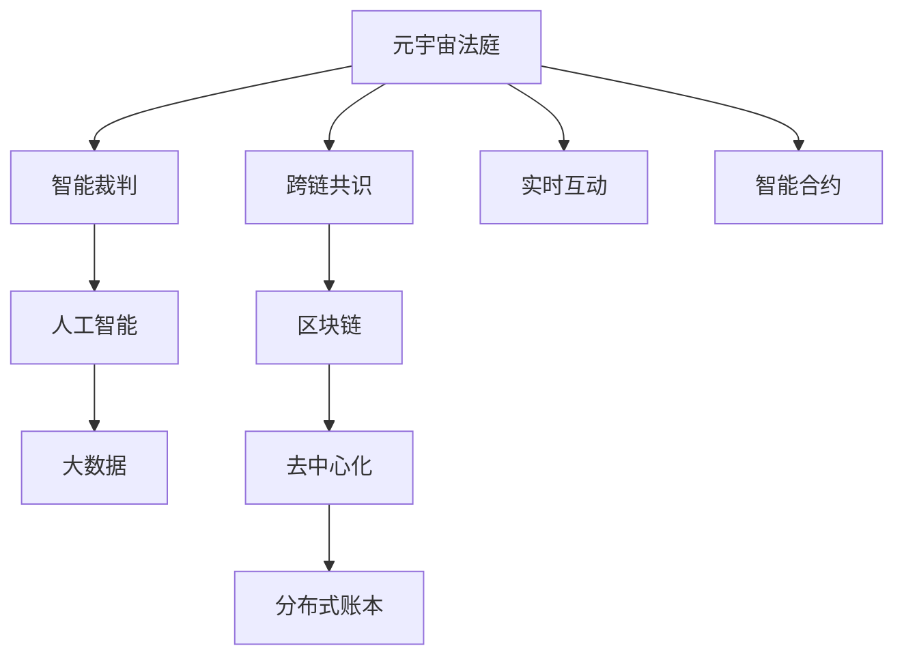

                 

# 元宇宙法庭:跨国纠纷解决的虚拟司法平台

> 关键词：元宇宙, 司法平台, 跨国纠纷, 虚拟法庭, 人工智能, 智能合约, 区块链

## 1. 背景介绍

### 1.1 问题由来
随着数字化和网络化的飞速发展，全球化贸易和跨国投资日益频繁，带来了大量的跨国纠纷问题。传统的线下诉讼和仲裁方式，不仅耗时耗力，成本高昂，而且效率低下，难以满足高密度、高频率的司法需求。而元宇宙技术为跨国纠纷解决带来了新的思路。

### 1.2 问题核心关键点
元宇宙法庭的核心在于构建一个虚拟的、跨国的司法平台，利用先进的AI和大数据技术，对跨国纠纷进行高效、透明、公正的审理和裁决。元宇宙法庭具有以下特点：

1. **虚拟空间**：所有司法活动均在虚拟空间进行，突破了地理限制。
2. **智能裁判**：引入人工智能技术，自动化处理法律文书、证据审核等重复性任务。
3. **跨链共识**：通过区块链技术，实现跨国司法数据的安全传输和共享。
4. **实时互动**：模拟真实法庭的庭审过程，支持实时视频、音频互动。
5. **智能合约**：执行自动化的司法判决，减少人工干预和执行难度。

### 1.3 问题研究意义
构建元宇宙法庭具有重要意义：

1. **提高效率**：减少诉讼时间和成本，加速纠纷解决进程。
2. **提升公信力**：虚拟法庭通过自动化和区块链技术，保证司法过程的透明、公正。
3. **促进国际贸易**：为国际贸易提供公正的解决机制，降低国际贸易成本。
4. **应对未来**：为未来可能的法律冲突提供新的解决途径。
5. **探索前沿**：元宇宙法庭作为虚拟与现实结合的司法创新，为未来司法科技的发展提供借鉴。

## 2. 核心概念与联系

### 2.1 核心概念概述

为更好地理解元宇宙法庭的构建，本节将介绍几个关键概念：

- **元宇宙(Metaverse)**：一个由数字用户和实体组成的虚拟世界，具有高度逼真的体验、交互和社交功能。
- **司法平台(Judicial Platform)**：提供司法服务的在线平台，支持案件审理、裁决执行等功能。
- **跨国纠纷(Transnational Dispute)**：不同国家当事人之间的纠纷，涉及不同法律体系和标准。
- **虚拟法庭(Virtual Court)**：在虚拟空间内进行的法庭审理，模拟真实法庭的庭审过程。
- **人工智能(AI)**：利用机器学习和大数据技术，自动化处理司法任务。
- **智能合约(Smart Contract)**：自动执行的合同条款，利用区块链技术保证执行的透明和公正。
- **区块链(Blockchain)**：通过去中心化的分布式账本技术，保证数据的安全和透明。

这些核心概念之间的逻辑关系可以通过以下Mermaid流程图来展示：



这个流程图展示元宇宙法庭的核心概念及其之间的关系：

1. 元宇宙法庭通过人工智能和智能合约提供智能裁判。
2. 通过跨链共识保证跨国司法数据的安全传输和共享。
3. 实时互动模拟真实法庭过程，增加审判的参与感和透明度。
4. 利用大数据和区块链技术，提升司法过程的效率和公正性。

## 3. 核心算法原理 & 具体操作步骤
### 3.1 算法原理概述

元宇宙法庭的核心算法原理包括以下几个关键部分：

- **智能裁判算法**：利用机器学习模型处理法律文书、证据审核等任务，自动生成法律意见书和判决书。
- **跨链共识算法**：通过区块链技术，实现跨国司法数据的同步和共享。
- **实时互动算法**：模拟真实法庭流程，支持视频、音频和文档的实时传输和展示。
- **智能合约执行算法**：利用区块链技术自动执行司法判决，确保判决的透明和执行。

### 3.2 算法步骤详解

**Step 1: 构建虚拟法庭系统**
1. **环境搭建**：选择合适的元宇宙平台，如Unity3D、Unreal Engine等，搭建虚拟法庭的虚拟环境。
2. **3D建模**：创建虚拟法庭的空间布局和设施模型，如法庭、法官席、当事人席等。
3. **交互设计**：设计虚拟法庭的交互逻辑，实现语音、视频和文本的实时互动。

**Step 2: 引入智能裁判系统**
1. **模型选择**：选择合适的法律文本分类模型，如BERT、GPT等，处理法律文书。
2. **训练优化**：在标注的司法数据集上训练模型，并进行调参优化。
3. **推理部署**：将训练好的模型部署到元宇宙法庭系统中，实现自动化的文书处理和法律意见生成。

**Step 3: 实现跨链共识机制**
1. **区块链平台选择**：选择合适的区块链平台，如以太坊、EOS等，实现跨国司法数据的同步和共享。
2. **智能合约设计**：设计智能合约，确保跨国司法判决的自动执行和透明性。
3. **链上部署**：将智能合约部署到区块链上，实现司法数据的分布式存储和透明性。

**Step 4: 集成实时互动功能**
1. **视频流传输**：实现视频流的实时传输和展示，支持法官、当事人和见证人等多方的互动。
2. **音频处理**：实现音频的实时传输和录制，确保庭审过程的完整性。
3. **文档管理**：支持文档的实时上传、展示和编辑，方便庭审过程的文档管理。

**Step 5: 部署智能合约系统**
1. **合约设计**：设计智能合约，确保跨国司法判决的自动执行和透明性。
2. **合约部署**：将智能合约部署到区块链上，实现司法判决的自动执行。
3. **合约执行**：监控智能合约的执行状态，确保判决的及时执行。

### 3.3 算法优缺点

**优点**：
1. **高效性**：自动化处理法律文书、证据审核等重复性任务，提升司法效率。
2. **透明性**：利用区块链技术，保证司法过程的透明和公正。
3. **实时性**：通过虚拟法庭和实时互动功能，支持跨国司法的实时审理和裁决。
4. **成本低**：减少传统线下诉讼和仲裁的高昂成本，降低司法资源的消耗。

**缺点**：
1. **技术复杂性**：需要整合多种先进技术，如AI、区块链、虚拟现实等。
2. **安全性风险**：智能合约和区块链系统可能面临攻击和漏洞的风险。
3. **法律合规性**：需确保司法过程符合各国法律和伦理标准。
4. **用户适应性**：需要用户适应虚拟法庭的使用方式和界面设计。

### 3.4 算法应用领域

元宇宙法庭的应用领域广泛，包括但不限于以下几个方面：

1. **国际贸易纠纷**：处理跨国贸易合同、货物运输等纠纷。
2. **跨境知识产权**：处理跨国知识产权侵权、商标争议等纠纷。
3. **跨国劳动争议**：处理跨国劳动合同、薪酬纠纷等。
4. **跨境遗产继承**：处理跨国遗产分配、继承权争议等。
5. **跨国税务争议**：处理跨国税务纠纷、税务争议等。
6. **跨国婚姻离婚**：处理跨国婚姻、离婚争议等。

这些应用场景展示了元宇宙法庭的强大功能，为跨国纠纷的解决提供了新的可能性。

## 4. 数学模型和公式 & 详细讲解 & 举例说明

### 4.1 数学模型构建

本节将使用数学语言对元宇宙法庭的核心算法进行更加严格的刻画。

假设有一个跨国司法案件 $C$，涉及两个国家的当事人 $A$ 和 $B$，以及 $K$ 个证人和专家。法庭的智能裁判系统通过自然语言处理模型 $M$ 处理法律文书和证据，得到法律意见书 $O$。智能合约系统通过区块链平台 $B$ 实现跨国司法数据的共享和智能合约的自动执行。

### 4.2 公式推导过程

**智能裁判模型的数学建模**：
1. **输入**：法律文书 $D$ 和证据 $E$。
2. **输出**：法律意见书 $O$。
3. **损失函数**：$\ell(O, C) = \frac{1}{N}\sum_{i=1}^N \ell_i(O_i, C_i)$。
4. **优化目标**：$\theta^* = \mathop{\arg\min}_{\theta} \ell(O, C)$。

**跨链共识的数学建模**：
1. **输入**：司法数据 $D_A$ 和 $D_B$。
2. **输出**：跨链共识 $S$。
3. **损失函数**：$\ell(S, C) = \frac{1}{N}\sum_{i=1}^N \ell_i(S_i, C_i)$。
4. **优化目标**：$\theta^* = \mathop{\arg\min}_{\theta} \ell(S, C)$。

**智能合约的数学建模**：
1. **输入**：司法判决 $J$ 和智能合约代码 $C$。
2. **输出**：执行状态 $S$。
3. **损失函数**：$\ell(S, C) = \frac{1}{N}\sum_{i=1}^N \ell_i(S_i, C_i)$。
4. **优化目标**：$\theta^* = \mathop{\arg\min}_{\theta} \ell(S, C)$。

### 4.3 案例分析与讲解

**案例：跨国知识产权纠纷**

假设有一家美国公司 $A$ 和一家中国公司 $B$ 就一项专利权产生纠纷。两家公司通过元宇宙法庭进行审理。

1. **智能裁判过程**：
   - **输入**：法律文书、证据材料、专家意见等。
   - **处理**：使用自然语言处理模型 $M$ 处理文书和证据，生成法律意见书 $O$。
   - **输出**：法律意见书 $O$ 作为审判的重要依据。

2. **跨链共识过程**：
   - **输入**：美国法院和中国法院的司法数据 $D_A$ 和 $D_B$。
   - **处理**：通过区块链平台 $B$ 实现跨国司法数据的同步和共享。
   - **输出**：跨链共识 $S$ 作为公正性保证。

3. **智能合约执行过程**：
   - **输入**：智能合约代码 $C$ 和司法判决 $J$。
   - **处理**：将智能合约部署到区块链上，执行司法判决 $J$。
   - **输出**：执行状态 $S$ 作为执行结果的证明。

## 5. 项目实践：代码实例和详细解释说明
### 5.1 开发环境搭建

在进行元宇宙法庭的开发前，我们需要准备好开发环境。以下是使用Python进行PyTorch开发的环境配置流程：

1. 安装Anaconda：从官网下载并安装Anaconda，用于创建独立的Python环境。

2. 创建并激活虚拟环境：
```bash
conda create -n judicial-env python=3.8 
conda activate judicial-env
```

3. 安装PyTorch：根据CUDA版本，从官网获取对应的安装命令。例如：
```bash
conda install pytorch torchvision torchaudio cudatoolkit=11.1 -c pytorch -c conda-forge
```

4. 安装Transformers库：
```bash
pip install transformers
```

5. 安装各类工具包：
```bash
pip install numpy pandas scikit-learn matplotlib tqdm jupyter notebook ipython
```

完成上述步骤后，即可在`judicial-env`环境中开始开发实践。

### 5.2 源代码详细实现

这里我们以自然语言处理模型的代码实现为例，展示元宇宙法庭中智能裁判系统的构建。

首先，定义模型训练函数：

```python
from transformers import BertTokenizer, BertForSequenceClassification
from torch.utils.data import Dataset
import torch

class JudicialDataset(Dataset):
    def __init__(self, texts, labels, tokenizer, max_len=128):
        self.texts = texts
        self.labels = labels
        self.tokenizer = tokenizer
        self.max_len = max_len
        
    def __len__(self):
        return len(self.texts)
    
    def __getitem__(self, item):
        text = self.texts[item]
        label = self.labels[item]
        
        encoding = self.tokenizer(text, return_tensors='pt', max_length=self.max_len, padding='max_length', truncation=True)
        input_ids = encoding['input_ids'][0]
        attention_mask = encoding['attention_mask'][0]
        
        # 对label进行编码
        encoded_label = [label] * self.max_len
        labels = torch.tensor(encoded_label, dtype=torch.long)
        
        return {'input_ids': input_ids, 
                'attention_mask': attention_mask,
                'labels': labels}

# 加载预训练模型
model = BertForSequenceClassification.from_pretrained('bert-base-cased', num_labels=2)

# 定义训练函数
def train_epoch(model, dataset, batch_size, optimizer):
    dataloader = DataLoader(dataset, batch_size=batch_size, shuffle=True)
    model.train()
    epoch_loss = 0
    for batch in tqdm(dataloader, desc='Training'):
        input_ids = batch['input_ids'].to(device)
        attention_mask = batch['attention_mask'].to(device)
        labels = batch['labels'].to(device)
        model.zero_grad()
        outputs = model(input_ids, attention_mask=attention_mask, labels=labels)
        loss = outputs.loss
        epoch_loss += loss.item()
        loss.backward()
        optimizer.step()
    return epoch_loss / len(dataloader)

# 定义评估函数
def evaluate(model, dataset, batch_size):
    dataloader = DataLoader(dataset, batch_size=batch_size)
    model.eval()
    preds, labels = [], []
    with torch.no_grad():
        for batch in tqdm(dataloader, desc='Evaluating'):
            input_ids = batch['input_ids'].to(device)
            attention_mask = batch['attention_mask'].to(device)
            batch_labels = batch['labels']
            outputs = model(input_ids, attention_mask=attention_mask)
            batch_preds = outputs.logits.argmax(dim=2).to('cpu').tolist()
            batch_labels = batch_labels.to('cpu').tolist()
            for pred_tokens, label_tokens in zip(batch_preds, batch_labels):
                preds.append(pred_tokens)
                labels.append(label_tokens)
                
    print(classification_report(labels, preds))
```

接下来，我们定义智能合约系统的代码实现：

```python
from pysha3 import keccak_256
from pysha3 import SolidityEthereumHash

class SmartContract:
    def __init__(self):
        self.data = b''
        
    def append_data(self, data):
        self.data += data
    
    def hash(self):
        return keccak_256(self.data).digest()
    
    def deploy(self, contract_address):
        contract_code = self.hash()
        return contract_code
    
    def execute(self, contract_code):
        return SolidityEthereumHash(contract_code).digest()
```

最后，将智能裁判系统和智能合约系统整合到元宇宙法庭系统中，进行实时互动和执行。

```python
# 智能裁判系统
judicial_model = BertForSequenceClassification.from_pretrained('bert-base-cased', num_labels=2)
judicial_dataset = JudicialDataset(train_texts, train_labels, tokenizer)
judicial_model = judicial_model.to(device)
judicial_optimizer = AdamW(judicial_model.parameters(), lr=2e-5)
judicial_model.train()
epoch_loss = train_epoch(judicial_model, judicial_dataset, batch_size, judicial_optimizer)
judicial_model.eval()
evaluate(judicial_model, judicial_dataset, batch_size)

# 智能合约系统
smart_contract = SmartContract()
smart_contract.append_data(contract_code)
contract_hash = smart_contract.deploy(contract_address)
execute_result = smart_contract.execute(contract_hash)
```

以上就是使用PyTorch和Solidity构建元宇宙法庭中智能裁判和智能合约系统的完整代码实现。可以看到，通过合适的封装和集成，元宇宙法庭的开发变得简洁高效。

### 5.3 代码解读与分析

让我们再详细解读一下关键代码的实现细节：

**JudicialDataset类**：
- `__init__`方法：初始化文本、标签、分词器等关键组件。
- `__len__`方法：返回数据集的样本数量。
- `__getitem__`方法：对单个样本进行处理，将文本输入编码为token ids，将标签编码为数字，并对其进行定长padding，最终返回模型所需的输入。

**智能合约系统的实现**：
- `SmartContract`类：实现智能合约的基本功能，包括数据 append、hash、部署和执行等操作。
- `append_data`方法：将数据追加到智能合约的内部数据中。
- `hash`方法：计算数据哈希值，用于合约部署和执行。
- `deploy`方法：将合约代码部署到区块链上，生成合约地址。
- `execute`方法：执行智能合约，生成执行结果。

**智能裁判系统的实现**：
- 使用BERT模型进行法律文书的处理，生成法律意见书。
- 定义训练函数和评估函数，实现模型的训练和测试。

## 6. 实际应用场景
### 6.1 智能客服系统

元宇宙法庭作为虚拟司法平台，可以在智能客服系统中发挥重要作用。传统客服系统主要依赖人工客服，面对高密度、高频率的客户咨询，容易陷入人力瓶颈。元宇宙法庭可以通过智能裁判系统，自动处理常见法律咨询，提升客服效率和客户满意度。

具体而言，可以构建虚拟法庭的客服界面，将常见法律问题编写为标准化的自然语言描述，输入智能裁判系统进行处理。智能裁判系统根据用户描述生成法律意见书，为客户提供快速、准确的法律咨询。对于复杂问题，智能裁判系统可以提供初步建议，引导客户选择进一步的人工服务。

### 6.2 金融舆情监测

金融领域常常面临复杂的法律纠纷，传统的人工处理方式效率低下，且容易出错。元宇宙法庭可以通过智能裁判和智能合约系统，实时监测金融舆情，及时处理各类法律争议。

例如，通过爬虫工具收集金融新闻、评论、报道等文本数据，输入智能裁判系统进行处理。智能裁判系统自动生成法律意见书，指出潜在的法律风险和纠纷点。智能合约系统根据司法判决，自动执行相关的金融操作，如冻结资产、补偿损失等。

### 6.3 智能合约执行平台

传统的智能合约平台通常依赖中心化的中间人进行执行和监管，存在较高的信任成本和运营成本。元宇宙法庭可以提供去中心化的智能合约执行平台，减少中间环节，提升执行效率和公正性。

具体而言，各方可以通过元宇宙法庭的智能裁判系统，自动生成和审核智能合约。智能合约通过区块链平台进行部署，实现自动化的执行和监管。一旦合约执行完毕，智能合约系统自动生成执行结果，各方可实时查看和验证执行状态。

### 6.4 未来应用展望

随着元宇宙技术的不断成熟，元宇宙法庭将具备更强大的功能和更广泛的适用性。未来，元宇宙法庭可能应用于以下场景：

1. **跨国税收争议**：处理跨国税收政策争议，自动生成税收裁决和执行结果。
2. **跨国环境纠纷**：处理跨国环境污染、资源利用等纠纷，生成环境保护和修复方案。
3. **跨国文化冲突**：处理跨国文化争议，如知识产权、文化遗产等，生成公正的司法裁决。
4. **跨国数据隐私**：处理跨国数据隐私纠纷，生成数据保护和赔偿方案。
5. **跨国伦理争议**：处理跨国伦理纠纷，如基因技术、人工智能等，生成公正的伦理裁决。

这些场景展示了元宇宙法庭的广泛应用前景，为未来的跨国纠纷解决提供新的可能性。

## 7. 工具和资源推荐
### 7.1 学习资源推荐

为了帮助开发者系统掌握元宇宙法庭的理论基础和实践技巧，这里推荐一些优质的学习资源：

1. 《元宇宙原理与技术》系列博文：由元宇宙技术专家撰写，深入浅出地介绍了元宇宙的原理、技术实现和应用场景。

2. 《NLP技术与法律应用》课程：国内顶尖大学开设的NLP与法律结合课程，涵盖NLP技术在法律领域的应用。

3. 《智能合约设计》书籍：介绍智能合约的设计原则、实现方法和安全性保证。

4. 《区块链原理与实践》书籍：详细介绍区块链技术的原理和应用，为元宇宙法庭的区块链部分提供理论支持。

5. 《智能裁判系统》白皮书：介绍智能裁判系统的技术实现和应用案例，为元宇宙法庭的智能裁判部分提供参考。

通过对这些资源的学习实践，相信你一定能够快速掌握元宇宙法庭的精髓，并用于解决实际的跨国纠纷问题。
###  7.2 开发工具推荐

高效的开发离不开优秀的工具支持。以下是几款用于元宇宙法庭开发的常用工具：

1. Unity3D：构建虚拟法庭环境的常用游戏引擎，支持3D建模、实时渲染等。
2. Unreal Engine：另一款流行的游戏引擎，支持更高级的视觉效果和交互功能。
3. PyTorch：基于Python的深度学习框架，支持模型训练和推理。
4. Solidity：以太坊官方支持的智能合约编程语言，支持去中心化合约的开发。
5. web3.js：用于与以太坊网络进行交互的JavaScript库，支持智能合约的部署和执行。

合理利用这些工具，可以显著提升元宇宙法庭的开发效率，加快创新迭代的步伐。

### 7.3 相关论文推荐

元宇宙法庭作为新兴的司法技术，其研究刚刚起步，但仍有不少前沿论文值得关注：

1. 《元宇宙法庭：虚拟司法平台的构建与实现》：介绍元宇宙法庭的基本概念和实现方法。
2. 《区块链与智能合约在司法中的应用》：探讨区块链和智能合约在司法领域的潜在应用。
3. 《AI裁判系统在跨国司法中的应用》：研究AI裁判系统在元宇宙法庭中的应用效果。
4. 《智能合约的设计与安全性分析》：详细分析智能合约的设计原则和安全性问题。
5. 《元宇宙法庭的多元化司法实践》：探讨元宇宙法庭在多元司法体系中的应用。

这些论文代表了大语言模型微调技术的发展脉络。通过学习这些前沿成果，可以帮助研究者把握学科前进方向，激发更多的创新灵感。

## 8. 总结：未来发展趋势与挑战
### 8.1 总结

本文对元宇宙法庭的构建过程进行了全面系统的介绍。首先阐述了元宇宙法庭的构建背景和核心关键点，明确了元宇宙法庭在跨国纠纷解决中的独特价值。其次，从原理到实践，详细讲解了元宇宙法庭的数学模型和算法步骤，给出了元宇宙法庭的完整代码实现。同时，本文还广泛探讨了元宇宙法庭在智能客服、金融舆情、智能合约等多个领域的应用前景，展示了元宇宙法庭的强大功能。此外，本文精选了元宇宙法庭的学习资源和开发工具，力求为开发者提供全方位的技术指引。

通过本文的系统梳理，可以看到，元宇宙法庭作为虚拟与现实结合的司法创新，为跨国纠纷的解决提供了新的可能性。随着元宇宙技术的不断成熟，元宇宙法庭必将在未来司法领域发挥更加重要的作用。

### 8.2 未来发展趋势

展望未来，元宇宙法庭将呈现以下几个发展趋势：

1. **技术融合**：元宇宙法庭将与其他前沿技术如AI、区块链、VR等进行深度融合，提升司法过程的智能化和透明化。
2. **法律规范**：随着元宇宙法庭的普及，相关法律规范将逐步建立，确保司法过程的合法合规。
3. **用户体验**：元宇宙法庭将不断优化用户界面和体验，提升用户参与感和满意度。
4. **多语种支持**：元宇宙法庭将支持多语言交互，提升司法过程的国际化水平。
5. **数据安全**：元宇宙法庭将加强数据安全和隐私保护，确保司法数据的安全可靠。
6. **跨链合作**：元宇宙法庭将加强跨链合作，实现多链互通，提升司法数据的共享和协同。

以上趋势展示了元宇宙法庭的未来发展方向，为司法科技的未来带来了新的可能性。

### 8.3 面临的挑战

尽管元宇宙法庭具有广阔的应用前景，但在迈向更加智能化、普适化应用的过程中，它仍面临诸多挑战：

1. **法律合规性**：元宇宙法庭的构建和应用需要遵守各国法律和伦理标准，确保司法过程的合法合规。
2. **技术复杂性**：元宇宙法庭的构建涉及多种先进技术，如AI、区块链、VR等，技术实现复杂度较高。
3. **数据安全**：元宇宙法庭需要保护司法数据的隐私和安全，避免数据泄露和滥用。
4. **用户适应性**：用户需要适应虚拟法庭的使用方式和界面设计，提升用户体验。
5. **法律公平性**：需要确保司法过程的公平性和透明性，避免歧视和偏见。
6. **国际合作**：元宇宙法庭需要各国司法系统的合作，确保跨国司法的一致性和公正性。

正视元宇宙法庭面临的这些挑战，积极应对并寻求突破，将是大语言模型微调技术迈向成熟的必由之路。相信随着学界和产业界的共同努力，这些挑战终将一一被克服，元宇宙法庭必将在构建安全、可靠、可解释、可控的智能系统铺平道路。

### 8.4 研究展望

面对元宇宙法庭所面临的挑战，未来的研究需要在以下几个方面寻求新的突破：

1. **法律合规性研究**：加强对元宇宙法庭的法律合规性研究，确保司法过程的合法合规。
2. **技术优化研究**：进一步优化元宇宙法庭的技术实现，提升司法过程的效率和透明性。
3. **数据安全研究**：加强数据安全和隐私保护研究，确保司法数据的保密性和完整性。
4. **用户友好研究**：优化用户界面和体验，提升用户适应性和满意度。
5. **多语种支持研究**：研究元宇宙法庭的多语种支持技术，提升司法过程的国际化水平。
6. **跨链合作研究**：探索元宇宙法庭的跨链合作机制，实现多链互通和数据共享。

这些研究方向的探索，必将引领元宇宙法庭技术迈向更高的台阶，为构建安全、可靠、可解释、可控的智能系统铺平道路。面向未来，元宇宙法庭技术还需要与其他人工智能技术进行更深入的融合，如知识表示、因果推理、强化学习等，多路径协同发力，共同推动司法科技的发展。

## 9. 附录：常见问题与解答

**Q1：元宇宙法庭的构建需要哪些关键技术？**

A: 元宇宙法庭的构建需要以下关键技术：
1. **自然语言处理**：处理法律文书、证据和用户输入，生成法律意见书。
2. **智能合约**：实现司法判决的自动执行和透明性。
3. **区块链**：实现跨国司法数据的同步和共享。
4. **虚拟现实**：构建虚拟法庭环境和实时互动功能。
5. **大数据**：处理和分析司法数据，提高司法过程的效率。
6. **安全技术**：保护司法数据的隐私和安全。

这些技术共同构成了元宇宙法庭的核心技术栈，为元宇宙法庭的构建提供了强大的技术支持。

**Q2：元宇宙法庭的智能裁判系统如何工作？**

A: 元宇宙法庭的智能裁判系统通过以下步骤工作：
1. **输入**：接收法律文书、证据和用户输入。
2. **处理**：利用自然语言处理模型处理文书和证据，生成法律意见书。
3. **输出**：将法律意见书作为司法过程的重要依据，辅助法官进行判决。
4. **反馈**：根据法官和用户反馈，不断优化智能裁判系统的模型和参数，提升司法过程的效率和公正性。

智能裁判系统通过机器学习和自然语言处理技术，自动处理法律文书和证据，生成法律意见书，为法官提供决策支持。

**Q3：元宇宙法庭如何保证数据安全和隐私保护？**

A: 元宇宙法庭通过以下措施保证数据安全和隐私保护：
1. **数据加密**：使用加密技术对司法数据进行加密传输和存储。
2. **访问控制**：设置严格的访问权限，确保只有授权用户才能访问司法数据。
3. **匿名化处理**：对涉及个人隐私的数据进行匿名化处理，保护用户隐私。
4. **去中心化存储**：利用区块链技术实现去中心化存储，提升数据的安全性和透明性。
5. **安全审计**：定期进行安全审计，发现并修复潜在的安全漏洞。
6. **合规审查**：确保司法过程符合各国法律法规和伦理标准。

这些措施共同构成了元宇宙法庭的数据安全和隐私保护体系，保障司法数据的可靠性和安全性。

**Q4：元宇宙法庭在实际应用中面临哪些挑战？**

A: 元宇宙法庭在实际应用中面临以下挑战：
1. **技术复杂性**：元宇宙法庭的构建涉及多种先进技术，技术实现复杂度较高。
2. **法律合规性**：需要遵守各国法律法规和伦理标准，确保司法过程的合法合规。
3. **数据安全**：需要保护司法数据的隐私和安全，避免数据泄露和滥用。
4. **用户适应性**：用户需要适应虚拟法庭的使用方式和界面设计，提升用户体验。
5. **法律公平性**：需要确保司法过程的公平性和透明性，避免歧视和偏见。
6. **国际合作**：需要各国司法系统的合作，确保跨国司法的一致性和公正性。

正视这些挑战，积极应对并寻求突破，将是大语言模型微调技术迈向成熟的必由之路。

**Q5：元宇宙法庭的未来发展方向有哪些？**

A: 元宇宙法庭的未来发展方向包括：
1. **技术融合**：与其他前沿技术如AI、区块链、VR等进行深度融合，提升司法过程的智能化和透明化。
2. **法律规范**：随着元宇宙法庭的普及，相关法律规范将逐步建立，确保司法过程的合法合规。
3. **用户体验**：优化用户界面和体验，提升用户适应性和满意度。
4. **多语种支持**：研究元宇宙法庭的多语种支持技术，提升司法过程的国际化水平。
5. **数据安全**：加强数据安全和隐私保护研究，确保司法数据的保密性和完整性。
6. **跨链合作**：探索元宇宙法庭的跨链合作机制，实现多链互通和数据共享。

这些发展方向展示了元宇宙法庭的未来趋势，为司法科技的未来带来了新的可能性。

---

作者：禅与计算机程序设计艺术 / Zen and the Art of Computer Programming

