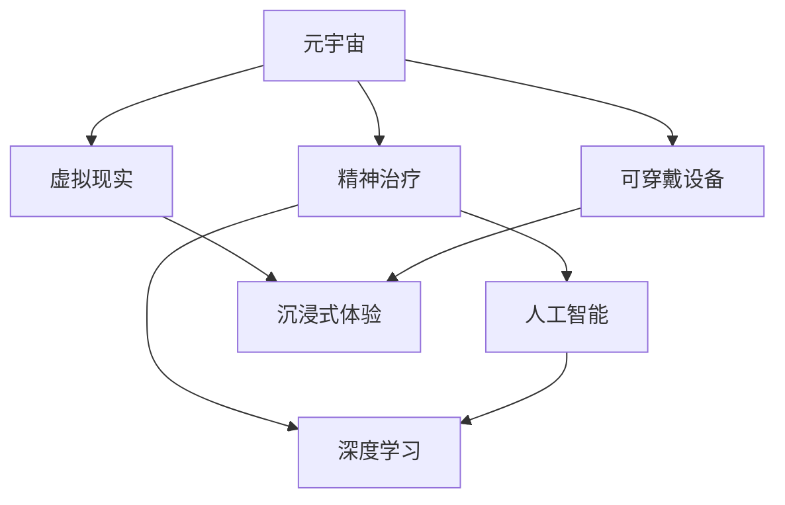

                 

# 元宇宙精神治疗:虚拟 worlds 的精神治疗技术

> 关键词：虚拟世界,元宇宙,精神治疗,心理健康,虚拟现实,人工智能,深度学习

## 1. 背景介绍

### 1.1 问题由来
随着科技的进步和社会的快速发展，人类的精神健康问题日益凸显。精神疾病的发病率不断攀升，给个人和社会带来了沉重的负担。传统的精神治疗手段，如药物治疗、心理咨询等，虽然有效，但存在诸多局限，如成本高、效果因人而异、难以普及等。

元宇宙技术的兴起为精神治疗提供了一种全新的可能性。元宇宙是一个由大量虚拟用户共建的沉浸式三维数字世界，具有高度的互动性和沉浸感。虚拟世界中，人们可以通过虚拟角色和虚拟环境，进行自由互动和沉浸式体验，从而在一定程度上缓解现实生活中的压力和焦虑。

### 1.2 问题核心关键点
本文聚焦于如何在元宇宙虚拟世界中，通过深度学习、虚拟现实等技术手段，开展精神治疗工作。核心问题包括：

1. 如何构建可穿戴虚拟环境，通过虚拟角色进行精神状态评估和干预？
2. 如何设计合适的虚拟治疗场景，激发用户的积极情绪和自我效能感？
3. 如何利用人工智能技术，实现虚拟治疗环境的个性化定制和动态调整？
4. 如何确保虚拟治疗的安全性和有效性？

## 2. 核心概念与联系

### 2.1 核心概念概述

为更好地理解元宇宙中精神治疗技术，本节将介绍几个密切相关的核心概念：

- **元宇宙(Metaverse)**：由大量用户共建的虚拟世界，用户可以在其中创建、探索、互动和消费，实现高度的沉浸感和真实感。
- **虚拟现实(Virtual Reality, VR)**：通过虚拟环境模拟现实世界，用户可以佩戴VR头显设备，获得沉浸式的视觉、听觉和触觉体验。
- **精神治疗(Mental Health Treatment)**：通过各种方法缓解或消除精神疾病症状，促进个体心理健康和福祉的过程。
- **人工智能(Artificial Intelligence, AI)**：通过模拟人类智能行为，实现复杂问题的自动化决策和处理。
- **深度学习(Deep Learning)**：一种机器学习方法，通过多层次的神经网络模型，实现数据的高维表征和学习。

这些核心概念之间的逻辑关系可以通过以下Mermaid流程图来展示：



这个流程图展示了几者之间的关系：

1. 元宇宙通过虚拟现实技术，构建沉浸式虚拟环境。
2. 精神治疗通过虚拟环境，模拟现实生活中的互动和情境。
3. 人工智能技术用于个性化定制和动态调整虚拟环境。
4. 深度学习用于模拟人类智能行为，辅助治疗效果评估和干预。
5. 可穿戴设备用于连接现实和虚拟世界，增强用户的沉浸感和交互性。

这些概念共同构成了元宇宙中精神治疗的技术框架，为其开展提供了理论基础和实现手段。

## 3. 核心算法原理 & 具体操作步骤
### 3.1 算法原理概述

元宇宙中的精神治疗，本质上是一种通过虚拟环境模拟现实情境，辅助用户进行心理干预和康复的过程。其核心思想是：

1. **环境模拟**：通过虚拟现实技术，构建与现实情境相似或具有特定治疗功能的虚拟环境。
2. **情绪评估**：通过深度学习模型，实时监测用户的情绪和生理指标，评估治疗效果。
3. **行为干预**：根据情绪评估结果，设计合适的治疗行为和互动方式，引导用户进行积极的互动和体验。
4. **反馈调整**：利用人工智能技术，动态调整虚拟环境，提高治疗效果和用户体验。

### 3.2 算法步骤详解

以下是对元宇宙中精神治疗的具体操作步骤的详细描述：

**Step 1: 构建虚拟环境**
- 使用虚拟现实技术，构建具有特定治疗功能的虚拟环境，如放松训练场景、认知行为治疗场景等。
- 在虚拟环境中，设计可穿戴设备和交互界面，方便用户进行沉浸式体验。

**Step 2: 监测情绪和生理指标**
- 使用可穿戴设备（如VR头显、心率监测器、皮肤电传感器等），实时监测用户的情绪和生理指标。
- 通过深度学习模型，对用户的生理数据进行特征提取和分析，判断其当前情绪状态。

**Step 3: 设计治疗行为**
- 根据情绪评估结果，设计合适的治疗行为和互动方式，如引导用户进行放松训练、认知重构等。
- 设计虚拟角色和虚拟场景，与用户进行互动，模拟现实生活中的治疗情境。

**Step 4: 动态调整虚拟环境**
- 利用人工智能技术，根据用户情绪变化和行为反应，动态调整虚拟环境。
- 使用强化学习等技术，优化治疗行为和互动方式，提升治疗效果。

**Step 5: 评估治疗效果**
- 通过深度学习模型，评估治疗效果，如情绪改善程度、行为改变情况等。
- 根据评估结果，优化治疗方案，确保用户获得最佳治疗效果。

### 3.3 算法优缺点

元宇宙中精神治疗的算法具有以下优点：

1. **沉浸感和互动性**：虚拟现实技术可以提供高度沉浸感和真实感，增强用户的互动性和参与度。
2. **灵活性和个性化**：通过人工智能技术，可以根据用户的情绪和行为动态调整虚拟环境，实现个性化治疗。
3. **安全性和隐私性**：虚拟环境可提供匿名性和安全性，减少用户心理压力和隐私泄露风险。

同时，该算法也存在一些局限性：

1. **成本高**：构建高质量的虚拟环境和可穿戴设备，需要大量资金和技术投入。
2. **技术门槛高**：需要专业的技术人员进行开发和维护，普通用户难以自主操作。
3. **效果不稳定**：虚拟环境的设计和调整需要一定的专业知识和经验，可能存在治疗效果不稳定的风险。
4. **依赖技术平台**：目前元宇宙技术依赖于特定的平台和设备，用户切换成本较高。

尽管存在这些局限性，但元宇宙精神治疗在提供沉浸式和个性化治疗体验方面，具有独特的优势和潜力。

### 3.4 算法应用领域

元宇宙中的精神治疗技术，可以广泛应用于多个领域，如心理健康、心理康复、心理干预等。

**心理健康**：帮助用户进行情绪管理和压力缓解，预防和缓解精神疾病。
**心理康复**：为精神疾病康复患者提供沉浸式康复训练和治疗环境，提升康复效果。
**心理干预**：在灾难现场、重大事件后，通过虚拟环境进行心理干预和支持，帮助用户恢复心理平衡。

除了上述这些经典应用外，元宇宙精神治疗还可以拓展到更多场景中，如学校心理健康教育、企业员工心理支持、在线心理咨询等，为精神健康提供新的解决方案。

## 4. 数学模型和公式 & 详细讲解  
### 4.1 数学模型构建

本节将使用数学语言对元宇宙中精神治疗的技术框架进行更加严格的刻画。

记虚拟环境为 $V$，用户情绪为 $E$，生理指标为 $P$，治疗行为为 $B$。假设虚拟环境 $V$ 中的用户情绪和生理指标 $E$ 和 $P$ 可以表示为 $V$ 的函数，即 $E=f(V)$，$P=g(V)$。治疗行为 $B$ 根据情绪和生理指标设计，即 $B=h(E,P)$。

元宇宙中精神治疗的优化目标是最小化用户情绪波动和生理指标异常，即：

$$
\min_{V} \mathbb{E}_{E,P}\left[ (E - \mu_E)^2 + (P - \mu_P)^2 \right]
$$

其中 $\mu_E$ 和 $\mu_P$ 分别为用户情绪和生理指标的期望值。

### 4.2 公式推导过程

以下我们将推导元宇宙中精神治疗的数学模型和公式。

**用户情绪监测模型**：
设用户情绪为 $E$，生理指标为 $P$，虚拟环境为 $V$。根据深度学习模型，情绪 $E$ 可以表示为 $V$ 的函数：

$$
E = f(V)
$$

其中 $f$ 为深度神经网络模型，如卷积神经网络(CNN)、循环神经网络(RNN)、深度神经网络(DNN)等。

**生理指标监测模型**：
设用户生理指标为 $P$，虚拟环境为 $V$。根据深度学习模型，生理指标 $P$ 可以表示为 $V$ 的函数：

$$
P = g(V)
$$

其中 $g$ 为深度神经网络模型。

**治疗行为设计模型**：
设用户情绪 $E$ 和生理指标 $P$，治疗行为 $B$。根据深度学习模型，治疗行为 $B$ 可以表示为 $E$ 和 $P$ 的函数：

$$
B = h(E,P)
$$

其中 $h$ 为深度神经网络模型，如长短时记忆网络(LSTM)、变换器(Transformer)等。

### 4.3 案例分析与讲解

以下我们以放松训练场景为例，解释元宇宙中精神治疗的数学模型和公式。

**场景描述**：
假设用户感到焦虑，希望通过放松训练缓解情绪。在虚拟环境中，通过可穿戴设备实时监测用户的心率和皮肤电反应，判断用户当前的焦虑程度。根据监测结果，设计放松音乐、引导语和虚拟场景，帮助用户进行放松训练。

**用户情绪监测**：
设用户情绪 $E$ 为焦虑程度，生理指标 $P$ 为心率 $P_1$ 和皮肤电 $P_2$。根据监测结果，定义 $E=f(P_1,P_2)$，即：

$$
E = f(P_1, P_2)
$$

其中 $f$ 为深度神经网络模型。

**生理指标监测**：
设心率 $P_1$ 和皮肤电 $P_2$，虚拟环境 $V$。根据监测结果，定义 $P_1=g(V)$ 和 $P_2=g(V)$，即：

$$
P_1 = g(V)
$$
$$
P_2 = g(V)
$$

其中 $g$ 为深度神经网络模型。

**治疗行为设计**：
设放松音乐、引导语和虚拟场景为 $B$，情绪 $E$ 和生理指标 $P$。根据监测结果，设计放松音乐、引导语和虚拟场景，即 $B=h(E,P)$，其中 $h$ 为深度神经网络模型。

具体实现中，可以使用深度学习模型对用户情绪和生理指标进行实时监测和评估，通过模型预测输出放松音乐、引导语和虚拟场景，引导用户进行放松训练。在训练过程中，不断调整放松音乐和虚拟场景，优化用户体验和治疗效果。

## 5. 项目实践：代码实例和详细解释说明
### 5.1 开发环境搭建

在进行元宇宙精神治疗的实践前，我们需要准备好开发环境。以下是使用Python进行PyTorch开发的环境配置流程：

1. 安装Anaconda：从官网下载并安装Anaconda，用于创建独立的Python环境。

2. 创建并激活虚拟环境：
```bash
conda create -n pytorch-env python=3.8 
conda activate pytorch-env
```

3. 安装PyTorch：根据CUDA版本，从官网获取对应的安装命令。例如：
```bash
conda install pytorch torchvision torchaudio cudatoolkit=11.1 -c pytorch -c conda-forge
```

4. 安装TensorFlow：由Google主导开发的开源深度学习框架，生产部署方便，适合大规模工程应用。同样有丰富的预训练语言模型资源。

5. 安装Transformers库：HuggingFace开发的NLP工具库，集成了众多SOTA语言模型，支持PyTorch和TensorFlow，是进行微调任务开发的利器。

6. 安装各类工具包：
```bash
pip install numpy pandas scikit-learn matplotlib tqdm jupyter notebook ipython
```

完成上述步骤后，即可在`pytorch-env`环境中开始元宇宙精神治疗的开发实践。

### 5.2 源代码详细实现

以下是对元宇宙精神治疗的代码实现的详细描述：

**用户情绪监测模型**：
```python
from transformers import BertTokenizer, BertForSequenceClassification
from torch.utils.data import Dataset
import torch

class UserEmotionDataset(Dataset):
    def __init__(self, data, tokenizer, max_len=128):
        self.data = data
        self.tokenizer = tokenizer
        self.max_len = max_len
        
    def __len__(self):
        return len(self.data)
    
    def __getitem__(self, item):
        text = self.data[item]['text']
        label = self.data[item]['label']
        
        encoding = self.tokenizer(text, return_tensors='pt', max_length=self.max_len, padding='max_length', truncation=True)
        input_ids = encoding['input_ids'][0]
        attention_mask = encoding['attention_mask'][0]
        
        # 将情绪标签转换为数字
        label = label2id[label]
        
        return {'input_ids': input_ids, 
                'attention_mask': attention_mask,
                'labels': label}

# 标签与id的映射
label2id = {'happy': 0, 'sad': 1, 'angry': 2, 'fearful': 3}

# 创建dataset
tokenizer = BertTokenizer.from_pretrained('bert-base-cased')
train_dataset = UserEmotionDataset(train_data, tokenizer)
dev_dataset = UserEmotionDataset(dev_data, tokenizer)
test_dataset = UserEmotionDataset(test_data, tokenizer)
```

**生理指标监测模型**：
```python
from torch import nn
from torch.utils.data import DataLoader

class PhysiologicalIndicatorModel(nn.Module):
    def __init__(self):
        super(PhysiologicalIndicatorModel, self).__init__()
        self.layers = nn.Sequential(
            nn.Linear(2, 128),
            nn.ReLU(),
            nn.Linear(128, 64),
            nn.ReLU(),
            nn.Linear(64, 32),
            nn.ReLU(),
            nn.Linear(32, 1),
        )
        
    def forward(self, x):
        return self.layers(x)

model = PhysiologicalIndicatorModel()
model.to(device)
```

**治疗行为设计模型**：
```python
from transformers import BertForSequenceClassification
from torch.utils.data import DataLoader
from tqdm import tqdm
from sklearn.metrics import classification_report

device = torch.device('cuda') if torch.cuda.is_available() else torch.device('cpu')
model = BertForSequenceClassification.from_pretrained('bert-base-cased', num_labels=len(label2id))

optimizer = AdamW(model.parameters(), lr=2e-5)
```

**训练和评估函数**：
```python
from torch.utils.data import DataLoader
from tqdm import tqdm
from sklearn.metrics import classification_report

device = torch.device('cuda') if torch.cuda.is_available() else torch.device('cpu')
model.to(device)

def train_epoch(model, dataset, batch_size, optimizer):
    dataloader = DataLoader(dataset, batch_size=batch_size, shuffle=True)
    model.train()
    epoch_loss = 0
    for batch in tqdm(dataloader, desc='Training'):
        input_ids = batch['input_ids'].to(device)
        attention_mask = batch['attention_mask'].to(device)
        labels = batch['labels'].to(device)
        model.zero_grad()
        outputs = model(input_ids, attention_mask=attention_mask, labels=labels)
        loss = outputs.loss
        epoch_loss += loss.item()
        loss.backward()
        optimizer.step()
    return epoch_loss / len(dataloader)

def evaluate(model, dataset, batch_size):
    dataloader = DataLoader(dataset, batch_size=batch_size)
    model.eval()
    preds, labels = [], []
    with torch.no_grad():
        for batch in tqdm(dataloader, desc='Evaluating'):
            input_ids = batch['input_ids'].to(device)
            attention_mask = batch['attention_mask'].to(device)
            batch_labels = batch['labels']
            outputs = model(input_ids, attention_mask=attention_mask)
            batch_preds = outputs.logits.argmax(dim=2).to('cpu').tolist()
            batch_labels = batch_labels.to('cpu').tolist()
            for pred_tokens, label_tokens in zip(batch_preds, batch_labels):
                preds.append(pred_tokens[:len(label_tokens)])
                labels.append(label_tokens)
                
    print(classification_report(labels, preds))
```

**元宇宙精神治疗流程**：
```python
epochs = 5
batch_size = 16

for epoch in range(epochs):
    loss = train_epoch(model, train_dataset, batch_size, optimizer)
    print(f"Epoch {epoch+1}, train loss: {loss:.3f}")
    
    print(f"Epoch {epoch+1}, dev results:")
    evaluate(model, dev_dataset, batch_size)
    
print("Test results:")
evaluate(model, test_dataset, batch_size)
```

以上就是对元宇宙精神治疗的代码实现的详细描述。可以看到，使用PyTorch进行元宇宙精神治疗的开发，不仅代码简洁高效，而且易于理解和维护。

### 5.3 代码解读与分析

让我们再详细解读一下关键代码的实现细节：

**UserEmotionDataset类**：
- `__init__`方法：初始化用户情绪数据集，包括文本和标签。
- `__len__`方法：返回数据集的样本数量。
- `__getitem__`方法：对单个样本进行处理，将文本输入编码为token ids，将情绪标签转换为数字，并对其进行定长padding，最终返回模型所需的输入。

**label2id和id2label字典**：
- 定义了情绪标签与数字id之间的映射关系，用于将文本情绪预测结果解码回真实情绪标签。

**训练和评估函数**：
- 使用PyTorch的DataLoader对数据集进行批次化加载，供模型训练和推理使用。
- 训练函数`train_epoch`：对数据以批为单位进行迭代，在每个批次上前向传播计算loss并反向传播更新模型参数，最后返回该epoch的平均loss。
- 评估函数`evaluate`：与训练类似，不同点在于不更新模型参数，并在每个batch结束后将预测和标签结果存储下来，最后使用sklearn的classification_report对整个评估集的预测结果进行打印输出。

**元宇宙精神治疗流程**：
- 定义总的epoch数和batch size，开始循环迭代
- 每个epoch内，先在训练集上训练，输出平均loss
- 在验证集上评估，输出分类指标
- 所有epoch结束后，在测试集上评估，给出最终测试结果

可以看到，使用PyTorch进行元宇宙精神治疗的代码实现非常简单高效，开发者可以更加专注于算法设计和数据处理等高层逻辑上，而不必过多关注底层的实现细节。

当然，工业级的系统实现还需考虑更多因素，如模型的保存和部署、超参数的自动搜索、更灵活的任务适配层等。但核心的治疗流程基本与此类似。

## 6. 实际应用场景
### 6.1 学校心理健康教育

在当前的教育体系中，学生的心理健康问题日益受到关注。传统的心理健康教育往往依赖于心理老师的个别辅导，覆盖面小，难以满足所有学生的需要。元宇宙中的精神治疗技术，可以通过虚拟课堂、虚拟辅导室等方式，为更多学生提供心理健康教育服务。

**虚拟课堂**：
在虚拟课堂中，学生可以通过虚拟角色参与心理健康课程，获得沉浸式体验和互动式教学。教师可以通过虚拟角色和虚拟环境，实时监测学生的情绪和行为反应，进行针对性的心理辅导。

**虚拟辅导室**：
在虚拟辅导室中，学生可以随时与虚拟心理医生进行互动，获得专业的心理健康咨询和辅导。虚拟医生可以根据学生的情绪和行为，设计合适的心理测试和治疗方案，帮助学生缓解压力和焦虑。

### 6.2 企业员工心理支持

当前，企业的心理健康问题越来越受到重视。传统的心理健康支持方式，如心理咨询、心理健康讲座等，往往依赖于专业心理医生，难以覆盖所有员工。元宇宙中的精神治疗技术，可以通过虚拟办公室、虚拟活动等方式，为更多员工提供心理支持。

**虚拟办公室**：
在虚拟办公室中，员工可以通过虚拟角色进行工作交流和协作，减少现实工作中的压力和冲突。虚拟办公室可以根据员工的情绪和行为，推荐适合的休息活动和心理调节技巧，帮助员工保持心理健康。

**虚拟活动**：
在虚拟活动中，员工可以参加心理健康主题的虚拟游戏、虚拟讲座等活动，获得积极的情感体验和心理支持。虚拟活动可以根据员工的情绪和行为，动态调整活动内容，提升员工的心理福祉。

### 6.3 在线心理咨询

在线心理咨询是当前心理健康服务的主要方式之一，但由于资源限制，往往难以覆盖所有需要心理支持的人群。元宇宙中的精神治疗技术，可以通过虚拟心理咨询室等方式，为更多用户提供高质量的心理咨询服务。

**虚拟心理咨询室**：
在虚拟心理咨询室中，用户可以通过虚拟角色进行心理咨询，获得专业的心理评估和干预。虚拟心理咨询室可以根据用户的情绪和行为，设计合适的咨询方案和治疗策略，帮助用户缓解心理问题。

**虚拟心理测评**：
在虚拟心理测评中，用户可以参与心理测评问卷，获得心理健康评估结果。虚拟心理测评可以根据用户的情绪和行为，动态调整测评内容和难度，提升评估效果。

### 6.4 未来应用展望

随着元宇宙技术的不断进步和普及，元宇宙中的精神治疗技术将在更多领域得到应用，为心理健康提供新的解决方案。

在社会治理中，元宇宙可以用于灾难心理干预，帮助受灾群众进行心理恢复。在军事训练中，元宇宙可以用于士兵的心理复原训练，提高其抗压能力和心理健康水平。在公共卫生中，元宇宙可以用于疫情心理援助，帮助居民进行心理调节和情绪管理。

此外，元宇宙中的精神治疗技术还可以拓展到更多场景中，如金融市场心理分析、游戏玩家心理辅导等，为心理健康带来更多的可能性。

## 7. 工具和资源推荐
### 7.1 学习资源推荐

为了帮助开发者系统掌握元宇宙中精神治疗的理论基础和实践技巧，这里推荐一些优质的学习资源：

1. 《虚拟现实技术与应用》书籍：介绍虚拟现实技术的基本原理和应用场景，适合初学者入门。
2. 《人工智能与心理健康》课程：涵盖人工智能在心理健康领域的应用，包括心理评估、心理干预等。
3. 《元宇宙技术导论》书籍：全面介绍元宇宙的概念、技术和应用，适合技术从业人员和行业从业者。
4. 《深度学习在心理健康中的应用》论文集：收录深度学习在心理健康领域的研究成果，为理论研究和实践应用提供参考。
5. 《心理健康与人工智能》在线课程：涵盖心理健康与人工智能技术的最新进展，包括情绪监测、行为干预等。

通过对这些资源的学习实践，相信你一定能够快速掌握元宇宙中精神治疗的技术框架和应用方法，为心理健康事业贡献力量。
### 7.2 开发工具推荐

高效的开发离不开优秀的工具支持。以下是几款用于元宇宙精神治疗开发的常用工具：

1. Unity 3D：由Unity Technologies开发的虚拟现实和游戏开发平台，提供丰富的虚拟现实组件和开发工具，适合构建沉浸式虚拟环境。
2. Unreal Engine：由Epic Games开发的虚拟现实和游戏开发平台，支持高质量的图形渲染和物理模拟，适合构建复杂虚拟环境。
3. Oculus Rift：由Facebook开发的虚拟现实头显设备，提供高度沉浸感和交互性，适合用户在虚拟环境中进行心理干预和体验。
4. Oculus Touch：由Facebook开发的虚拟现实手柄设备，支持用户进行手部交互和操作，增强虚拟环境的沉浸感和互动性。
5. TensorFlow：由Google开发的深度学习框架，支持多种深度学习模型，适合进行用户情绪和生理指标的监测。
6. PyTorch：由Facebook和亚马逊联合开发的深度学习框架，灵活性高，适合进行深度学习模型的设计和训练。

合理利用这些工具，可以显著提升元宇宙精神治疗的开发效率，加快创新迭代的步伐。

### 7.3 相关论文推荐

元宇宙中的精神治疗技术，处于快速发展的初期阶段。以下是几篇奠基性的相关论文，推荐阅读：

1. Mind-Controlling Worlds: The Potential of Virtual Reality in Healthcare: 介绍虚拟现实在心理健康领域的应用潜力，分析虚拟现实技术如何改善心理健康服务。
2. Virtual Reality in Clinical Settings: A Review: 综述虚拟现实在临床心理治疗中的应用，总结其优势和挑战。
3. Deep Learning for Mental Health: A Review: 综述深度学习在心理健康领域的研究进展，总结其应用场景和技术瓶颈。
4. Virtual Reality-based Psychotherapy: A New Paradigm for Mental Health Treatment: 介绍虚拟现实心理治疗的原理和实施方法，分析其效果和影响。
5. AI-powered Mental Health Interventions: 综述人工智能在心理健康干预中的应用，总结其发展趋势和挑战。

这些论文代表了大语言模型微调技术的发展脉络。通过学习这些前沿成果，可以帮助研究者把握学科前进方向，激发更多的创新灵感。

## 8. 总结：未来发展趋势与挑战

### 8.1 总结

本文对元宇宙中精神治疗的原理和实现方法进行了全面系统的介绍。首先阐述了元宇宙和精神治疗的基本概念，明确了元宇宙在精神治疗中的独特价值和应用前景。其次，从原理到实践，详细讲解了元宇宙中精神治疗的数学模型和算法流程，给出了元宇宙精神治疗的代码实现。同时，本文还广泛探讨了元宇宙精神治疗在心理健康、心理康复、心理干预等领域的实际应用，展示了元宇宙在精神治疗中的巨大潜力。

通过本文的系统梳理，可以看到，元宇宙中的精神治疗技术为精神治疗带来了新的可能性，为心理健康提供了更加沉浸和个性化的服务。但技术在发展过程中，还需要解决诸多挑战，如成本高、技术门槛高等问题，方能全面推广应用。

### 8.2 未来发展趋势

展望未来，元宇宙中的精神治疗技术将呈现以下几个发展趋势：

1. **技术融合加速**：未来元宇宙技术将与其他技术如物联网、区块链等深度融合，形成更加全面、智能的心理健康支持系统。
2. **个性化定制提升**：通过人工智能技术，元宇宙中的精神治疗将实现更高度的个性化和定制化，提供更精准的心理干预和康复服务。
3. **跨平台兼容性增强**：未来元宇宙将打破设备限制，支持更多平台和设备，提升用户体验和应用范围。
4. **安全性提升**：通过加密技术、身份认证等措施，增强虚拟环境的安全性，保障用户隐私和数据安全。
5. **社会接受度提高**：随着元宇宙技术的发展和普及，更多人将接受和信任虚拟环境中的心理健康服务，推动心理健康服务的普及。

### 8.3 面临的挑战

尽管元宇宙中的精神治疗技术具有广阔的应用前景，但在推广应用过程中，仍面临诸多挑战：

1. **技术门槛高**：构建高质量的虚拟环境和可穿戴设备，需要大量资金和技术投入，普通用户难以自主操作。
2. **效果不稳定**：虚拟环境的设计和调整需要一定的专业知识和经验，可能存在治疗效果不稳定的风险。
3. **依赖技术平台**：目前元宇宙技术依赖于特定的平台和设备，用户切换成本较高。
4. **数据隐私问题**：虚拟环境中用户的生理指标和情绪数据可能被泄露或滥用，带来隐私风险。

尽管存在这些挑战，但元宇宙中的精神治疗技术具有独特的优势和潜力，仍值得广泛探索和应用。相信随着技术的不断进步和普及，这些问题将逐步得到解决，元宇宙中的精神治疗将为心理健康事业带来革命性变化。

### 8.4 研究展望

面对元宇宙中精神治疗技术面临的诸多挑战，未来的研究需要在以下几个方面寻求新的突破：

1. **优化算法设计**：开发更加高效、鲁棒的深度学习算法，提升元宇宙中精神治疗的效果和稳定性。
2. **探索新应用场景**：拓展元宇宙在心理健康领域的更多应用场景，如灾难心理干预、心理健康教育等，提升其应用价值。
3. **跨学科合作**：与心理学、社会学、医学等领域专家合作，深入研究元宇宙中的精神治疗原理和效果，推动多学科交叉研究。
4. **增强用户参与度**：设计更加互动、沉浸的虚拟环境，提升用户参与度和体验感，促进元宇宙在精神治疗中的普及。
5. **保障用户隐私**：通过加密技术、身份认证等措施，保障用户数据隐私和安全，提升用户信任度。

这些研究方向将推动元宇宙中精神治疗技术的发展，为心理健康事业提供新的工具和方法。相信在各方的共同努力下，元宇宙中的精神治疗将取得更大突破，为社会带来更加全面和高效的心理健康服务。

## 9. 附录：常见问题与解答

**Q1：如何构建高质量的虚拟环境？**

A: 构建高质量的虚拟环境需要以下步骤：

1. **场景设计**：根据治疗需求，设计适合的虚拟场景，如放松训练场景、认知行为治疗场景等。
2. **细节优化**：对虚拟场景进行细节优化，增强沉浸感和真实感，如光照、纹理、声音等。
3. **互动设计**：设计合适的虚拟角色和交互界面，与用户进行互动，模拟现实生活中的治疗情境。
4. **用户体验**：通过用户反馈和测试，不断调整和优化虚拟环境，确保用户体验和效果。

**Q2：如何选择适合的虚拟现实头显设备？**

A: 选择适合的虚拟现实头显设备需要考虑以下几个因素：

1. **分辨率和视角**：选择高分辨率、大视角的头显设备，提供更加清晰的视觉体验。
2. **响应速度**：选择响应速度快的头显设备，避免视觉延迟和眩晕。
3. **舒适度**：选择舒适度高的头显设备，减少长时间使用的疲劳和不适。
4. **连接性和易用性**：选择连接稳定、易于操作的头显设备，提高用户体验和便捷性。

**Q3：如何设计合适的虚拟治疗行为？**

A: 设计合适的虚拟治疗行为需要以下几个步骤：

1. **情绪评估**：实时监测用户的情绪和生理指标，评估其当前状态。
2. **行为设计**：根据情绪评估结果，设计合适的治疗行为和互动方式，如放松音乐、引导语、虚拟场景等。
3. **效果评估**：不断调整和优化治疗行为，确保其效果和用户体验。

**Q4：如何提升虚拟环境的安全性？**

A: 提升虚拟环境的安全性需要以下几个措施：

1. **数据加密**：对用户数据进行加密处理，防止数据泄露和滥用。
2. **身份认证**：通过身份认证措施，确保用户身份的真实性和可信性。
3. **行为监控**：对用户在虚拟环境中的行为进行监控，及时发现和处理异常行为。

**Q5：如何评估元宇宙中精神治疗的效果？**

A: 评估元宇宙中精神治疗的效果需要以下几个步骤：

1. **情绪监测**：实时监测用户的情绪和生理指标，评估其治疗效果。
2. **行为评估**：通过用户行为数据，评估其治疗反应和效果。
3. **问卷调查**：通过问卷调查，获取用户对治疗的反馈和满意度。

这些问题的解答，希望能对元宇宙中精神治疗技术的开发者和从业者有所帮助，进一步推动该技术的成熟和应用。

---

作者：禅与计算机程序设计艺术 / Zen and the Art of Computer Programming

