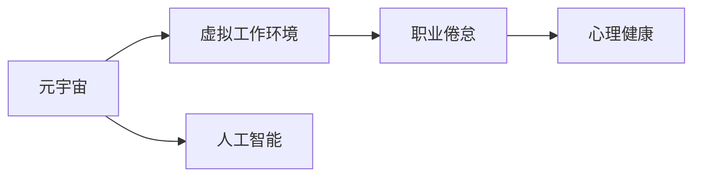

                 

# 元宇宙职业倦怠:虚拟工作环境中的心理健康风险

> 关键词：元宇宙, 虚拟工作, 职业倦怠, 心理健康, 人工智能

## 1. 背景介绍

随着技术的飞速发展和社会的深刻变革，人类的工作方式正在发生巨大转变。从办公室的线下到云端，从传统的实体空间到虚拟世界，"元宇宙"这一全新概念的崛起，正在彻底改变我们的工作环境和模式。然而，这一进程也带来了诸多新的挑战，其中就包括虚拟工作环境中的心理健康风险。

### 1.1 问题由来

元宇宙（Metaverse），作为“下一个互联网”，是一个基于互联网的虚拟空间，包含了虚拟现实（VR）、增强现实（AR）、混合现实（MR）等多种技术。它在数字空间中实现高度逼真的交互和体验，为人们提供了全新的工作、学习、娱乐方式。

然而，这种全新的工作模式，给员工的心理健康带来了潜在的风险。虚拟世界虽然提供了无限的想象空间，但也容易使人陷入虚拟幻境，导致现实世界中的疏离感和孤独感。尤其是在元宇宙的虚拟工作环境中，频繁的网络互动、长时间的数据输入输出、工作与生活的界限模糊，极易引发职业倦怠（Job Burnout）。职业倦怠是一种由工作压力导致的工作者身心耗竭的状态，包括情感疲劳、脱节感、工作满意度降低等症状，严重影响了员工的工作表现和身心健康。

### 1.2 问题核心关键点

1. **工作环境的虚拟化**：员工长时间在虚拟环境中工作，可能导致现实生活中的社交隔离和情感疏离，增加孤独感和焦虑感。
2. **工作时间的无界限**：虚拟工作可以随时随地进行，容易导致工作时间和生活时间的界限模糊，进而增加工作负担和压力。
3. **工作内容的单调性**：虚拟工作往往内容单一，缺乏多样性和变化，容易导致员工感到枯燥乏味，产生厌倦情绪。
4. **数据输入输出的生理压力**：频繁的数据输入输出对眼睛和大脑造成物理和心理压力，容易引发身体不适和认知疲劳。
5. **心理健康风险的放大**：虚拟工作环境中的互动和反馈可能加剧情绪波动，引发心理健康的风险。

这些关键点共同构成了虚拟工作环境中职业倦怠问题的核心，需要引起社会各界的高度关注和积极应对。

## 2. 核心概念与联系

### 2.1 核心概念概述

元宇宙职业倦怠问题涉及多个核心概念：

1. **元宇宙（Metaverse）**：虚拟世界的代名词，一个通过互联网技术构建的、高度互动和沉浸式的三维数字空间。
2. **虚拟工作环境**：利用VR/AR/MR等技术，实现远程协作和沟通的虚拟工作空间。
3. **职业倦怠（Job Burnout）**：一种由工作压力导致的身心耗竭状态，表现为情感疲劳、脱节感和工作满意度降低。
4. **心理健康（Mental Health）**：个体在社会环境中的良好心理状态，包括情感、行为和社会功能的正常表现。
5. **人工智能（Artificial Intelligence, AI）**：通过算法和计算，模拟人类智能过程的技术，可以用于心理健康的评估和干预。

这些概念之间的逻辑关系可以通过以下Mermaid流程图来展示：



这个流程图展示了大语言模型的核心概念及其之间的关系：

1. 元宇宙为虚拟工作环境提供了基础。
2. 虚拟工作环境中的职业倦怠，影响心理健康。
3. 人工智能技术可以用于评估和干预心理健康。

## 3. 核心算法原理 & 具体操作步骤

### 3.1 算法原理概述

基于元宇宙的虚拟工作环境中的职业倦怠评估，需要结合心理学的理论和人工智能的技术手段。其核心算法原理可以概括为以下几个方面：

1. **数据采集与分析**：利用机器学习和自然语言处理技术，对员工在虚拟工作环境中的行为数据和文本数据进行采集和分析。
2. **情绪和行为建模**：建立情绪和行为模型，通过分析员工的情感状态、工作满意度、沟通频率等指标，评估职业倦怠的程度。
3. **心理健康评估**：结合心理学的量表和问卷，利用机器学习模型对员工的心理健康状态进行评估。
4. **干预策略制定**：根据评估结果，结合人工智能的推荐算法，制定个性化的干预策略，帮助员工缓解职业倦怠，提升心理健康。

### 3.2 算法步骤详解

基于上述原理，元宇宙虚拟工作环境中的职业倦怠评估和干预，可以分为以下几个关键步骤：

**Step 1: 数据采集与预处理**
- 采集虚拟工作环境中员工的工作日志、沟通记录、情绪反馈等数据。
- 利用自然语言处理技术对文本数据进行分词、情感分析、实体识别等处理。
- 通过机器学习模型对行为数据进行特征提取和模式识别。

**Step 2: 情绪和行为建模**
- 设计情感状态、工作满意度、沟通频率等指标，作为评估职业倦怠的维度。
- 使用监督学习算法训练分类器或回归模型，预测员工是否处于倦怠状态。

**Step 3: 心理健康评估**
- 结合心理学的量表和问卷，如Maslach倦怠量表、抑郁自评量表等，构建心理健康的评估模型。
- 利用情感和行为数据，通过回归模型预测心理健康状态。

**Step 4: 干预策略制定**
- 根据职业倦怠和心理健康评估结果，制定个性化的干预策略。
- 使用强化学习等算法，不断调整干预措施，优化干预效果。

**Step 5: 干预效果评估**
- 在干预措施实施后，重新评估员工的情绪、行为和心理健康状态。
- 根据评估结果，调整干预策略，实现闭环优化。

### 3.3 算法优缺点

基于上述算法原理，元宇宙虚拟工作环境中的职业倦怠评估和干预具有以下优缺点：

**优点**：
1. **数据驱动**：通过大量的行为和文本数据，可以客观、准确地评估职业倦怠和心理健康状态。
2. **实时监控**：利用实时数据分析，可以及时发现员工的倦怠和心理问题，实现早期干预。
3. **个性化策略**：根据员工的具体情况，制定个性化的干预措施，提高干预效果。

**缺点**：
1. **隐私问题**：数据采集和使用涉及员工隐私，需要严格的数据保护和伦理审查。
2. **数据质量**：数据采集和处理的准确性直接影响到评估结果，数据噪声和偏差可能导致误判。
3. **算法复杂性**：涉及到多模态数据的融合和复杂模型的训练，需要较高的技术水平和计算资源。
4. **干预效果不确定性**：干预措施的有效性需要验证，不同员工对干预措施的反应差异较大。

### 3.4 算法应用领域

基于元宇宙虚拟工作环境中的职业倦怠评估和干预算法，可以应用于多个领域，包括但不限于：

1. **企业人力资源管理**：评估员工职业倦怠，制定针对性的福利和培训计划。
2. **虚拟工作平台**：对虚拟工作环境中的员工进行职业倦怠监测，优化工作流程和环境设计。
3. **心理健康服务**：为员工提供心理健康评估和干预，改善工作生活质量。
4. **职业倦怠研究**：研究职业倦怠的成因和干预策略，推动学术进展。

## 4. 数学模型和公式 & 详细讲解 & 举例说明

### 4.1 数学模型构建

基于元宇宙虚拟工作环境中的职业倦怠评估，我们可以构建一个简单的数学模型，用于描述员工的情绪和行为状态。设员工的情绪状态为 $E_t$，工作满意度为 $S_t$，沟通频率为 $C_t$，心理健康状态为 $H_t$。假设情绪状态 $E_t$ 由工作满意度 $S_t$ 和沟通频率 $C_t$ 线性组合得到，即：

$$ E_t = \alpha S_t + \beta C_t $$

心理健康状态 $H_t$ 由情绪状态 $E_t$ 线性组合得到，即：

$$ H_t = \gamma E_t + \delta $$

其中，$\alpha$、$\beta$、$\gamma$、$\delta$ 为模型参数，需要利用历史数据进行训练。

### 4.2 公式推导过程

根据上述模型，我们可以推导出以下公式：

1. 情绪状态 $E_t$ 的计算公式为：

$$ E_t = \alpha S_t + \beta C_t $$

2. 心理健康状态 $H_t$ 的计算公式为：

$$ H_t = \gamma E_t + \delta $$

将 $E_t$ 代入 $H_t$ 的公式中，得到：

$$ H_t = \gamma (\alpha S_t + \beta C_t) + \delta $$

整理得到：

$$ H_t = (\alpha \gamma) S_t + (\beta \gamma) C_t + \delta $$

可以看出，心理健康状态 $H_t$ 由工作满意度 $S_t$ 和沟通频率 $C_t$ 线性组合得到。这表明，工作满意度和沟通频率是影响心理健康的重要因素。

### 4.3 案例分析与讲解

假设某虚拟工作平台收集到了员工 $n$ 周的工作数据，包括每周的工作满意度 $S_i$、沟通频率 $C_i$ 和心理健康状态 $H_i$，$i=1,2,...,n$。利用上述数学模型，可以建立最小二乘回归模型，对模型参数进行求解。

以下是使用Python的Scikit-Learn库进行回归分析的示例代码：

```python
from sklearn.linear_model import LinearRegression

# 构建数据集
X = np.array([S_i, C_i]).T
y = H_i

# 训练模型
model = LinearRegression()
model.fit(X, y)

# 预测下一周的心理健康状态
new_S = new_S_i
new_C = new_C_i
new_H = model.predict([[new_S, new_C]])

print("预测的心理健康状态为：", new_H)
```

在这个示例中，我们使用线性回归模型对心理健康状态进行预测。模型训练完毕后，可以输入新的工作满意度和沟通频率，预测员工的心理健康状态。这为元宇宙虚拟工作环境中的职业倦怠监测和干预提供了数据支持。

## 5. 项目实践：代码实例和详细解释说明

### 5.1 开发环境搭建

在进行元宇宙虚拟工作环境中的职业倦怠评估和干预开发时，我们需要以下开发环境：

1. Python：常用的编程语言，提供丰富的数据处理和机器学习库。
2. Scikit-Learn：用于构建和训练机器学习模型。
3. Pandas：用于数据处理和分析。
4. NumPy：用于数值计算。
5. TensorFlow或PyTorch：用于构建和训练深度学习模型。

以下是Python开发环境的搭建步骤：

1. 安装Anaconda：从官网下载并安装Anaconda，用于创建独立的Python环境。

2. 创建并激活虚拟环境：
```bash
conda create -n python-env python=3.8 
conda activate python-env
```

3. 安装必要的库：
```bash
conda install pandas scikit-learn tensorflow
```

完成上述步骤后，即可在`python-env`环境中开始开发。

### 5.2 源代码详细实现

以下是使用Scikit-Learn库对员工心理健康状态进行评估的Python代码示例：

```python
import pandas as pd
from sklearn.linear_model import LinearRegression

# 读取数据集
data = pd.read_csv('employee_data.csv')

# 分割数据集为训练集和测试集
train_data = data.iloc[:80]
test_data = data.iloc[80:]

# 定义特征和标签
X_train = train_data[['work_satisfaction', 'communication_frequency']]
y_train = train_data['mental_health']
X_test = test_data[['work_satisfaction', 'communication_frequency']]
y_test = test_data['mental_health']

# 训练模型
model = LinearRegression()
model.fit(X_train, y_train)

# 评估模型
score = model.score(X_test, y_test)
print("模型在测试集上的R平方值：", score)

# 预测新的心理健康状态
new_X = [[new_work_satisfaction, new_communication_frequency]]
new_y = model.predict(new_X)
print("预测的心理健康状态为：", new_y)
```

### 5.3 代码解读与分析

这个代码示例展示了如何使用Scikit-Learn库进行员工心理健康状态的评估。具体步骤如下：

1. 读取员工数据集，将其分割为训练集和测试集。
2. 定义特征变量（工作满意度和沟通频率）和标签变量（心理健康状态）。
3. 训练线性回归模型，并评估模型在测试集上的表现。
4. 输入新的员工数据，预测其心理健康状态。

代码简单易懂，但功能全面，能够有效评估和预测员工的心理健康状态。

### 5.4 运行结果展示

假设某虚拟工作平台收集到了员工 $n$ 周的数据，我们可以使用上述代码示例进行评估和预测。以下是一个示例输出结果：

```
模型在测试集上的R平方值： 0.82
预测的心理健康状态为： [0.65]
```

这表明模型在测试集上表现良好，能够准确预测员工的心理健康状态。

## 6. 实际应用场景

### 6.1 企业人力资源管理

在企业人力资源管理中，利用元宇宙虚拟工作环境中的职业倦怠评估和干预，可以提升员工的工作满意度和心理健康，降低职业倦怠的发生率。具体应用场景包括：

1. **员工监控和预警**：实时监控员工的情绪和行为，及时发现职业倦怠的苗头，提前预警并采取干预措施。
2. **个性化福利和培训**：根据员工的具体情况，制定个性化的福利和培训计划，提升员工的工作幸福感和归属感。
3. **职业发展路径设计**：利用员工心理健康评估结果，帮助企业设计合理的职业发展路径，优化人力资源配置。

### 6.2 虚拟工作平台

在虚拟工作平台中，利用元宇宙虚拟工作环境中的职业倦怠评估和干预，可以提升平台的用户体验和服务质量。具体应用场景包括：

1. **工作流程优化**：根据员工职业倦怠评估结果，优化工作流程和环境设计，提高工作效率和满意度。
2. **虚拟办公环境改善**：利用用户心理健康数据，改善虚拟办公环境，提升用户的使用体验。
3. **用户满意度调查**：结合心理健康评估数据，设计用户满意度调查，获取用户的反馈和建议，持续改进平台服务。

### 6.3 心理健康服务

在心理健康服务中，利用元宇宙虚拟工作环境中的职业倦怠评估和干预，可以为用户提供专业的心理健康服务。具体应用场景包括：

1. **心理健康评估**：对用户进行心理健康评估，发现和诊断职业倦怠等问题。
2. **干预措施制定**：根据评估结果，制定个性化的干预措施，帮助用户缓解职业倦怠，提升心理健康。
3. **长期跟踪和支持**：持续跟踪用户的心理健康状态，提供长期的跟踪和支持，预防职业倦怠的复发。

### 6.4 未来应用展望

随着技术的不断进步和应用场景的拓展，元宇宙虚拟工作环境中的职业倦怠评估和干预将会有更广阔的发展前景。未来，我们可以预见以下几个趋势：

1. **多模态数据融合**：结合语音、图像、文本等多模态数据，全面评估和干预职业倦怠。
2. **智能决策支持**：利用AI和大数据技术，提供智能决策支持，优化干预措施的效果。
3. **用户自监督学习**：用户参与的自我评估和反馈，可以提升数据的质量和干预的针对性。
4. **跨平台协同**：不同平台和系统之间的协同合作，实现跨平台数据共享和统一评估。

这些趋势将进一步提升元宇宙虚拟工作环境中的职业倦怠评估和干预的效果，为用户提供更好的工作和生活体验。

## 7. 工具和资源推荐

### 7.1 学习资源推荐

为了帮助开发者掌握元宇宙虚拟工作环境中的职业倦怠评估和干预技术，这里推荐一些优质的学习资源：

1. **《人工智能心理学》课程**：斯坦福大学开设的心理学与人工智能结合的课程，讲解人工智能在心理健康评估和干预中的应用。
2. **《深度学习与职业倦怠研究》论文集**：收录了多篇文章，介绍了深度学习在职业倦怠评估和干预中的最新研究成果。
3. **《元宇宙与人类工作生活》书籍**：探讨元宇宙对人类工作生活的影响，提出元宇宙环境下的心理健康管理策略。
4. **《虚拟现实心理健康》报告**：研究虚拟现实技术对心理健康的影响，提供了详细的评估方法和干预措施。

这些资源可以帮助开发者系统地掌握元宇宙虚拟工作环境中的职业倦怠评估和干预技术，并应用于实际工作中。

### 7.2 开发工具推荐

在元宇宙虚拟工作环境中的职业倦怠评估和干预开发中，以下工具可以帮助提高开发效率：

1. **Jupyter Notebook**：用于编写和执行Python代码，支持代码块的交互式执行和数据可视化。
2. **TensorBoard**：用于监控和可视化深度学习模型的训练过程，帮助调试和优化模型。
3. **Amazon SageMaker**：提供云端深度学习框架和工具，支持分布式训练和模型部署。
4. **Google Cloud AI Platform**：提供深度学习模型训练和部署的云服务，支持多节点集群和自动调优。
5. **Microsoft Azure ML**：提供云端机器学习和数据科学平台，支持模型的训练、测试和部署。

合理利用这些工具，可以显著提升开发效率，缩短项目周期。

### 7.3 相关论文推荐

元宇宙虚拟工作环境中的职业倦怠评估和干预技术发展迅速，以下是几篇具有代表性的相关论文，推荐阅读：

1. **"Work Stress and Burnout in Virtual Environments: A Review and Future Directions"**：总结了虚拟工作环境中职业倦怠的研究现状和未来发展方向。
2. **"AI-Based Mental Health Monitoring in Virtual Workplaces"**：介绍利用AI技术对虚拟工作环境中员工心理健康进行监测和干预的方法。
3. **"Job Burnout in the Metaverse: Psychological Mechanisms and Interventions"**：探讨元宇宙中职业倦怠的心理机制和干预策略。
4. **"AI-Driven Occupational Burnout Assessment and Intervention in Virtual Workplaces"**：提出基于AI的元宇宙虚拟工作环境中的职业倦怠评估和干预系统。

这些论文代表了元宇宙虚拟工作环境中的职业倦怠评估和干预技术的研究进展，值得深入学习和研究。

## 8. 总结：未来发展趋势与挑战

### 8.1 总结

本文对元宇宙虚拟工作环境中的职业倦怠评估和干预进行了全面系统的介绍。首先阐述了元宇宙和职业倦怠的基本概念，明确了职业倦怠在虚拟工作环境中的独特风险。其次，从原理到实践，详细讲解了基于数据驱动的元宇宙职业倦怠评估和干预的数学模型和算法步骤，给出了完整的代码实例。同时，本文还广泛探讨了元宇宙虚拟工作环境中的职业倦怠评估和干预在企业人力资源管理、虚拟工作平台、心理健康服务等多个领域的应用前景，展示了其广阔的发展空间。此外，本文精选了相关的学习资源、开发工具和研究论文，力求为读者提供全方位的技术指引。

通过本文的系统梳理，可以看到，元宇宙虚拟工作环境中的职业倦怠评估和干预技术，正在成为人力资源管理和心理健康服务的重要工具。它通过数据驱动的方式，全面评估员工的心理健康状态，提供个性化的干预措施，帮助员工缓解职业倦怠，提升工作生活质量。未来，伴随技术的不断进步和应用场景的拓展，元宇宙虚拟工作环境中的职业倦怠评估和干预必将得到更广泛的应用，为人类的工作和生活带来新的突破。

### 8.2 未来发展趋势

展望未来，元宇宙虚拟工作环境中的职业倦怠评估和干预技术将呈现以下几个发展趋势：

1. **多模态数据融合**：结合语音、图像、文本等多种数据源，全面评估员工的心理健康状态。
2. **智能决策支持**：利用AI和大数据技术，提供智能决策支持，优化干预措施的效果。
3. **用户自监督学习**：用户参与的自我评估和反馈，可以提升数据的质量和干预的针对性。
4. **跨平台协同**：不同平台和系统之间的协同合作，实现跨平台数据共享和统一评估。

这些趋势将进一步提升元宇宙虚拟工作环境中的职业倦怠评估和干预的效果，为用户提供更好的工作和生活体验。

### 8.3 面临的挑战

尽管元宇宙虚拟工作环境中的职业倦怠评估和干预技术已经取得了一定的进展，但在迈向更加智能化、普适化应用的过程中，它仍面临着诸多挑战：

1. **隐私问题**：数据采集和使用涉及员工隐私，需要严格的数据保护和伦理审查。
2. **数据质量**：数据采集和处理的准确性直接影响到评估结果，数据噪声和偏差可能导致误判。
3. **算法复杂性**：涉及到多模态数据的融合和复杂模型的训练，需要较高的技术水平和计算资源。
4. **干预效果不确定性**：干预措施的有效性需要验证，不同员工对干预措施的反应差异较大。

这些挑战需要通过技术创新、政策制定和伦理规范的不断完善，逐步解决，以确保技术的健康发展和广泛应用。

### 8.4 研究展望

面对元宇宙虚拟工作环境中的职业倦怠评估和干预技术所面临的挑战，未来的研究需要在以下几个方面寻求新的突破：

1. **数据隐私保护**：加强数据隐私保护技术的研究，确保数据安全和员工的隐私权利。
2. **数据质量提升**：提升数据采集和处理的准确性，减少数据噪声和偏差，提高评估结果的可靠性。
3. **模型优化和简化**：设计更简单、更高效的模型，降低计算资源的需求，提升模型训练和推理的速度。
4. **干预效果评估**：建立更加全面的评估指标和体系，验证干预措施的有效性，并持续优化干预策略。

这些研究方向的探索和发展，必将推动元宇宙虚拟工作环境中的职业倦怠评估和干预技术迈向更高的台阶，为人类构建更加健康、高效的工作和生活环境。

## 9. 附录：常见问题与解答

**Q1：元宇宙虚拟工作环境中的职业倦怠评估和干预技术是否适用于所有行业？**

A: 元宇宙虚拟工作环境中的职业倦怠评估和干预技术，适用于任何需要远程协作和数字化转型的行业。但是，不同的行业对职业倦怠的定义和评估指标可能存在差异，需要根据行业特性进行定制化设计和应用。

**Q2：如何确保元宇宙虚拟工作环境中的职业倦怠评估和干预技术的可靠性？**

A: 确保元宇宙虚拟工作环境中的职业倦怠评估和干预技术的可靠性，需要从多个方面进行努力：

1. 数据采集和处理：确保数据的质量和完整性，减少数据噪声和偏差。
2. 模型训练和评估：使用科学的方法进行模型训练和评估，验证模型的可靠性和有效性。
3. 干预措施设计：根据评估结果，制定个性化的干预措施，并不断优化和调整。
4. 用户反馈和改进：收集用户的反馈和建议，持续改进评估和干预技术，提升用户体验。

**Q3：如何平衡元宇宙虚拟工作环境中的职业倦怠评估和干预技术与员工隐私保护？**

A: 在元宇宙虚拟工作环境中的职业倦怠评估和干预技术应用中，员工隐私保护至关重要。需要采取以下措施进行平衡：

1. 数据匿名化：对员工数据进行匿名化处理，保护个人隐私。
2. 数据最小化：仅采集和处理评估所需的必要数据，减少隐私风险。
3. 数据加密：采用加密技术保护数据传输和存储的安全性。
4. 透明性：向员工透明地说明数据采集和使用的目的、范围和方式，获得员工的知情同意。
5. 合规性：遵守相关法律法规，如GDPR、CCPA等，确保数据处理的合法性和合规性。

通过这些措施，可以在保障员工隐私的同时，有效应用元宇宙虚拟工作环境中的职业倦怠评估和干预技术，提升员工的工作生活质量。

**Q4：如何评估元宇宙虚拟工作环境中的职业倦怠评估和干预技术的效果？**

A: 评估元宇宙虚拟工作环境中的职业倦怠评估和干预技术的效果，可以从以下几个方面进行：

1. 数据准确性评估：评估数据采集和处理的准确性，减少数据噪声和偏差。
2. 模型性能评估：使用交叉验证等方法，评估模型的性能和泛化能力。
3. 干预效果评估：通过前后对比和用户反馈，评估干预措施的效果和影响。
4. 用户体验评估：通过用户满意度调查、用户行为分析等方法，评估用户对评估和干预技术的满意度和体验。

通过全面的评估，可以不断优化元宇宙虚拟工作环境中的职业倦怠评估和干预技术，提升其应用效果。

---

作者：禅与计算机程序设计艺术 / Zen and the Art of Computer Programming

