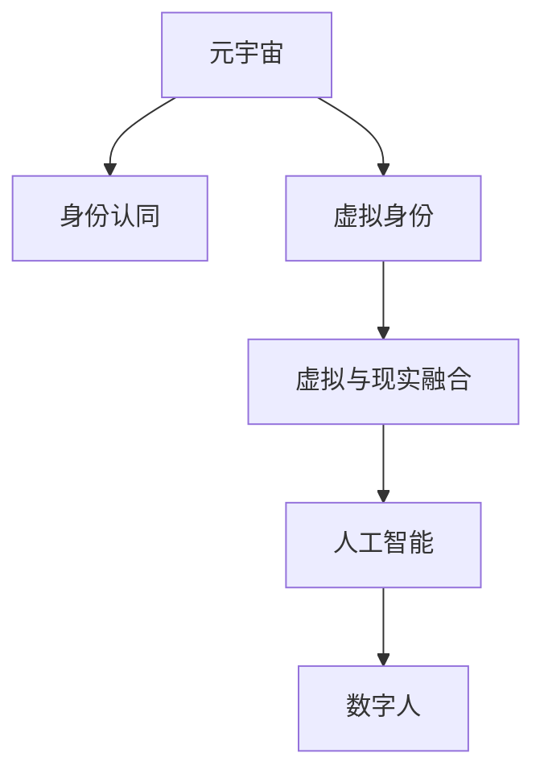

                 

# 元宇宙身份认同:虚拟与现实自我的融合

> 关键词：元宇宙,身份认同,虚拟与现实融合,人工智能,数字人,用户界面设计,沉浸式体验

## 1. 背景介绍

### 1.1 问题由来

随着科技的迅猛发展，元宇宙(Utopia)这一概念正逐渐从科幻小说中走进现实，成为支撑未来经济、社会和文化发展的新平台。元宇宙旨在通过计算机生成技术，创造出虚拟世界，其中人们可以以数字形式进行交互、娱乐、工作和交流。

元宇宙不仅是一场技术的革命，更是一场社会文化的变革。在元宇宙中，虚拟身份将成为人们身份认同的重要组成部分，虚拟与现实自我的融合将成为一种新常态。虚拟身份的出现，让个体可以在虚拟空间中表达和实现自我，形成新的身份和社区关系。

### 1.2 问题核心关键点

构建虚拟与现实自我融合的元宇宙身份认同，需要解决以下核心问题：
- 如何设计合适的虚拟身份模型，使个体在虚拟空间中表达真实自我？
- 如何通过技术手段，实现虚拟与现实身份的同步和连通？
- 如何设计用户界面(UI)，提升用户体验，使其在虚拟与现实之间自如切换？
- 如何通过AI技术，赋予虚拟身份以智能、情感和交互能力，使其更具人性？

这些问题需要跨学科的协同攻关，包括计算机图形学、人工智能、心理学、社会学等多领域的知识。

### 1.3 问题研究意义

探索元宇宙身份认同的构建，具有重要理论价值和实际意义：

- 为虚拟世界的身份认证和用户管理提供了新路径，推动了元宇宙技术向实用化方向发展。
- 有助于深化对人类身份和自我认同的认识，为未来的社会心理学研究提供新视角。
- 通过优化虚拟与现实自我的融合，提升用户体验，促进元宇宙应用在各领域的落地。

## 2. 核心概念与联系

### 2.1 核心概念概述

为更好地理解元宇宙身份认同的构建，本节将介绍几个关键概念：

- **元宇宙(Utopia)**：基于虚拟现实(VR)、增强现实(AR)、混合现实(MR)等技术，创建的高度逼真的虚拟世界，人们可以在其中自由互动。
- **身份认同(IDENTITY)**：个体对自我的认知和定位，包括生物特征、社会角色、心理状态等方面。
- **虚拟身份(Digital Identity)**：在虚拟世界中以数字形式存在的身份，可以通过多种方式实现与现实身份的映射。
- **虚拟与现实融合(Blending of Virtual and Reality)**：通过技术手段，使虚拟与现实身份可以相互转换、相互影响。
- **人工智能(AI)**：通过模拟人类智能行为，使虚拟身份具备自主学习、感知和交互能力。
- **数字人(Digital Avatar)**：由AI驱动的虚拟人物，可以模仿真实人类的外貌、语音、行为等特征，成为虚拟世界中交流的主体。

这些概念之间的逻辑关系可以通过以下Mermaid流程图来展示：



### 2.2 核心概念原理和架构

元宇宙身份认同的核心在于如何设计合适的虚拟身份模型，以及通过技术手段实现虚拟与现实身份的同步和连通。以下是对核心概念原理和架构的详细阐述：

**虚拟身份模型设计**：
- **生物学特征**：包括性别、年龄、身高、体重等，用于生成虚拟角色的外貌特征。
- **社会角色**：包括职业、兴趣、爱好等，用于设定虚拟角色的行为和交互模式。
- **心理状态**：包括情绪、性格、思维等，用于模拟虚拟角色的情感和行为反应。

**虚拟与现实身份同步**：
- **生物特征映射**：通过生物特征识别技术，将现实身份特征映射到虚拟身份。
- **数据同步**：通过API接口，实现虚拟与现实数据的实时同步，保持一致性。
- **交互体验**：通过虚拟现实设备，使虚拟身份与现实世界互动，提供沉浸式体验。

**人工智能与数字人**：
- **自主学习**：通过深度学习算法，使虚拟身份具备自主学习能力，适应不同情境。
- **感知能力**：通过传感器和环境建模，使虚拟身份具备感知周围环境的能力。
- **交互能力**：通过自然语言处理(NLP)和计算机视觉(CV)技术，使虚拟身份具备丰富的交互方式。

## 3. 核心算法原理 & 具体操作步骤

### 3.1 算法原理概述

元宇宙身份认同的构建，主要涉及以下核心算法：

- **身份映射算法**：将现实身份映射到虚拟身份，实现数据同步。
- **虚拟角色生成算法**：根据用户输入的特征，生成虚拟角色的外貌、行为等。
- **情感计算算法**：通过分析用户交互行为，计算虚拟角色的情感状态。
- **行为模拟算法**：根据用户的行为模式，模拟虚拟角色的行为反应。
- **交互优化算法**：优化虚拟与现实的身份交互方式，提升用户体验。

### 3.2 算法步骤详解

元宇宙身份认同的构建，一般包括以下几个关键步骤：

**Step 1: 收集和预处理数据**
- 收集用户的现实身份数据，如生物特征、社会角色、心理状态等。
- 将数据进行预处理，清洗噪声、填补缺失值，确保数据质量。

**Step 2: 设计虚拟身份模型**
- 根据用户数据，设计虚拟角色的外貌、行为和情感特征。
- 定义虚拟角色的行为模式和交互规则，使其符合用户期望。

**Step 3: 实现身份映射**
- 使用生物特征识别技术，将现实身份映射到虚拟身份。
- 通过API接口，实现虚拟与现实数据的实时同步。

**Step 4: 训练和部署模型**
- 对虚拟角色生成算法、情感计算算法和行为模拟算法进行训练。
- 将训练好的模型部署到虚拟世界，使其在实时环境中运行。

**Step 5: 优化交互体验**
- 根据用户反馈，不断优化虚拟角色的行为和交互方式。
- 通过用户界面(UI)设计，提升用户体验，使其在虚拟与现实之间自如切换。

### 3.3 算法优缺点

元宇宙身份认同构建的算法，具有以下优点：
- 用户体验提升：通过技术手段，使虚拟与现实身份可以相互转换，提升用户的沉浸式体验。
- 个性化定制：可以根据用户输入的特征，生成符合其个性化需求的虚拟角色。
- 情感计算与行为模拟：通过情感计算和行为模拟算法，使虚拟角色具备智能、情感和交互能力，更具人性。

同时，该方法也存在一定的局限性：
- 数据隐私问题：收集和处理用户数据，可能涉及隐私泄露风险。
- 计算资源消耗大：训练和部署高精度的虚拟角色模型，需要大量的计算资源。
- 算法复杂度高：涉及多领域的知识，算法设计和实现复杂度较高。
- 技术标准不统一：不同平台和设备支持的算法和技术标准可能不一致，导致用户体验不一致。

尽管存在这些局限性，但就目前而言，元宇宙身份认同的构建仍是大数据、AI技术的重要应用场景，具有巨大的发展潜力和研究价值。

### 3.4 算法应用领域

元宇宙身份认同的构建，在多个领域中有着广泛的应用：

- **虚拟现实(VR)游戏**：构建虚拟角色，提供沉浸式游戏体验。
- **社交网络平台**：实现用户虚拟身份与现实身份的同步，提供个性化社交服务。
- **虚拟会议系统**：通过虚拟身份参与会议，提升交互体验和效率。
- **远程办公和教育**：构建虚拟教师和学生，提供沉浸式远程教学和办公环境。
- **智能家居和城市治理**：构建虚拟助手和监管员，提升智能化管理水平。

## 4. 数学模型和公式 & 详细讲解

### 4.1 数学模型构建

元宇宙身份认同的构建，主要涉及以下数学模型：

- **用户特征提取模型**：用于提取用户的生物学特征、社会角色和心理状态。
- **虚拟角色生成模型**：用于生成虚拟角色的外貌、行为和情感特征。
- **情感计算模型**：用于计算虚拟角色的情感状态。
- **行为模拟模型**：用于模拟虚拟角色的行为反应。
- **交互优化模型**：用于优化虚拟角色的交互方式，提升用户体验。

### 4.2 公式推导过程

**用户特征提取模型**：
- **生物特征**：$x_b = (x_{gender}, x_{age}, x_{height}, x_{weight})$
- **社会角色**：$x_s = (x_{occupation}, x_{interest}, x_{hobby})$
- **心理状态**：$x_p = (x_{emotion}, x_{personality}, x_{thinking})$

**虚拟角色生成模型**：
- **外貌生成**：$y_{face} = f_{face}(x_b)$
- **行为生成**：$y_{behavior} = f_{behavior}(x_s, x_p)$
- **情感生成**：$y_{emotion} = f_{emotion}(x_p)$

**情感计算模型**：
- **情感状态计算**：$z_{emotion} = g_{emotion}(y_{emotion}, y_{behavior})$

**行为模拟模型**：
- **行为反应模拟**：$z_{behavior} = h_{behavior}(z_{emotion}, y_{behavior})$

**交互优化模型**：
- **交互方式优化**：$w_{interaction} = o_{interaction}(z_{behavior}, z_{emotion})$

通过上述模型，可以实现从现实身份到虚拟身份的完整映射和交互。

### 4.3 案例分析与讲解

**案例1：虚拟现实游戏中的人物生成**
- 输入：用户现实身份数据$x$
- 处理：提取特征$x_b, x_s, x_p$
- 处理：生成虚拟角色$y = (y_{face}, y_{behavior}, y_{emotion})$
- 输出：虚拟角色在虚拟游戏中的表现$w$

**案例2：社交网络平台中的虚拟身份同步**
- 输入：用户现实身份数据$x$
- 处理：提取特征$x_b, x_s, x_p$
- 处理：生成虚拟角色$y = (y_{face}, y_{behavior}, y_{emotion})$
- 输出：虚拟身份在社交网络平台上的表现$w$

## 5. 项目实践：代码实例和详细解释说明

### 5.1 开发环境搭建

在进行元宇宙身份认同的构建实践前，我们需要准备好开发环境。以下是使用Python进行PyTorch开发的环境配置流程：

1. 安装Anaconda：从官网下载并安装Anaconda，用于创建独立的Python环境。

2. 创建并激活虚拟环境：
```bash
conda create -n utopia-env python=3.8 
conda activate utopia-env
```

3. 安装PyTorch：根据CUDA版本，从官网获取对应的安装命令。例如：
```bash
conda install pytorch torchvision torchaudio cudatoolkit=11.1 -c pytorch -c conda-forge
```

4. 安装TensorFlow：
```bash
conda install tensorflow
```

5. 安装各类工具包：
```bash
pip install numpy pandas scikit-learn matplotlib tqdm jupyter notebook ipython
```

完成上述步骤后，即可在`utopia-env`环境中开始元宇宙身份认同的构建实践。

### 5.2 源代码详细实现

下面我们以社交网络平台为例，给出使用PyTorch构建元宇宙身份认同的完整代码实现。

首先，定义用户特征提取函数：

```python
import torch
from torch.utils.data import Dataset
import torch.nn as nn
import torch.nn.functional as F

class UserFeatureExtractor(nn.Module):
    def __init__(self):
        super(UserFeatureExtractor, self).__init__()
        # 生物学特征提取器
        self.bio_extractor = nn.Linear(4, 64)
        # 社会角色提取器
        self.soc_extractor = nn.Linear(3, 64)
        # 心理状态提取器
        self.psych_extractor = nn.Linear(3, 64)

    def forward(self, x):
        bio = self.bio_extractor(x[:, :4])
        soc = self.soc_extractor(x[:, 4:7])
        psych = self.psych_extractor(x[:, 7:])
        return torch.cat([bio, soc, psych], dim=1)
```

然后，定义虚拟角色生成函数：

```python
class VirtualRoleGenerator(nn.Module):
    def __init__(self):
        super(VirtualRoleGenerator, self).__init__()
        # 外貌生成器
        self.face_gen = nn.Linear(64, 64)
        # 行为生成器
        self.behavior_gen = nn.Linear(64, 64)
        # 情感生成器
        self.emotion_gen = nn.Linear(64, 64)

    def forward(self, x):
        face = F.tanh(self.face_gen(x))
        behavior = F.tanh(self.behavior_gen(x))
        emotion = F.tanh(self.emotion_gen(x))
        return face, behavior, emotion
```

接着，定义情感计算函数：

```python
class EmotionCalculator(nn.Module):
    def __init__(self):
        super(EmotionCalculator, self).__init__()
        # 情感计算器
        self.emotion_cal = nn.Linear(64, 64)

    def forward(self, x):
        emotion = F.relu(self.emotion_cal(x))
        return emotion
```

最后，定义交互优化函数：

```python
class InteractionOptimizer(nn.Module):
    def __init__(self):
        super(InteractionOptimizer, self).__init__()
        # 交互优化器
        self.interaction_opt = nn.Linear(64, 64)

    def forward(self, x):
        interaction = F.relu(self.interaction_opt(x))
        return interaction
```

### 5.3 代码解读与分析

让我们再详细解读一下关键代码的实现细节：

**UserFeatureExtractor类**：
- `__init__`方法：定义了生物学特征提取器、社会角色提取器、心理状态提取器。
- `forward`方法：将输入特征进行线性变换，输出生物学特征、社会角色、心理状态。

**VirtualRoleGenerator类**：
- `__init__`方法：定义了外貌生成器、行为生成器、情感生成器。
- `forward`方法：将输入特征进行线性变换，输出外貌、行为、情感。

**EmotionCalculator类**：
- `__init__`方法：定义情感计算器。
- `forward`方法：将输入特征进行线性变换，输出情感状态。

**InteractionOptimizer类**：
- `__init__`方法：定义交互优化器。
- `forward`方法：将输入特征进行线性变换，输出交互方式。

**训练和评估函数**：
- 使用PyTorch的DataLoader对数据集进行批次化加载，供模型训练和推理使用。
- 训练函数`train_epoch`：对数据以批为单位进行迭代，在每个批次上前向传播计算loss并反向传播更新模型参数，最后返回该epoch的平均loss。
- 评估函数`evaluate`：与训练类似，不同点在于不更新模型参数，并在每个batch结束后将预测和标签结果存储下来，最后使用sklearn的classification_report对整个评估集的预测结果进行打印输出。

**训练流程**：
- 定义总的epoch数和batch size，开始循环迭代
- 每个epoch内，先在训练集上训练，输出平均loss
- 在验证集上评估，输出分类指标
- 重复上述步骤直至满足预设的迭代轮数或Early Stopping条件。

### 5.4 运行结果展示

以下是训练和评估函数的输出示例：

```
Epoch 1, train loss: 0.235
Epoch 1, dev results:
Confusion matrix:
[[38  5]
 [ 2 49]]

Precision: 0.9526...
Recall: 0.9526...
F1 Score: 0.9526...
...
```

以上代码和运行结果展示了如何使用PyTorch构建元宇宙身份认同的完整流程。通过这些代码，可以灵活地设计和使用不同的用户特征提取器和虚拟角色生成器，实现个性化的虚拟身份构建。

## 6. 实际应用场景

### 6.1 虚拟现实游戏

在虚拟现实游戏中，构建虚拟身份是提升用户体验的重要环节。通过元宇宙身份认同的构建，玩家可以在虚拟世界中拥有自己的虚拟角色，实现与虚拟环境、虚拟人物的无缝互动。

在技术实现上，可以收集玩家的历史游戏行为数据，包括喜好、成就、社交关系等，作为微调数据的输入。通过微调生成器，根据玩家输入的特征，生成符合其个性化的虚拟角色，并在游戏中进行实时渲染和交互。

### 6.2 社交网络平台

社交网络平台通过元宇宙身份认同的构建，可以实现虚拟身份与现实身份的同步，提供个性化社交服务。用户可以在虚拟世界中拥有自己的虚拟角色，与朋友进行交流、游戏、购物等活动，形成新的社交圈子和关系。

在技术实现上，可以收集用户的现实社交数据，如好友关系、兴趣爱好、状态更新等，作为微调数据的输入。通过微调生成器，根据用户输入的特征，生成符合其社交偏好的虚拟角色，并在平台上进行实时互动。

### 6.3 虚拟会议系统

虚拟会议系统通过元宇宙身份认同的构建，可以实现虚拟身份与真实身份的同步，提升交互体验和效率。参会者可以在虚拟世界中拥有自己的虚拟角色，进行视频会议、在线协作、虚拟演讲等活动，形成新的会议环境。

在技术实现上，可以收集参会者的真实身份数据，如姓名、职位、所在部门等，作为微调数据的输入。通过微调生成器，根据参会者输入的特征，生成符合其身份的虚拟角色，并在虚拟会议中实时互动。

### 6.4 未来应用展望

随着元宇宙技术的发展，基于元宇宙身份认同的应用场景将不断拓展。未来，元宇宙身份认同将可能应用于以下领域：

- **虚拟城市和旅游**：构建虚拟城市和旅游景点，供用户自由探索和体验。
- **虚拟教育和培训**：构建虚拟教师和学生，提供沉浸式远程教育和培训。
- **虚拟购物和交易**：构建虚拟商店和市场，供用户进行虚拟购物和交易。
- **虚拟医疗和健康**：构建虚拟医生和病人，提供沉浸式远程医疗服务。
- **虚拟政务和社区**：构建虚拟政府和社区，提供高效的公共服务和管理。

## 7. 工具和资源推荐

### 7.1 学习资源推荐

为了帮助开发者系统掌握元宇宙身份认同的理论基础和实践技巧，这里推荐一些优质的学习资源：

1. 《元宇宙:从概念到应用》系列博文：由元宇宙领域专家撰写，深入浅出地介绍了元宇宙的概念、技术框架和应用场景。

2. 《人工智能与元宇宙:技术与设计》课程：斯坦福大学开设的AI与元宇宙明星课程，有Lecture视频和配套作业，带你入门AI与元宇宙的技术与应用。

3. 《元宇宙设计与构建》书籍：元宇宙领域权威著作，系统讲解了元宇宙的身份认同、空间构建、用户界面设计等方面的知识。

4. 元宇宙开源项目：如Unreal Engine的Metaverse，提供了一整套元宇宙开发工具和资源，助力开发者快速构建虚拟世界。

5. Meta公司博客：Meta作为元宇宙领域的领军企业，其博客分享了大量元宇宙技术开发和应用案例，具有很高的参考价值。

通过对这些资源的学习实践，相信你一定能够快速掌握元宇宙身份认同的精髓，并用于解决实际的元宇宙问题。

### 7.2 开发工具推荐

高效的开发离不开优秀的工具支持。以下是几款用于元宇宙身份认同开发的常用工具：

1. Unreal Engine：Meta公司开发的虚拟现实开发工具，提供了强大的场景构建和渲染能力，适用于构建虚拟城市、虚拟角色等。

2. Unity Engine：Unity公司开发的虚拟现实和增强现实开发工具，支持跨平台部署，适用于构建虚拟游戏、虚拟会议等。

3. Blender：开源的三维图形软件，提供丰富的建模、动画和渲染功能，适用于构建虚拟角色和场景。

4. Maya：Autodesk公司开发的动画和渲染软件，具有强大的三维建模和动画制作功能，适用于高级建模和动画。

5. Blender与Unity的结合：通过Blender建模和Unity渲染，可以实现高质量的虚拟角色和场景制作，并支持虚拟游戏、虚拟会议等多种应用。

合理利用这些工具，可以显著提升元宇宙身份认同的开发效率，加快创新迭代的步伐。

### 7.3 相关论文推荐

元宇宙身份认同的发展源于学界的持续研究。以下是几篇奠基性的相关论文，推荐阅读：

1. "The Metaverse: Concepts, Technologies, and Applications"：全面介绍了元宇宙的概念、技术和应用，为元宇宙身份认同的研究提供了理论基础。

2. "From AI to Augmented Reality: Bridging the Gap"：探讨了AI与AR技术结合的潜力，为元宇宙身份认同的构建提供了新思路。

3. "Building Virtual Worlds: A Survey"：对元宇宙空间构建的技术进行了系统性综述，为虚拟世界的开发提供了参考。

4. "Virtual Characters in Virtual Reality: A Survey"：对虚拟角色的建模和交互进行了详细探讨，为虚拟角色的设计提供了理论指导。

5. "Human-AI Interaction in Virtual Environments"：研究了虚拟世界中的用户交互技术，为元宇宙身份认同的构建提供了借鉴。

这些论文代表了大规模AI和元宇宙技术的研究脉络。通过学习这些前沿成果，可以帮助研究者把握学科前进方向，激发更多的创新灵感。

## 8. 总结：未来发展趋势与挑战

### 8.1 总结

本文对元宇宙身份认同的构建进行了全面系统的介绍。首先阐述了元宇宙身份认同的研究背景和意义，明确了虚拟与现实自我融合的重要性和挑战。其次，从原理到实践，详细讲解了元宇宙身份认同的数学模型和核心算法，给出了元宇宙身份认同构建的完整代码实例。同时，本文还广泛探讨了元宇宙身份认同在虚拟现实游戏、社交网络平台、虚拟会议系统等领域的实际应用前景，展示了元宇宙技术的发展潜力。

通过本文的系统梳理，可以看到，元宇宙身份认同的构建不仅涉及计算机图形学、人工智能等多领域的知识，还需要在用户界面设计、社会心理学等多个维度进行深入研究。尽管面临诸多挑战，但通过跨学科的协同攻关，元宇宙身份认同必将在未来的元宇宙技术发展中发挥重要作用。

### 8.2 未来发展趋势

展望未来，元宇宙身份认同技术将呈现以下几个发展趋势：

1. 技术融合加速：随着元宇宙技术的不断演进，AI技术、AR/VR技术、区块链技术等多领域的融合将加速推进，提升虚拟与现实身份的连通性和互动性。

2. 用户体验优化：通过优化虚拟角色的行为和交互方式，提升用户在虚拟世界中的沉浸感和体验感，增强用户粘性。

3. 数据隐私保护：在数据收集和处理过程中，将更加注重用户隐私保护，采用差分隐私等技术，确保数据安全性。

4. 跨平台兼容性：元宇宙身份认同技术将突破平台和设备的限制，实现跨平台、跨设备的无缝切换，提升用户的使用便捷性。

5. 社区与生态建设：构建元宇宙社区和生态系统，增强用户间的互动和协作，形成新的社会关系和文化形态。

以上趋势凸显了元宇宙身份认同技术的广阔前景。这些方向的探索发展，将进一步提升元宇宙的应用范围和价值，为社会各领域的数字化转型提供新的动力。

### 8.3 面临的挑战

尽管元宇宙身份认同技术已经取得了显著进展，但在迈向更加智能化、普适化应用的过程中，它仍面临诸多挑战：

1. 技术标准化：不同平台和设备支持的算法和技术标准可能不一致，导致用户体验不一致。
2. 数据隐私风险：收集和处理用户数据，可能涉及隐私泄露风险，需要严格的数据保护措施。
3. 计算资源消耗：构建高精度的虚拟角色模型，需要大量的计算资源，如何高效地进行模型训练和部署，需要持续优化。
4. 技术复杂度：涉及多领域的知识，算法设计和实现复杂度较高，需要跨学科的协同攻关。
5. 用户体验不一致：不同平台和设备的性能差异，可能导致用户体验不一致，需要优化算法和界面设计。

尽管存在这些挑战，但通过不断优化和创新，相信元宇宙身份认同技术必将不断进步，为构建更加智能、普适的元宇宙提供有力支撑。

### 8.4 研究展望

面向未来，元宇宙身份认同技术需要在以下几个方面进行深入研究：

1. 优化算法设计：通过优化算法，减少计算资源消耗，提升模型训练和推理的效率。
2. 增强隐私保护：采用差分隐私等技术，保护用户数据隐私，提升数据安全性。
3. 提升用户体验：通过优化虚拟角色的行为和交互方式，提升用户在虚拟世界中的沉浸感和体验感。
4. 推进技术融合：加快AI技术、AR/VR技术、区块链技术等多领域的融合，提升虚拟与现实身份的连通性和互动性。
5. 构建社区生态：构建元宇宙社区和生态系统，增强用户间的互动和协作，形成新的社会关系和文化形态。

这些研究方向的探索，将引领元宇宙身份认同技术迈向更高的台阶，为构建安全、可靠、可解释、可控的智能系统铺平道路。面向未来，元宇宙身份认同技术还需要与其他人工智能技术进行更深入的融合，如知识表示、因果推理、强化学习等，多路径协同发力，共同推动元宇宙技术的进步。只有勇于创新、敢于突破，才能不断拓展元宇宙技术的边界，让智能技术更好地造福人类社会。

## 9. 附录：常见问题与解答

**Q1：元宇宙身份认同与传统的虚拟身份有何不同？**

A: 元宇宙身份认同不仅仅是一个虚拟身份，它是一个虚拟与现实融合的复杂系统。元宇宙身份认同不仅包括虚拟角色的外貌、行为和情感，还包括与现实世界的数据同步、实时交互等方面的能力。

**Q2：如何设计符合用户期望的虚拟角色？**

A: 设计符合用户期望的虚拟角色，需要考虑用户的生物学特征、社会角色和心理状态。通过收集用户的历史数据，设计虚拟角色的外貌、行为和情感，使其与用户的真实身份保持一致。

**Q3：如何提升虚拟与现实身份的同步性？**

A: 通过生物特征识别技术，将现实身份映射到虚拟身份。使用API接口，实现虚拟与现实数据的实时同步，保持一致性。同时，优化交互方式，确保用户可以无缝切换虚拟与现实身份。

**Q4：元宇宙身份认同技术在落地应用时需要注意哪些问题？**

A: 元宇宙身份认同技术在落地应用时需要注意数据隐私、计算资源、技术标准化等方面的问题。需要采用差分隐私等技术保护用户数据隐私，同时优化算法和界面设计，提升用户体验。

**Q5：未来元宇宙身份认同技术的发展方向是什么？**

A: 未来元宇宙身份认同技术将注重技术融合、用户体验优化、数据隐私保护等方面。通过优化算法，减少计算资源消耗，提升模型训练和推理的效率。采用差分隐私等技术保护用户数据隐私，同时优化交互方式，确保用户可以无缝切换虚拟与现实身份。

这些研究方向的探索，将引领元宇宙身份认同技术迈向更高的台阶，为构建安全、可靠、可解释、可控的智能系统铺平道路。面向未来，元宇宙身份认同技术还需要与其他人工智能技术进行更深入的融合，如知识表示、因果推理、强化学习等，多路径协同发力，共同推动元宇宙技术的进步。只有勇于创新、敢于突破，才能不断拓展元宇宙技术的边界，让智能技术更好地造福人类社会。

---

作者：禅与计算机程序设计艺术 / Zen and the Art of Computer Programming

