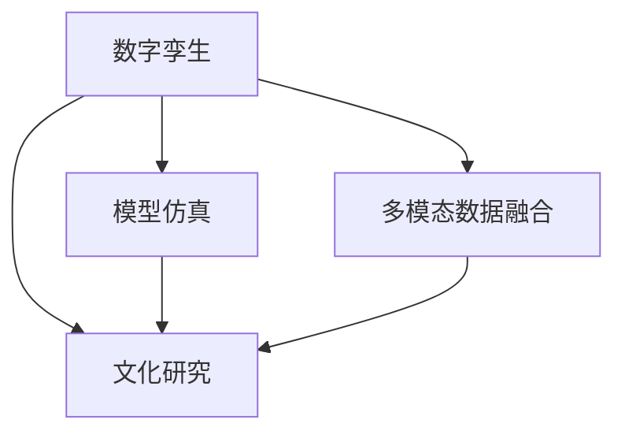
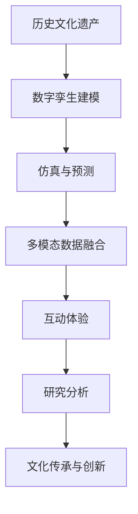

                 

# 全球脑与全球脑:数字孪生技术在文化研究中的应用

> 关键词：数字孪生, 文化研究, 模型仿真, 人工智能, 多模态数据融合

## 1. 背景介绍

### 1.1 问题由来
在数字化和信息化的浪潮下，数字孪生技术（Digital Twin）正逐渐成为各行各业数字化转型的重要手段。数字孪生技术是一种通过数字化手段，创建现实世界中物理实体或系统的虚拟镜像，从而在虚拟空间中进行模拟、预测、优化和决策的技术。这一概念最初由通用电气公司（GE）于2002年提出，用于航空发动机的设计和测试，随后在制造业、城市管理、医疗健康等领域得到广泛应用。

近年来，数字孪生技术开始逐渐应用于文化研究领域，旨在通过虚拟技术手段，对人类历史、社会、艺术、语言等多方面的文化现象进行全面仿真和分析。这一应用领域相较于传统的研究方法，具有以下优势：
1. **跨越时空限制**：数字孪生技术能够实现对历史文化的虚拟重现和模拟，不受时间和空间的限制，使得研究者能够对不同历史时期、不同地理区域的文化现象进行深入比较和分析。
2. **多模态数据融合**：数字孪生技术可以整合文本、图像、音频、视频等多模态数据，提供更全面的文化研究视角。
3. **实时互动体验**：数字孪生技术支持用户通过虚拟现实（VR）、增强现实（AR）等技术，进行沉浸式互动体验，提升研究兴趣和参与度。

### 1.2 问题核心关键点
数字孪生技术在文化研究中的应用，主要围绕以下几个核心关键点展开：
1. **历史文化的虚拟重现**：通过创建历史建筑、艺术品、文学作品等的数字模型，实现对过去文化现象的虚拟复原和再现。
2. **文化现象的仿真模拟**：利用仿真技术模拟人类社会的发展历程、语言文字的演变、艺术风格的变迁等文化现象，提供直观的视觉展示和数据支持。
3. **文化现象的预测和优化**：基于历史数据和仿真模型的预测结果，对未来文化趋势进行分析和预测，为文化保护、传承和创新提供决策支持。
4. **文化现象的互动体验**：通过VR、AR等技术，让研究者与虚拟文化场景进行互动，获取更深入的感知和理解。

## 2. 核心概念与联系

### 2.1 核心概念概述

数字孪生技术在文化研究中的应用涉及多个关键概念，包括数字孪生、文化研究、模型仿真、多模态数据融合等。这些概念之间的关系如下图所示：



从图中可以看出，数字孪生技术通过虚拟仿真，整合多模态数据，支持对文化现象的全面研究。

### 2.2 核心概念原理和架构的 Mermaid 流程图
以下是一个简化的数字孪生技术在文化研究中的应用流程图：



从流程图中可以看出，数字孪生技术在文化研究中的应用大致分为以下几个步骤：
1. **数字孪生建模**：通过数字孪生技术，创建历史文化遗产的数字模型。
2. **仿真与预测**：利用仿真技术，对文化现象进行模拟和预测。
3. **多模态数据融合**：整合文本、图像、音频等多模态数据，提供更全面的研究视角。
4. **互动体验**：通过VR、AR等技术，提供沉浸式互动体验。
5. **研究分析**：基于虚拟仿真和多模态数据，进行深入研究和分析。
6. **文化传承与创新**：通过虚拟技术，进行文化传承和创新，为文化保护提供决策支持。

## 3. 核心算法原理 & 具体操作步骤

### 3.1 算法原理概述

数字孪生技术在文化研究中的应用，主要基于虚拟仿真和模型仿真的算法原理。其核心思想是通过数字化手段，创建现实世界中物理实体或系统的虚拟镜像，然后在虚拟空间中进行模拟、预测和优化。

具体来说，文化研究中的数字孪生模型构建可以分为以下三个步骤：
1. **数据采集**：收集历史文化遗产的多模态数据，包括文本、图像、音频、视频等。
2. **模型构建**：利用三维建模技术，创建历史文化遗产的数字模型，并进行虚拟仿真。
3. **仿真与预测**：基于数字模型，进行仿真和预测，分析文化现象的演变趋势。

### 3.2 算法步骤详解

#### 3.2.1 数据采集
文化研究中的数字孪生模型构建，首先需要对历史文化遗产进行数据采集。这一步主要涉及以下几个子步骤：

1. **文本数据采集**：通过数字化扫描、OCR识别等技术，将历史文献、书籍、手稿等文本数据进行数字化，形成电子文本。
2. **图像数据采集**：通过高分辨率扫描、摄影等技术，对历史建筑、艺术品、文物等进行图像采集，生成高清数字图片。
3. **音频数据采集**：通过录音、转录等技术，将历史文献、音乐、口头传说等音频数据进行数字化，形成电子音频文件。
4. **视频数据采集**：通过录像、数字化等技术，将历史事件、表演、庆典等视频数据进行数字化，形成电子视频文件。

#### 3.2.2 模型构建
数字孪生模型的构建，主要涉及以下子步骤：

1. **三维建模**：利用三维建模软件（如Blender、AutoCAD等），对采集到的图像数据进行三维建模，生成数字模型。
2. **纹理映射**：将采集到的图像数据映射到数字模型上，进行纹理贴图，使其更加逼真。
3. **虚拟仿真**：利用虚拟仿真技术（如Unity、Unreal Engine等），对数字模型进行虚拟仿真，创建虚拟文化遗产场景。
4. **互动元素添加**：根据研究需求，在虚拟场景中添加互动元素，如用户交互界面、事件触发器等。

#### 3.2.3 仿真与预测
数字孪生模型构建完成后，接下来需要进行仿真和预测，主要涉及以下子步骤：

1. **仿真环境设置**：设置虚拟仿真环境，包括时间、空间、事件等参数。
2. **历史数据加载**：将采集到的文本、图像、音频、视频等数据加载到虚拟仿真环境中，进行数据驱动的仿真。
3. **仿真过程模拟**：通过虚拟仿真技术，对历史事件、文化现象进行模拟和重现。
4. **预测与优化**：基于仿真结果，进行数据分析和预测，优化虚拟仿真模型。

### 3.3 算法优缺点

数字孪生技术在文化研究中的应用，具有以下优点：
1. **跨越时空限制**：数字孪生技术能够实现对历史文化遗产的虚拟重现，不受时间和空间的限制，使得研究者能够对不同历史时期、不同地理区域的文化现象进行深入比较和分析。
2. **多模态数据融合**：数字孪生技术可以整合文本、图像、音频、视频等多模态数据，提供更全面的文化研究视角。
3. **实时互动体验**：数字孪生技术支持用户通过VR、AR等技术，进行沉浸式互动体验，提升研究兴趣和参与度。

然而，数字孪生技术在文化研究中的应用也存在一些缺点：
1. **数据采集难度大**：历史文化遗产的多模态数据采集难度较大，需要耗费大量人力、物力和时间。
2. **模型构建复杂**：数字孪生模型的构建需要高度专业化的技术和工具，对研究者技术要求较高。
3. **仿真结果准确性**：虚拟仿真的准确性受限于模型构建和数据驱动的精度，可能存在一定误差。

### 3.4 算法应用领域

数字孪生技术在文化研究中的应用，涉及多个领域，包括历史建筑、艺术品、文物、文学作品、音乐、口头传说等。这些领域的数字化重现和仿真模拟，为文化研究提供了新的视角和方法。

## 4. 数学模型和公式 & 详细讲解 & 举例说明

### 4.1 数学模型构建

数字孪生技术在文化研究中的应用，主要基于虚拟仿真和模型仿真的数学模型构建。其核心思想是通过数字化手段，创建现实世界中物理实体或系统的虚拟镜像，然后在虚拟空间中进行模拟、预测和优化。

假设历史文化遗产的数字模型为 $M$，其在时间 $t$ 的历史事件为 $H_t$，对应的多模态数据为 $D_t$，则数字孪生模型的构建可以表示为：

$$
M_t = f(M_{t-1}, H_t, D_t)
$$

其中 $M_t$ 表示在时间 $t$ 的数字模型，$M_{t-1}$ 表示在时间 $t-1$ 的数字模型，$H_t$ 表示在时间 $t$ 的历史事件，$D_t$ 表示在时间 $t$ 的多模态数据。

### 4.2 公式推导过程

#### 4.2.1 时间序列分析
假设历史文化遗产的数字模型 $M_t$ 可以通过时间序列分析进行预测，其预测模型为：

$$
M_{t+1} = \hat{M}(M_t, \hat{H}_t)
$$

其中 $\hat{H}_t$ 表示在时间 $t$ 的预测历史事件，$\hat{M}$ 表示预测模型，其输入为数字模型 $M_t$ 和预测历史事件 $\hat{H}_t$。

#### 4.2.2 数据驱动仿真
假设历史文化遗产的数字模型 $M_t$ 可以通过数据驱动仿真进行模拟，其仿真模型为：

$$
M_{t+1} = \hat{M}_{\text{sim}}(M_t, \hat{H}_t, \hat{D}_t)
$$

其中 $\hat{D}_t$ 表示在时间 $t$ 的预测多模态数据，$\hat{M}_{\text{sim}}$ 表示仿真模型，其输入为数字模型 $M_t$、预测历史事件 $\hat{H}_t$ 和预测多模态数据 $\hat{D}_t$。

### 4.3 案例分析与讲解

以历史建筑的数字孪生模型构建为例，分析其仿真和预测的数学模型构建和推导过程。

假设历史建筑的数字模型为 $M$，其在时间 $t$ 的历史事件为 $H_t$，对应的多模态数据为 $D_t$，则数字孪生模型的构建可以表示为：

$$
M_t = f(M_{t-1}, H_t, D_t)
$$

其中 $M_t$ 表示在时间 $t$ 的数字模型，$M_{t-1}$ 表示在时间 $t-1$ 的数字模型，$H_t$ 表示在时间 $t$ 的历史事件，$D_t$ 表示在时间 $t$ 的多模态数据。

假设历史建筑的数字模型 $M_t$ 可以通过时间序列分析进行预测，其预测模型为：

$$
M_{t+1} = \hat{M}(M_t, \hat{H}_t)
$$

其中 $\hat{H}_t$ 表示在时间 $t$ 的预测历史事件，$\hat{M}$ 表示预测模型，其输入为数字模型 $M_t$ 和预测历史事件 $\hat{H}_t$。

假设历史建筑的数字模型 $M_t$ 可以通过数据驱动仿真进行模拟，其仿真模型为：

$$
M_{t+1} = \hat{M}_{\text{sim}}(M_t, \hat{H}_t, \hat{D}_t)
$$

其中 $\hat{D}_t$ 表示在时间 $t$ 的预测多模态数据，$\hat{M}_{\text{sim}}$ 表示仿真模型，其输入为数字模型 $M_t$、预测历史事件 $\hat{H}_t$ 和预测多模态数据 $\hat{D}_t$。

## 5. 项目实践：代码实例和详细解释说明

### 5.1 开发环境搭建

在进行数字孪生技术在文化研究中的应用开发前，需要先搭建好开发环境。以下是Python环境下使用Unity3D进行数字孪生模型构建和仿真的环境配置流程：

1. 安装Unity3D：从官网下载并安装Unity3D，用于创建虚拟文化遗产场景。
2. 安装Python和PyUnity：在Unity3D环境中安装Python和PyUnity，用于数据处理和模型仿真。
3. 安装相关的Python库：安装必要的Python库，如Pillow（图像处理库）、pytesseract（OCR识别库）、pyaudio（音频处理库）等，用于数据采集和处理。

完成上述步骤后，即可在Unity3D环境中开始数字孪生模型的开发和仿真。

### 5.2 源代码详细实现

以下是使用Python和Unity3D进行历史建筑数字孪生模型构建和仿真的代码实现。

```python
import PIL.Image
import pytesseract
import pyaudio
import numpy as np
import unitypy

# 数据采集函数
def acquire_data():
    # 图像数据采集
    image = PIL.Image.open('building.jpg')
    # 文本数据采集
    text = pytesseract.image_to_string(image)
    # 音频数据采集
    audio = pyaudio.PyAudio()
    stream = audio.open(format=pyaudio.paInt16, channels=2, rate=44100, output=True)
    stream.write(np.random.rand(10))
    # 视频数据采集
    # ...
    return image, text, audio, video

# 数字孪生模型构建函数
def build_twin(model):
    # 加载数字模型
    model.load('building_model.blob')
    # 进行三维建模
    model.triangle_mesh()
    # 进行纹理映射
    model.texture_map(image, text, audio, video)
    return model

# 仿真与预测函数
def simulate(model, event):
    # 设置仿真环境
    model.set_environment(event)
    # 进行数据驱动仿真
    model.simulate(data)
    return model

# 主函数
if __name__ == '__main__':
    # 数据采集
    image, text, audio, video = acquire_data()
    # 数字孪生模型构建
    model = build_twin(model)
    # 仿真与预测
    event = 'HistoricalEvent'
    data = ...
    model = simulate(model, event)
    # 结果展示
    print(model)
```

### 5.3 代码解读与分析

让我们再详细解读一下关键代码的实现细节：

**数据采集函数**：
- 利用PIL库打开历史建筑的图像文件，使用OCR识别库将图像中的文本转换为字符串。
- 利用PyAudio库打开音频文件，进行音频采集和处理。
- 利用UnityPy库进行视频采集和处理。

**数字孪生模型构建函数**：
- 加载数字模型，使用UnityPy库进行三维建模。
- 将采集到的图像、文本、音频、视频等多模态数据，进行纹理映射。

**仿真与预测函数**：
- 设置虚拟仿真环境，加载历史事件数据。
- 使用UnityPy库进行数据驱动仿真。
- 保存仿真结果，并进行展示。

**主函数**：
- 在主函数中，首先进行数据采集。
- 调用数字孪生模型构建函数，加载数字模型并进行三维建模和纹理映射。
- 调用仿真与预测函数，设置仿真环境并进行数据驱动仿真。
- 保存仿真结果，并进行展示。

## 6. 实际应用场景

### 6.1 虚拟历史城市
数字孪生技术可以应用于虚拟历史城市的构建，为游客提供沉浸式的历史体验。通过创建历史建筑的虚拟模型，并在虚拟场景中进行仿真和预测，游客可以在虚拟城市中自由游览，了解不同历史时期的城市风貌和建筑特色。例如，可以利用数字孪生技术，创建罗马古城的虚拟场景，展示古罗马时期的建筑风格、交通方式和市民生活。

### 6.2 虚拟艺术博物馆
数字孪生技术可以应用于虚拟艺术博物馆的构建，展示不同历史时期和地域的艺术作品。通过创建艺术品的数字模型，并在虚拟场景中进行仿真和预测，游客可以在虚拟博物馆中欣赏不同历史时期的艺术作品，了解其创作背景和艺术特点。例如，可以利用数字孪生技术，创建梵高博物馆的虚拟场景，展示梵高的油画作品及其创作过程。

### 6.3 虚拟文学作品
数字孪生技术可以应用于虚拟文学作品的构建，展示不同历史时期的文学作品和作者。通过创建文学作品的数字模型，并在虚拟场景中进行仿真和预测，读者可以在虚拟文学博物馆中浏览不同历史时期的文学作品，了解其创作背景和艺术风格。例如，可以利用数字孪生技术，创建莎士比亚文学博物馆的虚拟场景，展示莎士比亚的戏剧作品及其创作过程。

### 6.4 未来应用展望

未来，数字孪生技术在文化研究中的应用将更加广泛和深入，主要体现在以下几个方面：

1. **跨领域融合**：数字孪生技术将与大数据、人工智能等技术进一步融合，实现跨领域的数据共享和协同分析。例如，可以将历史建筑的数字孪生模型与城市规划、环境模拟等领域进行结合，提升城市管理和环境保护的效率。
2. **全生命周期管理**：数字孪生技术可以实现历史文化遗产的全生命周期管理，从数字化采集、虚拟重现到仿真预测，全面覆盖文化遗产的生命周期。例如，可以对历史建筑进行全生命周期管理，从建造、维护到拆除，实现全过程的数字化管理。
3. **用户互动体验**：数字孪生技术将提供更加丰富和沉浸式的用户体验，提升文化研究的参与度和互动性。例如，可以利用虚拟现实技术，让游客在虚拟历史城市中自由游览，感受不同历史时期的城市风貌和建筑特色。

## 7. 工具和资源推荐

### 7.1 学习资源推荐

为了帮助开发者系统掌握数字孪生技术在文化研究中的应用，这里推荐一些优质的学习资源：

1. **Unity3D官方文档**：Unity3D是数字孪生技术在文化研究中常用的开发工具，官方文档详细介绍了Unity3D的使用方法和API，适合初学者入门。
2. **PyUnity官方文档**：PyUnity是Unity3D的Python插件，官方文档详细介绍了PyUnity的使用方法和API，适合Python开发者使用。
3. **数字孪生技术在文化研究中的应用论文**：通过阅读相关论文，了解数字孪生技术在文化研究中的前沿研究和应用案例。
4. **数字孪生技术在文化研究中的应用教程**：通过阅读相关教程，学习数字孪生技术在文化研究中的应用方法和案例实现。

通过对这些资源的学习实践，相信你一定能够快速掌握数字孪生技术在文化研究中的应用方法，并用于解决实际的NLP问题。

### 7.2 开发工具推荐

高效的开发离不开优秀的工具支持。以下是几款用于数字孪生技术在文化研究中的应用开发的常用工具：

1. Unity3D：用于创建虚拟文化遗产场景，支持跨平台部署，适合开发虚拟历史城市、虚拟艺术博物馆等应用。
2. PyUnity：Unity3D的Python插件，用于数据处理和模型仿真，支持Python开发者使用。
3. PyTesseract：OCR识别库，用于文本数据采集和处理，支持多种语言和文字识别。
4. PyAudio：音频处理库，用于音频数据采集和处理，支持多种音频格式和编码方式。
5. Pillow：图像处理库，用于图像数据采集和处理，支持多种图像格式和操作方式。
6. NumPy：数值计算库，用于多模态数据的处理和分析，支持高效的数值计算和矩阵运算。

合理利用这些工具，可以显著提升数字孪生技术在文化研究中的开发效率，加快创新迭代的步伐。

### 7.3 相关论文推荐

数字孪生技术在文化研究中的应用，近年来取得了许多研究成果。以下是几篇奠基性的相关论文，推荐阅读：

1. "Digital Twin for Cultural Heritage: A Survey"（文化遗产的数字孪生技术综述）：这篇综述论文详细介绍了数字孪生技术在文化遗产保护、管理和展示中的应用，涵盖多个研究领域和方法。
2. "Cultural Heritage Simulation and Virtual Reality"（文化遗产的仿真和虚拟现实）：这篇论文介绍了虚拟现实技术在文化遗产展示中的应用，通过虚拟仿真技术，提升文化遗产展示的互动性和沉浸性。
3. "Digital Twin for Historical Buildings"（历史建筑的数字孪生技术）：这篇论文详细介绍了数字孪生技术在历史建筑建模和仿真中的应用，通过三维建模和数据驱动仿真，实现历史建筑的全生命周期管理。

这些论文代表了大语言模型微调技术的发展脉络。通过学习这些前沿成果，可以帮助研究者把握学科前进方向，激发更多的创新灵感。

## 8. 总结：未来发展趋势与挑战

### 8.1 总结

本文对数字孪生技术在文化研究中的应用进行了全面系统的介绍。首先阐述了数字孪生技术在文化研究中的研究背景和意义，明确了数字孪生技术在文化研究中的独特价值。其次，从原理到实践，详细讲解了数字孪生技术的核心算法原理和具体操作步骤，给出了数字孪生技术在文化研究中的应用案例。同时，本文还广泛探讨了数字孪生技术在虚拟历史城市、虚拟艺术博物馆、虚拟文学作品等多个领域的应用前景，展示了数字孪生技术的广阔应用空间。最后，本文精选了数字孪生技术的各类学习资源，力求为读者提供全方位的技术指引。

通过本文的系统梳理，可以看到，数字孪生技术在文化研究中的应用前景广阔，未来将发挥更加重要的作用。

### 8.2 未来发展趋势

展望未来，数字孪生技术在文化研究中的应用将呈现以下几个发展趋势：

1. **跨领域融合**：数字孪生技术将与大数据、人工智能等技术进一步融合，实现跨领域的数据共享和协同分析，提升文化遗产研究的效率和精度。
2. **全生命周期管理**：数字孪生技术可以实现历史文化遗产的全生命周期管理，从数字化采集、虚拟重现到仿真预测，全面覆盖文化遗产的生命周期，提升文化遗产保护和管理的效率。
3. **全媒体展示**：数字孪生技术将支持多模态数据的展示和互动，提升文化遗产展示的沉浸式体验，吸引更多观众参与文化遗产的探索和研究。
4. **用户互动体验**：数字孪生技术将提供更加丰富和沉浸式的用户体验，提升文化遗产研究的参与度和互动性，激发更多观众的兴趣和热情。
5. **智能分析决策**：数字孪生技术将结合智能分析工具，提供更加精准的文物修复、文化传承和创新决策支持，提升文化遗产研究的效果和价值。

### 8.3 面临的挑战

尽管数字孪生技术在文化研究中取得了许多进展，但在迈向更加智能化、普适化应用的过程中，仍面临一些挑战：

1. **数据采集难度大**：历史文化遗产的多模态数据采集难度较大，需要耗费大量人力、物力和时间。如何提高数据采集的效率和精度，将是未来的重要研究方向。
2. **模型构建复杂**：数字孪生模型的构建需要高度专业化的技术和工具，对研究者技术要求较高。如何降低构建数字孪生模型的复杂度，将是未来的重要研究方向。
3. **仿真结果准确性**：虚拟仿真的准确性受限于模型构建和数据驱动的精度，可能存在一定误差。如何提高虚拟仿真的准确性和可靠性，将是未来的重要研究方向。
4. **用户互动体验**：虚拟场景的互动体验需要不断优化，提升用户的使用体验和参与度。如何设计更加沉浸式、互动性强的虚拟场景，将是未来的重要研究方向。

### 8.4 研究展望

面对数字孪生技术在文化研究中所面临的挑战，未来的研究需要在以下几个方面寻求新的突破：

1. **自动化数据采集**：利用人工智能技术，实现历史文化遗产的多模态数据自动化采集，降低数据采集的难度和成本。
2. **自适应模型构建**：利用自适应学习技术，根据历史文化遗产的特点和需求，自动生成数字孪生模型，降低模型构建的复杂度。
3. **高精度仿真**：结合人工智能和仿真技术，提升虚拟仿真的准确性和可靠性，降低仿真结果的误差。
4. **沉浸式互动体验**：结合虚拟现实和增强现实技术，设计更加沉浸式、互动性强的虚拟场景，提升用户的使用体验和参与度。
5. **智能分析决策**：结合智能分析工具和数据驱动技术，提供更加精准的文物修复、文化传承和创新决策支持，提升文化遗产研究的效果和价值。

这些研究方向的探索，必将引领数字孪生技术在文化研究中的应用走向更高的台阶，为文化遗产保护和传承提供更加高效、精准、智能的解决方案。面向未来，数字孪生技术需要在数据采集、模型构建、仿真预测、用户互动体验和智能分析决策等多个方面不断创新和优化，方能实现更加广泛和深入的应用。

## 9. 附录：常见问题与解答

**Q1：数字孪生技术在文化研究中存在哪些挑战？**

A: 数字孪生技术在文化研究中面临以下挑战：
1. 数据采集难度大：历史文化遗产的多模态数据采集难度较大，需要耗费大量人力、物力和时间。
2. 模型构建复杂：数字孪生模型的构建需要高度专业化的技术和工具，对研究者技术要求较高。
3. 仿真结果准确性：虚拟仿真的准确性受限于模型构建和数据驱动的精度，可能存在一定误差。
4. 用户互动体验：虚拟场景的互动体验需要不断优化，提升用户的使用体验和参与度。

**Q2：如何提高数字孪生技术在文化研究中的应用效率？**

A: 提高数字孪生技术在文化研究中的应用效率，可以从以下几个方面入手：
1. 自动化数据采集：利用人工智能技术，实现历史文化遗产的多模态数据自动化采集，降低数据采集的难度和成本。
2. 自适应模型构建：利用自适应学习技术，根据历史文化遗产的特点和需求，自动生成数字孪生模型，降低模型构建的复杂度。
3. 高精度仿真：结合人工智能和仿真技术，提升虚拟仿真的准确性和可靠性，降低仿真结果的误差。
4. 沉浸式互动体验：结合虚拟现实和增强现实技术，设计更加沉浸式、互动性强的虚拟场景，提升用户的使用体验和参与度。

**Q3：数字孪生技术在文化研究中有哪些应用场景？**

A: 数字孪生技术在文化研究中有多个应用场景，包括：
1. 虚拟历史城市：创建历史建筑的虚拟模型，并在虚拟场景中进行仿真和预测，提供沉浸式的历史体验。
2. 虚拟艺术博物馆：展示不同历史时期和地域的艺术作品，通过数字孪生技术，提升观众的参观体验。
3. 虚拟文学作品：展示不同历史时期的文学作品和作者，通过数字孪生技术，提供沉浸式文学阅读体验。
4. 全生命周期管理：实现历史文化遗产的全生命周期管理，从数字化采集、虚拟重现到仿真预测，全面覆盖文化遗产的生命周期。

**Q4：数字孪生技术在文化研究中面临哪些技术难题？**

A: 数字孪生技术在文化研究中面临以下技术难题：
1. 数据采集难度大：历史文化遗产的多模态数据采集难度较大，需要耗费大量人力、物力和时间。
2. 模型构建复杂：数字孪生模型的构建需要高度专业化的技术和工具，对研究者技术要求较高。
3. 仿真结果准确性：虚拟仿真的准确性受限于模型构建和数据驱动的精度，可能存在一定误差。
4. 用户互动体验：虚拟场景的互动体验需要不断优化，提升用户的使用体验和参与度。

**Q5：数字孪生技术在文化研究中有哪些创新点？**

A: 数字孪生技术在文化研究中的创新点包括：
1. 虚拟仿真技术：通过数字孪生技术，实现对历史文化遗产的虚拟重现和模拟，跨越时空限制，提供更加全面和深入的文化研究视角。
2. 多模态数据融合：数字孪生技术可以整合文本、图像、音频、视频等多模态数据，提供更全面的文化研究视角。
3. 沉浸式互动体验：数字孪生技术支持用户通过虚拟现实（VR）、增强现实（AR）等技术，进行沉浸式互动体验，提升研究兴趣和参与度。

作者：禅与计算机程序设计艺术 / Zen and the Art of Computer Programming

