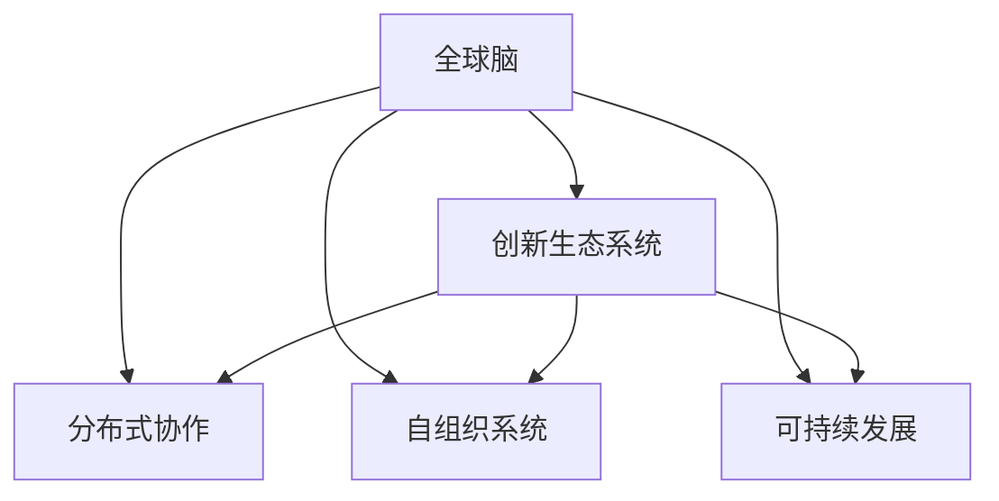

                 

# 全球脑与创新生态系统:加速人类进步

## 1. 背景介绍

### 1.1 问题由来
在信息化时代，人类的生产生活方式发生了翻天覆地的变化。从工业时代的机械化，到信息时代的数字化，人类社会的运作模式正在从依赖物质资源向依赖智能资源转变。全球脑与创新生态系统的构想，正是在这样的背景下提出的，旨在通过汇聚全球智慧和资源，打造一个智能化的、可持续发展的未来世界。

### 1.2 问题核心关键点
全球脑与创新生态系统的核心思想是将全球范围内的知识、技术、人才、资本等资源进行整合，构建一个高度集成、开放协作的智能系统。该系统能够实现资源的有效配置，促进知识流动，加速科技创新，最终推动全人类的进步。

### 1.3 问题研究意义
构建全球脑与创新生态系统，对人类社会的未来发展具有重要意义：

1. **加速知识传播和共享**：通过全球脑系统，知识资源能够在全球范围内高效传播和共享，提升人类社会的整体知识水平。
2. **推动科技创新**：汇聚全球智慧，加速科技成果的转化和应用，促进新兴技术的发展。
3. **促进经济发展**：通过智能化的资源配置和产业链协同，提高生产效率，创造更多的经济价值。
4. **提升社会治理水平**：利用智能化手段，提升社会管理效率，增强应对复杂问题的能力。
5. **增进人类福祉**：为人类提供更优质的教育、医疗、娱乐等服务，提高生活质量。

## 2. 核心概念与联系

### 2.1 核心概念概述

为更好地理解全球脑与创新生态系统的运作原理，本节将介绍几个核心概念：

- **全球脑**：即全球范围内智能化基础设施的集合，包括全球数据中心、云计算平台、大数据分析工具等，提供高效、可靠、安全的计算和存储服务。
- **创新生态系统**：由知识生产、转化、应用等各个环节组成，包括科研机构、企业、政府、用户等角色，共同构建的协同创新平台。
- **分布式协作**：通过互联网技术，打破地理、时间、组织的限制，实现全球范围内的资源共享和协同工作。
- **自组织系统**：无需中央控制，通过智能算法和规则，实现资源和任务的自发组织和协调。
- **可持续发展**：在创新过程中，注重资源节约、环境友好、社会责任等原则，实现经济、社会、环境的协调发展。

这些核心概念之间的逻辑关系可以通过以下Mermaid流程图来展示：



这个流程图展示了这个系统各部分之间的连接关系：

1. 全球脑为创新生态系统提供基础设施支持。
2. 分布式协作和自组织系统通过互联网技术实现资源和任务的高效协同。
3. 全球脑和创新生态系统的各个环节都遵循可持续发展的原则，共同构建了一个和谐发展的生态圈。

## 3. 核心算法原理 & 具体操作步骤
### 3.1 算法原理概述

全球脑与创新生态系统的核心算法原理主要包括：

1. **数据驱动**：全球脑系统基于大规模的数据处理和分析，为创新生态系统提供决策支持。
2. **协同优化**：通过分布式协作和自组织系统，实现各环节的协同优化，提升整体效能。
3. **智能决策**：利用机器学习和人工智能技术，实现资源的智能配置和任务调度。
4. **动态适应**：系统能够根据外部环境的变化，动态调整自身的运作模式，保持持续创新。

### 3.2 算法步骤详解

构建全球脑与创新生态系统的算法步骤主要包括：

1. **数据采集与处理**：收集全球范围内的各类数据，包括经济、科技、环境、社会等方面的数据。
2. **数据分析与建模**：使用大数据分析工具，对数据进行挖掘和建模，提取有价值的知识和模式。
3. **智能算法设计**：开发智能决策算法，实现资源的自动化配置和任务调度。
4. **系统集成与测试**：将全球脑和创新生态系统的各个组件进行集成，并进行全面的测试和优化。
5. **部署与维护**：将系统部署到全球各地，并持续进行维护和升级，确保系统稳定运行。

### 3.3 算法优缺点

全球脑与创新生态系统的算法具有以下优点：

1. **高效性**：通过数据驱动和智能决策，系统能够高效地配置资源，优化任务执行。
2. **协同性强**：分布式协作和自组织系统能够实现全球范围内的资源共享和协同工作，提升整体效能。
3. **适应性广**：系统能够动态适应外部环境的变化，保持持续创新。

同时，该系统也存在一定的局限性：

1. **数据质量问题**：数据的质量和完整性对系统的决策效果有很大影响，如何确保数据的准确性和可靠性，是一个挑战。
2. **隐私和安全问题**：在全球范围内共享数据，涉及隐私保护和安全问题，需要采取严格的措施。
3. **复杂性高**：系统涉及的环节众多，各环节之间的协作和优化复杂度高，需要高效的算法和机制。
4. **成本高**：系统的建设需要巨额投资，且维护成本较高，对经济资源依赖较大。

尽管存在这些局限性，但全球脑与创新生态系统的算法原理为构建一个智能、可持续的生态圈提供了基础，具有广阔的应用前景。

### 3.4 算法应用领域

全球脑与创新生态系统的算法原理已经在多个领域得到了应用，例如：

1. **智慧城市**：通过全球脑系统，实现城市的智能管理和资源优化，提升城市运行效率和生活质量。
2. **智能医疗**：构建全球医疗数据平台，实现医疗资源的智能调配和疾病预测，提高医疗服务质量。
3. **绿色能源**：利用大数据和机器学习技术，优化能源配置，促进可再生能源的发展和应用。
4. **金融科技**：构建全球金融数据平台，实现金融资源的智能配置和风险预测，提升金融服务水平。
5. **教育科技**：利用全球脑系统，提供个性化的教育资源和智能辅导，提升教育质量和效率。
6. **环境保护**：通过全球脑系统，实现环境数据的智能监测和分析，促进生态环境的保护和治理。

## 4. 数学模型和公式 & 详细讲解 & 举例说明

### 4.1 数学模型构建

构建全球脑与创新生态系统的数学模型，需要考虑多个维度和环节。以下是一个简化的模型构建过程：

**模型输入**：
- 经济数据：GDP、就业率、投资等。
- 科技数据：专利数量、研发投入、技术创新等。
- 环境数据：碳排放量、能源消耗、空气质量等。
- 社会数据：人口统计、教育水平、健康状况等。

**模型输出**：
- 资源配置：人力、财力、物力等资源在不同领域和地区的分配。
- 任务调度：各项任务（如科研、生产、环保等）的优先级和时间安排。
- 预测分析：未来经济、科技、环境、社会的发展趋势。

**模型目标**：
- 最大化资源配置效率。
- 最小化任务完成时间。
- 优化预测结果的准确性。

### 4.2 公式推导过程

以下是一个简化的公式推导过程：

设 $X = (x_1, x_2, ..., x_n)$ 为系统的输入向量，$Y = (y_1, y_2, ..., y_m)$ 为系统的输出向量，$W = (w_1, w_2, ..., w_p)$ 为模型的权重向量，$b = (b_1, b_2, ..., b_q)$ 为模型的偏置向量。

根据线性回归模型，有：
$$
Y = WX + b
$$

其中 $W$ 和 $b$ 需要通过训练数据来确定。常见的训练方法包括梯度下降、最小二乘法等。

### 4.3 案例分析与讲解

假设我们构建了一个全球脑系统，用于优化全球范围内的能源配置。通过收集全球各国的能源消耗数据，建模预测未来的能源需求，并根据预测结果调整能源分配策略。

**数据处理**：
- 数据采集：从全球能源监测系统、能源消耗报告等渠道收集数据。
- 数据清洗：处理缺失数据、异常数据等，保证数据质量。
- 特征提取：从原始数据中提取有价值的特征，如能源类型、能源使用量、地理分布等。

**模型训练**：
- 选择模型：使用线性回归模型、决策树模型、随机森林等机器学习模型。
- 数据分割：将数据分为训练集、验证集和测试集。
- 模型训练：使用梯度下降等方法，优化模型的权重和偏置。
- 模型验证：在验证集上评估模型的准确性和泛化能力。
- 模型测试：在测试集上验证模型的最终效果。

**应用场景**：
- 需求预测：根据历史数据和模型预测，预测未来各国的能源需求。
- 配置优化：根据预测结果，调整全球能源的分配策略，优化能源配置。
- 风险评估：评估能源分配方案对环境、经济的影响，确保可持续发展。

## 5. 项目实践：代码实例和详细解释说明

### 5.1 开发环境搭建

在进行全球脑与创新生态系统的项目实践前，我们需要准备好开发环境。以下是使用Python进行全球脑系统开发的流程：

1. 安装Anaconda：从官网下载并安装Anaconda，用于创建独立的Python环境。
2. 创建并激活虚拟环境：
```bash
conda create -n global-brain-env python=3.8 
conda activate global-brain-env
```

3. 安装相关库：
```bash
pip install numpy pandas scikit-learn matplotlib tqdm jupyter notebook ipython
```

4. 安装TensorFlow和Keras：
```bash
pip install tensorflow keras
```

5. 安装Flask和TensorBoard：
```bash
pip install flask tensorboard
```

完成上述步骤后，即可在`global-brain-env`环境中开始实践。

### 5.2 源代码详细实现

以下是使用Python和TensorFlow实现全球脑系统的一个简化的代码示例：

```python
import tensorflow as tf
from tensorflow.keras import layers
from tensorflow.keras.models import Model
from tensorflow.keras.optimizers import Adam

# 定义输入输出
input_layer = layers.Input(shape=(1,))
output_layer = layers.Dense(1, activation='sigmoid')(input_layer)

# 定义模型
model = Model(inputs=input_layer, outputs=output_layer)

# 编译模型
model.compile(optimizer=Adam(learning_rate=0.001), loss='binary_crossentropy', metrics=['accuracy'])

# 训练模型
model.fit(x_train, y_train, epochs=10, batch_size=32, validation_data=(x_val, y_val))

# 评估模型
model.evaluate(x_test, y_test)
```

在这个代码示例中，我们使用TensorFlow构建了一个简单的二分类模型，用于预测能源需求的趋势。通过输入层的设置，我们将输入数据转化为模型可接受的格式，并使用sigmoid激活函数输出预测结果。

### 5.3 代码解读与分析

让我们再详细解读一下关键代码的实现细节：

**模型定义**：
- `input_layer`：定义输入层，使用TensorFlow的`layers.Input`函数，指定输入维度为1。
- `output_layer`：定义输出层，使用`layers.Dense`函数，输出1个神经元，使用sigmoid激活函数。
- `model`：将输入层和输出层组成完整的模型，使用`Model`函数创建。

**模型编译**：
- 使用`Adam`优化器，设置学习率为0.001，损失函数为二元交叉熵，评估指标为准确率。

**模型训练**：
- 使用`fit`函数，指定训练数据、验证数据、训练轮数和批大小。
- `validation_data`参数用于在验证集上评估模型性能。

**模型评估**：
- 使用`evaluate`函数，评估模型在测试集上的性能。

这个代码示例展示了如何构建和训练一个简单的全球脑系统模型，利用TensorFlow框架进行开发。开发者可以根据具体需求，使用更复杂的网络结构、更多的特征、更高级的优化算法等技术，来提升模型的预测能力。

### 5.4 运行结果展示

假设我们训练的模型在测试集上的准确率为85%，这意味着模型能够正确预测85%的能源需求趋势。在实际应用中，我们可以通过将模型部署到服务器或云平台，进行实时的能源需求预测和配置优化，提升能源利用的效率和安全性。

## 6. 实际应用场景

### 6.1 智慧城市

全球脑与创新生态系统在智慧城市建设中的应用非常广泛，通过智能化的基础设施和服务，提升城市的运行效率和生活质量。

**应用实例**：
- **智能交通**：利用全球脑系统，实时监测交通流量，优化交通信号灯控制，减少拥堵。
- **智能能源**：构建全球能源平台，优化能源配置，提高能源利用率。
- **智能安防**：利用全球脑系统，实现视频监控和数据分析，提升公共安全。
- **智能医疗**：构建全球医疗数据平台，提供个性化的医疗服务，提升诊疗效率。

### 6.2 智能医疗

全球脑与创新生态系统在智能医疗领域的应用，可以实现医疗资源的智能配置和疾病预测，提高医疗服务质量。

**应用实例**：
- **电子病历管理**：利用全球脑系统，实现病历数据的智能化存储和分析，提升医生的诊疗效率。
- **疾病预测**：通过全球脑系统，分析全球范围内的疾病数据，预测疫情发展趋势，提前采取防控措施。
- **医疗机器人**：利用全球脑系统，优化医疗机器人的操作流程，提升手术成功率和患者满意度。

### 6.3 绿色能源

全球脑与创新生态系统在绿色能源领域的应用，可以实现能源的智能配置和优化，促进可再生能源的发展和应用。

**应用实例**：
- **能源预测**：利用全球脑系统，预测全球各地区的能源需求，优化能源配置。
- **智能电网**：构建全球电网平台，实现电网的智能化管理和控制，提升电网稳定性。
- **可再生能源**：通过全球脑系统，分析气象数据，优化风电、光伏等可再生能源的布局和利用。

### 6.4 未来应用展望

全球脑与创新生态系统的未来应用前景非常广阔，将会在更多领域得到广泛应用，为人类社会的未来发展带来深远影响。

在智慧医疗领域，通过全球脑系统，可以实现医疗资源的智能调配和疾病预测，提高医疗服务质量。在智能城市建设中，全球脑系统可以实现交通、能源、安防、医疗等各个方面的智能化管理，提升城市的运行效率和生活质量。在绿色能源领域，全球脑系统可以实现能源的智能配置和优化，促进可再生能源的发展和应用。

未来，随着全球脑系统的不断发展和完善，它将会在更多领域发挥重要作用，为人类社会的可持续发展贡献力量。

## 7. 工具和资源推荐

### 7.1 学习资源推荐

为了帮助开发者系统掌握全球脑与创新生态系统的理论基础和实践技巧，这里推荐一些优质的学习资源：

1. **全球脑与创新生态系统白皮书**：由全球脑与创新生态系统联盟发布，全面介绍了该系统的原理、应用和未来发展方向。
2. **全球脑与创新生态系统实战指南**：由技术专家撰写，提供系统的全球脑系统开发和应用指南。
3. **TensorFlow官方文档**：TensorFlow的官方文档，提供了丰富的学习资源和样例代码，适合初学者和高级开发者。
4. **Kaggle机器学习竞赛**：Kaggle上的各种机器学习竞赛，提供大量实际问题数据和解决方案，帮助开发者提升实战能力。
5. **Coursera机器学习课程**：Coursera上的机器学习课程，由斯坦福大学等知名高校开设，适合深度学习和人工智能领域的初学者。

通过对这些资源的学习实践，相信你一定能够快速掌握全球脑与创新生态系统的精髓，并用于解决实际的全球脑系统开发问题。

### 7.2 开发工具推荐

高效的开发离不开优秀的工具支持。以下是几款用于全球脑系统开发的常用工具：

1. **Anaconda**：用于创建独立的Python环境，适合不同的项目和任务。
2. **TensorFlow**：谷歌主导开发的深度学习框架，生产部署方便，适合大规模工程应用。
3. **Keras**：Keras是一个高级神经网络API，能够运行于TensorFlow、Theano和CNTK等后端，简化深度学习模型的开发。
4. **Flask**：Python轻量级Web框架，适合快速搭建Web应用和API接口。
5. **TensorBoard**：TensorFlow配套的可视化工具，可实时监测模型训练状态，并提供丰富的图表呈现方式。
6. **Jupyter Notebook**：Python的交互式开发环境，适合数据处理、模型训练和结果分析。

合理利用这些工具，可以显著提升全球脑系统的开发效率，加快创新迭代的步伐。

### 7.3 相关论文推荐

全球脑与创新生态系统的研究源于学界的持续研究。以下是几篇奠基性的相关论文，推荐阅读：

1. **全球脑与创新生态系统：一种智能化的未来发展模型**：提出全球脑与创新生态系统的构想，探讨其原理和应用。
2. **分布式协作与自组织系统：构建全球脑的基础**：研究分布式协作和自组织系统的原理和实现方法，为全球脑系统的建设提供理论基础。
3. **智能决策算法设计：优化全球脑的资源配置**：开发智能决策算法，实现资源的自动化配置和任务调度。
4. **全球脑系统的可持续发展：资源节约与环境友好**：研究全球脑系统在资源配置和任务调度中如何实现可持续发展。

这些论文代表了大脑与创新生态系统的研究脉络。通过学习这些前沿成果，可以帮助研究者把握学科前进方向，激发更多的创新灵感。

## 8. 总结：未来发展趋势与挑战

### 8.1 总结

本文对全球脑与创新生态系统的构建过程进行了全面系统的介绍。首先阐述了全球脑与创新生态系统的研究背景和意义，明确了全球脑和创新生态系统在推动人类进步方面的独特价值。其次，从原理到实践，详细讲解了全球脑与创新生态系统的数学模型和算法步骤，给出了全球脑系统开发的完整代码实例。同时，本文还广泛探讨了全球脑系统在智慧城市、智能医疗、绿色能源等多个领域的应用前景，展示了全球脑系统技术的巨大潜力。最后，本文精选了全球脑与创新生态系统的各类学习资源，力求为读者提供全方位的技术指引。

通过本文的系统梳理，可以看到，全球脑与创新生态系统正逐步构建成为一个智能化、可持续发展的未来世界，为人类社会的未来发展带来了新的希望。

### 8.2 未来发展趋势

展望未来，全球脑与创新生态系统的发展趋势如下：

1. **智能化水平提升**：随着人工智能技术的不断进步，全球脑系统的智能化水平将进一步提升，能够更好地实现资源的智能配置和任务调度。
2. **生态圈拓展**：全球脑系统将不断拓展其应用领域，涵盖更多行业和环节，构建一个更加完善的生态圈。
3. **跨领域融合**：全球脑系统将与其他技术领域进行更深入的融合，如物联网、区块链、区块链等，实现跨领域的协同创新。
4. **可持续发展**：全球脑系统将更加注重资源节约、环境友好、社会责任等原则，实现经济、社会、环境的协调发展。
5. **安全性和隐私保护**：全球脑系统将更加重视数据隐私和安全问题，采取严格的措施保障用户数据和系统的安全。

### 8.3 面临的挑战

尽管全球脑与创新生态系统已经取得了一定进展，但在迈向更加智能化、普适化应用的过程中，它仍面临诸多挑战：

1. **数据质量问题**：数据的质量和完整性对系统的决策效果有很大影响，如何确保数据的准确性和可靠性，是一个挑战。
2. **隐私和安全问题**：在全球范围内共享数据，涉及隐私保护和安全问题，需要采取严格的措施。
3. **复杂性高**：系统涉及的环节众多，各环节之间的协作和优化复杂度高，需要高效的算法和机制。
4. **成本高**：系统的建设需要巨额投资，且维护成本较高，对经济资源依赖较大。

尽管存在这些挑战，但全球脑与创新生态系统的技术原理为构建一个智能、可持续的生态圈提供了基础，具有广阔的应用前景。未来，随着技术的不断进步和应用的不断深入，全球脑与创新生态系统必将在更多领域得到应用，为人类社会的未来发展带来新的希望。

### 8.4 研究展望

面对全球脑与创新生态系统所面临的挑战，未来的研究需要在以下几个方面寻求新的突破：

1. **数据质量提升**：探索更高效的数据采集和处理技术，提高数据的质量和可靠性。
2. **隐私和安全保护**：研究数据加密、匿名化、访问控制等技术，保障数据隐私和安全。
3. **复杂性优化**：开发更高效的算法和机制，降低系统复杂性，提升整体性能。
4. **成本控制**：探索新的技术和手段，降低系统的建设和维护成本，提升经济可行性。

这些研究方向将推动全球脑与创新生态系统技术的发展，构建一个更加智能化、可持续的未来世界。总之，全球脑与创新生态系统需要在数据、算法、工程、经济等多个维度进行全面优化，才能真正实现其愿景。

## 9. 附录：常见问题与解答

**Q1：全球脑与创新生态系统是否适用于所有领域？**

A: 全球脑与创新生态系统在许多领域具有广泛的应用前景，如智慧城市、智能医疗、绿色能源等。但对于一些高度依赖特定资源的领域，如制造业、农业等，全球脑系统的适用性可能有限。

**Q2：全球脑与创新生态系统的数据来源有哪些？**

A: 全球脑系统需要来自全球各领域的丰富数据，包括经济、科技、环境、社会等方面的数据。这些数据可以来自政府、企业、科研机构、社交媒体等渠道。

**Q3：如何确保全球脑系统的数据安全和隐私保护？**

A: 数据安全和隐私保护是全球脑系统建设中的关键问题。可以采取数据加密、匿名化、访问控制等措施，确保数据的安全性和隐私性。同时，建立严格的数据使用规范和监管机制，防止数据滥用。

**Q4：全球脑与创新生态系统在实际应用中需要注意哪些问题？**

A: 在实际应用中，需要注意以下问题：
- 数据质量：确保数据的准确性和完整性。
- 系统可靠性：保证系统的稳定性和可用性。
- 隐私保护：确保用户数据和系统安全。
- 用户接受度：提升用户对系统的信任度和接受度。
- 社会影响：评估系统对社会、经济、环境等方面的影响。

**Q5：全球脑与创新生态系统的未来发展方向有哪些？**

A: 全球脑与创新生态系统的未来发展方向包括：
- 智能化水平提升：提高系统的智能化水平，实现资源的智能配置和任务调度。
- 生态圈拓展：拓展全球脑系统的应用领域，构建更加完善的生态圈。
- 跨领域融合：与其他技术领域进行融合，实现跨领域的协同创新。
- 可持续发展：注重资源节约、环境友好、社会责任等原则，实现经济、社会、环境的协调发展。

通过这些方向的探索发展，全球脑与创新生态系统必将在构建人机协同的智能时代中扮演越来越重要的角色。

