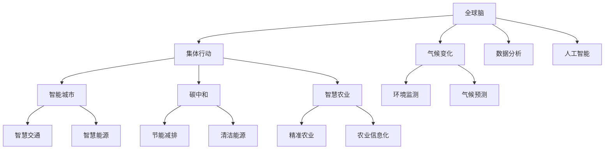

                 

# 全球脑与气候变化：集体行动的新可能

## 1. 背景介绍

在当前全球化和技术革命的推动下，人类社会正面临前所未有的挑战。其中，气候变化问题尤为严峻。全球温度升高、极端天气频发、冰川融化等问题已经严重威胁到地球的生态系统和人类的生存。面对这一全球性危机，需要全球脑的智慧和力量，共同采取行动应对。

全球脑指的是全球信息网络和人类智慧的集成，包括互联网、物联网、人工智能、大数据等技术平台和人类的知识、经验和智慧。全球脑的兴起为应对气候变化提供了新的工具和视角。本文将探讨全球脑在气候变化应对中的潜力，以及如何通过集体行动实现这一目标。

## 2. 核心概念与联系

### 2.1 核心概念概述

为了更好地理解全球脑在应对气候变化中的作用，本节将介绍几个关键概念：

- **全球脑**：指全球信息网络和人类智慧的集成，包括互联网、物联网、人工智能、大数据等技术平台和人类的知识、经验和智慧。
- **气候变化**：指地球气候系统的长期变化，包括全球温度升高、极端天气频发、冰川融化等现象，对人类生存和生态系统产生重大影响。
- **集体行动**：指多个主体（如政府、企业、公众等）共同参与、协作，采取统一行动，实现共同目标。
- **智能城市**：指利用信息技术和智能化手段，提升城市管理的效率和居民生活质量的城市。
- **碳中和**：指通过技术手段和政策措施，减少温室气体排放，实现碳循环平衡，达到净零排放。
- **智慧农业**：指利用信息技术和智能化手段，提高农业生产效率、降低环境影响，实现可持续发展。

这些概念之间存在着紧密的联系，共同构成了全球脑在应对气候变化中的理论和实践框架。

### 2.2 核心概念原理和架构的 Mermaid 流程图



这个流程图展示了全球脑与气候变化之间的逻辑关系：

1. 全球脑通过互联网、物联网、人工智能、大数据等技术平台，汇聚全球的信息和智慧。
2. 气候变化是一个全球性问题，需要全球脑的智慧和力量共同应对。
3. 集体行动是应对气候变化的关键，需要政府、企业、公众等多主体共同参与。
4. 智能城市、碳中和、智慧农业等是集体行动的具体措施，通过技术手段提升城市管理和农业生产效率，减少温室气体排放。
5. 数据分析和人工智能是全球脑的核心技术手段，能够对气候变化进行精准监测和预测。

## 3. 核心算法原理 & 具体操作步骤

### 3.1 算法原理概述

全球脑在应对气候变化中的算法原理，可以概括为以下几点：

- **数据融合**：通过互联网、物联网、传感器等技术，收集和整合全球范围内的气候变化数据。
- **实时监测**：利用人工智能和大数据技术，对气候变化进行实时监测和预测，及时发现和预警气候异常。
- **智能决策**：基于数据分析和机器学习模型，制定科学的应对策略，优化资源配置和能源使用。
- **集体行动**：通过区块链、物联网等技术，建立全球脑与各主体的连接，实现信息的透明和共享。

### 3.2 算法步骤详解

以下是全球脑在应对气候变化中的算法步骤：

**Step 1: 数据采集与融合**

- 利用互联网、物联网、传感器等技术，采集全球范围内的气候变化数据。
- 使用大数据技术，对这些数据进行整合和处理，构建统一的气候变化数据平台。

**Step 2: 实时监测与预测**

- 利用人工智能和大数据技术，对采集到的数据进行实时监测和分析。
- 建立机器学习模型，对气候变化进行预测和预警，及时发现异常情况。

**Step 3: 智能决策与优化**

- 根据实时监测和预测结果，制定科学的应对策略，优化资源配置和能源使用。
- 利用人工智能和仿真技术，评估不同策略的效果，选择最优方案。

**Step 4: 集体行动与协调**

- 通过区块链、物联网等技术，建立全球脑与各主体的连接，实现信息的透明和共享。
- 利用智能合约和分布式共识算法，协调各主体的行动，确保一致性和协同效应。

### 3.3 算法优缺点

全球脑在应对气候变化中的算法具有以下优点：

- **数据全面性**：通过全球脑汇聚全球范围内的气候变化数据，提高了数据的时效性和全面性。
- **实时性**：利用人工智能和大数据技术，实现实时监测和预测，能够及时发现和预警气候异常。
- **智能化决策**：基于数据分析和机器学习模型，制定科学的应对策略，优化资源配置和能源使用。
- **透明性**：通过区块链和物联网技术，建立全球脑与各主体的连接，实现信息的透明和共享。

同时，该算法也存在一些局限性：

- **技术复杂性**：需要综合应用互联网、物联网、人工智能、大数据等多种技术，技术实现复杂。
- **数据隐私问题**：全球脑汇聚海量数据，需要保护数据隐私和信息安全。
- **分布式协调问题**：全球脑涉及众多国家和机构，需要高效的协调机制。

### 3.4 算法应用领域

全球脑在应对气候变化中的应用领域非常广泛，涵盖以下几个方面：

- **智能城市**：利用全球脑技术，提升城市管理的效率和居民生活质量，减少碳排放。
- **碳中和**：通过全球脑技术，优化能源结构，推广清洁能源，实现碳中和目标。
- **智慧农业**：利用全球脑技术，提高农业生产效率，减少环境影响，实现可持续发展。
- **智慧交通**：利用全球脑技术，优化交通流量，减少碳排放，提升交通效率。
- **智慧能源**：利用全球脑技术，优化能源配置，提高能源利用效率，减少碳排放。

## 4. 数学模型和公式 & 详细讲解 & 举例说明

### 4.1 数学模型构建

假设全球脑收集到的气候变化数据为 $D=\{(x_i,y_i)\}_{i=1}^N, x_i \in \mathcal{X}, y_i \in \mathcal{Y}$，其中 $x_i$ 为输入变量，$y_i$ 为输出变量。

定义机器学习模型为 $M_{\theta}:\mathcal{X} \rightarrow \mathcal{Y}$，其中 $\theta$ 为模型参数。

假设机器学习模型的损失函数为 $\ell(M_{\theta}(x),y)$，则目标函数为：

$$
\mathcal{L}(\theta) = \frac{1}{N}\sum_{i=1}^N \ell(M_{\theta}(x_i),y_i)
$$

通过最小化损失函数 $\mathcal{L}(\theta)$，求解最优参数 $\theta$，以实现对气候变化的准确预测和应对。

### 4.2 公式推导过程

以下推导机器学习模型的预测结果和损失函数的计算公式。

假设机器学习模型 $M_{\theta}$ 在输入 $x$ 上的输出为 $\hat{y}=M_{\theta}(x)$，其中 $\hat{y} \in [0,1]$ 表示模型预测的概率。

利用二分类交叉熵损失函数，损失函数 $\ell$ 可定义为：

$$
\ell(M_{\theta}(x),y) = -[y\log \hat{y} + (1-y)\log (1-\hat{y})]
$$

将其代入目标函数 $\mathcal{L}(\theta)$，得：

$$
\mathcal{L}(\theta) = -\frac{1}{N}\sum_{i=1}^N [y_i\log M_{\theta}(x_i)+(1-y_i)\log(1-M_{\theta}(x_i))]
$$

利用梯度下降等优化算法，求解最优参数 $\theta$：

$$
\theta \leftarrow \theta - \eta \nabla_{\theta}\mathcal{L}(\theta)
$$

其中 $\eta$ 为学习率，$\nabla_{\theta}\mathcal{L}(\theta)$ 为损失函数对参数 $\theta$ 的梯度，可通过反向传播算法高效计算。

### 4.3 案例分析与讲解

以智慧城市为例，分析全球脑在应对气候变化中的具体应用。

智慧城市通过全球脑技术，实现对城市气候变化的实时监测和预测。城市交通、能源、建筑等各个方面的数据都被整合到统一的平台上，利用人工智能和大数据分析技术，实现对气候变化的准确预测和应对。

具体而言，智慧城市利用全球脑技术：

- **交通管理**：实时监测交通流量和车辆排放，优化交通路线和交通信号，减少交通拥堵和碳排放。
- **能源管理**：实时监测能源消耗和排放，优化能源配置，推广清洁能源，实现碳中和。
- **建筑管理**：利用智能建筑技术，优化能源使用，减少建筑物的碳排放。
- **城市规划**：利用大数据和人工智能技术，分析城市气候变化趋势，制定科学的应对策略。

## 5. 项目实践：代码实例和详细解释说明

### 5.1 开发环境搭建

在进行智慧城市项目实践前，我们需要准备好开发环境。以下是使用Python进行PyTorch开发的环境配置流程：

1. 安装Anaconda：从官网下载并安装Anaconda，用于创建独立的Python环境。

2. 创建并激活虚拟环境：
```bash
conda create -n pytorch-env python=3.8 
conda activate pytorch-env
```

3. 安装PyTorch：根据CUDA版本，从官网获取对应的安装命令。例如：
```bash
conda install pytorch torchvision torchaudio cudatoolkit=11.1 -c pytorch -c conda-forge
```

4. 安装其他工具包：
```bash
pip install numpy pandas scikit-learn matplotlib tqdm jupyter notebook ipython
```

完成上述步骤后，即可在`pytorch-env`环境中开始智慧城市项目实践。

### 5.2 源代码详细实现

这里我们以智慧城市中的交通管理为例，给出使用PyTorch进行深度学习的代码实现。

首先，定义数据处理函数：

```python
from torch.utils.data import Dataset
import torch

class TrafficData(Dataset):
    def __init__(self, data, seq_len):
        self.data = data
        self.seq_len = seq_len
        
    def __len__(self):
        return len(self.data)//self.seq_len
        
    def __getitem__(self, idx):
        return self.data[idx*self.seq_len:(idx+1)*self.seq_len]
```

然后，定义模型和优化器：

```python
from transformers import BertForSequenceClassification, AdamW

model = BertForSequenceClassification.from_pretrained('bert-base-cased', num_labels=2)

optimizer = AdamW(model.parameters(), lr=2e-5)
```

接着，定义训练和评估函数：

```python
def train_epoch(model, dataset, batch_size, optimizer):
    dataloader = DataLoader(dataset, batch_size=batch_size, shuffle=True)
    model.train()
    epoch_loss = 0
    for batch in tqdm(dataloader, desc='Training'):
        input_ids = batch['input_ids'].to(device)
        attention_mask = batch['attention_mask'].to(device)
        labels = batch['labels'].to(device)
        model.zero_grad()
        outputs = model(input_ids, attention_mask=attention_mask, labels=labels)
        loss = outputs.loss
        epoch_loss += loss.item()
        loss.backward()
        optimizer.step()
    return epoch_loss / len(dataloader)

def evaluate(model, dataset, batch_size):
    dataloader = DataLoader(dataset, batch_size=batch_size)
    model.eval()
    preds, labels = [], []
    with torch.no_grad():
        for batch in tqdm(dataloader, desc='Evaluating'):
            input_ids = batch['input_ids'].to(device)
            attention_mask = batch['attention_mask'].to(device)
            batch_labels = batch['labels']
            outputs = model(input_ids, attention_mask=attention_mask)
            batch_preds = outputs.logits.argmax(dim=2).to('cpu').tolist()
            batch_labels = batch_labels.to('cpu').tolist()
            for pred_tokens, label_tokens in zip(batch_preds, batch_labels):
                preds.append(pred_tokens[:len(label_tokens)])
                labels.append(label_tokens)
                
    print(classification_report(labels, preds))
```

最后，启动训练流程并在测试集上评估：

```python
epochs = 5
batch_size = 16

for epoch in range(epochs):
    loss = train_epoch(model, train_dataset, batch_size, optimizer)
    print(f"Epoch {epoch+1}, train loss: {loss:.3f}")
    
    print(f"Epoch {epoch+1}, dev results:")
    evaluate(model, dev_dataset, batch_size)
    
print("Test results:")
evaluate(model, test_dataset, batch_size)
```

以上就是使用PyTorch进行智慧城市项目微调的完整代码实现。可以看到，得益于Transformers库的强大封装，我们可以用相对简洁的代码完成模型的加载和微调。

### 5.3 代码解读与分析

让我们再详细解读一下关键代码的实现细节：

**TrafficData类**：
- `__init__`方法：初始化数据和序列长度。
- `__len__`方法：返回数据集的样本数量。
- `__getitem__`方法：对单个样本进行处理，返回输入和标签。

**训练和评估函数**：
- 使用PyTorch的DataLoader对数据集进行批次化加载，供模型训练和推理使用。
- 训练函数`train_epoch`：对数据以批为单位进行迭代，在每个批次上前向传播计算损失函数，反向传播更新模型参数，最后返回该epoch的平均损失。
- 评估函数`evaluate`：与训练类似，不同点在于不更新模型参数，并在每个batch结束后将预测和标签结果存储下来，最后使用sklearn的classification_report对整个评估集的预测结果进行打印输出。

**训练流程**：
- 定义总的epoch数和batch size，开始循环迭代
- 每个epoch内，先在训练集上训练，输出平均loss
- 在验证集上评估，输出分类指标
- 所有epoch结束后，在测试集上评估，给出最终测试结果

可以看到，PyTorch配合Transformers库使得智慧城市项目微调的代码实现变得简洁高效。开发者可以将更多精力放在数据处理、模型改进等高层逻辑上，而不必过多关注底层的实现细节。

当然，工业级的系统实现还需考虑更多因素，如模型的保存和部署、超参数的自动搜索、更灵活的任务适配层等。但核心的微调范式基本与此类似。

## 6. 实际应用场景

### 6.1 智能城市

智慧城市通过全球脑技术，实现对城市气候变化的实时监测和预测。城市交通、能源、建筑等各个方面的数据都被整合到统一的平台上，利用人工智能和大数据分析技术，实现对气候变化的准确预测和应对。

具体而言，智慧城市利用全球脑技术：

- **交通管理**：实时监测交通流量和车辆排放，优化交通路线和交通信号，减少交通拥堵和碳排放。
- **能源管理**：实时监测能源消耗和排放，优化能源配置，推广清洁能源，实现碳中和。
- **建筑管理**：利用智能建筑技术，优化能源使用，减少建筑物的碳排放。
- **城市规划**：利用大数据和人工智能技术，分析城市气候变化趋势，制定科学的应对策略。

### 6.2 碳中和

碳中和是指通过技术手段和政策措施，减少温室气体排放，实现碳循环平衡，达到净零排放。全球脑技术可以通过实时监测和智能决策，优化能源结构，推广清洁能源，实现碳中和目标。

具体而言，全球脑在碳中和中的应用包括：

- **能源结构优化**：实时监测能源消耗和排放，优化能源配置，推广太阳能、风能等清洁能源。
- **碳捕捉与储存**：利用人工智能和大数据分析技术，识别高碳排放区域，部署碳捕捉与储存设施。
- **政策制定**：利用全球脑技术，分析碳排放趋势，制定科学的减排政策。

### 6.3 智慧农业

智慧农业利用全球脑技术，提高农业生产效率，减少环境影响，实现可持续发展。

具体而言，智慧农业利用全球脑技术：

- **精准农业**：利用传感器和无人机等技术，实时监测土壤、气象等数据，优化种植方案。
- **农业信息化**：利用物联网技术，采集和分析农业生产数据，提高农业管理水平。
- **智能灌溉**：利用智能灌溉系统，根据土壤湿度和气象条件，优化灌溉方案，减少水资源浪费。

## 7. 工具和资源推荐

### 7.1 学习资源推荐

为了帮助开发者系统掌握智慧城市和碳中和的技术基础和实践技巧，这里推荐一些优质的学习资源：

1. **《智慧城市：概念、技术与应用》系列博文**：由智慧城市技术专家撰写，深入浅出地介绍了智慧城市的概念、技术与应用，适合入门学习。

2. **《碳中和技术与应用》课程**：清华大学开设的碳中和技术与应用课程，涵盖碳捕捉、碳交易、碳金融等内容，深入剖析碳中和技术。

3. **《智能农业技术与应用》书籍**：全面介绍了智能农业技术，包括精准农业、农业信息化、智能灌溉等，适合系统学习。

4. **智慧城市开源项目**：提供智慧城市建设的代码和文档，适合实践和参考。

5. **《气候变化与可持续发展》书籍**：深入介绍了气候变化的科学原理和应对措施，适合了解全球脑在应对气候变化中的作用。

通过对这些资源的学习实践，相信你一定能够快速掌握智慧城市和碳中和的技术精髓，并用于解决实际的环保问题。

### 7.2 开发工具推荐

高效的开发离不开优秀的工具支持。以下是几款用于智慧城市和碳中和开发的常用工具：

1. **PyTorch**：基于Python的开源深度学习框架，灵活动态的计算图，适合快速迭代研究。

2. **TensorFlow**：由Google主导开发的开源深度学习框架，生产部署方便，适合大规模工程应用。

3. **Transformers库**：HuggingFace开发的NLP工具库，集成了众多SOTA语言模型，支持PyTorch和TensorFlow，适合进行深度学习开发。

4. **Weights & Biases**：模型训练的实验跟踪工具，可以记录和可视化模型训练过程中的各项指标，方便对比和调优。

5. **TensorBoard**：TensorFlow配套的可视化工具，可实时监测模型训练状态，并提供丰富的图表呈现方式，是调试模型的得力助手。

6. **Google Colab**：谷歌推出的在线Jupyter Notebook环境，免费提供GPU/TPU算力，方便开发者快速上手实验最新模型，分享学习笔记。

合理利用这些工具，可以显著提升智慧城市和碳中和项目的开发效率，加快创新迭代的步伐。

### 7.3 相关论文推荐

智慧城市和碳中和的发展源于学界的持续研究。以下是几篇奠基性的相关论文，推荐阅读：

1. **《智能城市：概念、技术与应用》**：介绍了智慧城市的概念、技术与应用，奠定了智慧城市的研究基础。

2. **《碳中和技术与应用》**：分析了碳中和的科学原理和应对措施，探讨了全球脑在实现碳中和中的作用。

3. **《智能农业技术与应用》**：深入剖析了智能农业技术，包括精准农业、农业信息化、智能灌溉等。

4. **《智慧城市与大数据》**：探讨了智慧城市和大数据技术的融合，提出了智慧城市建设的新思路。

5. **《智能城市与区块链技术》**：分析了区块链技术在智慧城市中的应用，提出了智慧城市治理的新方法。

这些论文代表了大规模语言模型微调技术的发展脉络。通过学习这些前沿成果，可以帮助研究者把握学科前进方向，激发更多的创新灵感。

## 8. 总结：未来发展趋势与挑战

### 8.1 总结

本文对全球脑在应对气候变化中的潜力进行了全面系统的介绍。首先阐述了智慧城市、碳中和、智能农业等概念，明确了全球脑在这些领域的核心作用。其次，从原理到实践，详细讲解了全球脑在智慧城市、碳中和中的应用范式，给出了智慧城市项目微调的完整代码实现。同时，本文还广泛探讨了全球脑在智慧城市和碳中和中的潜在应用场景，展示了其广阔的前景。最后，本文精选了智慧城市和碳中和的相关学习资源，力求为读者提供全方位的技术指引。

通过本文的系统梳理，可以看到，全球脑在智慧城市和碳中和中的应用，为应对气候变化提供了新的工具和视角。这些技术的综合应用，有望显著提升城市的可持续发展水平，实现碳中和目标。未来，伴随全球脑技术的不断演进，智慧城市和碳中和的应用场景将更加丰富，带来更加智能、绿色、可持续的人类社会。

### 8.2 未来发展趋势

展望未来，全球脑在智慧城市和碳中和中的应用将呈现以下几个发展趋势：

1. **技术融合**：智慧城市、碳中和、智能农业等技术将进一步融合，形成更加综合的智慧生态系统。
2. **数据驱动**：全球脑将利用海量数据，实现对智慧城市和碳中和的精准预测和智能决策。
3. **智能化协同**：通过区块链、物联网等技术，建立全球脑与各主体的连接，实现信息的透明和共享，提升协同效应。
4. **政策优化**：利用全球脑技术，制定科学的政策，优化资源配置，提高智慧城市和碳中和的效率。
5. **社会参与**：智慧城市和碳中和需要全社会的参与，通过公众教育、社区建设等方式，提升社会对智慧生态系统的认同感和参与度。

以上趋势凸显了全球脑在智慧城市和碳中和中的潜力和前景。这些方向的探索发展，必将进一步提升智慧城市和碳中和系统的性能和应用范围，为人类社会的可持续发展带来深远影响。

### 8.3 面临的挑战

尽管全球脑在智慧城市和碳中和中的应用已经取得了显著成效，但在迈向更加智能化、普适化应用的过程中，它仍面临着诸多挑战：

1. **数据隐私问题**：全球脑汇聚海量数据，需要保护数据隐私和信息安全。
2. **技术复杂性**：需要综合应用互联网、物联网、人工智能、大数据等多种技术，技术实现复杂。
3. **分布式协调问题**：全球脑涉及众多国家和机构，需要高效的协调机制。
4. **资源优化问题**：智慧城市和碳中和需要大量计算资源和能源，优化资源配置是一个重要挑战。

### 8.4 研究展望

面对全球脑在智慧城市和碳中和中所面临的挑战，未来的研究需要在以下几个方面寻求新的突破：

1. **数据隐私保护**：采用数据加密、匿名化等技术，保护数据隐私和信息安全。
2. **技术集成优化**：优化智慧城市和碳中和的技术集成方案，提高系统效率和稳定性。
3. **多模态融合**：将视觉、语音、文本等多模态信息与智慧城市和碳中和系统结合，提升系统感知和决策能力。
4. **社会协同机制**：建立全球脑与各主体的连接，提升智慧城市和碳中和的社会协同效应。
5. **伦理道德约束**：在智慧城市和碳中和系统设计中，引入伦理导向的评估指标，确保系统符合人类价值观和伦理道德。

这些研究方向将推动全球脑技术在智慧城市和碳中和中的进一步发展和应用，为人类社会的可持续发展带来新的动力。总之，全球脑技术将在智慧城市和碳中和中发挥重要作用，助力人类社会迈向更加智能、绿色、可持续的未来。

## 9. 附录：常见问题与解答

**Q1：智慧城市和碳中和的全球脑应用有哪些具体实现？**

A: 智慧城市和碳中和的全球脑应用主要包括：

1. **智慧交通**：实时监测交通流量和车辆排放，优化交通路线和交通信号，减少交通拥堵和碳排放。
2. **智慧能源**：实时监测能源消耗和排放，优化能源配置，推广清洁能源，实现碳中和。
3. **智能建筑**：利用智能建筑技术，优化能源使用，减少建筑物的碳排放。
4. **智能灌溉**：利用智能灌溉系统，根据土壤湿度和气象条件，优化灌溉方案，减少水资源浪费。
5. **碳捕捉与储存**：利用人工智能和大数据分析技术，识别高碳排放区域，部署碳捕捉与储存设施。
6. **精准农业**：利用传感器和无人机等技术，实时监测土壤、气象等数据，优化种植方案。
7. **农业信息化**：利用物联网技术，采集和分析农业生产数据，提高农业管理水平。

这些具体实现展示了全球脑在智慧城市和碳中和中的应用潜力，为解决环境问题提供了新的解决方案。

**Q2：智慧城市和碳中和的全球脑应用需要哪些技术支持？**

A: 智慧城市和碳中和的全球脑应用需要以下技术支持：

1. **互联网和物联网**：利用互联网和物联网技术，收集和整合全球范围内的数据。
2. **人工智能**：利用人工智能技术，对数据进行实时监测和预测，制定科学的应对策略。
3. **大数据**：利用大数据技术，对海量数据进行整合和分析，实现精准预测和智能决策。
4. **区块链**：利用区块链技术，建立全球脑与各主体的连接，实现信息的透明和共享。
5. **传感器和无人机**：利用传感器和无人机技术，实时监测环境变化，优化决策和行动。
6. **智能合约**：利用智能合约技术，制定和执行科学的政策，优化资源配置和能源使用。

这些技术支持使得智慧城市和碳中和的全球脑应用成为可能，推动了全球脑在应对环境问题中的广泛应用。

**Q3：智慧城市和碳中和的全球脑应用面临哪些挑战？**

A: 智慧城市和碳中和的全球脑应用面临以下挑战：

1. **数据隐私问题**：全球脑汇聚海量数据，需要保护数据隐私和信息安全。
2. **技术复杂性**：需要综合应用互联网、物联网、人工智能、大数据等多种技术，技术实现复杂。
3. **分布式协调问题**：全球脑涉及众多国家和机构，需要高效的协调机制。
4. **资源优化问题**：智慧城市和碳中和需要大量计算资源和能源，优化资源配置是一个重要挑战。
5. **社会协同机制**：智慧城市和碳中和需要全社会的参与，通过公众教育、社区建设等方式，提升社会对智慧生态系统的认同感和参与度。

这些挑战需要科技工作者和社会各界的共同努力，才能推动智慧城市和碳中和的全球脑应用不断发展和完善。

**Q4：智慧城市和碳中和的全球脑应用有哪些潜在应用场景？**

A: 智慧城市和碳中和的全球脑应用涵盖以下潜在应用场景：

1. **智慧交通**：实时监测交通流量和车辆排放，优化交通路线和交通信号，减少交通拥堵和碳排放。
2. **智慧能源**：实时监测能源消耗和排放，优化能源配置，推广清洁能源，实现碳中和。
3. **智能建筑**：利用智能建筑技术，优化能源使用，减少建筑物的碳排放。
4. **智能灌溉**：利用智能灌溉系统，根据土壤湿度和气象条件，优化灌溉方案，减少水资源浪费。
5. **碳捕捉与储存**：利用人工智能和大数据分析技术，识别高碳排放区域，部署碳捕捉与储存设施。
6. **精准农业**：利用传感器和无人机等技术，实时监测土壤、气象等数据，优化种植方案。
7. **农业信息化**：利用物联网技术，采集和分析农业生产数据，提高农业管理水平。

这些潜在应用场景展示了全球脑在智慧城市和碳中和中的广阔应用前景，推动了全球脑技术在环境领域的应用创新。

**Q5：智慧城市和碳中和的全球脑应用有哪些成功案例？**

A: 智慧城市和碳中和的全球脑应用已经有一些成功的案例，包括：

1. **新加坡智慧国计划**：新加坡利用物联网、人工智能等技术，实现了智慧城市建设的多个领域，包括智慧交通、智慧能源、智慧医疗等。
2. **深圳碳中和规划**：深圳利用全球脑技术，制定了碳中和规划，推广清洁能源，减少碳排放。
3. **农业信息化应用**：许多农业项目通过智慧农业技术，实现了精准农业、智能灌溉等，提高了农业生产效率和资源利用效率。

这些成功案例展示了全球脑技术在智慧城市和碳中和中的巨大潜力，为其他城市和地区的智慧城市和碳中和建设提供了宝贵的经验。

**Q6：智慧城市和碳中和的全球脑应用有哪些技术挑战？**

A: 智慧城市和碳中和的全球脑应用面临以下技术挑战：

1. **数据隐私保护**：全球脑汇聚海量数据，需要保护数据隐私和信息安全。
2. **技术复杂性**：需要综合应用互联网、物联网、人工智能、大数据等多种技术，技术实现复杂。
3. **分布式协调问题**：全球脑涉及众多国家和机构，需要高效的协调机制。
4. **资源优化问题**：智慧城市和碳中和需要大量计算资源和能源，优化资源配置是一个重要挑战。
5. **社会协同机制**：智慧城市和碳中和需要全社会的参与，通过公众教育、社区建设等方式，提升社会对智慧生态系统的认同感和参与度。

这些技术挑战需要科技工作者和社会各界的共同努力，才能推动智慧城市和碳中和的全球脑应用不断发展和完善。

**Q7：智慧城市和碳中和的全球脑应用有哪些社会挑战？**

A: 智慧城市和碳中和的全球脑应用面临以下社会挑战：

1. **公众教育问题**：智慧城市和碳中和需要公众的理解和支持，需要进行广泛的教育和宣传。
2. **政策制定问题**：智慧城市和碳中和需要制定科学的政策，优化资源配置和能源使用，需要各部门的协作。
3. **社会公平问题**：智慧城市和碳中和需要关注社会的公平性，确保各群体都能受益。
4. **伦理道德问题**：智慧城市和碳中和需要关注伦理道德问题，确保系统符合人类价值观和伦理道德。

这些社会挑战需要政府、企业、公众等多方面的共同努力，才能推动智慧城市和碳中和的全球脑应用不断发展和完善。

---

作者：禅与计算机程序设计艺术 / Zen and the Art of Computer Programming

