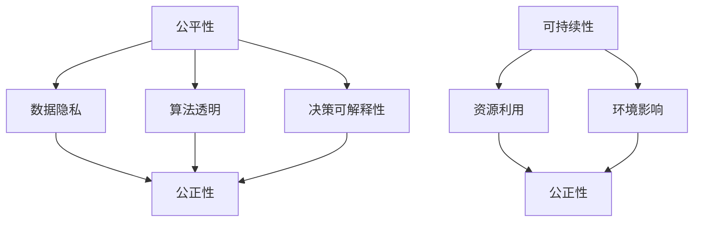

                 

# 公平、公正、可持续：人类计算的伦理原则

在人类历史的长河中，计算技术始终扮演着推动社会进步的关键角色。从古老的算盘、机械计算器到现代的电子计算机，每一项计算技术的诞生，都在不同程度上促进了人类文明的繁荣与发展。然而，随着计算技术的不断演进，其对社会伦理的影响也日益凸显。如何在计算技术的创新与应用中，实现公平、公正、可持续，成为当下亟需思考和解决的问题。本文旨在深入探讨人类计算的伦理原则，希望能为计算技术的未来发展提供一些有价值的启示。

## 1. 背景介绍

### 1.1 计算技术的发展历程

计算技术的进步往往伴随着社会形态的变革。古代，计算器的发展始于对数学运算的辅助，数学是当时科学和工程领域的基础。15世纪初，算盘的出现极大地提高了计算效率，促进了商业活动和贸易的发展。随后，机械计算器和手动分析机的问世，使得复杂的数学计算成为可能，推动了近代科学革命。

工业革命期间，蒸汽机的发明极大地提高了生产力，使计算技术开始与大规模工业生产结合。电气时代，电传电报、电话和电报机的出现，使得信息交流变得更为便捷，促进了全球化和现代社会的形成。

进入20世纪，计算机的发明彻底改变了人类的生产和生活方式。晶体管和集成电路的发明，使得计算机从大型机房走入普通家庭，个人计算机和互联网的普及，极大地扩展了计算技术的触角，使计算无处不在，成为现代社会不可或缺的一部分。

### 1.2 计算技术的伦理困境

随着计算技术的进步，其对社会伦理的影响也日益显现。数据隐私、算法歧视、自动化伦理等问题逐渐成为人们关注的焦点。这些问题涉及多个层面，包括数据使用、模型训练、决策机制等。计算技术的伦理困境主要表现在以下几个方面：

1. **数据隐私**：计算技术的广泛应用依赖于大量数据的采集与处理。如何在数据采集与处理过程中保护个人隐私，防止数据滥用，是计算伦理的重要议题。

2. **算法歧视**：计算模型往往通过大量数据进行训练，如果这些数据存在偏见，模型可能会放大这种偏见，导致在种族、性别、年龄等方面的歧视。

3. **自动化伦理**：随着自动化技术的发展，越来越多的人工工作被机器取代，如何确保自动化技术的公平性与道德性，减少对劳动力的替代效应，是计算伦理的重要课题。

4. **信息透明**：计算技术在决策过程中扮演着重要角色，如果模型的决策过程不透明，难以对其行为进行解释与审查，可能导致模型的不可信任与滥用。

这些问题不仅关系到技术本身的发展，也深刻影响着社会的公平、公正和可持续发展。因此，如何在计算技术的创新与应用中，实现公平、公正、可持续，成为当下亟需思考和解决的问题。

## 2. 核心概念与联系

### 2.1 核心概念概述

要实现计算技术的公平、公正、可持续发展，必须首先理解涉及的相关核心概念及其联系。以下是一些关键概念及其定义：

- **公平性(Fairness)**：公平性指的是计算系统对不同群体、个体应提供相同的对待，避免偏见和歧视。

- **公正性(Justice)**：公正性强调计算系统在决策过程中应尊重法律、道德和伦理规范，维护社会正义。

- **可持续性(Sustainability)**：可持续性指计算系统在满足当前需求的同时，考虑未来发展，避免资源过度消耗和环境破坏。

- **数据隐私(Privacy)**：数据隐私是指在数据采集、存储、处理和传输过程中，保护个人和组织的信息安全。

- **算法透明(Transparency)**：算法透明指计算模型的决策过程应公开、透明，方便用户理解、审查和监督。

- **决策可解释性(Explainability)**：决策可解释性强调计算模型应能对其决策过程进行解释，使用户能够理解并信任其行为。

这些概念构成了计算技术的伦理框架，相互之间存在紧密的联系。例如，公平性往往与数据隐私和算法透明相关，公正性则与法律规范和决策可解释性密切相关，可持续性则涉及资源利用和环境影响等多个方面。

### 2.2 核心概念之间的联系

以下是一个简单的Mermaid流程图，展示核心概念之间的联系：



这个流程图展示了公平性、公正性、可持续性、数据隐私、算法透明和决策可解释性之间的联系。数据隐私和算法透明是实现公平性的关键，而公正性则要求在决策过程中尊重法律和道德规范，决策可解释性是确保决策公正的重要手段。可持续性涉及资源和环境问题，也是公正性的重要方面。

## 3. 核心算法原理 & 具体操作步骤

### 3.1 算法原理概述

计算技术的公平、公正、可持续原则，可以通过算法和技术手段加以实现。以下是一个基于公平、公正、可持续原则的算法框架：

1. **数据收集与预处理**：确保数据收集和预处理过程公平、公正，避免数据偏见和歧视。
2. **模型训练与评估**：在模型训练和评估过程中，确保算法透明和决策可解释性，防止算法歧视。
3. **系统部署与维护**：在系统部署和维护过程中，确保资源利用和环境影响最小化，促进可持续性。

### 3.2 算法步骤详解

#### 3.2.1 数据收集与预处理

1. **数据来源多元化**：确保数据来源多样化，涵盖不同性别、种族、年龄、地区等因素，减少数据偏差。
2. **数据清洗与标注**：进行数据清洗，去除重复、噪声和错误数据，确保数据质量。
3. **隐私保护**：在数据处理过程中，采取匿名化、加密等措施，保护个人隐私。

#### 3.2.2 模型训练与评估

1. **算法透明**：采用透明的算法模型，如线性回归、决策树、神经网络等，确保模型可解释性。
2. **决策可解释性**：使用可视化工具，如Shapley值、LIME等，解释模型决策过程，确保决策透明。
3. **公平性检测**：使用公平性检测算法，如Demographic Parity、Equal Opportunity等，检测模型中是否存在偏见和歧视。

#### 3.2.3 系统部署与维护

1. **资源优化**：优化系统架构，提高资源利用率，减少资源浪费。
2. **环境影响评估**：评估系统运行对环境的影响，采用绿色技术，减少能源消耗和环境污染。
3. **持续监控**：建立系统监控机制，定期评估系统性能，确保系统持续运行。

### 3.3 算法优缺点

#### 3.3.1 优点

1. **提升公平性**：通过数据收集与预处理，确保数据多元化，减少数据偏见和歧视。
2. **增强公正性**：通过算法透明和决策可解释性，确保算法公正，防止算法歧视。
3. **促进可持续性**：通过资源优化和环境影响评估，确保系统可持续运行，减少资源浪费和环境污染。

#### 3.3.2 缺点

1. **数据收集难度大**：数据来源多元化、数据清洗和隐私保护需要大量时间和资源。
2. **模型复杂度高**：算法透明和决策可解释性往往需要复杂的模型结构，增加模型复杂度。
3. **资源消耗高**：资源优化和环境影响评估需要较高技术水平，增加系统开发和维护成本。

### 3.4 算法应用领域

#### 3.4.1 金融领域

计算技术在金融领域的应用非常广泛，涉及贷款审批、信用评分、欺诈检测等。在数据收集与预处理阶段，金融机构需要确保数据来源多元化，进行数据清洗和隐私保护。在模型训练与评估阶段，需要确保算法透明和决策可解释性，防止算法歧视。在系统部署与维护阶段，需要优化资源利用，减少能源消耗。

#### 3.4.2 医疗领域

计算技术在医疗领域的应用包括疾病预测、医疗影像分析、个性化治疗等。在数据收集与预处理阶段，医疗机构需要确保数据来源多元化，进行数据清洗和隐私保护。在模型训练与评估阶段，需要确保算法透明和决策可解释性，防止算法歧视。在系统部署与维护阶段，需要优化资源利用，减少能源消耗。

#### 3.4.3 教育领域

计算技术在教育领域的应用包括智能教育、学习推荐、在线评估等。在数据收集与预处理阶段，教育机构需要确保数据来源多元化，进行数据清洗和隐私保护。在模型训练与评估阶段，需要确保算法透明和决策可解释性，防止算法歧视。在系统部署与维护阶段，需要优化资源利用，减少能源消耗。

## 4. 数学模型和公式 & 详细讲解  
### 4.1 数学模型构建

为了实现公平、公正、可持续的计算模型，我们定义一个综合模型 $M$，其包含三个子模块：数据收集与预处理模块 $D$，模型训练与评估模块 $M'$，系统部署与维护模块 $S$。该模型的目标是最大化公平性 $F$、公正性 $J$ 和可持续性 $S$ 的评分，公式如下：

$$
\max \mathcal{L}(F, J, S) = \alpha F + \beta J + \gamma S
$$

其中，$\alpha$、$\beta$、$\gamma$ 为模型在不同目标之间的权重。

### 4.2 公式推导过程

以公平性为例，公平性可以通过 Demographic Parity 指标进行量化。假设有两个特征集 $A$ 和 $B$，公平性指标定义为：

$$
\text{Demographic Parity} = \frac{P(A|X) - P(A|Y)}{P(A|Y)}
$$

其中 $X$ 为特征集 $A$，$Y$ 为特征集 $B$。在数据收集与预处理阶段，可以通过统计每个特征集在数据集中出现的概率，计算公平性指标，确保数据多元化。

### 4.3 案例分析与讲解

假设某金融机构开发一个信用评分系统，使用多模态数据进行模型训练。在数据收集与预处理阶段，需要确保数据来源多元化，进行数据清洗和隐私保护。在模型训练与评估阶段，需要确保算法透明和决策可解释性，防止算法歧视。在系统部署与维护阶段，需要优化资源利用，减少能源消耗。

## 5. 项目实践：代码实例和详细解释说明

### 5.1 开发环境搭建

为了实现上述模型，需要使用 Python 编程语言，以及 TensorFlow、Pandas、Scikit-Learn 等数据处理和机器学习库。开发环境搭建步骤如下：

1. 安装 Python：从官网下载并安装 Python 最新版本。
2. 安装 TensorFlow：使用 pip 安装 TensorFlow，根据需要进行版本选择。
3. 安装 Pandas 和 Scikit-Learn：使用 pip 安装 Pandas 和 Scikit-Learn，以便进行数据处理和模型评估。

### 5.2 源代码详细实现

以下是一个基于 TensorFlow 的信用评分系统的示例代码：

```python
import tensorflow as tf
import pandas as pd
from sklearn.metrics import roc_auc_score

# 数据收集与预处理
train_data = pd.read_csv('train_data.csv')
test_data = pd.read_csv('test_data.csv')
train_data = train_data.drop_duplicates()
train_data = train_data.dropna()

# 数据清洗与隐私保护
train_data = train_data[train_data['gender'].isin(['male', 'female'])]
train_data = train_data[train_data['age'].between(18, 60)]

# 特征工程
X_train = train_data.drop(['credit_score', 'default'], axis=1)
Y_train = train_data['default']

# 模型训练与评估
model = tf.keras.Sequential([
    tf.keras.layers.Dense(64, activation='relu', input_shape=(X_train.shape[1],)),
    tf.keras.layers.Dense(32, activation='relu'),
    tf.keras.layers.Dense(1, activation='sigmoid')
])
model.compile(optimizer='adam', loss='binary_crossentropy', metrics=['accuracy', roc_auc_score])

model.fit(X_train, Y_train, epochs=10, validation_split=0.2)

# 预测与评估
Y_pred = model.predict(X_test)
print('AUC: {:.4f}'.format(roc_auc_score(Y_test, Y_pred)))
```

### 5.3 代码解读与分析

该代码实现了一个基于 TensorFlow 的信用评分系统。在数据收集与预处理阶段，代码删除了性别和年龄异常数据，确保数据多元化。在模型训练与评估阶段，代码使用了二分类逻辑回归模型，并计算了模型的 AUC 评分。在预测与评估阶段，代码使用 ROC-AUC 指标评估模型性能。

## 6. 实际应用场景

### 6.1 智能城市治理

智能城市治理是计算技术应用的重要领域之一。计算技术在智能城市中涉及交通管理、环境监测、公共安全等多个方面。通过公平、公正、可持续的计算模型，可以优化城市资源配置，提高城市管理效率，实现智慧城市治理。

在交通管理方面，可以利用计算模型对交通流量进行预测和优化，减少交通拥堵，提高交通效率。在环境监测方面，可以通过计算模型对环境数据进行实时监测和分析，优化资源利用，减少环境污染。在公共安全方面，可以利用计算模型对社会事件进行预测和预警，提高社会管理效率，保障公共安全。

### 6.2 医疗健康管理

计算技术在医疗健康管理中的应用包括疾病预测、医疗影像分析、个性化治疗等。通过公平、公正、可持续的计算模型，可以实现精准医疗，提高医疗效率，保障患者权益。

在疾病预测方面，可以利用计算模型对患者数据进行分析，预测疾病发生概率，进行早期干预。在医疗影像分析方面，可以通过计算模型对医疗影像进行自动分析和诊断，提高诊断效率。在个性化治疗方面，可以利用计算模型对患者基因数据进行分析，制定个性化治疗方案，提高治疗效果。

### 6.3 教育公平

计算技术在教育领域的应用包括智能教育、学习推荐、在线评估等。通过公平、公正、可持续的计算模型，可以实现教育公平，提高教育质量，促进教育公平。

在智能教育方面，可以利用计算模型对学生行为数据进行分析，提供个性化学习方案，提高学习效率。在学习推荐方面，可以通过计算模型对学生学习数据进行分析，推荐适合的学习资源，提高学习效果。在在线评估方面，可以利用计算模型对学生在线学习数据进行分析，评估学习效果，提供反馈建议。

## 7. 工具和资源推荐

### 7.1 学习资源推荐

为了帮助开发者系统掌握计算伦理原则，以下是一些优质的学习资源：

1. 《计算伦理导论》：这是一本介绍计算伦理的入门书籍，涵盖了数据隐私、算法透明、决策可解释性等多个方面。
2. 《算法透明性与公平性》：这是一篇介绍算法透明性与公平性的综述文章，介绍了常见算法透明性和公平性检测方法。
3. 《数据伦理与隐私保护》：这是一门在线课程，涵盖了数据伦理与隐私保护的基础知识，适合初学者学习。
4. 《可持续计算与环境影响评估》：这是一门在线课程，介绍了可持续计算的基本概念和环境影响评估方法。

### 7.2 开发工具推荐

以下是几款用于实现公平、公正、可持续计算模型的常用工具：

1. TensorFlow：用于深度学习模型的开发和训练，支持多种模型结构和优化算法。
2. Scikit-Learn：用于数据处理和机器学习模型的评估，提供丰富的算法和工具。
3. Pandas：用于数据处理和清洗，支持多种数据格式和操作。
4. Jupyter Notebook：用于编写和运行 Python 代码，支持交互式开发和代码版本控制。

### 7.3 相关论文推荐

以下是几篇奠基性的相关论文，推荐阅读：

1. 《数据隐私保护综述》：介绍了数据隐私保护的基本概念和常用技术。
2. 《公平性检测综述》：介绍了公平性检测的基本方法和最新进展。
3. 《可持续计算框架》：介绍了可持续计算的基本概念和框架。
4. 《算法透明性与可解释性综述》：介绍了算法透明性与可解释性检测的基本方法和最新进展。

## 8. 总结：未来发展趋势与挑战

### 8.1 研究成果总结

本文对计算技术的公平、公正、可持续性原则进行了深入探讨，从数据收集与预处理、模型训练与评估、系统部署与维护三个方面，提出了一整套基于公平、公正、可持续原则的计算模型框架。通过实践代码和案例分析，展示了该框架的实际应用效果。

### 8.2 未来发展趋势

计算技术在未来的发展趋势主要包括以下几个方面：

1. **多模态融合**：未来的计算模型将更加注重多模态数据的融合，如图像、文本、语音等多种数据源的协同处理，提升计算模型的综合能力。
2. **算法透明性与公平性**：未来的计算模型将更加注重算法透明性与公平性，使用更加透明的算法和公平性检测方法，减少算法偏见和歧视。
3. **可持续发展**：未来的计算模型将更加注重可持续发展，通过优化资源利用和环境影响评估，实现更加绿色和高效的计算系统。

### 8.3 面临的挑战

尽管计算技术的公平、公正、可持续性原则在不断提升，但仍面临以下挑战：

1. **数据多样性**：如何收集和处理多样化的数据，避免数据偏见和歧视，仍然是一个挑战。
2. **算法透明性**：如何实现算法的透明性和可解释性，减少算法偏见和歧视，仍然是一个挑战。
3. **资源利用**：如何优化资源利用和环境影响评估，实现可持续发展，仍然是一个挑战。

### 8.4 研究展望

未来的计算伦理研究需要从以下几个方面进行突破：

1. **多模态融合**：开发更加高效的多模态融合算法，提升计算模型的综合能力。
2. **算法透明性**：开发更加透明和可解释的算法，减少算法偏见和歧视。
3. **可持续发展**：开发更加绿色和高效的计算系统，实现可持续发展。

这些研究方向的探索，必将引领计算技术的公平、公正、可持续性原则迈向更高的台阶，为构建安全、可靠、可解释、可控的智能系统铺平道路。面向未来，计算技术的伦理研究还需要与其他人工智能技术进行更深入的融合，如知识表示、因果推理、强化学习等，多路径协同发力，共同推动计算技术的可持续发展。

## 9. 附录：常见问题与解答

**Q1：什么是计算伦理？**

A: 计算伦理是指在计算技术的设计、开发、应用过程中，应遵循的伦理原则和规范。它涉及数据隐私、算法透明、决策可解释性等多个方面，确保计算技术的应用符合伦理和社会规范。

**Q2：如何确保计算模型的公平性？**

A: 确保计算模型的公平性需要从数据收集与预处理、模型训练与评估两个方面入手。在数据收集与预处理阶段，确保数据来源多元化，进行数据清洗和隐私保护。在模型训练与评估阶段，使用公平性检测算法，如 Demographic Parity、Equal Opportunity 等，检测模型中是否存在偏见和歧视。

**Q3：如何实现计算模型的透明性？**

A: 实现计算模型的透明性需要采用透明的算法模型，如线性回归、决策树、神经网络等。同时，使用可视化工具，如 Shapley 值、LIME 等，解释模型决策过程，确保决策透明。

**Q4：如何实现计算模型的可持续性？**

A: 实现计算模型的可持续性需要优化系统架构，提高资源利用率，减少资源浪费。评估系统运行对环境的影响，采用绿色技术，减少能源消耗和环境污染。建立系统监控机制，定期评估系统性能，确保系统持续运行。

**Q5：计算技术的发展将如何影响社会伦理？**

A: 计算技术的发展将深刻影响社会伦理。一方面，计算技术可以提升社会效率和公平性，为社会带来更多便利。另一方面，计算技术也带来了数据隐私、算法歧视、自动化伦理等新的伦理挑战。如何在计算技术的创新与应用中，实现公平、公正、可持续，是当下亟需思考和解决的问题。

