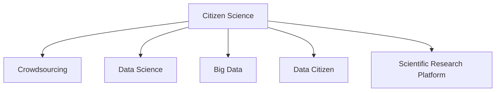

                 

# 公民科学：公众参与科学研究的新模式

## 1. 背景介绍

### 1.1 问题由来
随着科技的飞速发展，科学研究的广度和深度不断拓展，科学家的工作内容日益复杂，难以独立完成。与此同时，互联网的普及使得公众获取信息、参与讨论更加方便。这种背景下，公众参与科学研究成为可能，公民科学（Citizen Science）应运而生。

### 1.2 问题核心关键点
公民科学是指通过网络平台，将大众的力量引入到科学研究的各个环节，包括数据收集、实验设计、数据分析等。这种模式不仅能够缩短科研周期，降低研究成本，还能够让普通公众更多地接触到科研过程，激发公众对科学的兴趣和参与热情，增强科学研究的普惠性和包容性。

公民科学的实践形式多种多样，包括通过手机APP收集数据、在线参与科学实验、合作研究等。近年来，多个领域的科研项目已经成功应用公民科学方法，取得了显著成果。

### 1.3 问题研究意义
公民科学的发展具有重要的研究意义：

1. **降低科研成本**：公民科学通过利用大众参与，极大地降低了科研的成本和周期。
2. **提升科研效率**：公众的力量可以迅速扩大数据采集规模，提高科研数据的丰富度和准确度。
3. **增强公众参与**：公民科学让公众更多地参与科研过程，提高了公众对科学的兴趣和理解。
4. **促进科学研究普及**：公民科学将科研变得更加开放透明，增加了公众对科学研究的信任度。
5. **推动科学民主化**：通过广泛征求公众意见，科学研究过程更加民主化，科学决策更加公正。

## 2. 核心概念与联系

### 2.1 核心概念概述

为了更好地理解公民科学的模式和流程，本节将介绍几个关键概念：

- **公民科学**：利用网络平台，将公众引入到科学研究的各个环节，包括数据收集、实验设计、数据分析等。
- **众包**：通过网络平台，将任务分解成小单元，分配给不同个体或团队完成，以降低成本和提高效率。
- **数据科学**：利用数据技术和统计学方法，从大量数据中提取知识和洞见，支撑科研决策。
- **大数据**：指规模巨大、复杂多样的数据集，具有处理难度大、应用广泛的特点。
- **数据公民**：指参与数据收集和分析的公众，具有数据素养和对科学的兴趣。
- **科学研究平台**：提供数据采集、实验设计、数据分析等科研工具的平台，如Zooniverse、Ecosphere等。

这些概念之间的逻辑关系可以通过以下Mermaid流程图来展示：



这个流程图展示出公民科学的核心概念及其相互关系：

1. **Citizen Science**：以众包、数据科学、大数据为技术手段，依托数据公民参与。
2. **Crowdsourcing**：通过平台分配任务，利用大众力量完成科研任务。
3. **Data Science**：利用数据技术和统计学方法，从数据中提取知识和洞见。
4. **Big Data**：提供数据采集和分析的基础，支撑科研决策。
5. **Data Citizen**：通过参与数据收集和分析，提升公众的数据素养和对科学的兴趣。
6. **Scientific Research Platform**：提供科研工具和平台，支持公众参与和科研合作。

## 3. 核心算法原理 & 具体操作步骤

### 3.1 算法原理概述

公民科学的本质是利用网络平台，将科研任务分解成小单元，分配给不同个体或团队完成。通过这种方式，可以有效降低科研成本，提升科研效率，增强公众参与。

### 3.2 算法步骤详解

公民科学的实施流程一般包括以下几个关键步骤：

1. **任务分解**：将科研任务分解为多个小任务，确保每个任务独立且易于完成。
2. **任务分配**：将小任务分配给大众，可以通过在线平台进行任务管理和调度。
3. **数据采集**：参与者根据任务要求，收集并提交数据。数据可以是照片、视频、样本等。
4. **数据审核**：科研人员对提交的数据进行审核和筛选，确保数据质量和一致性。
5. **数据分析**：利用数据科学方法，对收集的数据进行分析，提取科研洞见。
6. **结果发布**：将科研结果公开发布，供公众查阅和讨论。

### 3.3 算法优缺点

公民科学的优势包括：

1. **成本低**：通过利用大众力量，极大地降低了科研成本和周期。
2. **效率高**：大规模的数据采集和分析可以显著提升科研效率。
3. **参与广**：增加了公众对科学研究的参与度，增强了科学研究的普惠性。
4. **数据丰富**：大规模数据采集能够提供更丰富、更准确的数据支撑。

同时，公民科学也存在一些局限性：

1. **数据质量**：参与者的数据素养和责任心不同，可能导致数据质量参差不齐。
2. **隐私问题**：大规模数据采集和共享可能涉及隐私保护问题。
3. **信任问题**：科研人员和参与者之间的信任关系需要建立和维护。
4. **技术门槛**：参与者需要一定的数据技术和统计学知识，可能存在一定的技术门槛。
5. **平台依赖**：参与者高度依赖于科研平台，平台的技术稳定性和用户体验影响参与度。

### 3.4 算法应用领域

公民科学已经广泛应用于多个科研领域，包括：

- **天文学**：通过手机APP收集星体照片，参与星系分类、行星搜索等任务。
- **生物学**：在自然保护区收集物种数据，参与生物多样性研究、生态系统监测等。
- **环境科学**：监测水质、空气质量等环境参数，参与气候变化研究、生态保护等。
- **医学**：收集患者健康数据，参与疾病流行病学研究、药物临床试验等。
- **地理科学**：收集地形、植被等数据，参与地球科学研究、地质灾害监测等。

此外，公民科学还在教育、社会科学、公共卫生等领域展现出广泛的应用前景。

## 4. 数学模型和公式 & 详细讲解 & 举例说明

### 4.1 数学模型构建

公民科学的数学模型可以从数据采集、数据审核、数据分析三个方面进行建模。

1. **数据采集模型**：定义数据采集任务，每个任务的完成度可以通过参与者提交的样本数量和质量来衡量。
2. **数据审核模型**：利用数据审核算法，对提交的数据进行筛选和标注，确保数据的一致性和可靠性。
3. **数据分析模型**：通过统计学方法和机器学习算法，对收集的数据进行分析，提取科研洞见。

### 4.2 公式推导过程

以天文学为例，描述公民科学的数据采集和审核过程。

1. **数据采集模型**：
   - 任务：收集某星座内所有明亮星体的照片
   - 参与者：每颗星体照片采集任务分配给多个参与者
   - 完成度：用提交的星体照片数量占总任务数的比例表示
   $$
   \text{完成度} = \frac{\text{提交的星体照片数}}{\text{总任务数}}
   $$

2. **数据审核模型**：
   - 审核算法：利用机器学习模型对提交的照片进行标注，标记为“有效”或“无效”
   - 审核结果：有效照片数占总任务数的比例
   $$
   \text{审核结果} = \frac{\text{有效照片数}}{\text{总任务数}}
   $$

3. **数据分析模型**：
   - 统计学方法：计算星体亮度、位置等参数的平均值和方差
   - 机器学习算法：利用深度学习模型对星体进行分类和聚类
   - 科研洞见：基于统计结果和机器学习模型，分析星体运动规律、星团结构等

### 4.3 案例分析与讲解

**案例：天文学中的Zooniverse项目**

Zooniverse是一个开源的科研平台，通过公民科学方法，收集和分析来自全球公众的星体照片数据。该平台采用了众包和数据审核相结合的方式，实现了大规模星体分类和搜索任务。

具体流程如下：

1. **任务分解**：将星体分类任务分解为多个小任务，每个任务独立且易于完成。
2. **任务分配**：通过Zooniverse平台将任务分配给参与者，并提供在线工具辅助任务完成。
3. **数据采集**：参与者利用手机相机拍摄星体照片，并上传到Zooniverse平台。
4. **数据审核**：科研人员对提交的照片进行审核，标记为“有效”或“无效”。
5. **数据分析**：利用机器学习算法对有效照片进行分析，提取星体分类信息。
6. **结果发布**：将分析结果公开发布，供公众查阅和讨论。

通过Zooniverse平台，Zooniverse项目已经收集了数百万张星体照片，标注了超过10万个星体，并在多个科研论文中发表了相关研究成果。

## 5. 项目实践：代码实例和详细解释说明

### 5.1 开发环境搭建

进行公民科学项目开发，需要搭建相应的开发环境。以下是Python环境配置流程：

1. 安装Anaconda：从官网下载并安装Anaconda，用于创建独立的Python环境。
2. 创建并激活虚拟环境：
```bash
conda create -n citizen-science python=3.8 
conda activate citizen-science
```

3. 安装依赖库：
```bash
pip install requests scipy pandas scikit-learn
```

4. 安装Zooniverse API：
```bash
pip install zooniverse-api
```

完成上述步骤后，即可在`citizen-science`环境中开始公民科学项目的开发。

### 5.2 源代码详细实现

以一个简单的天文学数据采集项目为例，展示如何利用Python实现公民科学任务的分配和数据审核。

1. **数据采集任务**：
```python
import requests

# 定义数据采集任务
def collect_star_photos(star_name):
    # 分配任务给参与者
    task_id = requests.post('http://zooniverse-api.com/tasks', data={'name': star_name, 'type': 'star_photos'})
    
    # 任务完成后的处理
    def submit_photos():
        # 参与者提交照片
        response = requests.post('http://zooniverse-api.com/photos', data={'name': star_name, 'photos': photo_files})
        
        # 审核照片并标注
        if response.status_code == 200:
            print(f"Task {task_id} completed with {response.data['photos']} photos")
        else:
            print(f"Failed to complete task {task_id}")
    
    # 启动数据采集任务
    submit_photos()
```

2. **数据审核模型**：
```python
import requests
from scipy import stats

# 定义数据审核模型
def review_photos(star_name, photos):
    # 获取提交的照片
    response = requests.get('http://zooniverse-api.com/photos', params={'name': star_name})
    
    # 数据审核
    valid_photos = []
    invalid_photos = []
    for photo in response.json():
        if photo['quality'] > 0.8:
            valid_photos.append(photo['filename'])
        else:
            invalid_photos.append(photo['filename'])
    
    # 数据统计
    num_valid = len(valid_photos)
    num_invalid = len(invalid_photos)
    
    # 输出审核结果
    print(f"Review results: {num_valid} valid, {num_invalid} invalid")
    print(f"Valid photos: {', '.join(valid_photos)}")
    print(f"Invalid photos: {', '.join(invalid_photos)}")
    
    # 计算审核结果的置信区间
    confidence_interval = stats.t.interval(0.95, num_valid - 1, loc=num_valid, scale=stats.sem(num_valid))
    print(f"Confidence interval: {confidence_interval}")
```

### 5.3 代码解读与分析

让我们再详细解读一下关键代码的实现细节：

**数据采集任务**：
- `collect_star_photos`函数：定义数据采集任务，并通过API将任务分配给参与者。
- `submit_photos`函数：参与者提交照片，并进行审核和标注。

**数据审核模型**：
- `review_photos`函数：获取提交的照片，进行审核和标注，并输出审核结果和置信区间。
- `requests`库：用于与Zooniverse API进行通信，获取和提交数据。
- `scipy`库：用于统计学计算，计算审核结果的置信区间。

这些代码展示了如何使用Python实现公民科学项目的任务分配和数据审核。开发者可以根据具体任务需求，进一步优化和扩展代码，以实现更复杂的公民科学项目。

## 6. 实际应用场景

### 6.1 天文观测项目

天文学领域的公民科学项目已经取得了显著成果。例如，Citizen Sky项目通过众包收集了数百万张星体照片，帮助科学家发现了多个新天体。

**应用场景**：
- 收集银河系中恒星和星团的照片
- 对照片进行标注和分类
- 分析星体运动规律和星团结构

**技术实现**：
- 利用Zooniverse平台进行任务分配和数据审核
- 利用深度学习模型进行星体分类和聚类

### 6.2 海洋生物多样性监测

海洋生物多样性监测是公民科学的重要应用领域。通过众包收集海洋生物照片，科学家可以实时监测海洋生态系统变化。

**应用场景**：
- 收集海洋生物照片，如珊瑚、鱼类等
- 标注照片中的生物种类和数量
- 分析生物多样性变化趋势

**技术实现**：
- 利用众包平台收集海洋生物照片
- 利用机器学习模型进行生物种类标注和分类

### 6.3 地球环境监测

地球环境监测需要大量数据来支撑科研决策。通过公民科学项目，可以收集全球各地的环境数据，如水质、空气质量等。

**应用场景**：
- 监测全球水质变化
- 分析空气质量变化趋势
- 评估气候变化对环境的影响

**技术实现**：
- 利用众包平台收集环境数据
- 利用统计学方法分析环境变化趋势

### 6.4 未来应用展望

随着科技的不断发展，公民科学将在更多领域得到应用，带来深远的影响：

1. **科学研究普及**：公民科学让更多公众参与科研，提高了科学研究的普惠性。
2. **数据采集多样化**：公众可以通过多种方式参与数据采集，如手机相机、无人机等。
3. **科研决策民主化**：公众参与科研决策，提高了科研决策的公正性和透明度。
4. **科学教育普及**：通过公民科学项目，可以普及科学知识，提高公众的科学素养。
5. **跨学科融合**：公民科学可以与多个学科结合，提升科研的综合性和创新性。

## 7. 工具和资源推荐

### 7.1 学习资源推荐

为了帮助开发者掌握公民科学的相关技术，这里推荐一些优质的学习资源：

1. **Coursera《数据科学导论》**：由斯坦福大学教授讲授，介绍了数据科学的基本概念和实践技能。
2. **edX《公民科学导论》**：由麻省理工学院教授讲授，介绍了公民科学的基本原理和方法。
3. **Zooniverse官方文档**：提供了Zooniverse平台的详细介绍和开发指南，适合开发和应用公民科学项目。
4. **Open Science Framework**：提供了科研项目的管理和合作平台，支持公民科学项目的管理和展示。

通过这些资源的学习，相信你一定能够快速掌握公民科学的精髓，并用于解决实际的科研问题。

### 7.2 开发工具推荐

高效的开发离不开优秀的工具支持。以下是几款用于公民科学项目开发的常用工具：

1. **Zooniverse平台**：提供数据采集、任务分配和数据审核等功能的平台，适合公民科学项目的开发和应用。
2. **Google Colab**：免费的在线Jupyter Notebook环境，适合快速迭代和开发公民科学项目。
3. **TensorFlow**：谷歌主导的深度学习框架，支持分布式计算和大规模数据处理。
4. **Kaggle**：数据科学和机器学习的竞赛平台，提供了丰富的数据集和模型评估工具，适合公民科学项目的验证和优化。

合理利用这些工具，可以显著提升公民科学项目的开发效率，加速创新迭代的步伐。

### 7.3 相关论文推荐

公民科学的发展离不开学界的持续研究。以下是几篇奠基性的相关论文，推荐阅读：

1. **Crowdsourced Astronomy: A Systematic Review of the Status Quo and Future Directions**：系统回顾了众包天文学的发展现状和未来方向。
2. **Crowdsourcing Science: Opportunities and Challenges for the New Decade**：探讨了众包科学的机会和挑战，展望了未来发展方向。
3. **Citizen Science: Where Has It Come From and Where Might It Go**：回顾了公民科学的发展历程和未来趋势，提出了新的研究方向和挑战。

这些论文代表了大公民科学的发展脉络。通过学习这些前沿成果，可以帮助研究者把握学科前进方向，激发更多的创新灵感。

## 8. 总结：未来发展趋势与挑战

### 8.1 总结

本文对公民科学的方法和应用进行了全面系统的介绍。首先阐述了公民科学的背景和研究意义，明确了公民科学在降低科研成本、提升科研效率、增强公众参与等方面的独特价值。其次，从原理到实践，详细讲解了公民科学的数学模型和操作步骤，给出了公民科学项目开发的完整代码实例。同时，本文还广泛探讨了公民科学在多个科研领域的应用前景，展示了公民科学范式的巨大潜力。此外，本文精选了公民科学的各类学习资源，力求为读者提供全方位的技术指引。

通过本文的系统梳理，可以看到，公民科学的发展具有广阔的前景，将极大地拓展科研的普惠性和包容性。公民科学的方法不仅能够降低科研成本，提升科研效率，还能够增强公众对科学的兴趣和参与度，推动科学研究的民主化。未来，伴随公民科学的不断发展，科研将变得更加开放透明，科研决策将更加公正合理，公众对科学研究的信任度将进一步提高。

### 8.2 未来发展趋势

展望未来，公民科学的趋势如下：

1. **技术进步**：随着人工智能和机器学习技术的不断发展，公民科学将更加高效和智能化。
2. **数据多样化**：公民科学将结合多种数据源，提高数据的多样性和丰富度。
3. **参与广泛**：更多公众将参与到公民科学项目中，提高科研的普惠性和包容性。
4. **科研民主化**：公众参与科研决策，提高科研的公正性和透明度。
5. **跨学科融合**：公民科学将与多个学科结合，提升科研的综合性和创新性。

### 8.3 面临的挑战

尽管公民科学已经取得了显著成果，但在迈向更加智能化、普适化应用的过程中，它仍面临诸多挑战：

1. **数据质量**：参与者的数据素养和责任心不同，可能导致数据质量参差不齐。
2. **隐私保护**：大规模数据采集和共享可能涉及隐私保护问题。
3. **平台依赖**：参与者高度依赖于科研平台，平台的技术稳定性和用户体验影响参与度。
4. **技术门槛**：参与者需要一定的数据技术和统计学知识，可能存在一定的技术门槛。
5. **信任问题**：科研人员和参与者之间的信任关系需要建立和维护。

### 8.4 研究展望

未来，公民科学的重点方向包括：

1. **数据质量提升**：研究如何提高公众的数据素养和责任感，提升数据质量。
2. **隐私保护**：研究如何在保障数据隐私的前提下，实现大规模数据共享。
3. **平台设计**：研究如何设计高效、易用的科研平台，提高公众的参与度和满意度。
4. **跨学科融合**：研究如何与其他学科结合，提升科研的综合性和创新性。
5. **科研民主化**：研究如何增强公众对科研的参与度，推动科研决策的民主化。

这些研究方向将推动公民科学向更加智能化、普适化的方向发展，为公众参与科研提供更广阔的空间和更多样的机会。

## 9. 附录：常见问题与解答

**Q1：公民科学是否适用于所有科研领域？**

A: 公民科学适用于数据量大、任务分散、公众参与性高的科研领域。对于高精度、高复杂度的科研任务，可能需要专业科研人员的深度参与。

**Q2：如何提高参与者的数据素养和责任感？**

A: 通过培训、教育、激励等方式，提高公众对数据采集和分析的认知和技能，增强数据素养和责任感。

**Q3：如何保障公众的隐私和数据安全？**

A: 采用匿名化处理、数据加密等技术，保障公众的隐私和数据安全。同时建立完善的隐私保护政策，确保数据使用的透明和合规。

**Q4：如何设计高效的公民科学平台？**

A: 平台设计需要考虑用户界面友好、任务分配合理、数据审核严格等因素。可以通过用户反馈和迭代优化，不断提升平台的用户体验和参与度。

**Q5：公民科学项目如何处理数据质量问题？**

A: 通过数据审核算法，对提交的数据进行筛选和标注，确保数据的一致性和可靠性。同时利用数据增强技术，提升数据的多样性和丰富度。

这些问题的解答，将帮助开发者更好地理解和应对公民科学项目中的挑战，提升项目的成功率和影响力。

---

作者：禅与计算机程序设计艺术 / Zen and the Art of Computer Programming

