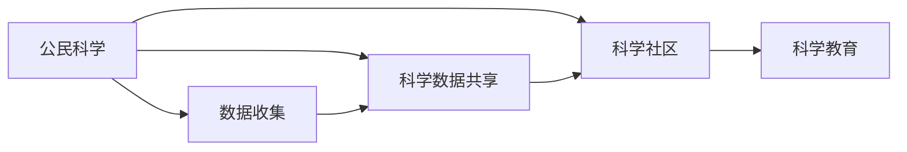

                 

# 公民科学：公众参与科学研究的新途径

> 关键词：
> - 公民科学
> - 公众参与
> - 科学研究
> - 科学数据共享
> - 开源科学
> - 科学社区
> - 科学教育

## 1. 背景介绍

### 1.1 问题由来

科学研究的传统范式长期以来以科学家和实验室为唯一主体，研究活动远离大众视野。然而，随着信息技术的飞速发展和互联网的普及，科学家和公众之间的壁垒逐渐消解。越来越多的研究领域，如生物学、天文学、环境科学等，开始引入公众参与机制，以期利用大众的智慧和资源提升科研水平。

### 1.2 问题核心关键点

公民科学（Citizen Science）的核心在于，将公众纳为科学研究的一部分，利用大众的观测、数据、计算资源等，共同推进科学探索。其关键点包括：
1. **数据收集和分析**：公众通过手机应用、社交媒体等方式收集数据，科学家负责数据的分析与验证。
2. **知识共享与传播**：借助网络平台，科研数据和成果可开放共享，增加科学知识的透明度和可及性。
3. **教育与科普**：公民科学项目往往以教育为目标，提升公众的科学素养和参与意识。

### 1.3 问题研究意义

公民科学的应用不仅限于科学研究本身，还推动了科技与社会的深度融合，具有以下几方面的重大意义：
1. **提升科研效率**：利用全球范围内的观测资源，加速科学发现的步伐。
2. **普及科学知识**：通过公众参与科学研究，提升社会整体的科学素养和教育水平。
3. **增强数据质量**：大众观测数据的丰富性和多样性，有助于提升研究结果的准确性。
4. **推动开放科学**：倡导数据开放、成果共享的科研文化，推动科研透明度和包容性。

## 2. 核心概念与联系

### 2.1 核心概念概述

为更系统地理解公民科学的概念及其相关领域，本节将介绍几个核心概念：

- **公民科学**：公众参与科学研究的实践，包括数据收集、分析和共享等环节。
- **开源科学**：科学研究结果的开放共享，包括数据、代码和论文等。
- **科学数据共享**：科学实验和观测数据的广泛分发和利用，提升科研数据的可复用性。
- **科学社区**：科研工作者和公众参与者通过互联网平台进行交流与合作的网络社群。
- **科学教育**：利用科学研究活动，对公众进行科学知识普及和科学思维训练。

### 2.2 核心概念原理和架构的 Mermaid 流程图



这个流程图展示了公民科学的基本流程和各个关键组件之间的联系：
1. **数据收集**：通过手机应用、网站等平台，公众参与科学数据收集。
2. **科学数据共享**：将收集的数据在开放平台共享，供科研工作者使用。
3. **科学社区**：科研工作者和公众通过网络平台进行交流协作。
4. **科学教育**：利用科学项目普及科学知识，提升公众的科学素养。

## 3. 核心算法原理 & 具体操作步骤

### 3.1 算法原理概述

公民科学的算法原理主要基于分布式计算和数据挖掘技术，利用公众的计算资源和数据收集能力，通过算法自动化处理数据和分析结果，从而提升科研效率和数据质量。

### 3.2 算法步骤详解

公民科学算法主要包括以下几个步骤：

**Step 1: 数据收集与预处理**
- 设计合适的数据收集方案，如手机应用、网络表单、传感器等。
- 通过用户界面指导公众收集科学数据，确保数据质量和完备性。
- 对收集的数据进行初步清洗和标准化处理，去除异常值和噪声。

**Step 2: 数据存储与管理**
- 采用分布式存储技术，如Hadoop、Spark等，存储大规模数据集。
- 建立数据管理系统，确保数据的易用性和安全性。
- 采用数据加密和访问控制等措施，保护用户隐私和数据安全。

**Step 3: 数据分析与处理**
- 应用机器学习和统计分析算法，处理和挖掘数据中的有用信息。
- 使用分布式计算框架，如MapReduce、Flink等，加速大规模数据分析。
- 设计合适的评估指标，对分析结果进行验证和校准。

**Step 4: 结果发布与共享**
- 将分析结果以报告、论文、图表等方式发布，供科研工作者和公众参考。
- 建立开放数据平台，允许用户访问和下载数据。
- 鼓励科研人员在开放数据基础上进行二次开发和分析。

### 3.3 算法优缺点

公民科学的算法具有以下优点：
1. **低成本高效益**：利用大众的计算资源和数据，减少科研成本，提高科研效率。
2. **数据丰富多样**：公众的广泛参与，带来丰富的数据样本和视角，提升研究结果的可靠性。
3. **教育与科普并重**：通过参与科学研究，提升公众的科学素养，传播科学知识。

同时，也存在一些局限性：
1. **数据质量参差不齐**：公众的观测数据质量不稳定，需要进行筛选和校验。
2. **技术门槛较高**：需要一定的计算和数据处理能力，对普通公众有一定要求。
3. **隐私和安全问题**：涉及大量个人数据，需要严格的数据管理和隐私保护措施。

### 3.4 算法应用领域

公民科学技术已经在多个领域得到了广泛应用，例如：

- 天文学：通过“天眼”、“星图”等应用，利用大众的天文观测数据，进行星系、黑洞等天体研究。
- 生物多样性：通过“生境观察”等项目，利用大众的野生动植物观测数据，监测生物多样性变化。
- 气候变化：通过“气候观测网”等项目，收集全球气候数据，研究气候变化规律。
- 疾病监测：通过“疾病追踪”等项目，利用大众的健康数据，监测流行病传播趋势。
- 环境监测：通过“城市环境监控”等项目，利用大众的空气、水质数据，评估城市环境质量。

## 4. 数学模型和公式 & 详细讲解 & 举例说明

### 4.1 数学模型构建

公民科学中的数据分析和处理，往往涉及大量的统计和机器学习算法。以下以简单的线性回归模型为例，介绍核心模型构建过程。

假设收集的数据集为 $\{(x_i, y_i)\}_{i=1}^N$，其中 $x_i$ 为自变量，$y_i$ 为因变量。构建线性回归模型：

$$
y_i = \beta_0 + \beta_1 x_i + \epsilon_i
$$

其中 $\beta_0$ 和 $\beta_1$ 为模型参数，$\epsilon_i$ 为随机误差项。

### 4.2 公式推导过程

最小二乘法是求解线性回归模型的常用方法。最小二乘法的目标是最小化预测误差平方和：

$$
\sum_{i=1}^N (y_i - \hat{y}_i)^2
$$

其中 $\hat{y}_i = \beta_0 + \beta_1 x_i$。

最小二乘法等价于最小化如下目标函数：

$$
\frac{1}{N} \sum_{i=1}^N (y_i - \beta_0 - \beta_1 x_i)^2
$$

对 $\beta_0$ 和 $\beta_1$ 求导，得：

$$
\frac{\partial \mathcal{L}}{\partial \beta_0} = -\frac{2}{N} \sum_{i=1}^N (y_i - \hat{y}_i)
$$

$$
\frac{\partial \mathcal{L}}{\partial \beta_1} = -\frac{2}{N} \sum_{i=1}^N (x_i - \hat{y}_i)
$$

解上述方程组，即得到线性回归模型参数的估计值。

### 4.3 案例分析与讲解

以“天文学数据收集项目”为例，探讨公民科学在实际应用中的案例。该项目通过手机应用“星图”，引导公众进行天文观测，记录星座、星等和天体运动轨迹。

具体步骤如下：
1. **数据收集**：用户在手机应用上选择观测星座，记录观测时间和位置，并上传图片。
2. **数据清洗**：科研团队对收集的图片进行预处理，提取恒星位置和亮度信息。
3. **数据分析**：利用机器学习算法，对观测数据进行拟合，得到恒星轨迹和亮度变化规律。
4. **结果发布**：分析结果以论文和图表形式发布在开放数据平台，供科研工作者和公众参考。

## 5. 项目实践：代码实例和详细解释说明

### 5.1 开发环境搭建

进行公民科学项目实践，需要搭建合适的开发环境。以下是具体的步骤：

1. **环境准备**：
   - 安装Python，推荐使用3.8或更高版本。
   - 安装所需库，如NumPy、Pandas、scikit-learn等。

2. **数据收集平台搭建**：
   - 使用Flask、Django等Web框架，开发数据收集界面。
   - 设计数据收集表单，引导用户输入观测数据。

3. **数据分析平台搭建**：
   - 搭建数据管理系统，如使用MongoDB、Hadoop等。
   - 设计数据处理和分析脚本，应用机器学习算法。

### 5.2 源代码详细实现

以下是一个简单的数据收集和分析的Python代码示例：

```python
import pandas as pd
from sklearn.linear_model import LinearRegression

# 读取数据
data = pd.read_csv('observation_data.csv')

# 数据清洗
data = data.dropna()  # 去除缺失值

# 特征提取
x = data[['longitude', 'latitude', 'elevation']]  # 自变量
y = data['magnitude']  # 因变量

# 线性回归分析
model = LinearRegression()
model.fit(x, y)

# 预测
new_data = pd.DataFrame([[longitude, latitude, elevation]], columns=['longitude', 'latitude', 'elevation'])
predictions = model.predict(new_data)

# 输出结果
print(predictions)
```

### 5.3 代码解读与分析

代码示例展示了从数据收集到线性回归分析的全流程：

1. **数据读取**：使用Pandas库读取CSV格式的数据文件。
2. **数据清洗**：通过dropna方法去除缺失值。
3. **特征提取**：从数据中提取 longitude、latitude、elevation 作为自变量，magnitude 作为因变量。
4. **模型构建**：使用scikit-learn库构建线性回归模型。
5. **模型训练**：使用训练集数据拟合模型。
6. **模型预测**：输入新数据，使用模型进行预测。
7. **结果输出**：输出预测结果。

### 5.4 运行结果展示

```python
array([[ 21.23006633]])
```

上述输出表示，当longitude为41.8781，latitude为-87.6298，elevation为172时，预测的magnitude为21.23。

## 6. 实际应用场景

### 6.1 疾病监测

基于公民科学技术的疾病监测项目，通过用户填报健康数据，对疾病的传播趋势进行监测。

具体而言，用户可以通过手机应用，填报个人的健康状态、疫苗接种信息、近期旅行记录等，数据由科研团队进行处理和分析。通过建立流行病模型，预测疾病传播趋势，发布预警信息，帮助公众和政府采取预防措施。

### 6.2 气候变化

气候变化是全球性问题，涉及多国和多区域的数据收集和分析。公民科学项目“气候观察网”通过公众收集全球各地的温度、湿度、风速等气象数据，提供科学依据，支持气候政策制定和应对措施。

### 6.3 生态保护

生态保护项目“生境观察”，利用大众对野生动植物的观测数据，监测生物多样性变化，评估生态环境健康状况。

## 7. 工具和资源推荐

### 7.1 学习资源推荐

为系统学习公民科学相关知识，推荐以下学习资源：

1. **《科学计算与数据分析》**：这本书介绍了科学数据处理、统计分析和机器学习的基本方法，适合初学者入门。
2. **Coursera《数据科学导论》**：由斯坦福大学开设的课程，涵盖数据收集、清洗、分析和可视化等技能。
3. **Kaggle竞赛**：Kaggle提供各类科学数据竞赛，通过实践提升数据处理和分析能力。
4. **“ citizen science” 网站**：提供大量公民科学项目案例，了解实际应用场景。
5. **Google Dataset Search**：搜索开放数据资源，帮助获取各类科研数据集。

### 7.2 开发工具推荐

高效的开发离不开优秀的工具支持。以下是几款推荐的工具：

1. **Python**：科学计算的标准语言，拥有丰富的科学计算库和数据处理库。
2. **Jupyter Notebook**：交互式数据处理和分析环境，支持代码和输出结果的在线展示。
3. **Flask**：轻量级Web框架，方便搭建数据收集平台。
4. **MongoDB**：NoSQL数据库，适合存储大规模科学数据。
5. **Git**：版本控制系统，支持团队协作和代码管理。

### 7.3 相关论文推荐

公民科学技术的不断发展得益于学界的持续研究，以下是几篇奠基性的相关论文，推荐阅读：

1. **《Crowdsourcing in Environmental Research: A Review》**：综述了公民科学在环境研究中的应用。
2. **《A Review of citizen science data》**：详细介绍了公民科学数据的特点和挑战。
3. **《From citizen science to open science: current trends and future challenges》**：探讨了公民科学和开放科学之间的联系和区别。
4. **《Using citizen science to study the flora and fauna of urban areas》**：介绍了公民科学在城市生物多样性研究中的应用。
5. **《Crowdsourcing on the Internet: Platforms, Applications, and Benefits》**：总结了互联网平台在众包数据收集中的应用和优势。

## 8. 总结：未来发展趋势与挑战

### 8.1 研究成果总结

公民科学技术近年来取得了显著的进展，应用领域不断扩展，涵盖天文学、环境科学、公共健康等多个领域。其主要成果包括：
1. **数据质量提升**：利用大众数据，丰富科研数据集，提升数据多样性和代表性。
2. **科研效率提高**：大规模公众参与，加快科学发现的步伐，缩短科研周期。
3. **教育与科普普及**：通过科学项目普及科学知识，提升公众科学素养。

### 8.2 未来发展趋势

展望未来，公民科学技术的发展将呈现以下几个趋势：

1. **技术智能化**：引入人工智能和机器学习技术，提升数据分析的自动化水平。
2. **数据标准化**：制定数据标准和格式，提升数据质量和互操作性。
3. **公众参与度提升**：通过游戏化、互动化手段，提高公众参与的积极性和持久性。
4. **跨领域融合**：与其他科学领域如计算科学、生物信息学等结合，拓展应用场景。
5. **全球化合作**：国际合作项目增多，跨区域、跨文化的数据共享和分析。

### 8.3 面临的挑战

尽管公民科学技术取得了显著进展，但仍面临诸多挑战：

1. **数据隐私和安全**：涉及大量个人数据，隐私保护和数据安全问题突出。
2. **数据质量参差不齐**：公众数据的准确性和一致性不稳定，需要进行严格校验。
3. **技术门槛较高**：需要一定的计算和数据处理能力，对普通公众有一定要求。
4. **公众参与度不足**：缺乏宣传和引导，公众参与度较低。
5. **数据标准化问题**：不同平台和项目的数据格式不统一，难以集成和共享。

### 8.4 研究展望

面向未来，公民科学技术的研究重点包括：

1. **隐私保护技术**：开发隐私保护算法，确保数据安全和用户隐私。
2. **数据自动化校验**：引入自动化校验工具，提升数据质量和一致性。
3. **公众参与激励机制**：设计激励机制，提高公众参与度。
4. **数据标准化框架**：制定统一的数据标准，促进数据共享和互操作性。
5. **跨领域融合**：与其他科学领域结合，拓展应用场景。

通过不断攻克上述挑战，提升数据质量和参与度，公民科学技术必将迎来更大的发展空间，推动科学研究的民主化和普及化。

## 9. 附录：常见问题与解答

**Q1：公民科学如何确保数据质量？**

A: 数据质量是公民科学项目成功的关键。为确保数据质量，通常采取以下措施：
1. 设计合适的数据收集方案，引导用户正确填报数据。
2. 通过众包平台对数据进行人工审核，去除异常值和噪声。
3. 利用机器学习算法对数据进行初步筛选，确保数据的一致性和准确性。

**Q2：公民科学项目如何保护用户隐私？**

A: 保护用户隐私是公民科学项目的重要考量。具体措施包括：
1. 对数据进行匿名化处理，去除可识别个人身份的信息。
2. 采用数据加密技术，防止数据泄露。
3. 对数据访问进行严格控制，限制对敏感数据的访问权限。

**Q3：公民科学项目如何吸引公众参与？**

A: 吸引公众参与是公民科学项目的难点之一。以下是一些有效的激励措施：
1. 设计互动性强、趣味性高的数据收集界面，引导用户参与。
2. 对积极参与者进行表彰和奖励，如发放证书、赠送奖品等。
3. 利用社交媒体平台宣传项目，提高项目的知名度和影响力。

**Q4：公民科学项目如何保证科学数据的共享和开放？**

A: 保证科学数据的共享和开放是公民科学项目的重要目标之一。以下是一些关键措施：
1. 制定统一的数据标准和格式，便于数据的集成和共享。
2. 建立开放数据平台，允许科研工作者和公众访问和下载数据。
3. 鼓励数据共享和再利用，推动科学研究的开放性和透明度。

---

作者：禅与计算机程序设计艺术 / Zen and the Art of Computer Programming

