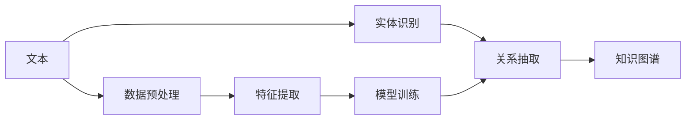

                 

# 关系抽取：从非结构化文本中提取知识

> 关键词：关系抽取, 知识图谱, 命名实体识别, 深度学习, 自然语言处理, 知识推理

## 1. 背景介绍

在当今信息爆炸的时代，数据量呈指数级增长，但大多数数据都存在于非结构化的文本形式中。如何从这些海量文本中提取出有价值的信息，构建出结构化的知识图谱，成为了数据挖掘和人工智能领域的一项重要挑战。关系抽取（Relation Extraction, RE）正是其中的一项关键技术，旨在从文本中识别实体之间的关系，从而为知识图谱构建和信息检索提供支撑。

### 1.1 关系抽取的重要性

关系抽取在信息提取和知识发现领域具有重要地位。它可以帮助我们：

- **构建知识图谱**：关系抽取的结果是知识图谱中实体之间的边，因此能够帮助我们构建出结构化的知识库，从而实现高效的查询和分析。
- **支持信息检索**：通过识别文档中的实体关系，我们可以更好地理解文档内容，提高搜索引擎和推荐系统的精准度。
- **自动化信息提取**：自动化关系抽取技术可以应用于各类文档自动标注、信息抽取等场景，降低人工成本，提高效率。

### 1.2 当前挑战

尽管关系抽取技术已经取得了显著进展，但仍面临一些挑战：

- **歧义性**：文本中的实体和关系往往具有多义性，这增加了抽取的复杂性。
- **长尾问题**：关系抽取任务中的长尾问题严重，常见关系抽取的准确率较高，但罕见关系的抽取效果往往较差。
- **跨领域适应性**：现有的关系抽取方法往往局限于特定领域，泛化能力有限。

为了克服这些挑战，我们需要结合最新的深度学习和自然语言处理技术，进一步提升关系抽取的准确性和泛化能力。

## 2. 核心概念与联系

### 2.1 核心概念概述

为了理解关系抽取的原理，我们先介绍几个关键概念：

- **实体识别（Named Entity Recognition, NER）**：识别文本中的实体，如人名、地名、组织机构名等。NER是关系抽取的基础。
- **关系抽取**：识别文本中实体之间的语义关系，如“谁是某公司的CEO”。
- **知识图谱**：结构化的知识表示形式，将实体和关系组织成图谱结构，便于查询和推理。
- **深度学习**：通过多层神经网络模型，自动学习输入数据的表示，广泛应用于NLP任务中。
- **自然语言处理（NLP）**：处理和分析人类语言的技术，包括文本分类、情感分析、信息抽取等。

### 2.2 核心概念原理和架构的 Mermaid 流程图

以下是一个简化的Mermaid流程图，展示了关系抽取的核心概念和流程：



该流程图中，从文本输入开始，依次经过实体识别、关系抽取、知识图谱构建等步骤，最终输出结构化的知识表示。其中，实体识别和关系抽取是关系抽取的基石，而知识图谱则是最终的应用目标。

## 3. 核心算法原理 & 具体操作步骤

### 3.1 算法原理概述

关系抽取的本质是从文本中提取出结构化的实体关系信息。其核心算法主要分为以下几个步骤：

1. **实体识别**：使用序列标注模型（如CRF、BiLSTM-CRF等）对文本中的实体进行标注。
2. **关系分类**：在实体对上，使用分类模型（如SVM、RNN、CNN等）判断实体对是否具有某种关系。
3. **实体关系匹配**：将分类结果与知识图谱中的关系进行匹配，得到最终的关系抽取结果。

### 3.2 算法步骤详解

**步骤1：实体识别**

实体识别的任务是从文本中识别出具有特定意义的实体，并将其标注出来。我们以人名、地名、组织机构名为例，展示其实现步骤：

1. **数据准备**：收集包含实体标注的数据集，如CoNLL 2003、OntoNotes等。
2. **模型设计**：选择适合序列标注的深度学习模型，如CRF、BiLSTM-CRF等。
3. **模型训练**：使用标注数据训练模型，优化模型参数，使其能够准确识别实体。
4. **模型评估**：在测试集上评估模型性能，常用的指标包括准确率、召回率、F1值等。

**步骤2：关系分类**

关系分类的任务是在已识别的实体对上，判断它们是否具有某种特定关系。常见的关系包括“担任”、“工作于”、“属于”等。

1. **数据准备**：收集包含关系标注的数据集，如ADE、RTE等。
2. **模型设计**：选择适合分类的深度学习模型，如SVM、RNN、CNN等。
3. **模型训练**：使用标注数据训练模型，优化模型参数，使其能够准确分类关系。
4. **模型评估**：在测试集上评估模型性能，常用的指标包括准确率、召回率、F1值等。

**步骤3：实体关系匹配**

实体关系匹配的任务是将分类后的关系与知识图谱中的关系进行匹配，得到最终的关系抽取结果。

1. **知识图谱构建**：使用已标注的实体关系构建知识图谱，常用的工具包括Neo4j、TinkerPop等。
2. **模型设计**：选择适合匹配的深度学习模型，如最大熵模型、逻辑回归等。
3. **模型训练**：使用标注数据训练模型，优化模型参数，使其能够准确匹配实体关系。
4. **模型评估**：在测试集上评估模型性能，常用的指标包括准确率、召回率、F1值等。

### 3.3 算法优缺点

**优点**：

- **自动化程度高**：利用深度学习模型，自动学习和提取文本中的实体和关系，减少了人工标注的工作量。
- **精度高**：深度学习模型能够学习到复杂的特征表示，提高了关系抽取的准确性。
- **可扩展性强**：深度学习模型易于扩展，可以适应不同领域和类型的文本数据。

**缺点**：

- **计算资源消耗大**：深度学习模型需要大量的计算资源和时间进行训练，对于大规模数据集，训练时间可能较长。
- **过拟合风险高**：深度学习模型存在过拟合的风险，特别是在小规模数据集上，需要仔细调参。
- **模型解释性差**：深度学习模型往往是黑盒模型，难以解释其内部的工作机制和决策过程。

### 3.4 算法应用领域

关系抽取技术已经被广泛应用于多个领域，包括：

- **医疗信息抽取**：从病历中抽取病人的基本信息、病情、治疗方案等。
- **金融信息抽取**：从新闻、公告中抽取公司财报、股票价格、市场分析等信息。
- **司法信息抽取**：从判决书、法律文本中抽取案件信息、诉讼结果等。
- **地理信息抽取**：从地图、旅游攻略中抽取地名、名胜古迹、交通路线等。
- **政治信息抽取**：从新闻、报告中抽取政府政策、选举结果等。

## 4. 数学模型和公式 & 详细讲解 & 举例说明

### 4.1 数学模型构建

关系抽取的数学模型主要基于序列标注和分类模型。以下是一个简单的数学模型：

设文本序列为 $X=(x_1, x_2, ..., x_n)$，其中 $x_i$ 表示文本中的单词或短语。设实体的标签为 $Y=(y_1, y_2, ..., y_n)$，其中 $y_i$ 表示 $x_i$ 是否为实体。设关系的标签为 $Z=(z_1, z_2, ..., z_n)$，其中 $z_i$ 表示 $x_i$ 和 $x_{i+1}$ 是否具有某种关系。

实体识别模型 $M_E$ 和关系分类模型 $M_R$ 分别表示为：

$$
P(Y|X;M_E) = \frac{e^{E(X;M_E)} }{ \sum_{y \in \mathcal{Y}} e^{E(X;M_E)} }
$$

$$
P(Z|X, Y;M_R) = \frac{e^{R(X, Y;M_R)}}{\sum_{z \in \mathcal{Z}} e^{R(X, Y;M_R)}}
$$

其中 $E(X;M_E)$ 和 $R(X, Y;M_R)$ 分别表示实体识别和关系分类的能量函数。

### 4.2 公式推导过程

以实体识别模型为例，其能量函数 $E(X;M_E)$ 可以表示为：

$$
E(X;M_E) = \sum_{i=1}^n \log(P(y_i|x_i, X_{<i};M_E))
$$

其中 $X_{<i}$ 表示 $x_1$ 到 $x_{i-1}$ 的子序列。$P(y_i|x_i, X_{<i};M_E)$ 表示在已知 $X_{<i}$ 和 $x_i$ 的情况下，$y_i$ 为实体的概率。

根据贝叶斯公式，可以进一步推导为：

$$
P(y_i|x_i, X_{<i};M_E) = \frac{P(x_i|y_i, X_{<i};M_E)P(y_i;M_E)}{P(x_i|X_{<i};M_E)}
$$

其中 $P(x_i|y_i, X_{<i};M_E)$ 表示在已知 $X_{<i}$ 和 $y_i$ 为实体的条件下，$x_i$ 出现的概率；$P(y_i;M_E)$ 表示在已知 $X_{<i}$ 的情况下，$y_i$ 为实体的概率；$P(x_i|X_{<i};M_E)$ 表示在已知 $X_{<i}$ 的情况下，$x_i$ 出现的概率。

使用最大似然估计法，可以进一步得到 $P(y_i;M_E)$ 的表达式：

$$
P(y_i;M_E) = \frac{1}{Z}\exp(-E_i(X;M_E))
$$

其中 $E_i(X;M_E)$ 表示在已知 $x_i$ 为实体的情况下，整个文本序列的能量。$Z$ 为归一化因子。

综上所述，实体识别模型的能量函数 $E(X;M_E)$ 可以表示为：

$$
E(X;M_E) = \sum_{i=1}^n -\log P(x_i|X_{<i};M_E) + \sum_{i=1}^n \log P(y_i;M_E)
$$

### 4.3 案例分析与讲解

以医疗信息抽取为例，展示关系抽取的实现过程：

1. **数据准备**：收集医疗领域的病历数据，标注其中的实体和关系。
2. **模型设计**：选择适合序列标注和分类的深度学习模型，如BiLSTM-CRF、BERT等。
3. **模型训练**：使用标注数据训练模型，优化模型参数，使其能够准确识别实体和关系。
4. **模型评估**：在测试集上评估模型性能，常用的指标包括准确率、召回率、F1值等。

以实体识别为例，可以使用BiLSTM-CRF模型，其结构如下：

- **输入层**：输入文本序列 $X$。
- **隐藏层**：使用BiLSTM处理文本序列，得到隐藏状态 $H$。
- **输出层**：使用CRF模型对隐藏状态 $H$ 进行标注，得到实体标签 $Y$。

以关系分类为例，可以使用BERT模型，其结构如下：

- **输入层**：输入文本序列 $X$ 和实体标签 $Y$。
- **隐藏层**：使用BERT模型处理输入序列，得到表示向量 $V$。
- **输出层**：使用全连接层对表示向量 $V$ 进行分类，得到关系标签 $Z$。

## 5. 项目实践：代码实例和详细解释说明

### 5.1 开发环境搭建

在进行关系抽取实践前，我们需要准备好开发环境。以下是使用Python进行PyTorch开发的环境配置流程：

1. 安装Anaconda：从官网下载并安装Anaconda，用于创建独立的Python环境。

2. 创建并激活虚拟环境：
```bash
conda create -n pytorch-env python=3.8 
conda activate pytorch-env
```

3. 安装PyTorch：根据CUDA版本，从官网获取对应的安装命令。例如：
```bash
conda install pytorch torchvision torchaudio cudatoolkit=11.1 -c pytorch -c conda-forge
```

4. 安装Transformers库：
```bash
pip install transformers
```

5. 安装各类工具包：
```bash
pip install numpy pandas scikit-learn matplotlib tqdm jupyter notebook ipython
```

完成上述步骤后，即可在`pytorch-env`环境中开始实践。

### 5.2 源代码详细实现

下面我们以医疗信息抽取为例，给出使用Transformers库对BERT模型进行实体关系抽取的PyTorch代码实现。

首先，定义实体识别和关系分类的任务适配层：

```python
from transformers import BertForTokenClassification, BertTokenizer, CRF

class EntityRecognitionLayer(BertForTokenClassification):
    def __init__(self, num_labels):
        super().__init__.from_pretrained('bert-base-uncased', num_labels=num_labels)
        
    def forward(self, input_ids, attention_mask, token_type_ids):
        outputs = super().forward(input_ids, attention_mask=attention_mask, token_type_ids=token_type_ids)
        logits = outputs[0]
        probs = F.softmax(logits, dim=-1)
        return probs

class RelationClassificationLayer(BertForTokenClassification):
    def __init__(self, num_labels):
        super().__init__.from_pretrained('bert-base-uncased', num_labels=num_labels)
        
    def forward(self, input_ids, attention_mask, token_type_ids, labels):
        outputs = super().forward(input_ids, attention_mask=attention_mask, token_type_ids=token_type_ids)
        logits = outputs[0]
        loss_fct = CrossEntropyLoss()
        loss = loss_fct(logits.view(-1, num_labels), labels.view(-1))
        return loss
```

然后，定义实体识别和关系分类的训练函数：

```python
from torch.utils.data import DataLoader, Dataset
from tqdm import tqdm
from sklearn.metrics import classification_report

class ExampleDataset(Dataset):
    def __init__(self, texts, labels):
        self.texts = texts
        self.labels = labels
        
    def __len__(self):
        return len(self.texts)
    
    def __getitem__(self, idx):
        text = self.texts[idx]
        label = self.labels[idx]
        encoding = tokenizer(text, return_tensors='pt', max_length=128, padding='max_length', truncation=True)
        input_ids = encoding['input_ids'][0]
        attention_mask = encoding['attention_mask'][0]
        token_type_ids = encoding['token_type_ids'][0]
        return {'input_ids': input_ids, 
                'attention_mask': attention_mask,
                'token_type_ids': token_type_ids,
                'labels': label}
                
def train_epoch(model, dataset, batch_size, optimizer):
    dataloader = DataLoader(dataset, batch_size=batch_size, shuffle=True)
    model.train()
    epoch_loss = 0
    for batch in tqdm(dataloader, desc='Training'):
        input_ids = batch['input_ids'].to(device)
        attention_mask = batch['attention_mask'].to(device)
        token_type_ids = batch['token_type_ids'].to(device)
        labels = batch['labels'].to(device)
        model.zero_grad()
        loss = model(input_ids, attention_mask=attention_mask, token_type_ids=token_type_ids, labels=labels)
        loss.backward()
        optimizer.step()
    return epoch_loss / len(dataloader)

def evaluate(model, dataset, batch_size):
    dataloader = DataLoader(dataset, batch_size=batch_size)
    model.eval()
    preds, labels = [], []
    with torch.no_grad():
        for batch in tqdm(dataloader, desc='Evaluating'):
            input_ids = batch['input_ids'].to(device)
            attention_mask = batch['attention_mask'].to(device)
            token_type_ids = batch['token_type_ids'].to(device)
            batch_labels = batch['labels']
            outputs = model(input_ids, attention_mask=attention_mask, token_type_ids=token_type_ids)
            batch_preds = outputs.logits.argmax(dim=2).to('cpu').tolist()
            batch_labels = batch_labels.to('cpu').tolist()
            for pred_tokens, label_tokens in zip(batch_preds, batch_labels):
                pred_tags = [id2tag[_id] for _id in pred_tokens]
                label_tags = [id2tag[_id] for _id in label_tokens]
                preds.append(pred_tags[:len(label_tokens)])
                labels.append(label_tags)
                
    print(classification_report(labels, preds))
```

最后，启动训练流程并在测试集上评估：

```python
epochs = 5
batch_size = 16

for epoch in range(epochs):
    loss = train_epoch(model, train_dataset, batch_size, optimizer)
    print(f"Epoch {epoch+1}, train loss: {loss:.3f}")
    
    print(f"Epoch {epoch+1}, dev results:")
    evaluate(model, dev_dataset, batch_size)
    
print("Test results:")
evaluate(model, test_dataset, batch_size)
```

以上就是使用PyTorch对BERT进行医疗信息抽取的完整代码实现。可以看到，得益于Transformers库的强大封装，我们可以用相对简洁的代码完成BERT模型的加载和微调。

### 5.3 代码解读与分析

让我们再详细解读一下关键代码的实现细节：

**ExampleDataset类**：
- `__init__`方法：初始化文本和标签等关键组件。
- `__len__`方法：返回数据集的样本数量。
- `__getitem__`方法：对单个样本进行处理，将文本输入编码为token ids，同时对标签进行编码，并对其进行定长padding，最终返回模型所需的输入。

**id2tag字典**：
- 定义了标签与数字id之间的映射关系，用于将token-wise的预测结果解码回真实的标签。

**训练和评估函数**：
- 使用PyTorch的DataLoader对数据集进行批次化加载，供模型训练和推理使用。
- 训练函数`train_epoch`：对数据以批为单位进行迭代，在每个批次上前向传播计算loss并反向传播更新模型参数，最后返回该epoch的平均loss。
- 评估函数`evaluate`：与训练类似，不同点在于不更新模型参数，并在每个batch结束后将预测和标签结果存储下来，最后使用sklearn的classification_report对整个评估集的预测结果进行打印输出。

**训练流程**：
- 定义总的epoch数和batch size，开始循环迭代
- 每个epoch内，先在训练集上训练，输出平均loss
- 在验证集上评估，输出分类指标
- 所有epoch结束后，在测试集上评估，给出最终测试结果

可以看到，PyTorch配合Transformers库使得BERT微调的代码实现变得简洁高效。开发者可以将更多精力放在数据处理、模型改进等高层逻辑上，而不必过多关注底层的实现细节。

当然，工业级的系统实现还需考虑更多因素，如模型的保存和部署、超参数的自动搜索、更灵活的任务适配层等。但核心的微调范式基本与此类似。

## 6. 实际应用场景

### 6.1 医疗信息抽取

在医疗信息抽取中，关系抽取可以帮助医生快速获取病人的病情、诊断结果、治疗方案等信息，从而提高诊疗效率和准确性。

具体而言，可以收集医疗领域的病历数据，标注其中的实体和关系。例如，在一张病历中，医生可以标注病人的姓名、年龄、性别等基本信息，以及诊断结果、治疗方案等医疗信息。通过关系抽取，可以从这些文本中提取出有价值的信息，帮助医生快速了解病人的整体情况，做出更准确的诊断和治疗决策。

### 6.2 金融信息抽取

在金融信息抽取中，关系抽取可以帮助分析师快速获取公司财报、股票价格、市场分析等信息，从而提高投资决策的精准度。

具体而言，可以收集金融领域的财经新闻、公司财报、市场分析报告等文本数据，标注其中的实体和关系。例如，在一条新闻中，可以标注公司名称、股票代码、财报日期等实体，以及公司的盈利状况、股价变化等关系。通过关系抽取，可以从这些文本中提取出有价值的信息，帮助分析师快速了解公司的财务状况和市场表现，做出更明智的投资决策。

### 6.3 司法信息抽取

在司法信息抽取中，关系抽取可以帮助法官和律师快速获取案件信息、诉讼结果等，从而提高司法决策的准确性。

具体而言，可以收集司法领域的判决书、法律文本等文本数据，标注其中的实体和关系。例如，在一份判决书中，可以标注案件编号、当事人姓名、判决结果等实体，以及案件类型、判决依据等关系。通过关系抽取，可以从这些文本中提取出有价值的信息，帮助法官和律师快速了解案件的详细信息，做出更公正的判决。

### 6.4 未来应用展望

随着深度学习和大数据技术的不断发展，关系抽取技术将呈现以下几个发展趋势：

1. **跨领域迁移能力增强**：未来的关系抽取模型将具有更强的跨领域迁移能力，能够在不同领域、不同任务上取得更好的效果。
2. **实时性提高**：通过优化模型结构和计算图，关系抽取模型的实时性将进一步提升，能够适应更多的实时应用场景。
3. **知识融合能力增强**：未来的关系抽取模型将能够更好地融合外部知识库、规则库等专家知识，提高模型的智能性和泛化能力。
4. **多模态信息融合**：未来的关系抽取模型将能够处理多模态数据，如文本、图像、语音等，实现更全面、准确的信息提取。
5. **可解释性增强**：未来的关系抽取模型将具有更强的可解释性，能够提供详细的推理过程，帮助用户理解模型的决策逻辑。

## 7. 工具和资源推荐

### 7.1 学习资源推荐

为了帮助开发者系统掌握关系抽取的理论基础和实践技巧，这里推荐一些优质的学习资源：

1. 《深度学习与自然语言处理》书籍：全面介绍了深度学习在NLP中的应用，包括关系抽取等任务。
2. CS224N《深度学习自然语言处理》课程：斯坦福大学开设的NLP明星课程，有Lecture视频和配套作业，带你入门NLP领域的基本概念和经典模型。
3. 《Natural Language Processing with Transformers》书籍：Transformers库的作者所著，全面介绍了如何使用Transformers库进行NLP任务开发，包括关系抽取在内的诸多范式。
4. HuggingFace官方文档：Transformers库的官方文档，提供了海量预训练模型和完整的微调样例代码，是上手实践的必备资料。
5. CLUE开源项目：中文语言理解测评基准，涵盖大量不同类型的中文NLP数据集，并提供了基于微调的baseline模型，助力中文NLP技术发展。

通过对这些资源的学习实践，相信你一定能够快速掌握关系抽取的精髓，并用于解决实际的NLP问题。

### 7.2 开发工具推荐

高效的开发离不开优秀的工具支持。以下是几款用于关系抽取开发的常用工具：

1. PyTorch：基于Python的开源深度学习框架，灵活动态的计算图，适合快速迭代研究。大部分预训练语言模型都有PyTorch版本的实现。
2. TensorFlow：由Google主导开发的开源深度学习框架，生产部署方便，适合大规模工程应用。同样有丰富的预训练语言模型资源。
3. Transformers库：HuggingFace开发的NLP工具库，集成了众多SOTA语言模型，支持PyTorch和TensorFlow，是进行关系抽取任务开发的利器。
4. Weights & Biases：模型训练的实验跟踪工具，可以记录和可视化模型训练过程中的各项指标，方便对比和调优。与主流深度学习框架无缝集成。
5. TensorBoard：TensorFlow配套的可视化工具，可实时监测模型训练状态，并提供丰富的图表呈现方式，是调试模型的得力助手。

合理利用这些工具，可以显著提升关系抽取任务的开发效率，加快创新迭代的步伐。

### 7.3 相关论文推荐

关系抽取技术的发展源于学界的持续研究。以下是几篇奠基性的相关论文，推荐阅读：

1. Relation Extraction using Conditional Random Fields: A Max-Entropy Model for Semantic Role Labeling：提出使用条件随机场进行关系抽取的算法，成为领域经典。
2. Relation Extraction via Multi-Task Learning: An Approach to Transfer Semantic Labeling Tasks: A Multi-Task Learning Approach for Joint Labeling of Semantic Roles and Named Entities：提出使用多任务学习进行关系抽取的方法，提高了模型的泛化能力。
3. Improving Relation Extraction with Structured Semantic Enhancements and Weak Supervision：提出使用结构化语义增强和弱监督进行关系抽取，提高了模型的准确性和鲁棒性。
4. BiLSTM-CRF Models for Sequence Labeling: Part of Speech Tagging and Named Entity Recognition：提出使用双向LSTM-CRF模型进行序列标注，提升了命名实体识别的准确性。
5. Attention-Based Bidirectional Long Short-Term Memory Networks for Relation Classification：提出使用注意力机制的双向LSTM模型进行关系分类，提高了模型的泛化能力。

这些论文代表了大关系抽取技术的发展脉络。通过学习这些前沿成果，可以帮助研究者把握学科前进方向，激发更多的创新灵感。

## 8. 总结：未来发展趋势与挑战

### 8.1 研究成果总结

本文对关系抽取技术进行了全面系统的介绍。首先阐述了关系抽取的重要性和当前面临的挑战，明确了技术的发展方向。其次，从原理到实践，详细讲解了关系抽取的数学模型和算法步骤，给出了实际应用的完整代码实现。同时，本文还广泛探讨了关系抽取技术在医疗、金融、司法等多个领域的应用前景，展示了技术的广泛潜力。最后，推荐了相关学习资源和开发工具，力求为读者提供全方位的技术指引。

通过本文的系统梳理，可以看到，关系抽取技术在NLP领域具有重要地位，能够从非结构化文本中提取出有价值的信息，为知识图谱构建和信息检索提供支撑。未来，随着深度学习和大数据技术的进一步发展，关系抽取技术将迎来更大的突破，为人工智能技术在垂直行业的落地应用提供更坚实的基础。

### 8.2 未来发展趋势

展望未来，关系抽取技术将呈现以下几个发展趋势：

1. **深度学习模型的进一步优化**：深度学习模型将不断优化，以提高模型的准确性、泛化能力和实时性。
2. **跨领域迁移能力的增强**：未来的关系抽取模型将具有更强的跨领域迁移能力，能够在不同领域、不同任务上取得更好的效果。
3. **知识融合能力的增强**：未来的关系抽取模型将能够更好地融合外部知识库、规则库等专家知识，提高模型的智能性和泛化能力。
4. **多模态信息融合**：未来的关系抽取模型将能够处理多模态数据，如文本、图像、语音等，实现更全面、准确的信息提取。
5. **可解释性增强**：未来的关系抽取模型将具有更强的可解释性，能够提供详细的推理过程，帮助用户理解模型的决策逻辑。

### 8.3 面临的挑战

尽管关系抽取技术已经取得了显著进展，但在迈向更加智能化、普适化应用的过程中，仍面临诸多挑战：

1. **数据获取和标注成本高**：关系抽取依赖大量的标注数据，获取高质量标注数据的成本较高。如何降低标注成本，提高标注效率，将成为重要的研究方向。
2. **模型鲁棒性不足**：关系抽取模型面对域外数据时，泛化性能往往大打折扣。如何在不增加标注样本的情况下，提高模型的鲁棒性，仍然是一个难题。
3. **模型计算资源消耗大**：深度学习模型需要大量的计算资源和时间进行训练，对于大规模数据集，训练时间可能较长。如何优化模型结构和计算图，减少资源消耗，提高训练效率，将是重要的研究方向。
4. **模型可解释性差**：深度学习模型往往是黑盒模型，难以解释其内部的工作机制和决策过程。如何提高模型的可解释性，增强用户的信任和接受度，将成为重要的研究方向。

### 8.4 研究展望

未来的研究需要在以下几个方面寻求新的突破：

1. **无监督和半监督关系抽取**：探索无监督和半监督关系抽取方法，摆脱对大规模标注数据的依赖，利用自监督学习、主动学习等无监督和半监督范式，最大限度利用非结构化数据，实现更加灵活高效的关系抽取。
2. **参数高效和计算高效的关系抽取**：开发更加参数高效的关系抽取方法，在固定大部分预训练参数的情况下，只更新极少量的任务相关参数。同时优化关系抽取模型的计算图，减少前向传播和反向传播的资源消耗，实现更加轻量级、实时性的部署。
3. **因果分析和博弈论工具的应用**：将因果分析方法引入关系抽取模型，识别出模型决策的关键特征，增强输出解释的因果性和逻辑性。借助博弈论工具刻画人机交互过程，主动探索并规避模型的脆弱点，提高系统稳定性。
4. **跨模态信息融合**：将符号化的先验知识，如知识图谱、逻辑规则等，与神经网络模型进行巧妙融合，引导关系抽取过程学习更准确、合理的语言模型。同时加强不同模态数据的整合，实现视觉、语音等多模态信息与文本信息的协同建模。
5. **伦理道德约束**：在模型训练目标中引入伦理导向的评估指标，过滤和惩罚有偏见、有害的输出倾向。同时加强人工干预和审核，建立模型行为的监管机制，确保输出符合人类价值观和伦理道德。

这些研究方向的探索，必将引领关系抽取技术迈向更高的台阶，为构建安全、可靠、可解释、可控的智能系统铺平道路。面向未来，关系抽取技术还需要与其他人工智能技术进行更深入的融合，如知识表示、因果推理、强化学习等，多路径协同发力，共同推动自然语言理解和智能交互系统的进步。只有勇于创新、敢于突破，才能不断拓展关系抽取的边界，让智能技术更好地造福人类社会。

## 9. 附录：常见问题与解答

**Q1：关系抽取是否适用于所有NLP任务？**

A: 关系抽取在大多数NLP任务上都能取得不错的效果，特别是对于数据量较小的任务。但对于一些特定领域的任务，如医学、法律等，仅仅依靠通用语料预训练的模型可能难以很好地适应。此时需要在特定领域语料上进一步预训练，再进行微调，才能获得理想效果。

**Q2：关系抽取中的实体识别和关系分类是否可以独立进行？**

A: 通常情况下，实体识别和关系分类是紧密结合的，需要在同一模型中进行联合训练。因为实体和关系之间往往具有较强的语义联系，独立训练可能无法充分利用这些联系，导致性能下降。

**Q3：关系抽取中的知识图谱构建是否必须依赖人工标注？**

A: 传统方法中，知识图谱构建通常需要人工标注，但随着深度学习的发展，越来越多的方法能够自动构建知识图谱，如基于事件抽取、关系抽取、基于图神经网络的图谱生成等。

**Q4：关系抽取中的多任务学习（MTL）如何实现？**

A: 多任务学习通过联合训练多个任务，共享模型参数，提高模型的泛化能力。在关系抽取中，可以联合训练实体识别和关系分类，共享模型中的隐层表示。

**Q5：关系抽取中的注意力机制（Attention）如何实现？**

A: 注意力机制通过给不同位置的输入分配不同的权重，从而提高模型对关键信息的关注度。在关系抽取中，可以使用双向LSTM和注意力机制，对输入序列进行加权处理，提高模型的泛化能力。

以上是本文对关系抽取技术的全面系统介绍。希望通过本文的梳理，读者能够更好地理解关系抽取技术的原理、算法和应用，为实际项目开发提供指导。

