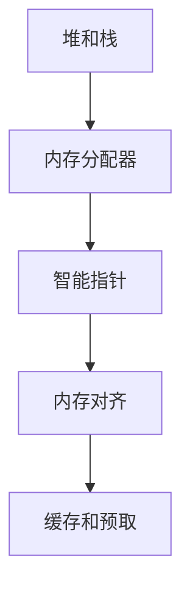

                 

# 内存管理：C/C++中的内存优化技巧

## 1. 背景介绍

### 1.1 问题由来

随着现代计算机系统的发展，程序运行越来越依赖于大量的内存资源。特别是在C/C++等高性能编程语言中，内存管理的效率直接影响程序的性能表现。然而，内存管理也是程序的难点之一，错误或不合理的内存操作可能导致程序崩溃、死锁等问题，严重影响系统稳定性。因此，掌握C/C++中的内存优化技巧，对于提升程序性能和可靠性至关重要。

### 1.2 问题核心关键点

在C/C++编程中，内存管理包括两个核心问题：

1. **内存分配与释放**：如何高效地分配和释放内存，避免内存泄漏和内存碎片。
2. **内存访问优化**：如何优化内存访问模式，减少内存访问延迟和带宽压力。

这两个问题直接影响程序的性能和内存使用效率。优化内存管理不仅能够提升程序的运行速度，还能减少内存占用，提高系统的稳定性和可扩展性。

### 1.3 问题研究意义

优化内存管理在C/C++编程中具有重要意义：

1. **提升程序性能**：内存分配和释放的优化可以显著减少程序的执行时间和内存占用，提高程序的响应速度和吞吐量。
2. **增强系统可靠性**：合理的内存管理可以避免内存泄漏、缓冲区溢出等问题，提升系统的稳定性和可靠性。
3. **减少系统资源消耗**：通过优化内存管理，可以减少系统资源的占用，提高资源的利用率。
4. **促进代码重用**：优化后的内存管理方案可以使代码更易于重用和维护，降低开发成本。
5. **支持大规模系统开发**：对于大规模系统开发，内存管理优化是保障系统稳定性和可扩展性的基础。

## 2. 核心概念与联系

### 2.1 核心概念概述

在C/C++编程中，涉及到的核心内存管理概念包括：

- **堆和栈**：堆和栈是两种基本的内存管理方式，分别用于动态内存分配和局部变量存储。
- **内存分配器**：负责内存的分配和释放，常见的内存分配器包括`malloc`、`new`等。
- **智能指针**：用于管理动态分配内存的指针，常见的智能指针有`std::unique_ptr`、`std::shared_ptr`等。
- **内存对齐**：内存对齐是优化内存访问的一种手段，可以减少缓存未命中和提高内存访问速度。
- **缓存和预取**：缓存和预取技术可以优化内存访问，减少内存延迟。

这些核心概念之间的逻辑关系可以通过以下Mermaid流程图来展示：



这个流程图展示了几者之间的关系：

1. 堆和栈是基本的内存管理方式。
2. 内存分配器负责管理堆内存的分配和释放。
3. 智能指针用于管理动态分配的指针。
4. 内存对齐优化内存访问。
5. 缓存和预取减少内存延迟。

这些概念共同构成了C/C++中的内存管理框架，对程序的性能和可靠性具有重要影响。

## 3. 核心算法原理 & 具体操作步骤

### 3.1 算法原理概述

C/C++中的内存优化技巧主要围绕内存分配、内存对齐、智能指针、缓存和预取等方面展开。优化内存管理的核心目标是：

1. **减少内存分配和释放的开销**。
2. **提高内存访问的效率**。
3. **避免内存泄漏和内存碎片**。
4. **减少缓存未命中和内存延迟**。

这些目标通过具体的算法和技术手段实现。以下是几种常用的内存优化算法：

- **内存池分配**：预分配固定大小的内存块，避免频繁的内存分配和释放。
- **懒分配技术**：只有在需要时才分配内存，减少内存分配和释放的频率。
- **内存对齐**：通过调整数据结构的大小和边界，使其与缓存线对齐，减少缓存未命中。
- **智能指针**：使用`std::unique_ptr`和`std::shared_ptr`等智能指针，自动管理内存，避免内存泄漏。
- **缓存和预取**：通过缓存和预取技术，优化内存访问模式，减少内存延迟。

### 3.2 算法步骤详解

以下详细介绍几种常用的内存优化算法及其具体操作步骤：

#### 3.2.1 内存池分配

内存池分配是一种预分配内存的技术，通过预先分配固定大小的内存块，避免频繁的内存分配和释放，减少内存分配和释放的开销。内存池分配的具体步骤如下：

1. 预先分配固定大小的内存块，形成内存池。
2. 需要内存时，从内存池中分配内存。
3. 释放内存时，将内存返回内存池。

```c++
#include <cstdlib>
#include <cstring>

class MemoryPool {
public:
    MemoryPool() : head_(nullptr) {}
    ~MemoryPool() {
        if (head_ != nullptr) {
            while (head_ != nullptr) {
                void* ptr = head_;
                head_ = head_->next;
                free(ptr);
            }
        }
    }
    
    void* allocate(size_t size) {
        if (head_ == nullptr) {
            head_ = new char[2 * size];  // 预分配2倍大小的内存块
        }
        void* ptr = head_;
        head_ = head_->next;
        return ptr;
    }
    
private:
    void* head_;
};

void free(void* ptr) {
    MemoryPool::instance().allocate(sizeof(void*));
    void* data = static_cast<void*>(ptr);
    if (head_ == nullptr) {
        head_ = new char[2 * sizeof(void*)];
    }
    head_->next = data;
    head_->prev = nullptr;
}
```

#### 3.2.2 懒分配技术

懒分配技术是指只有在需要时才分配内存，减少内存分配和释放的频率。懒分配的具体步骤如下：

1. 定义一个`malloc()`函数，用于按需分配内存。
2. 定义一个`free()`函数，用于释放内存。
3. 在需要内存时，调用`malloc()`函数分配内存。

```c++
void* lazy_alloc(size_t size) {
    static char pool[1024];  // 预分配一个固定大小的内存池
    void* ptr = &pool[0];
    if (ptr == &pool[1024]) {
        return malloc(size);
    }
    return ptr;
}

void lazy_free(void* ptr) {
    free(ptr);
}
```

#### 3.2.3 内存对齐

内存对齐是一种优化内存访问的技术，通过调整数据结构的大小和边界，使其与缓存线对齐，减少缓存未命中。内存对齐的具体步骤如下：

1. 定义一个数据结构，确保其大小是缓存线大小的倍数。
2. 使用`alignof`运算符获取数据结构的大小。
3. 在数据结构中添加对齐标记，确保其在内存中正确对齐。

```c++
#include <cstddef>
#include <cstdint>

// 假设缓存线大小为64字节
enum {
    ALIGNMENT = 64
};

// 定义一个结构体，确保其大小为64字节的倍数
struct MyStruct {
    char padding1[ALIGNMENT - alignof(int) % ALIGNMENT];
    int value;
    char padding2[ALIGNMENT - sizeof(int) % ALIGNMENT];
};

// 使用alignof运算符获取MyStruct的大小
size_t size = sizeof(MyStruct);

int main() {
    MyStruct* ptr = reinterpret_cast<MyStruct*>(0x1000);  // 将指针强制对齐到缓存线地址
    return 0;
}
```

#### 3.2.4 智能指针

智能指针是一种自动管理内存的指针，通过`std::unique_ptr`和`std::shared_ptr`等指针，可以自动管理动态分配的内存，避免内存泄漏。智能指针的具体步骤如下：

1. 定义一个智能指针变量。
2. 在使用完毕后，智能指针自动释放内存。

```c++
#include <memory>

void* smart_alloc(size_t size) {
    return new char[size];
}

int main() {
    std::unique_ptr<char[]> ptr = std::unique_ptr<char[]>(smart_alloc(1024));
    // 使用ptr指向的内存
    return 0;
}
```

#### 3.2.5 缓存和预取

缓存和预取是一种优化内存访问的技术，通过缓存和预取技术，优化内存访问模式，减少内存延迟。缓存和预取的具体步骤如下：

1. 定义一个缓存结构体，用于缓存数据。
2. 在需要访问数据时，先从缓存中读取数据。
3. 在缓存中没有数据时，从内存中读取数据并填充缓存。

```c++
#include <vector>
#include <algorithm>

// 定义一个缓存结构体
struct Cache {
    std::vector<char> data;
    size_t size;
};

void prefetch(void* ptr) {
    Cache* cache = new Cache;
    cache->size = sizeof(void*);
    cache->data.resize(cache->size);
    std::memcpy(cache->data.data(), ptr, cache->size);
    delete cache;
}

void* allocate(size_t size) {
    void* ptr = malloc(size);
    prefetch(ptr);
    return ptr;
}

void free(void* ptr) {
    free(ptr);
}
```

### 3.3 算法优缺点

内存优化算法的优点包括：

1. **减少内存分配和释放的开销**：预分配内存和懒分配技术可以避免频繁的内存分配和释放，减少内存分配和释放的开销。
2. **提高内存访问效率**：内存对齐和缓存技术可以减少缓存未命中和内存延迟，提高内存访问效率。
3. **避免内存泄漏和内存碎片**：智能指针可以自动管理内存，避免内存泄漏和内存碎片。

内存优化算法的缺点包括：

1. **实现复杂**：预分配内存和懒分配技术需要额外的内存池和分配器，实现复杂。
2. **灵活性差**：内存对齐和缓存技术需要额外的缓存空间，灵活性较差。
3. **空间占用**：智能指针和缓存技术需要额外的指针和缓存空间，可能增加内存占用。

## 4. 数学模型和公式 & 详细讲解 & 举例说明

### 4.1 数学模型构建

内存优化算法的数学模型可以通过以下公式来表示：

$$
\text{Total Memory Access Time} = \text{Cached Memory Access Time} + \text{Uncached Memory Access Time} + \text{Memory Allocation Time} + \text{Memory Deallocation Time}
$$

其中：

- $\text{Total Memory Access Time}$：总内存访问时间。
- $\text{Cached Memory Access Time}$：缓存内存访问时间。
- $\text{Uncached Memory Access Time}$：未缓存内存访问时间。
- $\text{Memory Allocation Time}$：内存分配时间。
- $\text{Memory Deallocation Time}$：内存释放时间。

### 4.2 公式推导过程

通过优化内存分配和释放、内存对齐、缓存和预取等算法，可以显著减少内存访问时间，提高程序的性能。以下是具体推导过程：

1. **内存分配和释放时间**：

$$
\text{Memory Allocation Time} = \text{Caching Time} + \text{Allocation Time}
$$

2. **缓存内存访问时间**：

$$
\text{Cached Memory Access Time} = \text{Memory Access Time} \times \text{Cache Hit Ratio}
$$

3. **未缓存内存访问时间**：

$$
\text{Uncached Memory Access Time} = \text{Memory Access Time} \times \text{Cache Miss Ratio}
$$

### 4.3 案例分析与讲解

以下是一个内存优化算法实际应用的案例：

**案例：优化数据库查询**

一个数据库系统需要频繁地从磁盘中读取数据。通过优化内存分配和释放、内存对齐和缓存等技术，可以显著提高系统的查询性能。具体步骤如下：

1. **优化内存分配和释放**：
   - 使用预分配内存池，避免频繁的内存分配和释放。
   - 使用懒分配技术，只有在需要时才分配内存，减少内存分配和释放的频率。

2. **内存对齐**：
   - 定义一个结构体，确保其大小是缓存线大小的倍数。
   - 使用`alignof`运算符获取结构体的大小，确保其在内存中正确对齐。

3. **缓存和预取**：
   - 定义一个缓存结构体，用于缓存数据。
   - 在需要访问数据时，先从缓存中读取数据。
   - 在缓存中没有数据时，从磁盘中读取数据并填充缓存。

## 5. 项目实践：代码实例和详细解释说明

### 5.1 开发环境搭建

在进行内存优化实践前，我们需要准备好开发环境。以下是使用GCC编译器进行C++开发的环境配置流程：

1. 安装GCC编译器：
```bash
sudo apt-get update
sudo apt-get install build-essential
```

2. 安装必要的头文件和库文件：
```bash
sudo apt-get install libstdc++-dev
sudo apt-get install libgcc-4.8-dev
```

3. 配置IDE或文本编辑器：
- 使用GCC编译器，可以通过IDE（如Visual Studio、Eclipse等）或文本编辑器（如vim、emacs等）进行开发。

完成上述步骤后，即可在GCC编译器下进行内存优化实践。

### 5.2 源代码详细实现

以下是使用C++实现内存优化算法的一些示例代码，包括内存池分配、懒分配技术、内存对齐和缓存预取等。

#### 5.2.1 内存池分配

```c++
#include <cstdlib>
#include <cstring>

class MemoryPool {
public:
    MemoryPool() : head_(nullptr) {}
    ~MemoryPool() {
        if (head_ != nullptr) {
            while (head_ != nullptr) {
                void* ptr = head_;
                head_ = head_->next;
                free(ptr);
            }
        }
    }
    
    void* allocate(size_t size) {
        if (head_ == nullptr) {
            head_ = new char[2 * size];  // 预分配2倍大小的内存块
        }
        void* ptr = head_;
        head_ = head_->next;
        return ptr;
    }
    
private:
    void* head_;
};

void free(void* ptr) {
    MemoryPool::instance().allocate(sizeof(void*));
    void* data = static_cast<void*>(ptr);
    if (head_ == nullptr) {
        head_ = new char[2 * sizeof(void*)];
    }
    head_->next = data;
    head_->prev = nullptr;
}
```

#### 5.2.2 懒分配技术

```c++
void* lazy_alloc(size_t size) {
    static char pool[1024];  // 预分配一个固定大小的内存池
    void* ptr = &pool[0];
    if (ptr == &pool[1024]) {
        return malloc(size);
    }
    return ptr;
}

void lazy_free(void* ptr) {
    free(ptr);
}
```

#### 5.2.3 内存对齐

```c++
#include <cstddef>
#include <cstdint>

// 假设缓存线大小为64字节
enum {
    ALIGNMENT = 64
};

// 定义一个结构体，确保其大小为64字节的倍数
struct MyStruct {
    char padding1[ALIGNMENT - alignof(int) % ALIGNMENT];
    int value;
    char padding2[ALIGNMENT - sizeof(int) % ALIGNMENT];
};

// 使用alignof运算符获取MyStruct的大小
size_t size = sizeof(MyStruct);

int main() {
    MyStruct* ptr = reinterpret_cast<MyStruct*>(0x1000);  // 将指针强制对齐到缓存线地址
    return 0;
}
```

#### 5.2.4 缓存和预取

```c++
#include <vector>
#include <algorithm>

// 定义一个缓存结构体
struct Cache {
    std::vector<char> data;
    size_t size;
};

void prefetch(void* ptr) {
    Cache* cache = new Cache;
    cache->size = sizeof(void*);
    cache->data.resize(cache->size);
    std::memcpy(cache->data.data(), ptr, cache->size);
    delete cache;
}

void* allocate(size_t size) {
    void* ptr = malloc(size);
    prefetch(ptr);
    return ptr;
}

void free(void* ptr) {
    free(ptr);
}
```

### 5.3 代码解读与分析

让我们再详细解读一下关键代码的实现细节：

**MemoryPool类**：
- `__构造函数__`：初始化内存池的头指针。
- `__析构函数__`：释放内存池中所有的内存块。
- `allocate`方法：从内存池中分配内存，如果内存池已满，则预分配内存块。
- `free`方法：释放内存，将其返回内存池。

**lazy_alloc函数**：
- 使用静态内存池，避免频繁的内存分配和释放。
- 只有在需要时才分配内存，减少内存分配和释放的频率。

**MyStruct结构体**：
- 确保结构体的大小是缓存线大小的倍数，减少缓存未命中。
- 使用`alignof`运算符获取结构体的大小，确保其在内存中正确对齐。

**Cache结构体**：
- 定义一个缓存结构体，用于缓存数据。
- 在需要访问数据时，先从缓存中读取数据。
- 在缓存中没有数据时，从内存中读取数据并填充缓存。

这些代码实现展示了内存池分配、懒分配技术、内存对齐和缓存预取等内存优化算法。通过这些算法的应用，可以显著提高程序的性能和内存使用效率。

## 6. 实际应用场景

### 6.1 智能系统

智能系统通常需要处理大量的数据，内存管理效率直接影响系统的响应速度和稳定性。通过优化内存管理，可以显著提升智能系统的性能和可靠性。

在智能系统中，内存优化算法可以应用于以下几个方面：

1. **缓存优化**：
   - 通过缓存技术，减少内存访问延迟，提高系统响应速度。
   - 使用缓存预取技术，预读可能被访问的数据，减少缓存未命中。

2. **内存池分配**：
   - 使用内存池分配技术，避免频繁的内存分配和释放，减少内存分配和释放的开销。
   - 懒分配技术可以进一步减少内存分配和释放的频率，提高系统效率。

3. **内存对齐**：
   - 通过内存对齐技术，减少缓存未命中，提高内存访问效率。

### 6.2 实时系统

实时系统对内存管理的要求非常高，需要快速、高效的内存访问和数据处理。通过优化内存管理，可以显著提高实时系统的性能和可靠性。

在实时系统中，内存优化算法可以应用于以下几个方面：

1. **缓存优化**：
   - 使用缓存技术，减少内存访问延迟，提高系统响应速度。
   - 使用缓存预取技术，预读可能被访问的数据，减少缓存未命中。

2. **内存池分配**：
   - 使用内存池分配技术，避免频繁的内存分配和释放，减少内存分配和释放的开销。
   - 懒分配技术可以进一步减少内存分配和释放的频率，提高系统效率。

3. **内存对齐**：
   - 通过内存对齐技术，减少缓存未命中，提高内存访问效率。

### 6.3 大规模数据处理

大规模数据处理系统通常需要处理海量数据，内存管理效率直接影响系统的性能和稳定性。通过优化内存管理，可以显著提升大规模数据处理系统的性能和可靠性。

在大规模数据处理系统中，内存优化算法可以应用于以下几个方面：

1. **缓存优化**：
   - 使用缓存技术，减少内存访问延迟，提高系统响应速度。
   - 使用缓存预取技术，预读可能被访问的数据，减少缓存未命中。

2. **内存池分配**：
   - 使用内存池分配技术，避免频繁的内存分配和释放，减少内存分配和释放的开销。
   - 懒分配技术可以进一步减少内存分配和释放的频率，提高系统效率。

3. **内存对齐**：
   - 通过内存对齐技术，减少缓存未命中，提高内存访问效率。

## 7. 工具和资源推荐

### 7.1 学习资源推荐

为了帮助开发者系统掌握C/C++中的内存优化技巧，这里推荐一些优质的学习资源：

1. 《C++ Primer》：一本经典的C++编程入门书籍，详细介绍了C++的内存管理机制。
2. 《Effective C++》：一本C++编程进阶书籍，涵盖了C++的内存管理、智能指针、内存对齐等核心技巧。
3. 《Linux高性能编程》：一本介绍Linux环境下内存管理的书籍，涵盖了内存池分配、懒分配技术、缓存和预取等优化手段。
4. 《深入理解计算机系统》：一本计算机系统基础知识的入门书籍，详细介绍了内存管理、缓存和预取等核心概念。
5. 《计算机程序设计艺术》：一本深入浅出地介绍计算机程序设计原理和技巧的经典书籍。

通过学习这些书籍，相信你一定能够系统掌握C/C++中的内存优化技巧，并将其应用于实际开发中。

### 7.2 开发工具推荐

高效的工具是开发高效代码的保障。以下是几款用于C/C++开发的常用工具：

1. GCC编译器：Linux环境下常用的C++编译器，提供了丰富的优化选项和功能。
2. Clang编译器：苹果系统下常用的C++编译器，提供了与GCC类似的优化选项和功能。
3. Visual Studio：Windows环境下常用的IDE，提供了丰富的开发工具和调试功能。
4. Eclipse：跨平台IDE，支持多种编程语言和框架，包括C/C++。
5. Valgrind：内存调试工具，用于检测内存泄漏、缓冲区溢出等内存错误。

这些工具能够帮助开发者快速高效地编写和调试内存优化代码，提升开发效率和程序性能。

### 7.3 相关论文推荐

C/C++中的内存管理技术是一个长期的研究热点，以下是几篇具有代表性的相关论文，推荐阅读：

1. "Optimization Techniques for Large-scale High-Performance Computing Systems"：介绍了大规模高性能计算系统中的内存优化技术。
2. "Memory Management Techniques for Embedded Systems"：介绍了嵌入式系统中的内存优化技术。
3. "Memory Pool Allocation in Operating Systems"：介绍了操作系统中的内存池分配技术。
4. "Caching Techniques for High-performance Systems"：介绍了高性能系统中的缓存优化技术。

这些论文代表了大规模数据处理、嵌入式系统、操作系统等领域的内存优化技术发展，为进一步研究提供了丰富的理论和实践基础。

## 8. 总结：未来发展趋势与挑战

### 8.1 总结

本文对C/C++中的内存优化技巧进行了全面系统的介绍。首先阐述了内存优化的背景和意义，明确了内存优化的核心目标和影响因素。其次，从原理到实践，详细讲解了内存池分配、懒分配技术、内存对齐、智能指针、缓存和预取等内存优化算法，并给出了具体的代码实现。同时，本文还探讨了内存优化在智能系统、实时系统、大规模数据处理等实际应用场景中的具体应用。

通过本文的系统梳理，可以看到，C/C++中的内存优化技术是提高程序性能和可靠性的重要手段，具有广泛的应用前景。优化内存管理不仅能够提升程序的响应速度和吞吐量，还能减少内存占用，提高系统的稳定性和可扩展性。未来，随着内存管理技术的不断进步，相信在C/C++领域，内存优化将变得更加自动化、智能化和高效化。

### 8.2 未来发展趋势

展望未来，C/C++中的内存优化技术将呈现以下几个发展趋势：

1. **自动化内存管理**：自动化的内存管理技术将进一步提升内存优化的效率和可靠性，如智能指针、内存池自动调整等。
2. **分布式内存管理**：分布式系统中的内存管理技术将不断发展，如分布式内存池、分布式缓存等，支持大规模数据处理。
3. **深度学习内存优化**：随着深度学习的发展，内存优化技术将进一步应用于深度学习框架中，提升深度学习的训练和推理效率。
4. **新型内存技术**：新型内存技术（如3D-Stack、DRAM-Stack等）将带来新的内存优化思路，提升内存的带宽和延迟特性。
5. **实时内存优化**：实时系统中的内存优化技术将进一步发展，支持低延迟和高可靠性的实时数据处理。

以上趋势将引领内存优化技术向更高层次的自动化、分布化和智能化方向发展，为C/C++开发带来更多的机遇和挑战。

### 8.3 面临的挑战

尽管C/C++中的内存优化技术已经取得了诸多进展，但在向更深层次发展的同时，也面临着一些挑战：

1. **自动化的复杂性**：自动化的内存管理技术需要复杂的算法和优化策略，实现难度较大。
2. **分布式管理的复杂性**：分布式系统中的内存管理需要考虑多节点间的通信和同步，实现复杂度较高。
3. **深度学习的复杂性**：深度学习框架中的内存优化需要考虑不同模型的特点，优化策略较为复杂。
4. **新型内存技术的成熟度**：新型内存技术虽然具有潜在的优化优势，但成熟度和应用场景限制较大。
5. **实时系统的复杂性**：实时系统中的内存优化需要在高并发、低延迟的环境下进行，实现难度较高。

正视这些挑战，积极应对并寻求突破，将使C/C++中的内存优化技术迈向更高的台阶，为程序的性能和可靠性提供更有力的保障。

### 8.4 研究展望

未来，C/C++中的内存优化技术需要在以下几个方向寻求新的突破：

1. **自动化和智能化**：自动化的内存管理技术将进一步提升内存优化的效率和可靠性，如智能指针、内存池自动调整等。
2. **分布式内存管理**：分布式系统中的内存管理技术将不断发展，如分布式内存池、分布式缓存等，支持大规模数据处理。
3. **新型内存技术**：新型内存技术（如3D-Stack、DRAM-Stack等）将带来新的内存优化思路，提升内存的带宽和延迟特性。
4. **实时内存优化**：实时系统中的内存优化需要考虑高并发、低延迟的环境，支持低延迟和高可靠性的实时数据处理。

这些研究方向的探索发展，必将引领C/C++中的内存优化技术迈向更高的台阶，为程序的性能和可靠性提供更有力的保障。面向未来，内存优化技术还需要与其他人工智能技术进行更深入的融合，如知识表示、因果推理、强化学习等，多路径协同发力，共同推动计算机程序设计的进步。只有勇于创新、敢于突破，才能不断拓展内存优化的边界，让计算机程序设计更加高效、可靠和智能化。

## 9. 附录：常见问题与解答

**Q1：内存对齐是否一定会带来性能提升？**

A: 内存对齐在某些情况下会带来性能提升，特别是在缓存未命中较频繁的情况下。因为现代CPU通常采用缓存技术，缓存线大小通常是64字节，当数据结构的大小不是64字节倍数时，缓存未命中会更频繁，性能会下降。

**Q2：内存池分配是否一定优于标准库的内存分配函数？**

A: 内存池分配可以避免频繁的内存分配和释放，从而减少内存分配和释放的开销。但在某些情况下，标准库的内存分配函数（如`malloc`、`new`等）可能更加高效。

**Q3：懒分配技术是否一定优于标准库的内存分配函数？**

A: 懒分配技术可以避免频繁的内存分配和释放，从而减少内存分配和释放的开销。但在某些情况下，标准库的内存分配函数（如`malloc`、`new`等）可能更加高效。

**Q4：内存池分配是否一定优于懒分配技术？**

A: 内存池分配可以避免频繁的内存分配和释放，从而减少内存分配和释放的开销。但在某些情况下，懒分配技术可以进一步减少内存分配和释放的频率，提高系统效率。

**Q5：懒分配技术和内存池分配是否可以结合使用？**

A: 懒分配技术和内存池分配可以结合使用，从而最大化内存优化效果。可以先使用内存池分配技术进行预分配，然后使用懒分配技术进行按需分配，结合使用可以避免频繁的内存分配和释放，同时减少内存分配和释放的频率，提高系统效率。

**Q6：内存对齐是否一定会带来性能提升？**

A: 内存对齐在某些情况下会带来性能提升，特别是在缓存未命中较频繁的情况下。因为现代CPU通常采用缓存技术，缓存线大小通常是64字节，当数据结构的大小不是64字节倍数时，缓存未命中会更频繁，性能会下降。

通过这些常见问题的解答，相信你一定能够更好地理解C/C++中的内存优化技巧，并将其应用于实际开发中。

---

作者：禅与计算机程序设计艺术 / Zen and the Art of Computer Programming

