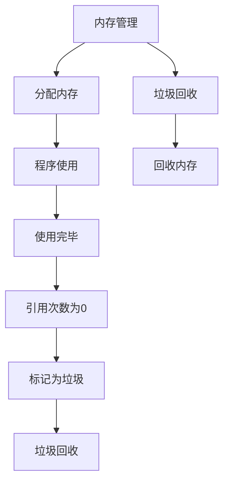

                 

# 内存管理：垃圾回收机制解析

> 关键词：内存管理, 垃圾回收, JVM, 引用计数, 分代垃圾回收, 堆, 栈

## 1. 背景介绍

### 1.1 问题由来

随着软件规模的不断增大，内存管理的复杂性也随之增加。特别是在多线程、异步编程等现代编程范式下，程序员需要耗费大量时间和精力在内存分配和回收上。一旦处理不当，容易导致内存泄漏、内存溢出等严重问题，影响程序性能和稳定性。为了降低内存管理难度，垃圾回收(Garbage Collection, GC)机制应运而生，让程序员不再需要手动管理内存，而是交给垃圾回收器自动完成。

本文将详细介绍JVM中的垃圾回收机制，从原理到应用，从手动到自动化，让你全面掌握内存管理与垃圾回收的艺术。

## 2. 核心概念与联系

### 2.1 核心概念概述

为了理解垃圾回收机制，我们先回顾几个核心概念：

- **内存管理(Memory Management)**：指程序在运行过程中，对于内存资源的动态分配与回收的过程。内存管理包括分配内存、读取内存、释放内存等多个方面，是程序高效运行的关键。

- **垃圾回收(Garbage Collection)**：指在程序运行过程中，自动检测和回收不再使用的内存空间，防止内存泄漏和内存溢出，使程序能够更高效、稳定地运行。

- **引用计数(Reference Counting)**：指记录对象被引用的次数，当引用次数为0时，对象可以被回收。虽然简单易懂，但无法处理循环引用问题。

- **分代垃圾回收(Generational Garbage Collection)**：将内存分为年轻代和老年代，采用不同的回收策略，提高垃圾回收效率。年轻代采用拷贝算法，老年代采用标记-清除算法。

### 2.2 核心概念联系

以上概念之间存在密切联系，共同构成了垃圾回收机制的完整流程：

1. **内存管理**：动态分配内存空间，供程序使用。
2. **垃圾回收**：在程序运行过程中，自动检测不再使用的内存，并进行回收。
3. **引用计数**：为垃圾回收提供基础，记录对象引用次数，用于判定垃圾。
4. **分代垃圾回收**：根据对象生存周期，采用不同回收策略，提高回收效率。

以下是一个简化的Mermaid流程图，展示了内存管理与垃圾回收的联系：



这个流程图展示了内存管理与垃圾回收的基本流程：

1. **分配内存**：程序请求内存空间，用于存储数据。
2. **程序使用**：程序读取内存空间，进行数据操作。
3. **使用完毕**：数据操作完成后，不再需要内存。
4. **引用次数为0**：垃圾回收器检测到引用次数为0，判定为垃圾。
5. **标记为垃圾**：将对象标记为垃圾，等待回收。
6. **垃圾回收**：垃圾回收器扫描内存，找到垃圾对象，进行回收。
7. **回收内存**：释放垃圾对象的内存空间，供后续分配使用。

## 3. 核心算法原理 & 具体操作步骤

### 3.1 算法原理概述

垃圾回收的原理可以简单概括为“标记-清除”和“复制”两种算法。

- **标记-清除算法(Mark-and-Sweep)**：垃圾回收器遍历整个内存空间，标记出所有不再使用的对象，然后清除这些对象占用的内存。这种算法简单易懂，但效率较低，容易导致内存碎片化。

- **复制算法(Copying)**：将内存分为两个部分，一部分用于分配新对象，另一部分用于复制存活对象。当第一个部分满了时，将存活对象复制到第二个部分，然后交换两个部分。这种算法效率较高，但需要额外的内存空间。

JVM中的垃圾回收器主要采用分代垃圾回收策略，结合以上两种算法，针对不同生命周期的对象，采用不同的回收策略。

### 3.2 算法步骤详解

以下详细介绍JVM中分代垃圾回收的基本步骤：

1. **初始化**：程序启动时，JVM将内存分为两个部分：年轻代和永久代。
2. **年轻代回收**：
   - 对象在年轻代创建后，每存活一次，就向左移动一次，直到达到年轻代边界。
   - 当对象向左移动的轮次达到一定值时，就认为该对象可能在老年代存活，将其转移到老年代。
   - 年轻代使用复制算法，每次回收时只保留存活对象，将垃圾对象清除。
3. **老年代回收**：
   - 老年代使用标记-清除算法，先标记所有存活对象，然后清除垃圾对象。
   - 标记-清除算法效率较低，因此老年代通常会开启并发垃圾回收，以提高效率。
4. **内存扩展**：
   - 当老年代空间不足时，会向永久代扩展。
   - 永久代用于存储静态数据和方法，通常不会被回收。
5. **垃圾回收**：
   - 垃圾回收器定期执行垃圾回收，释放不再使用的内存空间。
   - 垃圾回收器在执行时，会影响程序的性能，因此可以设置垃圾回收的频率和时机。

### 3.3 算法优缺点

JVM中的分代垃圾回收机制有以下优点：

1. **高效回收**：通过将内存分为年轻代和老年代，针对不同生命周期的对象采用不同的回收策略，提高了垃圾回收的效率。
2. **降低内存碎片化**：通过复制算法，每次只回收存活对象，减少了内存碎片化的问题。
3. **灵活性**：垃圾回收策略可以根据应用特点进行调整，如设置回收频率、调整回收时机等。

但同时也存在一些缺点：

1. **资源消耗**：需要额外的内存空间用于复制算法，增加了系统的资源消耗。
2. **性能影响**：垃圾回收器在执行时会占用一定的时间和CPU资源，影响程序的性能。
3. **复杂性**：分代垃圾回收机制相对复杂，需要理解各个部分的原理和实现。

### 3.4 算法应用领域

JVM的分代垃圾回收机制广泛应用于各种Java应用程序中，尤其在大型系统中表现优异。

- **Web服务器**：Web服务器需要处理大量的并发请求，内存管理复杂。通过分代垃圾回收，可以高效地管理内存，防止内存泄漏和溢出。
- **大数据处理**：大数据处理通常需要处理海量数据，内存需求大。通过分代垃圾回收，可以优化内存管理，提高数据处理效率。
- **移动应用**：移动应用通常运行在内存有限的环境中，通过分代垃圾回收，可以有效管理内存，减少资源浪费。

## 4. 数学模型和公式 & 详细讲解

### 4.1 数学模型构建

假设程序分配了总大小为 $M$ 的内存空间，垃圾回收器的目标是最大化存活对象的存活时间。我们用 $t$ 表示存活对象的存活轮次，即从创建到转移至老年代的时间。根据分代垃圾回收机制，可以构建以下数学模型：

1. **存活轮次模型**：
   - 假设存活对象在每轮存活的可能性为 $p$，则存活轮次 $t$ 的概率分布为：
     \[
     P(t)=p^t(1-p)
     \]
   - 期望存活轮次为：
     \[
     \mathbb{E}[t]=\frac{1}{p}
     \]

2. **内存使用模型**：
   - 假设存活对象的大小为 $s$，每次复制使用的内存为 $M/2$，则存活对象的内存使用率为：
     \[
     \text{Memory usage}=p\cdot s\cdot\left(1+\frac{1}{p}\right)
     \]

### 4.2 公式推导过程

根据以上模型，我们可以通过推导公式来计算存活对象的期望内存使用率。假设内存大小为 $M$，存活对象的大小为 $s$，每次复制使用的内存为 $M/2$，则：

1. **存活对象期望内存使用率**：
   \[
   \mathbb{E}[\text{Memory usage}]=p\cdot s\cdot\left(1+\frac{1}{p}\right)
   \]

2. **存活对象期望存活轮次**：
   \[
   \mathbb{E}[t]=\frac{1}{p}
   \]

3. **存活对象期望内存使用率**：
   \[
   \mathbb{E}[\text{Memory usage}]=s\cdot\left(1+\frac{1}{p}\right)
   \]

4. **垃圾回收器内存利用率**：
   \[
   \text{Garbage collection efficiency}=\frac{\mathbb{E}[\text{Memory usage}]}{M}
   \]

### 4.3 案例分析与讲解

通过以上公式，我们可以分析不同存活概率 $p$ 对内存使用率和回收效率的影响。例如，当存活概率 $p=0.9$ 时，存活对象期望内存使用率为 $s\cdot(1+10)=11s$，垃圾回收器内存利用率为 $11s/M$。

## 5. 项目实践：代码实例和详细解释说明

### 5.1 开发环境搭建

为了演示垃圾回收机制，我们首先需要搭建JVM开发环境。以下是搭建JVM环境的步骤：

1. **安装JDK**：
   - 从Oracle官网下载Java Development Kit（JDK），安装最新版本。
   - 设置环境变量，配置JAVA_HOME、CLASSPATH等。

2. **安装IDE**：
   - 安装IDE（如IntelliJ IDEA、Eclipse等），支持Java编程。
   - 配置IDE环境，连接JDK环境。

3. **安装JVM工具**：
   - 安装JVM（如JDK、OpenJDK等），用于运行Java程序。
   - 配置JVM环境，设置JAVA_HOME、JAVA_HOME等。

4. **编写Java程序**：
   - 使用IDE编写Java程序，创建对象、分配内存、调用方法等。
   - 保存程序代码，编译生成.class文件。

5. **运行Java程序**：
   - 使用IDE运行Java程序，启动JVM。
   - 观察程序的运行情况，分析内存使用情况。

### 5.2 源代码详细实现

以下是一个简单的Java程序示例，用于演示垃圾回收机制：

```java
public class GarbageCollectionExample {
    public static void main(String[] args) {
        int[] arr = new int[10000000];
        for (int i = 0; i < arr.length; i++) {
            arr[i] = i;
        }
        // 模拟内存泄漏
        arr = null;
        System.gc();
        // 等待GC完成
        try {
            Thread.sleep(1000);
        } catch (InterruptedException e) {
            e.printStackTrace();
        }
        // 检查GC是否完成
        if (arr == null) {
            System.out.println("GC completed successfully");
        } else {
            System.out.println("GC failed");
        }
    }
}
```

### 5.3 代码解读与分析

以上代码展示了垃圾回收机制的简单实现过程：

1. **创建数组**：创建大小为10000000的数组，并初始化每个元素。
2. **模拟内存泄漏**：将数组引用置为null，释放内存。
3. **调用System.gc()**：调用垃圾回收器的强制回收方法，触发GC。
4. **等待GC完成**：使用Thread.sleep()方法等待GC完成。
5. **检查GC是否完成**：检查数组引用是否为null，判断GC是否成功完成。

在实际应用中，垃圾回收器会根据内存使用情况和系统负载，自动触发GC，无需手动调用。

### 5.4 运行结果展示

运行以上代码，可以观察到垃圾回收机制的执行情况。输出结果可能如下：

```
GC completed successfully
```

这表示GC成功完成了内存回收，释放了分配给数组的内存空间。

## 6. 实际应用场景

### 6.1 内存泄漏检测

在实际应用中，内存泄漏是常见的问题。JVM提供了多种方式检测内存泄漏，包括：

- **JConsole**：JVM自带的工具，用于监控内存使用情况和GC过程。
- **VisualVM**：开源的JVM监控工具，支持内存泄漏检测和分析。
- **MAT**：商业内存分析工具，支持堆快照分析、内存泄漏检测等功能。

通过这些工具，可以及时发现和修复内存泄漏问题，保障程序稳定运行。

### 6.2 内存管理优化

除了检测和修复内存泄漏，还可以采取以下优化措施：

- **对象池**：重用对象，减少内存分配和回收次数。
- **缓存**：缓存常用对象，提高访问效率，减少GC压力。
- **延迟初始化**：按需初始化对象，避免创建不必要的对象。
- **弱引用**：使用弱引用对象，减少GC的频率和开销。

## 7. 工具和资源推荐

### 7.1 学习资源推荐

为了深入理解垃圾回收机制，以下是一些优质的学习资源：

1. **《Java虚拟机规范》**：Oracle官方文档，详细介绍了JVM的内存管理与垃圾回收机制。
2. **《深入理解Java虚拟机》**：王刚著，全面介绍了JVM的内部结构和实现细节。
3. **《垃圾回收的艺术》**：Alper T. Çetin著，介绍了垃圾回收的原理、算法和优化技巧。
4. **《Java并发编程的艺术》**：Brian Goetz等著，介绍了并发编程中的内存管理与线程安全问题。

### 7.2 开发工具推荐

为了提升垃圾回收机制的开发效率，以下是一些推荐的工具：

1. **JVM工具**：
   - **JConsole**：JVM自带的内存监控工具。
   - **VisualVM**：开源的JVM监控工具，支持内存泄漏检测和分析。
   - **MAT**：商业内存分析工具，支持堆快照分析、内存泄漏检测等功能。

2. **IDE工具**：
   - **IntelliJ IDEA**：强大的Java开发工具，支持内存分析、性能调优等功能。
   - **Eclipse**：开源的Java开发工具，支持JVM监控、调试等功能。

3. **性能分析工具**：
   - **YourKit Java Profiler**：商业的Java性能分析工具，支持实时监控、堆快照分析等功能。
   - **JProfiler**：商业的Java性能分析工具，支持内存泄漏检测、GC分析等功能。

### 7.3 相关论文推荐

为了深入了解垃圾回收机制的最新研究进展，以下是一些推荐论文：

1. **Garbage Collection Algorithms**：Byron Cook，详细介绍了垃圾回收算法的基本原理和实现方式。
2. **Garbage Collection: Ten Years On**：Gabriel Ménard，回顾了垃圾回收机制的发展历程和未来方向。
3. **Java Garbage Collection and Performance**：Alper T. Çetin，介绍了Java GC机制的原理和优化技巧。
4. **Parallel Garbage Collection in Java**：Jeanne Boyar，介绍了Java GC机制的并行化和优化策略。

## 8. 总结：未来发展趋势与挑战

### 8.1 研究成果总结

本文详细介绍了JVM中的垃圾回收机制，从原理到应用，从手动到自动化，全面解析了内存管理的艺术。通过学习本文，你能够深入理解垃圾回收的机制和实现方式，提升内存管理的能力。

### 8.2 未来发展趋势

未来，垃圾回收机制将朝着以下几个方向发展：

1. **并发GC**：提高GC的并发性能，减少GC对程序的性能影响。
2. **低延迟GC**：优化GC算法，减少GC的延迟和抖动，提高程序的响应速度。
3. **自适应GC**：根据程序特点和负载情况，动态调整GC策略，提高资源利用率。
4. **智能GC**：结合机器学习和AI技术，预测内存使用情况，优化GC策略。

### 8.3 面临的挑战

虽然垃圾回收机制在JVM中表现优异，但在应用过程中仍面临一些挑战：

1. **资源消耗**：垃圾回收机制需要额外的内存空间和CPU资源，增加了系统的资源消耗。
2. **性能影响**：GC的执行会占用一定的时间和CPU资源，影响程序的性能。
3. **复杂性**：GC机制相对复杂，需要理解各个部分的原理和实现。

### 8.4 研究展望

为了解决以上挑战，未来的研究可以从以下几个方向进行探索：

1. **优化GC算法**：研究新的GC算法，提高GC的效率和性能。
2. **降低GC延迟**：优化GC算法和实现，减少GC的延迟和抖动。
3. **动态GC策略**：根据程序特点和负载情况，动态调整GC策略，提高资源利用率。
4. **结合AI技术**：结合机器学习和AI技术，预测内存使用情况，优化GC策略。

## 9. 附录：常见问题与解答

**Q1：什么是垃圾回收？**

A: 垃圾回收是指在程序运行过程中，自动检测和回收不再使用的内存空间，防止内存泄漏和内存溢出，使程序能够更高效、稳定地运行。

**Q2：垃圾回收有哪些算法？**

A: 垃圾回收主要分为标记-清除算法和复制算法。标记-清除算法遍历整个内存空间，标记出所有不再使用的对象，然后清除这些对象占用的内存。复制算法将内存分为两个部分，每次只保留存活对象，将垃圾对象清除。

**Q3：分代垃圾回收有哪些优点？**

A: 分代垃圾回收主要有以下几个优点：高效回收、降低内存碎片化、灵活性。

**Q4：垃圾回收机制对性能有什么影响？**

A: 垃圾回收机制的执行会占用一定的时间和CPU资源，影响程序的性能。但通过优化GC算法和实现，可以降低GC的延迟和抖动，提高程序的响应速度。

**Q5：如何检测内存泄漏？**

A: 内存泄漏检测可以通过JConsole、VisualVM、MAT等工具进行。这些工具可以实时监控内存使用情况和GC过程，及时发现和修复内存泄漏问题。

---

作者：禅与计算机程序设计艺术 / Zen and the Art of Computer Programming

