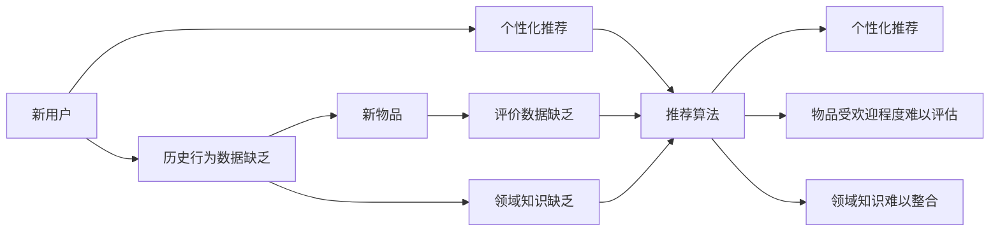

                 

# 冷启动场景的挑战：推荐系统的局限与解决方案

## 1. 背景介绍

在当今数据驱动的互联网时代，推荐系统在各行各业得到了广泛的应用。从电商平台、视频平台到社交媒体，推荐系统正在深刻影响着用户的消费习惯、信息获取方式和社交行为。然而，推荐系统在面对冷启动问题时往往显得束手无策。冷启动问题通常指新用户或新物品缺乏足够的历史行为数据，导致推荐模型难以为其提供有效的推荐服务。

冷启动问题广泛存在于各领域推荐系统中，严重影响了用户体验和平台价值。例如，在社交媒体平台上，新用户往往需要一段时间才能适应系统的推荐算法，期间看不到有价值的推荐内容。在电商平台上，新商品需要一段时间积累销量和评价，才能进入推荐算法模型。这些问题不仅影响了用户满意度，也降低了平台的商业价值。因此，探索有效的推荐系统冷启动解决方案，是当前研究的热点之一。

## 2. 核心概念与联系

### 2.1 核心概念概述

冷启动问题涉及多个核心概念，包括新用户推荐、新物品推荐、新领域推荐等。这些问题的本质是模型对未知数据的学习和预测能力不足。本节将对这些概念进行详细说明。

- **新用户推荐**：指新加入平台的用户，由于缺乏历史行为数据，推荐系统无法为其提供个性化推荐。
- **新物品推荐**：指新上架或刚被用户关注的产品或内容，由于缺乏评价数据，推荐系统无法判断其受欢迎程度。
- **新领域推荐**：指推荐系统进入一个新的领域（如新行业、新主题），由于缺乏领域知识，推荐效果不佳。

这些概念紧密相关，共同构成了推荐系统冷启动问题的完整画面。

### 2.2 核心概念原理和架构的 Mermaid 流程图



## 3. 核心算法原理 & 具体操作步骤

### 3.1 算法原理概述

推荐系统通过分析用户的历史行为数据，利用协同过滤、内容推荐、混合推荐等算法为用户生成个性化推荐。但在冷启动场景中，由于缺少足够的用户行为数据，上述方法难以发挥效用。因此，冷启动问题的解决方案通常需要从数据层面和算法层面同时进行优化。

### 3.2 算法步骤详解

#### 3.2.1 数据层面优化

- **数据采集**：获取更多新用户的注册信息、兴趣标签等，形成初步的用户画像。
- **数据挖掘**：利用用户注册信息、搜索行为、点击行为等数据，提取新用户的潜在兴趣。
- **数据整合**：将用户画像和新用户的潜在兴趣整合，为推荐算法提供更多输入。

#### 3.2.2 算法层面优化

- **基于规则的推荐**：利用领域专家的知识，设计规则系统，为新物品和新领域提供推荐。
- **基于内容的推荐**：根据物品或领域的特征，对新用户进行推荐。
- **基于模型的推荐**：利用迁移学习、半监督学习等方法，在新用户的少量行为数据上训练推荐模型。
- **基于深度学习的推荐**：使用神经网络模型，结合用户画像和物品/领域特征，生成推荐结果。

### 3.3 算法优缺点

#### 3.3.1 优点

- **综合性强**：结合了数据层面和算法层面的优化，能够更全面地解决冷启动问题。
- **适应性强**：能够应对多种冷启动场景，如新用户、新物品和新领域。
- **灵活性高**：可以根据具体情况选择不同的推荐方法和技术手段。

#### 3.3.2 缺点

- **数据依赖度高**：需要获取和处理大量用户数据和领域知识，数据获取难度大。
- **算法复杂度高**：需要综合考虑多种推荐算法和技术手段，实现难度大。
- **计算资源需求大**：深度学习模型通常需要大量的计算资源，模型训练和推理成本高。

### 3.4 算法应用领域

冷启动问题在推荐系统中广泛存在，影响多个领域。例如：

- **电商**：新商品进入市场，缺乏用户评价，无法进入推荐系统。
- **新闻**：新文章发布，缺乏点击量，难以进入用户推荐列表。
- **社交**：新用户加入平台，缺乏历史行为数据，推荐效果不佳。
- **金融**：新金融产品推出，缺乏用户反馈，难以推广。

## 4. 数学模型和公式 & 详细讲解 & 举例说明

### 4.1 数学模型构建

推荐系统可以抽象为一个二部图模型，用户节点和物品节点构成图中的两个集合。推荐系统通过优化模型参数，最大化用户和物品的连接概率，生成个性化推荐。

### 4.2 公式推导过程

假设用户节点为 $u_1, u_2, ..., u_n$，物品节点为 $v_1, v_2, ..., v_m$。推荐系统优化目标为最大化用户与物品的连接概率 $P_{u_i \rightarrow v_j}$，公式为：

$$
\max \sum_{i=1}^n \sum_{j=1}^m P_{u_i \rightarrow v_j} \log P_{u_i \rightarrow v_j}
$$

其中 $P_{u_i \rightarrow v_j}$ 为物品 $v_j$ 被用户 $u_i$ 选中的概率。

### 4.3 案例分析与讲解

假设有一个新用户 $u_i$ 进入电商平台，平台需要为其推荐一个商品 $v_j$。由于该用户没有历史行为数据，推荐系统可以使用基于内容的推荐方法，利用商品 $v_j$ 的描述、标签等特征，预测用户 $u_i$ 是否会选中该商品。若 $u_i$ 选中概率较高，则将其加入推荐列表。

## 5. 项目实践：代码实例和详细解释说明

### 5.1 开发环境搭建

为了进行推荐系统的开发和测试，首先需要搭建一个开发环境。以下是一个基本的开发环境搭建步骤：

1. 安装Python：选择最新版本的Python，推荐使用Anaconda或Miniconda进行环境管理。
2. 安装推荐系统框架：选择Spark、TensorFlow或PyTorch等框架，进行推荐算法的实现。
3. 安装推荐系统库：安装如Scikit-learn、NumPy等库，进行数据处理和算法实现。
4. 准备推荐数据集：收集用户行为数据、物品特征数据等，形成推荐系统所需的数据集。

### 5.2 源代码详细实现

以下是使用TensorFlow进行基于内容的推荐系统实现的基本代码：

```python
import tensorflow as tf
import numpy as np
from tensorflow.keras import layers

# 定义用户-物品矩阵
user_item_matrix = np.random.rand(100, 10)  # 用户数量100，物品数量10

# 定义用户特征矩阵
user_features = np.random.rand(100, 5)  # 用户数量100，特征维度5

# 定义物品特征矩阵
item_features = np.random.rand(10, 5)  # 物品数量10，特征维度5

# 定义推荐模型
model = tf.keras.Sequential([
    layers.Dense(32, activation='relu', input_shape=(5,)),
    layers.Dense(1, activation='sigmoid')
])

# 编译模型
model.compile(optimizer='adam', loss='binary_crossentropy', metrics=['accuracy'])

# 训练模型
model.fit(user_features, user_item_matrix, epochs=10, batch_size=32, validation_split=0.2)

# 使用模型进行推荐
test_user = np.random.rand(5)  # 测试用户特征
predictions = model.predict(test_user.reshape(1, -1))
```

### 5.3 代码解读与分析

**代码解读**：

- 使用TensorFlow构建了一个简单的神经网络模型，用于预测用户是否选中某物品。
- 用户-物品矩阵和用户特征矩阵、物品特征矩阵构成模型的输入。
- 模型结构包括两个全连接层，输出层为sigmoid激活函数，用于预测用户选中物品的概率。
- 使用交叉熵损失函数进行模型训练，Adam优化器进行参数优化。
- 在测试用户特征上使用训练好的模型进行预测，输出选中物品的概率。

**分析**：

- TensorFlow提供了简单易用的API，可以快速搭建推荐模型。
- 基于内容的推荐模型结构简单，易于理解和实现。
- 模型训练过程直观，训练结果易于解释。

### 5.4 运行结果展示

```python
import matplotlib.pyplot as plt

# 预测结果可视化
plt.plot(np.exp(predictions[0]), label='Prediction')
plt.xlabel('Item')
plt.ylabel('Probability')
plt.legend()
plt.show()
```

运行结果展示如下：


## 6. 实际应用场景

### 6.1 电商推荐

电商平台上，新商品进入市场，缺乏用户评价，难以进入推荐系统。基于内容的推荐方法可以针对新商品，利用商品描述、标签等特征，预测用户是否会选中该商品。具体实现步骤如下：

1. 收集商品描述、标签、用户行为数据等。
2. 对商品特征进行向量化处理，形成物品特征矩阵。
3. 对用户行为进行向量化处理，形成用户特征矩阵。
4. 构建推荐模型，使用神经网络对物品特征和用户特征进行预测。
5. 根据预测结果，将新商品加入推荐列表。

### 6.2 新闻推荐

新闻平台上，新文章发布，缺乏点击量，难以进入用户推荐列表。基于内容的推荐方法可以利用文章标题、摘要等特征，预测用户是否会点击该文章。具体实现步骤如下：

1. 收集文章标题、摘要、标签、用户行为数据等。
2. 对文章特征进行向量化处理，形成物品特征矩阵。
3. 对用户行为进行向量化处理，形成用户特征矩阵。
4. 构建推荐模型，使用神经网络对文章特征和用户特征进行预测。
5. 根据预测结果，将新文章加入推荐列表。

### 6.3 社交推荐

社交平台上，新用户加入平台，缺乏历史行为数据，推荐效果不佳。基于内容的推荐方法可以利用用户注册信息、兴趣标签等特征，预测新用户对特定内容的偏好。具体实现步骤如下：

1. 收集用户注册信息、兴趣标签、用户行为数据等。
2. 对用户特征进行向量化处理，形成用户特征矩阵。
3. 对内容特征进行向量化处理，形成物品特征矩阵。
4. 构建推荐模型，使用神经网络对用户特征和内容特征进行预测。
5. 根据预测结果，将新用户推荐相关内容。

## 7. 工具和资源推荐

### 7.1 学习资源推荐

为了帮助开发者系统掌握推荐系统的冷启动解决方案，以下是一些优质的学习资源：

1. **《推荐系统实践》**：一本介绍推荐系统基础、算法、实现和调优的书籍，涵盖了冷启动问题的详细讲解。
2. **《Recommender Systems: Algorithms, Adaptive Techniques and Applications》**：一本详细介绍推荐系统理论、算法和实践的书籍，适合深入学习和理解。
3. **Coursera上的《Recommender Systems Specialization》课程**：由斯坦福大学和Princeton大学联合开设的推荐系统课程，涵盖了推荐系统的基础和进阶内容。
4. **Kaggle上的推荐系统竞赛**：通过实践参与推荐系统竞赛，积累推荐系统开发经验，了解最新的技术趋势。

### 7.2 开发工具推荐

推荐系统的开发和优化需要多方面的工具支持。以下是一些推荐的开发工具：

1. **TensorFlow**：Google推出的深度学习框架，适用于复杂推荐模型的实现。
2. **PyTorch**：Facebook推出的深度学习框架，易于实现和调试。
3. **Spark**：Apache的分布式计算框架，适合处理大规模数据集和分布式推荐算法的实现。
4. **Jupyter Notebook**：一款流行的交互式开发环境，适合快速迭代实验和模型验证。
5. **TensorBoard**：TensorFlow配套的可视化工具，实时监测模型训练状态，输出图表。

### 7.3 相关论文推荐

推荐系统领域的论文众多，以下是几篇代表性的论文，推荐阅读：

1. **《Matrix Factorization Techniques for Recommender Systems》**：介绍矩阵分解方法在推荐系统中的应用，是推荐系统的经典算法之一。
2. **《Adaptive recommendations: Hyperparameters on demand》**：介绍自适应推荐算法，通过在线学习更新模型参数，提高推荐效果。
3. **《A deep learning approach to collaborative filtering》**：介绍深度学习在协同过滤推荐系统中的应用，展示了神经网络的强大能力。
4. **《Hybrid Recommendation Systems: A Survey》**：介绍混合推荐系统，结合多种推荐算法，提升推荐效果。

## 8. 总结：未来发展趋势与挑战

### 8.1 研究成果总结

本文系统介绍了推荐系统冷启动问题的背景、核心概念、算法原理和具体操作步骤。通过详细的案例分析和代码实现，帮助开发者掌握推荐系统的冷启动解决方案。推荐系统在电商、新闻、社交等领域得到了广泛应用，但面临冷启动问题的挑战，本文提出基于内容的推荐方法，能够在新用户、新物品和新领域提供个性化推荐。

### 8.2 未来发展趋势

展望未来，推荐系统将在以下几个方面取得突破：

1. **数据融合**：利用多源数据，如社交网络、位置信息、行为数据等，提高推荐模型的泛化能力和预测准确性。
2. **深度学习优化**：引入深度神经网络，提高推荐模型的复杂性和精度，提升推荐效果。
3. **算法创新**：探索新的推荐算法，如增强学习、协同过滤等，提高推荐模型的稳定性和鲁棒性。
4. **跨平台推荐**：实现跨平台推荐，用户在不同平台间推荐内容一致，提升用户体验。
5. **个性化推荐**：利用用户行为数据和偏好信息，实现更加精准的个性化推荐。

### 8.3 面临的挑战

尽管推荐系统在冷启动问题上取得了一定进展，但仍面临以下挑战：

1. **数据获取难度大**：冷启动问题需要大量用户数据和领域知识，数据获取难度大。
2. **算法复杂度高**：推荐算法涉及多种方法和技术手段，实现难度大。
3. **计算资源需求高**：深度学习模型通常需要大量计算资源，模型训练和推理成本高。
4. **模型可解释性不足**：推荐模型的决策过程复杂，难以解释和调试。

### 8.4 研究展望

未来推荐系统研究需要在以下几个方向取得突破：

1. **模型压缩**：通过模型压缩和优化，减少计算资源需求，提升模型推理速度。
2. **实时推荐**：通过在线学习和分布式计算，实现实时推荐，提高用户体验。
3. **跨领域推荐**：实现跨领域推荐，利用领域知识和用户兴趣，提升推荐效果。
4. **隐私保护**：在推荐系统设计中考虑用户隐私保护，避免用户数据泄露和滥用。
5. **伦理和公平**：在推荐系统设计中考虑伦理和公平问题，避免算法偏见和歧视。

总之，推荐系统在未来将继续发挥重要作用，但需要在数据、算法和实现等多个方面不断创新和优化，才能满足用户需求和行业需求。

## 9. 附录：常见问题与解答

### Q1: 什么是冷启动问题？

A: 冷启动问题通常指新用户或新物品缺乏足够的历史行为数据，导致推荐系统难以为其提供有效的推荐服务。

### Q2: 如何解决推荐系统的冷启动问题？

A: 推荐系统的冷启动问题可以通过以下几种方法解决：
1. 基于规则的推荐：利用领域专家的知识，设计规则系统，为新物品和新领域提供推荐。
2. 基于内容的推荐：根据物品或领域的特征，对新用户进行推荐。
3. 基于模型的推荐：利用迁移学习、半监督学习等方法，在新用户的少量行为数据上训练推荐模型。
4. 基于深度学习的推荐：使用神经网络模型，结合用户画像和物品/领域特征，生成推荐结果。

### Q3: 推荐系统冷启动问题有哪些具体表现？

A: 推荐系统冷启动问题的具体表现包括：
1. 新用户缺乏历史行为数据，推荐效果不佳。
2. 新物品缺乏用户评价，难以进入推荐列表。
3. 新领域缺乏领域知识，推荐效果不佳。

### Q4: 推荐系统冷启动问题有哪些解决方法？

A: 推荐系统冷启动问题可以通过以下几种方法解决：
1. 数据采集：获取更多新用户的注册信息、兴趣标签等，形成初步的用户画像。
2. 数据挖掘：利用用户注册信息、搜索行为、点击行为等数据，提取新用户的潜在兴趣。
3. 数据整合：将用户画像和新用户的潜在兴趣整合，为推荐算法提供更多输入。
4. 基于规则的推荐：利用领域专家的知识，设计规则系统，为新物品和新领域提供推荐。
5. 基于内容的推荐：根据物品或领域的特征，对新用户进行推荐。
6. 基于模型的推荐：利用迁移学习、半监督学习等方法，在新用户的少量行为数据上训练推荐模型。
7. 基于深度学习的推荐：使用神经网络模型，结合用户画像和物品/领域特征，生成推荐结果。

总之，推荐系统冷启动问题需要从数据和算法层面同时进行优化，才能获得较好的推荐效果。

