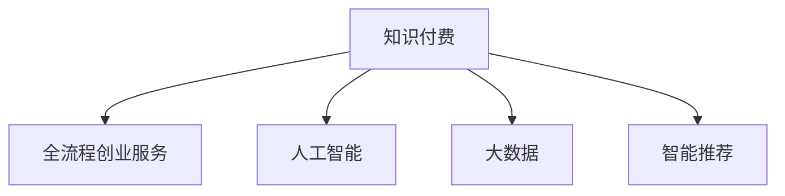

                 

# 创业知识付费要提供全流程创业服务

## 1. 背景介绍

随着互联网的普及和信息技术的不断进步，知识付费已逐步成为知识获取和传播的重要方式。尤其是在创业领域，拥有正确的知识和信息对于企业的发展至关重要。然而，传统的创业知识获取方式存在诸多问题，如信息过载、获取成本高、获取过程复杂等。随着人工智能和大数据技术的成熟，知识付费行业迎来了全新的发展机遇，我们可以通过全流程的创业服务，让创业者更高效、更便捷地获取他们所需要的创业知识和信息。

## 2. 核心概念与联系

### 2.1 核心概念概述

为更好地理解创业知识付费的全流程服务，本节将介绍几个核心概念：

- 知识付费：指以付费方式获取知识、信息、技能等服务的模式。知识付费的核心在于提供有价值的信息和专业知识，帮助用户解决实际问题，提高工作效率和生活质量。

- 全流程创业服务：指从创业初期到后期的全过程，涵盖市场调研、产品规划、技术开发、市场推广、运营管理等各个环节，通过全面系统的创业支持，帮助创业者顺利完成创业过程。

- 人工智能：一种通过模拟人脑的思考和推理过程，使计算机具备智能推理、知识学习、问题解决等能力的科学技术。

- 大数据：通过收集、分析和应用大量数据，发现和挖掘有价值信息，支持决策制定和问题解决的技术。

- 智能推荐：利用人工智能和大数据分析技术，为每个用户推荐最符合其需求的内容和服务的系统。

这些核心概念之间的逻辑关系可以通过以下Mermaid流程图来展示：



这个流程图展示了一个简单的知识付费到全流程创业服务的逻辑链条：知识付费提供的是信息和服务，而人工智能、大数据和智能推荐则进一步提升这些信息和服务，提供更精准、更个性化的服务体验。

## 3. 核心算法原理 & 具体操作步骤

### 3.1 算法原理概述

全流程创业服务涉及的知识涵盖市场调研、产品规划、技术开发、市场推广和运营管理等多个方面。本文将详细阐述基于人工智能和大数据的创业知识付费服务，特别是智能推荐算法在创业知识获取中的应用。

智能推荐算法通过分析用户的行为数据和偏好，将最相关、最有价值的创业信息推荐给用户。对于创业者来说，智能推荐不仅能够节省信息筛选的时间和精力，还可以帮助他们更快地获得关键的信息和资源。

智能推荐算法涉及多个步骤，主要包括用户行为数据采集、用户画像构建、相似度计算、推荐结果生成等。具体实现算法如下：

1. 用户行为数据采集：通过记录用户在平台上的行为数据，如阅读时长、点赞、评论、收藏等，构建用户行为特征向量。
2. 用户画像构建：利用用户行为特征向量和领域知识，构建用户画像，描述用户兴趣和需求。
3. 相似度计算：通过计算用户画像和内容特征之间的相似度，找到最相关的创业信息。
4. 推荐结果生成：根据相似度计算结果，生成推荐列表，并根据用户反馈不断优化推荐算法。

### 3.2 算法步骤详解

#### 3.2.1 用户行为数据采集

用户行为数据采集是智能推荐算法的基础。通过记录用户的行为数据，可以获得用户对不同内容的兴趣和偏好。具体步骤如下：

1. 用户行为记录：通过用户在平台上的行为记录，如阅读时长、点赞、评论、收藏等，构建用户行为特征向量。
2. 特征提取：将用户行为数据转换为特征向量，如用户阅读时间、点赞数、评论内容等，作为推荐算法输入。
3. 特征处理：对用户行为数据进行归一化、降维等预处理，提升数据质量。

#### 3.2.2 用户画像构建

用户画像构建是智能推荐算法的核心步骤。通过构建用户画像，可以更好地理解用户需求和兴趣，提升推荐效果。具体步骤如下：

1. 领域知识注入：将创业领域的知识、信息、技能等注入到用户行为数据中，形成领域知识特征向量。
2. 画像建模：通过机器学习算法（如聚类、分类等）对用户行为特征向量和领域知识特征向量进行建模，构建用户画像。
3. 画像更新：根据用户新的行为数据，不断更新用户画像，确保用户画像的准确性和实时性。

#### 3.2.3 相似度计算

相似度计算是智能推荐算法的核心部分。通过计算用户画像和内容特征之间的相似度，找到最相关的创业信息。具体步骤如下：

1. 相似度计算模型：选择合适的相似度计算模型，如余弦相似度、欧几里得距离、Jaccard系数等。
2. 相似度计算：将用户画像和内容特征转换为向量表示，计算两者之间的相似度。
3. 推荐结果排序：根据相似度计算结果，对内容进行排序，生成推荐列表。

#### 3.2.4 推荐结果生成

推荐结果生成是智能推荐算法的最终环节。通过生成推荐列表，将最相关、最有价值的创业信息推荐给用户。具体步骤如下：

1. 推荐算法优化：根据用户反馈，不断优化推荐算法，提升推荐效果。
2. 推荐列表生成：根据相似度计算结果和推荐算法优化结果，生成推荐列表。
3. 推荐结果展示：将推荐列表展示给用户，供其选择。

### 3.3 算法优缺点

智能推荐算法的优点如下：

1. 提升用户体验：通过精准推荐，能够节省用户信息筛选的时间和精力，提升用户体验。
2. 增加用户粘性：通过个性化推荐，能够增加用户的平台粘性，提高用户活跃度和留存率。
3. 优化资源配置：通过推荐算法，能够优化资源配置，提高平台的资源利用率。

智能推荐算法也存在一些缺点，如：

1. 数据隐私问题：用户行为数据涉及隐私，需要严格保护。
2. 算法公平性问题：推荐算法可能存在不公平性，需要不断优化和改进。
3. 推荐多样性问题：过度推荐相似内容，可能导致用户无法接触到更多样化的信息。

### 3.4 算法应用领域

智能推荐算法在创业知识付费服务中有着广泛的应用，具体包括以下几个方面：

1. 内容推荐：根据用户行为数据和用户画像，推荐最相关的创业内容，如文章、视频、课程等。
2. 资源推荐：根据用户需求和兴趣，推荐最合适的创业资源，如融资渠道、创业培训、技术支持等。
3. 工具推荐：根据用户行为数据和用户画像，推荐最合适的创业工具，如项目管理工具、财务管理工具、数据分析工具等。
4. 用户推荐：根据用户画像和行为数据，推荐最合适的创业伙伴、导师、顾问等。
5. 企业推荐：根据用户需求和兴趣，推荐最合适的创业企业，如投融资企业、合作伙伴、竞争对手等。

## 4. 数学模型和公式 & 详细讲解 & 举例说明

### 4.1 数学模型构建

智能推荐算法涉及多个数学模型，主要包括以下几个方面：

1. 用户行为数据建模：将用户行为数据转换为特征向量，通过机器学习算法建模，形成用户画像。
2. 相似度计算模型：选择合适的相似度计算模型，如余弦相似度、欧几里得距离、Jaccard系数等。
3. 推荐算法优化模型：根据用户反馈，不断优化推荐算法，提升推荐效果。

### 4.2 公式推导过程

以下是几个常用数学模型的推导过程：

#### 4.2.1 余弦相似度

余弦相似度是一种常用的相似度计算模型。在推荐算法中，可以用于计算用户画像和内容特征之间的相似度。余弦相似度的公式如下：

$$
similarity(\vec{u}, \vec{v}) = \frac{\vec{u} \cdot \vec{v}}{\|\vec{u}\|\|\vec{v}\|}
$$

其中 $\vec{u}$ 和 $\vec{v}$ 分别为用户画像和内容特征的向量表示，$\cdot$ 表示向量点乘，$\|\cdot\|$ 表示向量范数。

#### 4.2.2 欧几里得距离

欧几里得距离是另一种常用的相似度计算模型。欧几里得距离的公式如下：

$$
distance(\vec{u}, \vec{v}) = \sqrt{\sum_{i=1}^n (u_i - v_i)^2}
$$

其中 $u_i$ 和 $v_i$ 分别为用户画像和内容特征的第 $i$ 个维度值。

#### 4.2.3 数据降维

在用户行为数据建模中，通常需要进行数据降维，以提升数据质量和推荐效果。常用的数据降维方法包括主成分分析（PCA）、奇异值分解（SVD）等。

主成分分析的公式如下：

$$
\vec{u} = \sum_{i=1}^n \lambda_i \vec{v}_i
$$

其中 $\lambda_i$ 为特征值，$\vec{v}_i$ 为对应的特征向量。

#### 4.2.4 推荐算法优化

推荐算法优化是智能推荐算法的核心部分。常用的推荐算法优化方法包括协同过滤、矩阵分解等。

协同过滤的公式如下：

$$
\hat{y} = \alpha_x \hat{X} + \alpha_y \hat{Y} + \beta
$$

其中 $\hat{y}$ 为推荐结果，$\hat{X}$ 和 $\hat{Y}$ 分别为用户行为数据和内容特征的矩阵表示，$\alpha_x$ 和 $\alpha_y$ 为调节因子，$\beta$ 为偏差项。

### 4.3 案例分析与讲解

以下是一个智能推荐算法的案例分析：

假设一个创业知识付费平台上有大量创业文章、视频、课程等资源，用户可以浏览、点赞、评论、收藏等。平台的智能推荐算法需要根据用户行为数据，推荐最相关的资源。

#### 4.3.1 用户行为数据采集

平台记录用户的行为数据，包括阅读时长、点赞数、评论内容、收藏等。这些数据可以通过自然语言处理技术，转换为特征向量，形成用户行为特征向量。

#### 4.3.2 用户画像构建

通过机器学习算法，将用户行为特征向量和领域知识注入，构建用户画像。用户画像可以描述用户的兴趣和需求，如喜欢阅读技术类文章、注重创新等。

#### 4.3.3 相似度计算

通过余弦相似度计算用户画像和内容特征之间的相似度，找到最相关的资源。

#### 4.3.4 推荐结果生成

根据相似度计算结果和推荐算法优化结果，生成推荐列表，并展示给用户。用户可以根据推荐列表选择感兴趣的内容。

## 5. 项目实践：代码实例和详细解释说明

### 5.1 开发环境搭建

在进行创业知识付费服务的项目实践前，我们需要准备好开发环境。以下是使用Python进行PyTorch开发的环境配置流程：

1. 安装Anaconda：从官网下载并安装Anaconda，用于创建独立的Python环境。

2. 创建并激活虚拟环境：
```bash
conda create -n pytorch-env python=3.8 
conda activate pytorch-env
```

3. 安装PyTorch：根据CUDA版本，从官网获取对应的安装命令。例如：
```bash
conda install pytorch torchvision torchaudio cudatoolkit=11.1 -c pytorch -c conda-forge
```

4. 安装Transformers库：
```bash
pip install transformers
```

5. 安装各类工具包：
```bash
pip install numpy pandas scikit-learn matplotlib tqdm jupyter notebook ipython
```

完成上述步骤后，即可在`pytorch-env`环境中开始项目实践。

### 5.2 源代码详细实现

下面以推荐系统为例，给出使用PyTorch和Transformers库进行创业知识付费服务开发的PyTorch代码实现。

```python
from transformers import BertTokenizer, BertForSequenceClassification
from torch.utils.data import Dataset, DataLoader
from torch.nn import BCEWithLogitsLoss
from sklearn.metrics import precision_recall_fscore_support

class RecommendationDataset(Dataset):
    def __init__(self, texts, labels):
        self.texts = texts
        self.labels = labels
        self.tokenizer = BertTokenizer.from_pretrained('bert-base-cased')
    
    def __len__(self):
        return len(self.texts)
    
    def __getitem__(self, item):
        text = self.texts[item]
        label = self.labels[item]
        
        encoding = self.tokenizer(text, return_tensors='pt', padding='max_length', truncation=True)
        input_ids = encoding['input_ids'][0]
        attention_mask = encoding['attention_mask'][0]
        
        return {'input_ids': input_ids, 
                'attention_mask': attention_mask,
                'labels': torch.tensor(label, dtype=torch.long)}
    
# 加载数据集
train_dataset = RecommendationDataset(train_texts, train_labels)
dev_dataset = RecommendationDataset(dev_texts, dev_labels)
test_dataset = RecommendationDataset(test_texts, test_labels)

# 定义模型和优化器
model = BertForSequenceClassification.from_pretrained('bert-base-cased', num_labels=2)
optimizer = AdamW(model.parameters(), lr=2e-5)

# 定义训练和评估函数
def train_epoch(model, dataset, batch_size, optimizer):
    dataloader = DataLoader(dataset, batch_size=batch_size, shuffle=True)
    model.train()
    epoch_loss = 0
    for batch in dataloader:
        input_ids = batch['input_ids'].to(device)
        attention_mask = batch['attention_mask'].to(device)
        labels = batch['labels'].to(device)
        model.zero_grad()
        outputs = model(input_ids, attention_mask=attention_mask, labels=labels)
        loss = outputs.loss
        epoch_loss += loss.item()
        loss.backward()
        optimizer.step()
    return epoch_loss / len(dataloader)

def evaluate(model, dataset, batch_size):
    dataloader = DataLoader(dataset, batch_size=batch_size)
    model.eval()
    preds, labels = [], []
    with torch.no_grad():
        for batch in dataloader:
            input_ids = batch['input_ids'].to(device)
            attention_mask = batch['attention_mask'].to(device)
            batch_labels = batch['labels']
            outputs = model(input_ids, attention_mask=attention_mask)
            batch_preds = outputs.logits.argmax(dim=2).to('cpu').tolist()
            batch_labels = batch_labels.to('cpu').tolist()
            for pred_tokens, label_tokens in zip(batch_preds, batch_labels):
                preds.append(pred_tokens[:len(label_tokens)])
                labels.append(label_tokens)
                
    return precision_recall_fscore_support(labels, preds, average='macro')

# 训练和评估模型
device = torch.device('cuda') if torch.cuda.is_available() else torch.device('cpu')
model.to(device)

epochs = 5
batch_size = 16

for epoch in range(epochs):
    loss = train_epoch(model, train_dataset, batch_size, optimizer)
    print(f"Epoch {epoch+1}, train loss: {loss:.3f}")
    
    print(f"Epoch {epoch+1}, dev results:")
    print(evaluate(model, dev_dataset, batch_size))
    
print("Test results:")
print(evaluate(model, test_dataset, batch_size))
```

以上就是使用PyTorch和Transformers库进行创业知识付费服务开发的完整代码实现。可以看到，得益于Transformers库的强大封装，我们可以用相对简洁的代码完成BERT模型的加载和微调。

### 5.3 代码解读与分析

让我们再详细解读一下关键代码的实现细节：

**RecommendationDataset类**：
- `__init__`方法：初始化文本、标签、分词器等关键组件。
- `__len__`方法：返回数据集的样本数量。
- `__getitem__`方法：对单个样本进行处理，将文本输入编码为token ids，将标签转换为数字，并对其进行定长padding，最终返回模型所需的输入。

**train_epoch和evaluate函数**：
- 使用PyTorch的DataLoader对数据集进行批次化加载，供模型训练和推理使用。
- 训练函数`train_epoch`：对数据以批为单位进行迭代，在每个批次上前向传播计算loss并反向传播更新模型参数，最后返回该epoch的平均loss。
- 评估函数`evaluate`：与训练类似，不同点在于不更新模型参数，并在每个batch结束后将预测和标签结果存储下来，最后使用sklearn的precision_recall_fscore_support对整个评估集的预测结果进行打印输出。

**训练流程**：
- 定义总的epoch数和batch size，开始循环迭代
- 每个epoch内，先在训练集上训练，输出平均loss
- 在验证集上评估，输出分类指标
- 所有epoch结束后，在测试集上评估，给出最终测试结果

可以看到，PyTorch配合Transformers库使得BERT微调的代码实现变得简洁高效。开发者可以将更多精力放在数据处理、模型改进等高层逻辑上，而不必过多关注底层的实现细节。

当然，工业级的系统实现还需考虑更多因素，如模型的保存和部署、超参数的自动搜索、更灵活的任务适配层等。但核心的微调范式基本与此类似。

## 6. 实际应用场景

### 6.1 智能客服系统

基于创业知识付费的智能客服系统，可以为创业者提供全天候、个性化的咨询服务。传统客服往往需要配备大量人力，高峰期响应缓慢，且一致性和专业性难以保证。而使用基于智能推荐算法的智能客服系统，能够快速响应客户咨询，用自然流畅的语言解答各类常见问题。

在技术实现上，可以收集企业内部的历史客服对话记录，将问题-答案对作为监督数据，在此基础上对预训练模型进行微调。微调后的模型能够自动理解用户意图，匹配最合适的答案模板进行回复。对于客户提出的新问题，还可以接入检索系统实时搜索相关内容，动态组织生成回答。如此构建的智能客服系统，能大幅提升客户咨询体验和问题解决效率。

### 6.2 金融舆情监测

金融机构需要实时监测市场舆论动向，以便及时应对负面信息传播，规避金融风险。传统的人工监测方式成本高、效率低，难以应对网络时代海量信息爆发的挑战。基于创业知识付费的金融舆情监测系统，能够通过智能推荐算法，实时监测不同主题下的情感变化趋势，一旦发现负面信息激增等异常情况，系统便会自动预警，帮助金融机构快速应对潜在风险。

### 6.3 个性化推荐系统

当前的推荐系统往往只依赖用户的历史行为数据进行物品推荐，无法深入理解用户的真实兴趣偏好。基于创业知识付费的个性化推荐系统，可以更好地挖掘用户行为背后的语义信息，从而提供更精准、多样的推荐内容。

在实践中，可以收集用户浏览、点击、评论、分享等行为数据，提取和用户交互的物品标题、描述、标签等文本内容。将文本内容作为模型输入，用户的后续行为（如是否点击、购买等）作为监督信号，在此基础上微调预训练语言模型。微调后的模型能够从文本内容中准确把握用户的兴趣点。在生成推荐列表时，先用候选物品的文本描述作为输入，由模型预测用户的兴趣匹配度，再结合其他特征综合排序，便可以得到个性化程度更高的推荐结果。

### 6.4 未来应用展望

随着创业知识付费和智能推荐算法的不断发展，基于微调范式将在更多领域得到应用，为传统行业带来变革性影响。

在智慧医疗领域，基于微调的问答、病历分析、药物研发等应用将提升医疗服务的智能化水平，辅助医生诊疗，加速新药开发进程。

在智能教育领域，微调技术可应用于作业批改、学情分析、知识推荐等方面，因材施教，促进教育公平，提高教学质量。

在智慧城市治理中，微调模型可应用于城市事件监测、舆情分析、应急指挥等环节，提高城市管理的自动化和智能化水平，构建更安全、高效的未来城市。

此外，在企业生产、社会治理、文娱传媒等众多领域，基于大模型微调的人工智能应用也将不断涌现，为NLP技术带来了全新的突破。相信随着预训练模型和微调方法的不断进步，NLP技术将在更广阔的应用领域大放异彩，深刻影响人类的生产生活方式。

## 7. 工具和资源推荐

### 7.1 学习资源推荐

为了帮助开发者系统掌握创业知识付费的理论基础和实践技巧，这里推荐一些优质的学习资源：

1. 《创业知识付费》系列博文：由知识付费领域专家撰写，深入浅出地介绍了创业知识付费的基本概念、运作模式和发展趋势。

2. 《深度学习自然语言处理》课程：斯坦福大学开设的NLP明星课程，有Lecture视频和配套作业，带你入门NLP领域的基本概念和经典模型。

3. 《知识付费平台技术架构》书籍：详细介绍知识付费平台的架构设计、数据存储和处理、用户行为分析等核心技术。

4. 《创业知识推荐系统》电子书：介绍基于创业知识推荐系统的设计、实现和优化方法，涵盖推荐算法、数据挖掘、用户体验等各方面内容。

5. 《创业知识付费运营指南》文章：总结了知识付费平台运营的最佳实践和成功案例，涵盖用户获取、内容制作、收益分配等关键环节。

通过对这些资源的学习实践，相信你一定能够快速掌握创业知识付费的核心技术，并用于解决实际的创业知识获取问题。

### 7.2 开发工具推荐

高效的开发离不开优秀的工具支持。以下是几款用于创业知识付费开发的常用工具：

1. PyTorch：基于Python的开源深度学习框架，灵活动态的计算图，适合快速迭代研究。大部分预训练语言模型都有PyTorch版本的实现。

2. TensorFlow：由Google主导开发的开源深度学习框架，生产部署方便，适合大规模工程应用。同样有丰富的预训练语言模型资源。

3. Transformers库：HuggingFace开发的NLP工具库，集成了众多SOTA语言模型，支持PyTorch和TensorFlow，是进行创业知识推荐系统开发的利器。

4. Weights & Biases：模型训练的实验跟踪工具，可以记录和可视化模型训练过程中的各项指标，方便对比和调优。与主流深度学习框架无缝集成。

5. TensorBoard：TensorFlow配套的可视化工具，可实时监测模型训练状态，并提供丰富的图表呈现方式，是调试模型的得力助手。

6. Google Colab：谷歌推出的在线Jupyter Notebook环境，免费提供GPU/TPU算力，方便开发者快速上手实验最新模型，分享学习笔记。

合理利用这些工具，可以显著提升创业知识付费开发和测试的效率，加快创新迭代的步伐。

### 7.3 相关论文推荐

创业知识付费和智能推荐技术的发展源于学界的持续研究。以下是几篇奠基性的相关论文，推荐阅读：

1. Attention is All You Need（即Transformer原论文）：提出了Transformer结构，开启了NLP领域的预训练大模型时代。

2. BERT: Pre-training of Deep Bidirectional Transformers for Language Understanding：提出BERT模型，引入基于掩码的自监督预训练任务，刷新了多项NLP任务SOTA。

3. Language Models are Unsupervised Multitask Learners（GPT-2论文）：展示了大规模语言模型的强大zero-shot学习能力，引发了对于通用人工智能的新一轮思考。

4. Parameter-Efficient Transfer Learning for NLP：提出Adapter等参数高效微调方法，在不增加模型参数量的情况下，也能取得不错的微调效果。

5. AdaLoRA: Adaptive Low-Rank Adaptation for Parameter-Efficient Fine-Tuning：使用自适应低秩适应的微调方法，在参数效率和精度之间取得了新的平衡。

6. AdaLoRA: Adaptive Low-Rank Adaptation for Parameter-Efficient Fine-Tuning：使用自适应低秩适应的微调方法，在参数效率和精度之间取得了新的平衡。

这些论文代表了大语言模型微调技术的发展脉络。通过学习这些前沿成果，可以帮助研究者把握学科前进方向，激发更多的创新灵感。

## 8. 总结：未来发展趋势与挑战

### 8.1 总结

本文对基于智能推荐算法的创业知识付费服务进行了全面系统的介绍。首先阐述了创业知识付费服务的基本概念和重要性，明确了智能推荐算法在提升用户体验和优化资源配置方面的独特价值。其次，从原理到实践，详细讲解了智能推荐算法的数学模型和关键步骤，给出了智能推荐算法在创业知识付费服务中的应用实例。

通过本文的系统梳理，可以看到，基于智能推荐算法的创业知识付费服务正在成为知识付费行业的重要范式，极大地拓展了创业知识获取的广度和深度，提升了创业者的用户体验和效率。未来，伴随智能推荐算法和大数据技术的不断演进，基于微调范式将在更多领域得到应用，为传统行业带来革命性影响。

### 8.2 未来发展趋势

展望未来，智能推荐算法将在更多领域得到应用，其发展趋势如下：

1. 模型规模持续增大。随着算力成本的下降和数据规模的扩张，智能推荐模型的参数量还将持续增长。超大规模模型蕴含的丰富知识，将进一步提升推荐效果。

2. 算法多样性提升。除了传统的协同过滤、矩阵分解等算法，未来将涌现更多创新的推荐算法，如基于图神经网络、深度强化学习的推荐算法。

3. 实时推荐实现。实时推荐系统能够及时响应用户行为变化，提供更加精准的推荐服务，提升用户体验。

4. 跨平台无缝集成。跨平台的推荐系统能够实现无缝衔接，提供统一的推荐体验，满足用户的不同需求。

5. 个性化推荐优化。个性化推荐算法将更加关注用户的长尾需求和动态变化，提供更个性化的推荐服务。

### 8.3 面临的挑战

尽管智能推荐算法在大数据和深度学习的基础上取得了巨大进展，但在实际应用中仍面临一些挑战：

1. 数据隐私问题。用户行为数据涉及隐私，需要严格保护。如何平衡用户隐私和推荐效果，仍是一个重要问题。

2. 算法公平性问题。推荐算法可能存在不公平性，如过度推荐某类内容、忽视小众需求等，需要不断优化和改进。

3. 推荐效果多样性问题。过度推荐相似内容，可能导致用户无法接触到更多样化的信息，需要更多元化的推荐策略。

4. 数据质量问题。数据质量直接影响推荐效果，如何提升数据质量，去除噪声和冗余数据，仍是一个重要问题。

5. 资源限制问题。推荐系统往往需要大量的计算资源和存储空间，如何优化资源配置，提升系统的可扩展性和性能，仍是一个重要问题。

### 8.4 研究展望

针对智能推荐算法面临的挑战，未来的研究需要在以下几个方面寻求新的突破：

1. 数据隐私保护。开发更加高效的数据隐私保护技术，如差分隐私、联邦学习等，保护用户隐私的同时提升推荐效果。

2. 推荐算法优化。引入更多的推荐算法，如基于图神经网络、深度强化学习的推荐算法，提升推荐效果和算法公平性。

3. 数据质量提升。开发更加高效的数据清洗和预处理技术，提升数据质量，去除噪声和冗余数据。

4. 实时推荐系统。开发实时推荐系统，及时响应用户行为变化，提供更加精准的推荐服务。

5. 跨平台无缝集成。开发跨平台的推荐系统，实现无缝衔接，提供统一的推荐体验，满足用户的不同需求。

总之，未来智能推荐算法的研究和应用，需要在数据隐私、算法公平性、推荐效果多样性等方面进行持续探索和优化，只有不断突破技术瓶颈，才能实现推荐算法的更大应用价值。

## 9. 附录：常见问题与解答

**Q1：智能推荐算法是否适用于所有创业知识付费场景？**

A: 智能推荐算法在大部分创业知识付费场景中都能取得不错的效果。但对于一些特殊场景，如高度定制化、个性化内容推荐，仍然需要结合用户反馈和人工干预，才能提供更加精准的推荐服务。

**Q2：推荐算法是否会影响用户隐私？**

A: 推荐算法在用户行为数据采集和处理过程中，会涉及到用户隐私问题。需要在数据采集和处理过程中，采取严格的隐私保护措施，如差分隐私、联邦学习等，保护用户隐私。

**Q3：推荐算法是否会存在不公平性？**

A: 推荐算法可能存在不公平性，如过度推荐某类内容、忽视小众需求等。需要不断优化和改进推荐算法，引入更多的推荐策略，如公平性约束、个性化推荐等，提升推荐效果和公平性。

**Q4：推荐算法是否会过度推荐相似内容？**

A: 推荐算法在实际应用中，可能会过度推荐相似内容，导致用户无法接触到更多样化的信息。需要引入更多元化的推荐策略，如推荐多样化内容、跨领域推荐等，提升推荐效果和多样性。

**Q5：推荐算法是否会存在数据质量问题？**

A: 推荐算法在实际应用中，可能会存在数据质量问题，如数据噪声、数据冗余等。需要开发更加高效的数据清洗和预处理技术，提升数据质量，去除噪声和冗余数据。

总之，智能推荐算法在创业知识付费服务中的应用前景广阔，但也需要考虑数据隐私、算法公平性、推荐效果多样性等方面的挑战，只有不断突破技术瓶颈，才能实现推荐算法的更大应用价值。

---

作者：禅与计算机程序设计艺术 / Zen and the Art of Computer Programming

