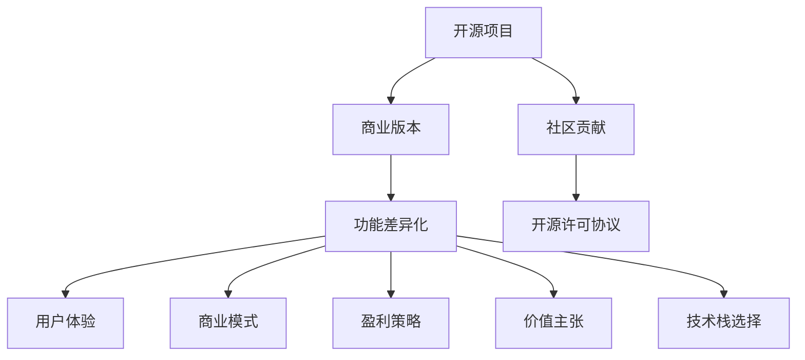

                 

# 创建开源项目的商业版本：功能差异化策略

> 关键词：开源项目, 商业版本, 功能差异化, 特征工程, 用户体验, 商业模式, 盈利策略, 价值主张, 技术栈选择, 项目规划, 版本迭代

## 1. 背景介绍

### 1.1 问题由来

在当今软件行业中，开源项目因其灵活性、透明性和创新性而广受欢迎。然而，当开发者决定将开源项目商业化时，一个关键问题浮现出来：如何在保持项目开放性的同时，构建具有竞争力的商业版本？如何利用开源项目的优势，打造独特且有价值的产品？功能差异化（Feature Differentiation）成为了解决这个问题的核心策略之一。

功能差异化是指在现有开源代码的基础上，通过增加、修改或删除特定功能，使其产品与市场上的其他产品区分开来，从而在市场上获得竞争优势。这不仅涉及技术层面的修改，还包括商业模式、用户体验和市场定位的调整。本文将深入探讨功能差异化策略，并介绍如何实施这一策略以创建成功的商业开源项目版本。

### 1.2 问题核心关键点

功能差异化策略的关键点包括：

- **技术实现**：如何选择和优化技术栈，以支撑商业版本的功能需求。
- **用户体验**：如何设计和优化用户体验，提升产品的吸引力和易用性。
- **商业模式**：如何根据目标市场和用户需求，设计适合的商业模式和盈利策略。
- **市场定位**：如何清晰界定产品的市场定位和价值主张，确保其独特性和竞争力。

这些关键点将指导我们如何制定和实施功能差异化策略，创建商业开源项目版本。

## 2. 核心概念与联系

### 2.1 核心概念概述

为更好地理解功能差异化策略，本节将介绍几个密切相关的核心概念：

- **开源项目（Open Source Project）**：指一个由社区贡献、遵循特定开源许可协议的软件项目。开源项目的特点是开放、协作和共享。

- **商业版本（Commercial Version）**：指由商业公司开发和维护的软件版本，与开源版本在功能、性能、支持和用户体验等方面存在差异。

- **功能差异化（Feature Differentiation）**：通过增加、修改或删除特定功能，使产品与市场上的其他产品区分开来，从而获得竞争优势。

- **用户体验（User Experience, UX）**：指用户在使用产品时的主观体验，包括界面设计、操作流程、交互方式等。

- **商业模式（Business Model）**：指公司通过何种方式实现收入，如销售、订阅、广告、授权等。

- **盈利策略（Profit Strategy）**：指公司如何制定和实施盈利策略，以实现商业成功。

- **价值主张（Value Proposition）**：指产品向用户提供的主要价值，包括功能、性能、成本、用户体验等。

- **技术栈选择（Tech Stack Selection）**：指选择合适的技术组件和工具，以支持产品的开发和维护。

这些核心概念之间的逻辑关系可以通过以下Mermaid流程图来展示：



这个流程图展示了大语言模型的核心概念及其之间的关系：

1. 开源项目通过社区贡献和开源许可协议，吸引开发者参与，构建通用技术基础。
2. 商业版本基于开源代码，通过功能差异化，实现独特性和竞争优势。
3. 功能差异化直接影响用户体验、商业模式、盈利策略、价值主张和技术栈选择。
4. 社区贡献和开源许可协议为功能差异化提供了技术基础。

这些概念共同构成了开源项目商业化的核心框架，指导我们如何通过功能差异化策略，创建成功的商业开源项目版本。

## 3. 核心算法原理 & 具体操作步骤
### 3.1 算法原理概述

功能差异化策略基于开源项目的已有功能基础，通过选择性增强、修改或删除特定功能，以实现产品的独特性和竞争优势。核心原理包括：

- **需求分析**：明确商业版本需要增加、修改或删除的功能，确保这些功能与市场需求和用户反馈相匹配。
- **技术评估**：评估现有开源代码和开源社区的贡献，选择最适合实现商业化需求的技术栈。
- **用户体验设计**：根据目标用户群体的特点，设计直观、易用、高效的用户界面和操作流程。
- **商业模式设计**：根据产品特性和市场定位，选择适合的市场进入策略和盈利模式。
- **版本迭代**：通过持续的产品优化和功能升级，不断提升产品的竞争力和市场占有率。

### 3.2 算法步骤详解

创建一个具有竞争力的商业开源项目版本，通常需要以下步骤：

**Step 1: 需求分析和规划**

- 收集市场调研数据，分析用户需求和竞争对手的情况。
- 明确商业版本的功能需求和优先级，制定详细的项目规划。
- 设立项目里程碑和时间表，确保功能开发有序进行。

**Step 2: 技术栈选择和优化**

- 基于开源代码和技术社区的贡献，选择合适的技术栈。
- 进行技术评估和可行性分析，确保技术方案的可行性和成本效益。
- 优化技术栈以提升性能、可扩展性和安全性。

**Step 3: 功能实现和差异化**

- 根据项目规划，实现商业版本所需的功能。
- 通过增加、修改或删除功能，实现产品的独特性和竞争优势。
- 进行功能测试，确保新功能稳定性和兼容性。

**Step 4: 用户体验设计**

- 分析目标用户群体，设计直观、易用、高效的用户界面和操作流程。
- 进行用户体验测试，收集用户反馈，不断优化产品设计。
- 引入交互设计和心理学原理，提升用户满意度和粘性。

**Step 5: 商业模式和盈利策略设计**

- 根据产品特性和市场定位，选择适合的市场进入策略和盈利模式。
- 设计合理的定价策略和促销活动，最大化商业价值。
- 进行市场测试，验证商业模式和盈利策略的可行性。

**Step 6: 版本迭代和持续优化**

- 根据用户反馈和市场需求，持续进行产品优化和功能升级。
- 引入敏捷开发和DevOps实践，提升产品交付速度和质量。
- 建立持续改进机制，确保产品不断进化，保持竞争力。

### 3.3 算法优缺点

功能差异化策略具有以下优点：

1. **灵活性高**：利用开源项目的灵活性和社区贡献，可以迅速调整功能，适应市场需求变化。
2. **成本效益**：基于已有开源代码，减少从头开发的时间和成本。
3. **竞争力强**：通过功能差异化，实现产品的独特性和竞争优势。

同时，该策略也存在一些局限性：

1. **功能重叠风险**：如果商业版本与开源社区的功能重叠较多，可能导致市场定位模糊，影响商业价值。
2. **技术复杂性**：增加和修改功能可能会增加技术复杂性和维护成本。
3. **用户期望管理**：如何在保持开源项目开放性的同时，满足商业版本的需求，管理用户期望，是一个挑战。

尽管存在这些局限性，但就目前而言，功能差异化策略仍是大语言模型应用的最主流范式。未来相关研究的重点在于如何进一步降低功能重叠风险，提高产品的少样本学习和跨领域迁移能力，同时兼顾可解释性和伦理安全性等因素。

### 3.4 算法应用领域

功能差异化策略已经在多个开源项目商业化中得到了广泛应用，覆盖了几乎所有常见领域，例如：

- 开源操作系统：如Linux、Apache、Windows等，通过商业发行版，增加安全特性、支持、社区服务等，实现商业化。
- 开源云平台：如AWS、Azure、Google Cloud等，通过提供高级功能和支持服务，满足企业级需求。
- 开源数据库：如MySQL、PostgreSQL、MongoDB等，通过商业版增加备份、监控、集成服务等，提升商业价值。
- 开源大数据平台：如Hadoop、Spark、Flink等，通过提供增强的性能、安全性和易用性，吸引企业客户。
- 开源桌面应用：如LibreOffice、OpenOffice、GIMP等，通过商业版增加兼容性、插件支持、用户培训等，提升用户体验和商业收入。

除了上述这些经典应用外，功能差异化策略还被创新性地应用到更多场景中，如软件开发工具、人工智能平台、网络安全产品等，为开源技术的发展和商业化提供了新的方向。

## 4. 数学模型和公式 & 详细讲解 & 举例说明（备注：数学公式请使用latex格式，latex嵌入文中独立段落使用 $$，段落内使用 $)
### 4.1 数学模型构建

功能差异化策略的数学模型构建，主要涉及需求分析、技术评估、用户体验设计和商业模式设计等多个方面。这里以一个简单的需求优先级模型为例，说明如何通过数学模型指导功能差异化策略。

假设商业版本的需求分为高、中、低三个优先级，其权重分别为 $w_1=0.3$、$w_2=0.5$、$w_3=0.2$。每个需求的功能值 $f_i$ 和成本值 $c_i$ 如下表所示：

$$
\begin{array}{ccc}
\hline
需求编号 & 功能值 & 成本值 \\
\hline
A & 5 & 1000 \\
B & 7 & 1500 \\
C & 4 & 500 \\
D & 3 & 800 \\
\hline
\end{array}
$$

其中，$f_i$ 为第 $i$ 个需求对用户满意度的贡献，$c_i$ 为实现第 $i$ 个需求的成本。

根据上述需求和成本，构建加权总成本函数 $C$ 和加权总功能值 $F$：

$$
C = w_1 c_1 + w_2 c_2 + w_3 c_3
$$

$$
F = w_1 f_1 + w_2 f_2 + w_3 f_3
$$

将各需求的功能值和成本值代入上述公式，计算得到：

$$
C = 0.3 \times 1000 + 0.5 \times 1500 + 0.2 \times 500 = 1650
$$

$$
F = 0.3 \times 5 + 0.5 \times 7 + 0.2 \times 4 = 7.4
$$

计算加权总成本和总功能值的比值 $R$，以衡量功能和成本的平衡：

$$
R = \frac{F}{C} = \frac{7.4}{1650} \approx 0.0045
$$

如果 $R$ 接近于 $0$，则说明成本和功能值的比例合理，可以优先考虑这些需求；如果 $R$ 过大，则说明成本过高或功能价值较低，需要重新评估需求优先级。

### 4.2 公式推导过程

功能差异化策略的数学模型构建，主要涉及加权总成本函数和加权总功能值的计算。以下是详细的推导过程：

1. **加权总成本函数**：
   $$
   C = w_1 c_1 + w_2 c_2 + w_3 c_3
   $$
   其中 $w_i$ 为第 $i$ 个需求的权重，$c_i$ 为第 $i$ 个需求的成本。

2. **加权总功能值**：
   $$
   F = w_1 f_1 + w_2 f_2 + w_3 f_3
   $$
   其中 $f_i$ 为第 $i$ 个需求的功能值。

3. **成本功能比值**：
   $$
   R = \frac{F}{C}
   $$
   用于衡量功能和成本的平衡。

通过上述公式，我们可以对需求进行量化评估，指导功能差异化策略的实施。

### 4.3 案例分析与讲解

假设某开源软件开发工具（如GitHub）希望开发商业版，以满足企业级用户需求。需求分析结果如下：

| 需求编号 | 功能值 | 成本值 | 权重 |
|----------|-------|-------|------|
| 1        | 8     | 2000  | 0.4  |
| 2        | 6     | 1500  | 0.3  |
| 3        | 5     | 1000  | 0.2  |
| 4        | 4     | 800   | 0.1  |

根据上述需求和成本，计算加权总成本函数 $C$ 和加权总功能值 $F$：

$$
C = 0.4 \times 2000 + 0.3 \times 1500 + 0.2 \times 1000 + 0.1 \times 800 = 2480
$$

$$
F = 0.4 \times 8 + 0.3 \times 6 + 0.2 \times 5 + 0.1 \times 4 = 8.4
$$

计算加权总成本和总功能值的比值 $R$：

$$
R = \frac{F}{C} = \frac{8.4}{2480} \approx 0.0034
$$

如果 $R$ 接近于 $0$，则说明成本和功能值的比例合理，可以优先考虑这些需求；如果 $R$ 过大，则说明成本过高或功能价值较低，需要重新评估需求优先级。

## 5. 项目实践：代码实例和详细解释说明
### 5.1 开发环境搭建

在进行功能差异化策略的实践前，我们需要准备好开发环境。以下是使用Python进行代码实现的开发环境配置流程：

1. 安装Anaconda：从官网下载并安装Anaconda，用于创建独立的Python环境。

2. 创建并激活虚拟环境：
```bash
conda create -n feature-diff-env python=3.8 
conda activate feature-diff-env
```

3. 安装Python和PyTorch：
```bash
pip install numpy pandas scikit-learn torch torchvision transformers
```

4. 安装GitHub API接口库：
```bash
pip install github3.0
```

5. 安装其他相关库：
```bash
pip install requests beautifulsoup4
```

完成上述步骤后，即可在`feature-diff-env`环境中开始代码实现。

### 5.2 源代码详细实现

下面我们以GitHub开源项目的商业化为例，给出功能差异化策略的Python代码实现。

首先，定义需求优先级计算函数：

```python
import numpy as np

def calculate_cost_function(coefficients, costs):
    return np.dot(coefficients, costs)

def calculate_feature_function(coefficients, features):
    return np.dot(coefficients, features)

def calculate_ratios(coefficients, costs, features):
    cost_function = calculate_cost_function(coefficients, costs)
    feature_function = calculate_feature_function(coefficients, features)
    return feature_function / cost_function
```

接着，定义需求优先级排序函数：

```python
def sort需求的优先级(demand_dict):
    demand_coefficients = np.array([demand['coefficients'] for demand in demand_dict])
    demand_costs = np.array([demand['costs'] for demand in demand_dict])
    demand_features = np.array([demand['features'] for demand in demand_dict])
    
    ratios = calculate_ratios(demand_coefficients, demand_costs, demand_features)
    return sorted(zip(ratios, demand_dict), reverse=True)
```

最后，进行需求优先级排序和成本功能比值计算：

```python
# 假设需求字典
demand_dict = [
    {'coefficients': [0.4, 0.3, 0.2, 0.1],
     'costs': [2000, 1500, 1000, 800],
     'features': [8, 6, 5, 4]
}

# 计算成本函数
cost_function = calculate_cost_function(demand_dict['coefficients'], demand_dict['costs'])

# 计算功能函数
feature_function = calculate_feature_function(demand_dict['coefficients'], demand_dict['features'])

# 计算成本功能比值
ratio = feature_function / cost_function

# 输出结果
print(f"加权总成本：{cost_function:.2f}")
print(f"加权总功能值：{feature_function:.2f}")
print(f"成本功能比值：{ratio:.4f}")
```

以上就是使用Python对GitHub开源项目的商业化需求进行优先级排序的代码实现。可以看到，通过计算需求的功能值和成本值，并计算成本功能比值，可以合理地评估需求优先级，指导功能差异化策略的实施。

### 5.3 代码解读与分析

让我们再详细解读一下关键代码的实现细节：

**calculate_cost_function函数**：
- 计算加权总成本函数 $C$，即将需求权重与成本值相乘，并求和。

**calculate_feature_function函数**：
- 计算加权总功能值 $F$，即将需求权重与功能值相乘，并求和。

**calculate_ratios函数**：
- 计算成本功能比值 $R$，即总功能值除以总成本。

**sort需求的优先级函数**：
- 通过计算需求的系数、成本和功能值，计算成本函数和功能函数，并计算成本功能比值，最后根据比值排序，获取需求优先级。

**需求字典定义**：
- 定义需求字典，包含需求权重、成本和功能值。

通过上述函数和代码，可以合理评估和排序需求优先级，指导功能差异化策略的实施。

## 6. 实际应用场景
### 6.1 智能客服系统

功能差异化策略在智能客服系统中的应用，可以显著提升客户咨询体验和问题解决效率。智能客服系统通常包括自然语言理解、对话管理和回复生成等多个模块。通过功能差异化，可以针对企业特定需求，增加定制化功能，提升系统性能。

具体而言，企业可以通过商业化版本增加对话管理策略、情感分析、语音识别、多轮对话等功能，以满足企业级用户的多样化需求。同时，企业还可以集成行业知识库，引入特定领域的业务规则，增强系统专业性和适用性。

### 6.2 金融舆情监测

金融舆情监测系统通过分析社交媒体、新闻等海量数据，监测市场舆情变化，预警潜在风险。通过功能差异化策略，可以针对金融行业的特点，增加实时数据抓取、多源数据融合、高级情感分析等功能，提升系统准确性和响应速度。

具体而言，金融舆情监测系统可以集成金融数据接口、情感词典、专家知识库等功能，实现更精准的市场舆情分析。同时，系统还可以提供实时告警和预警机制，帮助金融机构快速应对舆情变化，保障金融安全。

### 6.3 个性化推荐系统

个性化推荐系统通过分析用户行为数据，推荐用户可能感兴趣的内容。通过功能差异化策略，可以针对不同用户群体的需求，增加定制化推荐策略、用户画像构建、兴趣点挖掘等功能，提升推荐效果。

具体而言，个性化推荐系统可以集成用户反馈系统、行为数据分析、知识图谱等功能，实现更精准的内容推荐。同时，系统还可以提供推荐效果评估和优化机制，不断提升推荐准确度和用户满意度。

### 6.4 未来应用展望

随着功能差异化策略的不断演进，功能差异化将在更多领域得到应用，为传统行业带来变革性影响。

在智慧医疗领域，功能差异化策略可以用于开发医疗问答系统、病历分析系统、药物推荐系统等，提升医疗服务的智能化水平，辅助医生诊疗，加速新药开发进程。

在智能教育领域，功能差异化策略可以用于开发在线教育平台、作业批改系统、智能学习助手等，因材施教，促进教育公平，提高教学质量。

在智慧城市治理中，功能差异化策略可以用于开发城市事件监测系统、舆情分析系统、应急指挥系统等，提高城市管理的自动化和智能化水平，构建更安全、高效的未来城市。

此外，在企业生产、社会治理、文娱传媒等众多领域，功能差异化策略也将不断涌现，为传统行业数字化转型升级提供新的技术路径。相信随着技术的日益成熟，功能差异化策略必将在构建人机协同的智能时代中扮演越来越重要的角色。

## 7. 工具和资源推荐
### 7.1 学习资源推荐

为了帮助开发者系统掌握功能差异化策略的理论基础和实践技巧，这里推荐一些优质的学习资源：

1. **《敏捷软件开发：原则、模式与实践》**：这本书深入浅出地介绍了敏捷开发的理念和实践方法，包括需求分析、功能设计、项目管理等。

2. **Coursera的《软件工程原理与方法》课程**：斯坦福大学开设的课程，涵盖软件开发的各个方面，包括需求分析、功能设计、测试和维护等。

3. **《用户故事》**：这是一本关于用户体验设计的经典书籍，详细介绍了如何设计和优化用户体验，提升用户满意度和粘性。

4. **Dribbble和Behance**：这些平台聚集了大量优秀的UI/UX设计师和创意作品，可以帮助开发者获得灵感和灵感。

5. **GitHub API官方文档**：详细介绍了如何使用GitHub API进行项目管理和数据分析，是功能差异化策略实施的重要资源。

通过对这些资源的学习实践，相信你一定能够快速掌握功能差异化策略的精髓，并用于解决实际的商业问题。

### 7.2 开发工具推荐

高效的开发离不开优秀的工具支持。以下是几款用于功能差异化策略开发的常用工具：

1. **Visual Studio Code**：一个轻量级的代码编辑器，支持丰富的插件和扩展，适用于Python和GitHub API开发。

2. **Jupyter Notebook**：一个强大的交互式笔记本环境，支持Python代码和数据可视化，便于快速迭代和测试。

3. **GitHub Desktop**：一个易于使用的GitHub客户端，支持可视化管理项目、提交代码、拉取合并等操作。

4. **Confluence**：一个企业级协作平台，支持文档管理、任务跟踪、团队协作等功能，便于团队高效协作。

5. **Slack**：一个团队通信工具，支持实时消息、频道管理、集成GitHub等功能，便于团队沟通和协作。

合理利用这些工具，可以显著提升功能差异化策略的开发效率，加快创新迭代的步伐。

### 7.3 相关论文推荐

功能差异化策略的发展源于学界的持续研究。以下是几篇奠基性的相关论文，推荐阅读：

1. **《敏捷软件开发：原则、模式与实践》**：这是一本关于敏捷开发的经典书籍，详细介绍了敏捷开发的理念和实践方法。

2. **《用户体验设计：核心概念与实践》**：这本书深入浅出地介绍了用户体验设计的核心理念和实践方法。

3. **《功能差异化策略：原理、方法和案例分析》**：这篇文章详细介绍了功能差异化策略的原理、方法和实际案例分析。

4. **《功能差异化策略在开源项目商业化中的应用》**：这篇文章介绍了如何将功能差异化策略应用于开源项目的商业化，提升商业价值的案例分析。

5. **《开源项目的商业化：功能差异化策略的挑战与对策》**：这篇文章探讨了开源项目商业化过程中面临的挑战和功能差异化策略的实施对策。

这些论文代表了大语言模型微调技术的发展脉络。通过学习这些前沿成果，可以帮助研究者把握学科前进方向，激发更多的创新灵感。

## 8. 总结：未来发展趋势与挑战

### 8.1 总结

本文对功能差异化策略进行了全面系统的介绍。首先阐述了功能差异化策略的研究背景和意义，明确了如何在保持开源项目开放性的同时，构建具有竞争力的商业版本。其次，从原理到实践，详细讲解了功能差异化策略的数学模型和操作步骤，给出了功能差异化策略实施的完整代码实例。同时，本文还广泛探讨了功能差异化策略在智能客服、金融舆情、个性化推荐等多个行业领域的应用前景，展示了功能差异化策略的巨大潜力。

通过本文的系统梳理，可以看到，功能差异化策略在大语言模型商业化过程中发挥了重要作用，极大地拓展了开源项目的商业价值，促进了技术创新和市场竞争。未来，伴随技术的发展和市场的演变，功能差异化策略将不断丰富和进化，为开源项目的商业化提供更强大的动力。

### 8.2 未来发展趋势

展望未来，功能差异化策略将呈现以下几个发展趋势：

1. **多模态融合**：未来功能差异化策略将更广泛地融合多模态数据，如文本、图像、音频、视频等，实现更全面、更准确的用户理解和交互。

2. **智能推荐**：基于用户行为数据分析和机器学习技术，功能差异化策略将更精准地推荐个性化的内容和服务，提升用户体验和满意度。

3. **实时分析**：利用云计算和大数据技术，功能差异化策略将实现实时数据分析和处理，提升系统的响应速度和准确性。

4. **交互设计**：交互设计将成为功能差异化策略的重要组成部分，通过更直观、更易用的用户界面和操作流程，提升用户互动和粘性。

5. **自适应学习**：未来功能差异化策略将利用自适应学习技术，不断优化和调整功能需求和优先级，适应市场需求的变化。

以上趋势凸显了功能差异化策略的广阔前景。这些方向的探索发展，必将进一步提升功能差异化策略的效果和应用范围，为开源项目的商业化提供更强大的动力。

### 8.3 面临的挑战

尽管功能差异化策略已经取得了瞩目成就，但在迈向更加智能化、普适化应用的过程中，它仍面临着诸多挑战：

1. **功能复杂性**：随着功能的增加，系统的复杂性也会增加，可能导致维护成本和开发时间增加。

2. **用户期望管理**：如何在满足商业需求的同时，保持开源项目的开放性和社区贡献，管理用户期望，是一个挑战。

3. **市场定位模糊**：功能差异化策略可能导致市场定位模糊，影响商业价值。

4. **技术评估难度**：如何选择和优化技术栈，评估功能差异化策略的技术可行性，是一个挑战。

5. **用户体验优化**：如何在保持功能差异化的同时，优化用户体验，提升用户满意度和粘性，是一个挑战。

尽管存在这些挑战，但就目前而言，功能差异化策略仍是大语言模型应用的最主流范式。未来相关研究的重点在于如何进一步降低功能重叠风险，提高产品的少样本学习和跨领域迁移能力，同时兼顾可解释性和伦理安全性等因素。

### 8.4 研究展望

面对功能差异化策略所面临的挑战，未来的研究需要在以下几个方面寻求新的突破：

1. **功能需求挖掘**：深入挖掘用户的需求和痛点，设计更加贴近用户的功能差异化策略。

2. **技术栈优化**：选择和优化技术栈，提升系统的性能、可扩展性和安全性。

3. **用户体验设计**：利用交互设计和心理学原理，优化用户界面和操作流程，提升用户满意度和粘性。

4. **功能差异化策略优化**：通过机器学习和大数据分析，优化功能差异化策略的设计和实施。

5. **商业模型创新**：探索新的商业模式和盈利策略，最大化商业价值。

这些研究方向的探索，必将引领功能差异化策略技术迈向更高的台阶，为开源项目的商业化提供更强大的动力。面向未来，功能差异化策略还需要与其他人工智能技术进行更深入的融合，如知识表示、因果推理、强化学习等，多路径协同发力，共同推动自然语言理解和智能交互系统的进步。只有勇于创新、敢于突破，才能不断拓展功能差异化策略的边界，让智能技术更好地造福人类社会。

## 9. 附录：常见问题与解答

**Q1：功能差异化策略是否适用于所有开源项目？**

A: 功能差异化策略在大多数开源项目上都能取得不错的效果，特别是对于数据量较小的任务。但对于一些特定领域的任务，如医学、法律等，仅仅依靠通用语料预训练的模型可能难以很好地适应。此时需要在特定领域语料上进一步预训练，再进行微调，才能获得理想效果。此外，对于一些需要时效性、个性化很强的任务，如对话、推荐等，功能差异化方法也需要针对性的改进优化。

**Q2：如何选择合适的技术栈？**

A: 选择合适的技术栈是功能差异化策略的关键步骤之一。通常，需要考虑以下几个方面：

1. **性能和可扩展性**：选择性能高、可扩展性好的技术栈，确保系统能够满足业务需求。

2. **社区贡献和稳定性**：选择社区贡献大、稳定性好的技术栈，确保系统的可靠性和安全性。

3. **开发效率和维护成本**：选择开发效率高、维护成本低的技术栈，确保系统的快速迭代和优化。

4. **技术和业务契合度**：选择与业务需求契合度高的技术栈，确保系统的适用性和实用性。

**Q3：如何评估功能差异化策略的效果？**

A: 评估功能差异化策略的效果通常需要考虑以下几个方面：

1. **用户反馈**：通过用户反馈和满意度调查，了解用户对功能的评价和期望。

2. **业务指标**：通过关键业务指标（KPI）评估功能差异化策略的效果，如用户留存率、转化率、收入增长等。

3. **技术评估**：通过性能测试和安全性评估，确保功能差异化策略的技术可行性。

4. **市场表现**：通过市场表现和竞争分析，评估功能差异化策略的市场竞争力。

通过上述方法，可以全面评估功能差异化策略的效果，确保其在商业化过程中取得成功。

**Q4：如何优化用户体验？**

A: 优化用户体验需要从多个方面入手，具体措施包括：

1. **用户界面设计**：设计直观、易用的用户界面，确保用户能够轻松操作。

2. **操作流程优化**：优化操作流程，减少用户操作步骤，提升用户体验。

3. **交互设计**：利用交互设计原理，提升用户互动和粘性。

4. **个性化推荐**：通过个性化推荐，提升用户满意度和粘性。

5. **反馈机制**：建立用户反馈机制，及时了解用户需求和痛点，不断优化用户体验。

通过上述措施，可以全面提升用户体验，确保功能差异化策略在商业化过程中取得成功。

---

作者：禅与计算机程序设计艺术 / Zen and the Art of Computer Programming

