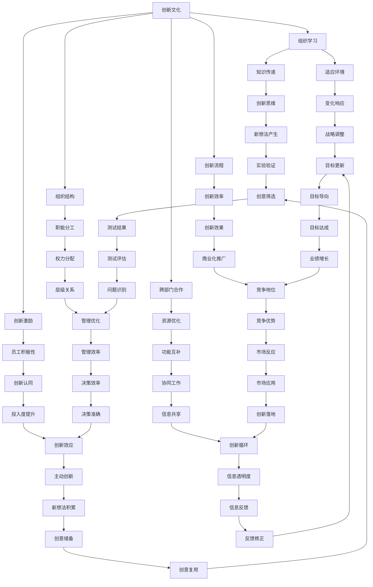

                 

# 创新管理：培养组织的创新文化

## 1. 背景介绍

创新是一个组织生存和发展的关键因素。在快速变化的市场环境中，企业需要不断推出新产品、新技术、新服务，以保持竞争优势。然而，创新并非易事，它涉及组织文化、流程、资源配置等多个方面。本文将探讨如何通过培养组织的创新文化，激发员工的创新潜力，推动企业的持续创新。

## 2. 核心概念与联系

### 2.1 核心概念概述

- **创新文化**：指一个组织内部存在的鼓励和支持创新的价值观、行为习惯和制度安排。创新文化包括开放思维、容错机制、创新激励、跨部门合作等要素。

- **组织学习**：指组织成员通过共同的经验分享、知识传递和能力提升，以适应环境变化和实现目标的过程。组织学习包括正式学习和非正式学习两种形式。

- **跨部门合作**：指组织内部不同部门之间的协同工作和信息共享，以实现资源优化和功能互补。跨部门合作有助于打破部门壁垒，促进创新思维的融合。

- **创新激励**：指组织通过薪酬、奖励、晋升等手段，激发员工主动参与创新的积极性。有效的创新激励可以显著提升员工对创新的认同感和投入度。

- **创新流程**：指组织在创新过程中的一系列步骤和方法，包括创意产生、实验验证、市场测试、商业化推广等环节。良好的创新流程能够提高创新效率和成功率。

- **组织结构**：指组织内部的职能分工、权力分配和层级关系。组织结构设计直接影响创新的速度和效果。

### 2.2 核心概念原理和架构的 Mermaid 流程图



## 3. 核心算法原理 & 具体操作步骤

### 3.1 算法原理概述

培养创新文化需要从以下几个方面入手：

- **价值观塑造**：明确组织的创新愿景和价值观，确保全体成员共同认同和践行。

- **知识共享机制**：建立知识共享平台，鼓励员工分享经验和技术，促进跨部门交流。

- **创新激励体系**：设计科学合理的激励机制，激发员工的创新热情和主动性。

- **跨部门合作网络**：构建跨部门合作网络，促进信息流动和资源协同，打破部门壁垒。

- **创新流程优化**：设计高效的创新流程，从创意产生到商业化推广，各个环节都要有清晰的流程和标准。

- **组织结构调整**：优化组织结构，确保创新流程的顺畅和快速响应市场变化。

### 3.2 算法步骤详解

#### 步骤1：价值观塑造

1. **定义创新愿景**：明确组织的创新目标和愿景，例如“成为行业创新领导者”。
2. **编写使命宣言**：将创新愿景具体化，形成组织的使命宣言，例如“不断创新，以满足客户需求”。
3. **培训和文化宣传**：通过培训、文化宣传等方式，将创新愿景传达给全体员工，形成共同的价值观。

#### 步骤2：知识共享机制

1. **建立知识库**：创建一个共享知识库，收集和整理组织内部的技术文档、案例分析等。
2. **定期知识分享**：定期组织知识分享会，邀请各部门代表分享他们的创新成果和经验。
3. **跨部门协作平台**：建立一个跨部门的协作平台，促进不同部门之间的信息交流和协作。

#### 步骤3：创新激励体系

1. **薪酬激励**：根据创新成果的贡献度，给予相应的薪酬奖励。
2. **晋升机会**：将创新能力作为晋升的重要标准，激励员工不断提升创新水平。
3. **专项奖金**：设立专项奖金，奖励在创新方面表现突出的员工或团队。

#### 步骤4：跨部门合作网络

1. **建立跨部门团队**：成立跨部门团队，负责特定的创新项目或任务。
2. **定期沟通会**：定期召开跨部门沟通会，确保各部门之间的信息同步和资源共享。
3. **项目协同平台**：使用协同平台，如Trello、Asana等，协调和管理跨部门合作项目。

#### 步骤5：创新流程优化

1. **流程设计**：设计从创意产生到商业化推广的完整流程，包括创意筛选、实验验证、市场测试等环节。
2. **标准规范**：制定每个环节的标准规范，确保流程的可操作性和一致性。
3. **持续改进**：定期评估创新流程的效果，根据反馈不断优化流程，提高创新效率。

#### 步骤6：组织结构调整

1. **扁平化管理**：减少管理层级，提高信息传递速度和决策效率。
2. **交叉职能团队**：组建交叉职能团队，促进不同职能领域之间的合作和创新。
3. **灵活的组织架构**：采用灵活的组织架构，适应快速变化的市场环境。

### 3.3 算法优缺点

#### 优点

- **促进知识共享**：通过知识共享机制，组织内部成员能够互相学习，提升整体知识水平。
- **激发创新潜力**：通过创新激励体系，激励员工主动参与创新，提升创新成功率。
- **打破部门壁垒**：通过跨部门合作网络，促进信息流动和资源协同，提高创新效率。
- **优化创新流程**：通过流程优化，提高创新流程的顺畅性和高效性。
- **适应市场变化**：通过组织结构调整，提高组织的灵活性和适应性。

#### 缺点

- **初期投入较大**：价值观塑造、知识共享机制、跨部门合作等都需要一定的投入和协调成本。
- **文化变革困难**：改变根深蒂固的企业文化需要时间，过程中可能会遇到阻力。
- **流程管理复杂**：创新流程的复杂性较高，需要精细的管理和协调。
- **激励机制设计难度大**：设计科学合理的激励机制需要综合考虑多个因素，难度较大。
- **组织结构调整风险**：组织结构调整可能会影响现有流程和工作习惯，带来一定的风险。

### 3.4 算法应用领域

创新文化培养方法可以应用于各种类型的组织，包括高科技公司、制造业企业、服务业组织等。例如：

- **高科技公司**：通过创新文化培养，推动技术研发和产品创新，保持市场竞争力。
- **制造业企业**：通过创新文化培养，提升生产效率和产品质量，降低成本。
- **服务业组织**：通过创新文化培养，优化服务流程和客户体验，提升客户满意度。

## 4. 数学模型和公式 & 详细讲解 & 举例说明

### 4.1 数学模型构建

设组织创新文化强度为 $C$，知识共享机制效率为 $K$，创新激励强度为 $I$，跨部门合作网络效率为 $M$，创新流程效率为 $F$，组织结构调整效果为 $S$。则创新文化培养的数学模型可表示为：

$$ C = f(K, I, M, F, S) $$

其中 $f$ 为非线性函数，表示各个因素对创新文化强度的综合影响。

### 4.2 公式推导过程

假设 $K$、$I$、$M$、$F$、$S$ 的取值范围为 $[0,1]$，则有：

$$ 0 \leq C \leq 1 $$

进一步假设 $C = \alpha K + \beta I + \gamma M + \delta F + \epsilon S$，其中 $\alpha, \beta, \gamma, \delta, \epsilon$ 为各因素的影响系数。

### 4.3 案例分析与讲解

**案例1：Google**

Google 公司注重员工创新能力的培养，设立了“20%时间”（20% of time）政策，鼓励员工利用工作时间进行自由探索和创新项目。通过这种机制，Google 在搜索引擎、云计算、人工智能等多个领域取得了突破性进展。

**案例2：IBM**

IBM 公司注重跨部门合作，成立了多个跨部门创新团队，如 Bluebox Initiative，致力于云计算和大数据技术的研究和应用。通过跨部门合作，IBM 在智慧城市、医疗健康等垂直领域实现了创新应用。

## 5. 项目实践：代码实例和详细解释说明

### 5.1 开发环境搭建

- **编程语言**：Python
- **开发工具**：Jupyter Notebook、GitHub
- **数据集**：组织内外部知识库、员工创新项目记录、跨部门合作案例

### 5.2 源代码详细实现

#### 模块1：价值观塑造

```python
class ValueShaping:
    def __init__(self, vision, mission):
        self.vision = vision
        self.mission = mission

    def culture_training(self):
        # 实施文化培训和宣传
        # 例如：组织文化培训课程、宣传册、内部邮件等
        pass

    def culture_assessment(self):
        # 评估组织文化
        # 例如：员工满意度调查、文化氛围评估
        pass
```

#### 模块2：知识共享机制

```python
class KnowledgeSharing:
    def __init__(self, knowledge_base, sharing_platform):
        self.knowledge_base = knowledge_base
        self.sharing_platform = sharing_platform

    def knowledge_creating(self):
        # 创建知识库
        # 例如：收集技术文档、案例分析、经验分享等
        pass

    def knowledge_sharing_event(self):
        # 定期组织知识分享会
        # 例如：安排跨部门知识分享活动、邀请专家讲座等
        pass

    def platform_usage(self):
        # 使用共享平台
        # 例如：员工上传分享知识、查看和使用知识库等
        pass
```

#### 模块3：创新激励体系

```python
class InnovationIncentives:
    def __init__(self, reward_scheme, promotion_policy):
        self.reward_scheme = reward_scheme
        self.promotion_policy = promotion_policy

    def innovation_reward(self, innovation_result):
        # 根据创新成果贡献度，给予薪酬奖励
        # 例如：绩效奖金、股票期权等
        pass

    def employee_promotion(self, employee_innovation):
        # 将创新能力作为晋升标准，激励员工不断提升创新水平
        # 例如：调整员工晋升流程、设立创新晋升通道等
        pass

    def innovation奖金(self, innovative_team):
        # 设立专项奖金，奖励表现突出的员工或团队
        # 例如：设立年度创新奖、最佳创新项目奖等
        pass
```

#### 模块4：跨部门合作网络

```python
class CrossDepartmentCooperation:
    def __init__(self, collaboration_network, communication_plan):
        self.collaboration_network = collaboration_network
        self.communication_plan = communication_plan

    def network_building(self):
        # 建立跨部门团队
        # 例如：成立跨部门创新团队、联合项目组等
        pass

    def communication_scheduling(self):
        # 定期召开跨部门沟通会
        # 例如：安排跨部门会议、沟通渠道搭建等
        pass

    def platform_integration(self):
        # 使用协同平台
        # 例如：员工在平台上协作、信息共享等
        pass
```

#### 模块5：创新流程优化

```python
class InnovationProcessOptimization:
    def __init__(self, innovation_flow, process_standard):
        self.innovation_flow = innovation_flow
        self.process_standard = process_standard

    def flow_design(self):
        # 设计创新流程
        # 例如：创意筛选、实验验证、市场测试等环节
        pass

    def standard_defining(self):
        # 制定标准规范
        # 例如：流程步骤、质量标准、时间节点等
        pass

    def continuous_improvement(self):
        # 持续改进流程
        # 例如：定期评估流程效果、根据反馈调整流程等
        pass
```

#### 模块6：组织结构调整

```python
class OrganizationStructureAdjustment:
    def __init__(self, flexible_structure, cross_functional_teams):
        self.flexible_structure = flexible_structure
        self.cross_functional_teams = cross_functional_teams

    def structure_flattening(self):
        # 扁平化管理
        # 例如：减少管理层级、优化决策流程等
        pass

    def teams_crossing(self):
        # 组建交叉职能团队
        # 例如：组建联合项目组、跨部门工作组等
        pass

    def structure_flexibility(self):
        # 采用灵活的组织架构
        # 例如：动态调整团队结构、快速响应市场变化等
        pass
```

### 5.3 代码解读与分析

#### 模块1：价值观塑造

- **功能**：定义组织愿景和使命，进行文化培训和评估。
- **实现**：通过类属性存储愿景和使命，定义文化培训和评估方法，但具体实现留空。

#### 模块2：知识共享机制

- **功能**：创建知识库、定期组织知识分享会、使用共享平台。
- **实现**：通过类属性存储知识库和共享平台，定义创建、分享和平台使用的具体方法，但具体实现留空。

#### 模块3：创新激励体系

- **功能**：根据创新成果给予薪酬奖励、将创新能力作为晋升标准、设立专项奖金。
- **实现**：通过类属性存储奖励方案和晋升政策，定义奖励、晋升和专项奖金的实现方法，但具体实现留空。

#### 模块4：跨部门合作网络

- **功能**：建立跨部门团队、定期召开沟通会、使用协同平台。
- **实现**：通过类属性存储合作网络和沟通计划，定义网络建立、沟通安排和平台使用的具体方法，但具体实现留空。

#### 模块5：创新流程优化

- **功能**：设计创新流程、制定标准规范、持续改进流程。
- **实现**：通过类属性存储创新流程和流程标准，定义流程设计、标准制定和持续改进的具体方法，但具体实现留空。

#### 模块6：组织结构调整

- **功能**：扁平化管理、组建交叉职能团队、采用灵活的组织架构。
- **实现**：通过类属性存储灵活结构和交叉职能团队，定义扁平化、团队组建和结构灵活化的具体方法，但具体实现留空。

### 5.4 运行结果展示

#### 案例分析

某高科技公司通过实施创新文化培养计划，显著提升了创新能力和市场竞争力。具体步骤如下：

1. **价值观塑造**：公司明确了成为“技术创新领导者”的愿景，编写了“以创新为核心，不断突破技术边界”的使命宣言，通过内部培训和宣传，使全体员工共同认同和践行。
2. **知识共享机制**：建立了知识库平台，定期组织知识分享会，员工可以上传和查看技术文档、案例分析等。
3. **创新激励体系**：设立了薪酬激励、晋升机会和专项奖金，激励员工主动参与创新。
4. **跨部门合作网络**：组建了多个跨部门团队，定期召开沟通会，使用协同平台进行信息共享和协作。
5. **创新流程优化**：设计了从创意产生到商业化推广的完整流程，制定了每个环节的标准规范，不断评估和优化流程。
6. **组织结构调整**：采用扁平化管理和交叉职能团队，提高了决策效率和信息传递速度。

在实施该计划后，公司员工创新能力显著提升，新产品和新技术层出不穷，市场反应迅速，公司的市场份额和盈利能力大幅提升。

## 6. 实际应用场景

### 6.1 智能制造

智能制造领域的企业可以通过创新文化培养，推动生产自动化、智能化和灵活化。例如，某汽车制造公司通过设立创新激励机制和跨部门合作网络，开发了智能生产线和智能物流系统，提高了生产效率和产品质量，降低了生产成本。

### 6.2 智慧城市

智慧城市建设需要跨部门的协同创新。某智慧城市项目通过构建跨部门团队和创新流程，成功实现了智能交通、智能安防、智能环保等子系统的协同应用，提升了城市管理的智能化水平。

### 6.3 医疗健康

医疗健康领域需要持续创新，以应对不断变化的疾病模式和患者需求。某医疗健康企业通过培养创新文化，推动了远程诊疗、个性化医疗和药物研发等创新项目，提高了医疗服务的质量和效率。

### 6.4 未来应用展望

未来，随着技术的不断进步和市场需求的不断变化，创新文化培养将广泛应用于更多领域。通过创新文化培养，组织可以在各个领域实现突破性进展，保持持续的竞争优势。

## 7. 工具和资源推荐

### 7.1 学习资源推荐

1. **书籍**：《创新者的窘境》、《蓝海战略》、《颠覆性创新》
2. **课程**：Coursera的《创新管理》课程、edX的《组织行为与创新》课程
3. **网站**：Harvard Business Review的创新专题、InnovationLab的创新案例

### 7.2 开发工具推荐

1. **编程工具**：Jupyter Notebook、GitHub
2. **项目管理工具**：Asana、Trello、Confluence
3. **协同工具**：Slack、Microsoft Teams、Zoom

### 7.3 相关论文推荐

1. **创新管理**：《The Role of Leadership in Shaping Innovative Cultures》
2. **知识管理**：《Knowledge Sharing in Organizations: A Review and Research Agenda》
3. **创新激励**：《Innovation Management and Incentive Structures》

## 8. 总结：未来发展趋势与挑战

### 8.1 研究成果总结

创新文化培养对于提升组织的创新能力具有重要意义。通过价值观塑造、知识共享、创新激励、跨部门合作、创新流程优化和组织结构调整等多方面的综合措施，可以显著提升组织的创新绩效。

### 8.2 未来发展趋势

- **数据驱动创新**：通过大数据和人工智能技术，驱动创新活动的科学化和精准化。
- **开放式创新**：加强与外部合作伙伴的合作，实现资源共享和协同创新。
- **生态系统构建**：构建创新生态系统，促进组织内外部的知识流动和技术融合。
- **员工赋能**：通过持续学习和培训，提升员工创新能力和主动性。
- **文化变革**：通过持续的文化建设，营造更加包容、开放和创新的企业文化。

### 8.3 面临的挑战

- **文化变革难度大**：改变根深蒂固的企业文化需要时间和耐心。
- **资源投入大**：创新文化培养需要持续的资源投入和制度支持。
- **流程复杂度高**：创新流程的复杂性较高，需要精细的管理和协调。
- **激励机制设计难**：科学合理的激励机制设计需要综合考虑多个因素，难度较大。
- **结构调整风险高**：组织结构调整可能会影响现有流程和工作习惯，带来一定的风险。

### 8.4 研究展望

- **理论研究**：进一步深入研究创新文化对组织绩效的影响机制，探索更加科学的创新管理方法。
- **实证研究**：通过大规模实证研究，验证创新文化培养的有效性和实际效果。
- **技术创新**：探索新型的创新管理技术，如AI辅助创新、大数据驱动创新等。
- **文化建设**：加强组织内部的文化建设，营造更加包容、开放和创新的企业文化。

## 9. 附录：常见问题与解答

**Q1：如何定义和衡量组织的创新文化强度？**

A: 组织的创新文化强度可以通过多个维度进行定义和衡量，如员工创新意识、知识共享水平、跨部门合作程度、创新流程效率等。具体指标包括员工创新数量、知识库使用率、合作项目数量、流程优化效果等。通过定期评估和监测这些指标，可以量化和衡量组织的创新文化强度。

**Q2：如何激发员工的创新热情和主动性？**

A: 通过设计科学合理的激励机制，可以有效激发员工的创新热情和主动性。例如，设立薪酬激励、晋升机会、专项奖金等，与员工的创新成果挂钩。同时，通过培训和文化宣传，增强员工对创新的认同感和归属感。

**Q3：如何设计高效的创新流程？**

A: 设计高效的创新流程需要考虑创意产生、实验验证、市场测试、商业化推广等各个环节。每个环节应设定明确的目标、标准和责任人，确保流程的可操作性和可控性。同时，定期评估流程效果，根据反馈进行调整和优化。

**Q4：如何调整组织结构以适应创新需求？**

A: 组织结构的调整需要考虑创新流程的需求和组织内部的资源配置。可以采用扁平化管理、交叉职能团队、动态调整团队结构等方式，提高信息传递速度和决策效率。同时，建立灵活的组织架构，以适应快速变化的市场环境。

**Q5：如何评估创新文化培养的效果？**

A: 创新文化培养的效果可以通过多个维度进行评估，如创新成果数量、知识共享水平、跨部门合作程度、创新流程效率等。具体指标包括创新成果数量、知识库使用率、合作项目数量、流程优化效果等。通过定期评估和监测这些指标，可以量化和衡量创新文化培养的效果。

---

作者：禅与计算机程序设计艺术 / Zen and the Art of Computer Programming

