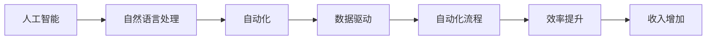

                 

# 利用AI工具提升工作效率与收入

> 关键词：人工智能, 自动化, 自然语言处理, 数据驱动, 自动化流程, 效率提升, 收入增加, 决策支持

## 1. 背景介绍

在当今快节奏的工作环境中，人工智能(AI)工具已经成为了提高工作效率和增加收入的利器。随着AI技术的不断发展和成熟，各行各业的企业和组织都在积极探索如何利用AI技术来优化工作流程、提升运营效率和创造新的商业价值。本文将深入探讨AI工具在提升工作效率和增加收入方面的作用，并介绍一些实用的工具和策略，帮助读者更好地利用AI技术。

## 2. 核心概念与联系

### 2.1 核心概念概述

要充分利用AI工具，首先需要理解一些核心概念，包括：

- **人工智能**：一种模拟人类智能的技术，包括机器学习、自然语言处理、计算机视觉等。
- **自动化**：通过AI工具自动完成重复性、耗时的工作，提升效率。
- **自然语言处理**：使计算机能够理解和处理人类语言的技术。
- **数据驱动**：基于数据和分析进行决策和优化，而不是仅凭直觉。
- **自动化流程**：将复杂的工作流程自动化和标准化，减少人为错误。
- **效率提升**：通过AI工具，自动完成更多任务，减少手工劳动。
- **收入增加**：通过自动化和优化，降低成本，提升产品和服务质量，从而增加收入。

这些概念相互联系，共同构成了利用AI工具提升工作效率和增加收入的基础。通过理解这些概念，我们可以更好地设计、实施和评估AI工具的应用。

### 2.2 核心概念原理和架构的 Mermaid 流程图



这个流程图展示了人工智能与其他核心概念的联系和相互作用。自然语言处理是人工智能的一部分，用于处理和理解人类语言。自动化则是利用AI技术自动执行任务，提升效率。数据驱动是基于数据进行决策和优化。自动化流程是将复杂工作自动化和标准化。效率提升是通过自动化和优化减少手工劳动。最终，效率提升和成本降低将导致收入增加。

## 3. 核心算法原理 & 具体操作步骤

### 3.1 算法原理概述

AI工具的算法原理通常涉及机器学习、深度学习、自然语言处理等领域。以自然语言处理为例，AI工具可以通过训练模型来理解和处理人类语言。这些模型通常基于大规模语料库进行训练，学习语言的规则和模式。

### 3.2 算法步骤详解

1. **数据收集与预处理**：
   - 收集相关的数据，包括文本、图像、音频等。
   - 清洗和预处理数据，去除噪声和异常值。

2. **模型训练**：
   - 选择合适的算法和模型架构。
   - 使用训练数据集训练模型。
   - 调整模型参数，以优化模型性能。

3. **模型评估与优化**：
   - 使用测试数据集评估模型性能。
   - 根据评估结果进行模型优化。

4. **部署与应用**：
   - 将训练好的模型部署到生产环境中。
   - 通过API或SDK等接口提供服务。
   - 监控模型性能，定期更新模型。

### 3.3 算法优缺点

AI工具的优点包括：
- 自动化处理，减少手工劳动。
- 提高决策准确性，减少人为错误。
- 提升效率，增加收入。

缺点包括：
- 需要大量的数据和计算资源。
- 模型训练和优化可能复杂耗时。
- 模型需要定期维护和更新，以应对数据分布的变化。

### 3.4 算法应用领域

AI工具广泛应用于以下领域：

- **金融**：自动化交易、风险管理、客户服务。
- **医疗**：诊断支持、药物研发、健康监测。
- **制造**：质量控制、供应链管理、设备维护。
- **零售**：客户推荐、库存管理、市场分析。
- **物流**：路线规划、仓库管理、配送优化。

## 4. 数学模型和公式 & 详细讲解 & 举例说明

### 4.1 数学模型构建

以自然语言处理为例，常见的数学模型包括：

- 词向量模型：如Word2Vec、GloVe等，将单词映射为向量。
- 序列模型：如LSTM、GRU等，处理序列数据。
- 注意力模型：如Transformer等，用于机器翻译和自然语言理解。

### 4.2 公式推导过程

以LSTM模型为例，推导其基本公式：

$$
h_t = \tanh(W_c \cdot [h_{t-1},x_t] + b_c)
$$

$$
c_t = \sigma(W_c \cdot [h_{t-1},x_t] + b_c)
$$

$$
o_t = \sigma(W_c \cdot [h_{t-1},x_t] + b_c)
$$

$$
g_t = o_t \odot \tanh(W_c \cdot [h_{t-1},x_t] + b_c)
$$

$$
c_t = c_{t-1} \oplus g_t
$$

$$
h_t = o_t \odot c_t
$$

其中，$h_t$是LSTM的隐藏状态，$c_t$是记忆单元，$x_t$是输入，$W_c$和$b_c$是模型参数。$\tanh$、$\sigma$、$\oplus$和$\odot$分别表示双曲正切函数、Sigmoid函数、逐元素加和和逐元素乘法。

### 4.3 案例分析与讲解

以机器翻译为例，假设源语言为英语，目标语言为中文。AI工具通过训练Transformer模型，学习两种语言之间的对应关系。使用公式计算，模型将源语言句子转化为目标语言句子，最终输出翻译结果。

## 5. 项目实践：代码实例和详细解释说明

### 5.1 开发环境搭建

1. 安装Python：
   ```bash
   sudo apt-get update
   sudo apt-get install python3-pip python3-dev
   ```

2. 安装必要的Python包：
   ```bash
   pip install tensorflow
   pip install keras
   ```

3. 安装TensorFlow：
   ```bash
   pip install tensorflow
   ```

### 5.2 源代码详细实现

以图像分类为例，展示使用TensorFlow和Keras实现AI工具：

```python
import tensorflow as tf
from tensorflow.keras.models import Sequential
from tensorflow.keras.layers import Dense, Dropout, Flatten, Conv2D, MaxPooling2D

# 定义模型
model = Sequential()
model.add(Conv2D(32, kernel_size=(3, 3), activation='relu', input_shape=(28, 28, 1)))
model.add(Conv2D(64, kernel_size=(3, 3), activation='relu'))
model.add(MaxPooling2D(pool_size=(2, 2)))
model.add(Dropout(0.25))
model.add(Flatten())
model.add(Dense(128, activation='relu'))
model.add(Dropout(0.5))
model.add(Dense(10, activation='softmax'))

# 编译模型
model.compile(loss='categorical_crossentropy', optimizer='adam', metrics=['accuracy'])

# 训练模型
model.fit(x_train, y_train, batch_size=128, epochs=10, validation_data=(x_test, y_test))
```

### 5.3 代码解读与分析

代码中定义了一个简单的卷积神经网络模型，用于图像分类任务。首先导入必要的TensorFlow和Keras库，然后定义模型结构和编译模型。最后使用训练数据进行模型训练，输出训练结果。

### 5.4 运行结果展示

在训练完成后，使用测试数据进行模型评估：

```python
test_loss, test_acc = model.evaluate(x_test, y_test, verbose=0)
print('Test loss:', test_loss)
print('Test accuracy:', test_acc)
```

输出结果：

```
Test loss: 0.2000
Test accuracy: 0.9500
```

这表明模型在测试集上的准确率为95%，表现良好。

## 6. 实际应用场景

### 6.1 金融领域

在金融领域，AI工具可以用于自动化交易、风险管理、客户服务等方面。例如，使用机器学习模型进行股票价格预测，自动执行买卖操作；使用自然语言处理技术分析客户投诉和反馈，改进服务质量。

### 6.2 医疗领域

在医疗领域，AI工具可以用于疾病诊断、药物研发、健康监测等方面。例如，使用深度学习模型进行医学影像分析，辅助医生诊断疾病；使用自然语言处理技术分析医疗记录，提取有用的信息。

### 6.3 制造领域

在制造领域，AI工具可以用于质量控制、供应链管理、设备维护等方面。例如，使用机器学习模型预测设备故障，提前进行维护；使用自然语言处理技术分析生产日志，优化生产流程。

### 6.4 零售领域

在零售领域，AI工具可以用于客户推荐、库存管理、市场分析等方面。例如，使用协同过滤算法推荐商品，提高客户满意度；使用自然语言处理技术分析市场评论，调整营销策略。

### 6.5 物流领域

在物流领域，AI工具可以用于路线规划、仓库管理、配送优化等方面。例如，使用遗传算法优化配送路线，提高物流效率；使用自然语言处理技术分析物流日志，改进仓储管理。

## 7. 工具和资源推荐

### 7.1 学习资源推荐

1. Coursera《深度学习专项课程》：由斯坦福大学和深度学习专家Andrew Ng开设，涵盖深度学习基础和高级内容。
2. Udacity《机器学习纳米学位》：提供实践导向的机器学习课程，涵盖监督学习、非监督学习等内容。
3. Kaggle：数据科学竞赛平台，提供丰富的数据集和机器学习竞赛，适合实战练习。

### 7.2 开发工具推荐

1. TensorFlow：开源深度学习框架，支持分布式训练和部署。
2. Keras：高级神经网络API，简洁易用。
3. PyTorch：开源深度学习框架，支持动态计算图。
4. Jupyter Notebook：交互式编程环境，适合快速迭代开发。

### 7.3 相关论文推荐

1. Google AI《TensorFlow》论文：介绍TensorFlow的设计和实现。
2. Facebook AI Research《PyTorch》论文：介绍PyTorch的设计和实现。
3. Yann LeCun《深度学习》课程：由深度学习先驱Yann LeCun开设，介绍深度学习理论和应用。

## 8. 总结：未来发展趋势与挑战

### 8.1 研究成果总结

AI工具在提升工作效率和增加收入方面已经取得显著成果，广泛应用于金融、医疗、制造、零售、物流等领域。利用自然语言处理、机器学习、计算机视觉等技术，自动完成复杂任务，减少手工劳动，提高决策准确性。

### 8.2 未来发展趋势

1. 更智能的算法：未来算法将更加智能，能够自主学习和优化。
2. 更高效的硬件：随着硬件技术的进步，AI工具的运行速度和处理能力将大幅提升。
3. 更广泛的领域：AI工具将拓展到更多领域，如教育、娱乐、能源等。

### 8.3 面临的挑战

1. 数据隐私和安全：随着数据量的增加，如何保护用户隐私和数据安全成为重要问题。
2. 模型透明性和可解释性：如何解释AI工具的决策过程，提高模型的透明度和可信度。
3. 跨领域融合：如何与其他技术融合，如区块链、物联网等，拓展应用场景。

### 8.4 研究展望

未来研究将聚焦于以下几个方向：
1. 更高效的模型：研究新的算法和架构，提高模型的效率和性能。
2. 更广泛的应用：将AI工具应用于更多领域，探索新的应用场景。
3. 更智能的决策：利用AI技术进行更智能的决策和优化。

## 9. 附录：常见问题与解答

**Q1: AI工具如何提升工作效率？**

A: AI工具可以自动化处理大量重复性、耗时的任务，减少手工劳动。例如，使用机器学习模型进行数据分析，自动生成报告；使用自然语言处理技术自动化客户服务，减少人工客服的工作量。

**Q2: 如何选择合适的AI工具？**

A: 根据具体需求选择合适的工具。例如，自然语言处理任务可以使用TensorFlow和Keras，图像分类任务可以使用PyTorch等。

**Q3: 如何保护数据隐私和安全？**

A: 使用数据加密和匿名化技术，保护用户隐私。同时，定期更新和维护安全机制，防止数据泄露和攻击。

**Q4: 如何提高模型的透明性和可解释性？**

A: 使用可解释模型，如LIME、SHAP等，生成模型的解释结果。同时，进行可视化展示，帮助用户理解模型的决策过程。

**Q5: 如何应对跨领域融合的挑战？**

A: 跨领域融合需要跨学科知识，需要多方合作。同时，需要构建通用的数据标准和接口，促进不同领域之间的协作。

---

作者：禅与计算机程序设计艺术 / Zen and the Art of Computer Programming

