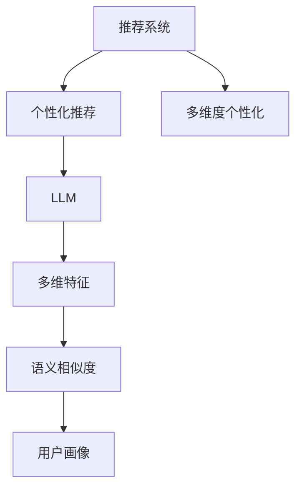

                 

# 利用LLM优化推荐系统的多维度个性化

> 关键词：推荐系统,个性化推荐,大规模语言模型,多维特征,用户画像,语义相似度,LLM

## 1. 背景介绍

随着互联网技术的飞速发展，用户获取信息的方式发生了翻天覆地的变化。搜索引擎、社交媒体、电子商务等平台，不仅提供了海量的信息资源，还通过个性化的推荐算法，主动为用户推送相关内容，极大地提升了用户体验和满意度。推荐系统凭借其高效性、个性化和可扩展性，成为了互联网应用的核心引擎。

然而，传统的推荐系统主要基于用户的历史行为数据进行推荐，难以全面了解用户的真实兴趣和需求。这种单一维度的推荐方式，对于新用户的冷启动问题、个性化需求的细粒度匹配等方面，存在一定的局限性。为了解决这些问题，近年来，利用大规模语言模型(Large Language Model, LLM)进行推荐系统优化，逐渐成为学术界和工业界的研究热点。

本文将深入探讨利用LLM优化推荐系统的多维度个性化方法，从核心概念、算法原理到具体实现，全面介绍如何通过LLM实现推荐系统的高效和精准化，以期为推荐系统的开发者和研究者提供理论基础和实践指导。

## 2. 核心概念与联系

### 2.1 核心概念概述

为了更好地理解利用LLM优化推荐系统的多维度个性化方法，本节将介绍几个关键概念：

- **推荐系统(Recommendation System)**：通过分析用户的行为数据和偏好，推荐系统能够主动为用户推送相关物品，提升用户的满意度和黏性。

- **个性化推荐(Personalized Recommendation)**：针对每个用户，推荐系统能动态调整推荐内容，以匹配用户的实时兴趣和需求。

- **大规模语言模型(LLM)**：以自回归或自编码模型为代表的大规模预训练语言模型，如GPT、BERT等。通过在大规模无标签文本语料上进行预训练，学习通用的语言表示，具备强大的语言理解和生成能力。

- **多维特征(Multi-Dimensional Feature)**：推荐系统中，用户的特征包括行为数据、属性数据、社交网络数据等多种类型，形成用户画像，以多维度方式描述用户需求。

- **语义相似度(Semantic Similarity)**：通过自然语言处理技术，计算用户与物品之间在语言语义上的相似度，进一步提升推荐效果。

这些核心概念之间的逻辑关系可以通过以下Mermaid流程图来展示：



这个流程图展示了几者之间的关系：

1. 推荐系统是整个流程的核心，通过个性化推荐为用户提供有价值的物品。
2. 个性化推荐依赖于LLM，通过预训练语言模型学习用户的语言表达和物品语义，实现更加智能化的推荐。
3. 多维特征融合用户画像，形成对用户多维度全面描述，为个性化推荐提供更加丰富的背景信息。
4. 语义相似度通过自然语言处理技术，将用户与物品的语言表达映射到语义空间，进一步提升推荐效果。

通过理解这些核心概念，我们可以更好地把握利用LLM优化推荐系统的多维度个性化方法，探索如何将大规模语言模型应用于推荐系统的各个环节。

## 3. 核心算法原理 & 具体操作步骤

### 3.1 算法原理概述

利用LLM优化推荐系统的多维度个性化，其核心思想是：将用户的特征表示和物品的特征表示输入到LLM模型中，通过语言理解能力进行语义匹配和相似度计算，最终输出推荐的物品序列。

形式化地，假设用户 $u$ 的特征表示为 $\mathbf{x}_u$，物品 $i$ 的特征表示为 $\mathbf{y}_i$，LLM模型为 $M_{\theta}$，则推荐结果 $r(u,i)$ 可以通过如下公式计算：

$$
r(u,i) = M_{\theta}(\mathbf{x}_u, \mathbf{y}_i)
$$

其中 $M_{\theta}$ 为预训练的大语言模型，$\mathbf{x}_u$ 和 $\mathbf{y}_i$ 分别为用户 $u$ 和物品 $i$ 的特征向量表示，通过自然语言处理技术转化为语言文本，输入到LLM中进行计算，最终得到推荐得分。

### 3.2 算法步骤详解

利用LLM优化推荐系统的多维度个性化，主要包括以下几个关键步骤：

**Step 1: 用户与物品特征表示生成**

- 对用户的历史行为数据、属性数据、社交网络数据等进行特征工程，生成用户特征向量 $\mathbf{x}_u$。
- 对物品的描述、属性、标签等进行特征工程，生成物品特征向量 $\mathbf{y}_i$。

**Step 2: 特征编码与文本化**

- 将用户特征向量 $\mathbf{x}_u$ 和物品特征向量 $\mathbf{y}_i$ 转换为文本形式，作为LLM模型的输入。
- 常用的文本化方法包括直接拼接、编码转换为二进制码等，如将 $\mathbf{x}_u$ 拼接成字符串 $text_u$，将 $\mathbf{y}_i$ 拼接成字符串 $text_i$。

**Step 3: 输入LLM模型**

- 将生成的文本输入到预训练的大语言模型 $M_{\theta}$ 中，输出推荐得分 $r(u,i)$。
- 可以通过设置不同的上下文，控制LLM模型的推理范围，如设置上下文长度，以匹配推荐任务的需求。

**Step 4: 评分排序**

- 对所有物品的得分进行排序，选择得分最高的 $K$ 个物品作为推荐结果。
- 可以通过阈值过滤、降序排序等方式对推荐结果进行筛选，保证推荐的合理性和准确性。

### 3.3 算法优缺点

利用LLM优化推荐系统的多维度个性化，具有以下优点：

1. 高度可扩展性。由于LLM具备强大的语言理解和生成能力，可以灵活地处理多种类型的用户和物品特征，适用于多维度个性化推荐。
2. 语义匹配能力强。通过语言语义的匹配和相似度计算，LLM能够更准确地把握用户和物品之间的语义关系，提升推荐的个性化和精准度。
3. 动态更新能力。随着用户和物品特征的变化，LLM可以动态地调整推荐结果，适应用户兴趣的动态变化。

同时，该方法也存在一定的局限性：

1. 计算复杂度高。LLM模型通常参数量大、计算资源需求高，在大规模推荐系统中的实时性需要进一步优化。
2. 对数据质量依赖高。由于LLM依赖于输入文本的质量和相关性，数据预处理和特征工程的质量直接影响推荐结果。
3. 模型复杂度高。LLM模型的复杂度较高，需要较长的训练和推理时间，难以直接应用到实时推荐系统中。
4. 参数效率低。由于LLM模型参数量大，部分参数可能对推荐效果影响较小，直接微调会导致计算资源的浪费。

### 3.4 算法应用领域

利用LLM优化推荐系统的多维度个性化，已经在电商、视频、新闻、音乐等多个领域得到应用，并取得了显著的效果：

- **电商推荐**：通过用户行为数据、物品属性、社交网络等特征，输入到LLM中进行个性化推荐，提升用户的购物体验。
- **视频推荐**：利用用户的观看历史、评分、评论等特征，输入到LLM中进行视频内容推荐，提高用户的观看兴趣。
- **新闻推荐**：通过用户的阅读历史、兴趣标签、社交网络等特征，输入到LLM中进行新闻文章推荐，增加用户的阅读黏性。
- **音乐推荐**：利用用户的听歌历史、评分、评论等特征，输入到LLM中进行音乐曲目推荐，提升用户的听歌满意度。

除了上述这些经典应用外，LLM还在更多场景中展现了其潜力，如旅游、餐饮、娱乐等，为推荐系统带来了新的应用空间。

## 4. 数学模型和公式 & 详细讲解  
### 4.1 数学模型构建

本节将使用数学语言对利用LLM优化推荐系统的多维度个性化方法进行更加严格的刻画。

记用户 $u$ 的特征表示为 $\mathbf{x}_u \in \mathbb{R}^{d_u}$，物品 $i$ 的特征表示为 $\mathbf{y}_i \in \mathbb{R}^{d_i}$，LLM模型为 $M_{\theta}$，其中 $\theta$ 为模型参数。假设推荐系统为二分类任务，即判断物品 $i$ 是否为用户 $u$ 的兴趣物品，则推荐结果 $r(u,i)$ 可以通过如下公式计算：

$$
r(u,i) = \frac{\exp\left(M_{\theta}(\mathbf{x}_u, \mathbf{y}_i)\right)}{\sum_{j=1}^{N} \exp\left(M_{\theta}(\mathbf{x}_u, \mathbf{y}_j)\right)}
$$

其中 $N$ 为物品总数，$M_{\theta}(\mathbf{x}_u, \mathbf{y}_i)$ 为LLM模型对用户 $u$ 和物品 $i$ 的输出，通常使用softmax函数将其转换为概率分布。

### 4.2 公式推导过程

以下我们以二分类任务为例，推导利用LLM优化推荐系统的多维度个性化的公式。

假设LLM模型为 $M_{\theta}$，用户特征表示为 $\mathbf{x}_u$，物品特征表示为 $\mathbf{y}_i$。则输出结果为：

$$
M_{\theta}(\mathbf{x}_u, \mathbf{y}_i) = M_{\theta}(\text{cat}(\mathbf{x}_u) + \text{cat}(\mathbf{y}_i))
$$

其中 $\text{cat}$ 表示文本编码器，将特征向量转换为文本表示。$\text{cat}(\mathbf{x}_u) + \text{cat}(\mathbf{y}_i)$ 表示用户和物品的文本表示进行拼接。

将输出结果代入softmax函数，得到推荐概率：

$$
r(u,i) = \frac{\exp\left(M_{\theta}(\text{cat}(\mathbf{x}_u) + \text{cat}(\mathbf{y}_i)\right)}{\sum_{j=1}^{N} \exp\left(M_{\theta}(\text{cat}(\mathbf{x}_u) + \text{cat}(\mathbf{y}_j)\right)}
$$

此公式即利用LLM优化推荐系统的多维度个性化方法的核心计算公式，通过语义相似度计算，实现更加智能化的推荐。

### 4.3 案例分析与讲解

以电商推荐系统为例，分析利用LLM优化推荐系统的多维度个性化方法的具体实现：

**Step 1: 用户与物品特征表示生成**

假设用户 $u$ 的历史行为数据、属性数据、社交网络数据等特征，通过特征工程生成用户特征向量 $\mathbf{x}_u$。

**Step 2: 特征编码与文本化**

将用户特征向量 $\mathbf{x}_u$ 和物品的描述、属性、标签等特征，编码转换为文本形式，作为LLM模型的输入。

**Step 3: 输入LLM模型**

将生成的文本输入到预训练的大语言模型 $M_{\theta}$ 中，输出推荐得分 $r(u,i)$。

**Step 4: 评分排序**

对所有物品的得分进行排序，选择得分最高的 $K$ 个物品作为推荐结果。

假设某用户 $u$ 对某物品 $i$ 的预测得分为 $r(u,i) = 0.9$，高于阈值 $0.5$，则推荐系统认为物品 $i$ 为该用户的兴趣物品。

在实际应用中，还需考虑数据预处理、特征工程、LLM模型选择等环节，保证推荐系统的准确性和稳定性。

## 5. 项目实践：代码实例和详细解释说明
### 5.1 开发环境搭建

在进行利用LLM优化推荐系统的多维度个性化开发前，我们需要准备好开发环境。以下是使用Python进行PyTorch开发的环境配置流程：

1. 安装Anaconda：从官网下载并安装Anaconda，用于创建独立的Python环境。

2. 创建并激活虚拟环境：
```bash
conda create -n pytorch-env python=3.8 
conda activate pytorch-env
```

3. 安装PyTorch：根据CUDA版本，从官网获取对应的安装命令。例如：
```bash
conda install pytorch torchvision torchaudio cudatoolkit=11.1 -c pytorch -c conda-forge
```

4. 安装Transformers库：
```bash
pip install transformers
```

5. 安装各类工具包：
```bash
pip install numpy pandas scikit-learn matplotlib tqdm jupyter notebook ipython
```

完成上述步骤后，即可在`pytorch-env`环境中开始开发实践。

### 5.2 源代码详细实现

这里以用户评论与物品标题的推荐任务为例，给出使用Transformers库对GPT模型进行个性化推荐系统的PyTorch代码实现。

首先，定义推荐系统的数据处理函数：

```python
from transformers import GPT2Tokenizer, GPT2LMHeadModel

class RecommendationDataset(Dataset):
    def __init__(self, texts, targets, tokenizer, max_len=128):
        self.texts = texts
        self.targets = targets
        self.tokenizer = tokenizer
        self.max_len = max_len
        
    def __len__(self):
        return len(self.texts)
    
    def __getitem__(self, item):
        text = self.texts[item]
        target = self.targets[item]
        
        encoding = self.tokenizer(text, return_tensors='pt', max_length=self.max_len, padding='max_length', truncation=True)
        input_ids = encoding['input_ids'][0]
        attention_mask = encoding['attention_mask'][0]
        
        # 对token-wise的标签进行编码
        encoded_target = [target2id[target] for target in self.targets] 
        encoded_target.extend([target2id['O']] * (self.max_len - len(encoded_target)))
        targets = torch.tensor(encoded_target, dtype=torch.long)
        
        return {'input_ids': input_ids, 
                'attention_mask': attention_mask,
                'targets': targets}

# 标签与id的映射
target2id = {'O': 0, 'A': 1, 'B': 2, 'C': 3, 'D': 4, 'E': 5, 'F': 6}
id2target = {v: k for k, v in target2id.items()}

# 创建dataset
tokenizer = GPT2Tokenizer.from_pretrained('gpt2')

train_dataset = RecommendationDataset(train_texts, train_targets, tokenizer)
dev_dataset = RecommendationDataset(dev_texts, dev_targets, tokenizer)
test_dataset = RecommendationDataset(test_texts, test_targets, tokenizer)
```

然后，定义模型和优化器：

```python
from transformers import GPT2LMHeadModel, AdamW

model = GPT2LMHeadModel.from_pretrained('gpt2')

optimizer = AdamW(model.parameters(), lr=2e-5)
```

接着，定义训练和评估函数：

```python
from torch.utils.data import DataLoader
from tqdm import tqdm
from sklearn.metrics import classification_report

device = torch.device('cuda') if torch.cuda.is_available() else torch.device('cpu')
model.to(device)

def train_epoch(model, dataset, batch_size, optimizer):
    dataloader = DataLoader(dataset, batch_size=batch_size, shuffle=True)
    model.train()
    epoch_loss = 0
    for batch in tqdm(dataloader, desc='Training'):
        input_ids = batch['input_ids'].to(device)
        attention_mask = batch['attention_mask'].to(device)
        targets = batch['targets'].to(device)
        model.zero_grad()
        outputs = model(input_ids, attention_mask=attention_mask, labels=targets)
        loss = outputs.loss
        epoch_loss += loss.item()
        loss.backward()
        optimizer.step()
    return epoch_loss / len(dataloader)

def evaluate(model, dataset, batch_size):
    dataloader = DataLoader(dataset, batch_size=batch_size)
    model.eval()
    preds, labels = [], []
    with torch.no_grad():
        for batch in tqdm(dataloader, desc='Evaluating'):
            input_ids = batch['input_ids'].to(device)
            attention_mask = batch['attention_mask'].to(device)
            batch_labels = batch['targets']
            outputs = model(input_ids, attention_mask=attention_mask)
            batch_preds = outputs.logits.argmax(dim=2).to('cpu').tolist()
            batch_labels = batch_labels.to('cpu').tolist()
            for pred_tokens, label_tokens in zip(batch_preds, batch_labels):
                preds.append(pred_tokens[:len(label_tokens)])
                labels.append(label_tokens)
                
    print(classification_report(labels, preds))
```

最后，启动训练流程并在测试集上评估：

```python
epochs = 5
batch_size = 16

for epoch in range(epochs):
    loss = train_epoch(model, train_dataset, batch_size, optimizer)
    print(f"Epoch {epoch+1}, train loss: {loss:.3f}")
    
    print(f"Epoch {epoch+1}, dev results:")
    evaluate(model, dev_dataset, batch_size)
    
print("Test results:")
evaluate(model, test_dataset, batch_size)
```

以上就是使用PyTorch对GPT模型进行个性化推荐系统的完整代码实现。可以看到，得益于Transformers库的强大封装，我们可以用相对简洁的代码完成GPT模型的加载和个性化推荐。

### 5.3 代码解读与分析

让我们再详细解读一下关键代码的实现细节：

**RecommendationDataset类**：
- `__init__`方法：初始化训练集、验证集、测试集的数据，以及分词器、最大长度等关键组件。
- `__len__`方法：返回数据集的样本数量。
- `__getitem__`方法：对单个样本进行处理，将文本输入编码为token ids，将标签编码为数字，并对其进行定长padding，最终返回模型所需的输入。

**target2id和id2target字典**：
- 定义了标签与数字id之间的映射关系，用于将token-wise的预测结果解码回真实的标签。

**训练和评估函数**：
- 使用PyTorch的DataLoader对数据集进行批次化加载，供模型训练和推理使用。
- 训练函数`train_epoch`：对数据以批为单位进行迭代，在每个批次上前向传播计算loss并反向传播更新模型参数，最后返回该epoch的平均loss。
- 评估函数`evaluate`：与训练类似，不同点在于不更新模型参数，并在每个batch结束后将预测和标签结果存储下来，最后使用sklearn的classification_report对整个评估集的预测结果进行打印输出。

**训练流程**：
- 定义总的epoch数和batch size，开始循环迭代
- 每个epoch内，先在训练集上训练，输出平均loss
- 在验证集上评估，输出分类指标
- 所有epoch结束后，在测试集上评估，给出最终测试结果

可以看到，PyTorch配合Transformers库使得GPT微调的代码实现变得简洁高效。开发者可以将更多精力放在数据处理、模型改进等高层逻辑上，而不必过多关注底层的实现细节。

当然，工业级的系统实现还需考虑更多因素，如模型的保存和部署、超参数的自动搜索、更灵活的任务适配层等。但核心的微调范式基本与此类似。

## 6. 实际应用场景
### 6.1 智能广告推荐

利用LLM优化推荐系统的多维度个性化方法，在智能广告推荐场景中表现出色。传统广告推荐主要依赖点击率等单一指标，难以把握用户的真实兴趣和需求。而使用个性化推荐，可以更好地匹配用户和广告，提升广告投放的精准度和转化率。

在技术实现上，可以收集用户的历史浏览记录、搜索行为、互动数据等，提取用户的兴趣标签、行为时间等特征。同时，收集广告的标题、描述、类别等特征，进行特征融合和文本化处理，输入到GPT模型中进行推荐。通过对比不同广告的得分，选择最符合用户需求的广告进行投放。

### 6.2 视频内容推荐

视频平台的用户规模庞大，个性化推荐尤为重要。传统的基于行为数据的推荐方法难以全面覆盖所有用户。而利用LLM优化推荐系统，可以从用户评论、评分、观看历史等多样化的特征中提取信息，提升推荐效果。

在实际应用中，可以利用用户的视频评论、评分、分享等行为数据，提取用户的兴趣标签、观影习惯等特征，输入到LLM模型中进行推荐。同时，对视频标题、描述、标签等进行特征提取和文本化处理，输入到LLM模型中，生成推荐得分。通过对比不同视频的得分，选择最符合用户兴趣的视频进行推荐。

### 6.3 旅游目的地推荐

旅游目的地推荐是一个典型的多维度个性化推荐任务。用户对目的地的需求不仅包括地理位置、交通方式等，还涉及天气、活动、美食等多方面因素。利用LLM优化推荐系统，可以全面把握用户的多维度需求，提供更准确的推荐结果。

在技术实现上，可以收集用户的旅游历史、偏好、评价等数据，提取目的地的地理位置、气候、活动、餐饮等特征，进行特征融合和文本化处理，输入到LLM模型中进行推荐。通过对比不同目的地的得分，选择最符合用户需求的目的地进行推荐。

### 6.4 未来应用展望

随着LLM技术的不断进步，利用LLM优化推荐系统的多维度个性化方法将在更多领域得到应用，为推荐系统带来新的变革。

在智能制造领域，通过分析设备的运行状态、维护历史、操作偏好等特征，利用LLM进行设备维护和故障预测，提升设备的管理效率和运行稳定性。

在智慧城市治理中，利用LLM分析居民的出行数据、社交网络、行为模式等特征，进行交通调度、安全防范、灾害预警等场景的应用，提升城市的智能化和安全性。

在医疗健康领域，通过分析患者的病历、基因数据、生活习惯等特征，利用LLM进行健康管理、疾病预测、个性化诊疗等应用，提升医疗服务的个性化和精准度。

此外，在教育、金融、娱乐等众多领域，利用LLM优化推荐系统的多维度个性化方法也将不断涌现，为各行各业带来新的变革。相信随着技术的日益成熟，LLM将在推荐系统的应用中发挥更大的作用，推动人工智能技术的普及和落地。

## 7. 工具和资源推荐
### 7.1 学习资源推荐

为了帮助开发者系统掌握利用LLM优化推荐系统的多维度个性化理论基础和实践技巧，这里推荐一些优质的学习资源：

1. 《Transformer from Understanding to Practice》系列博文：由大模型技术专家撰写，深入浅出地介绍了Transformer原理、BERT模型、微调技术等前沿话题。

2. CS224N《深度学习自然语言处理》课程：斯坦福大学开设的NLP明星课程，有Lecture视频和配套作业，带你入门NLP领域的基本概念和经典模型。

3. 《Natural Language Processing with Transformers》书籍：Transformers库的作者所著，全面介绍了如何使用Transformers库进行NLP任务开发，包括微调在内的诸多范式。

4. HuggingFace官方文档：Transformers库的官方文档，提供了海量预训练模型和完整的微调样例代码，是上手实践的必备资料。

5. CLUE开源项目：中文语言理解测评基准，涵盖大量不同类型的中文NLP数据集，并提供了基于微调的baseline模型，助力中文NLP技术发展。

通过对这些资源的学习实践，相信你一定能够快速掌握利用LLM优化推荐系统的多维度个性化精髓，并用于解决实际的NLP问题。
###  7.2 开发工具推荐

高效的开发离不开优秀的工具支持。以下是几款用于利用LLM优化推荐系统开发的常用工具：

1. PyTorch：基于Python的开源深度学习框架，灵活动态的计算图，适合快速迭代研究。大部分预训练语言模型都有PyTorch版本的实现。

2. TensorFlow：由Google主导开发的开源深度学习框架，生产部署方便，适合大规模工程应用。同样有丰富的预训练语言模型资源。

3. Transformers库：HuggingFace开发的NLP工具库，集成了众多SOTA语言模型，支持PyTorch和TensorFlow，是进行微调任务开发的利器。

4. Weights & Biases：模型训练的实验跟踪工具，可以记录和可视化模型训练过程中的各项指标，方便对比和调优。与主流深度学习框架无缝集成。

5. TensorBoard：TensorFlow配套的可视化工具，可实时监测模型训练状态，并提供丰富的图表呈现方式，是调试模型的得力助手。

6. Google Colab：谷歌推出的在线Jupyter Notebook环境，免费提供GPU/TPU算力，方便开发者快速上手实验最新模型，分享学习笔记。

合理利用这些工具，可以显著提升利用LLM优化推荐系统的多维度个性化任务的开发效率，加快创新迭代的步伐。

### 7.3 相关论文推荐

利用LLM优化推荐系统的多维度个性化的研究源于学界的持续研究。以下是几篇奠基性的相关论文，推荐阅读：

1. Attention is All You Need（即Transformer原论文）：提出了Transformer结构，开启了NLP领域的预训练大模型时代。

2. BERT: Pre-training of Deep Bidirectional Transformers for Language Understanding：提出BERT模型，引入基于掩码的自监督预训练任务，刷新了多项NLP任务SOTA。

3. Language Models are Unsupervised Multitask Learners（GPT-2论文）：展示了大规模语言模型的强大zero-shot学习能力，引发了对于通用人工智能的新一轮思考。

4. Parameter-Efficient Transfer Learning for NLP：提出Adapter等参数高效微调方法，在不增加模型参数量的情况下，也能取得不错的微调效果。

5. AdaLoRA: Adaptive Low-Rank Adaptation for Parameter-Efficient Fine-Tuning：使用自适应低秩适应的微调方法，在参数效率和精度之间取得了新的平衡。

这些论文代表了大语言模型微调技术的发展脉络。通过学习这些前沿成果，可以帮助研究者把握学科前进方向，激发更多的创新灵感。

## 8. 总结：未来发展趋势与挑战

### 8.1 总结

本文对利用LLM优化推荐系统的多维度个性化方法进行了全面系统的介绍。首先阐述了利用LLM优化推荐系统的多维度个性化的研究背景和意义，明确了利用LLM进行个性化推荐的重要性。其次，从原理到实践，详细讲解了利用LLM优化推荐系统的多维度个性化的数学原理和关键步骤，给出了利用LLM优化推荐系统的多维度个性化的完整代码实例。同时，本文还广泛探讨了利用LLM优化推荐系统在多个行业领域的应用前景，展示了利用LLM优化推荐系统的多维度个性化的巨大潜力。此外，本文精选了利用LLM优化推荐系统的方法的相关学习资源，力求为开发者提供全方位的技术指引。

通过本文的系统梳理，可以看到，利用LLM优化推荐系统的多维度个性化方法，通过语言语义的匹配和相似度计算，能够更好地把握用户和物品之间的语义关系，提升推荐的个性化和精准度。未来，伴随LLM技术的不断演进，利用LLM优化推荐系统的多维度个性化将在更多领域得到应用，为推荐系统带来新的突破。

### 8.2 未来发展趋势

展望未来，利用LLM优化推荐系统的多维度个性化技术将呈现以下几个发展趋势：

1. 更强的跨模态融合能力。通过将视觉、语音等多模态数据与文本数据进行联合建模，提升推荐系统的跨模态智能性。

2. 更精细的用户画像刻画。利用LLM对用户的多维度特征进行更全面的刻画，提升推荐的精细度和准确性。

3. 更高的推荐效果评估标准。引入用户满意度、转化率等更全面的评估指标，进一步提升推荐系统的用户价值。

4. 更高效的个性化推荐算法。开发更加高效的推荐算法，如基于知识图谱的推荐、基于因果推断的推荐等，提升推荐的实时性和稳定性。

5. 更智能的动态推荐系统。利用LLM进行推荐规则的学习和优化，实现更加智能化的推荐决策，提升推荐系统的用户黏性和满意度。

6. 更安全的推荐系统。加强对模型输出的监控和审核，确保推荐内容的合法性、安全性和可信度。

以上趋势凸显了利用LLM优化推荐系统的多维度个性化技术的广阔前景。这些方向的探索发展，必将进一步提升推荐系统的性能和应用范围，为人工智能技术落地应用提供新的动力。

### 8.3 面临的挑战

尽管利用LLM优化推荐系统的多维度个性化技术已经取得了瞩目成就，但在迈向更加智能化、普适化应用的过程中，它仍面临以下挑战：

1. 数据质量瓶颈。推荐系统依赖于大量的用户和物品特征数据，数据质量直接影响推荐效果。如何保证数据的质量和一致性，是一大难题。

2. 模型计算资源需求高。由于LLM模型参数量大、计算资源需求高，难以直接应用到实时推荐系统中。如何优化模型结构，降低计算资源消耗，是一大挑战。

3. 推荐系统的冷启动问题。对于新用户和新物品，由于缺乏历史数据，推荐系统难以快速匹配用户的兴趣和需求。如何高效地实现冷启动，是一大挑战。

4. 推荐系统的公平性和透明性。利用LLM进行推荐时，需要避免模型偏见和歧视，确保推荐的公平性和透明性。如何设计公平透明的推荐算法，是一大挑战。

5. 推荐系统的隐私保护。推荐系统需要收集用户的个人信息和行为数据，如何保护用户的隐私安全，是一大挑战。

6. 推荐系统的鲁棒性和稳定性。推荐系统面对多变的市场环境和用户需求，需要具备良好的鲁棒性和稳定性。如何提高系统的鲁棒性，是一大挑战。

以上挑战凸显了利用LLM优化推荐系统的多维度个性化技术在实际应用中的复杂性。只有在技术、数据、算法、业务等多个维度协同发力，才能真正实现个性化推荐系统的可持续发展。

### 8.4 研究展望

面对利用LLM优化推荐系统的多维度个性化技术面临的挑战，未来的研究需要在以下几个方面寻求新的突破：

1. 探索高效的特征提取方法。开发更加高效、鲁棒的特征提取方法，减少数据预处理的时间，提升特征工程的质量。

2. 研究轻量级的模型架构。开发更加轻量级的模型架构，降低计算资源消耗，提高模型的实时性和可扩展性。

3. 引入多模态数据的融合。将视觉、语音、传感器等多模态数据与文本数据进行联合建模，提升推荐系统的多模态智能性。

4. 加强推荐系统的公平性研究。引入公平性、透明性等评估指标，开发公平透明的推荐算法，提升系统的公平性和用户信任度。

5. 研究推荐系统的隐私保护技术。探索数据匿名化、差分隐私等隐私保护技术，保护用户的隐私安全。

6. 结合因果推理进行推荐。引入因果推断方法，分析用户行为与推荐结果之间的关系，提升推荐的因果性和解释性。

这些研究方向将推动利用LLM优化推荐系统的多维度个性化技术的发展，为推荐系统的智能化、普适化和可持续发展提供新的思路和方法。

## 9. 附录：常见问题与解答

**Q1：利用LLM优化推荐系统的多维度个性化是否适用于所有推荐任务？**

A: 利用LLM优化推荐系统的多维度个性化方法，在大多数推荐任务上都能取得不错的效果，特别是对于数据量较小的任务。但对于一些特定领域的任务，如医学、法律等，仅仅依靠通用语料预训练的模型可能难以很好地适应。此时需要在特定领域语料上进一步预训练，再进行微调，才能获得理想效果。

**Q2：利用LLM进行个性化推荐时，如何选择合适的LLM模型？**

A: 选择合适的LLM模型需要考虑多个因素，包括模型的语言理解能力、参数量、计算资源需求等。对于实时推荐系统，建议选择参数量适中、计算速度较快的模型，如GPT-2、BERT等。对于离线推荐系统，可以选择参数量更大、语言理解能力更强的模型，如GPT-3、GPT-J等。

**Q3：如何处理利用LLM进行个性化推荐中的过拟合问题？**

A: 过拟合是利用LLM进行个性化推荐面临的主要挑战之一。解决过拟合的方法包括数据增强、正则化、对抗训练等。数据增强可以通过数据扩充、文本生成等方式丰富训练集，正则化可以通过L2正则、Dropout等技术防止过拟合，对抗训练可以通过对抗样本提高模型的鲁棒性。

**Q4：如何评估利用LLM进行个性化推荐的效果？**

A: 利用LLM进行个性化推荐的评估指标包括准确率、召回率、F1值等传统指标，还包括用户满意度、点击率、转化率等业务指标。可以通过A/B测试等方式，对比利用LLM优化推荐系统的多维度个性化方法和传统推荐方法的效果，选择最优的推荐策略。

**Q5：利用LLM进行个性化推荐时，如何处理冷启动问题？**

A: 对于新用户和新物品，由于缺乏历史数据，推荐系统难以快速匹配用户的兴趣和需求。可以通过初始化推荐列表、引导用户输入偏好等方式，实现快速的冷启动。

以上是利用LLM优化推荐系统的多维度个性化的常见问题及其解答，希望这些内容能为你的实践提供帮助。

---

作者：禅与计算机程序设计艺术 / Zen and the Art of Computer Programming

