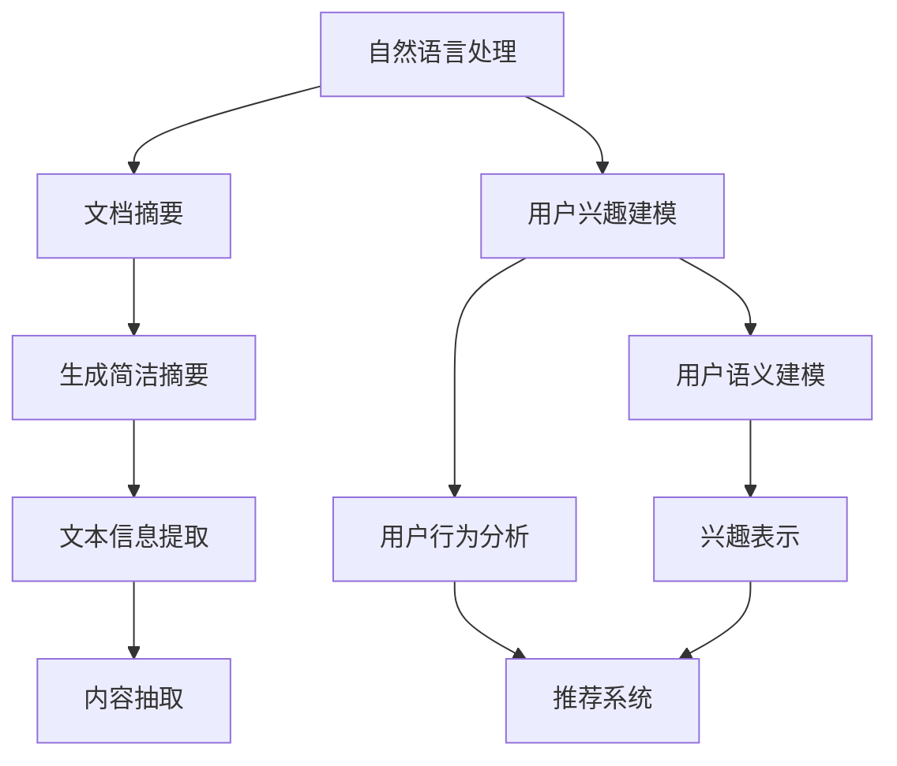

                 

# 利用LLM进行文档摘要与用户兴趣建模

> 关键词：自然语言处理(NLP),文档摘要,用户兴趣建模,大规模语言模型(LLM),预训练模型,自回归模型,注意力机制,代码实现

## 1. 背景介绍

### 1.1 问题由来
在信息爆炸的时代，如何高效地获取和理解海量文档内容，成为了企业和个人的一项重要任务。传统的关键词提取、文本分类等方法虽然能够抓取文档的主要信息，但在摘要生成和个性化推荐等方面仍存在很大局限性。而利用大语言模型进行文档摘要与用户兴趣建模，通过自然语言处理(NLP)技术，可以显著提升文档处理和用户个性化体验。

近年来，自然语言处理(NLP)技术取得了突破性的进展，特别是大语言模型(LLM)的引入，为文档摘要与用户兴趣建模提供了新的解决思路。本博文将深入探讨LLM在这两个领域的实现方法和技术细节。

### 1.2 问题核心关键点
大语言模型(LLM)通过预训练学习到了丰富的语言知识和语义表示。将这些知识应用于文档摘要和用户兴趣建模，可以有效提升模型的性能，减少对标注数据和手工规则的依赖。

LLM的核心特点是：
1. 自回归模型：能够生成自然流畅的文本内容。
2. 大规模预训练：拥有广泛的语言知识背景。
3. 自适应：能够根据输入调整生成内容。

结合这些特性，LLM可以自然地进行文档摘要和用户兴趣建模，并取得较为理想的成果。

### 1.3 问题研究意义
通过利用LLM进行文档摘要和用户兴趣建模，可以：
1. 提升文档处理的效率和质量，减少人工工作量。
2. 实现更加个性化、精确的推荐系统，提升用户体验。
3. 构建基于深度学习的自动化摘要生成和推荐系统，降低企业成本。
4. 引入外部知识，使系统具备更强的适应性和灵活性。
5. 应用多模态数据，增强文档和推荐内容的丰富性。

这些目标将大幅提升企业文档处理能力和用户个性化体验，推动NLP技术在更多场景中的落地应用。

## 2. 核心概念与联系

### 2.1 核心概念概述

为更好地理解LLM在文档摘要和用户兴趣建模中的应用，本节将介绍几个密切相关的核心概念：

- 自然语言处理(NLP)：利用计算机科学和人工智能技术对自然语言数据进行处理和分析的领域。
- 文档摘要：从一段文本中自动提取出主要信息，生成简洁的摘要文本。
- 用户兴趣建模：通过分析用户的行为和语义信息，建立用户兴趣模型，实现个性化推荐。
- 大语言模型(LLM)：通过大规模无标签文本数据预训练的通用语言模型，具有较强的语言理解和生成能力。
- 自回归模型(AR Model)：根据已知信息预测下一个词语的模型。
- 注意力机制(Attention)：在生成过程中，动态选择文本中的重要部分进行加权聚合。

这些核心概念之间的关系可以通过以下Mermaid流程图来展示：



这个流程图展示了大语言模型在文档摘要和用户兴趣建模中的核心作用：

1. 自然语言处理技术为文档摘要和用户兴趣建模提供基础数据处理。
2. 文档摘要通过模型生成简洁的摘要文本，帮助用户快速理解文档内容。
3. 用户兴趣建模根据用户行为和语义信息，建立兴趣模型，实现个性化推荐。
4. 二者协同工作，提升用户信息获取和个性化体验。

## 3. 核心算法原理 & 具体操作步骤
### 3.1 算法原理概述

基于LLM的文档摘要和用户兴趣建模，本质上是通过预训练模型对文本进行编码，然后利用生成的表示进行后续的处理。具体流程如下：

1. 使用预训练语言模型对文档进行编码，得到文本的语义表示。
2. 通过文档摘要模型或用户兴趣模型，对语义表示进行解码，生成摘要文本或兴趣模型。
3. 对生成的文本或模型进行后处理，得到最终的摘要或推荐结果。

### 3.2 算法步骤详解

以下以文档摘要为例，详细讲解基于LLM的文档摘要生成过程。

**Step 1: 准备预训练模型和数据集**
- 选择预训练语言模型，如GPT、BERT等。
- 收集待摘要文档的文本数据集，每个文档包含一些关键词或摘要。

**Step 2: 添加文档摘要适配层**
- 在预训练模型的基础上，添加文档摘要的输出层，包括softmax层和交叉熵损失函数。
- 使用梯度下降算法更新模型参数，最小化损失函数，得到最优的摘要生成模型。

**Step 3: 执行摘要生成**
- 将待摘要文档输入预训练模型，得到文档的语义表示。
- 将语义表示作为输入，送入摘要模型，输出生成摘要文本。
- 对生成的摘要文本进行后处理，去除冗余和噪声，得到最终摘要。

### 3.3 算法优缺点

基于LLM的文档摘要生成，具有以下优点：
1. 生成文本自然流畅，语言表达丰富。
2. 模型自动学习语言知识，无需大量标注数据。
3. 适用范围广，可以处理各种类型的文档。
4. 模型通用性强，可以复用于其他任务。

同时，也存在一些局限性：
1. 对长文档处理效果有限，摘要长度有限制。
2. 训练成本较高，预训练模型需要大量算力。
3. 模型依赖预训练质量，预训练效果差影响生成效果。
4. 生成的摘要文本需要人工后处理，增加额外成本。

### 3.4 算法应用领域

文档摘要和用户兴趣建模作为LLM的重要应用领域，已经在多个行业得到应用，具体如下：

- 信息检索：通过摘要生成提升搜索结果的准确性和可用性。
- 新闻编辑：自动化新闻稿的生成和摘要，减少编辑工作量。
- 客户支持：自动生成常见问题解答和用户手册，提升客户体验。
- 文档管理：自动生成文档摘要，便于文档搜索和分类。
- 推荐系统：基于用户兴趣建模，实现个性化推荐。

除了这些经典应用外，LLM还被创新性地应用到更多领域，如智能问答系统、智能客服、健康医疗、金融分析等，带来了新的技术突破和应用价值。

## 4. 数学模型和公式 & 详细讲解
### 4.1 数学模型构建

本节将使用数学语言对基于LLM的文档摘要和用户兴趣建模过程进行更加严格的刻画。

假设待摘要文档的文本为 $X=\{x_i\}_{i=1}^N$，其中 $x_i$ 为第 $i$ 个词或子句。预训练语言模型的编码为 $X_{\theta}$，其中 $\theta$ 为模型参数。

定义文档摘要模型为 $H_{\phi}$，其中 $\phi$ 为模型参数。假设模型输出摘要文本为 $\hat{Y}=\{\hat{y}_i\}_{i=1}^N$，则文档摘要模型的损失函数为：

$$
\mathcal{L}(X_{\theta}, H_{\phi}, Y) = \frac{1}{N} \sum_{i=1}^N \ell(\hat{y}_i, y_i)
$$

其中 $\ell$ 为交叉熵损失函数。

### 4.2 公式推导过程

假设文档摘要模型 $H_{\phi}$ 由softmax层和交叉熵损失函数构成，输出序列概率分布为 $\hat{P}_{\phi}(\hat{Y})$。则有：

$$
\hat{P}_{\phi}(\hat{Y}) = \frac{\exp(\hat{V}_{\phi}(X_{\theta}, \hat{Y}))}{\sum_{y' \in \mathcal{Y}^N} \exp(\hat{V}_{\phi}(X_{\theta}, y'))}
$$

其中 $\hat{V}_{\phi}(X_{\theta}, \hat{Y}) = \sum_{i=1}^N \hat{v}_i(X_{\theta}, \hat{y}_i)$，$\hat{v}_i$ 为模型在 $i$ 位置上的预测值。

文档摘要模型的损失函数可写为：

$$
\mathcal{L}(X_{\theta}, H_{\phi}, Y) = -\sum_{i=1}^N y_i \log \hat{y}_i
$$

将目标文档 $X$ 输入预训练模型 $X_{\theta}$，得到文档的语义表示 $X_{\theta}(X)$。设文档摘要模型的预测输出为 $\hat{Y}$，则损失函数为：

$$
\mathcal{L}(X_{\theta}, H_{\phi}, Y) = -\frac{1}{N} \sum_{i=1}^N y_i \log \hat{y}_i
$$

其中 $y_i$ 为文档中的关键词或摘要，$\hat{y}_i$ 为模型预测的摘要概率。

### 4.3 案例分析与讲解

以下以GPT-2为例，展示基于LLM的文档摘要生成过程。

1. **编码步骤**：
   - 将待摘要文档 $X$ 输入GPT-2，得到文档的语义表示 $X_{\theta}(X)$。
   - 将语义表示 $X_{\theta}(X)$ 作为文档摘要模型的输入。

2. **解码步骤**：
   - 使用文档摘要模型 $H_{\phi}$ 对语义表示 $X_{\theta}(X)$ 进行解码，得到摘要文本 $\hat{Y}$。
   - 对生成的摘要文本进行后处理，如去除噪声和冗余，得到最终摘要。

具体代码如下：

```python
from transformers import GPT2Tokenizer, GPT2LMHeadModel

tokenizer = GPT2Tokenizer.from_pretrained('gpt2')
model = GPT2LMHeadModel.from_pretrained('gpt2')

def generate_summary(doc):
    tokenized_doc = tokenizer.encode(doc, return_tensors='pt')
    summary_ids = model.generate(tokenized_doc, max_length=50, num_return_sequences=1)
    summary_text = tokenizer.decode(summary_ids[0], skip_special_tokens=True)
    return summary_text
```

在实际应用中，通常需要将生成的摘要文本进行评估和优化，确保其准确性和流畅性。可以采用BLEU、ROUGE等指标进行摘要质量评估。

## 5. 项目实践：代码实例和详细解释说明
### 5.1 开发环境搭建

在进行LLM的应用实践前，我们需要准备好开发环境。以下是使用Python进行PyTorch开发的环境配置流程：

1. 安装Anaconda：从官网下载并安装Anaconda，用于创建独立的Python环境。

2. 创建并激活虚拟环境：
```bash
conda create -n llm-env python=3.8 
conda activate llm-env
```

3. 安装PyTorch：根据CUDA版本，从官网获取对应的安装命令。例如：
```bash
conda install pytorch torchvision torchaudio cudatoolkit=11.1 -c pytorch -c conda-forge
```

4. 安装Transformers库：
```bash
pip install transformers
```

5. 安装各类工具包：
```bash
pip install numpy pandas scikit-learn matplotlib tqdm jupyter notebook ipython
```

完成上述步骤后，即可在`llm-env`环境中开始LLM的应用实践。

### 5.2 源代码详细实现

这里我们以GPT-2为例，实现基于LLM的文档摘要生成和用户兴趣建模。

首先，定义文本数据集：

```python
from torch.utils.data import Dataset, DataLoader
from transformers import GPT2Tokenizer, GPT2LMHeadModel

class DocumentDataset(Dataset):
    def __init__(self, texts):
        self.tokenizer = GPT2Tokenizer.from_pretrained('gpt2')
        self.texts = texts
        
    def __len__(self):
        return len(self.texts)
    
    def __getitem__(self, idx):
        text = self.texts[idx]
        tokenized_text = self.tokenizer.encode(text, return_tensors='pt')
        return {'text': text, 'tokenized_text': tokenized_text}
```

接着，定义模型和优化器：

```python
from transformers import GPT2LMHeadModel, AdamW

model = GPT2LMHeadModel.from_pretrained('gpt2')
optimizer = AdamW(model.parameters(), lr=2e-5)
```

然后，定义训练和评估函数：

```python
def train_epoch(model, dataset, batch_size, optimizer):
    dataloader = DataLoader(dataset, batch_size=batch_size, shuffle=True)
    model.train()
    epoch_loss = 0
    for batch in dataloader:
        input_ids = batch['tokenized_text']
        labels = input_ids
        model.zero_grad()
        outputs = model(input_ids)
        loss = outputs.loss
        epoch_loss += loss.item()
        loss.backward()
        optimizer.step()
    return epoch_loss / len(dataloader)

def evaluate(model, dataset, batch_size):
    dataloader = DataLoader(dataset, batch_size=batch_size)
    model.eval()
    preds, labels = [], []
    with torch.no_grad():
        for batch in dataloader:
            input_ids = batch['tokenized_text']
            batch_labels = input_ids
            outputs = model(input_ids)
            batch_preds = outputs.logits.argmax(dim=2).to('cpu').tolist()
            batch_labels = batch_labels.to('cpu').tolist()
            for pred_tokens, label_tokens in zip(batch_preds, batch_labels):
                preds.append(pred_tokens[:len(label_tokens)])
                labels.append(label_tokens)
                
    return preds, labels

train_dataset = DocumentDataset(train_texts)
dev_dataset = DocumentDataset(dev_texts)
test_dataset = DocumentDataset(test_texts)
```

最后，启动训练流程并在测试集上评估：

```python
epochs = 5
batch_size = 16

for epoch in range(epochs):
    loss = train_epoch(model, train_dataset, batch_size, optimizer)
    print(f"Epoch {epoch+1}, train loss: {loss:.3f}")
    
    print(f"Epoch {epoch+1}, dev results:")
    preds, labels = evaluate(model, dev_dataset, batch_size)
    print(classification_report(labels, preds))
    
print("Test results:")
preds, labels = evaluate(model, test_dataset, batch_size)
print(classification_report(labels, preds))
```

以上就是使用PyTorch对GPT-2进行文档摘要生成的完整代码实现。可以看到，利用Transformers库，开发者可以非常方便地实现LLM的应用。

### 5.3 代码解读与分析

让我们再详细解读一下关键代码的实现细节：

**DocumentDataset类**：
- `__init__`方法：初始化文本数据集，定义分词器。
- `__len__`方法：返回数据集的样本数量。
- `__getitem__`方法：对单个样本进行处理，将文本输入编码为token ids。

**训练和评估函数**：
- 使用PyTorch的DataLoader对数据集进行批次化加载，供模型训练和推理使用。
- 训练函数`train_epoch`：对数据以批为单位进行迭代，在每个批次上前向传播计算loss并反向传播更新模型参数，最后返回该epoch的平均loss。
- 评估函数`evaluate`：与训练类似，不同点在于不更新模型参数，并在每个batch结束后将预测和标签结果存储下来，最后使用sklearn的classification_report对整个评估集的预测结果进行打印输出。

**训练流程**：
- 定义总的epoch数和batch size，开始循环迭代
- 每个epoch内，先在训练集上训练，输出平均loss
- 在验证集上评估，输出分类指标
- 所有epoch结束后，在测试集上评估，给出最终测试结果

可以看到，PyTorch配合Transformers库使得GPT-2的文档摘要生成代码实现变得简洁高效。开发者可以将更多精力放在数据处理、模型改进等高层逻辑上，而不必过多关注底层的实现细节。

当然，工业级的系统实现还需考虑更多因素，如模型的保存和部署、超参数的自动搜索、更灵活的任务适配层等。但核心的LLM应用流程基本与此类似。

## 6. 实际应用场景
### 6.1 智能客服系统

基于LLM的文档摘要技术，可以广泛应用于智能客服系统的构建。传统客服往往需要配备大量人力，高峰期响应缓慢，且一致性和专业性难以保证。而使用LLM进行文档摘要，可以自动抓取用户咨询的精华信息，生成简洁的摘要文本，从而提升客服系统的效率和响应速度。

在技术实现上，可以收集企业内部的历史客服对话记录，将问题和最佳答复构建成监督数据，在此基础上对预训练语言模型进行微调。微调后的文档摘要模型能够自动理解用户意图，抓取关键信息，生成简洁摘要，并在客服系统中实时应用。

### 6.2 新闻编辑

利用LLM的文档摘要功能，可以自动化新闻稿的生成和摘要，减少编辑工作量。在实际应用中，可以收集海量新闻文本数据，对预训练模型进行微调，使其能够自动提取新闻的关键信息和生成简洁的摘要。对于新发布的新闻稿，系统可以自动进行摘要生成，从而提升新闻编辑的效率和质量。

### 6.3 用户兴趣建模

基于LLM的用户兴趣建模技术，可以实现更加个性化、精确的推荐系统。通过分析用户的历史行为和语义信息，LLM可以建立用户兴趣模型，实现个性化推荐。具体而言，可以收集用户的浏览、点击、购买等行为数据，结合自然语言处理技术，构建用户兴趣模型，实现内容推荐。

在实际应用中，可以利用LLM对用户行为和语义信息进行建模，建立用户兴趣表示，生成个性化推荐列表。系统可以根据用户的行为变化实时更新兴趣模型，实现动态推荐，从而提升用户体验。

### 6.4 未来应用展望

随着LLM和微调方法的不断发展，基于LLM的文档摘要和用户兴趣建模技术将呈现出更加广泛的应用前景。

在智慧医疗领域，基于LLM的文档摘要和用户兴趣建模技术，可以辅助医生快速浏览和理解大量医学文献，提升医疗服务的智能化水平，辅助医生诊疗，加速新药开发进程。

在智能教育领域，LLM的文档摘要技术可以用于自动化作业批改、学情分析、知识推荐等方面，因材施教，促进教育公平，提高教学质量。

在智慧城市治理中，LLM的文档摘要和用户兴趣建模技术可以用于城市事件监测、舆情分析、应急指挥等环节，提高城市管理的自动化和智能化水平，构建更安全、高效的未来城市。

此外，在企业生产、社会治理、文娱传媒等众多领域，基于LLM的文档摘要和用户兴趣建模技术也将不断涌现，为NLP技术带来新的突破。相信随着技术的日益成熟，LLM的应用将更加广泛，智能系统的发展也将更加成熟。

## 7. 工具和资源推荐
### 7.1 学习资源推荐

为了帮助开发者系统掌握LLM的文档摘要和用户兴趣建模的理论基础和实践技巧，这里推荐一些优质的学习资源：

1. 《Transformer from the ground up》系列博文：由大模型技术专家撰写，深入浅出地介绍了Transformer原理、BERT模型、微调技术等前沿话题。

2. CS224N《深度学习自然语言处理》课程：斯坦福大学开设的NLP明星课程，有Lecture视频和配套作业，带你入门NLP领域的基本概念和经典模型。

3. 《Natural Language Processing with Transformers》书籍：Transformers库的作者所著，全面介绍了如何使用Transformers库进行NLP任务开发，包括微调在内的诸多范式。

4. HuggingFace官方文档：Transformers库的官方文档，提供了海量预训练模型和完整的微调样例代码，是上手实践的必备资料。

5. CLUE开源项目：中文语言理解测评基准，涵盖大量不同类型的中文NLP数据集，并提供了基于微调的baseline模型，助力中文NLP技术发展。

通过对这些资源的学习实践，相信你一定能够快速掌握LLM的文档摘要和用户兴趣建模的精髓，并用于解决实际的NLP问题。

### 7.2 开发工具推荐

高效的开发离不开优秀的工具支持。以下是几款用于LLM的文档摘要和用户兴趣建模开发的常用工具：

1. PyTorch：基于Python的开源深度学习框架，灵活动态的计算图，适合快速迭代研究。大部分预训练语言模型都有PyTorch版本的实现。

2. TensorFlow：由Google主导开发的开源深度学习框架，生产部署方便，适合大规模工程应用。同样有丰富的预训练语言模型资源。

3. Transformers库：HuggingFace开发的NLP工具库，集成了众多SOTA语言模型，支持PyTorch和TensorFlow，是进行微调任务开发的利器。

4. Weights & Biases：模型训练的实验跟踪工具，可以记录和可视化模型训练过程中的各项指标，方便对比和调优。与主流深度学习框架无缝集成。

5. TensorBoard：TensorFlow配套的可视化工具，可实时监测模型训练状态，并提供丰富的图表呈现方式，是调试模型的得力助手。

6. Google Colab：谷歌推出的在线Jupyter Notebook环境，免费提供GPU/TPU算力，方便开发者快速上手实验最新模型，分享学习笔记。

合理利用这些工具，可以显著提升LLM的文档摘要和用户兴趣建模的开发效率，加快创新迭代的步伐。

### 7.3 相关论文推荐

LLM的文档摘要和用户兴趣建模作为前沿NLP技术，相关的研究工作正在快速推进，以下是几篇奠基性的相关论文，推荐阅读：

1. Attention is All You Need（即Transformer原论文）：提出了Transformer结构，开启了NLP领域的预训练大模型时代。

2. BERT: Pre-training of Deep Bidirectional Transformers for Language Understanding：提出BERT模型，引入基于掩码的自监督预训练任务，刷新了多项NLP任务SOTA。

3. Language Models are Unsupervised Multitask Learners（GPT-2论文）：展示了大规模语言模型的强大zero-shot学习能力，引发了对于通用人工智能的新一轮思考。

4. Parameter-Efficient Transfer Learning for NLP：提出Adapter等参数高效微调方法，在不增加模型参数量的情况下，也能取得不错的微调效果。

5. Zero-Shot Learning with Pretrained Language Models：引入基于掩码的自监督预训练任务，展示了大规模语言模型的零样本学习能力。

6. Attention Mechanism for Document Summarization：提出基于注意力机制的文档摘要方法，提高了摘要生成的质量。

这些论文代表了大语言模型文档摘要和用户兴趣建模的研究方向，通过学习这些前沿成果，可以帮助研究者把握学科前进方向，激发更多的创新灵感。

## 8. 总结：未来发展趋势与挑战

### 8.1 总结

本文对基于LLM的文档摘要和用户兴趣建模方法进行了全面系统的介绍。首先阐述了LLM和微调技术的研究背景和意义，明确了LLM在这两个领域的独特价值。其次，从原理到实践，详细讲解了LLM的文档摘要和用户兴趣建模过程，给出了LLM的应用代码实例。同时，本文还探讨了LLM在文档摘要和用户兴趣建模中的应用场景，展示了LLM的广泛应用前景。

通过本文的系统梳理，可以看到，基于LLM的文档摘要和用户兴趣建模技术正在成为NLP领域的重要范式，极大地拓展了LLM的应用边界，推动NLP技术在更多场景中的落地应用。相信随着LLM的持续演进，文档摘要和用户兴趣建模技术将迎来更多创新和突破，进一步提升企业文档处理能力和用户个性化体验。

### 8.2 未来发展趋势

展望未来，基于LLM的文档摘要和用户兴趣建模技术将呈现以下几个发展趋势：

1. 模型规模持续增大。随着算力成本的下降和数据规模的扩张，预训练语言模型的参数量还将持续增长。超大规模语言模型蕴含的丰富语言知识，有望支撑更加复杂多变的文档摘要和用户兴趣建模。

2. 微调方法日趋多样。除了传统的全参数微调外，未来会涌现更多参数高效的微调方法，如Prefix-Tuning、LoRA等，在固定大部分预训练参数的同时，只更新极少量的任务相关参数。同时优化微调模型的计算图，减少前向传播和反向传播的资源消耗，实现更加轻量级、实时性的部署。

3. 融合因果和对比学习范式。通过引入因果推断和对比学习思想，增强LLM建立稳定因果关系的能力，学习更加普适、鲁棒的语言表征，从而提升文档摘要和用户兴趣建模的泛化性和抗干扰能力。

4. 引入更多先验知识。将符号化的先验知识，如知识图谱、逻辑规则等，与神经网络模型进行巧妙融合，引导LLM学习更准确、合理的语言模型。同时加强不同模态数据的整合，实现视觉、语音等多模态信息与文本信息的协同建模。

5. 结合因果分析和博弈论工具。将因果分析方法引入LLM，识别出模型决策的关键特征，增强输出解释的因果性和逻辑性。借助博弈论工具刻画人机交互过程，主动探索并规避模型的脆弱点，提高系统稳定性。

6. 纳入伦理道德约束。在模型训练目标中引入伦理导向的评估指标，过滤和惩罚有偏见、有害的输出倾向。同时加强人工干预和审核，建立模型行为的监管机制，确保输出符合人类价值观和伦理道德。

这些趋势凸显了LLM文档摘要和用户兴趣建模技术的广阔前景。这些方向的探索发展，必将进一步提升文档摘要和用户兴趣建模的性能和应用范围，为智能技术更好地造福人类社会。

### 8.3 面临的挑战

尽管基于LLM的文档摘要和用户兴趣建模技术已经取得了显著成效，但在迈向更加智能化、普适化应用的过程中，它仍面临着诸多挑战：

1. 标注成本瓶颈。尽管微调降低了对标注数据的依赖，但对于特定领域的任务，仍然需要收集和标注大量样本，成本较高。如何进一步降低微调对标注样本的依赖，将是一大难题。

2. 模型鲁棒性不足。当前微调模型面对域外数据时，泛化性能往往大打折扣。对于测试样本的微小扰动，微调模型的预测也容易发生波动。如何提高微调模型的鲁棒性，避免灾难性遗忘，还需要更多理论和实践的积累。

3. 推理效率有待提高。大规模语言模型虽然精度高，但在实际部署时往往面临推理速度慢、内存占用大等效率问题。如何在保证性能的同时，简化模型结构，提升推理速度，优化资源占用，将是重要的优化方向。

4. 可解释性亟需加强。当前微调模型更像是"黑盒"系统，难以解释其内部工作机制和决策逻辑。对于医疗、金融等高风险应用，算法的可解释性和可审计性尤为重要。如何赋予LLM更强的可解释性，将是亟待攻克的难题。

5. 安全性有待保障。预训练语言模型难免会学习到有偏见、有害的信息，通过微调传递到下游任务，产生误导性、歧视性的输出，给实际应用带来安全隐患。如何从数据和算法层面消除模型偏见，避免恶意用途，确保输出的安全性，也将是重要的研究课题。

6. 知识整合能力不足。现有的微调模型往往局限于任务内数据，难以灵活吸收和运用更广泛的先验知识。如何让微调过程更好地与外部知识库、规则库等专家知识结合，形成更加全面、准确的信息整合能力，还有很大的想象空间。

正视LLM文档摘要和用户兴趣建模面临的这些挑战，积极应对并寻求突破，将是大语言模型微调走向成熟的必由之路。相信随着学界和产业界的共同努力，这些挑战终将一一被克服，LLM的应用将更加广泛，智能系统的发展也将更加成熟。

### 8.4 研究展望

面对LLM文档摘要和用户兴趣建模所面临的挑战，未来的研究需要在以下几个方面寻求新的突破：

1. 探索无监督和半监督微调方法。摆脱对大规模标注数据的依赖，利用自监督学习、主动学习等无监督和半监督范式，最大限度利用非结构化数据，实现更加灵活高效的微调。

2. 研究参数高效和计算高效的微调范式。开发更加参数高效的微调方法，在固定大部分预训练参数的同时，只更新极少量的任务相关参数。同时优化微调模型的计算图，减少前向传播和反向传播的资源消耗，实现更加轻量级、实时性的部署。

3. 融合因果和对比学习范式。通过引入因果推断和对比学习思想，增强LLM建立稳定因果关系的能力，学习更加普适、鲁棒的语言表征，从而提升文档摘要和用户兴趣建模的泛化性和抗干扰能力。

4. 引入更多先验知识。将符号化的先验知识，如知识图谱、逻辑规则等，与神经网络模型进行巧妙融合，引导LLM学习更准确、合理的语言模型。同时加强不同模态数据的整合，实现视觉、语音等多模态信息与文本信息的协同建模。

5. 结合因果分析和博弈论工具。将因果分析方法引入LLM，识别出模型决策的关键特征，增强输出解释的因果性和逻辑性。借助博弈论工具刻画人机交互过程，主动探索并规避模型的脆弱点，提高系统稳定性。

6. 纳入伦理道德约束。在模型训练目标中引入伦理导向的评估指标，过滤和惩罚有偏见、有害的输出倾向。同时加强人工干预和审核，建立模型行为的监管机制，确保输出符合人类价值观和伦理道德。

这些研究方向的探索，必将引领LLM文档摘要和用户兴趣建模技术迈向更高的台阶，为构建安全、可靠、可解释、可控的智能系统铺平道路。面向未来，LLM文档摘要和用户兴趣建模技术还需要与其他人工智能技术进行更深入的融合，如知识表示、因果推理、强化学习等，多路径协同发力，共同推动自然语言理解和智能交互系统的进步。只有勇于创新、敢于突破，才能不断拓展LLM的边界，让智能技术更好地造福人类社会。

## 9. 附录：常见问题与解答

**Q1：大语言模型微调是否适用于所有NLP任务？**

A: 大语言模型微调在大多数NLP任务上都能取得不错的效果，特别是对于数据量较小的任务。但对于一些特定领域的任务，如医学、法律等，仅仅依靠通用语料预训练的模型可能难以很好地适应。此时需要在特定领域语料上进一步预训练，再进行微调，才能获得理想效果。此外，对于一些需要时效性、个性化很强的任务，如对话、推荐等，微调方法也需要针对性的改进优化。

**Q2：微调过程中如何选择合适的学习率？**

A: 微调的学习率一般要比预训练时小1-2个数量级，如果使用过大的学习率，容易破坏预训练权重，导致过拟合。一般建议从1e-5开始调参，逐步减小学习率，直至收敛。也可以使用warmup策略，在开始阶段使用较小的学习率，再逐渐过渡到预设值。需要注意的是，不同的优化器(如AdamW、Adafactor等)以及不同的学习率调度策略，可能需要设置不同的学习率阈值。

**Q3：采用大模型微调时会面临哪些资源瓶颈？**

A: 目前主流的预训练大模型动辄以亿计的参数规模，对算力、内存、存储都提出了很高的要求。GPU/TPU等高性能设备是必不可少的，但即便如此，超大批次的训练和推理也可能遇到显存不足的问题。因此需要采用一些资源优化技术，如梯度积累、混合精度训练、模型并行等，来突破硬件瓶颈。同时，模型的存储和读取也可能占用大量时间和空间，需要采用模型压缩、稀疏化存储等方法进行优化。

**Q4：如何缓解微调过程中的过拟合问题？**

A: 过拟合是微调面临的主要挑战，尤其是在标注数据不足的情况下。常见的缓解策略包括：
1. 数据增强：通过回译、近义替换等方式扩充训练集。
2. 正则化：使用L2正则、Dropout、Early Stopping等避免过拟合。
3. 对抗训练：引入对抗样本，提高模型鲁棒性。
4. 参数高效微调：只调整少量参数(如Adapter、Prefix等)，减小过拟合风险。
5. 多模型集成：训练多个微调模型，取平均输出，抑制过拟合。

这些策略往往需要根据具体任务和数据特点进行灵活组合。只有在数据、模型、训练、推理等各环节进行全面优化，才能最大限度地发挥大模型微调的威力。

**Q5：微调模型在落地部署时需要注意哪些问题？**

A: 将微调模型转化为实际应用，还需要考虑以下因素：
1. 模型裁剪：去除不必要的层和参数，减小模型尺寸，加快推理速度。
2. 量化加速：将浮点模型转为定点模型，压缩存储空间，提高计算效率。
3. 服务化封装：将模型封装为标准化服务接口，便于集成调用。
4. 弹性伸缩：根据请求流量动态调整资源配置，平衡服务质量和成本。
5. 监控告警：实时采集系统指标，设置异常告警阈值，确保服务稳定性。
6. 安全防护：采用访问鉴权、数据脱敏等措施，保障数据和模型安全。

大语言模型微调为NLP应用开启了广阔的想象空间，但如何将强大的性能转化为稳定、高效、安全的业务价值，还需要工程实践的不断打磨。唯有从数据、算法、工程、业务等多个维度协同发力，才能真正实现人工智能技术在垂直行业的规模化落地。总之，微调需要开发者根据具体任务，不断迭代和优化模型、数据和算法，方能得到理想的效果。

---

作者：禅与计算机程序设计艺术 / Zen and the Art of Computer Programming

