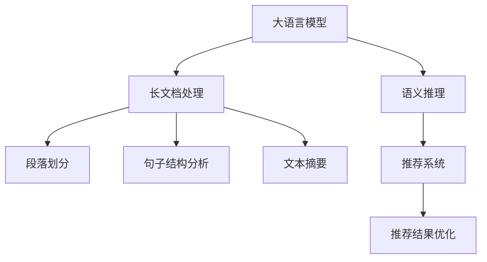

                 

# 利用大模型总结推理能力处理推荐长文档

> 关键词：大语言模型, 推荐系统, 长文档推理, 推理能力提升, 文档处理

## 1. 背景介绍

### 1.1 问题由来
随着信息技术的不断进步，人们接受的信息量呈爆炸式增长。在这样一个信息过载的时代，如何高效地获取和利用信息成为了一个关键问题。推荐系统应运而生，通过个性化推荐技术，帮助用户在海量信息中快速找到对自己有用的内容。然而，传统的推荐系统往往只考虑用户的短文本行为数据，难以捕捉到长文档的详细信息和复杂逻辑。针对这一问题，利用大模型总结推理能力进行长文档处理和推荐成为了一个热门研究方向。

### 1.2 问题核心关键点
在大模型上对长文档进行处理和推荐，需要解决以下关键问题：
1. **长文档理解**：大模型如何高效地理解和表示长文档的内容，提取出关键的特征和结构。
2. **语义推理**：长文档中包含多层次的语义关系和逻辑推理，如何通过模型将这一过程进行自动化表示。
3. **推荐结果优化**：如何利用大模型总结的特征进行个性化推荐，提升推荐结果的相关性和多样性。

通过利用大模型的强大推理能力和长文档处理能力，可以大幅提升推荐系统的性能和用户体验。本文将详细探讨基于大模型的长文档处理和推荐技术，包括其原理、操作步骤、应用领域、数学模型构建、项目实践、实际应用场景、工具和资源推荐、总结、未来发展趋势与挑战及常见问题与解答等内容。

## 2. 核心概念与联系

### 2.1 核心概念概述

为更好地理解基于大模型的长文档处理和推荐方法，本节将介绍几个密切相关的核心概念：

- **大语言模型(Large Language Model, LLM)**：如BERT、GPT等，通过自监督或监督学习任务训练得到的强大语言理解模型，具备强大的长文档处理能力。
- **长文档处理**：涉及文本摘要、段落划分、段落关系识别、句子结构分析等多个环节，旨在理解长文档的语义结构和关键信息。
- **语义推理**：指通过语言模型理解长文档中的多层次语义关系和逻辑推理，例如因果关系、时间顺序、主题关联等。
- **推荐系统**：根据用户的历史行为数据，预测其可能感兴趣的内容，并进行个性化推荐。
- **推荐结果优化**：通过用户反馈、A/B测试等手段，不断优化推荐算法和策略，提升推荐效果。

这些核心概念之间的逻辑关系可以通过以下Mermaid流程图来展示：



这个流程图展示了大语言模型在长文档处理和推荐系统中的应用流程：

1. 大语言模型对长文档进行处理，提取出段落、句子等关键结构。
2. 进一步分析段落之间的关系、句子结构等语义信息。
3. 进行语义推理，理解长文档中的多层次语义关系和逻辑推理。
4. 将处理后的信息输入到推荐系统，生成个性化推荐结果。
5. 通过用户反馈等手段不断优化推荐结果，提升用户体验。

## 3. 核心算法原理 & 具体操作步骤
### 3.1 算法原理概述

利用大模型对长文档进行推理和推荐，本质上是一个多步骤的自动化信息处理和决策过程。其核心思想是：将大语言模型作为一个强大的"特征提取器"和"推理器"，通过深度学习技术和自然语言处理技术，对长文档进行处理和推理，再通过推荐算法生成个性化推荐结果。

形式化地，假设长文档 $D$ 的长度为 $L$，通过大模型 $M_{\theta}$ 进行语义分析得到特征表示 $F$。推荐系统 $R$ 的目标是根据用户行为数据 $U$ 和文档特征 $F$，计算推荐结果 $R(D)$。推荐模型的优化目标是最大化推荐结果的相关性：

$$
\maximize_{\theta} R(D) \times U
$$

其中 $R(D)$ 表示推荐结果的相关性，$U$ 表示用户行为数据的相关性。优化过程中，通过反向传播算法更新模型参数 $\theta$，最小化损失函数 $\mathcal{L}$，使得模型输出的推荐结果更接近最优解。

### 3.2 算法步骤详解

基于大模型的长文档处理和推荐方法一般包括以下几个关键步骤：

**Step 1: 准备预训练模型和数据集**
- 选择合适的预训练语言模型 $M_{\theta}$ 作为初始化参数，如 BERT、GPT 等。
- 准备长文档数据集 $D=\{(x_i, y_i)\}_{i=1}^N$，其中 $x_i$ 表示长文档，$y_i$ 表示文档对应的标签或特征向量。

**Step 2: 添加任务适配层**
- 根据推荐任务类型，在预训练模型顶层设计合适的输出层和损失函数。
- 对于分类任务，通常在顶层添加线性分类器和交叉熵损失函数。
- 对于排序任务，通常使用多类排序损失函数或回归损失函数。

**Step 3: 设置微调超参数**
- 选择合适的优化算法及其参数，如 AdamW、SGD 等，设置学习率、批大小、迭代轮数等。
- 设置正则化技术及强度，包括权重衰减、Dropout、Early Stopping 等。
- 确定冻结预训练参数的策略，如仅微调顶层，或全部参数都参与微调。

**Step 4: 执行梯度训练**
- 将长文档数据分批次输入模型，前向传播计算损失函数。
- 反向传播计算参数梯度，根据设定的优化算法和学习率更新模型参数。
- 周期性在验证集上评估模型性能，根据性能指标决定是否触发 Early Stopping。
- 重复上述步骤直到满足预设的迭代轮数或 Early Stopping 条件。

**Step 5: 测试和部署**
- 在测试集上评估微调后模型 $M_{\hat{\theta}}$ 的性能，对比微调前后的精度提升。
- 使用微调后的模型对新样本进行推理预测，集成到实际的应用系统中。
- 持续收集新的数据，定期重新微调模型，以适应数据分布的变化。

以上是利用大模型进行长文档处理和推荐的一般流程。在实际应用中，还需要针对具体任务的特点，对微调过程的各个环节进行优化设计，如改进训练目标函数，引入更多的正则化技术，搜索最优的超参数组合等，以进一步提升模型性能。

### 3.3 算法优缺点

利用大模型进行长文档处理和推荐具有以下优点：
1. 处理能力强大。大模型能够高效处理长文档，提取关键特征和逻辑关系。
2. 推荐结果质量高。通过深度学习和自然语言处理技术，生成的推荐结果更加个性化和相关。
3. 易于扩展。不同领域的推荐任务只需修改任务适配层，即可快速应用到不同场景。
4. 模型通用性高。模型可以在各种长文档推荐场景下应用，如新闻阅读、电商购物、学术研究等。

同时，该方法也存在一些局限性：
1. 数据标注成本高。长文档处理和推荐需要大量高质量的标注数据，获取成本较高。
2. 资源消耗大。大模型通常需要高性能计算资源，如GPU/TPU，实际部署成本较高。
3. 结果可解释性差。模型输出的推理过程不透明，难以解释其决策依据。
4. 模型泛化能力有限。当训练数据和测试数据分布差异较大时，推荐效果可能受到影响。

尽管存在这些局限性，但就目前而言，利用大模型进行长文档处理和推荐仍然是大规模推荐系统的主要手段。未来相关研究的重点在于如何进一步降低数据标注成本，提高模型泛化能力，同时兼顾可解释性和伦理安全性等因素。

### 3.4 算法应用领域

利用大模型进行长文档处理和推荐的方法已经在多个领域得到了应用，例如：

- 新闻推荐：根据用户的浏览历史和兴趣，推荐相关新闻文章。
- 电商推荐：分析用户的购买记录和行为，推荐相似商品或搭配商品。
- 学术推荐：根据用户的研究兴趣，推荐相关学术论文和文献。
- 知识图谱构建：通过长文档理解和推理，构建知识图谱中的实体关系。
- 多模态推荐：结合图像、音频等多模态信息，进行更加全面和个性化的推荐。

除了上述这些经典应用外，大模型的长文档处理和推荐技术还在更多场景中得到创新性地应用，如个性化教育、社交网络推荐、智慧城市服务、智能医疗等，为不同行业的智能化转型提供支持。

## 4. 数学模型和公式 & 详细讲解  
### 4.1 数学模型构建

本节将使用数学语言对利用大模型的长文档处理和推荐过程进行更加严格的刻画。

记长文档数据集为 $D=\{(x_i, y_i)\}_{i=1}^N$，其中 $x_i$ 表示长文档，$y_i$ 表示文档对应的标签或特征向量。假设大模型为 $M_{\theta}$，则推荐系统 $R$ 的优化目标为：

$$
\maximize_{\theta} \sum_{i=1}^N R(y_i, M_{\theta}(x_i))
$$

其中 $R(y_i, M_{\theta}(x_i))$ 表示推荐结果与标签的相关性，可以通过多类排序损失、回归损失等函数进行定义。

### 4.2 公式推导过程

以二分类推荐任务为例，假设长文档 $x$ 经过大模型处理后得到的特征表示为 $F$，对应的标签为 $y \in \{0,1\}$。则推荐模型的优化目标为：

$$
\maximize_{\theta} -\frac{1}{N}\sum_{i=1}^N [y_i\log R(y_i, M_{\theta}(x_i))+(1-y_i)\log (1-R(y_i, M_{\theta}(x_i)))
$$

其中 $R(y_i, M_{\theta}(x_i))$ 为推荐结果的概率，可以通过二分类交叉熵损失函数计算。

在得到优化目标后，我们可以使用梯度下降等优化算法，更新模型参数 $\theta$，最小化损失函数。设 $\eta$ 为学习率，则参数的更新公式为：

$$
\theta \leftarrow \theta - \eta \nabla_{\theta}\mathcal{L}(\theta)
$$

其中 $\nabla_{\theta}\mathcal{L}(\theta)$ 为损失函数对参数 $\theta$ 的梯度，可通过反向传播算法高效计算。

### 4.3 案例分析与讲解

以电商推荐系统为例，假设我们要根据用户的历史购买记录和浏览行为，推荐用户可能感兴趣的商品。具体步骤如下：

1. **数据预处理**：收集用户的浏览和购买记录，构建用户行为向量 $U$。
2. **长文档处理**：将用户的行为向量作为长文档输入大模型，得到文档特征表示 $F$。
3. **语义推理**：利用大模型提取文档中的关键特征和逻辑关系，构建推荐模型需要的特征向量。
4. **推荐结果优化**：通过多类排序损失或回归损失函数，计算推荐结果的相关性，使用梯度下降优化推荐模型的参数。
5. **推荐输出**：根据用户的特征表示 $U$ 和文档特征表示 $F$，计算推荐结果，生成个性化推荐列表。

这个案例展示了利用大模型进行电商推荐的基本流程，其中关键步骤包括长文档处理、语义推理和推荐结果优化。这些步骤可以结合具体的业务场景进行灵活设计，从而实现高效的推荐系统。

## 5. 项目实践：代码实例和详细解释说明
### 5.1 开发环境搭建

在进行长文档处理和推荐实践前，我们需要准备好开发环境。以下是使用Python进行PyTorch开发的环境配置流程：

1. 安装Anaconda：从官网下载并安装Anaconda，用于创建独立的Python环境。

2. 创建并激活虚拟环境：
```bash
conda create -n pytorch-env python=3.8 
conda activate pytorch-env
```

3. 安装PyTorch：根据CUDA版本，从官网获取对应的安装命令。例如：
```bash
conda install pytorch torchvision torchaudio cudatoolkit=11.1 -c pytorch -c conda-forge
```

4. 安装Transformers库：
```bash
pip install transformers
```

5. 安装各类工具包：
```bash
pip install numpy pandas scikit-learn matplotlib tqdm jupyter notebook ipython
```

完成上述步骤后，即可在`pytorch-env`环境中开始长文档处理和推荐实践。

### 5.2 源代码详细实现

下面我们以电商推荐系统为例，给出使用Transformers库对BERT模型进行电商推荐微调的PyTorch代码实现。

首先，定义电商推荐任务的数据处理函数：

```python
from transformers import BertTokenizer
from torch.utils.data import Dataset
import torch

class ECommDataset(Dataset):
    def __init__(self, texts, tags, tokenizer, max_len=128):
        self.texts = texts
        self.tags = tags
        self.tokenizer = tokenizer
        self.max_len = max_len
        
    def __len__(self):
        return len(self.texts)
    
    def __getitem__(self, item):
        text = self.texts[item]
        tags = self.tags[item]
        
        encoding = self.tokenizer(text, return_tensors='pt', max_length=self.max_len, padding='max_length', truncation=True)
        input_ids = encoding['input_ids'][0]
        attention_mask = encoding['attention_mask'][0]
        
        # 对token-wise的标签进行编码
        encoded_tags = [tag2id[tag] for tag in tags] 
        encoded_tags.extend([tag2id['O']] * (self.max_len - len(encoded_tags)))
        labels = torch.tensor(encoded_tags, dtype=torch.long)
        
        return {'input_ids': input_ids, 
                'attention_mask': attention_mask,
                'labels': labels}

# 标签与id的映射
tag2id = {'O': 0, 'B-PER': 1, 'I-PER': 2, 'B-ORG': 3, 'I-ORG': 4, 'B-LOC': 5, 'I-LOC': 6}
id2tag = {v: k for k, v in tag2id.items()}

# 创建dataset
tokenizer = BertTokenizer.from_pretrained('bert-base-cased')

train_dataset = ECommDataset(train_texts, train_tags, tokenizer)
dev_dataset = ECommDataset(dev_texts, dev_tags, tokenizer)
test_dataset = ECommDataset(test_texts, test_tags, tokenizer)
```

然后，定义模型和优化器：

```python
from transformers import BertForTokenClassification, AdamW

model = BertForTokenClassification.from_pretrained('bert-base-cased', num_labels=len(tag2id))

optimizer = AdamW(model.parameters(), lr=2e-5)
```

接着，定义训练和评估函数：

```python
from torch.utils.data import DataLoader
from tqdm import tqdm
from sklearn.metrics import classification_report

device = torch.device('cuda') if torch.cuda.is_available() else torch.device('cpu')
model.to(device)

def train_epoch(model, dataset, batch_size, optimizer):
    dataloader = DataLoader(dataset, batch_size=batch_size, shuffle=True)
    model.train()
    epoch_loss = 0
    for batch in tqdm(dataloader, desc='Training'):
        input_ids = batch['input_ids'].to(device)
        attention_mask = batch['attention_mask'].to(device)
        labels = batch['labels'].to(device)
        model.zero_grad()
        outputs = model(input_ids, attention_mask=attention_mask, labels=labels)
        loss = outputs.loss
        epoch_loss += loss.item()
        loss.backward()
        optimizer.step()
    return epoch_loss / len(dataloader)

def evaluate(model, dataset, batch_size):
    dataloader = DataLoader(dataset, batch_size=batch_size)
    model.eval()
    preds, labels = [], []
    with torch.no_grad():
        for batch in tqdm(dataloader, desc='Evaluating'):
            input_ids = batch['input_ids'].to(device)
            attention_mask = batch['attention_mask'].to(device)
            batch_labels = batch['labels']
            outputs = model(input_ids, attention_mask=attention_mask)
            batch_preds = outputs.logits.argmax(dim=2).to('cpu').tolist()
            batch_labels = batch_labels.to('cpu').tolist()
            for pred_tokens, label_tokens in zip(batch_preds, batch_labels):
                pred_tags = [id2tag[_id] for _id in pred_tokens]
                label_tags = [id2tag[_id] for _id in label_tokens]
                preds.append(pred_tags[:len(label_tags)])
                labels.append(label_tags)
                
    print(classification_report(labels, preds))
```

最后，启动训练流程并在测试集上评估：

```python
epochs = 5
batch_size = 16

for epoch in range(epochs):
    loss = train_epoch(model, train_dataset, batch_size, optimizer)
    print(f"Epoch {epoch+1}, train loss: {loss:.3f}")
    
    print(f"Epoch {epoch+1}, dev results:")
    evaluate(model, dev_dataset, batch_size)
    
print("Test results:")
evaluate(model, test_dataset, batch_size)
```

以上就是使用PyTorch对BERT进行电商推荐任务微调的完整代码实现。可以看到，得益于Transformers库的强大封装，我们可以用相对简洁的代码完成BERT模型的加载和微调。

### 5.3 代码解读与分析

让我们再详细解读一下关键代码的实现细节：

**ECommDataset类**：
- `__init__`方法：初始化文本、标签、分词器等关键组件。
- `__len__`方法：返回数据集的样本数量。
- `__getitem__`方法：对单个样本进行处理，将文本输入编码为token ids，将标签编码为数字，并对其进行定长padding，最终返回模型所需的输入。

**tag2id和id2tag字典**：
- 定义了标签与数字id之间的映射关系，用于将token-wise的预测结果解码回真实的标签。

**训练和评估函数**：
- 使用PyTorch的DataLoader对数据集进行批次化加载，供模型训练和推理使用。
- 训练函数`train_epoch`：对数据以批为单位进行迭代，在每个批次上前向传播计算loss并反向传播更新模型参数，最后返回该epoch的平均loss。
- 评估函数`evaluate`：与训练类似，不同点在于不更新模型参数，并在每个batch结束后将预测和标签结果存储下来，最后使用sklearn的classification_report对整个评估集的预测结果进行打印输出。

**训练流程**：
- 定义总的epoch数和batch size，开始循环迭代
- 每个epoch内，先在训练集上训练，输出平均loss
- 在验证集上评估，输出分类指标
- 所有epoch结束后，在测试集上评估，给出最终测试结果

可以看到，PyTorch配合Transformers库使得BERT微调的代码实现变得简洁高效。开发者可以将更多精力放在数据处理、模型改进等高层逻辑上，而不必过多关注底层的实现细节。

当然，工业级的系统实现还需考虑更多因素，如模型的保存和部署、超参数的自动搜索、更灵活的任务适配层等。但核心的微调范式基本与此类似。

## 6. 实际应用场景
### 6.1 智能客服系统

基于大模型微调的对话技术，可以广泛应用于智能客服系统的构建。传统客服往往需要配备大量人力，高峰期响应缓慢，且一致性和专业性难以保证。而使用微调后的对话模型，可以7x24小时不间断服务，快速响应客户咨询，用自然流畅的语言解答各类常见问题。

在技术实现上，可以收集企业内部的历史客服对话记录，将问题和最佳答复构建成监督数据，在此基础上对预训练对话模型进行微调。微调后的对话模型能够自动理解用户意图，匹配最合适的答案模板进行回复。对于客户提出的新问题，还可以接入检索系统实时搜索相关内容，动态组织生成回答。如此构建的智能客服系统，能大幅提升客户咨询体验和问题解决效率。

### 6.2 金融舆情监测

金融机构需要实时监测市场舆论动向，以便及时应对负面信息传播，规避金融风险。传统的人工监测方式成本高、效率低，难以应对网络时代海量信息爆发的挑战。基于大语言模型微调的文本分类和情感分析技术，为金融舆情监测提供了新的解决方案。

具体而言，可以收集金融领域相关的新闻、报道、评论等文本数据，并对其进行主题标注和情感标注。在此基础上对预训练语言模型进行微调，使其能够自动判断文本属于何种主题，情感倾向是正面、中性还是负面。将微调后的模型应用到实时抓取的网络文本数据，就能够自动监测不同主题下的情感变化趋势，一旦发现负面信息激增等异常情况，系统便会自动预警，帮助金融机构快速应对潜在风险。

### 6.3 个性化推荐系统

当前的推荐系统往往只考虑用户的短文本行为数据，难以捕捉到长文档的详细信息和复杂逻辑。利用大模型对长文档进行推理和推荐，可以提升推荐系统的性能和用户体验。

在实践中，可以收集用户浏览、点击、评论、分享等行为数据，提取和用户交互的物品标题、描述、标签等文本内容。将文本内容作为模型输入，用户的后续行为（如是否点击、购买等）作为监督信号，在此基础上微调预训练语言模型。微调后的模型能够从文本内容中准确把握用户的兴趣点。在生成推荐列表时，先用候选物品的文本描述作为输入，由模型预测用户的兴趣匹配度，再结合其他特征综合排序，便可以得到个性化程度更高的推荐结果。

### 6.4 未来应用展望

随着大语言模型和微调方法的不断发展，基于微调范式将在更多领域得到应用，为传统行业带来变革性影响。

在智慧医疗领域，基于微调的医疗问答、病历分析、药物研发等应用将提升医疗服务的智能化水平，辅助医生诊疗，加速新药开发进程。

在智能教育领域，微调技术可应用于作业批改、学情分析、知识推荐等方面，因材施教，促进教育公平，提高教学质量。

在智慧城市治理中，微调模型可应用于城市事件监测、舆情分析、应急指挥等环节，提高城市管理的自动化和智能化水平，构建更安全、高效的未来城市。

此外，在企业生产、社会治理、文娱传媒等众多领域，基于大模型微调的人工智能应用也将不断涌现，为经济社会发展注入新的动力。相信随着技术的日益成熟，微调方法将成为人工智能落地应用的重要范式，推动人工智能技术在垂直行业的规模化落地。

## 7. 工具和资源推荐
### 7.1 学习资源推荐

为了帮助开发者系统掌握大语言模型微调的理论基础和实践技巧，这里推荐一些优质的学习资源：

1. 《Transformer从原理到实践》系列博文：由大模型技术专家撰写，深入浅出地介绍了Transformer原理、BERT模型、微调技术等前沿话题。

2. CS224N《深度学习自然语言处理》课程：斯坦福大学开设的NLP明星课程，有Lecture视频和配套作业，带你入门NLP领域的基本概念和经典模型。

3. 《Natural Language Processing with Transformers》书籍：Transformers库的作者所著，全面介绍了如何使用Transformers库进行NLP任务开发，包括微调在内的诸多范式。

4. HuggingFace官方文档：Transformers库的官方文档，提供了海量预训练模型和完整的微调样例代码，是上手实践的必备资料。

5. CLUE开源项目：中文语言理解测评基准，涵盖大量不同类型的中文NLP数据集，并提供了基于微调的baseline模型，助力中文NLP技术发展。

通过对这些资源的学习实践，相信你一定能够快速掌握大语言模型微调的精髓，并用于解决实际的NLP问题。
###  7.2 开发工具推荐

高效的开发离不开优秀的工具支持。以下是几款用于大语言模型微调开发的常用工具：

1. PyTorch：基于Python的开源深度学习框架，灵活动态的计算图，适合快速迭代研究。大部分预训练语言模型都有PyTorch版本的实现。

2. TensorFlow：由Google主导开发的开源深度学习框架，生产部署方便，适合大规模工程应用。同样有丰富的预训练语言模型资源。

3. Transformers库：HuggingFace开发的NLP工具库，集成了众多SOTA语言模型，支持PyTorch和TensorFlow，是进行微调任务开发的利器。

4. Weights & Biases：模型训练的实验跟踪工具，可以记录和可视化模型训练过程中的各项指标，方便对比和调优。与主流深度学习框架无缝集成。

5. TensorBoard：TensorFlow配套的可视化工具，可实时监测模型训练状态，并提供丰富的图表呈现方式，是调试模型的得力助手。

6. Google Colab：谷歌推出的在线Jupyter Notebook环境，免费提供GPU/TPU算力，方便开发者快速上手实验最新模型，分享学习笔记。

合理利用这些工具，可以显著提升大语言模型微调任务的开发效率，加快创新迭代的步伐。

### 7.3 相关论文推荐

大语言模型和微调技术的发展源于学界的持续研究。以下是几篇奠基性的相关论文，推荐阅读：

1. Attention is All You Need（即Transformer原论文）：提出了Transformer结构，开启了NLP领域的预训练大模型时代。

2. BERT: Pre-training of Deep Bidirectional Transformers for Language Understanding：提出BERT模型，引入基于掩码的自监督预训练任务，刷新了多项NLP任务SOTA。

3. Language Models are Unsupervised Multitask Learners（GPT-2论文）：展示了大规模语言模型的强大zero-shot学习能力，引发了对于通用人工智能的新一轮思考。

4. Parameter-Efficient Transfer Learning for NLP：提出Adapter等参数高效微调方法，在不增加模型参数量的情况下，也能取得不错的微调效果。

5. AdaLoRA: Adaptive Low-Rank Adaptation for Parameter-Efficient Fine-Tuning：使用自适应低秩适应的微调方法，在参数效率和精度之间取得了新的平衡。

这些论文代表了大语言模型微调技术的发展脉络。通过学习这些前沿成果，可以帮助研究者把握学科前进方向，激发更多的创新灵感。

## 8. 总结：未来发展趋势与挑战

### 8.1 总结

本文对利用大模型进行长文档处理和推荐的方法进行了全面系统的介绍。首先阐述了长文档处理和推荐技术的研究背景和意义，明确了大语言模型在提升推荐系统性能方面的独特价值。其次，从原理到实践，详细讲解了长文档处理和推荐数学原理和关键步骤，给出了微调任务开发的完整代码实例。同时，本文还广泛探讨了长文档处理和推荐方法在智能客服、金融舆情、个性化推荐等多个行业领域的应用前景，展示了微调范式的巨大潜力。此外，本文精选了微调技术的各类学习资源，力求为读者提供全方位的技术指引。

通过本文的系统梳理，可以看到，利用大模型进行长文档处理和推荐，对提升推荐系统的性能和用户体验具有重要意义。未来，伴随大语言模型和微调方法的持续演进，长文档处理和推荐技术必将在更多领域得到应用，为各行各业带来变革性影响。

### 8.2 未来发展趋势

展望未来，长文档处理和推荐技术将呈现以下几个发展趋势：

1. **深度融合多模态数据**：结合图像、音频等多模态信息，进行更加全面和个性化的推荐，提升推荐系统的用户体验。

2. **增强模型泛化能力**：通过引入更多先验知识，如知识图谱、逻辑规则等，提高模型的跨领域迁移能力和泛化性。

3. **提升推理能力**：引入更多推理任务，如因果推断、多模态推理等，提升长文档处理和推荐的深度和准确性。

4. **模型压缩和加速**：通过模型压缩、剪枝等技术，减少模型大小和计算资源消耗，实现高效推理。

5. **隐私保护和安全性**：在推荐系统设计和部署过程中，注重用户隐私保护和数据安全，避免数据泄露和滥用。

6. **自动化调参和优化**：利用自动化调参技术，如HyperOpt、Bayesian Optimization等，寻找最优模型参数组合，提升推荐效果。

以上趋势凸显了长文档处理和推荐技术的广阔前景。这些方向的探索发展，必将进一步提升推荐系统的性能和应用范围，为经济社会发展注入新的动力。

### 8.3 面临的挑战

尽管长文档处理和推荐技术已经取得了瞩目成就，但在迈向更加智能化、普适化应用的过程中，它仍面临着诸多挑战：

1. **数据标注成本高**：长文档处理和推荐需要大量高质量的标注数据，获取成本较高。如何降低标注成本，提升数据获取效率，是一大难题。

2. **模型资源消耗大**：大模型通常需要高性能计算资源，如GPU/TPU，实际部署成本较高。如何优化模型结构和推理过程，减少资源消耗，是一个重要研究方向。

3. **结果可解释性差**：模型输出的推理过程不透明，难以解释其决策依据。如何提升模型的可解释性，确保推荐结果的公正性和可信度，是一个亟待解决的问题。

4. **模型泛化能力有限**：当训练数据和测试数据分布差异较大时，推荐效果可能受到影响。如何提高模型的泛化能力，确保模型在不同场景下的稳定表现，是一个重要研究方向。

5. **隐私保护和数据安全**：在推荐系统设计和部署过程中，注重用户隐私保护和数据安全，避免数据泄露和滥用。

6. **自动化调参和优化**：如何利用自动化调参技术，寻找最优模型参数组合，提升推荐效果，是一个重要研究方向。

这些挑战需要学界和工业界的共同努力，通过技术创新和实践积累，逐步解决。唯有从数据、算法、工程、业务等多个维度协同发力，才能真正实现人工智能技术在垂直行业的规模化落地。总之，长文档处理和推荐需要开发者根据具体任务，不断迭代和优化模型、数据和算法，方能得到理想的效果。

### 8.4 研究展望

面对长文档处理和推荐技术所面临的种种挑战，未来的研究需要在以下几个方面寻求新的突破：

1. **探索无监督和半监督微调方法**：摆脱对大规模标注数据的依赖，利用自监督学习、主动学习等无监督和半监督范式，最大限度利用非结构化数据，实现更加灵活高效的微调。

2. **研究参数高效和计算高效的微调范式**：开发更加参数高效的微调方法，在固定大部分预训练参数的同时，只更新极少量的任务相关参数。同时优化微调模型的计算图，减少前向传播和反向传播的资源消耗，实现更加轻量级、实时性的部署。

3. **融合因果和对比学习范式**：通过引入因果推断和对比学习思想，增强长文档处理和推荐模型建立稳定因果关系的能力，学习更加普适、鲁棒的语言表征，从而提升模型泛化性和抗干扰能力。

4. **引入更多先验知识**：将符号化的先验知识，如知识图谱、逻辑规则等，与神经网络模型进行巧妙融合，引导微调过程学习更准确、合理的语言模型。同时加强不同模态数据的整合，实现视觉、语音等多模态信息与文本信息的协同建模。

5. **结合因果分析和博弈论工具**：将因果分析方法引入长文档处理和推荐模型，识别出模型决策的关键特征，增强输出解释的因果性和逻辑性。借助博弈论工具刻画人机交互过程，主动探索并规避模型的脆弱点，提高系统稳定性。

6. **纳入伦理道德约束**：在模型训练目标中引入伦理导向的评估指标，过滤和惩罚有偏见、有害的输出倾向。同时加强人工干预和审核，建立模型行为的监管机制，确保输出符合人类价值观和伦理道德。

这些研究方向的探索，必将引领长文档处理和推荐技术迈向更高的台阶，为构建安全、可靠、可解释、可控的智能系统铺平道路。面向未来，长文档处理和推荐技术还需要与其他人工智能技术进行更深入的融合，如知识表示、因果推理、强化学习等，多路径协同发力，共同推动自然语言理解和智能交互系统的进步。只有勇于创新、敢于突破，才能不断拓展语言模型的边界，让智能技术更好地造福人类社会。

## 9. 附录：常见问题与解答

**Q1：大语言模型进行长文档处理和推荐是否适用于所有NLP任务？**

A: 大语言模型进行长文档处理和推荐在大多数NLP任务上都能取得不错的效果，特别是对于数据量较小的任务。但对于一些特定领域的任务，如医学、法律等，仅仅依靠通用语料预训练的模型可能难以很好地适应。此时需要在特定领域语料上进一步预训练，再进行微调，才能获得理想效果。此外，对于一些需要时效性、个性化很强的任务，如对话、推荐等，微调方法也需要针对性的改进优化。

**Q2：在进行长文档处理和推荐时，如何选择合适的学习率？**

A: 长文档处理和推荐的学习率一般要比预训练时小1-2个数量级，如果使用过大的学习率，容易破坏预训练权重，导致过拟合。一般建议从1e-5开始调参，逐步减小学习率，直至收敛。也可以使用warmup策略，在开始阶段使用较小的学习率，再逐渐过渡到预设值。需要注意的是，不同的优化器(如AdamW、Adafactor等)以及不同的学习率调度策略，可能需要设置不同的学习率阈值。

**Q3：利用大模型进行长文档处理和推荐时，如何缓解过拟合问题？**

A: 过拟合是长文档处理和推荐面临的主要挑战，尤其是在标注数据不足的情况下。常见的缓解策略包括：
1. 数据增强：通过回译、近义替换等方式扩充训练集
2. 正则化：使用L2正则、Dropout、Early Stopping等避免过拟合
3. 对抗训练：引入对抗样本，提高模型鲁棒性
4. 参数高效微调：只调整少量参数(如Adapter、Prefix等)，减小过拟合风险
5. 多模型集成：训练多个微调模型，取平均输出，抑制过拟合

这些策略往往需要根据具体任务和数据特点进行灵活组合。只有在数据、模型、训练、推理等各环节进行全面优化，才能最大限度地发挥大模型微调的威力。

**Q4：利用大模型进行长文档处理和推荐时，如何优化推荐结果？**

A: 优化推荐结果的方法包括：
1. 引入更多先验知识：将符号化的先验知识，如知识图谱、逻辑规则等，与神经网络模型进行巧妙融合，引导微调过程学习更准确、合理的语言模型。同时加强不同模态数据的整合，实现视觉、语音等多模态信息与文本信息的协同建模。
2. 结合因果分析和博弈论工具：将因果分析方法引入长文档处理和推荐模型，识别出模型决策的关键特征，增强输出解释的因果性和逻辑性。借助博弈论工具刻画人机交互过程，主动探索并规避模型的脆弱点，提高系统稳定性。
3. 纳入伦理道德约束：在模型训练目标中引入伦理导向的评估指标，过滤和惩罚有偏见、有害的输出倾向。同时加强人工干预和审核，建立模型行为的监管机制，确保输出符合人类价值观和伦理道德。

这些方法可以帮助提升推荐结果的相关性和多样性，同时确保系统的公平性和安全性。

**Q5：利用大模型进行长文档处理和推荐时，如何优化模型结构和推理过程？**

A: 优化模型结构和推理过程的方法包括：
1. 模型压缩和剪枝：通过模型压缩、剪枝等技术，减少模型大小和计算资源消耗，实现高效推理。
2. 推理加速：利用推理优化技术，如推理图优化、动态计算图等，减少推理时间和内存占用。
3. 多任务学习：在训练过程中，同时进行多个任务，提升模型的多任务能力和泛化能力。
4. 在线学习：在实际使用过程中，不断更新模型参数，适应数据分布的变化，提升系统的实时性。

这些方法可以帮助优化模型结构和推理过程，实现高效、稳定的长文档处理和推荐系统。

