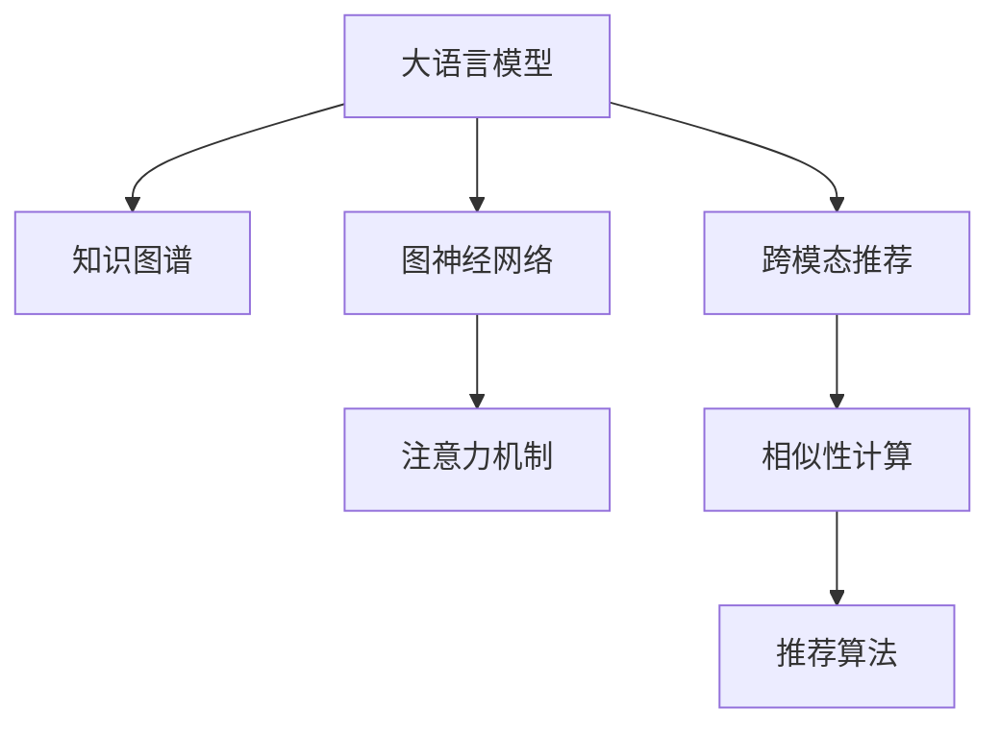

                 

# 利用大模型进行跨模态推荐的探索与实践

> 关键词：跨模态推荐, 大语言模型, 知识图谱, 图神经网络, 注意力机制, 多模态融合, 深度学习

## 1. 背景介绍

### 1.1 问题由来

在信息时代，我们面临的是海量的数据，形式多样，内容复杂。如何从这些数据中高效地抽取信息，并以有意义的方式呈现给用户，成为了一件非常困难的事情。传统的推荐系统，以用户行为数据为核心，通过协同过滤、基于内容的推荐等方法，为用户推荐感兴趣的物品或信息。然而，这种推荐方式存在一定的局限性，比如对冷启动用户和新物品缺乏了解，无法应对用户偏好变化快等。

随着多模态数据的兴起，用户的行为数据不再局限于单一的形式，如图像、视频、文本等。跨模态推荐系统开始被广泛关注，它通过整合不同模态的数据，为用户推荐更加丰富、个性化的内容。跨模态推荐系统可以从多个维度去了解用户，而不仅仅是从行为数据入手，使得推荐结果更加全面、准确。

大语言模型、知识图谱和图神经网络等技术的发展，为跨模态推荐系统的构建提供了强大的支持。它们可以整合大量的文本数据、知识图谱和图像数据，通过深度学习的方式，生成用户和物品的向量表示，用于推荐系统。

### 1.2 问题核心关键点

跨模态推荐系统的核心思想是：通过对用户的行为数据、图像数据、文本数据等多种形式的数据进行整合，生成更加全面、准确的向量表示，再通过相似性度量等方法，找到最相关的物品或内容，为用户推荐。

跨模态推荐系统的主要关注点包括：

1. **数据采集**：如何采集和整合多种形式的数据，以及如何处理数据的缺失和噪声。
2. **特征提取**：如何将不同模态的数据转换为向量表示，并整合成一个统一的空间，用于相似性计算。
3. **相似性计算**：如何度量用户和物品之间的相似性，以便推荐系统能够找到最相关的物品。
4. **模型训练**：如何训练跨模态推荐模型，使得推荐结果更加准确、个性化。

## 2. 核心概念与联系

### 2.1 核心概念概述

为了更好地理解跨模态推荐系统，我们先介绍几个核心概念：

- **大语言模型**：如BERT、GPT等，能够理解自然语言，并将其转换为向量表示。
- **知识图谱**：一种结构化的知识表示方式，包含了实体和实体之间的关系。
- **图神经网络**：一种基于图结构的深度学习算法，能够处理包含复杂关系的数据。
- **注意力机制**：一种机制，能够根据不同的信息重要性分配不同的权重，使得模型能够更加关注重要的信息。

这些概念之间的联系可以通过以下Mermaid流程图来展示：



这个流程图展示了大语言模型、知识图谱、图神经网络和跨模态推荐系统之间的关系：

1. 大语言模型可以将文本数据转换为向量表示，知识图谱可以将实体关系转换为向量表示，图神经网络可以对复杂关系进行处理。
2. 注意力机制可以帮助模型在不同信息之间分配权重，使得模型更加关注重要的信息。
3. 跨模态推荐系统整合了不同模态的数据，利用这些数据生成更加全面、准确的向量表示，用于相似性计算和推荐。

## 3. 核心算法原理 & 具体操作步骤

### 3.1 算法原理概述

跨模态推荐系统通常分为以下几个步骤：

1. **数据采集**：收集用户行为数据、图像数据、文本数据等多种形式的数据。
2. **特征提取**：通过大语言模型、知识图谱和图神经网络等技术，将不同模态的数据转换为向量表示。
3. **相似性计算**：利用相似性度量方法，如余弦相似度、向量加法等，计算用户和物品之间的相似性。
4. **推荐算法**：通过排序算法或协同过滤算法，找到最相关的物品，进行推荐。

### 3.2 算法步骤详解

#### 步骤1：数据采集

数据采集是跨模态推荐系统的第一步，需要从不同的渠道收集用户的行为数据、图像数据、文本数据等多种形式的数据。通常，用户的行为数据可以从电商平台的购买记录、评分数据等获取，图像数据可以从社交媒体平台、图像搜索引擎等获取，文本数据可以从新闻、博客、评论等获取。

#### 步骤2：特征提取

特征提取是将不同模态的数据转换为向量表示的过程。对于文本数据，可以使用大语言模型（如BERT、GPT）进行特征提取，生成文本向量。对于图像数据，可以使用卷积神经网络（CNN）提取特征，生成图像向量。对于知识图谱，可以使用图神经网络（GNN）提取特征，生成实体向量。

#### 步骤3：相似性计算

相似性计算是计算用户和物品之间的相似性，以便推荐系统能够找到最相关的物品。通常，相似性度量方法包括余弦相似度、向量加法、向量余弦加权等。

#### 步骤4：推荐算法

推荐算法是选择最相关的物品，进行推荐。常见的推荐算法包括协同过滤、基于内容的推荐、矩阵分解等。

### 3.3 算法优缺点

跨模态推荐系统具有以下优点：

- **全面性**：能够从多种数据源中整合信息，生成更加全面、准确的向量表示。
- **鲁棒性**：不同模态的数据可以互相补充，增强推荐系统的鲁棒性。
- **可解释性**：不同模态的数据能够提供更多的信息，使得推荐结果更容易被解释和理解。

但同时，跨模态推荐系统也存在以下缺点：

- **数据采集难度大**：需要从多个渠道采集数据，并且数据格式、质量可能不同。
- **特征提取复杂**：需要将不同模态的数据转换为向量表示，并且这些表示可能存在维度差异。
- **计算复杂度高**：相似性计算和特征表示的计算复杂度较高，需要高效的算法和硬件支持。

### 3.4 算法应用领域

跨模态推荐系统已经在多个领域得到了应用，如电商推荐、视频推荐、音乐推荐等。以下是几个典型的应用场景：

1. **电商推荐**：通过整合用户浏览记录、购买记录、评价数据等多种数据源，为用户推荐商品。
2. **视频推荐**：通过整合用户观看历史、点赞记录、评论内容等多种数据源，为用户推荐视频内容。
3. **音乐推荐**：通过整合用户听歌记录、歌词分析、音乐标签等多种数据源，为用户推荐音乐内容。
4. **新闻推荐**：通过整合用户阅读记录、文章标签、文章摘要等多种数据源，为用户推荐新闻内容。

## 4. 数学模型和公式 & 详细讲解 & 举例说明

### 4.1 数学模型构建

假设我们有一个跨模态推荐系统，包含用户$u$和物品$i$，以及文本数据$t_u$、图像数据$i_u$和知识图谱$g_u$。对于每个用户，我们分别通过大语言模型、图神经网络和知识图谱进行特征提取，生成文本向量$t_u^e$、图像向量$i_u^e$和实体向量$g_u^e$。

我们将这些向量表示整合为一个向量$z_u$，用于计算用户和物品之间的相似性$z_u^i$。推荐算法通过排序算法（如Top-K排序），找到最相关的物品，进行推荐。

### 4.2 公式推导过程

对于文本向量$t_u^e$，可以使用BERT等大语言模型进行特征提取，生成向量$t_u^e=\mathrm{BERT}(t_u)$。对于图像向量$i_u^e$，可以使用卷积神经网络（CNN）提取特征，生成向量$i_u^e=\mathrm{CNN}(i_u)$。对于实体向量$g_u^e$，可以使用图神经网络（GNN）提取特征，生成向量$g_u^e=\mathrm{GNN}(g_u)$。

将这三个向量整合为一个向量$z_u$，可以使用线性变换和拼接的方式：

$$
z_u = W_t t_u^e + W_i i_u^e + W_g g_u^e
$$

其中$W_t$、$W_i$和$W_g$为可训练的线性变换矩阵。

对于相似性计算，我们可以使用余弦相似度：

$$
z_u^i = \mathrm{similarity}(z_u, z_i) = \frac{z_u \cdot z_i}{\|z_u\| \cdot \|z_i\|}
$$

其中$z_i$为物品$i$的向量表示。

推荐算法可以使用Top-K排序算法，找到最相关的物品进行推荐：

$$
\text{top-K}(z_u, z_i) = \text{argtop-K}(z_u^i)
$$

### 4.3 案例分析与讲解

假设我们有一个电商平台的推荐系统，需要为用户推荐商品。我们可以通过整合用户浏览记录、购买记录、评价数据等多种数据源，生成用户向量$z_u$和商品向量$z_i$。对于每个用户，我们分别通过大语言模型、图神经网络和知识图谱进行特征提取，生成文本向量$t_u^e$、图像向量$i_u^e$和实体向量$g_u^e$，并整合为向量$z_u$。对于每个商品，我们同样通过大语言模型、图神经网络和知识图谱进行特征提取，生成文本向量$t_i^e$、图像向量$i_i^e$和实体向量$g_i^e$，并整合为向量$z_i$。

通过余弦相似度计算用户和物品之间的相似性，并使用Top-K排序算法，选择最相关的物品进行推荐。

## 5. 项目实践：代码实例和详细解释说明

### 5.1 开发环境搭建

在进行跨模态推荐系统的开发前，我们需要准备好开发环境。以下是使用Python进行PyTorch开发的环境配置流程：

1. 安装Anaconda：从官网下载并安装Anaconda，用于创建独立的Python环境。

2. 创建并激活虚拟环境：
```bash
conda create -n pytorch-env python=3.8 
conda activate pytorch-env
```

3. 安装PyTorch：根据CUDA版本，从官网获取对应的安装命令。例如：
```bash
conda install pytorch torchvision torchaudio cudatoolkit=11.1 -c pytorch -c conda-forge
```

4. 安装TensorFlow：由Google主导开发的开源深度学习框架，生产部署方便，适合大规模工程应用。同样有丰富的预训练语言模型资源。

5. 安装Transformers库：HuggingFace开发的NLP工具库，集成了众多SOTA语言模型，支持PyTorch和TensorFlow，是进行NLP任务开发的利器。

6. 安装各类工具包：
```bash
pip install numpy pandas scikit-learn matplotlib tqdm jupyter notebook ipython
```

完成上述步骤后，即可在`pytorch-env`环境中开始跨模态推荐系统的开发。

### 5.2 源代码详细实现

下面我们以电商平台推荐系统为例，给出使用Transformers库进行跨模态推荐的PyTorch代码实现。

首先，定义推荐任务的数据处理函数：

```python
from transformers import BertTokenizer
from torch.utils.data import Dataset
import torch

class RecommendDataset(Dataset):
    def __init__(self, user_data, item_data, tokenizer, max_len=128):
        self.user_data = user_data
        self.item_data = item_data
        self.tokenizer = tokenizer
        self.max_len = max_len
        
    def __len__(self):
        return len(self.user_data)
    
    def __getitem__(self, item):
        user = self.user_data[item]
        item = self.item_data[item]
        
        # 将用户和物品的文本数据合并
        text = f"{user['text']} {item['text']}"
        encoded = self.tokenizer(text, return_tensors='pt', max_length=self.max_len, padding='max_length', truncation=True)
        input_ids = encoded['input_ids'][0]
        attention_mask = encoded['attention_mask'][0]
        
        # 将用户和物品的图像数据合并
        image = torch.cat([user['image'], item['image']], dim=0)
        
        # 将用户和物品的知识图谱数据合并
        graph = self.merge_graph(user['graph'], item['graph'])
        
        return {'input_ids': input_ids, 
                'attention_mask': attention_mask,
                'images': image,
                'graph': graph}
```

然后，定义模型和优化器：

```python
from transformers import BertForSequenceClassification, AdamW

model = BertForSequenceClassification.from_pretrained('bert-base-cased', num_labels=1)

optimizer = AdamW(model.parameters(), lr=2e-5)
```

接着，定义训练和评估函数：

```python
from torch.utils.data import DataLoader
from tqdm import tqdm
from sklearn.metrics import roc_auc_score

device = torch.device('cuda') if torch.cuda.is_available() else torch.device('cpu')
model.to(device)

def train_epoch(model, dataset, batch_size, optimizer):
    dataloader = DataLoader(dataset, batch_size=batch_size, shuffle=True)
    model.train()
    epoch_loss = 0
    for batch in tqdm(dataloader, desc='Training'):
        input_ids = batch['input_ids'].to(device)
        attention_mask = batch['attention_mask'].to(device)
        images = batch['images'].to(device)
        graph = batch['graph'].to(device)
        model.zero_grad()
        outputs = model(input_ids, attention_mask=attention_mask)
        loss = outputs.loss
        epoch_loss += loss.item()
        loss.backward()
        optimizer.step()
    return epoch_loss / len(dataloader)

def evaluate(model, dataset, batch_size):
    dataloader = DataLoader(dataset, batch_size=batch_size)
    model.eval()
    preds, labels = [], []
    with torch.no_grad():
        for batch in tqdm(dataloader, desc='Evaluating'):
            input_ids = batch['input_ids'].to(device)
            attention_mask = batch['attention_mask'].to(device)
            images = batch['images'].to(device)
            graph = batch['graph'].to(device)
            outputs = model(input_ids, attention_mask=attention_mask)
            preds.append(outputs.logits.item())
            labels.append(batch['label'].to('cpu').tolist())
                
    auc = roc_auc_score(labels, preds)
    print(f"AUC: {auc:.3f}")
```

最后，启动训练流程并在测试集上评估：

```python
epochs = 5
batch_size = 16

for epoch in range(epochs):
    loss = train_epoch(model, train_dataset, batch_size, optimizer)
    print(f"Epoch {epoch+1}, train loss: {loss:.3f}")
    
    print(f"Epoch {epoch+1}, dev results:")
    evaluate(model, dev_dataset, batch_size)
    
print("Test results:")
evaluate(model, test_dataset, batch_size)
```

以上就是使用PyTorch对跨模态推荐系统进行开发的完整代码实现。可以看到，得益于Transformers库的强大封装，我们可以用相对简洁的代码完成跨模态推荐系统的构建。

### 5.3 代码解读与分析

让我们再详细解读一下关键代码的实现细节：

**RecommendDataset类**：
- `__init__`方法：初始化用户数据、物品数据、分词器等关键组件。
- `__len__`方法：返回数据集的样本数量。
- `__getitem__`方法：对单个样本进行处理，将用户和物品的文本数据合并，生成输入，并返回模型所需的输入。

**BertForSequenceClassification**：
- 定义了一个序列分类模型，使用BERT作为预训练模型。
- 模型输入为文本数据，输出为二分类预测结果。

**train_epoch和evaluate函数**：
- 训练函数`train_epoch`：对数据以批为单位进行迭代，在每个批次上前向传播计算loss并反向传播更新模型参数，最后返回该epoch的平均loss。
- 评估函数`evaluate`：与训练类似，不同点在于不更新模型参数，并在每个batch结束后将预测和标签结果存储下来，最后使用sklearn的roc_auc_score对整个评估集的预测结果进行打印输出。

**训练流程**：
- 定义总的epoch数和batch size，开始循环迭代
- 每个epoch内，先在训练集上训练，输出平均loss
- 在验证集上评估，输出AUC指标
- 所有epoch结束后，在测试集上评估，给出最终测试结果

可以看到，PyTorch配合Transformers库使得跨模态推荐系统的代码实现变得简洁高效。开发者可以将更多精力放在数据处理、模型改进等高层逻辑上，而不必过多关注底层的实现细节。

当然，工业级的系统实现还需考虑更多因素，如模型的保存和部署、超参数的自动搜索、更灵活的任务适配层等。但核心的跨模态推荐范式基本与此类似。

## 6. 实际应用场景

### 6.1 智能广告投放

在智能广告投放领域，跨模态推荐系统可以通过整合用户的浏览记录、搜索历史、社交网络等数据，为用户推荐广告内容。通过引入大语言模型和图神经网络，系统能够从多维度理解用户，生成更加全面、准确的向量表示，提高广告投放的精准度和效果。

### 6.2 个性化视频推荐

在视频推荐领域，跨模态推荐系统可以通过整合用户的观看历史、评分数据、评论内容等多种数据源，为用户推荐视频内容。通过引入大语言模型和图神经网络，系统能够从多维度理解视频内容，生成更加全面、准确的向量表示，提高视频推荐的个性化程度。

### 6.3 电商推荐系统

在电商推荐系统领域，跨模态推荐系统可以通过整合用户的浏览记录、购买记录、评价数据等多种数据源，为用户推荐商品。通过引入大语言模型和图神经网络，系统能够从多维度理解用户和商品，生成更加全面、准确的向量表示，提高推荐系统的个性化和精准度。

### 6.4 未来应用展望

随着跨模态推荐系统的发展，其在更多领域的应用前景将更加广阔。未来，跨模态推荐系统有望在医疗、教育、金融等多个领域发挥重要作用，成为推动各行各业数字化转型的重要力量。

## 7. 工具和资源推荐

### 7.1 学习资源推荐

为了帮助开发者系统掌握跨模态推荐系统的理论基础和实践技巧，这里推荐一些优质的学习资源：

1. 《深度学习》系列课程：斯坦福大学、Coursera等平台提供的多门深度学习课程，系统介绍了深度学习的基本概念和经典模型，包括图像、文本、序列等多种数据类型的处理。

2. 《图神经网络》课程：杜克大学提供的一系列图神经网络课程，系统介绍了图神经网络的基本原理和经典应用，包括推荐系统、社交网络分析等。

3. 《跨模态推荐系统》书籍：《Recommendation Systems: Algorithms, Applications, and Implementations》一书，详细介绍了推荐系统的发展历程和前沿技术，包括跨模态推荐系统的构建方法。

4. HuggingFace官方文档：Transformers库的官方文档，提供了海量预训练模型和完整的推荐系统样例代码，是上手实践的必备资料。

5. TensorFlow官方文档：TensorFlow框架的官方文档，提供了丰富的深度学习工具和推荐系统模型，是工程实践的必备参考。

通过对这些资源的学习实践，相信你一定能够快速掌握跨模态推荐系统的精髓，并用于解决实际的推荐问题。

### 7.2 开发工具推荐

高效的开发离不开优秀的工具支持。以下是几款用于跨模态推荐系统开发的常用工具：

1. PyTorch：基于Python的开源深度学习框架，灵活动态的计算图，适合快速迭代研究。大部分预训练语言模型都有PyTorch版本的实现。

2. TensorFlow：由Google主导开发的开源深度学习框架，生产部署方便，适合大规模工程应用。同样有丰富的预训练语言模型资源。

3. Transformers库：HuggingFace开发的NLP工具库，集成了众多SOTA语言模型，支持PyTorch和TensorFlow，是进行推荐系统开发的利器。

4. Weights & Biases：模型训练的实验跟踪工具，可以记录和可视化模型训练过程中的各项指标，方便对比和调优。与主流深度学习框架无缝集成。

5. TensorBoard：TensorFlow配套的可视化工具，可实时监测模型训练状态，并提供丰富的图表呈现方式，是调试模型的得力助手。

6. Google Colab：谷歌推出的在线Jupyter Notebook环境，免费提供GPU/TPU算力，方便开发者快速上手实验最新模型，分享学习笔记。

合理利用这些工具，可以显著提升跨模态推荐系统的开发效率，加快创新迭代的步伐。

### 7.3 相关论文推荐

跨模态推荐系统的发展离不开学界的持续研究。以下是几篇奠基性的相关论文，推荐阅读：

1. Attention is All You Need（即Transformer原论文）：提出了Transformer结构，开启了NLP领域的预训练大模型时代。

2. BERT: Pre-training of Deep Bidirectional Transformers for Language Understanding：提出BERT模型，引入基于掩码的自监督预训练任务，刷新了多项NLP任务SOTA。

3. Neural Collaborative Filtering（即NCF）：提出神经协同过滤模型，基于神经网络构建推荐系统，取得了SOTA的推荐效果。

4. Knowledge-aware Recommender Systems：提出知识增强推荐系统，引入知识图谱，提高了推荐系统的个性化程度。

5. Deep Cross-Modal Feature Alignment（即DCA）：提出跨模态特征对齐方法，整合多种模态的数据，生成更加全面、准确的向量表示。

6. Knowledge-aware Neural Recommendation（即KAN）：提出知识增强神经推荐模型，整合知识图谱和用户行为数据，提高了推荐系统的表现和可解释性。

这些论文代表了大语言模型微调技术的发展脉络。通过学习这些前沿成果，可以帮助研究者把握学科前进方向，激发更多的创新灵感。

## 8. 总结：未来发展趋势与挑战

### 8.1 总结

本文对基于大模型进行跨模态推荐系统进行了全面系统的介绍。首先阐述了跨模态推荐系统的发展背景和应用前景，明确了跨模态推荐系统在多模态数据整合、推荐结果个性化和泛化性等方面的独特价值。其次，从原理到实践，详细讲解了跨模态推荐系统的核心算法和操作步骤，给出了跨模态推荐任务开发的完整代码实例。同时，本文还广泛探讨了跨模态推荐系统在智能广告、视频推荐、电商推荐等多个领域的应用前景，展示了跨模态推荐系统的广阔前景。

通过本文的系统梳理，可以看到，跨模态推荐系统通过整合多种模态的数据，生成更加全面、准确的向量表示，能够为用户推荐更加丰富、个性化的内容。大语言模型、知识图谱和图神经网络等技术的发展，为跨模态推荐系统的构建提供了强大的支持。未来，随着这些技术的不断演进，跨模态推荐系统将更加高效、灵活、个性化，为各行各业带来变革性的影响。

### 8.2 未来发展趋势

展望未来，跨模态推荐系统将呈现以下几个发展趋势：

1. **数据融合更加多样**：未来，跨模态推荐系统将整合更多种类的数据，如社交网络、位置信息、语音数据等，提供更加全面的用户画像和推荐结果。
2. **模型更加轻量**：为了满足实时推荐的需求，未来将发展更加轻量化的模型，如Transformer、GNN等，使得推荐系统能够在资源受限的环境中运行。
3. **可解释性增强**：为了提高推荐系统的可信度，未来将发展更加可解释的模型，如LIME、SHAP等，帮助用户理解推荐结果的依据。
4. **公平性更加重视**：未来将发展更加公平的推荐算法，避免对特定群体的偏见和歧视，提高推荐系统的社会责任。
5. **多领域融合更加广泛**：未来将发展跨模态推荐系统与其他领域技术的融合，如知识图谱、强化学习、博弈论等，推动跨模态推荐系统在更多领域的应用。

这些趋势将引领跨模态推荐系统的发展方向，为各行各业带来更全面、精准、公平、可解释的推荐服务。

### 8.3 面临的挑战

尽管跨模态推荐系统已经取得了显著的进展，但在迈向更加智能化、普适化应用的过程中，它仍面临着诸多挑战：

1. **数据获取难度大**：不同模态的数据获取难度和成本不同，不同数据源的整合面临诸多难题。
2. **特征表示复杂**：不同模态的数据表示复杂，需要进行统一表示和融合，增加了算法的复杂度。
3. **计算资源需求高**：跨模态推荐系统的计算复杂度较高，需要高效的算法和硬件支持。
4. **模型可解释性不足**：推荐系统往往是一个"黑盒"，难以解释其内部工作机制和决策逻辑。
5. **公平性和偏见问题**：推荐系统可能存在对特定群体的偏见和歧视，需要进行公平性分析和改进。

正视这些挑战，积极应对并寻求突破，将使跨模态推荐系统不断迈向成熟，为各行各业带来更高效、公平、可解释的推荐服务。

### 8.4 研究展望

未来的跨模态推荐系统需要从以下几个方面进行探索：

1. **数据采集和整合**：发展高效的数据采集和整合方法，使得不同模态的数据能够更方便地获取和整合。
2. **特征表示和融合**：发展高效的特征表示和融合方法，使得不同模态的数据能够更好地融合和统一。
3. **模型轻量化**：发展轻量化的模型架构和优化方法，使得推荐系统能够在资源受限的环境中运行。
4. **可解释性增强**：发展可解释的模型方法和工具，帮助用户理解推荐结果的依据。
5. **公平性和偏见**：发展公平性分析和改进方法，避免推荐系统对特定群体的偏见和歧视。

这些研究方向将推动跨模态推荐系统的发展，使得其在各行各业中发挥更加重要的作用。通过不断优化算法和模型，提升推荐系统的精准度、个性化和公平性，未来跨模态推荐系统将在推动社会进步和行业变革中发挥重要作用。

## 9. 附录：常见问题与解答

**Q1：跨模态推荐系统是否可以应用于所有推荐任务？**

A: 跨模态推荐系统适用于多种推荐任务，如电商推荐、视频推荐、音乐推荐等。但其效果受到不同数据源的覆盖度和质量影响，需要根据具体情况选择合适的推荐模型。

**Q2：如何选择合适的学习率？**

A: 跨模态推荐系统通常使用Adam等优化器，学习率一般设置为2e-5。可以通过实验调整学习率，寻找最优的学习率。

**Q3：如何缓解过拟合问题？**

A: 过拟合是跨模态推荐系统面临的主要挑战之一。可以通过数据增强、正则化、对抗训练等方法缓解过拟合问题。

**Q4：跨模态推荐系统在落地部署时需要注意哪些问题？**

A: 跨模态推荐系统在落地部署时需要注意模型裁剪、量化加速、服务化封装、弹性伸缩、监控告警、安全防护等问题。

**Q5：如何提高推荐系统的个性化程度？**

A: 可以通过引入用户画像、物品画像、用户-物品关系等多种信息，提高推荐系统的个性化程度。

以上是跨模态推荐系统的开发和实践指南，希望能够为你的研究和工作提供有益的参考。感谢阅读！

---

作者：禅与计算机程序设计艺术 / Zen and the Art of Computer Programming

