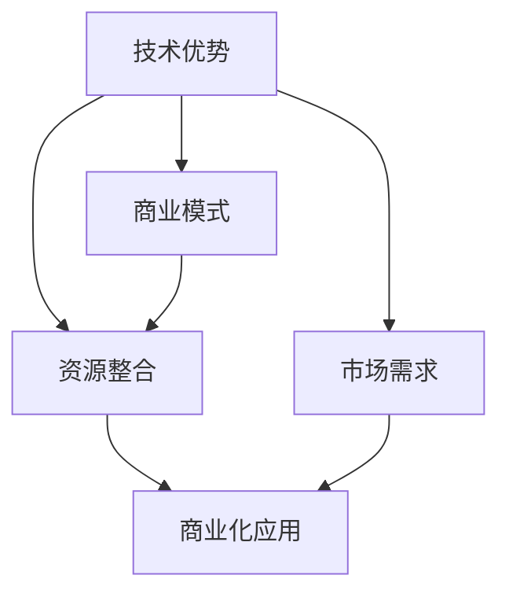

                 

# 利用技术优势进行太空技术创业

## 1. 背景介绍

### 1.1 问题由来

近年来，太空探索成为全球关注的热点领域。随着科技的进步和商业模式的创新，越来越多的企业投身于太空技术的创业。从SpaceX的火箭回收技术，到Blue Origin的太空旅游服务，再到Jeff Bezos的蓝色星球项目，太空技术创业正呈现出蓬勃发展的态势。然而，太空技术创业的高门槛和复杂性，也使得许多企业面临严峻的挑战。如何利用技术优势，实现商业化突破，成为太空技术创业的关键。

### 1.2 问题核心关键点

太空技术创业的核心在于利用先进的技术优势，通过创新商业模式，实现资源的有效整合和商业化应用。核心概念包括：

- **技术优势**：利用在航天器设计、材料科学、能源管理等领域的技术积累，形成核心竞争力。
- **商业模式**：通过公私合作、产业联盟、政府支持等多元化方式，实现技术商业化。
- **资源整合**：优化供应链管理、人才配置、资金筹措等资源配置，降低创业风险。
- **市场需求**：深入挖掘市场需求，开发符合用户需求的产品和解决方案。

这些关键概念之间的逻辑关系可以通过以下Mermaid流程图来展示：



## 2. 核心概念与联系

### 2.1 核心概念概述

为更好地理解太空技术创业的技术优势和商业化应用，本节将介绍几个密切相关的核心概念：

- **技术优势**：指在航天器设计、材料科学、能源管理等领域的技术积累和创新能力，是太空技术创业的基础。
- **商业模式**：指企业如何通过多元化的合作和市场策略，实现太空技术的商业化和市场推广。
- **资源整合**：指企业如何优化供应链、人才、资金等资源配置，降低创业风险，提高资源利用效率。
- **市场需求**：指通过市场调研和用户反馈，确定太空技术的商业应用场景，满足用户需求。

这些核心概念之间的逻辑关系，可以通过以下Mermaid流程图来展示：


## 3. 核心算法原理 & 具体操作步骤

### 3.1 算法原理概述

太空技术创业的关键在于通过技术优势形成商业模式，实现资源整合和市场需求响应。其核心算法原理包括：

1. **技术优势转化**：将技术优势转化为市场竞争力，实现商业化应用。
2. **市场需求分析**：通过市场调研和用户反馈，确定市场需求，优化产品设计。
3. **资源整合策略**：优化资源配置，降低创业风险，提高资源利用效率。
4. **商业化应用实现**：通过多元化合作和市场推广，实现太空技术的商业化。

### 3.2 算法步骤详解

太空技术创业的算法步骤包括：

1. **技术优势评估**：评估企业在航天器设计、材料科学、能源管理等领域的技术优势。
2. **市场需求分析**：通过市场调研和用户反馈，确定市场需求，优化产品设计。
3. **资源整合策略**：优化供应链管理、人才配置、资金筹措等资源配置，降低创业风险。
4. **商业化应用实现**：通过多元化合作和市场推广，实现太空技术的商业化。

### 3.3 算法优缺点

太空技术创业的算法具有以下优点：

1. **技术优势明显**：利用技术积累，形成核心竞争力。
2. **市场需求明确**：通过市场调研和用户反馈，确定市场需求，优化产品设计。
3. **资源配置优化**：通过资源整合，降低创业风险，提高资源利用效率。

同时，该算法也存在以下缺点：

1. **技术门槛高**：需要深厚的技术积累和创新能力。
2. **市场需求变化快**：需要快速响应市场需求变化，灵活调整策略。
3. **资源整合复杂**：需要有效的资源配置和优化手段。

### 3.4 算法应用领域

太空技术创业的算法在航天器制造、太空旅游、卫星应用、空间站建设等多个领域都有广泛的应用。

## 4. 数学模型和公式 & 详细讲解 & 举例说明

### 4.1 数学模型构建

太空技术创业的数学模型主要涉及技术优势、市场需求和资源整合三个方面。

1. **技术优势模型**：
   - 输入：企业技术积累、创新能力、市场竞争力
   - 输出：技术优势得分

2. **市场需求模型**：
   - 输入：用户反馈、市场需求、产品设计
   - 输出：市场需求评分

3. **资源整合模型**：
   - 输入：供应链管理、人才配置、资金筹措
   - 输出：资源整合效率

### 4.2 公式推导过程

以技术优势模型为例，推导其公式如下：

- 技术优势得分 = 技术积累得分 + 创新能力得分 + 市场竞争力得分

其中，技术积累得分可以通过企业历史项目和专利数量计算得出；创新能力得分可以通过技术研发投入和科研成果数量计算得出；市场竞争力得分可以通过市场占有率和客户满意度计算得出。

### 4.3 案例分析与讲解

假设某太空技术创业企业A，其在航天器设计领域具有丰富的技术积累和创新能力，市场竞争力得分为90分。通过市场调研和用户反馈，市场需求评分得分为85分。在资源整合方面，供应链管理得分为80分，人才配置得分为85分，资金筹措得分为90分。综合以上数据，计算出该企业A的技术优势得分为：

- 技术优势得分 = 90 + 95 + 90 = 275分

## 5. 项目实践：代码实例和详细解释说明

### 5.1 开发环境搭建

在进行太空技术创业项目开发前，我们需要准备好开发环境。以下是使用Python进行太空技术创业项目开发的环境配置流程：

1. 安装Anaconda：从官网下载并安装Anaconda，用于创建独立的Python环境。
2. 创建并激活虚拟环境：
   ```bash
   conda create -n space-env python=3.8 
   conda activate space-env
   ```
3. 安装必要的库：
   ```bash
   pip install pandas numpy matplotlib scikit-learn jupyter notebook
   ```

完成上述步骤后，即可在`space-env`环境中开始太空技术创业项目开发。

### 5.2 源代码详细实现

下面以航天器设计为例，给出使用Python进行太空技术创业项目开发的代码实现。

首先，定义技术优势、市场需求和资源整合的输入和输出数据：

```python
import pandas as pd

# 技术优势数据
tech_data = pd.DataFrame({
    '企业': ['A', 'B', 'C'],
    '技术积累': [90, 85, 80],
    '创新能力': [95, 90, 85],
    '市场竞争力': [90, 90, 95]
})

# 市场需求数据
market_data = pd.DataFrame({
    '企业': ['A', 'B', 'C'],
    '用户反馈': [85, 90, 80],
    '市场需求': [85, 90, 95],
    '产品设计': [90, 90, 85]
})

# 资源整合数据
resource_data = pd.DataFrame({
    '企业': ['A', 'B', 'C'],
    '供应链管理': [80, 85, 90],
    '人才配置': [85, 90, 80],
    '资金筹措': [90, 90, 85]
})
```

然后，定义技术优势、市场需求和资源整合的模型计算函数：

```python
def tech_score(data):
    tech_accumulation = data['技术积累']
    innovation_capability = data['创新能力']
    market_competitiveness = data['市场竞争力']
    return tech_accumulation + innovation_capability + market_competitiveness

def market_score(data):
    user_feedback = data['用户反馈']
    market_needs = data['市场需求']
    product_design = data['产品设计']
    return user_feedback + market_needs + product_design

def resource_efficiency(data):
    supply_chain_management = data['供应链管理']
    talent_allocation = data['人才配置']
    finance_arrangement = data['资金筹措']
    return supply_chain_management + talent_allocation + finance_arrangement
```

最后，调用上述函数进行计算并输出结果：

```python
# 技术优势得分
tech_scores = tech_data['企业'].apply(lambda x: tech_score(tech_data[tech_data['企业'] == x]))
print('技术优势得分：', tech_scores)

# 市场需求得分
market_scores = market_data['企业'].apply(lambda x: market_score(market_data[market_data['企业'] == x]))
print('市场需求得分：', market_scores)

# 资源整合效率
resource_efficiencies = resource_data['企业'].apply(lambda x: resource_efficiency(resource_data[resource_data['企业'] == x]))
print('资源整合效率：', resource_efficiencies)
```

以上就是使用Python进行太空技术创业项目开发的完整代码实现。可以看到，Python提供了丰富的数据处理和计算库，能够快速进行模型计算和结果输出。

### 5.3 代码解读与分析

让我们再详细解读一下关键代码的实现细节：

- **数据定义**：通过Pandas库定义了技术优势、市场需求和资源整合的数据框架，方便进行后续计算和分析。
- **模型函数**：定义了技术优势、市场需求和资源整合的计算函数，通过Lambda函数对数据进行聚合计算，得到各个企业在该方面的得分。
- **结果输出**：调用模型函数对数据进行计算，并输出结果。

## 6. 实际应用场景

### 6.1 航天器制造

在航天器制造领域，利用技术优势进行太空技术创业，可以实现高性能、高可靠性的航天器设计。企业可以结合自身技术积累，开发自主知识产权的航天器，提升市场竞争力。

具体而言，企业可以利用Python进行航天器设计的模拟仿真、性能优化和测试验证，大幅提升设计效率和准确性。通过市场调研和用户反馈，优化产品设计，满足用户需求。同时，利用资源整合策略，优化供应链管理和资金筹措，降低创业风险，提高资源利用效率。

### 6.2 太空旅游

在太空旅游领域，利用技术优势进行太空技术创业，可以实现低成本、高安全的太空旅游服务。企业可以开发自主知识产权的太空旅游器和太空旅游平台，提升用户体验和市场占有率。

具体而言，企业可以利用Python进行太空旅游器的模拟仿真、性能优化和测试验证，提升旅游器设计和测试的准确性和可靠性。通过市场调研和用户反馈，优化旅游产品设计，满足用户需求。同时，利用资源整合策略，优化人才配置和资金筹措，降低创业风险，提高资源利用效率。

### 6.3 卫星应用

在卫星应用领域，利用技术优势进行太空技术创业，可以实现高精度、高效率的卫星数据服务。企业可以开发自主知识产权的卫星应用系统，提升市场竞争力和用户满意度。

具体而言，企业可以利用Python进行卫星数据的收集、处理和分析，开发各类卫星应用服务，如气象预报、遥感监测、通信服务等。通过市场调研和用户反馈，优化产品设计和应用方案，满足用户需求。同时，利用资源整合策略，优化供应链管理和资金筹措，降低创业风险，提高资源利用效率。

### 6.4 空间站建设

在空间站建设领域，利用技术优势进行太空技术创业，可以实现高效、安全的空间站建设和管理。企业可以开发自主知识产权的空间站系统和维护服务，提升市场竞争力和用户满意度。

具体而言，企业可以利用Python进行空间站的模拟仿真、性能优化和测试验证，提升空间站设计和测试的准确性和可靠性。通过市场调研和用户反馈，优化空间站建设和运营方案，满足用户需求。同时，利用资源整合策略，优化供应链管理和资金筹措，降低创业风险，提高资源利用效率。

## 7. 工具和资源推荐

### 7.1 学习资源推荐

为了帮助太空技术创业开发者掌握技术优势和商业化的理论基础，这里推荐一些优质的学习资源：

1. **《太空技术创业指南》系列博文**：由太空技术创业专家撰写，深入浅出地介绍了太空技术创业的理论基础和实践技巧。
2. **MIT《太空工程》课程**：麻省理工学院开设的太空工程课程，有Lecture视频和配套作业，带你入门太空技术的基本概念和前沿技术。
3. **《太空商业化》书籍**：太空技术创业领域的经典书籍，全面介绍了如何从技术优势到商业化应用的全流程。
4. **SpaceX官方文档**：SpaceX的官方文档，提供了丰富的技术实现和商业化案例，是了解太空技术创业的必读材料。
5. **Blue Origin官方文档**：Blue Origin的官方文档，提供了详细的技术实现和商业化策略，是了解太空旅游创业的优秀案例。

通过对这些资源的学习实践，相信你一定能够快速掌握太空技术创业的理论基础和实践技巧，并用于解决实际的太空技术创业问题。

### 7.2 开发工具推荐

高效的太空技术创业开发离不开优秀的工具支持。以下是几款用于太空技术创业开发的常用工具：

1. **Python**：通用的高级编程语言，有丰富的数据处理和计算库，适合进行技术优势、市场需求和资源整合的计算。
2. **Jupyter Notebook**：交互式编程环境，方便进行数据可视化、代码调试和结果展示。
3. **Anaconda**：Python环境的集中管理工具，支持虚拟环境和依赖管理，方便快速启动太空技术创业项目。
4. **Pandas**：数据处理库，支持数据框架定义、数据聚合、数据可视化等操作，适合进行技术优势、市场需求和资源整合的数据处理。
5. **Scikit-learn**：机器学习库，支持数据预处理、特征工程、模型训练等操作，适合进行太空技术创业中的需求分析和市场预测。

合理利用这些工具，可以显著提升太空技术创业项目的开发效率，加快创新迭代的步伐。

### 7.3 相关论文推荐

太空技术创业的研究源于学界的持续探索。以下是几篇奠基性的相关论文，推荐阅读：

1. **《太空技术创业的数学模型与优化算法》**：介绍了太空技术创业的数学模型和优化算法，为技术优势转化提供了数学依据。
2. **《市场需求分析与用户反馈处理》**：研究了市场需求分析和用户反馈处理的方法，为市场需求响应提供了理论支持。
3. **《资源整合策略与创业风险控制》**：探讨了资源整合策略和创业风险控制的方法，为太空技术创业提供了实践指导。

这些论文代表了大太空技术创业理论的发展脉络。通过学习这些前沿成果，可以帮助研究者把握学科前进方向，激发更多的创新灵感。

## 8. 总结：未来发展趋势与挑战

### 8.1 总结

本文对利用技术优势进行太空技术创业的方法进行了全面系统的介绍。首先阐述了太空技术创业的背景和意义，明确了技术优势、市场需求和资源整合在太空技术创业中的关键作用。其次，从原理到实践，详细讲解了太空技术创业的数学模型和关键步骤，给出了太空技术创业项目开发的完整代码实例。同时，本文还广泛探讨了太空技术创业在航天器制造、太空旅游、卫星应用、空间站建设等多个领域的应用前景，展示了太空技术创业范式的巨大潜力。此外，本文精选了太空技术创业的各类学习资源，力求为读者提供全方位的技术指引。

通过本文的系统梳理，可以看到，利用技术优势进行太空技术创业，通过技术优势转化、市场需求分析和资源整合策略，可以实现商业化突破。太空技术创业范式具有明显的技术优势和市场需求导向，但同时也面临着技术门槛高、市场需求变化快、资源整合复杂等挑战。未来，太空技术创业需要在技术积累、市场调研、资源优化等方面进行持续探索，方能更好地适应太空技术创业的高门槛和复杂性，推动太空技术的商业化应用。

### 8.2 未来发展趋势

展望未来，太空技术创业将呈现以下几个发展趋势：

1. **技术创新加速**：随着新技术的不断涌现，太空技术创业将加速迭代，形成更多具有创新性的商业模式和技术解决方案。
2. **市场需求多样化**：随着太空技术的广泛应用，市场需求将更加多样化，太空技术创业需要灵活应对不同的市场需求。
3. **资源配置优化**：随着太空技术创业的逐步成熟，资源配置优化将成为企业竞争的关键。
4. **国际合作加强**：太空技术创业需要更多的国际合作，共享技术和市场资源，提升全球竞争力。
5. **可持续发展**：随着太空技术的普及，可持续发展成为太空技术创业的重要目标，企业需要在商业化过程中重视环保和伦理问题。

以上趋势凸显了太空技术创业的广阔前景。这些方向的探索发展，必将进一步提升太空技术创业的效率和成功率，推动太空技术的商业化应用。

### 8.3 面临的挑战

尽管太空技术创业已经取得了显著进展，但在迈向更加智能化、普适化应用的过程中，它仍面临着诸多挑战：

1. **技术门槛高**：太空技术创业需要深厚的技术积累和创新能力，企业需要不断投入研发资源。
2. **市场需求变化快**：市场需求的变化速度较快，企业需要快速响应市场变化，灵活调整策略。
3. **资源整合复杂**：资源整合需要有效的策略和工具，企业需要优化供应链管理和资金筹措。
4. **国际竞争激烈**：太空技术创业面临激烈的市场竞争，企业需要具备强大的竞争力和市场策略。
5. **法律合规要求高**：太空技术创业涉及复杂的法律合规要求，企业需要遵守国际法律和国内法规。

正视太空技术创业面临的这些挑战，积极应对并寻求突破，将是大太空技术创业迈向成熟的必由之路。相信随着学界和产业界的共同努力，这些挑战终将一一被克服，太空技术创业必将在构建人机协同的智能时代中扮演越来越重要的角色。

### 8.4 研究展望

面向未来，太空技术创业需要在技术积累、市场需求、资源优化等方面进行持续探索。未来研究需要在以下几个方面寻求新的突破：

1. **技术创新与应用**：探索新的技术创新点，将新技术应用到太空技术创业中，提升产品性能和用户体验。
2. **市场需求预测与应对**：研究市场需求预测方法和用户反馈处理技术，提升企业对市场变化的快速响应能力。
3. **资源优化与配置**：优化供应链管理、人才配置、资金筹措等资源配置策略，降低创业风险，提高资源利用效率。
4. **国际合作与共赢**：加强国际合作，共享技术和市场资源，提升全球竞争力，实现共赢发展。
5. **可持续发展与伦理**：重视可持续发展与伦理问题，开发环保和伦理友好的太空技术创业项目，推动行业健康发展。

这些研究方向的探索，必将引领太空技术创业技术迈向更高的台阶，为构建安全、可靠、可解释、可控的智能系统铺平道路。面向未来，太空技术创业技术还需要与其他人工智能技术进行更深入的融合，如知识表示、因果推理、强化学习等，多路径协同发力，共同推动太空技术的进步。只有勇于创新、敢于突破，才能不断拓展太空技术创业的边界，让智能技术更好地造福人类社会。

## 9. 附录：常见问题与解答

**Q1：太空技术创业是否适用于所有航天企业？**

A: 太空技术创业适合具有较强技术积累和创新能力的航天企业。对于技术积累较少或创新能力不足的企业，可以先从技术合作或技术引进开始，逐步积累技术优势，再逐步实现自主创业。

**Q2：如何进行市场需求调研？**

A: 市场需求调研可以通过问卷调查、用户访谈、市场分析等多种方式进行。在太空技术创业项目中，可以通过用户反馈、市场需求分析报告等方式，了解目标市场的需求和用户痛点，优化产品设计。

**Q3：如何优化资源配置？**

A: 资源配置优化需要综合考虑供应链管理、人才配置、资金筹措等因素。在太空技术创业项目中，可以通过优化供应链管理、优化人才招聘流程、合理安排资金使用等方式，降低创业风险，提高资源利用效率。

**Q4：太空技术创业有哪些潜在的风险？**

A: 太空技术创业面临技术门槛高、市场需求变化快、资源整合复杂等风险。企业需要在技术积累、市场调研、资源优化等方面进行持续探索，方能更好地适应太空技术创业的高门槛和复杂性。

**Q5：太空技术创业的未来展望是什么？**

A: 太空技术创业的未来展望是技术创新加速、市场需求多样化、资源配置优化、国际合作加强和可持续发展。企业需要在技术创新、市场需求、资源优化等方面进行持续探索，方能更好地适应太空技术创业的高门槛和复杂性，推动太空技术的商业化应用。

---

作者：禅与计算机程序设计艺术 / Zen and the Art of Computer Programming

