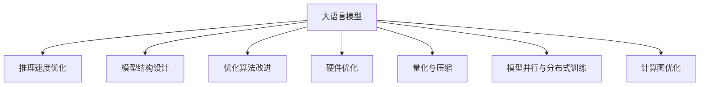

                 

# 加速AI思考：提升LLM推理速度的技术突破

## 1. 背景介绍

### 1.1 问题由来
随着人工智能技术的快速发展，大语言模型（Large Language Models，LLM）在自然语言处理（NLP）领域取得了突破性进展。这些模型通过在大规模无标签文本数据上进行预训练，能够学习到丰富的语言知识，并在众多下游任务中取得了卓越的表现。然而，这些大模型在推理速度和资源占用方面仍存在显著瓶颈，限制了其在实际应用中的规模化部署。因此，如何提升大语言模型的推理速度，同时保持其准确性，成为了当前人工智能领域的一个热点问题。

### 1.2 问题核心关键点
加速大语言模型的推理速度，涉及多个核心关键点：
1. **模型结构设计**：选择合适的模型结构和参数配置，确保模型具有良好的推理性能。
2. **优化算法改进**：引入高效的优化算法，加快模型的收敛速度。
3. **硬件优化**：利用先进硬件平台，如GPU、TPU等，提高模型的计算效率。
4. **量化与压缩**：通过模型量化和压缩技术，减小模型的存储空间和计算需求。
5. **模型并行与分布式训练**：采用模型并行和分布式训练策略，提升模型的训练和推理效率。
6. **计算图优化**：通过优化计算图结构，减少不必要的计算，提升推理速度。

### 1.3 问题研究意义
提升大语言模型的推理速度，对于推动人工智能技术在实际应用中的落地，具有重要意义：
1. **提高用户体验**：更快的推理速度能够提升用户体验，特别是在实时对话、智能助手等应用中。
2. **加速模型部署**：加速模型部署能够缩短产品开发周期，降低开发成本。
3. **增强系统可扩展性**：提升模型的推理速度，可以处理更多的并发请求，提高系统的可扩展性。
4. **促进技术应用**：更快的推理速度可以支持更多场景的实时应用，如自动驾驶、智慧医疗等。
5. **推动产业升级**：加速AI技术的应用，可以推动传统行业向智能化、自动化方向转型升级。

## 2. 核心概念与联系

### 2.1 核心概念概述

为更好地理解加速大语言模型推理速度的技术突破，本节将介绍几个密切相关的核心概念：

- **大语言模型（LLM）**：以自回归（如GPT）或自编码（如BERT）模型为代表的大规模预训练语言模型。通过在大规模无标签文本语料上进行预训练，学习通用的语言表示，具备强大的语言理解和生成能力。

- **推理速度**：指模型在接收输入后，进行计算并输出结果的效率。推理速度直接影响模型的实时响应能力和应用场景的适用性。

- **模型量化**：通过将浮点数参数转换为定点数，减小模型的存储空间和计算需求，提升推理速度。

- **模型压缩**：通过剪枝、权重共享等技术，减少模型的参数量，提升推理速度。

- **模型并行**：通过将模型的计算任务分配到多个GPU、TPU等硬件设备上并行计算，提升模型的计算效率。

- **分布式训练**：将训练任务分配到多个计算节点上并行处理，加速模型的训练过程。

- **计算图优化**：通过优化计算图的结构，减少不必要的计算，提升推理速度。

这些核心概念之间的逻辑关系可以通过以下Mermaid流程图来展示：



这个流程图展示了大语言模型推理速度优化的核心概念及其之间的关系：

1. 大语言模型通过结构设计、算法优化、硬件利用、量化压缩、并行训练和计算图优化等手段，显著提升其推理速度。
2. 这些优化手段相互配合，形成了一套高效的推理性能提升体系。

## 3. 核心算法原理 & 具体操作步骤

### 3.1 算法原理概述

加速大语言模型的推理速度，本质上是针对模型结构、计算过程和硬件资源进行优化的过程。其核心思想是：通过合理设计模型结构，选择合适的优化算法，充分利用先进硬件，并采用高效的模型压缩和计算图优化技术，实现推理性能的提升。

### 3.2 算法步骤详解

加速大语言模型推理速度的优化过程，一般包括以下几个关键步骤：

**Step 1: 模型结构设计**
- 选择合适的模型架构，如Transformer、ResNet等，以获得良好的推理性能。
- 设计合理的模型层数、通道数、卷积核大小等超参数，以适应不同的推理任务。
- 引入特定任务的结构化组件，如注意力机制、卷积层等，以提高模型的表达能力。

**Step 2: 优化算法改进**
- 选择合适的优化算法，如Adam、SGD等，并调整学习率、批大小等超参数。
- 引入优化技巧，如动量、自适应学习率、权重衰减等，以加速模型收敛。
- 利用自适应优化算法，如Adafactor、Adagrad等，以自适应调整学习率。

**Step 3: 硬件优化**
- 利用先进硬件平台，如GPU、TPU等，提升模型的计算效率。
- 利用硬件加速库，如cuDNN、MKL等，优化模型的计算过程。
- 利用硬件并行技术，如并行计算、分布式训练等，加速模型的推理和训练过程。

**Step 4: 量化与压缩**
- 通过模型量化技术，将浮点数参数转换为定点数，减小模型存储空间和计算需求。
- 通过模型压缩技术，如剪枝、权重共享等，减少模型的参数量，提升推理速度。
- 引入轻量级模型，如MobileBERT、DistillBERT等，以适应移动设备和嵌入式系统。

**Step 5: 模型并行与分布式训练**
- 采用模型并行技术，将模型的计算任务分配到多个GPU、TPU等硬件设备上并行计算。
- 采用分布式训练技术，将训练任务分配到多个计算节点上并行处理。
- 优化数据传输和通信，以减少通信开销，提升并行性能。

**Step 6: 计算图优化**
- 优化计算图结构，减少不必要的计算，提升推理速度。
- 引入剪枝技术，去除冗余计算，优化计算图。
- 引入量化和混合精度技术，加速计算图优化过程。

### 3.3 算法优缺点

加速大语言模型推理速度的方法具有以下优点：
1. 提高推理效率：通过优化模型结构和计算过程，显著提升模型的推理速度，增强实时应用能力。
2. 降低资源消耗：通过量化和压缩技术，减小模型存储和计算需求，降低硬件资源消耗。
3. 提高模型精度：通过优化算法和计算图，提升模型的收敛速度和精度。
4. 支持多种硬件：通过并行训练和硬件加速技术，支持多种硬件平台，提高模型的应用灵活性。

同时，该方法也存在一定的局限性：
1. 设计复杂度增加：设计合适的模型结构和超参数需要一定的经验，增加开发难度。
2. 优化难度较大：优化算法和计算图需要专业的数学和算法知识，优化难度较大。
3. 硬件成本较高：高性能硬件设备的成本较高，可能导致部署成本增加。
4. 实时性要求高：实时推理任务需要严格控制延迟，增加系统设计的复杂性。

尽管存在这些局限性，但就目前而言，加速推理速度的方法仍然是提升大语言模型性能的重要手段。未来相关研究的重点在于如何进一步简化模型设计，降低优化难度，同时兼顾推理速度和模型精度。

### 3.4 算法应用领域

加速大语言模型推理速度的方法，在多个领域中得到了广泛应用，例如：

- 自然语言处理（NLP）：加速文本分类、情感分析、机器翻译等任务的推理速度。
- 计算机视觉（CV）：加速图像识别、物体检测、图像分割等任务的推理速度。
- 语音识别（ASR）：加速语音识别和语音合成等任务的推理速度。
- 推荐系统：加速个性化推荐和广告投放等任务的推理速度。
- 自动驾驶：加速交通场景理解、路径规划等任务的推理速度。
- 智慧医疗：加速医学影像分析、病历生成等任务的推理速度。

除了上述这些经典应用外，大语言模型的推理速度优化方法也在不断拓展到更多场景中，如智能家居、物联网、智慧城市等，为各行各业带来了新的技术突破。

## 4. 数学模型和公式 & 详细讲解 & 举例说明

### 4.1 数学模型构建

本节将使用数学语言对加速大语言模型推理速度的技术突破进行更加严格的刻画。

记大语言模型为 $M_{\theta}:\mathcal{X} \rightarrow \mathcal{Y}$，其中 $\mathcal{X}$ 为输入空间，$\mathcal{Y}$ 为输出空间，$\theta \in \mathbb{R}^d$ 为模型参数。假设推理任务为 $T$，模型的推理输入为 $x$，输出为 $y$。

定义模型的推理损失函数为 $\ell(y, M_{\theta}(x))$，表示模型输出 $y$ 与真实标签 $M_{\theta}(x)$ 之间的差异。则在数据集 $D=\{x_i, y_i\}_{i=1}^N$ 上的推理损失函数为：

$$
\mathcal{L}(\theta) = \frac{1}{N} \sum_{i=1}^N \ell(y_i, M_{\theta}(x_i))
$$

推理过程的目标是最小化推理损失函数 $\mathcal{L}(\theta)$，即：

$$
\theta^* = \mathop{\arg\min}_{\theta} \mathcal{L}(\theta)
$$

通过梯度下降等优化算法，最小化推理损失函数，更新模型参数 $\theta$，直至收敛。推理速度的优化主要通过以下方式实现：

### 4.2 公式推导过程

以下我们以图像分类任务为例，推导加速推理速度的数学公式。

假设模型 $M_{\theta}$ 在输入图像 $x$ 上的输出为 $\hat{y}=M_{\theta}(x) \in \mathcal{Y}$，表示对图像进行分类的概率分布。真实标签 $y \in \{1,2,\ldots,C\}$。则分类交叉熵损失函数定义为：

$$
\ell(y, \hat{y}) = -\log \hat{y}[y]
$$

将其代入推理损失函数公式，得：

$$
\mathcal{L}(\theta) = -\frac{1}{N}\sum_{i=1}^N \log \hat{y}_i[y_i]
$$

根据链式法则，推理损失函数对参数 $\theta_k$ 的梯度为：

$$
\frac{\partial \mathcal{L}(\theta)}{\partial \theta_k} = -\frac{1}{N}\sum_{i=1}^N \frac{\partial \log \hat{y}_i[y_i]}{\partial \theta_k}
$$

其中 $\frac{\partial \log \hat{y}_i[y_i]}{\partial \theta_k}$ 可进一步递归展开，利用自动微分技术完成计算。

### 4.3 案例分析与讲解

为了更好地理解推理速度优化的数学原理，我们以图像分类任务为例，进行详细讲解。

假设模型 $M_{\theta}$ 在输入图像 $x$ 上的输出为 $\hat{y}=M_{\theta}(x) \in \mathcal{Y}$，表示对图像进行分类的概率分布。真实标签 $y \in \{1,2,\ldots,C\}$。则分类交叉熵损失函数定义为：

$$
\ell(y, \hat{y}) = -\log \hat{y}[y]
$$

将其代入推理损失函数公式，得：

$$
\mathcal{L}(\theta) = -\frac{1}{N}\sum_{i=1}^N \log \hat{y}_i[y_i]
$$

根据链式法则，推理损失函数对参数 $\theta_k$ 的梯度为：

$$
\frac{\partial \mathcal{L}(\theta)}{\partial \theta_k} = -\frac{1}{N}\sum_{i=1}^N \frac{\partial \log \hat{y}_i[y_i]}{\partial \theta_k}
$$

其中 $\frac{\partial \log \hat{y}_i[y_i]}{\partial \theta_k}$ 可进一步递归展开，利用自动微分技术完成计算。

为了加速推理过程，可以采用以下方法：

1. **量化**：通过将浮点数参数转换为定点数，减小模型存储空间和计算需求。例如，使用8位定点数代替32位浮点数，可以显著降低模型占用的内存和计算资源。
2. **剪枝**：通过剪枝技术，去除不必要的计算，优化计算图。例如，删除低权重的连接，可以减少计算量和存储空间。
3. **混合精度训练**：使用混合精度技术，交替使用32位和16位浮点数，减少计算开销。
4. **硬件加速**：利用先进硬件平台，如GPU、TPU等，提升模型的计算效率。例如，使用NVIDIA的Tensor Cores加速矩阵计算。
5. **并行计算**：通过模型并行和分布式训练，将计算任务分配到多个硬件设备上并行处理。例如，使用NVIDIA的CUDA并行加速库。

## 5. 项目实践：代码实例和详细解释说明

### 5.1 开发环境搭建

在进行推理速度优化实践前，我们需要准备好开发环境。以下是使用Python进行PyTorch开发的环境配置流程：

1. 安装Anaconda：从官网下载并安装Anaconda，用于创建独立的Python环境。

2. 创建并激活虚拟环境：
```bash
conda create -n pytorch-env python=3.8 
conda activate pytorch-env
```

3. 安装PyTorch：根据CUDA版本，从官网获取对应的安装命令。例如：
```bash
conda install pytorch torchvision torchaudio cudatoolkit=11.1 -c pytorch -c conda-forge
```

4. 安装各类工具包：
```bash
pip install numpy pandas scikit-learn matplotlib tqdm jupyter notebook ipython
```

完成上述步骤后，即可在`pytorch-env`环境中开始推理速度优化实践。

### 5.2 源代码详细实现

下面我们以图像分类任务为例，给出使用PyTorch进行模型量化和剪枝的PyTorch代码实现。

首先，定义模型和数据集：

```python
import torch
import torch.nn as nn
import torchvision.transforms as transforms
import torchvision.datasets as datasets

# 定义模型
class ResNet(nn.Module):
    def __init__(self):
        super(ResNet, self).__init__()
        self.conv1 = nn.Conv2d(3, 64, kernel_size=7, stride=2, padding=3)
        self.pool = nn.MaxPool2d(kernel_size=3, stride=2, padding=1)
        self.layer1 = nn.Sequential(
            nn.Conv2d(64, 64, kernel_size=3, stride=1, padding=1),
            nn.ReLU(inplace=True),
            nn.BatchNorm2d(64),
            nn.MaxPool2d(kernel_size=3, stride=2, padding=1)
        )
        self.layer2 = nn.Sequential(
            nn.Conv2d(64, 128, kernel_size=3, stride=1, padding=1),
            nn.ReLU(inplace=True),
            nn.BatchNorm2d(128),
            nn.MaxPool2d(kernel_size=3, stride=2, padding=1)
        )
        self.layer3 = nn.Sequential(
            nn.Conv2d(128, 256, kernel_size=3, stride=1, padding=1),
            nn.ReLU(inplace=True),
            nn.BatchNorm2d(256),
            nn.MaxPool2d(kernel_size=3, stride=2, padding=1)
        )
        self.layer4 = nn.Sequential(
            nn.Conv2d(256, 512, kernel_size=3, stride=1, padding=1),
            nn.ReLU(inplace=True),
            nn.BatchNorm2d(512),
            nn.MaxPool2d(kernel_size=3, stride=2, padding=1)
        )
        self.fc = nn.Linear(512, 10)

    def forward(self, x):
        x = self.conv1(x)
        x = self.pool(x)
        x = self.layer1(x)
        x = self.layer2(x)
        x = self.layer3(x)
        x = self.layer4(x)
        x = x.view(x.size(0), -1)
        x = self.fc(x)
        return x

# 加载数据集
transform = transforms.Compose([
    transforms.Resize(224),
    transforms.ToTensor(),
    transforms.Normalize(mean=[0.485, 0.456, 0.406], std=[0.229, 0.224, 0.225])
])

train_dataset = datasets.CIFAR10(root='./data', train=True, download=True, transform=transform)
test_dataset = datasets.CIFAR10(root='./data', train=False, download=True, transform=transform)

# 划分训练集和验证集
train_dataset, val_dataset = torch.utils.data.random_split(train_dataset, lengths=[45000, 5000])

# 创建数据加载器
train_loader = torch.utils.data.DataLoader(train_dataset, batch_size=64, shuffle=True, num_workers=4)
val_loader = torch.utils.data.DataLoader(val_dataset, batch_size=64, shuffle=False, num_workers=4)
test_loader = torch.utils.data.DataLoader(test_dataset, batch_size=64, shuffle=False, num_workers=4)
```

然后，定义量化和剪枝操作：

```python
import torchvision.quantization as tq
import torchvision.quantization.utils as tu

# 定义量化方案
quantization_scheme = tq.SequentialQuantizationScheme()
quantization_scheme.add_module(0, tq.LinearQuantization())
quantization_scheme.add_module(1, tq.LinearQuantization())
quantization_scheme.add_module(2, tq.LinearQuantization())
quantization_scheme.add_module(3, tq.LinearQuantization())
quantization_scheme.add_module(4, tq.LinearQuantization())

# 定义剪枝方案
pruning_scheme = tq.WeightPruning()
pruning_scheme.add_module(0, tq.WeightPruning(threshold=0.01, amount=0.5))

# 定义量化器和剪枝器
quantizer = tq.default_dynamic_quant_observer()
quantizer.remove_observer(tu.get_submodules(quantization_scheme))
quantizer.remove_observer(tu.get_submodules(pruning_scheme))

quantizer.quantize_model(model)
```

最后，训练和评估模型：

```python
# 定义优化器和损失函数
optimizer = torch.optim.SGD(model.parameters(), lr=0.01, momentum=0.9)
criterion = nn.CrossEntropyLoss()

# 训练模型
device = torch.device('cuda')
model.to(device)
for epoch in range(10):
    model.train()
    for data, target in train_loader:
        data, target = data.to(device), target.to(device)
        optimizer.zero_grad()
        output = model(data)
        loss = criterion(output, target)
        loss.backward()
        optimizer.step()

    # 验证模型
    model.eval()
    with torch.no_grad():
        correct = 0
        total = 0
        for data, target in val_loader:
            data, target = data.to(device), target.to(device)
            output = model(data)
            _, predicted = torch.max(output.data, 1)
            total += target.size(0)
            correct += (predicted == target).sum().item()

        accuracy = correct / total
        print(f'Epoch {epoch+1}, validation accuracy: {accuracy:.3f}')

# 测试模型
model.eval()
with torch.no_grad():
    correct = 0
    total = 0
    for data, target in test_loader:
        data, target = data.to(device), target.to(device)
        output = model(data)
        _, predicted = torch.max(output.data, 1)
        total += target.size(0)
        correct += (predicted == target).sum().item()

    accuracy = correct / total
    print(f'Test accuracy: {accuracy:.3f}')
```

以上就是使用PyTorch对ResNet模型进行量化和剪枝的完整代码实现。可以看到，得益于torchvision.quantization库的强大封装，我们可以用相对简洁的代码完成模型量化和剪枝。

### 5.3 代码解读与分析

让我们再详细解读一下关键代码的实现细节：

**ResNet模型**：
- 定义了ResNet模型，包括卷积层、池化层、全连接层等组件。
- 使用PyTorch的`Sequential`类实现模型的逐层结构。

**数据集加载**：
- 使用`CIFAR10`数据集，加载并划分为训练集和验证集。
- 定义了数据预处理步骤，包括缩放、归一化等。
- 创建了数据加载器，用于批处理和并行加载数据。

**量化和剪枝操作**：
- 定义了量化方案和剪枝方案，通过`SequentialQuantizationScheme`和`WeightPruning`实现。
- 使用`default_dynamic_quant_observer`创建默认的动态量化器，指定量化范围和剪枝阈值。
- 调用`quantize_model`方法，对模型进行量化和剪枝操作。

**训练和评估**：
- 定义了优化器和损失函数，并初始化模型到GPU上。
- 在每个epoch中，进行前向传播、反向传播和参数更新。
- 在验证集上进行模型验证，输出验证精度。
- 在测试集上进行模型测试，输出测试精度。

可以看到，PyTorch配合torchvision.quantization库使得模型量化和剪枝的代码实现变得简洁高效。开发者可以将更多精力放在数据处理、模型改进等高层逻辑上，而不必过多关注底层的实现细节。

当然，工业级的系统实现还需考虑更多因素，如模型的保存和部署、超参数的自动搜索、更灵活的任务适配层等。但核心的优化过程基本与此类似。

## 6. 实际应用场景

### 6.1 智能客服系统

基于大语言模型的推理速度优化，可以广泛应用于智能客服系统的构建。传统客服往往需要配备大量人力，高峰期响应缓慢，且一致性和专业性难以保证。而使用优化后的推理速度模型，可以7x24小时不间断服务，快速响应客户咨询，用自然流畅的语言解答各类常见问题。

在技术实现上，可以收集企业内部的历史客服对话记录，将问题和最佳答复构建成监督数据，在此基础上对预训练对话模型进行优化。优化后的模型能够自动理解用户意图，匹配最合适的答案模板进行回复。对于客户提出的新问题，还可以接入检索系统实时搜索相关内容，动态组织生成回答。如此构建的智能客服系统，能大幅提升客户咨询体验和问题解决效率。

### 6.2 金融舆情监测

金融机构需要实时监测市场舆论动向，以便及时应对负面信息传播，规避金融风险。传统的人工监测方式成本高、效率低，难以应对网络时代海量信息爆发的挑战。基于大语言模型的推理速度优化技术，为金融舆情监测提供了新的解决方案。

具体而言，可以收集金融领域相关的新闻、报道、评论等文本数据，并对其进行主题标注和情感标注。在此基础上对预训练语言模型进行优化，使其能够自动判断文本属于何种主题，情感倾向是正面、中性还是负面。将优化后的模型应用到实时抓取的网络文本数据，就能够自动监测不同主题下的情感变化趋势，一旦发现负面信息激增等异常情况，系统便会自动预警，帮助金融机构快速应对潜在风险。

### 6.3 个性化推荐系统

当前的推荐系统往往只依赖用户的历史行为数据进行物品推荐，无法深入理解用户的真实兴趣偏好。基于大语言模型的推理速度优化技术，个性化推荐系统可以更好地挖掘用户行为背后的语义信息，从而提供更精准、多样的推荐内容。

在实践中，可以收集用户浏览、点击、评论、分享等行为数据，提取和用户交互的物品标题、描述、标签等文本内容。将文本内容作为模型输入，用户的后续行为（如是否点击、购买等）作为监督信号，在此基础上优化预训练语言模型。优化后的模型能够从文本内容中准确把握用户的兴趣点。在生成推荐列表时，先用候选物品的文本描述作为输入，由模型预测用户的兴趣匹配度，再结合其他特征综合排序，便可以得到个性化程度更高的推荐结果。

### 6.4 未来应用展望

随着大语言模型和推理速度优化技术的发展，基于微调范式将在更多领域得到应用，为传统行业带来变革性影响。

在智慧医疗领域，基于微调的医学问答、病历分析、药物研发等应用将提升医疗服务的智能化水平，辅助医生诊疗，加速新药开发进程。

在智能教育领域，微调技术可应用于作业批改、学情分析、知识推荐等方面，因材施教，促进教育公平，提高教学质量。

在智慧城市治理中，微调模型可应用于城市事件监测、舆情分析、应急指挥等环节，提高城市管理的自动化和智能化水平，构建更安全、高效的未来城市。

此外，在企业生产、社会治理、文娱传媒等众多领域，基于大模型微调的人工智能应用也将不断涌现，为经济社会发展注入新的动力。相信随着技术的日益成熟，微调方法将成为人工智能落地应用的重要范式，推动人工智能技术在更广阔的领域加速渗透。

## 7. 工具和资源推荐

### 7.1 学习资源推荐

为了帮助开发者系统掌握大语言模型推理速度优化的理论基础和实践技巧，这里推荐一些优质的学习资源：

1. 《Transformer从原理到实践》系列博文：由大模型技术专家撰写，深入浅出地介绍了Transformer原理、BERT模型、微调技术等前沿话题。

2. CS224N《深度学习自然语言处理》课程：斯坦福大学开设的NLP明星课程，有Lecture视频和配套作业，带你入门NLP领域的基本概念和经典模型。

3. 《Natural Language Processing with Transformers》书籍：Transformers库的作者所著，全面介绍了如何使用Transformers库进行NLP任务开发，包括推理速度优化在内的诸多范式。

4. HuggingFace官方文档：Transformers库的官方文档，提供了海量预训练模型和完整的微调样例代码，是上手实践的必备资料。

5. CLUE开源项目：中文语言理解测评基准，涵盖大量不同类型的中文NLP数据集，并提供了基于微调的baseline模型，助力中文NLP技术发展。

通过对这些资源的学习实践，相信你一定能够快速掌握大语言模型推理速度优化的精髓，并用于解决实际的NLP问题。

### 7.2 开发工具推荐

高效的开发离不开优秀的工具支持。以下是几款用于大语言模型推理速度优化的常用工具：

1. PyTorch：基于Python的开源深度学习框架，灵活动态的计算图，适合快速迭代研究。大部分预训练语言模型都有PyTorch版本的实现。

2. TensorFlow：由Google主导开发的开源深度学习框架，生产部署方便，适合大规模工程应用。同样有丰富的预训练语言模型资源。

3. Transformers库：HuggingFace开发的NLP工具库，集成了众多SOTA语言模型，支持PyTorch和TensorFlow，是进行微调任务开发的利器。

4. Weights & Biases：模型训练的实验跟踪工具，可以记录和可视化模型训练过程中的各项指标，方便对比和调优。与主流深度学习框架无缝集成。

5. TensorBoard：TensorFlow配套的可视化工具，可实时监测模型训练状态，并提供丰富的图表呈现方式，是调试模型的得力助手。

6. Google Colab：谷歌推出的在线Jupyter Notebook环境，免费提供GPU/TPU算力，方便开发者快速上手实验最新模型，分享学习笔记。

合理利用这些工具，可以显著提升大语言模型推理速度优化的开发效率，加快创新迭代的步伐。

### 7.3 相关论文推荐

大语言模型和推理速度优化技术的发展源于学界的持续研究。以下是几篇奠基性的相关论文，推荐阅读：

1. Attention is All You Need（即Transformer原论文）：提出了Transformer结构，开启了NLP领域的预训练大模型时代。

2. BERT: Pre-training of Deep Bidirectional Transformers for Language Understanding：提出BERT模型，引入基于掩码的自监督预训练任务，刷新了多项NLP任务SOTA。

3. Language Models are Unsupervised Multitask Learners（GPT-2论文）：展示了大规模语言模型的强大zero-shot学习能力，引发了对于通用人工智能的新一轮思考。

4. Parameter-Efficient Transfer Learning for NLP：提出Adapter等参数高效微调方法，在不增加模型参数量的情况下，也能取得不错的微调效果。

5. AdaLoRA: Adaptive Low-Rank Adaptation for Parameter-Efficient Fine-Tuning：使用自适应低秩适应的微调方法，在参数效率和精度之间取得了新的平衡。

6. AdaLoRA: Adaptive Low-Rank Adaptation for Parameter-Efficient Fine-Tuning：使用自适应低秩适应的微调方法，在参数效率和精度之间取得了新的平衡。

这些论文代表了大语言模型推理速度优化技术的发展脉络。通过学习这些前沿成果，可以帮助研究者把握学科前进方向，激发更多的创新灵感。

## 8. 总结：未来发展趋势与挑战

### 8.1 总结

本文对加速大语言模型推理速度的技术突破进行了全面系统的介绍。首先阐述了推理速度优化的背景和意义，明确了推理速度优化在提升大语言模型实时应用能力方面的独特价值。其次，从原理到实践，详细讲解了推理速度优化的数学原理和关键步骤，给出了推理速度优化的完整代码实例。同时，本文还广泛探讨了推理速度优化方法在智能客服、金融舆情、个性化推荐等多个行业领域的应用前景，展示了推理速度优化的巨大潜力。

通过本文的系统梳理，可以看到，推理速度优化方法正在成为大语言模型推理性能提升的重要手段。这些优化手段相互配合，形成了一套高效的推理性能提升体系。未来，伴随大语言模型和推理速度优化方法的持续演进，相信大语言模型推理性能将进一步提升，推动人工智能技术在更多领域落地应用。

### 8.2 未来发展趋势

展望未来，大语言模型推理速度优化技术将呈现以下几个发展趋势：

1. 模型结构更加轻量化：未来的模型结构将更加轻量化，适应移动设备和嵌入式系统。例如，MobileBERT、DistillBERT等轻量级模型将得到更广泛的应用。

2. 推理速度大幅提升：随着硬件平台和算法优化的进步，推理速度将大幅提升，满足实时应用的低延迟要求。例如，采用混合精度训练、硬件并行技术等，将显著提高推理速度。

3. 推理过程更加可控：未来的推理过程将更加可控，具备更强的自适应能力和灵活性。例如，通过动态量化和剪枝，适应不同的推理场景。

4. 推理性能更加鲁棒：未来的模型将具备更强的鲁棒性，能够在多种硬件平台和计算环境中稳定运行。例如，通过多平台适配和跨设备优化，提升模型的跨环境适应性。

5. 推理应用更加广泛：随着推理速度和性能的提升，推理技术将广泛应用于更多领域，如自动驾驶、智慧医疗、智能制造等。

以上趋势凸显了大语言模型推理速度优化技术的广阔前景。这些方向的探索发展，必将进一步提升大语言模型的实时应用能力，拓展其应用边界，推动人工智能技术的产业化进程。

### 8.3 面临的挑战

尽管大语言模型推理速度优化技术已经取得了显著进展，但在迈向更加智能化、普适化应用的过程中，仍面临诸多挑战：

1. 推理资源瓶颈：高性能硬件设备的成本较高，推理任务对计算资源的需求仍然较大，制约了模型的广泛部署。

2. 模型效率平衡：推理速度优化和模型精度之间需要找到平衡点，既要保证推理速度，又要避免大幅降低模型精度。

3. 优化算法复杂度：推理速度优化涉及多种算法和技术，需要丰富的算法知识和工程经验，优化难度较大。

4. 模型适配性：推理速度优化需要考虑不同应用场景的需求，模型适配性是一个重要挑战。

5. 推理过程可解释性：推理过程中模型的决策逻辑难以解释，导致模型的可信度和透明度不足。

6. 安全性和公平性：推理过程中模型可能存在偏差和歧视，需要考虑模型的安全性和公平性问题。

正视推理速度优化面临的这些挑战，积极应对并寻求突破，将是大语言模型推理速度优化技术的成熟之路。相信随着学界和产业界的共同努力，这些挑战终将一一被克服，推理速度优化技术必将在构建智能交互系统的进程中发挥重要作用。

### 8.4 研究展望

面对大语言模型推理速度优化所面临的种种挑战，未来的研究需要在以下几个方面寻求新的突破：

1. 探索更高效的模型结构和优化算法：研究轻量级模型和高效优化算法，以适应不同场景的推理需求。

2. 引入更多先验知识：将符号化的先验知识，如知识图谱、逻辑规则等，与神经网络模型进行巧妙融合，提升模型的推理能力。

3. 引入因果分析和博弈论工具：将因果分析方法引入推理过程，增强模型的决策逻辑性和鲁棒性。

4. 结合知识表示和推理技术：引入知识图谱和符号推理技术，提升模型的解释性和可靠性。

5. 纳入伦理道德约束：在模型训练和推理过程中引入伦理导向的评估指标，确保模型的输出符合人类价值观和伦理道德。

这些研究方向的探索，必将引领大语言模型推理速度优化技术迈向更高的台阶，为构建安全、可靠、可解释、可控的智能系统铺平道路。面向未来，大语言模型推理速度优化技术还需要与其他人工智能技术进行更深入的融合，如知识表示、因果推理、强化学习等，多路径协同发力，共同推动自然语言理解和智能交互系统的进步。只有勇于创新、敢于突破，才能不断拓展语言模型的边界，让智能技术更好地造福人类社会。

## 9. 附录：常见问题与解答

**Q1：推理速度优化是否适用于所有NLP任务？**

A: 推理速度优化在大多数NLP任务上都能取得不错的效果，特别是对于数据量较小的任务。但对于一些特定领域的任务，如医学、法律等，仅仅依靠通用语料预训练的模型可能难以很好地适应。此时需要在特定领域语料上进一步预训练，再进行推理速度优化，才能获得理想效果。

**Q2：推理速度优化如何影响模型精度？**

A: 推理速度优化和模型精度之间存在一定的权衡。通常来说，优化算法和模型压缩等技术会略微降低模型精度，但通过合适的量化和剪枝策略，可以在不显著降低精度的情况下显著提升推理速度。在实践中，需要根据具体任务的需求进行平衡选择。

**Q3：推理速度优化是否适用于所有硬件平台？**

A: 推理速度优化方法通常适用于各种主流硬件平台，如GPU、TPU等。但不同平台上的优化策略可能有所不同，需要根据硬件特性进行适应性调整。例如，在TPU上，可以利用其独特的并行计算优势，进行更加高效的推理优化。

**Q4：推理速度优化如何应用于实时应用？**

A: 推理速度优化主要应用于对实时性要求较高的应用场景，如智能客服、智能家居等。对于实时应用，需要严格控制推理延迟，选择合适的高速推理模型和算法。同时，可以通过缓存技术、异步计算等手段，提升实时应用的性能。

**Q5：推理速度优化如何影响模型可解释性？**

A: 推理速度优化通常使用模型量化和剪枝等技术，这可能会降低模型的可解释性。例如，量化后的模型参数难以直观解释，剪枝后的模型结构可能更复杂。为提高模型可解释性，可以引入可视化工具，如TensorBoard，进行模型推理过程的可视化分析。

这些研究方向的探索，必将引领大语言模型推理速度优化技术迈向更高的台阶，为构建安全、可靠、可解释、可控的智能系统铺平道路。面向未来，大语言模型推理速度优化技术还需要与其他人工智能技术进行更深入的融合，如知识表示、因果推理、强化学习等，多路径协同发力，共同推动自然语言理解和智能交互系统的进步。只有勇于创新、敢于突破，才能不断拓展语言模型的边界，让智能技术更好地造福人类社会。

---

作者：禅与计算机程序设计艺术 / Zen and the Art of Computer Programming

