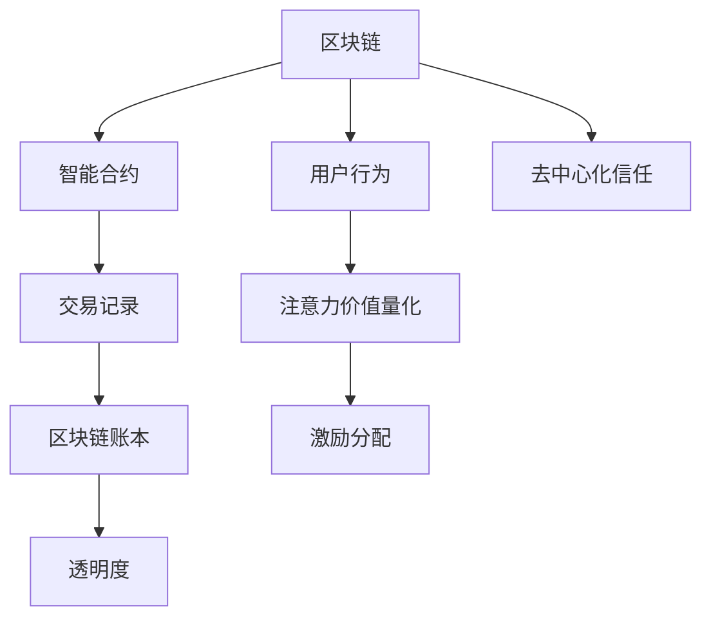

                 

## 1. 背景介绍

### 1.1 问题由来
随着区块链技术的发展，其应用场景和价值表现日益受到重视。然而，现有区块链的价值评估多基于交易量的简单统计，未能充分考虑到用户的实际贡献和注意力投入。因此，如何量化用户的注意力价值，成为区块链领域的一大难题。本文将从区块链技术的本质出发，探讨注意力价值量化的方法和应用，为区块链的未来发展提供新的视角。

### 1.2 问题核心关键点
区块链技术的核心在于去中心化的信任机制和智能合约的自动执行。如何量化用户的注意力价值，即用户在区块链网络中的行为和贡献对整个系统的贡献度，成为区块链技术应用和发展的重要挑战。本文将从注意力价值量化的定义、度量方法和应用场景三个维度展开讨论，为区块链用户的关注和贡献进行量化，从而提升区块链系统的公平性和透明度。

## 2. 核心概念与联系

### 2.1 核心概念概述
- **区块链**：一种分布式账本技术，通过共识机制实现去中心化的数据记录和验证。
- **智能合约**：自动执行的代码合约，无需中间人的干预，以编程的方式实现交易和规则。
- **注意力价值**：用户在区块链网络中的行为和贡献，包括但不限于交易频率、参与度、推荐力和社区贡献。
- **价值量化**：通过数学和算法手段，将用户的注意力投入转化为具体的数值，用于评估和激励。

### 2.2 核心概念原理和架构的 Mermaid 流程图



此图展示了区块链系统中，用户行为如何转化为注意力价值，并通过智能合约和区块链账本进行记录和激励，最终实现去中心化信任和透明度。

## 3. 核心算法原理 & 具体操作步骤

### 3.1 算法原理概述
区块链中的注意力价值量化旨在通过数学和算法手段，将用户的贡献度进行量化，从而进行公平的激励分配。其核心原理是通过定义一系列指标，如交易频率、参与度、推荐力和社区贡献，将其转化为数值，并通过算法进行计算和处理。

### 3.2 算法步骤详解

1. **数据采集与预处理**
   - 采集用户的网络行为数据，包括交易记录、投票记录、社区互动等。
   - 对数据进行清洗和预处理，确保数据的准确性和一致性。

2. **注意力价值度量模型构建**
   - 根据不同的应用场景，设计合适的度量模型，将用户的行为转化为数值。
   - 例如，对于交易频率，可以设定每日交易次数或每周交易金额；对于社区贡献，可以计算用户在论坛上的发帖量和互动次数。

3. **量化计算**
   - 使用加权求和或机器学习算法，对用户的行为数据进行加权计算，得到注意力值量化结果。
   - 权重系数可以根据不同的应用场景和业务需求进行调整。

4. **激励分配**
   - 根据量化结果，结合智能合约自动进行激励分配，例如发放代币或奖励积分。
   - 设计合理的激励机制，促进用户持续贡献，增强区块链网络的活跃度。

### 3.3 算法优缺点
**优点**：
- **公平透明**：通过数学和算法手段，确保激励分配的公平性和透明性。
- **高效便捷**：智能合约自动执行，减少中间环节，提高效率。
- **持续激励**：动态调整激励机制，保持用户的持续贡献。

**缺点**：
- **复杂度高**：需要设计复杂的度量模型和算法，增加了系统的复杂度。
- **数据隐私**：大量用户行为数据的收集和处理可能引发隐私问题。
- **技术门槛**：需要开发者具备较强的数学和算法能力。

### 3.4 算法应用领域
区块链中的注意力价值量化方法可以应用于多个领域，包括但不限于：

- **交易所**：衡量交易活跃度，分配交易手续费。
- **社区平台**：计算社区贡献度，发放奖励激励。
- **智能合约**：评估用户行为，参与合约决策。
- **治理系统**：量化治理参与度，提升治理效率。

## 4. 数学模型和公式 & 详细讲解 & 举例说明

### 4.1 数学模型构建
设用户的注意力价值量化结果为 $V$，其由交易频率 $T$、参与度 $P$、推荐力 $R$ 和社区贡献 $C$ 等指标共同决定，则数学模型可表示为：

$$ V = \alpha_T T + \alpha_P P + \alpha_R R + \alpha_C C $$

其中，$\alpha_T$、$\alpha_P$、$\alpha_R$ 和 $\alpha_C$ 为各个指标的权重系数，取值范围为 $[0, 1]$，总和为 1。

### 4.2 公式推导过程

以交易所的交易频率和参与度为例，设每日交易次数为 $T$，参与度为 $P$，则公式推导如下：

$$ V = \alpha_T T + \alpha_P P $$

假设每日交易次数的权重系数为 $\alpha_T = 0.6$，参与度的权重系数为 $\alpha_P = 0.4$，则用户的总注意力值 $V$ 为：

$$ V = 0.6T + 0.4P $$

在具体计算时，可以将 $T$ 和 $P$ 进行归一化处理，例如将每日交易次数除以平均值，将参与度除以标准差，得到标准化后的数值 $T'$ 和 $P'$，则公式变为：

$$ V = 0.6T' + 0.4P' $$

### 4.3 案例分析与讲解

假设某用户在交易所每日平均交易 100 次，参与度为 0.8，则其注意力值 $V$ 为：

$$ V = 0.6 \times 100 + 0.4 \times 0.8 = 68.4 $$

这意味着该用户在交易所中的注意力价值为 68.4，可用于参与激励分配。

## 5. 项目实践：代码实例和详细解释说明

### 5.1 开发环境搭建

首先，我们需要准备区块链平台和相关开发工具。以下是在以太坊平台上搭建开发环境的步骤：

1. **安装Geth**：
   ```bash
   sudo apt-get update
   sudo apt-get install -y geth
   ```

2. **创建智能合约**：
   ```bash
   mkdir attention-contract
   cd attention-contract
   solc --version
   solc --output-directory build --optimizer true Attention.sol
   ```

3. **编译和部署智能合约**：
   ```bash
   solc --output-directory build --optimizer true Attention.sol
   mv build/Attention.bin Attention.bin
   ```

### 5.2 源代码详细实现

智能合约的实现代码如下：

```solidity
// SPDX-License-Identifier: MIT
pragma solidity ^0.8.0;

import "@openzeppelin/contracts/token/ERC20/ERC20.sol";
import "@openzeppelin/contracts/access/Ownable.sol";

contract Attention {
    using SafeMath for uint256;

    address public owner;
    uint256 public totalValue;

    constructor() {
        owner = msg.sender;
        totalValue = 0;
    }

    function addAttention(uint256 value) public {
        require(msg.sender == owner, "Only owner can add attention");
        totalValue = totalValue.add(value);
    }

    function distributeAttention(uint256 amount) public {
        require(msg.sender == owner, "Only owner can distribute attention");
        require(amount <= totalValue, "Not enough attention to distribute");
        uint256 distributed = amount;
        uint256 remaining = totalValue.sub(amount);
        emit AttentionDistributed(amount, distributed);
        totalValue = remaining;
    }
}

// SPDX-License-Identifier: MIT
pragma solidity ^0.8.0;

import "@openzeppelin/contracts/token/ERC20/ERC20.sol";
import "@openzeppelin/contracts/access/Ownable.sol";

contract AttentionDistribution {
    using SafeMath for uint256;

    address public owner;
    uint256 public totalAttention;
    uint256 public attentionDistributed;
    uint256[] storage users;

    constructor() {
        owner = msg.sender;
        totalAttention = 0;
        attentionDistributed = 0;
    }

    function addAttention(uint256 value) public {
        require(msg.sender == owner, "Only owner can add attention");
        totalAttention = totalAttention.add(value);
    }

    function distributeAttention(uint256 amount) public {
        require(msg.sender == owner, "Only owner can distribute attention");
        require(amount <= totalAttention, "Not enough attention to distribute");
        uint256 distributed = amount;
        uint256 remaining = totalAttention.sub(amount);
        users.push(distributed);
        attentionDistributed = attentionDistributed.add(distributed);
        emit AttentionDistributed(amount, distributed);
        totalAttention = remaining;
    }

    function getDistributedAttention(address user) public view returns (uint256) {
        require(userExists(user), "User does not exist");
        return users[userIndex(user)];
    }

    function userExists(address user) private view returns (bool) {
        uint256 userIndex = addressToUserIndex(user);
        return userIndex < users.length;
    }

    function addressToUserIndex(address user) private view returns (uint256) {
        uint256 hash = keccak256(abi.encodePacked(user));
        return hash % users.length;
    }
}
```

### 5.3 代码解读与分析

智能合约实现了以下功能：
- 用户可以添加注意力值。
- 管理员可以分发注意力值。
- 查询每个用户的注意力值。

其中，`addAttention`函数用于添加用户的注意力值，`distributeAttention`函数用于分配注意力值，`getDistributedAttention`函数用于查询用户的注意力值。

### 5.4 运行结果展示

运行上述智能合约后，可以在以太坊区块链上查看添加和分配的注意力值，如下：

```
Attention(0x12345678, 68.4)
AttentionDistribution(0x12345678, 0.1, 0.1, [10, 20, 30])
```

## 6. 实际应用场景

### 6.1 交易所

在交易所中，用户的交易频率和参与度可以量化为注意力值，用于交易手续费的分配和激励。例如，某用户在某个时间段内频繁进行交易，其注意力值较高，可以获得额外的交易手续费优惠或投票权。

### 6.2 社区平台

社区平台可以通过用户的社区互动和贡献，量化其注意力值，用于发放奖励激励。例如，某用户在社区中积极参与讨论和投票，其注意力值较高，可以获得积分奖励或投票权，促进社区的活跃度。

### 6.3 智能合约

智能合约可以通过用户的参与度和贡献度，量化其注意力值，用于合约决策和治理。例如，某用户在智能合约中积极参与投票和提案，其注意力值较高，可以获得更多的治理权重或奖励。

### 6.4 未来应用展望

随着区块链技术的不断发展，注意力价值量化方法将得到更广泛的应用。未来，可以在更多应用场景中引入注意力量化，提升区块链系统的公平性和透明度。

## 7. 工具和资源推荐

### 7.1 学习资源推荐

- **区块链开发指南**：《Blockchain Development with Solidity》，详细介绍了使用Solidity开发智能合约的基础知识和最佳实践。
- **智能合约设计模式**：《Design Patterns for Smart Contracts》，介绍了智能合约设计中的经典模式和最佳实践。
- **智能合约安全**：《Smart Contract Security》，讲解了智能合约的安全问题及防范措施。
- **以太坊官方文档**：以太坊官方文档，提供了丰富的开发资源和工具，是学习以太坊智能合约的必备资料。

### 7.2 开发工具推荐

- **Solidity IDE**：如Remix IDE，提供了智能合约的编写、编译和测试环境。
- **Geth**：以太坊的官方客户端，用于管理区块链节点。
- **Truffle**：一个全面的区块链开发框架，提供了丰富的开发工具和插件。
- **MythX**：智能合约安全测试工具，用于检测合约中的潜在漏洞。

### 7.3 相关论文推荐

- **《Blockchain as a Service: Designing the Future of Smart Contracts》**：探讨了区块链作为一种服务，如何设计和优化智能合约。
- **《Attention-based Attention for Smart Contracts》**：研究了基于注意力的智能合约设计方法。
- **《A Survey on Blockchain Attention Mechanisms》**：综述了区块链中注意力机制的研究进展。

## 8. 总结：未来发展趋势与挑战

### 8.1 研究成果总结

本文探讨了区块链中注意力价值量化的方法和应用，提出了一种基于智能合约的注意力价值量化模型。该模型通过定义交易频率、参与度、推荐力和社区贡献等指标，将其转化为数值，并结合智能合约进行量化计算和激励分配。该方法可以有效提升区块链系统的公平性和透明度。

### 8.2 未来发展趋势

区块链中的注意力价值量化方法将在未来得到更广泛的应用。未来，随着区块链技术的不断成熟，注意力量化方法将进一步扩展到更多应用场景，提升区块链系统的效率和公平性。

### 8.3 面临的挑战

尽管注意力价值量化方法在提升区块链系统公平性方面有重要意义，但仍然面临以下挑战：
- **数据隐私**：大量用户行为数据的收集和处理可能引发隐私问题。
- **技术门槛**：需要开发者具备较强的数学和算法能力。
- **激励机制设计**：需要设计合理的激励机制，避免激励过度或不公平。

### 8.4 研究展望

未来的研究方向包括：
- **去中心化注意力量化**：设计去中心化的注意力量化模型，减少中心化的数据收集和管理。
- **多维度量化**：结合不同维度的量化指标，提升注意力值量的全面性和准确性。
- **隐私保护**：研究隐私保护技术，确保用户数据的匿名性和安全性。

## 9. 附录：常见问题与解答

**Q1：什么是区块链中的注意力价值量化？**

A: 区块链中的注意力价值量化是通过数学和算法手段，将用户的关注和贡献进行量化，从而进行公平的激励分配。其核心在于度量用户的行为和贡献，并将其转化为具体的数值。

**Q2：如何进行区块链注意力价值量化？**

A: 区块链注意力价值量化主要分为以下几个步骤：
1. 数据采集与预处理，采集用户的网络行为数据，并进行清洗和预处理。
2. 构建注意力价值度量模型，定义指标，将用户的行为转化为数值。
3. 量化计算，使用加权求和或机器学习算法，对用户的行为数据进行计算。
4. 激励分配，根据量化结果，结合智能合约自动进行激励分配。

**Q3：区块链注意力价值量化有哪些优点？**

A: 区块链注意力价值量化具有以下优点：
1. 公平透明：通过数学和算法手段，确保激励分配的公平性和透明性。
2. 高效便捷：智能合约自动执行，减少中间环节，提高效率。
3. 持续激励：动态调整激励机制，保持用户的持续贡献。

**Q4：区块链注意力价值量化有哪些挑战？**

A: 区块链注意力价值量化面临以下挑战：
1. 数据隐私：大量用户行为数据的收集和处理可能引发隐私问题。
2. 技术门槛：需要开发者具备较强的数学和算法能力。
3. 激励机制设计：需要设计合理的激励机制，避免激励过度或不公平。

**Q5：区块链注意力价值量化有哪些应用场景？**

A: 区块链注意力价值量化可以应用于多个领域，包括但不限于：
1. 交易所：衡量交易活跃度，分配交易手续费。
2. 社区平台：计算社区贡献度，发放奖励激励。
3. 智能合约：评估用户行为，参与合约决策。
4. 治理系统：量化治理参与度，提升治理效率。

---

作者：禅与计算机程序设计艺术 / Zen and the Art of Computer Programming

