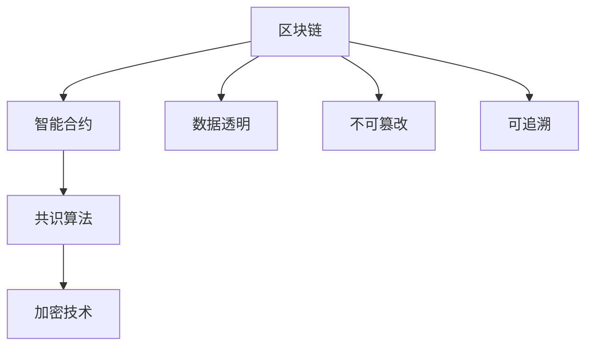

                 

# 区块链技术：去中心化应用开发

在过去的几年中，区块链技术（Blockchain Technology）已从一个边缘领域的学术研究项目，发展成为改变全球金融和商业格局的关键力量。区块链技术以去中心化、安全、透明、可追溯等为核心特征，为开发者提供了一种全新的应用开发模式。本文将全面介绍区块链技术的核心概念与原理，详细剖析其在去中心化应用（Decentralized Application, DApp）开发中的应用，并探讨其面临的挑战与未来发展趋势。

## 1. 背景介绍

### 1.1 问题由来
随着互联网技术的发展，传统中心化系统的弊端逐渐暴露：数据被单点控制，易遭受攻击；隐私和安全问题频发；法律法规难以保障数据和用户权益。这些问题促使人们寻求一种更为安全和透明的解决方案。区块链技术应运而生，通过去中心化的分布式账本技术，为互联网应用提供了新的思路。

### 1.2 问题核心关键点
区块链技术的核心是分布式账本（Distributed Ledger），基于共识算法（Consensus Algorithm）和加密技术（Cryptographic Techniques）实现数据的去中心化存储和验证。在区块链上开发的去中心化应用DApp，通过智能合约（Smart Contracts）实现自动化和可信的业务逻辑，无需第三方信任中介。

## 2. 核心概念与联系

### 2.1 核心概念概述

区块链技术的核心概念包括：

- 区块链（Blockchain）：一种分布式账本技术，通过去中心化的方式，实现数据的透明、不可篡改和可追溯。
- 智能合约（Smart Contract）：在区块链上自动执行的代码，无需第三方信任，具有高度自动化和可信性。
- 共识算法（Consensus Algorithm）：多个参与者共同达成一致的算法机制，保障区块链网络的安全性和一致性。
- 加密技术（Cryptographic Techniques）：用于保护数据和交易的隐私和安全，包括公钥加密、哈希函数等。

这些概念之间通过以下Mermaid流程图连接起来：



这个流程图展示了区块链技术的核心组成及其功能：

1. 区块链提供分布式账本的基础架构。
2. 智能合约在区块链上执行自动化的业务逻辑。
3. 共识算法保障网络的安全和一致性。
4. 加密技术保护数据和交易的隐私和安全。

通过这些核心概念的有机组合，区块链技术实现了去中心化、安全、透明和可信的互联网应用开发。

## 3. 核心算法原理 & 具体操作步骤

### 3.1 算法原理概述

区块链技术的核心在于其分布式账本和共识算法。分布式账本通过去中心化的方式，记录和验证所有参与者的交易，确保数据的安全和不可篡改。共识算法则是多个节点通过计算达成一致的协议，保证区块链网络的安全性和一致性。

在区块链上开发DApp时，智能合约是其核心。智能合约是一段自动化的代码，能够在区块链上执行预设的业务逻辑，无需第三方信任，实现了自动化的合约执行和管理。

### 3.2 算法步骤详解

1. **智能合约编写与部署**：开发者使用Solidity等编程语言编写智能合约，并通过以太坊（Ethereum）等平台部署到区块链上。

2. **交易验证与执行**：智能合约代码在区块链上被多个节点验证和执行，确保交易的正确性和安全性。

3. **数据存储与查询**：智能合约可以存储和查询区块链上的数据，实现业务逻辑的处理和数据的持久化。

4. **应用集成与调用**：DApp通过API接口与智能合约进行通信，调用其业务逻辑，完成应用的逻辑实现。

### 3.3 算法优缺点

区块链技术具有以下优点：

- 去中心化：无需第三方信任中介，提升系统的安全性和透明度。
- 不可篡改：分布式账本的不可篡改特性，确保数据的完整性和可靠性。
- 透明可追溯：所有交易记录公开透明，可追溯，保障数据公正性。
- 自动化执行：智能合约的自动执行能力，提高业务效率和准确性。

同时，区块链技术也存在以下缺点：

- 扩展性不足：目前区块链处理交易的速度较慢，难以支撑大规模应用。
- 高耗能：共识算法如工作量证明（Proof of Work, PoW）和权益证明（Proof of Stake, PoS）消耗大量能源。
- 技术复杂：区块链技术涉及加密、共识、分布式等复杂概念，开发门槛较高。

### 3.4 算法应用领域

区块链技术主要应用于以下领域：

- 金融服务：去中心化的货币、支付、交易等应用，如比特币、以太坊等。
- 供应链管理：实现供应链的透明、可追溯和自动化管理，提升供应链效率。
- 数字身份：通过区块链实现身份认证和数据安全，如身份证明、电子证书等。
- 物联网：通过区块链实现设备间的数据共享和安全管理，保障物联网安全。
- 知识产权保护：通过区块链记录和验证知识产权，防止侵权和盗版。

## 4. 数学模型和公式 & 详细讲解 & 举例说明

### 4.1 数学模型构建

在区块链中，交易验证和共识算法是其核心。以下以工作量证明（PoW）为例，介绍其数学模型构建和推导过程。

**工作量证明（PoW）**：一种共识算法，要求矿工通过计算高度复杂的哈希函数，找到满足特定条件的哈希值，从而获得区块链的共识权。

设区块链高度为 $h$，矿工计算哈希函数的复杂度为 $C$，哈希值满足特定条件的概率为 $p$，则矿工计算出一个有效哈希值所需计算次数为：

$$
C = h \cdot \log_2(\frac{1}{p})
$$

其中，$h$ 为区块链高度，$p$ 为有效哈希值的概率。

### 4.2 公式推导过程

在PoW中，哈希函数 $H$ 可以表示为：

$$
H(\text{input}) = \text{hash}(\text{prevhash} \| \text{input} \| \text{nonce})
$$

其中，$\text{prevhash}$ 为前一个哈希值，$\text{input}$ 为输入数据，$\text{nonce}$ 为随机数。

为了找到满足特定条件的哈希值，矿工需要不断调整 $\text{nonce}$ 的值，直至找到满足条件的哈希值。设 $\text{nonce}$ 的搜索空间为 $N$，则矿工找到满足条件的哈希值所需计算次数为：

$$
C = N \cdot \log_2(\frac{1}{p})
$$

### 4.3 案例分析与讲解

以比特币网络为例，其共识算法为PoW，每个区块的大小为1MB，大约每秒处理7次交易，共识算法难度为 $2^{256-8}$。则每处理一个区块所需计算次数为：

$$
C = \frac{1 \text{MB}}{7 \text{tx/s}} \cdot \log_2(2^{256-8}) \approx 1.3 \times 10^{12}
$$

这意味着，比特币网络每处理一个区块，平均需要进行约 $10^{12}$ 次哈希计算。

## 5. 项目实践：代码实例和详细解释说明

### 5.1 开发环境搭建

为了进行区块链应用的开发，我们需要搭建一个基本的开发环境。以下是在Ethereum上搭建以太坊智能合约开发环境的步骤：

1. 安装Node.js和npm：
```bash
sudo apt-get update
sudo apt-get install nodejs
sudo apt-get install npm
```

2. 安装Ethereum开发工具：
```bash
npm install -g truffle-hd
npm install -g ganache-cli
```

3. 创建Ethereum账户：
```bash
ganache-cli
```

### 5.2 源代码详细实现

以下是一个简单的智能合约示例，用于实现一个去中心化的投票系统。智能合约代码如下：

```javascript
pragma solidity ^0.5.0;

contract Vote {
    address public owner;
    uint public voteCount;
    mapping(address => uint) public votes;

    constructor() public {
        owner = msg.sender;
    }

    function vote(uint voteId) public {
        require(msg.sender == owner, "Only owner can vote");
        require(votes[msg.sender] == 0, "Already voted");
        votes[msg.sender] = voteId;
        voteCount += 1;
    }

    function getVoteCount() public view returns (uint) {
        return voteCount;
    }

    function getVotes() public view returns (mapping(address => uint)) {
        return votes;
    }
}
```

该合约实现了一个简单的投票功能，投票者可以进行投票，查看总投票数和已投票结果。

### 5.3 代码解读与分析

**合约部署**：

使用Truffle HD工具创建合约文件，并在 Ganache CLI上部署合约：

```bash
truffle compile
truffle migrate
```

**合约调用**：

通过智能合约的接口，进行投票操作：

```javascript
let voteContract = await Vote.deployed();
await voteContract.vote(0);
let voteCount = await voteContract.getVoteCount();
let votes = await voteContract.getVotes();
```

**结果展示**：

在Ganache CLI上查看合约状态：

```bash
> voteContract.voteCount
0
> voteContract.votes
{ 0x0 => 0x0, 0x1 => 0x0, 0x2 => 0x0, 0x3 => 0x0, 0x4 => 0x0, 0x5 => 0x0, 0x6 => 0x0, 0x7 => 0x0, 0x8 => 0x0, 0x9 => 0x0, 0xa => 0x0, 0xb => 0x0, 0xc => 0x0, 0xd => 0x0, 0xe => 0x0, 0xf => 0x0 }
> voteContract.voteCount
1
> voteContract.votes
{ 0x0 => 0x1, 0x1 => 0x0, 0x2 => 0x0, 0x3 => 0x0, 0x4 => 0x0, 0x5 => 0x0, 0x6 => 0x0, 0x7 => 0x0, 0x8 => 0x0, 0x9 => 0x0, 0xa => 0x0, 0xb => 0x0, 0xc => 0x0, 0xd => 0x0, 0xe => 0x0, 0xf => 0x0 }
```

可以看到，合约成功执行了投票操作，并更新了投票计数和投票结果。

## 6. 实际应用场景

### 6.1 智能投票系统

区块链技术可以实现去中心化的投票系统，确保投票的透明和公正。通过智能合约，投票过程自动化执行，投票结果公开透明，无需第三方信任中介。

在实际应用中，投票者通过智能合约接口进行投票，智能合约自动验证和记录投票结果，投票结束后，公开投票结果，确保投票过程的透明和公正。

### 6.2 供应链管理

区块链技术可以实现供应链的透明和可追溯管理。通过智能合约，记录和管理供应链上的所有交易和状态，确保供应链的透明度和可追溯性。

在实际应用中，供应链上的各个节点通过智能合约进行交易，智能合约自动验证和记录交易结果，确保供应链上所有交易的透明和可追溯。同时，智能合约还可以自动更新供应链状态，实现供应链的自动化管理。

### 6.3 数字身份认证

区块链技术可以实现数字身份认证，确保身份数据的隐私和安全。通过智能合约，记录和管理用户的身份信息，确保身份认证的可靠性和安全性。

在实际应用中，用户通过智能合约接口进行身份认证，智能合约自动验证和记录身份信息，确保身份认证的可靠性和安全性。同时，智能合约还可以实现身份信息的自动化管理和更新，确保身份信息的准确性和及时性。

## 7. 工具和资源推荐

### 7.1 学习资源推荐

为了帮助开发者系统掌握区块链技术，以下是一些优质的学习资源：

1. 《Blockchain Basics》系列博文：由区块链专家撰写，深入浅出地介绍了区块链的基本概念和核心技术。

2. 《Mastering Blockchain with Solidity》书籍： solidity 语言开发者指南，全面介绍了 solidity 语言的编程技术和实践经验。

3 《Blockchain for Finance: Markets and Bots》课程：麻省理工学院（MIT）开设的区块链金融课程，涵盖区块链在金融领域的应用。

4 《Mastering Ethereum: Build Secure, Solid Smart Contracts》书籍：详细介绍了 Ethereum 平台的智能合约开发和最佳实践。

5 《Blockchain Technology and Practice》书籍：全面介绍了区块链技术的原理、应用和实践，涵盖多个区块链平台和智能合约开发工具。

通过对这些资源的学习实践，相信你一定能够快速掌握区块链技术，并用于解决实际的商业问题。

### 7.2 开发工具推荐

以下是几款用于区块链应用开发的常用工具：

1. Truffle HD：一个基于以太坊的智能合约开发框架，提供智能合约的编写、测试、部署和版本管理功能。

2. Ganache CLI：一个本地以太坊测试网络，方便开发者进行智能合约的测试和部署。

3. Remix IDE：一个在线智能合约开发环境，提供代码编辑器和智能合约运行环境。

4. Web3.js：一个JavaScript库，用于与区块链平台进行交互，支持以太坊、TRON等平台。

5. MetaMask：一个浏览器扩展，支持以太坊等区块链平台的交互和交易。

合理利用这些工具，可以显著提升区块链应用开发的效率，加速创新迭代的步伐。

### 7.3 相关论文推荐

区块链技术的发展源于学界的持续研究。以下是几篇奠基性的相关论文，推荐阅读：

1. Bitcoin: A Peer-to-Peer Electronic Cash System：比特币的原始论文，介绍了比特币系统的设计与实现。

2. On the Economics of Bitcoins: Usage Costs, User Data, and Monetary Value：比特币经济学的研究，探讨比特币系统的激励机制。

3. Smart Contracts: Scripts for Blockchain Applications：智能合约的开创性论文，首次提出智能合约的概念。

4. The Decentralization Advantage of Bitcoin：比特币去中心化的优势研究，探讨区块链系统的安全性与去中心化设计。

5. Decentralized Autonomous Organization: A Framework for Decentralized Governance and Reward Schemes：去中心化自治组织（DAO）的研究，探讨DAO的治理和激励机制。

这些论文代表了大规模区块链技术的发展脉络。通过学习这些前沿成果，可以帮助研究者把握学科前进方向，激发更多的创新灵感。

## 8. 总结：未来发展趋势与挑战

### 8.1 总结

本文对区块链技术进行了全面系统的介绍。首先阐述了区块链技术的核心概念与原理，详细讲解了其在去中心化应用开发中的应用，并探讨了其面临的挑战与未来发展趋势。区块链技术以去中心化、安全、透明、可追溯等为核心特征，为互联网应用提供了新的思路。基于区块链的智能合约技术，使得自动化的业务逻辑成为可能，为去中心化应用开发提供了强大的支撑。

### 8.2 未来发展趋势

展望未来，区块链技术将呈现以下几个发展趋势：

1. 跨链互联：随着不同区块链平台的发展，跨链技术成为热点，实现不同区块链平台之间的互联互通，提升区块链网络的互操作性。

2. 去中心化身份（Decentralized Identity, DID）：区块链技术可以实现去中心化的身份认证，保护用户隐私，提升身份认证的可靠性和安全性。

3. 隐私保护技术：区块链技术将进一步发展隐私保护技术，如零知识证明（Zero-Knowledge Proofs）、同态加密（Homomorphic Encryption）等，确保数据隐私和安全。

4. 智能合约自动化：智能合约自动化技术将不断提升，使得合约执行更加高效、准确。同时，智能合约的业务逻辑将更加复杂多样，实现更加广泛的应用场景。

5. 公链与联盟链结合：公链和联盟链（Consortium Blockchain）结合，形成混合型区块链网络，充分发挥公链和联盟链的优势，提升区块链网络的应用范围和安全性。

以上趋势凸显了区块链技术的广阔前景。这些方向的探索发展，必将进一步提升区块链应用的安全性、可扩展性和应用范围，为构建去中心化、自治化的互联网应用提供新的可能。

### 8.3 面临的挑战

尽管区块链技术已经取得了瞩目成就，但在迈向更加智能化、普适化应用的过程中，它仍面临着诸多挑战：

1. 扩展性瓶颈：目前区块链处理交易的速度较慢，难以支撑大规模应用。如何提高区块链网络的扩展性，成为亟待解决的问题。

2. 高耗能问题：共识算法如PoW和PoS消耗大量能源，如何降低区块链网络的能耗，成为技术发展的方向。

3. 技术复杂度高：区块链技术涉及加密、共识、分布式等复杂概念，开发门槛较高。如何降低区块链应用的开发难度，提高其普及度。

4. 法律和监管环境不完善：区块链技术缺乏明确的法律和监管环境，存在法律风险和安全问题。如何制定区块链技术的法律法规，保障其健康发展。

5. 隐私和安全问题：虽然区块链技术具有去中心化和不可篡改的特性，但在隐私保护和安全方面仍需进一步完善。如何提升区块链应用的隐私保护和安全保障，是关键挑战。

6. 多方协同问题：区块链技术需要多方协同工作，如何协调各方利益，形成良好的协同机制，是技术发展的关键。

这些挑战需要技术界和产业界的共同努力，积极应对并寻求突破，才能使区块链技术更好地服务于社会和经济。

### 8.4 研究展望

面向未来，区块链技术的未来研究需要在以下几个方面寻求新的突破：

1. 跨链互联：实现不同区块链平台之间的互联互通，提升区块链网络的互操作性。

2. 隐私保护：发展隐私保护技术，如零知识证明、同态加密等，确保数据隐私和安全。

3. 智能合约自动化：提升智能合约自动化水平，实现更加高效、准确的合约执行。

4. 去中心化身份：实现去中心化的身份认证，保护用户隐私，提升身份认证的可靠性和安全性。

5. 公链与联盟链结合：形成混合型区块链网络，充分发挥公链和联盟链的优势，提升区块链网络的应用范围和安全性。

6. 多方协同：构建多方协同机制，协调各方利益，推动区块链技术的健康发展。

这些研究方向将引领区块链技术迈向更高的台阶，为构建去中心化、自治化的互联网应用提供新的可能。只有勇于创新、敢于突破，才能不断拓展区块链技术的边界，让智能技术更好地造福人类社会。

## 9. 附录：常见问题与解答

**Q1：什么是区块链？**

A: 区块链是一种分布式账本技术，通过去中心化的方式，记录和验证所有参与者的交易，确保数据的安全和不可篡改。

**Q2：什么是智能合约？**

A: 智能合约是一段自动化的代码，能够在区块链上执行预设的业务逻辑，无需第三方信任，具有高度自动化和可信性。

**Q3：区块链技术的主要应用场景有哪些？**

A: 区块链技术主要应用于金融服务、供应链管理、数字身份认证、物联网、知识产权保护等多个领域。

**Q4：区块链技术面临的主要挑战有哪些？**

A: 区块链技术面临的主要挑战包括扩展性瓶颈、高耗能问题、技术复杂度高、法律和监管环境不完善、隐私和安全问题、多方协同问题等。

**Q5：区块链技术的未来发展趋势是什么？**

A: 区块链技术的未来发展趋势包括跨链互联、去中心化身份、隐私保护技术、智能合约自动化、公链与联盟链结合等。

通过本文的系统梳理，可以看到，区块链技术以其去中心化、安全、透明、可追溯等核心特征，为互联网应用提供了新的思路。基于区块链的智能合约技术，使得自动化的业务逻辑成为可能，为去中心化应用开发提供了强大的支撑。未来，随着技术的不断发展，区块链技术必将在更多领域得到应用，为构建去中心化、自治化的互联网应用提供新的可能。

