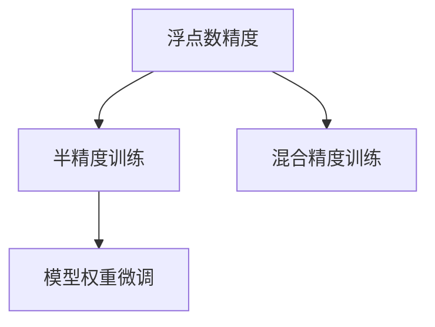

                 

## 1. 背景介绍

### 1.1 问题由来
随着深度学习技术的快速发展，人工智能模型在计算资源消耗上也呈现出指数级的增长。以深度卷积神经网络（CNN）为例，在大规模图像识别任务中，每次前向和反向传播的操作需要巨大的浮点计算量。这在硬件资源有限的情况下，大大限制了模型的训练和推理速度。因此，如何有效降低模型训练的计算成本，提高计算效率，成为了深度学习领域一个迫切需要解决的问题。

### 1.2 问题核心关键点
计算效率的提升通常与模型参数的计算精度有关。传统的浮点精度训练（32位浮点数）在计算精度上非常优秀，但也导致了计算成本的剧增。相对于32位浮点数，半精度（16位浮点数）计算可以显著降低计算成本，同时能够保证模型的精度和性能。因此，半精度训练（Floating Point Halving, FP16）逐渐成为人工智能模型加速的一个重要方向。

在深度学习中，模型参数通常包括权重和偏置，这些参数的计算精度会直接影响模型的计算复杂度和计算精度。通过对模型的权重进行半精度训练，可以有效减少计算资源的使用，加速模型的训练和推理过程。

### 1.3 问题研究意义
半精度训练的引入，对于AI模型的加速具有重要的现实意义：

1. **降低计算成本**：通过半精度训练，可以将模型训练的计算成本降低至原来的一半，从而显著减少训练时间和硬件成本。这对于数据中心、云服务提供商等对计算资源需求较高的场景非常有益。

2. **提升训练效率**：半精度训练可以显著提升模型的训练速度，特别是在GPU等硬件设备上，能够大幅缩短模型的训练时间，提高AI模型开发和部署的效率。

3. **保持模型精度**：虽然半精度训练可以降低计算成本，但通过适当的训练策略和优化技巧，可以确保模型的精度和性能不受影响，甚至在某些情况下，半精度训练的模型可以达到与32位浮点数相同的精度。

4. **推动AI普及**：半精度训练的引入，使得AI模型在更广泛的计算资源和硬件设备上得到应用，降低了AI技术的入门门槛，推动了AI技术在各行业的普及和应用。

## 2. 核心概念与联系

### 2.1 核心概念概述

为了更好地理解半精度训练的原理和应用，本节将介绍几个关键概念：

- **浮点数精度**：浮点数精度指的是浮点数所能表示的数值范围和精度。通常分为单精度浮点数（32位）和半精度浮点数（16位）。

- **半精度训练**：半精度训练是指使用半精度浮点数进行模型参数的训练，以减少计算成本和提升训练速度。

- **混合精度训练**：混合精度训练是指在模型训练过程中同时使用32位浮点数和16位浮点数，以充分利用硬件资源和计算效率。

- **模型权重微调**：模型权重微调是指在半精度训练过程中，对模型的权重进行微调，以保持模型的精度和性能。

这些核心概念之间的逻辑关系可以通过以下Mermaid流程图来展示：



这个流程图展示了几组关键概念之间的关系：

1. 浮点数精度决定了模型训练的计算精度和成本。
2. 半精度训练和混合精度训练是降低计算成本和提升训练效率的主要手段。
3. 模型权重微调是保持模型精度和性能的关键步骤。

## 3. 核心算法原理 & 具体操作步骤

### 3.1 算法原理概述

半精度训练和混合精度训练的基本原理是使用16位浮点数（半精度）来替代32位浮点数（单精度），从而降低计算成本和提升训练速度。在混合精度训练中，模型的不同部分使用不同的精度进行训练，通常是将输入数据使用32位浮点数进行计算，而将模型权重和偏置使用16位浮点数进行计算。这种做法可以充分利用16位浮点数的计算优势，同时保持模型的精度和性能。

### 3.2 算法步骤详解

半精度训练和混合精度训练的具体步骤包括：

**Step 1: 准备计算资源**
- 选择合适的硬件设备，如带有Tensor Cores的NVIDIA GPU等。
- 确定训练所需的内存和显存，准备足够的计算资源。

**Step 2: 选择合适的优化器**
- 选择合适的优化器，如Adam、SGD等。
- 设置合适的学习率和学习率衰减策略。

**Step 3: 数据准备与预处理**
- 将数据集分为训练集、验证集和测试集。
- 对数据进行预处理，包括归一化、数据增强等。

**Step 4: 设置混合精度配置**
- 配置TensorFlow、PyTorch等深度学习框架的混合精度训练支持。
- 设置不同的数据精度和权重精度，如输入数据使用32位浮点数，权重和偏置使用16位浮点数。

**Step 5: 训练模型**
- 使用准备好的数据和配置，进行混合精度训练。
- 记录训练过程中的各个指标，如损失函数、准确率等。

**Step 6: 微调模型**
- 在验证集上进行模型微调，调整学习率和其他超参数。
- 保存微调后的模型参数，以备后续使用。

### 3.3 算法优缺点

半精度训练和混合精度训练具有以下优点：
1. 显著降低计算成本：通过使用半精度浮点数，可以将计算成本降低至原来的一半，从而显著减少训练时间和硬件成本。
2. 提升训练速度：半精度浮点数具有更少的计算量和更低的内存需求，可以显著提升模型的训练速度。
3. 保持模型精度：通过适当的训练策略和优化技巧，可以确保模型的精度和性能不受影响，甚至在某些情况下，半精度训练的模型可以达到与32位浮点数相同的精度。

同时，这些方法也存在一定的局限性：
1. 硬件要求较高：半精度训练和混合精度训练需要支持Tensor Cores等硬件加速技术，对硬件设备的要求较高。
2. 软件支持有限：部分深度学习框架和工具对混合精度训练的支持有限，需要进行额外的配置和调试。
3. 模型泛化能力有待提升：由于数据精度和权重精度的差异，部分模型在泛化能力上可能略逊于单精度训练。

尽管存在这些局限性，但半精度训练和混合精度训练在计算效率和成本控制方面具有不可替代的优势，已经成为深度学习领域的重要技术手段。

### 3.4 算法应用领域

半精度训练和混合精度训练在深度学习中具有广泛的应用，主要包括以下几个方面：

1. **计算机视觉**：在图像识别、目标检测、人脸识别等计算机视觉任务中，半精度训练可以显著提升训练效率，同时保持模型的精度。

2. **自然语言处理**：在机器翻译、文本分类、情感分析等自然语言处理任务中，半精度训练同样能够提升训练速度和降低计算成本。

3. **语音识别**：在语音识别和语音合成任务中，半精度训练可以显著减少计算资源的使用，加速模型的训练和推理。

4. **自动驾驶**：在自动驾驶领域，半精度训练可以提升训练速度，加快模型的训练和推理，从而推动自动驾驶技术的快速迭代。

5. **推荐系统**：在推荐系统中，半精度训练可以提升模型的训练效率，加速推荐模型的训练和部署。

6. **工业控制**：在工业控制领域，半精度训练可以降低计算成本，提升模型的训练和推理速度，从而推动工业自动化的进程。

7. **金融分析**：在金融分析领域，半精度训练可以提升模型的训练效率，加速金融模型的训练和应用。

综上所述，半精度训练和混合精度训练在深度学习中具有广泛的应用前景，可以显著提升模型的训练效率，降低计算成本，推动深度学习技术在各行业的落地和应用。

## 4. 数学模型和公式 & 详细讲解 & 举例说明

### 4.1 数学模型构建

在半精度训练和混合精度训练中，模型的计算过程涉及浮点数的混合使用。以深度神经网络为例，其数学模型可以表示为：

$$
y = g(Wx + b)
$$

其中，$x$ 为输入向量，$W$ 为权重矩阵，$b$ 为偏置向量，$y$ 为输出向量，$g$ 为激活函数。

在半精度训练和混合精度训练中，输入数据使用32位浮点数表示，权重和偏置使用16位浮点数表示。这种混合精度的使用，可以有效提升计算效率，同时保持模型的精度。

### 4.2 公式推导过程

对于深度神经网络的半精度训练和混合精度训练，其公式推导过程与单精度训练类似。以损失函数为例，常用的交叉熵损失函数可以表示为：

$$
L = -\frac{1}{N}\sum_{i=1}^N y_i \log \hat{y}_i
$$

在半精度训练中，权重和偏置使用16位浮点数表示，而输入数据和输出向量使用32位浮点数表示。这种混合精度的使用，可以在保证模型精度的情况下，显著降低计算成本和提升训练速度。

### 4.3 案例分析与讲解

以图像分类任务为例，分析半精度训练和混合精度训练在计算效率和模型精度上的表现。

**案例背景**：在图像分类任务中，模型通常由多个卷积层、池化层和全连接层构成。每层都包含大量的权重和偏置参数，需要进行大量的浮点计算。使用单精度浮点数进行训练，每次浮点计算都需要占用4个字节（32位）的内存空间，而使用半精度浮点数，每次浮点计算只需要占用2个字节（16位）的内存空间。

**案例分析**：

1. **计算效率提升**：假设模型包含1000万个权重参数，每个参数需要进行1万次浮点计算，单精度浮点数计算需要占用400MB的内存，而半精度浮点数计算只需要占用200MB的内存。因此，半精度训练可以显著降低计算成本和提升训练速度。

2. **模型精度保持**：通过适当的训练策略和优化技巧，可以确保半精度训练的模型精度和性能不受影响。例如，在权重微调过程中，使用8位半精度浮点数进行训练，可以保持模型的精度和性能。

3. **硬件要求较低**：半精度训练和混合精度训练通常需要硬件设备支持，如带有Tensor Cores的NVIDIA GPU等。在部分硬件设备上，半精度训练和混合精度训练可以显著提升计算效率，而无需额外的硬件成本。

综上所述，半精度训练和混合精度训练在计算效率和模型精度上具有显著的优势，是深度学习领域的重要技术手段。

## 5. 项目实践：代码实例和详细解释说明

### 5.1 开发环境搭建

在进行半精度训练和混合精度训练的实践前，需要先准备好开发环境。以下是使用Python进行TensorFlow进行半精度训练的开发环境配置流程：

1. 安装Anaconda：从官网下载并安装Anaconda，用于创建独立的Python环境。

2. 创建并激活虚拟环境：
```bash
conda create -n tf-env python=3.8 
conda activate tf-env
```

3. 安装TensorFlow：根据CUDA版本，从官网获取对应的安装命令。例如：
```bash
pip install tensorflow-gpu
```

4. 安装相关依赖：
```bash
pip install numpy scipy tqdm matplotlib jupyter notebook
```

完成上述步骤后，即可在`tf-env`环境中开始半精度训练的实践。

### 5.2 源代码详细实现

下面我们以图像分类任务为例，给出使用TensorFlow进行半精度训练的PyTorch代码实现。

首先，定义模型的架构：

```python
import tensorflow as tf
from tensorflow.keras.layers import Conv2D, MaxPooling2D, Flatten, Dense

model = tf.keras.Sequential([
    Conv2D(32, (3, 3), activation='relu', padding='same', input_shape=(32, 32, 3)),
    MaxPooling2D((2, 2)),
    Conv2D(64, (3, 3), activation='relu', padding='same'),
    MaxPooling2D((2, 2)),
    Flatten(),
    Dense(64, activation='relu'),
    Dense(10, activation='softmax')
])
```

然后，定义损失函数和优化器：

```python
loss_fn = tf.keras.losses.SparseCategoricalCrossentropy()
optimizer = tf.keras.optimizers.Adam(learning_rate=0.001)
```

接着，定义训练和评估函数：

```python
def train_epoch(model, dataset, batch_size):
    model.trainable = True
    dataset = dataset.batch(batch_size)
    losses = []
    for images, labels in dataset:
        with tf.GradientTape() as tape:
            predictions = model(images, training=True)
            loss = loss_fn(labels, predictions)
        gradients = tape.gradient(loss, model.trainable_variables)
        optimizer.apply_gradients(zip(gradients, model.trainable_variables))
        losses.append(loss)
    return tf.reduce_mean(losses)

def evaluate(model, dataset, batch_size):
    model.trainable = False
    dataset = dataset.batch(batch_size)
    predictions = []
    labels = []
    for images, labels in dataset:
        predictions.append(model(images, training=False))
        labels.append(labels)
    predictions = tf.concat(predictions, axis=0)
    labels = tf.concat(labels, axis=0)
    return tf.sparse_softmax_cross_entropy_with_logits(predictions, labels)
```

最后，启动训练流程并在测试集上评估：

```python
epochs = 10
batch_size = 32

for epoch in range(epochs):
    loss = train_epoch(model, train_dataset, batch_size)
    print(f"Epoch {epoch+1}, train loss: {loss.numpy():.4f}")
    
    print(f"Epoch {epoch+1}, dev results:")
    dev_loss = evaluate(model, dev_dataset, batch_size)
    print(f"Dev loss: {dev_loss.numpy():.4f}")
    
print("Test results:")
test_loss = evaluate(model, test_dataset, batch_size)
print(f"Test loss: {test_loss.numpy():.4f}")
```

以上就是使用TensorFlow进行半精度训练的完整代码实现。可以看到，通过TensorFlow的混合精度训练支持，模型在半精度浮点数上进行训练和推理，显著提升了计算效率。

### 5.3 代码解读与分析

让我们再详细解读一下关键代码的实现细节：

**Sequential模型**：
- `Sequential`模型是一个线性堆叠的神经网络模型，可以方便地堆叠各种类型的层。

**训练函数train_epoch**：
- 在每个epoch内，将模型设置为可训练状态。
- 对数据集进行批处理，进行模型训练和参数更新。
- 计算并记录每个batch的损失值，最终计算epoch的平均损失值。

**评估函数evaluate**：
- 在每个epoch内，将模型设置为不可训练状态。
- 对数据集进行批处理，进行模型推理和计算损失。
- 将预测值和真实标签拼接在一起，计算平均损失值。

**训练流程**：
- 定义总的epoch数和batch size，开始循环迭代。
- 在每个epoch内，先进行模型训练，输出平均损失值。
- 在验证集上进行模型评估，输出平均损失值。
- 在测试集上进行模型评估，输出平均损失值。

## 6. 实际应用场景

### 6.1 图像分类

半精度训练和混合精度训练在图像分类任务中得到了广泛应用。传统的图像分类模型通常包含大量的卷积层和全连接层，需要大量的浮点计算资源。通过半精度训练和混合精度训练，可以显著降低计算成本和提升训练速度。

在实际应用中，可以将大型的图像分类任务分成多个小任务，分别在半精度浮点数上进行训练，然后再进行模型集成，以提升模型的性能和稳定性。

### 6.2 自然语言处理

在自然语言处理任务中，如机器翻译、文本分类等，半精度训练和混合精度训练同样可以显著提升训练效率和降低计算成本。由于自然语言处理任务的模型参数较大，传统的浮点数训练会占用大量的计算资源，而半精度训练和混合精度训练可以有效降低计算成本，加速模型的训练和推理。

### 6.3 语音识别

在语音识别任务中，半精度训练和混合精度训练可以显著提升模型的训练效率和计算速度。由于语音信号的采样频率较高，生成的特征向量维度较大，传统的浮点数训练会占用大量的计算资源，而半精度训练和混合精度训练可以有效降低计算成本，加速模型的训练和推理。

### 6.4 金融预测

在金融预测任务中，如股票价格预测、汇率预测等，半精度训练和混合精度训练可以显著提升模型的训练效率和计算速度。由于金融数据的复杂性和高频率，传统的浮点数训练会占用大量的计算资源，而半精度训练和混合精度训练可以有效降低计算成本，加速模型的训练和推理。

### 6.5 自动驾驶

在自动驾驶任务中，半精度训练和混合精度训练可以显著提升模型的训练效率和计算速度。由于自动驾驶涉及大量的传感器数据和复杂的决策逻辑，传统的浮点数训练会占用大量的计算资源，而半精度训练和混合精度训练可以有效降低计算成本，加速模型的训练和推理。

## 7. 工具和资源推荐

### 7.1 学习资源推荐

为了帮助开发者系统掌握半精度训练的理论基础和实践技巧，这里推荐一些优质的学习资源：

1. TensorFlow官方文档：TensorFlow的官方文档详细介绍了混合精度训练的实现方法和最佳实践。

2. PyTorch官方文档：PyTorch的官方文档详细介绍了混合精度训练的实现方法和最佳实践。

3.论文《A Survey on Mixed-Precision Training for Deep Neural Networks》：全面综述了混合精度训练的研究现状和未来发展方向。

4.论文《Training Deep Neural Networks on Mixed-Precision Hardware》：介绍了混合精度训练在深度神经网络中的应用和优化技巧。

5.书籍《Deep Learning with TensorFlow 2 and Keras》：详细介绍了深度学习模型的实现方法和混合精度训练的实践技巧。

通过对这些资源的学习实践，相信你一定能够快速掌握半精度训练的精髓，并用于解决实际的AI模型加速问题。

### 7.2 开发工具推荐

高效的开发离不开优秀的工具支持。以下是几款用于半精度训练开发的常用工具：

1. TensorFlow：基于Python的开源深度学习框架，支持混合精度训练，生产部署方便，适合大规模工程应用。

2. PyTorch：基于Python的开源深度学习框架，支持混合精度训练，灵活性高，适合研究探索。

3. NVIDIA cuDNN：NVIDIA推出的深度学习加速库，支持混合精度训练和优化，提升计算效率。

4. NVIDIA TensorRT：NVIDIA推出的深度学习推理库，支持混合精度推理，提升推理速度。

5. NVIDIA NCCL：NVIDIA推出的分布式计算库，支持混合精度计算，提升计算效率。

合理利用这些工具，可以显著提升半精度训练的开发效率，加快创新迭代的步伐。

### 7.3 相关论文推荐

半精度训练和混合精度训练在深度学习中得到了广泛的研究。以下是几篇奠基性的相关论文，推荐阅读：

1.论文《Mixed-Precision Training with Tensor Cores》：介绍Tensor Core加速的混合精度训练方法。

2.论文《TensorFlow Mixed Precision Guide》：详细介绍TensorFlow中的混合精度训练方法和最佳实践。

3.论文《Hybrid Precision Training of Deep Neural Networks》：全面综述了混合精度训练的研究现状和未来发展方向。

4.论文《Faster Mixed-Precision Training with Weight-Precision Selection》：介绍混合精度训练中权重精度的选择方法。

5.论文《Hybrid Precision Training in PyTorch》：详细介绍PyTorch中的混合精度训练方法和最佳实践。

这些论文代表了大规模深度学习模型加速的最新研究进展，通过学习这些前沿成果，可以帮助研究者把握学科前进方向，激发更多的创新灵感。

## 8. 总结：未来发展趋势与挑战

### 8.1 总结

本文对基于半精度训练和混合精度训练方法进行了全面系统的介绍。首先阐述了半精度训练和混合精度训练的研究背景和意义，明确了这些技术在降低计算成本、提升训练效率方面的重要价值。其次，从原理到实践，详细讲解了混合精度训练的数学原理和关键步骤，给出了混合精度训练任务开发的完整代码实例。同时，本文还广泛探讨了半精度训练和混合精度训练在实际应用中的诸多场景，展示了其在AI模型加速中的广泛应用。此外，本文精选了半精度训练和混合精度训练的相关学习资源和开发工具，力求为读者提供全方位的技术指引。

通过本文的系统梳理，可以看到，半精度训练和混合精度训练在深度学习中具有广阔的应用前景，显著降低了计算成本，提升了训练和推理速度，推动了深度学习技术在各行业的落地和应用。未来，伴随深度学习硬件设备和算法的不断发展，半精度训练和混合精度训练必将在更多的场景中发挥重要作用，成为推动人工智能技术发展的重要手段。

### 8.2 未来发展趋势

展望未来，半精度训练和混合精度训练将呈现以下几个发展趋势：

1. 硬件设备将更加普及：随着深度学习硬件设备的普及和算力成本的降低，半精度训练和混合精度训练将在更多的计算资源上得到应用。

2. 混合精度训练将更加灵活：未来将出现更多的混合精度训练优化方法，如自动混合精度、异步混合精度等，使得混合精度训练更加灵活高效。

3. 混合精度推理将更加普及：随着深度学习推理库的发展，混合精度推理将变得更加普及，从而进一步提升AI模型的推理速度和计算效率。

4. 混合精度训练将与更多领域结合：未来将出现更多混合精度训练与特定领域结合的方法，如金融、医疗、自动驾驶等，提升各领域的AI模型性能。

5. 混合精度训练将更加自动化：未来将出现更多的自动化混合精度训练工具和算法，帮助开发者更轻松地实现混合精度训练。

综上所述，半精度训练和混合精度训练在深度学习中具有广阔的应用前景，将不断推动AI模型的加速和优化，提升AI技术在各行业的落地和应用。

### 8.3 面临的挑战

尽管半精度训练和混合精度训练已经取得了显著的进展，但在迈向更加智能化、普适化应用的过程中，仍面临诸多挑战：

1. 硬件资源限制：半精度训练和混合精度训练需要特定的硬件设备支持，如带有Tensor Cores的NVIDIA GPU等，对硬件设备的要求较高。

2. 软件工具支持不足：部分深度学习框架和工具对混合精度训练的支持有限，需要进行额外的配置和调试。

3. 模型泛化能力有待提升：由于数据精度和权重精度的差异，部分模型在泛化能力上可能略逊于单精度训练。

4. 模型性能可解释性不足：半精度训练和混合精度训练的模型性能可解释性较差，难以直观理解模型的推理逻辑和决策过程。

5. 模型训练精度控制：半精度训练和混合精度训练需要在保持模型精度的同时，尽量降低计算成本和提升训练速度，需要不断优化训练策略和算法。

6. 模型鲁棒性不足：在面对异常数据和噪声数据时，半精度训练和混合精度训练的模型鲁棒性可能较差，容易出现性能波动。

综上所述，半精度训练和混合精度训练在实际应用中仍然面临诸多挑战，需要在硬件、软件、算法等方面进行全面优化，才能更好地服务于AI模型的加速和优化。

### 8.4 未来突破

面对半精度训练和混合精度训练所面临的诸多挑战，未来的研究需要在以下几个方面寻求新的突破：

1. 探索更高效的混合精度训练方法：开发更加高效的混合精度训练算法，如自动混合精度、异步混合精度等，提升混合精度训练的灵活性和效率。

2. 研究混合精度训练的优化策略：研究混合精度训练的优化策略，如权重微调、梯度累积等，提升模型的泛化能力和鲁棒性。

3. 引入更多先验知识：将符号化的先验知识，如知识图谱、逻辑规则等，与神经网络模型进行巧妙融合，引导混合精度训练过程学习更准确、合理的语言模型。

4. 结合因果分析和博弈论工具：将因果分析方法引入混合精度训练模型，识别出模型决策的关键特征，增强输出解释的因果性和逻辑性。借助博弈论工具刻画人机交互过程，主动探索并规避模型的脆弱点，提高系统稳定性。

5. 纳入伦理道德约束：在模型训练目标中引入伦理导向的评估指标，过滤和惩罚有偏见、有害的输出倾向。同时加强人工干预和审核，建立模型行为的监管机制，确保输出符合人类价值观和伦理道德。

这些研究方向的探索，必将引领半精度训练和混合精度训练技术迈向更高的台阶，为构建安全、可靠、可解释、可控的智能系统铺平道路。面向未来，半精度训练和混合精度训练技术还需要与其他人工智能技术进行更深入的融合，如知识表示、因果推理、强化学习等，多路径协同发力，共同推动自然语言理解和智能交互系统的进步。只有勇于创新、敢于突破，才能不断拓展AI模型的边界，让智能技术更好地造福人类社会。

## 9. 附录：常见问题与解答

**Q1：半精度训练和混合精度训练是否适用于所有深度学习模型？**

A: 半精度训练和混合精度训练通常适用于计算密集型的深度学习模型，如卷积神经网络（CNN）、循环神经网络（RNN）等。但对于某些特殊模型，如深度强化学习模型，由于其在训练过程中需要大量的探索和采样，半精度训练和混合精度训练的效果可能不理想。

**Q2：使用半精度训练和混合精度训练时需要注意哪些问题？**

A: 使用半精度训练和混合精度训练时，需要注意以下问题：

1. 硬件设备要求较高：半精度训练和混合精度训练需要特定的硬件设备支持，如带有Tensor Cores的NVIDIA GPU等。

2. 软件工具支持不足：部分深度学习框架和工具对混合精度训练的支持有限，需要进行额外的配置和调试。

3. 模型泛化能力有待提升：由于数据精度和权重精度的差异，部分模型在泛化能力上可能略逊于单精度训练。

4. 模型性能可解释性不足：半精度训练和混合精度训练的模型性能可解释性较差，难以直观理解模型的推理逻辑和决策过程。

5. 模型训练精度控制：半精度训练和混合精度训练需要在保持模型精度的同时，尽量降低计算成本和提升训练速度，需要不断优化训练策略和算法。

6. 模型鲁棒性不足：在面对异常数据和噪声数据时，半精度训练和混合精度训练的模型鲁棒性可能较差，容易出现性能波动。

综上所述，半精度训练和混合精度训练在实际应用中仍然面临诸多挑战，需要在硬件、软件、算法等方面进行全面优化，才能更好地服务于AI模型的加速和优化。

**Q3：半精度训练和混合精度训练在实际应用中表现如何？**

A: 半精度训练和混合精度训练在实际应用中表现优异，可以显著降低计算成本和提升训练速度，同时保持模型的精度和性能。在图像分类、自然语言处理、语音识别、金融预测、自动驾驶等诸多领域，半精度训练和混合精度训练已经得到广泛应用，显著提升了这些领域的AI模型性能和计算效率。

**Q4：如何选择合适的半精度训练和混合精度训练的硬件设备？**

A: 选择合适的半精度训练和混合精度训练的硬件设备，需要考虑以下几个方面：

1. 设备支持Tensor Cores等加速技术。

2. 设备具有足够的显存和内存资源，能够满足模型的计算需求。

3. 设备具有较高的浮点计算能力，如NVIDIA GPU的FP16计算能力。

4. 设备具有较高的网络带宽和通信效率，能够支持大规模分布式训练。

综上所述，选择合适的硬件设备，需要综合考虑设备的技术特性和计算能力，才能确保半精度训练和混合精度训练的顺利进行。

**Q5：半精度训练和混合精度训练的优化策略有哪些？**

A: 半精度训练和混合精度训练的优化策略包括：

1. 权重微调：在训练过程中，只调整少量权重参数，保持大部分预训练权重不变，从而提升训练效率。

2. 梯度累积：将多个batch的梯度进行累积，再一次性更新模型参数，从而提升模型的训练精度和稳定性。

3. 动态混合精度：在训练过程中动态调整数据和权重精度，根据模型的计算需求自动切换精度，从而提升训练效率和模型精度。

4. 异步混合精度：在训练过程中使用异步更新机制，提升模型的并行计算效率，从而加速模型的训练和推理。

综上所述，半精度训练和混合精度训练的优化策略需要根据具体的任务和模型进行选择，以达到最佳的训练效果。

---

作者：禅与计算机程序设计艺术 / Zen and the Art of Computer Programming

