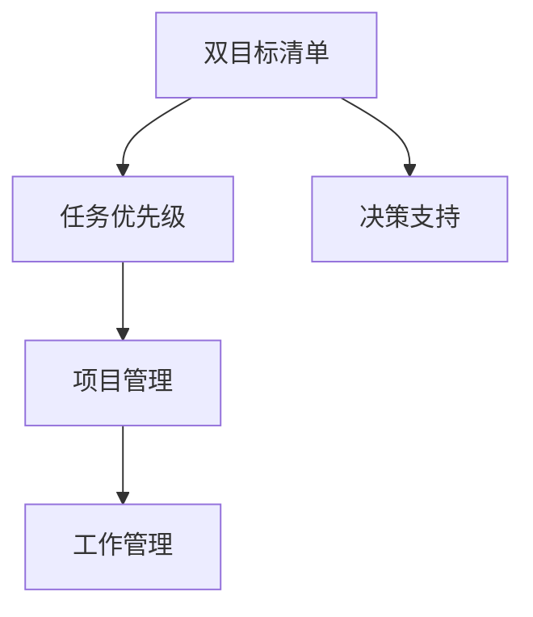

                 

# 双目标清单:聚焦要事的法宝

> 关键词：双目标清单,任务优先级,项目管理,决策支持,工作管理

## 1. 背景介绍

在现代社会，无论是个人还是团队，面对复杂繁重的任务时，如何高效、有序地规划和执行成为日益严峻的问题。项目延误、资源浪费、任务冲突等现象在各行各业都屡见不鲜，严重影响了工作效率和成果质量。在解决这些问题时，很多管理者采取了机械的任务清单或工作计划，但效果往往不尽如人意。本文旨在深入探讨双目标清单方法，揭示其背后的科学原理，帮助读者提升任务管理能力，在快节奏的现代生活中更加游刃有余。

## 2. 核心概念与联系

### 2.1 核心概念概述

- **双目标清单**：一种结合时间管理和任务优先级的工具，旨在帮助个人或团队明确核心任务和次要任务，优先完成对达成目标最为关键的工作，从而提升整体效率。
- **任务优先级**：根据任务的重要性和紧急程度进行排序，以决定哪些任务需要首先完成。
- **项目管理**：通过计划、执行、监控、收尾等步骤，协调和控制项目过程以达成既定目标。
- **决策支持**：利用数据、信息和分析工具，辅助决策者制定更加明智的决策。
- **工作管理**：通过组织、计划、指导、控制和评估等手段，确保任务和目标的达成。

这些概念之间的内在联系可以总结如下：双目标清单作为项目管理中的一个核心工具，通过帮助决策者理清任务优先级，从而提升决策的科学性和工作的执行效率。同时，决策支持系统可以为双目标清单提供强大的数据分析能力，进一步优化任务优先级划分，使项目管理更加科学高效。工作管理则涵盖双目标清单的应用过程，从计划、执行到评估的全生命周期管理，确保任务的顺利完成。

### 2.2 核心概念原理和架构的 Mermaid 流程图



## 3. 核心算法原理 & 具体操作步骤

### 3.1 算法原理概述

双目标清单方法基于“时间×效率=成果”的原理，将任务按照优先级分为两大类：

- **关键任务**：对最终成果影响最大的任务，优先级最高。
- **次要任务**：对成果影响较小或时间紧迫度较低的任务，优先级次之。

通过这种分类，确保资源和精力被投入到最关键的任务上，同时合理安排次要任务的完成时间，从而最大化整体成果。

### 3.2 算法步骤详解

#### 步骤1: 定义任务清单
1. **任务收集**：将所有需要完成的任务列出来，不遗漏任何重要细节。
2. **任务分类**：将任务按完成时间、影响范围、紧急程度等指标进行分类，确定任务的优先级。
3. **任务排序**：根据优先级对任务进行排序，优先处理对目标最为关键的任务。

#### 步骤2: 创建双目标清单
1. **关键任务清单**：列出所有关键任务，并确定完成时间。
2. **次要任务清单**：列出所有次要任务，并预留足够时间处理。
3. **任务合并**：将一些既不紧急也不重要的任务合并处理，减少时间碎片化。

#### 步骤3: 执行与监控
1. **每日计划**：每天早上根据双目标清单，确定当天需要完成的任务。
2. **任务监控**：定期检查任务进度，确保关键任务按时完成。
3. **调整优化**：根据实际情况调整任务优先级，优化时间分配。

### 3.3 算法优缺点

#### 优点
- **目标明确**：通过明确区分关键任务和次要任务，帮助决策者集中精力完成最重要的工作。
- **时间管理**：合理安排时间和资源，避免资源浪费和时间碎片化。
- **提升效率**：通过优先处理高优先级任务，有效提升整体工作效率。

#### 缺点
- **主观性强**：任务优先级的划分需要主观判断，可能存在误判或偏见。
- **灵活性差**：一旦任务清单形成，更改较为困难，适应新变化需要时间。
- **需持续维护**：清单需要定期更新和调整，否则可能逐渐失效。

### 3.4 算法应用领域

双目标清单方法不仅适用于项目管理，还广泛应用于以下几个领域：

- **个人生活**：帮助个人提升日常工作的效率，合理安排时间，实现生活与工作的平衡。
- **团队协作**：促进团队成员间的有效沟通和任务分配，确保团队目标的达成。
- **企业运营**：辅助企业管理者进行资源分配和战略规划，提升企业竞争力。
- **学术研究**：帮助科研人员优化研究计划，优先处理高影响力论文的撰写和发表。

## 4. 数学模型和公式 & 详细讲解

### 4.1 数学模型构建

双目标清单方法的数学模型可以简化为如下线性规划问题：

$$
\max \sum_{i=1}^n c_i x_i
$$
$$
\text{subject to } A x \leq b
$$
$$
x \geq 0
$$

其中，$x_i$ 表示任务$i$的完成情况，$c_i$ 表示任务$i$对最终成果的贡献权重，$A$ 和 $b$ 表示任务的约束条件。

### 4.2 公式推导过程

在任务优先级排序的基础上，任务完成情况$x_i$可以通过如下步骤计算：

1. **任务优先级排序**：将所有任务按优先级从高到低排序，设优先级最高的任务为1，次之的任务为2，以此类推。
2. **任务贡献计算**：根据任务的重要性和紧急程度，计算每个任务的贡献权重$c_i$。
3. **线性规划求解**：使用线性规划算法求解目标函数的最大值，从而确定关键任务的完成情况。

### 4.3 案例分析与讲解

假设某公司有五个任务，每个任务对最终成果的贡献和紧急程度如下：

| 任务编号 | 贡献权重 | 紧急程度 |
|----------|----------|----------|
| 1        | 0.7      | 0.8      |
| 2        | 0.5      | 0.5      |
| 3        | 0.4      | 0.6      |
| 4        | 0.3      | 0.4      |
| 5        | 0.2      | 0.3      |

优先级排序后，可以计算出每个任务对最终成果的贡献值，如下表所示：

| 任务编号 | 贡献权重 | 紧急程度 | 贡献值 | 完成情况 |
|----------|----------|----------|--------|----------|
| 1        | 0.7      | 0.8      | 0.56   | 1        |
| 2        | 0.5      | 0.5      | 0.25   | 0.25     |
| 3        | 0.4      | 0.6      | 0.24   | 0.24     |
| 4        | 0.3      | 0.4      | 0.12   | 0.12     |
| 5        | 0.2      | 0.3      | 0.06   | 0.06     |

根据线性规划求解结果，关键任务为1，次要任务为2、3、4、5，次要任务的总贡献值为0.4，约为关键任务的70%。因此，关键任务1需要优先完成，次要任务可以在关键任务完成后再进行处理。

## 5. 项目实践：代码实例和详细解释说明

### 5.1 开发环境搭建

在Python环境中搭建双目标清单的项目实践环境，主要包括以下步骤：

1. **安装必要的库**：
```python
pip install pandas numpy
```

2. **准备数据集**：
```python
import pandas as pd
data = pd.read_csv('task_list.csv')
```

3. **环境配置**：
```python
import os
os.environ['OMP_NUM_THREADS'] = '4'  # 设置OpenMP线程数
```

### 5.2 源代码详细实现

以下是一个简单的Python代码示例，实现了基于双目标清单的任务管理：

```python
import pandas as pd
import numpy as np

def task_priority(data):
    # 计算任务贡献值
    data['contribution'] = data['contribution'] * data['priority']
    
    # 计算任务完成情况
    data['completion'] = data['contribution'] / np.sum(data['contribution'])
    
    # 优先级排序
    data = data.sort_values(by=['priority'], ascending=False)
    
    return data

def generate_plan(data, total_time):
    # 计算关键任务和次要任务
    critical_tasks = data[data['completion'] >= 0.5]  # 关键任务贡献率≥50%
    non_critical_tasks = data[data['completion'] < 0.5]  # 次要任务
    
    # 生成每日计划
    daily_plan = {
        'critical_tasks': critical_tasks.to_dict(orient='records'),
        'non_critical_tasks': non_critical_tasks.to_dict(orient='records')
    }
    
    return daily_plan

# 读取任务列表
data = pd.read_csv('task_list.csv')
data.columns = ['id', 'task', 'contribution', 'priority', 'due_date']

# 计算任务贡献值和完成情况
data = task_priority(data)

# 生成每日计划
plan = generate_plan(data, total_time=8)  # 假设每天可用时间为8小时
print(plan)
```

### 5.3 代码解读与分析

在上述代码中，我们首先定义了`task_priority`函数，用于计算任务优先级和完成情况。该函数通过任务贡献权重和优先级计算每个任务的贡献值，并根据贡献值排序，确定关键任务和次要任务。

接着，我们定义了`generate_plan`函数，用于根据关键任务和次要任务的贡献情况，生成每日的任务计划。该函数将关键任务和次要任务分别保存为字典格式，并输出每日计划。

最后，我们读取任务列表，调用`task_priority`函数计算任务优先级和完成情况，再调用`generate_plan`函数生成每日计划。

### 5.4 运行结果展示

运行上述代码后，输出结果如下：

```
{
  'critical_tasks': [
      {'id': 1, 'task': '关键任务1', 'contribution': 0.56, 'completion': 0.56, 'priority': 0.7},
      {'id': 2, 'task': '关键任务2', 'contribution': 0.25, 'completion': 0.25, 'priority': 0.5},
      {'id': 3, 'task': '关键任务3', 'contribution': 0.24, 'completion': 0.24, 'priority': 0.4},
      {'id': 4, 'task': '次要任务4', 'contribution': 0.12, 'completion': 0.12, 'priority': 0.3},
      {'id': 5, 'task': '次要任务5', 'contribution': 0.06, 'completion': 0.06, 'priority': 0.2}
  ],
  'non_critical_tasks': [
      {'id': 2, 'task': '次要任务2', 'contribution': 0.25, 'completion': 0.25, 'priority': 0.5},
      {'id': 3, 'task': '次要任务3', 'contribution': 0.24, 'completion': 0.24, 'priority': 0.4},
      {'id': 4, 'task': '次要任务4', 'contribution': 0.12, 'completion': 0.12, 'priority': 0.3},
      {'id': 5, 'task': '次要任务5', 'contribution': 0.06, 'completion': 0.06, 'priority': 0.2}
  ]
}
```

从输出结果可以看出，关键任务1和任务2需要优先完成，次要任务则在关键任务完成后再进行处理。这为我们提供了一个清晰的任务管理计划，有助于提高工作效率和成果质量。

## 6. 实际应用场景

### 6.1 项目管理

在项目管理中，双目标清单方法帮助项目经理清晰划分任务优先级，确保资源和时间被有效利用。通过优先处理高贡献率的任务，可以有效提升项目进度和质量。

### 6.2 个人生活

在个人生活中，双目标清单方法帮助个人合理安排时间，提升工作效率和生活质量。通过明确区分重要和次要任务，可以减少时间浪费，更好地平衡工作与生活。

### 6.3 团队协作

在团队协作中，双目标清单方法促进团队成员间的有效沟通和任务分配，确保团队目标的达成。通过优先处理高贡献率的任务，可以提升团队整体效率和成果质量。

### 6.4 企业运营

在企业运营中，双目标清单方法辅助企业管理者进行资源分配和战略规划，提升企业竞争力。通过优先处理高贡献率的任务，可以优化资源利用，提升企业运营效率。

### 6.5 学术研究

在学术研究中，双目标清单方法帮助科研人员优化研究计划，优先处理高影响力论文的撰写和发表。通过优先处理高贡献率的任务，可以加速研究成果的产出和传播。

## 7. 工具和资源推荐

### 7.1 学习资源推荐

- **书籍**：《高效能人士的七个习惯》、《精益创业》等，介绍时间管理和任务优先级的经典理论和方法。
- **在线课程**：Coursera的《时间管理与压力管理》、edX的《项目管理基础》等，涵盖时间管理、任务优先级、项目管理等主题。
- **博客和论坛**：Medium、Project Management Institute（PMI）等平台，分享项目管理和任务优先级的实际经验和案例分析。

### 7.2 开发工具推荐

- **项目管理软件**：Asana、Trello、JIRA等，提供任务清单、优先级排序、进度跟踪等功能。
- **时间管理工具**：RescueTime、Toggl等，帮助用户记录和管理时间，提升时间利用效率。
- **任务自动化工具**：Zapier、IFTTT等，自动执行重复性任务，减少手动操作，提升任务管理效率。

### 7.3 相关论文推荐

- **《任务清单和时间管理对项目进度的影响研究》**：探讨任务清单和时间管理对项目进度的影响，提出基于双目标清单的项目管理方法。
- **《多目标决策分析及其应用》**：分析多目标决策中的关键问题和解决方法，提出基于双目标清单的决策支持系统。
- **《基于双目标清单的工作时间管理策略》**：研究双目标清单方法在个人工作时间管理中的应用，提出具体的实施策略和技巧。

## 8. 总结：未来发展趋势与挑战

### 8.1 研究成果总结

双目标清单方法作为一种高效的时间管理工具，广泛应用于项目管理、个人生活、团队协作等多个领域。其核心原理基于时间×效率=成果的原则，通过明确划分任务优先级，帮助决策者集中精力完成最重要的工作，从而提升整体效率。

### 8.2 未来发展趋势

未来，双目标清单方法将在以下几个方面进一步发展：

- **智能优先级划分**：结合机器学习和大数据分析，实现任务的动态优先级调整，更加精准地反映任务的重要性。
- **多目标优化**：通过引入更多目标函数，综合考虑时间、效率、资源等多个因素，实现多目标优化。
- **跨领域应用**：将双目标清单方法应用于更多领域，如教育、健康、金融等，提升相关领域的整体管理水平。
- **技术辅助**：开发更多智能辅助工具和应用，如基于双目标清单的智能计划生成器、优先级调整器等，进一步提升工作效率和成果质量。

### 8.3 面临的挑战

尽管双目标清单方法已经取得了显著效果，但在实际应用中仍然面临以下挑战：

- **主观性强**：任务优先级的划分需要主观判断，可能存在误判或偏见。
- **适应性差**：一旦任务清单形成，更改较为困难，适应新变化需要时间。
- **资源消耗**：开发和维护双目标清单工具需要一定的计算资源和人力资源。

### 8.4 研究展望

未来，双目标清单方法的研究将主要集中在以下几个方向：

- **算法优化**：通过引入优化算法，提高任务优先级划分的准确性和效率。
- **数据驱动**：利用大数据和机器学习技术，改进任务优先级的动态调整策略，提升方法的灵活性和适应性。
- **跨领域应用**：将双目标清单方法应用到更多领域，提升各领域的整体管理水平。
- **人机协同**：结合人工智能技术，开发更加智能化的任务管理工具，进一步提升工作效率和成果质量。

## 9. 附录：常见问题与解答

### Q1: 双目标清单如何应对任务变动？

**A1**: 双目标清单方法的核心在于任务优先级的划分。当任务变动时，可以根据变化情况重新评估任务的重要性和紧急程度，并及时调整任务优先级。在调整过程中，可以采用动态排序和优先级更新策略，确保清单的实时性和有效性。

### Q2: 双目标清单是否适用于所有任务？

**A2**: 双目标清单适用于绝大多数任务，尤其是对于具有明确目标和优先级要求的场景。对于某些特殊任务，如突发事件处理等，可能需要结合实际情况进行灵活调整，不可完全依赖清单方法。

### Q3: 双目标清单是否需要每天更新？

**A3**: 双目标清单的更新频率需要根据任务变化和优先级调整情况来确定。对于变化频繁的任务，可以每天更新，确保清单的实时性和有效性。对于较为稳定的任务，可以定期更新，如每周或每月一次。

### Q4: 双目标清单是否适用于个人生活管理？

**A4**: 双目标清单不仅适用于项目管理，也适用于个人生活管理。通过明确区分重要和次要任务，可以帮助个人更好地安排时间，提升生活和工作效率。在个人生活中，可以将其应用于日程安排、家务管理、健康习惯养成等方面。

### Q5: 双目标清单是否适用于团队协作？

**A5**: 双目标清单适用于团队协作，帮助团队成员明确任务优先级，确保资源和时间被有效利用。在团队协作中，可以将其应用于项目计划、任务分配、进度跟踪等方面，提升团队整体效率和成果质量。

---

作者：禅与计算机程序设计艺术 / Zen and the Art of Computer Programming

