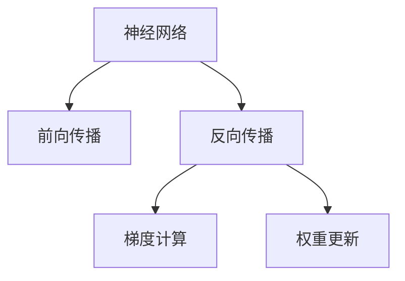

                 

## 1. 背景介绍

### 1.1 问题由来
深度学习模型的训练是通过反向传播算法实现的，反向传播的核心思想是：通过计算损失函数对模型参数的梯度，利用梯度下降等优化算法，调整模型参数，使得损失函数最小化。梯度是反向传播过程中最重要的概念，理解和计算梯度的过程，是深度学习模型训练的基础。

### 1.2 问题核心关键点
反向传播过程中的梯度计算，是整个训练流程的焦点。梯度不仅决定了每次参数更新的大小和方向，还直接影响着模型的收敛速度和泛化性能。为了确保梯度计算的正确性和效率，我们需要深入理解梯度的定义、计算和优化。

## 2. 核心概念与联系

### 2.1 核心概念概述

为了更好地理解反向传播中的梯度和权重更新，我们首先介绍几个关键概念：

- **神经网络(Neural Network, NN)**：由输入层、若干隐藏层和输出层构成的多层结构，通过前向传播计算预测结果，再通过反向传播更新模型参数。
- **损失函数(Loss Function)**：衡量模型预测输出与真实标签之间差异的函数，常用的损失函数包括均方误差、交叉熵等。
- **梯度(Gradient)**：损失函数对模型参数的偏导数，通过梯度，我们可以计算出每个参数对损失函数的贡献程度，从而指导参数更新。
- **权重更新规则**：利用梯度信息，结合优化算法，调整模型参数，常用的权重更新规则包括梯度下降、Adam、RMSprop等。

这些概念之间的逻辑关系可以通过以下Mermaid流程图来展示：



这个流程图展示了我们将要深入探讨的核心概念及其之间的关系：

1. 神经网络通过前向传播计算预测结果。
2. 反向传播计算损失函数对每个参数的梯度。
3. 根据梯度信息，利用权重更新规则调整模型参数。

## 3. 核心算法原理 & 具体操作步骤

### 3.1 算法原理概述

反向传播算法通过链式法则计算损失函数对每个参数的梯度，并利用梯度下降等优化算法，更新模型参数。具体步骤如下：

1. 将训练数据输入神经网络，通过前向传播计算预测结果。
2. 将预测结果与真实标签进行对比，计算损失函数。
3. 利用链式法则，自上而下计算损失函数对每个参数的偏导数（梯度）。
4. 根据梯度信息，选择优化算法更新模型参数。

### 3.2 算法步骤详解

反向传播算法主要分为梯度计算和权重更新两个步骤：

#### 3.2.1 梯度计算

梯度计算主要分为两个阶段：

1. **自顶向下**：计算输出层参数的梯度。
2. **自底向上**：根据输出层的梯度，逐层计算隐藏层参数的梯度。

具体计算过程如下：

1. **计算输出层梯度**：
   - 对于回归问题，损失函数为均方误差，梯度为：
     \[
     \frac{\partial L}{\partial z^{(L)}} = \frac{1}{m} \sum_{i=1}^{m} (y_i - \hat{y}_i) \frac{\partial \hat{y}_i}{\partial z^{(L)}}
     \]
   - 对于分类问题，损失函数为交叉熵，梯度为：
     \[
     \frac{\partial L}{\partial z^{(L)}} = \frac{1}{m} \sum_{i=1}^{m} \left( \frac{\partial L}{\partial y^{(L)}} \frac{\partial y^{(L)}}{\partial z^{(L)}} \right)
     \]
   其中，\( z^{(L)} \)表示输出层参数，\( y^{(L)} \)表示输出层激活值，\( \hat{y}_i \)表示第i个样本的预测值。

2. **计算隐藏层梯度**：
   - 对于第l层隐藏层，梯度为：
     \[
     \frac{\partial L}{\partial z^{(l)}} = \frac{1}{m} \sum_{i=1}^{m} \frac{\partial L}{\partial z^{(L)}} \frac{\partial z^{(L)}}{\partial h^{(L-1)}} \frac{\partial h^{(L-1)}}{\partial z^{(l)}}
     \]
   其中，\( h^{(l)} \)表示第l层隐藏层激活值。

3. **反向传播计算梯度**：
   - 将输出层和隐藏层的梯度递归地传递到输入层，完成整个网络的梯度计算。

#### 3.2.2 权重更新

权重更新主要使用优化算法，如梯度下降（Gradient Descent, GD）、Adam等。以梯度下降为例，权重更新公式如下：

\[
\theta_j = \theta_j - \alpha \frac{\partial L}{\partial \theta_j}
\]

其中，\( \theta_j \)表示第j个参数，\( \alpha \)为学习率，\( \frac{\partial L}{\partial \theta_j} \)表示损失函数对第j个参数的梯度。

### 3.3 算法优缺点

反向传播算法具有以下优点：

1. 自动化：通过反向传播算法，自动计算梯度，无需手动计算。
2. 可扩展性：适用于任意复杂的网络结构，可以处理大规模数据集。
3. 高效性：通过链式法则，梯度计算高效准确。

同时，反向传播算法也存在一些局限性：

1. 梯度消失/爆炸：在深层网络中，梯度可能消失或爆炸，导致参数更新困难。
2. 计算复杂度高：梯度计算需要遍历整个网络，计算量较大。
3. 对学习率敏感：学习率过高或过低，可能导致模型无法收敛或收敛速度过慢。

### 3.4 算法应用领域

反向传播算法广泛应用于深度学习模型的训练中，覆盖了图像识别、自然语言处理、语音识别等多个领域。例如：

1. **图像分类**：使用卷积神经网络（CNN），通过反向传播算法训练模型，在CIFAR-10、ImageNet等数据集上取得优异性能。
2. **语音识别**：使用循环神经网络（RNN），通过反向传播算法训练模型，在TIMIT、LibriSpeech等数据集上实现语音识别。
3. **机器翻译**：使用序列到序列模型（Seq2Seq），通过反向传播算法训练模型，在WMT等数据集上实现高质量的翻译。
4. **自然语言处理**：使用注意力机制和Transformer等模型，通过反向传播算法训练模型，在GLUE、CoLA等数据集上取得优异性能。

## 4. 数学模型和公式 & 详细讲解 & 举例说明

### 4.1 数学模型构建

本节将使用数学语言对反向传播的梯度计算过程进行严格的刻画。

假设神经网络由输入层、若干隐藏层和输出层构成，其中第l层有\( n^{(l)} \)个神经元，第l层的参数矩阵为\( W^{(l)} \)，激活函数为\( f_l \)，损失函数为\( L \)，训练数据集为\( \{(x_i, y_i)\}_{i=1}^{m} \)，其中\( x_i \)为输入，\( y_i \)为真实标签。

定义网络的第l层的输出为\( z^{(l)} \)，隐藏层的激活值为\( h^{(l)} \)，输出层的激活值为\( \hat{y} \)。

### 4.2 公式推导过程

以下我们以回归任务为例，推导反向传播算法中的梯度计算公式。

假设输出层有1个神经元，使用均方误差损失函数。定义输出层的参数为\( \theta^{(L)} \)，输出层的激活值为\( h^{(L)} \)，损失函数为\( L \)，训练数据集为\( \{(x_i, y_i)\}_{i=1}^{m} \)，其中\( x_i \)为输入，\( y_i \)为真实标签。

输出层的梯度计算公式如下：

\[
\frac{\partial L}{\partial \theta^{(L)}} = \frac{1}{m} \sum_{i=1}^{m} (y_i - \hat{y}_i) \frac{\partial \hat{y}_i}{\partial z^{(L)}} \frac{\partial z^{(L)}}{\partial \theta^{(L)}}
\]

其中，\( \hat{y}_i \)为第i个样本的预测值，\( \frac{\partial \hat{y}_i}{\partial z^{(L)}} \)为输出层激活函数的导数，\( \frac{\partial z^{(L)}}{\partial \theta^{(L)}} \)为输出层参数的偏导数。

输出层激活函数通常为线性函数或激活函数，其导数为常数1。因此，输出层的梯度计算公式可以简化为：

\[
\frac{\partial L}{\partial \theta^{(L)}} = \frac{1}{m} \sum_{i=1}^{m} (y_i - \hat{y}_i) \frac{\partial z^{(L)}}{\partial \theta^{(L)}}
\]

其中，\( \frac{\partial z^{(L)}}{\partial \theta^{(L)}} \)为输出层参数的偏导数。

对于隐藏层，梯度计算公式如下：

\[
\frac{\partial L}{\partial \theta^{(l)}} = \frac{1}{m} \sum_{i=1}^{m} \frac{\partial L}{\partial z^{(L)}} \frac{\partial z^{(L)}}{\partial h^{(L-1)}} \frac{\partial h^{(L-1)}}{\partial z^{(l)}} \frac{\partial z^{(l)}}{\partial \theta^{(l)}}
\]

其中，\( \frac{\partial z^{(l)}}{\partial \theta^{(l)}} \)为隐藏层参数的偏导数。

由于隐藏层的梯度计算较为复杂，通常需要使用数值计算方法进行求解。

### 4.3 案例分析与讲解

以一个简单的多层感知器（Multi-Layer Perceptron, MLP）为例，分析反向传播的梯度计算过程。

假设该MLP网络由3个全连接层组成，其中输入层有2个神经元，隐藏层有3个神经元，输出层有1个神经元。使用均方误差损失函数，训练数据集为\( \{(x_i, y_i)\}_{i=1}^{m} \)。

定义网络参数为：
- 输入层到隐藏层的参数矩阵为\( W_1 \)，激活函数为\( f_1 \)。
- 隐藏层到隐藏层的参数矩阵为\( W_2 \)，激活函数为\( f_2 \)。
- 隐藏层到输出层的参数矩阵为\( W_3 \)，激活函数为\( f_3 \)。

定义网络前向传播计算输出为：
- 隐藏层的输出为\( h^{(1)} = f_1(z^{(1)}) \)，其中\( z^{(1)} = W_1x \)。
- 隐藏层的输出为\( h^{(2)} = f_2(z^{(2)}) \)，其中\( z^{(2)} = W_2h^{(1)} \)。
- 输出层的输出为\( \hat{y} = f_3(z^{(3)}) \)，其中\( z^{(3)} = W_3h^{(2)} \)。

定义网络损失函数为：
- 均方误差损失函数：\( L = \frac{1}{2m} \sum_{i=1}^{m} (y_i - \hat{y}_i)^2 \)。

网络反向传播计算梯度的过程如下：

1. **输出层梯度计算**：
   - \( \frac{\partial L}{\partial \theta^{(3)}} = \frac{1}{m} \sum_{i=1}^{m} (y_i - \hat{y}_i) \frac{\partial \hat{y}_i}{\partial z^{(3)}} \frac{\partial z^{(3)}}{\partial \theta^{(3)}} \)
   其中，\( \frac{\partial \hat{y}_i}{\partial z^{(3)}} = 1 \)，\( \frac{\partial z^{(3)}}{\partial \theta^{(3)}} = W_3 \)。

2. **隐藏层2梯度计算**：
   - \( \frac{\partial L}{\partial \theta^{(2)}} = \frac{1}{m} \sum_{i=1}^{m} \frac{\partial L}{\partial z^{(3)}} \frac{\partial z^{(3)}}{\partial h^{(2)}} \frac{\partial h^{(2)}}{\partial z^{(2)}} \frac{\partial z^{(2)}}{\partial \theta^{(2)}} \)
   其中，\( \frac{\partial z^{(2)}}{\partial h^{(2)}} = W_2 \)，\( \frac{\partial h^{(2)}}{\partial z^{(2)}} = f_2'(z^{(2)}) \)，\( \frac{\partial z^{(2)}}{\partial \theta^{(2)}} = h^{(1)} \)。

3. **隐藏层1梯度计算**：
   - \( \frac{\partial L}{\partial \theta^{(1)}} = \frac{1}{m} \sum_{i=1}^{m} \frac{\partial L}{\partial z^{(3)}} \frac{\partial z^{(3)}}{\partial h^{(2)}} \frac{\partial h^{(2)}}{\partial z^{(2)}} \frac{\partial z^{(2)}}{\partial h^{(1)}} \frac{\partial h^{(1)}}{\partial z^{(1)}} \frac{\partial z^{(1)}}{\partial \theta^{(1)}} \)
   其中，\( \frac{\partial z^{(1)}}{\partial h^{(1)}} = W_1 \)，\( \frac{\partial h^{(1)}}{\partial z^{(1)}} = f_1'(z^{(1)}) \)，\( \frac{\partial z^{(1)}}{\partial \theta^{(1)}} = x \)。

通过以上计算，可以完成整个网络的梯度计算。根据梯度信息，使用优化算法更新网络参数。

## 5. 项目实践：代码实例和详细解释说明

### 5.1 开发环境搭建

在进行反向传播的梯度计算实践前，我们需要准备好开发环境。以下是使用Python进行TensorFlow开发的环境配置流程：

1. 安装Anaconda：从官网下载并安装Anaconda，用于创建独立的Python环境。

2. 创建并激活虚拟环境：
```bash
conda create -n tf-env python=3.8 
conda activate tf-env
```

3. 安装TensorFlow：根据CUDA版本，从官网获取对应的安装命令。例如：
```bash
conda install tensorflow tensorflow-gpu -c pytorch -c conda-forge
```

4. 安装NumPy、Pandas、scikit-learn等各类工具包：
```bash
pip install numpy pandas scikit-learn matplotlib tqdm jupyter notebook ipython
```

完成上述步骤后，即可在`tf-env`环境中开始反向传播梯度计算的实践。

### 5.2 源代码详细实现

这里我们以一个简单的多层感知器（Multi-Layer Perceptron, MLP）为例，给出使用TensorFlow进行反向传播梯度计算的Python代码实现。

```python
import tensorflow as tf
import numpy as np

# 定义输入和标签
x = tf.placeholder(tf.float32, shape=[None, 2])
y = tf.placeholder(tf.float32, shape=[None, 1])

# 定义隐藏层参数和输出层参数
W1 = tf.Variable(tf.random_normal([2, 3]))
W2 = tf.Variable(tf.random_normal([3, 3]))
W3 = tf.Variable(tf.random_normal([3, 1]))
b1 = tf.Variable(tf.zeros([3]))
b2 = tf.Variable(tf.zeros([3]))
b3 = tf.Variable(tf.zeros([1]))

# 定义隐藏层和输出层的激活函数
def activation(z):
    return tf.nn.relu(z)

# 定义前向传播计算输出
z1 = tf.matmul(x, W1) + b1
h1 = activation(z1)
z2 = tf.matmul(h1, W2) + b2
h2 = activation(z2)
z3 = tf.matmul(h2, W3) + b3
y_pred = activation(z3)

# 定义损失函数
y_true = tf.placeholder(tf.float32, shape=[None, 1])
loss = tf.losses.mean_squared_error(y_true, y_pred)

# 定义优化器
optimizer = tf.train.AdamOptimizer().minimize(loss)

# 训练模型
sess = tf.Session()
sess.run(tf.global_variables_initializer())

for i in range(1000):
    x_data = np.random.rand(10, 2)
    y_data = np.random.rand(10, 1)
    sess.run(optimizer, feed_dict={x: x_data, y: y_data, y_true: y_data})
```

### 5.3 代码解读与分析

让我们再详细解读一下关键代码的实现细节：

**TensorFlow库**：
- 使用TensorFlow库，我们可以方便地定义计算图、占位符、变量等。
- TensorFlow提供了一系列的优化算法，如Adam、SGD等，方便进行模型优化。

**前向传播计算输出**：
- 通过tf.matmul计算矩阵乘法，tf.add计算向量加法，tf.placeholder定义输入占位符，tf.Variable定义可训练变量。
- 使用activation函数计算激活值，实现神经网络的激活机制。

**损失函数和优化器**：
- 使用tf.losses.mean_squared_error计算均方误差损失，自动构建计算图。
- 使用tf.train.AdamOptimizer创建Adam优化器，用于更新模型参数。

**训练过程**：
- 使用tf.Session创建计算图会话，初始化变量。
- 循环训练模型，每次更新参数。
- 在每次迭代中，使用feed_dict将输入数据传递给模型。

通过以上代码实现，可以看到，使用TensorFlow进行反向传播梯度计算非常方便，只需要定义好计算图和优化器，即可进行模型训练。

## 6. 实际应用场景

### 6.1 智能推荐系统

反向传播算法在智能推荐系统中得到广泛应用。推荐系统需要根据用户的历史行为数据，预测其对新物品的兴趣评分，以实现个性化推荐。使用反向传播算法训练神经网络模型，可以根据用户行为数据和物品特征，学习用户-物品之间的关系，预测用户对新物品的评分。

在实践中，可以收集用户的行为数据（如浏览、点击、购买等），将物品特征（如商品类别、价格等）作为输入，构建神经网络模型，通过反向传播算法训练模型。训练后的模型可以实时处理用户行为数据，预测用户对新物品的评分，实现个性化推荐。

### 6.2 自动驾驶系统

反向传播算法在自动驾驶系统中也有重要应用。自动驾驶系统需要根据传感器数据和历史数据，预测车辆和行人的运动轨迹，以实现安全行驶。使用反向传播算法训练神经网络模型，可以根据传感器数据和历史数据，学习车辆和行人的运动规律，预测其运动轨迹，实现自动驾驶。

在实践中，可以收集车辆传感器数据（如摄像头、雷达等）和历史数据（如行驶轨迹、交通规则等），构建神经网络模型，通过反向传播算法训练模型。训练后的模型可以实时处理传感器数据，预测车辆和行人的运动轨迹，实现自动驾驶。

### 6.3 金融风控系统

反向传播算法在金融风控系统中也有重要应用。金融风控系统需要根据用户的历史行为数据和信用记录，评估其信用风险，以实现风险控制。使用反向传播算法训练神经网络模型，可以根据用户行为数据和信用记录，学习用户的行为模式，评估其信用风险，实现风控。

在实践中，可以收集用户的信用记录和行为数据，构建神经网络模型，通过反向传播算法训练模型。训练后的模型可以实时处理用户数据，评估其信用风险，实现风控。

## 7. 工具和资源推荐

### 7.1 学习资源推荐

为了帮助开发者系统掌握反向传播的理论基础和实践技巧，这里推荐一些优质的学习资源：

1. 《深度学习》（Ian Goodfellow等著）：涵盖了深度学习的基本概念和算法，包括反向传播、神经网络、优化算法等。

2. CS231n《卷积神经网络》课程：斯坦福大学开设的计算机视觉课程，讲解了卷积神经网络的前向传播和反向传播算法，是理解深度学习的基础。

3. TensorFlow官方文档：TensorFlow的官方文档，详细介绍了TensorFlow的使用方法，包括前向传播和反向传播算法。

4. PyTorch官方文档：PyTorch的官方文档，详细介绍了PyTorch的使用方法，包括前向传播和反向传播算法。

5. Coursera《深度学习专项课程》：由吴恩达教授主讲，详细讲解了深度学习的基本概念和算法，包括反向传播、神经网络、优化算法等。

通过对这些资源的学习实践，相信你一定能够快速掌握反向传播的精髓，并用于解决实际的深度学习问题。

### 7.2 开发工具推荐

高效的开发离不开优秀的工具支持。以下是几款用于反向传播梯度计算开发的常用工具：

1. TensorFlow：由Google主导开发的开源深度学习框架，生产部署方便，适合大规模工程应用。

2. PyTorch：由Facebook主导开发的开源深度学习框架，灵活动态的计算图，适合快速迭代研究。

3. MXNet：由亚马逊主导开发的深度学习框架，支持分布式计算，适合大规模数据处理。

4. Keras：高层次的深度学习框架，基于TensorFlow、Theano等底层框架，适合快速原型开发。

5. Caffe：由Berkeley大学主导开发的深度学习框架，适合图像识别等应用。

合理利用这些工具，可以显著提升反向传播梯度计算任务的开发效率，加快创新迭代的步伐。

### 7.3 相关论文推荐

反向传播算法的发展源于学界的持续研究。以下是几篇奠基性的相关论文，推荐阅读：

1. "Backpropagation: A Method of Implementing a Backward Pass Algorithm for Learning from Examples"（Rumelhart等，1986）：提出反向传播算法，奠定了深度学习的基础。

2. "Learning Representations by Back-Propagating Errors"（Rumelhart等，1985）：进一步发展了反向传播算法，详细介绍了神经网络的实现。

3. "The Learning Problem"（Werbos，1990）：提出反向传播算法的理论基础，详细讲解了神经网络的数学模型。

4. "Backpropagation algorithms"（Hinton等，1990）：详细介绍了反向传播算法在不同网络结构中的应用。

5. "Training deep neural networks"（Zeiler，2012）：详细介绍了深度学习网络的前向传播和反向传播算法。

这些论文代表了大规模深度学习算法的发展脉络。通过学习这些前沿成果，可以帮助研究者把握学科前进方向，激发更多的创新灵感。

## 8. 总结：未来发展趋势与挑战

### 8.1 总结

本文对反向传播算法进行了全面系统的介绍。首先阐述了反向传播算法的基本原理和数学推导，明确了梯度计算和权重更新的过程。其次，从理论到实践，详细讲解了反向传播的数学模型和代码实现，给出了反向传播梯度计算的完整代码实例。同时，本文还广泛探讨了反向传播算法在多个行业领域的应用前景，展示了其在深度学习模型训练中的重要价值。

通过本文的系统梳理，可以看到，反向传播算法是深度学习模型训练的核心，理解其原理和实现方法，是掌握深度学习技术的基础。反向传播算法不仅适用于各种神经网络结构，还支持大规模数据集和分布式计算，具有广泛的应用前景。

### 8.2 未来发展趋势

展望未来，反向传播算法将呈现以下几个发展趋势：

1. 模型并行和分布式计算：随着大规模深度学习模型的出现，反向传播算法需要支持更高效的计算方式，如模型并行、分布式计算等，以适应更复杂的网络结构和大规模数据集。

2. 自适应优化算法：传统的优化算法，如Adam、SGD等，已经不能满足大规模模型的训练需求。未来需要更多的自适应优化算法，如自适应矩估计（Adaptive Moment Estimation, AdamW）、自适应动态更新（Adaptive Dynamic Update, ADA）等，以进一步提升训练效率和性能。

3. 梯度优化技术：传统的梯度优化技术，如梯度累积、梯度截断等，已经不能满足复杂模型的训练需求。未来需要更多的梯度优化技术，如梯度差分、梯度融合等，以进一步提升梯度计算的准确性和效率。

4. 优化器融合与创新：未来的优化器将会融合更多的新技术和新思想，如因果推理、博弈论等，以提升模型的泛化能力和鲁棒性。

5. 多任务学习：多任务学习（Multi-task Learning, MTL）能够同时训练多个相关任务，提升模型在不同任务上的性能。未来需要更多的多任务学习算法，以进一步提升模型的迁移能力和泛化性能。

以上趋势凸显了反向传播算法的广阔前景。这些方向的探索发展，必将进一步提升深度学习模型的训练效率和性能，推动深度学习技术的不断进步。

### 8.3 面临的挑战

尽管反向传播算法已经取得了瞩目成就，但在迈向更加智能化、普适化应用的过程中，它仍面临着诸多挑战：

1. 计算资源瓶颈：大规模深度学习模型的训练需要大量的计算资源，传统的计算硬件已经不能满足需求。需要更多的分布式计算框架和硬件支持。

2. 模型复杂度挑战：随着深度学习模型的规模不断增大，反向传播算法的计算复杂度也随之增加，需要更多的优化技术支持。

3. 参数更新挑战：大规模深度学习模型的参数更新需要更高效的算法和硬件支持，传统的优化算法已经不能满足需求。

4. 模型泛化性能挑战：大规模深度学习模型容易过拟合，需要更多的正则化和梯度优化技术支持。

5. 模型解释性和可控性挑战：深度学习模型的训练过程存在诸多黑箱问题，难以解释模型的决策过程。未来需要更多的模型解释技术支持。

6. 数据隐私和伦理挑战：深度学习模型的训练需要大量的标注数据，这些数据可能涉及隐私问题。需要更多的数据隐私保护技术支持。

正视反向传播算法面临的这些挑战，积极应对并寻求突破，将是大规模深度学习算法发展的必由之路。相信随着学界和产业界的共同努力，这些挑战终将一一被克服，反向传播算法必将在构建智能系统方面发挥更大的作用。

### 8.4 研究展望

面对反向传播算法所面临的种种挑战，未来的研究需要在以下几个方面寻求新的突破：

1. 探索更高效的优化算法：开发更高效的优化算法，提升训练效率和模型性能。

2. 研究更好的正则化技术：引入更好的正则化技术，防止模型过拟合，提升模型的泛化能力。

3. 研究更好的梯度优化技术：引入更好的梯度优化技术，提升梯度计算的准确性和效率。

4. 研究更好的多任务学习算法：引入更好的多任务学习算法，提升模型在不同任务上的性能。

5. 研究更好的模型解释技术：引入更好的模型解释技术，提升模型的可解释性和可控性。

6. 研究更好的数据隐私保护技术：引入更好的数据隐私保护技术，保护训练数据的隐私性。

这些研究方向的探索，必将引领反向传播算法的不断进步，推动深度学习技术的不断发展。面向未来，反向传播算法需要在计算效率、模型性能、模型可解释性和数据隐私等方面进行更多探索，才能更好地应用于智能系统的构建。

## 9. 附录：常见问题与解答

**Q1：反向传播算法是否适用于所有深度学习模型？**

A: 反向传播算法适用于任意深度学习模型，包括卷积神经网络（CNN）、循环神经网络（RNN）、自编码器（AE）等。不同类型的深度学习模型，其前向传播和反向传播的计算方式略有不同，但基本原理是一致的。

**Q2：反向传播算法是否需要手动计算梯度？**

A: 一般情况下，反向传播算法可以自动计算梯度，无需手动计算。使用TensorFlow、PyTorch等深度学习框架，可以方便地定义计算图和优化器，自动计算梯度并更新参数。

**Q3：反向传播算法是否可以应用于分布式计算？**

A: 是的，反向传播算法可以应用于分布式计算。通过使用分布式计算框架，如TensorFlow分布式、PyTorch分布式等，可以并行计算梯度和更新参数，提升计算效率。

**Q4：反向传播算法是否存在计算复杂度高的问题？**

A: 是的，反向传播算法需要计算整个网络的梯度，计算复杂度较高。通过使用模型并行、梯度累积等技术，可以进一步提升反向传播算法的效率。

**Q5：反向传播算法是否存在参数更新困难的问题？**

A: 是的，反向传播算法可能存在梯度消失或爆炸的问题，导致参数更新困难。使用梯度截断、梯度差分等技术，可以进一步提升反向传播算法的稳定性。

这些问题的解答，帮助开发者更好地理解反向传播算法的原理和应用，可以进一步提升深度学习模型的训练效率和性能。总之，反向传播算法是深度学习模型训练的核心，理解其原理和实现方法，是掌握深度学习技术的基础。反向传播算法不仅适用于各种神经网络结构，还支持大规模数据集和分布式计算，具有广泛的应用前景。面向未来，反向传播算法需要在计算效率、模型性能、模型可解释性和数据隐私等方面进行更多探索，才能更好地应用于智能系统的构建。

---

作者：禅与计算机程序设计艺术 / Zen and the Art of Computer Programming

