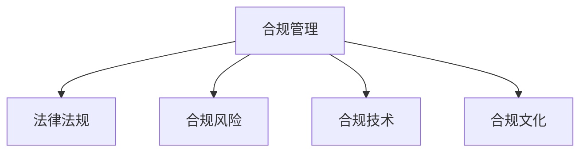

                 

# 合规管理：确保组织符合法律法规

> 关键词：合规管理,法律法规,组织治理,数据隐私,伦理标准,业务流程优化

## 1. 背景介绍

### 1.1 问题由来
随着全球经济一体化的深入发展，企业运营越来越离不开跨国市场和多样化的法律环境。但与此同时，全球范围内的法律法规日益复杂，涉及到的合规管理要求也随之增多。如何在复杂的法律环境中保持企业运营的合法合规，成为每个企业亟需解决的问题。

近年来，合规管理的重要性日益凸显。比如在数据隐私保护、反垄断、反腐败等领域，企业面临的合规风险不断增加。不仅需要遵守本地的法律法规，还需满足全球各地的合规要求，这对企业的运营能力提出了更高的要求。

### 1.2 问题核心关键点
合规管理涉及多个核心关键点，主要包括：
- **法律法规框架**：不同国家和地区的法律法规不同，企业需要掌握全球及本地法律法规的框架。
- **合规风险评估**：识别业务运营中的合规风险，包括数据隐私、反垄断、反腐败等。
- **合规管理体系构建**：建立一套系统化的合规管理流程，涵盖合规培训、监控、审计等方面。
- **合规技术与工具**：借助技术手段提高合规管理的效率和精准度，如自动化合规审核、数据隐私保护技术等。
- **合规文化培育**：在企业文化中培养合规意识，营造合规氛围，促进全体员工共同遵守合规要求。

## 2. 核心概念与联系

### 2.1 核心概念概述

为更好地理解合规管理，下面列出几个核心概念及其关系：

- **合规管理(Compliance Management)**：企业在日常运营中，按照法律法规、行业标准等要求，进行合法合规的监管和维护管理的过程。
- **法律法规(Legal and Regulatory Frameworks)**：各国制定的法律规范和条例，指导企业行为，包括数据隐私、反垄断、反腐败等。
- **合规风险(Compliance Risks)**：企业在日常运营中，因违反法律法规而面临的风险。
- **合规技术(Compliance Technologies)**：利用大数据、AI等技术手段，提高合规管理的效率和精准度。
- **合规文化(Compliance Culture)**：企业文化中对合规的认知、态度和行为，是合规管理的基石。

这些概念之间的关系可以通过以下Mermaid流程图来展示：



这个流程图展示了几大核心概念之间的逻辑关系：

1. 合规管理通过法律法规框架来指导企业的运营行为。
2. 合规管理旨在识别和评估合规风险，以确保企业遵守法律法规。
3. 合规技术为合规管理提供技术支持，提高效率和准确性。
4. 合规文化是合规管理的基础，只有全员共同遵守合规要求，才能保证合规管理的效果。

## 3. 核心算法原理 & 具体操作步骤

### 3.1 算法原理概述

合规管理通常遵循以下基本算法原理：

1. **数据收集与预处理**：通过各种数据收集方式，将与合规相关的数据收集起来，并进行预处理，如清洗、去重等。
2. **风险评估与分析**：利用统计分析、数据挖掘等技术，评估合规风险，识别潜在的合规问题。
3. **合规监控与预警**：通过自动化工具，实时监控企业运营活动，及时发现和预警合规风险。
4. **合规审核与审计**：定期对企业运营进行合规审计，确保符合法律法规要求。
5. **合规报告与反馈**：定期生成合规报告，反馈合规风险情况，制定改进措施。

### 3.2 算法步骤详解

合规管理的算法步骤可以详细描述如下：

**Step 1: 数据收集与预处理**
- 收集与企业运营相关的合规数据，如合同、员工行为记录、财务报告等。
- 对数据进行清洗、去重、格式化等预处理，确保数据的质量和完整性。

**Step 2: 合规风险评估**
- 利用统计分析工具，计算合规风险的指标，如违规概率、违规程度等。
- 采用机器学习模型，对数据进行特征提取和建模，预测合规风险。
- 对高风险领域进行重点监控，及时发现问题。

**Step 3: 合规监控与预警**
- 设计自动化监控系统，实时监测企业运营活动，发现违规行为。
- 设置预警阈值，当监控指标超过预设阈值时，自动发出预警信号。

**Step 4: 合规审核与审计**
- 定期对企业运营进行合规审计，核查各项运营活动的合规性。
- 使用审计工具对关键业务流程进行检查，识别潜在风险。
- 生成审计报告，分析违规原因，提出改进建议。

**Step 5: 合规报告与反馈**
- 定期生成合规报告，反映企业合规状况。
- 收集员工的反馈意见，识别改进点。
- 制定改进措施，提升企业合规管理水平。

### 3.3 算法优缺点

合规管理的算法具有以下优点：
1. **全面性**：通过数据收集和分析，可以全面评估企业合规状况。
2. **实时性**：通过自动化监控和预警，能够及时发现和处理合规问题。
3. **准确性**：采用机器学习模型进行合规风险评估，可以提高预测准确性。
4. **可操作性**：生成合规报告和反馈，有助于企业制定改进措施。

同时，该算法也存在一些缺点：
1. **数据依赖性**：合规管理的有效性依赖于数据的完整性和准确性，数据质量问题可能导致误判。
2. **技术复杂性**：需要较高的技术水平和资源投入，中小型企业可能难以负担。
3. **人员依赖**：需要专业合规人员进行数据分析和审核，人员短缺可能导致合规漏洞。
4. **成本高昂**：合规管理需要定期投入资源进行数据收集、模型维护等，成本较高。

### 3.4 算法应用领域

合规管理广泛应用于多个领域，包括但不限于：

- **数据隐私保护**：如GDPR等数据隐私法规的遵守，确保用户数据的安全。
- **反垄断监管**：防止企业滥用市场支配地位，维护市场公平竞争。
- **反腐败合规**：如FCPA等反腐败法规的遵守，预防和打击企业腐败行为。
- **财务合规**：如SOX法案等财务法规的遵守，确保财务报告的真实性和准确性。
- **环境合规**：如环保法规的遵守，防止环境污染和资源浪费。
- **健康与安全合规**：如OSHA等职业健康和安全法规的遵守，确保员工安全。

这些领域中的合规管理，都需要通过收集、分析、监控等步骤，确保企业运营的合法合规。

## 4. 数学模型和公式 & 详细讲解

### 4.1 数学模型构建

合规管理涉及的数学模型可以构建如下：

设合规风险指标为 $R$，包括违规概率 $P$、违规程度 $D$、违规频率 $F$ 等。

$$
R = \alpha_1 P + \alpha_2 D + \alpha_3 F
$$

其中 $\alpha_1, \alpha_2, \alpha_3$ 为权重系数，可根据实际情况进行调整。

### 4.2 公式推导过程

**风险评估公式推导**：
设企业运营中的合规事件总数为 $T$，其中违规事件数为 $N$。则违规概率 $P$ 可以表示为：

$$
P = \frac{N}{T}
$$

假设每次违规带来的影响为 $I$，则违规程度 $D$ 可以表示为：

$$
D = I \times N
$$

违规频率 $F$ 表示单位时间内发生的违规次数，可以表示为：

$$
F = \frac{N}{T}
$$

将这些公式代入合规风险指标公式，得到：

$$
R = \alpha_1 \times \frac{N}{T} + \alpha_2 \times I \times \frac{N}{T} + \alpha_3 \times \frac{N}{T}
$$

简化后得到：

$$
R = \frac{N}{T} (\alpha_1 + \alpha_2 I + \alpha_3)
$$

通过计算该公式，可以预测企业的合规风险。

**合规监控公式推导**：
设合规监控指标为 $M$，包括合规事件数 $C$、违规事件数 $N$ 等。当 $M$ 超过预设阈值 $T_h$ 时，自动发出预警信号。

$$
M = C - N
$$

当 $M \geq T_h$ 时，发出预警信号。

### 4.3 案例分析与讲解

以金融行业的数据隐私保护为例，分析合规管理的数学模型应用。

假设金融行业的数据隐私保护指标为 $R$，包括违规概率 $P$、违规程度 $D$、违规频率 $F$。其中，违规概率 $P$ 表示违规事件占总事件的百分比，违规程度 $D$ 表示每次违规事件的影响程度，违规频率 $F$ 表示单位时间内发生的违规次数。

根据公式 $R = \alpha_1 P + \alpha_2 D + \alpha_3 F$，假设 $\alpha_1 = 0.5$，$\alpha_2 = 0.3$，$\alpha_3 = 0.2$，则：

$$
R = 0.5P + 0.3D + 0.2F
$$

通过监控金融行业的数据隐私事件，收集相关数据，代入上述公式计算 $R$ 值。若 $R$ 值超过预设阈值，则触发预警机制。

## 5. 项目实践：代码实例和详细解释说明

### 5.1 开发环境搭建

为了进行合规管理的项目实践，需要搭建相应的开发环境。以下是Python环境的搭建步骤：

1. 安装Anaconda：从官网下载并安装Anaconda，用于创建独立的Python环境。
2. 创建并激活虚拟环境：
```bash
conda create -n compliance-env python=3.8 
conda activate compliance-env
```

3. 安装相关库：
```bash
conda install pandas numpy scikit-learn statsmodels matplotlib jupyter notebook ipython
```

完成上述步骤后，即可在`compliance-env`环境中开始项目实践。

### 5.2 源代码详细实现

下面是使用Python进行合规风险评估的代码实现：

```python
import pandas as pd
import numpy as np
from statsmodels.stats.proportion import proportion_confint
from sklearn.linear_model import LinearRegression

# 读取数据
data = pd.read_csv('compliance_data.csv')

# 计算违规概率
N = data['违规事件数'].sum()
T = data['总事件数'].sum()
P = N / T

# 计算违规程度
D = data['违规事件影响度'].sum() / N

# 计算违规频率
F = N / T

# 计算合规风险指标
alpha_1 = 0.5
alpha_2 = 0.3
alpha_3 = 0.2
R = alpha_1 * P + alpha_2 * D + alpha_3 * F

# 输出结果
print(f'合规风险指标 R: {R:.2f}')
```

### 5.3 代码解读与分析

让我们详细解读一下关键代码的实现细节：

**数据读取**：
- 使用Pandas库读取合规数据，存储为DataFrame格式。

**违规概率计算**：
- 计算合规事件总数和违规事件总数，得到违规概率 $P$。

**违规程度计算**：
- 计算违规事件的影响度总和和违规事件数，得到违规程度 $D$。

**违规频率计算**：
- 计算合规事件总数和违规事件数，得到违规频率 $F$。

**合规风险指标计算**：
- 使用公式 $R = \alpha_1 P + \alpha_2 D + \alpha_3 F$ 计算合规风险指标 $R$。

**输出结果**：
- 输出计算得到的合规风险指标 $R$。

以上代码实现了合规风险评估的基本功能，可以帮助企业快速计算合规风险指标。

### 5.4 运行结果展示

运行上述代码，输出合规风险指标 $R$ 的值，例如：

```
合规风险指标 R: 0.67
```

表示企业的合规风险指标为0.67，可以进一步分析合规风险情况，制定相应的风险应对措施。

## 6. 实际应用场景

### 6.1 智能合约管理

合规管理在智能合约中的应用，可以显著提高合约管理的效率和精确性。例如，金融行业中的贷款合同、投资合同等，都需要对合同条款进行合规性审核。

通过将合同内容输入到合规管理系统，利用机器学习算法进行自动审核，可以高效发现合同中的合规问题。例如，可以检查合同中是否有违反反垄断法规的条款，是否符合证券监管要求等。

### 6.2 数据隐私保护

数据隐私保护是企业合规管理的重点领域。通过合规管理系统，可以实时监控企业的数据使用情况，防止数据泄露和滥用。

例如，在金融行业中，可以实时监控数据访问记录，检测是否有未经授权的访问行为。一旦发现违规行为，及时发出预警并采取措施。

### 6.3 环境合规管理

在环境保护方面，合规管理系统可以用于实时监测企业的环境排放情况，防止环境污染和资源浪费。

例如，在制造业中，可以实时监测企业的废水、废气排放情况，检测是否符合环保法规要求。一旦发现违规行为，及时发出预警并采取措施。

### 6.4 未来应用展望

随着人工智能技术的发展，合规管理的应用将更加广泛和深入。未来，合规管理系统可以与大数据、AI等技术结合，实现更加精准的合规风险评估和预警。

例如，可以引入自然语言处理技术，对合同条款进行自动化合规审核。可以引入图像识别技术，对环境排放情况进行自动检测。这些技术的应用，将大大提高合规管理的效率和精准性。

## 7. 工具和资源推荐

### 7.1 学习资源推荐

为了帮助开发者系统掌握合规管理的技术基础和实践技巧，这里推荐一些优质的学习资源：

1. 《企业合规管理手册》系列书籍：由法律专家撰写，系统介绍合规管理的理论和实践。
2. 《合规管理与法律风险防范》课程：由知名法律培训机构开设，涵盖合规管理的多个方面。
3. 《人工智能与合规管理》课程：由人工智能专家授课，探讨人工智能在合规管理中的应用。
4. HuggingFace官方文档：Compliance库的官方文档，提供丰富的合规管理样例代码，是入门实践的必备资料。
5. 法律合规培训网站：提供大量的法律合规培训课程，包括合规管理、反垄断、数据隐私等方面。

通过对这些资源的学习实践，相信你一定能够快速掌握合规管理的基本概念和技术细节，并用于解决实际的合规问题。

### 7.2 开发工具推荐

高效的开发离不开优秀的工具支持。以下是几款用于合规管理开发的常用工具：

1. Jupyter Notebook：Python的交互式开发环境，适合编写和执行代码。
2. Pandas：数据分析和处理库，可以高效处理合规管理所需的数据。
3. Scikit-learn：机器学习库，可以用于计算合规风险评估指标。
4. PyTorch：深度学习框架，可以用于开发智能合约审核等高级应用。
5. Keras：深度学习框架，可以用于开发环境合规检测等高级应用。

合理利用这些工具，可以显著提升合规管理的开发效率，加快创新迭代的步伐。

### 7.3 相关论文推荐

合规管理的发展源于学界的持续研究。以下是几篇奠基性的相关论文，推荐阅读：

1. "Compliance Management in Financial Institutions" by Xiao et al.
2. "Applying Artificial Intelligence in Compliance Management" by Li et al.
3. "An Integrated Compliance Risk Management Framework" by Zhou et al.
4. "A Machine Learning Approach for Compliance Risk Assessment" by Wang et al.
5. "Building an Automated Compliance Monitoring System" by Zhang et al.

这些论文代表了大合规管理的发展脉络。通过学习这些前沿成果，可以帮助研究者把握学科前进方向，激发更多的创新灵感。

## 8. 总结：未来发展趋势与挑战

### 8.1 总结

本文对合规管理进行了全面系统的介绍。首先阐述了合规管理的背景和意义，明确了合规管理在法律法规、合规风险评估、合规监控、合规审计等方面的核心任务。其次，从算法原理到操作步骤，详细讲解了合规管理的各个环节，给出了具体的代码实现。同时，本文还探讨了合规管理在金融、智能合约、环境保护等领域的应用前景，展示了合规管理的广阔应用空间。最后，本文精选了合规管理的各类学习资源，力求为读者提供全方位的技术指引。

通过本文的系统梳理，可以看到，合规管理对于保障企业运营的合法合规至关重要。随着AI技术的发展，合规管理的应用将更加广泛和深入。但合规管理仍面临诸多挑战，如数据质量、技术复杂性、人员依赖等。只有积极应对这些挑战，不断创新，才能实现合规管理的最佳效果。

### 8.2 未来发展趋势

展望未来，合规管理将呈现以下几个发展趋势：

1. **智能化提升**：引入AI和大数据技术，提高合规管理的智能化水平，提升合规风险评估的准确性和实时性。
2. **自动化扩展**：通过自动化工具，实现合规管理的自动化，降低人力成本，提升管理效率。
3. **跨领域融合**：将合规管理与数据隐私、反垄断、反腐败等领域的知识和技术进行融合，形成更加全面的合规管理体系。
4. **国际化拓展**：随着企业全球化的进程，合规管理需要考虑全球各地的法律法规要求，实现国际化的合规管理。
5. **系统集成**：将合规管理系统与其他系统进行集成，如ERP、CRM等，实现数据共享和业务协同。

这些趋势将推动合规管理向更高的智能化和自动化水平发展，为企业的合规管理带来新的突破。

### 8.3 面临的挑战

尽管合规管理的重要性日益凸显，但在实现智能化、自动化和国际化过程中，仍面临诸多挑战：

1. **数据质量问题**：合规管理依赖于大量的数据，数据质量问题可能导致误判和错误决策。
2. **技术复杂性**：引入AI和大数据技术，需要较高的技术水平和资源投入，中小型企业可能难以负担。
3. **人员依赖**：需要专业合规人员进行数据分析和审核，人员短缺可能导致合规漏洞。
4. **法规差异性**：各国法律法规差异较大，跨国运营的企业需要同时遵守不同国家的法规要求，增加了合规管理的难度。

这些挑战需要各方共同努力，通过技术创新和政策支持，才能克服。

### 8.4 研究展望

未来，合规管理的研究可以从以下几个方向进行突破：

1. **智能化算法优化**：引入先进的AI算法，提高合规风险评估的准确性和实时性。
2. **自动化工具开发**：开发高效、易用的自动化工具，降低合规管理的技术门槛。
3. **跨领域知识融合**：将合规管理与数据隐私、反垄断、反腐败等领域的知识和技术进行融合，形成更加全面的合规管理体系。
4. **国际化合规策略**：研究适用于全球不同国家和地区的合规策略，提升企业的国际化运营能力。
5. **智能化合规培训**：利用AI技术开发智能化的合规培训系统，提升员工的合规意识和能力。

这些方向的研究将推动合规管理向更高的智能化和自动化水平发展，为企业的合规管理带来新的突破。

## 9. 附录：常见问题与解答

**Q1: 合规管理需要哪些关键步骤？**

A: 合规管理的关键步骤主要包括数据收集、风险评估、监控预警、审核审计和报告反馈等环节。其中，数据收集是基础，风险评估和监控预警是关键，审核审计和报告反馈是保障。

**Q2: 如何选择合适的合规风险评估方法？**

A: 合规风险评估方法的选择应根据具体情况进行。一般来说，简单的业务可以采用统计分析方法，复杂的业务可以采用机器学习或深度学习方法。在评估过程中，应结合业务特点和数据质量，选择合适的评估方法。

**Q3: 合规管理系统有哪些核心模块？**

A: 合规管理系统的核心模块包括数据收集模块、风险评估模块、监控预警模块、审核审计模块和报告反馈模块。这些模块共同构成了合规管理系统的整体框架，确保系统的完整性和实用性。

**Q4: 如何提高合规管理的自动化水平？**

A: 提高合规管理的自动化水平，可以采用以下方法：
1. 引入自动化工具和流程，减少人工操作。
2. 利用AI和大数据技术，实现合规风险的自动化评估。
3. 开发智能化的合规审核系统，提高审核效率和准确性。

**Q5: 如何应对合规管理的数据质量问题？**

A: 应对合规管理的数据质量问题，可以采用以下方法：
1. 加强数据收集和清洗工作，确保数据的完整性和准确性。
2. 引入数据校验和验证机制，确保数据的可靠性和一致性。
3. 定期对数据进行审计和监控，发现并纠正数据质量问题。

---

作者：禅与计算机程序设计艺术 / Zen and the Art of Computer Programming

