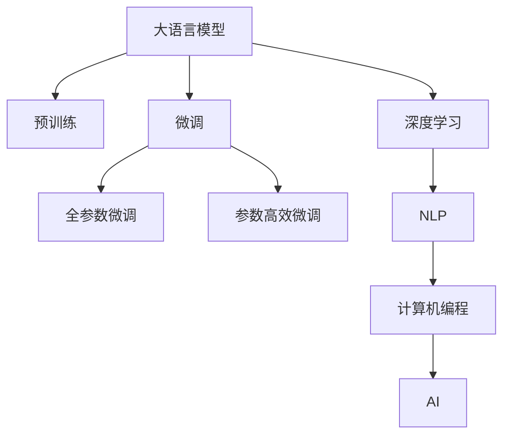

                 

# 员工培训计划：LLM 定制学习课程

> 关键词：大语言模型(LLM), 定制学习课程, 语言模型定制, 深度学习, 自然语言处理(NLP), 计算机编程, 人工智能(AI)

## 1. 背景介绍

### 1.1 问题由来

随着人工智能(AI)技术的迅速发展，大语言模型(LLM)在自然语言处理(NLP)领域展现出强大的能力。LLM通过在庞大的语料库上进行预训练，学习到丰富的语言知识和常识，能够处理各种复杂的语言任务，如图像描述、文本生成、问答、翻译等。

然而，LLM在实际应用中仍面临一些挑战：

- **资源限制**：大模型通常需要巨大的计算资源和存储资源，部署和维护成本较高。
- **任务适配**：不同应用场景中的任务需求各异，通用模型难以直接应用。
- **性能提升**：即使在大规模数据集上进行预训练，模型仍需进一步优化以适应特定任务。
- **伦理问题**：模型可能存在偏见，需要在设计和应用中加以考量。

为解决上述问题，定制化培训计划成为提升员工在特定领域应用LLM的关键。通过定制学习课程，员工能够掌握如何使用LLM技术解决实际问题，提高工作效率和决策质量。

### 1.2 问题核心关键点

1. **任务需求分析**：根据应用场景，明确任务需求，确定定制化课程的核心内容和目标。
2. **课程设计**：设计系统化的课程结构，包括基础知识、实践技能和案例分析等模块。
3. **工具选择**：选择合适的编程语言和开发工具，如Python、PyTorch、TensorFlow等，以支持课程实施。
4. **实战演练**：通过实战项目，让员工在实际应用中检验和提升技能。
5. **伦理与安全**：强调模型开发和应用中的伦理问题，确保安全性和公正性。

本培训计划旨在通过一系列系统化的课程，使员工能够熟练掌握LLM在特定任务中的应用，提升团队整体技术水平和业务能力。

## 2. 核心概念与联系

### 2.1 核心概念概述

为更好地理解定制化培训计划，本节将介绍几个关键概念及其之间的联系：

- **大语言模型(LLM)**：以自回归(如GPT)或自编码(如BERT)为代表的大规模预训练语言模型，具有强大的语言理解和生成能力。
- **预训练与微调**：预训练通过在无标签数据上训练模型，学习通用语言表示；微调则通过有标签数据进一步优化模型，适应特定任务。
- **深度学习**：基于神经网络等技术，通过多层学习以提取和表示数据特征。
- **自然语言处理(NLP)**：研究如何让计算机理解和处理人类语言，包括文本处理、语音识别、机器翻译等。
- **计算机编程**：涉及算法设计、数据结构、程序优化等，是实现LLM应用的必要技能。
- **人工智能(AI)**：涵盖感知、学习、推理、规划等多方面，目标是通过智能系统模拟人类思维和行为。

这些概念之间的逻辑关系可以通过以下Mermaid流程图来展示：

该流程图展示了大语言模型的工作原理和与其他技术之间的联系：

1. 大语言模型通过预训练获得基础能力。
2. 微调是对预训练模型进行任务特定的优化，可以分为全参数微调和参数高效微调（PEFT）。
3. 深度学习是实现LLM的重要技术基础。
4. 自然语言处理是大语言模型的应用领域，涉及多种NLP任务。
5. 计算机编程是实现和部署LLM的核心技术。
6. 人工智能是LLM技术的目标和应用方向。

这些核心概念共同构成了LLM的学术和技术框架，使其能够在各种场景下发挥强大的语言理解和生成能力。

## 3. 核心算法原理 & 具体操作步骤

### 3.1 算法原理概述

定制化培训计划的核心是基于深度学习的定制化课程，旨在通过系统化的学习和实战演练，使员工掌握LLM在特定任务中的应用。

**算法原理**：
1. **任务需求分析**：通过需求调研和问题定义，明确任务目标和所需技能。
2. **课程设计**：设计包含基础知识、实践技能和案例分析的课程结构，确保全面覆盖。
3. **工具选择**：选择合适的编程语言和开发工具，支持课程实施。
4. **实战演练**：通过实战项目，让员工在实际应用中检验和提升技能。
5. **评估反馈**：通过定期测试和评估，及时发现和解决问题，持续改进课程内容。

**具体操作步骤**：
1. **需求调研**：与业务部门协作，识别培训需求和目标任务。
2. **课程规划**：根据需求调研结果，制定详细的课程大纲。
3. **资源准备**：准备课程所需的软件、数据集和工具。
4. **授课实施**：组织系统化的课程讲授和实践操作。
5. **实战项目**：设计与实际任务相关的实战项目，让员工在真实环境中应用所学知识。
6. **评估反馈**：通过测试和评估，收集反馈信息，优化课程内容和方法。

### 3.2 算法步骤详解

**步骤1：需求调研与任务定义**
- **需求调研**：与业务部门沟通，了解其在特定任务中的需求和痛点。
- **任务定义**：根据调研结果，明确任务目标、输入输出格式、评价指标等。

**步骤2：课程设计**
- **基础理论**：介绍大语言模型的基本原理、架构和应用场景。
- **实践技能**：讲解如何利用Python、PyTorch、TensorFlow等工具进行模型开发和优化。
- **案例分析**：通过具体案例，展示模型在实际任务中的应用和效果。

**步骤3：工具选择与环境搭建**
- **编程语言**：选择Python，因其易于学习且功能强大。
- **开发工具**：选择PyTorch或TensorFlow，支持深度学习模型的快速开发和训练。
- **开发环境**：搭建Python环境，安装必要的库和依赖。

**步骤4：授课实施**
- **理论讲授**：通过视频课程、讲义和实验指导，系统讲解课程内容。
- **实践操作**：组织实验室实践，让员工动手编写代码、训练模型并进行评估。
- **案例讲解**：通过案例分析和演示，展示模型在实际任务中的应用效果。

**步骤5：实战项目**
- **项目设计**：设计符合实际需求的实战项目，确保项目具有挑战性和实用性。
- **项目管理**：分阶段进行项目管理和进度跟踪，确保项目按计划完成。
- **项目评估**：通过项目评审和成果展示，评估员工技能和项目效果。

**步骤6：评估反馈与持续改进**
- **测试评估**：设计测试题目和评估标准，评估员工掌握的知识和技能。
- **反馈收集**：通过问卷调查、面谈等方式，收集员工对课程的反馈意见。
- **课程优化**：根据评估和反馈结果，调整课程内容和方法，持续改进培训效果。

### 3.3 算法优缺点

**优点**：
- **针对性**：根据具体任务需求设计课程，更具针对性和实用性。
- **系统性**：涵盖基础知识、实践技能和案例分析，系统全面。
- **实战演练**：通过实战项目，提升员工实际应用能力。
- **灵活性**：课程设计和实施可以根据实际需求进行调整。

**缺点**：
- **资源投入**：需要大量的教学资源和时间投入。
- **师资要求**：需要专业的讲师和工程师支持课程实施。
- **知识更新**：需要不断更新课程内容和工具，保持技术前沿。

### 3.4 算法应用领域

定制化培训计划适用于多种NLP任务和AI应用领域，如：

- **文本分类与标注**：对文本进行分类和标注，如图像描述生成、文本情感分析等。
- **机器翻译**：实现不同语言之间的翻译，如自动翻译、跨语言问答等。
- **对话系统**：开发智能聊天机器人，提供自然语言交互服务。
- **文本生成**：生成符合特定风格的文本，如新闻摘要、文章生成等。
- **语音识别与生成**：实现语音到文本和文本到语音的转换，如语音助手、智能客服等。
- **数据增强与预处理**：通过数据增强技术，提升模型泛化能力和训练效率。

## 4. 数学模型和公式 & 详细讲解 & 举例说明

### 4.1 数学模型构建

**数学模型**：
- **输入**：自然语言文本，如句子、段落等。
- **模型**：基于Transformer架构的深度学习模型。
- **输出**：模型预测结果，如分类标签、文本生成、翻译结果等。

**公式推导**：
- **输入表示**：将输入文本转换为模型可以处理的数值表示，如Token Embedding。
- **模型结构**：使用Transformer模型，包含多头注意力机制和残差连接。
- **输出计算**：通过softmax层计算预测概率，得到最终输出结果。

### 4.2 公式推导过程

**输入表示**：
- **词嵌入**：将每个词转换为固定长度的向量表示。
- **位置编码**：为每个词添加位置信息，表示其在序列中的位置。
- **转换表示**：将词嵌入和位置编码相加，生成模型输入表示。

**模型结构**：
- **自注意力**：多头自注意力机制，通过多头自注意力层捕捉词与词之间的关系。
- **前向神经网络**：包含多个非线性层，增强模型的表达能力。
- **残差连接**：通过残差连接，提升模型训练稳定性和收敛速度。
- **输出层**：通过softmax层，计算每个类别的概率分布。

**输出计算**：
- **预测结果**：通过softmax层计算预测概率，得到最终输出结果。
- **损失函数**：使用交叉熵损失函数，衡量预测结果与真实标签之间的差异。

### 4.3 案例分析与讲解

**案例1：机器翻译**
- **问题定义**：将源语言文本翻译为目标语言文本。
- **模型选择**：选择基于Transformer的Seq2Seq模型。
- **训练流程**：通过大量的平行语料进行训练，最小化翻译误差。
- **评估方法**：使用BLEU等指标评估翻译质量。

**案例2：文本生成**
- **问题定义**：生成符合特定风格的文本，如新闻摘要。
- **模型选择**：选择基于Transformer的生成模型，如GPT-3。
- **训练流程**：通过大量的文本数据进行预训练，然后对特定任务进行微调。
- **评估方法**：使用BLEU、ROUGE等指标评估生成文本的质量和相关性。

## 5. 项目实践：代码实例和详细解释说明

### 5.1 开发环境搭建

**环境准备**：
1. **安装Python**：通过Anaconda等工具安装Python环境。
2. **安装必要的库**：如PyTorch、TensorFlow、NLTK等。
3. **配置开发环境**：设置编程工具和开发环境，确保代码能够顺利运行。

### 5.2 源代码详细实现

**代码实例**：
- **环境配置**：使用Python虚拟环境，安装必要的库和依赖。
- **模型开发**：编写代码实现预训练模型和微调模型，并进行参数调整和优化。
- **数据处理**：对输入数据进行预处理，包括分词、去噪、归一化等。
- **训练与评估**：编写代码进行模型训练和评估，确保模型效果和性能。

**代码解读**：
- **模型定义**：定义模型的架构和参数，包括输入层、隐藏层、输出层等。
- **损失函数**：选择适合的损失函数，如交叉熵、均方误差等。
- **优化算法**：使用优化器进行参数更新，如Adam、SGD等。
- **训练循环**：编写训练循环，不断迭代更新模型参数，最小化损失函数。
- **评估函数**：定义评估函数，计算模型在测试集上的性能指标。

### 5.3 代码解读与分析

**模型定义**：
- **输入层**：定义输入数据的格式和预处理方式。
- **隐藏层**：定义模型结构和参数设置。
- **输出层**：定义输出数据的格式和解码方式。

**损失函数**：
- **交叉熵**：用于分类任务，衡量模型预测概率与真实标签之间的差异。
- **均方误差**：用于回归任务，衡量模型预测值与真实值之间的差异。

**优化算法**：
- **Adam**：自适应学习率优化算法，能够高效地更新模型参数。
- **SGD**：随机梯度下降算法，简单易用，适合大规模数据集训练。

**训练循环**：
- **前向传播**：将输入数据通过模型计算，得到预测结果。
- **反向传播**：计算模型损失，更新模型参数。
- **周期性评估**：在每个epoch结束时，评估模型性能，调整参数设置。

**评估函数**：
- **BLEU**：用于机器翻译任务，评估生成文本的质量。
- **ROUGE**：用于文本生成任务，评估生成文本的相关性。

### 5.4 运行结果展示

**结果展示**：
- **模型效果**：通过测试集上的评估指标，展示模型在特定任务上的表现。
- **对比分析**：对比预训练模型和微调模型在性能上的差异。
- **应用效果**：展示模型在实际应用中的效果，如智能客服、情感分析等。

## 6. 实际应用场景

### 6.1 智能客服系统

**应用场景**：
- **需求调研**：与业务部门沟通，了解客服需求。
- **任务定义**：明确客服对话的输入输出格式和评估指标。
- **课程设计**：设计系统化课程，包括基础知识和实战演练。
- **工具选择**：选择PyTorch和TensorFlow进行模型开发。
- **实战演练**：设计与实际对话场景相关的实战项目，进行模拟训练。
- **评估反馈**：通过测试评估和反馈收集，优化课程内容和方法。

**效果分析**：
- **自动化客服**：部署微调后的模型，提供24小时自动回复服务，提升响应速度和效率。
- **问题解答**：模型能够理解自然语言问题，并生成准确的回答，提高用户满意度。
- **知识更新**：通过定期微调和更新模型，保持客服知识库的时效性。

### 6.2 金融舆情监测

**应用场景**：
- **需求调研**：与金融部门沟通，了解舆情监测需求。
- **任务定义**：明确舆情监测的目标和输入输出格式。
- **课程设计**：设计系统化课程，包括基础知识和实战演练。
- **工具选择**：选择PyTorch和TensorFlow进行模型开发。
- **实战演练**：设计与实际舆情监测场景相关的实战项目，进行模拟训练。
- **评估反馈**：通过测试评估和反馈收集，优化课程内容和方法。

**效果分析**：
- **舆情预警**：模型能够实时监测金融舆情，及时发现异常情况，避免风险损失。
- **情绪分析**：通过情感分析，评估舆情的情绪倾向，提供决策支持。
- **持续学习**：通过定期微调和更新模型，保持舆情监测的准确性和时效性。

### 6.3 个性化推荐系统

**应用场景**：
- **需求调研**：与电商部门沟通，了解个性化推荐需求。
- **任务定义**：明确推荐系统的输入输出格式和评估指标。
- **课程设计**：设计系统化课程，包括基础知识和实战演练。
- **工具选择**：选择PyTorch和TensorFlow进行模型开发。
- **实战演练**：设计与实际推荐场景相关的实战项目，进行模拟训练。
- **评估反馈**：通过测试评估和反馈收集，优化课程内容和方法。

**效果分析**：
- **推荐效果**：模型能够根据用户行为和偏好，推荐个性化的商品，提高用户购买意愿。
- **实时性**：通过实时微调和更新模型，保持推荐系统的准确性和及时性。
- **用户体验**：通过优化推荐算法和界面设计，提升用户购物体验。

### 6.4 未来应用展望

**未来趋势**：
- **模型规模**：预训练模型和微调模型的规模将进一步增大，提升模型的能力和表现。
- **技术融合**：与知识图谱、逻辑规则等外部知识结合，提升模型的理解和推理能力。
- **多模态学习**：引入图像、语音等多模态数据，提升模型的综合感知能力。
- **持续学习**：模型能够不断学习新知识，保持时效性和适应性。
- **伦理考虑**：在模型设计和应用中，充分考虑伦理和安全问题，确保技术应用的合理性和公正性。

**应用前景**：
- **智慧医疗**：用于病历分析、疾病诊断等，提升医疗服务水平。
- **智能教育**：用于作业批改、学情分析、知识推荐等，提升教育效果。
- **智慧城市**：用于事件监测、舆情分析、应急指挥等，提升城市管理效率。
- **智慧农业**：用于农情监测、病虫害预测、精准农业等，提升农业生产效率。

## 7. 工具和资源推荐

### 7.1 学习资源推荐

**书籍资源**：
- **《深度学习》**：Ian Goodfellow等著，全面介绍深度学习的基本概念和技术。
- **《自然语言处理综论》**：Daniel Jurafsky和James H. Martin著，涵盖NLP的基本理论和应用。
- **《Python深度学习》**：Francois Chollet著，详细介绍Python在深度学习中的应用。

**在线课程**：
- **Coursera**：提供多门深度学习、NLP和AI课程，包括斯坦福大学的CS224N课程。
- **Udacity**：提供多门深度学习、NLP和AI课程，如深度学习专项课程。
- **edX**：提供多门深度学习、NLP和AI课程，包括MIT的6.S191课程。

### 7.2 开发工具推荐

**编程语言**：
- **Python**：易学易用，功能强大，是深度学习领域的主流编程语言。
- **R**：主要用于数据处理和可视化，适合数据分析和探索。

**开发工具**：
- **PyTorch**：基于Python的深度学习框架，易于使用，适合研究和原型开发。
- **TensorFlow**：由Google开发的深度学习框架，功能强大，适合生产部署和模型优化。
- **Jupyter Notebook**：交互式编程环境，方便实验和演示。

**开发环境**：
- **Anaconda**：Python环境管理工具，方便依赖管理和版本控制。
- **Google Colab**：在线Jupyter Notebook环境，免费提供GPU和TPU资源。

### 7.3 相关论文推荐

**经典论文**：
- **Attention is All You Need**：提出Transformer模型，开启预训练语言模型的时代。
- **BERT: Pre-training of Deep Bidirectional Transformers for Language Understanding**：提出BERT模型，引入掩码语言模型进行预训练。
- **GPT-3**：Google提出的大规模语言模型，展示了零样本和少样本学习的能力。

**最新进展**：
- **ALBERT**：Google提出的高效语言模型，采用掩码语言模型和自监督学习。
- **T5**：Google提出的文本生成模型，通过指令微调实现多功能文本处理。
- **BERTweet**：基于BERT的Twitter情感分析模型，适用于社交媒体文本分析。

## 8. 总结：未来发展趋势与挑战

### 8.1 研究成果总结

通过本培训计划的介绍，我们系统地阐述了如何通过定制化学习课程，使员工掌握LLM在特定任务中的应用。培训计划涵盖了从需求调研到实战演练的各个环节，确保员工能够系统全面地掌握LLM技术。

### 8.2 未来发展趋势

**趋势1**：预训练和微调技术的发展，将使得大语言模型更加强大和通用，提升其在各个应用场景中的表现。
**趋势2**：参数高效微调和多模态学习等技术，将进一步提升微调模型的效率和性能。
**趋势3**：持续学习技术的应用，将使模型能够不断学习新知识，保持时效性和适应性。
**趋势4**：伦理和安全问题将受到更多关注，确保技术应用的合理性和公正性。

### 8.3 面临的挑战

**挑战1**：需要大量的教学资源和时间投入，对师资和环境要求较高。
**挑战2**：模型参数和计算资源的需求高，对硬件设备和算力要求较高。
**挑战3**：模型可能存在偏见和有害信息，需要从数据和算法层面进行综合考虑。
**挑战4**：模型的可解释性问题，需要在应用中加以解决。

### 8.4 研究展望

**展望1**：研究参数高效微调和多模态学习，提升模型的效率和性能。
**展望2**：结合因果推理和对比学习，增强模型的稳定性和鲁棒性。
**展望3**：引入伦理和安全约束，确保技术应用的合理性和公正性。
**展望4**：进一步优化模型结构和训练方法，提升模型的可解释性和可控性。

## 9. 附录：常见问题与解答

**Q1：大语言模型在定制化培训中的具体应用场景有哪些？**

**A1**：大语言模型可以应用于智能客服、金融舆情监测、个性化推荐、文本分类、机器翻译、情感分析等多个领域。通过定制化培训课程，员工能够掌握如何在特定任务中应用大语言模型，提升工作效率和决策质量。

**Q2：定制化培训课程中应该包含哪些主要内容？**

**A2**：定制化培训课程应包含基础知识、实践技能和案例分析等多个环节。基础知识包括深度学习、自然语言处理和大语言模型的基本原理；实践技能包括模型开发、数据处理、优化算法等；案例分析包括具体任务的应用案例，展示模型在实际场景中的表现和效果。

**Q3：大语言模型的微调过程中，如何优化模型性能？**

**A3**：大语言模型的微调过程中，可以通过以下方法优化模型性能：
- **选择适当的损失函数**：根据任务类型选择适合的损失函数，如交叉熵、均方误差等。
- **调整学习率和优化器**：选择适当的学习率和优化器，如Adam、SGD等，确保模型快速收敛。
- **进行数据增强**：通过回译、近义替换等方式扩充训练集，提高模型泛化能力。
- **应用正则化技术**：如L2正则、Dropout等，避免模型过拟合。

**Q4：大语言模型在实际应用中面临哪些挑战？**

**A4**：大语言模型在实际应用中面临以下挑战：
- **资源限制**：需要大量的计算资源和存储资源，部署和维护成本较高。
- **任务适配**：通用模型难以直接应用，需要根据特定任务进行微调。
- **性能提升**：即使在大规模数据集上进行预训练，模型仍需进一步优化以适应特定任务。
- **伦理问题**：模型可能存在偏见和有害信息，需要从数据和算法层面进行综合考虑。

**Q5：大语言模型的微调与预训练的区别是什么？**

**A5**：大语言模型的微调与预训练的区别主要在于目的和过程：
- **预训练**：在大规模无标签数据上进行训练，学习通用语言表示，提升模型的泛化能力。
- **微调**：在有标签数据上进行训练，适应特定任务，提升模型的针对性。

通过本附录，我们解答了在定制化培训中常见的问题，帮助读者更好地理解大语言模型的应用和优化方法。

---

作者：禅与计算机程序设计艺术 / Zen and the Art of Computer Programming

