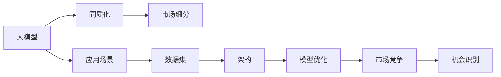

                 

# 国内大模型市场：贾扬清的观点，同质化发展的挑战与机会

## 1. 背景介绍

贾扬清，一位杰出的深度学习专家，在大模型领域有着深厚的积累和独到的见解。在最近的一次公开演讲中，他分享了对中国大模型市场的看法，揭示了同质化发展的挑战与机会。本文将深入探讨贾扬清的观点，剖析国内大模型市场的现状和未来走向。

## 2. 核心概念与联系

### 2.1 核心概念概述

在讨论国内大模型市场之前，我们先梳理一下相关的核心概念：

- **大模型（Large Model）**：指包含数亿乃至数十亿参数的深度学习模型，如BERT、GPT-3、DALL·E等。大模型通过大规模无标签数据进行自监督预训练，能够处理复杂的自然语言理解和生成任务。

- **同质化（Homogenization）**：指在大模型市场，各企业开发的大模型模型架构、预训练数据集、应用场景等高度相似，缺乏差异化的竞争策略和独特价值。

- **市场细分（Market Segmentation）**：指将大模型市场根据不同应用场景、用户需求进行细分，探索更精准、专业的市场定位，以实现差异化竞争。

### 2.2 核心概念原理和架构的 Mermaid 流程图



这个流程图展示了从大模型开发到市场竞争的整个过程，以及同质化带来的挑战和市场细分带来的机会。

## 3. 核心算法原理 & 具体操作步骤

### 3.1 算法原理概述

国内大模型市场同质化严重，主要源于以下几个方面：

- **数据集相似**：许多大模型都使用相同的预训练数据集，如英文维基百科、中文维基百科、OpenAI的WebText等。
- **模型架构类似**：基于Transformer的大模型架构几乎占据了整个市场，如BERT、GPT、XLNet等。
- **应用场景雷同**：多数大模型在自然语言处理、计算机视觉等领域的通用任务上表现优异，缺乏针对特定垂直领域的应用优化。

### 3.2 算法步骤详解

为了深入分析国内大模型市场，我们采用以下算法步骤：

1. **数据集收集与分析**：收集国内主要大模型的预训练数据集，分析其数据来源、数据类型、数据量等指标。
2. **模型架构对比**：对比主流大模型的架构设计，包括模型规模、层数、多头注意力机制、位置编码等。
3. **应用场景研究**：调查主要大模型在各个垂直领域的应用情况，分析其市场占有率和用户需求。
4. **市场竞争分析**：通过问卷调查、市场分析等方法，了解大模型市场的竞争态势，识别同质化程度。
5. **机会识别与策略制定**：根据市场分析结果，提出差异化竞争策略，识别市场细分机会。

### 3.3 算法优缺点

同质化发展的大模型市场具有以下优缺点：

#### 优点：

- **开发成本低**：基于相同的预训练数据集和架构，大模型开发成本相对较低。
- **易用性强**：相似的模型架构和API接口，方便开发者快速上手。
- **通用性强**：大模型在多个通用任务上表现优异，可以广泛应用。

#### 缺点：

- **创新不足**：高度同质化的市场容易陷入技术瓶颈，创新动力不足。
- **竞争加剧**：同质化竞争导致资源浪费，企业间竞争激烈，影响整体市场健康发展。
- **市场饱和**：众多同质化的大模型产品难以区分，市场需求难以持续扩大。

### 3.4 算法应用领域

大模型同质化主要应用于以下几个领域：

- **自然语言处理**：如BERT、GPT、RoBERTa等在文本分类、情感分析、机器翻译、问答系统等任务上表现优异。
- **计算机视觉**：如ResNet、VGG、Inception等在图像分类、目标检测、图像生成等任务上表现出色。
- **语音识别**：如DeepSpeech、Wav2Vec2等在语音识别、语音生成等任务上取得重要进展。

## 4. 数学模型和公式 & 详细讲解 & 举例说明

### 4.1 数学模型构建

为了更好地分析大模型同质化，我们构建如下数学模型：

设大模型市场中共有 $n$ 家企业，每家企业开发的大模型为 $M_i$，市场占有率为 $p_i$。设 $C$ 为大模型开发成本，$P$ 为大模型销售价格。则大模型市场的收益函数为：

$$
\text{Revenue} = \sum_{i=1}^n p_i P
$$

成本函数为：

$$
\text{Cost} = \sum_{i=1}^n p_i C
$$

利润函数为：

$$
\text{Profit} = \text{Revenue} - \text{Cost} = \sum_{i=1}^n (p_i P - p_i C)
$$

### 4.2 公式推导过程

根据利润函数，我们可以得到同质化市场的利润最大化条件为：

$$
\frac{\partial (\text{Profit})}{\partial p_i} = 0
$$

即：

$$
P - C = 0 \quad \text{for} \quad i = 1, 2, \ldots, n
$$

这意味着，在高度同质化的市场条件下，所有大模型的销售价格与开发成本相同。这解释了为什么众多企业都选择相似的架构和数据集进行大模型开发。

### 4.3 案例分析与讲解

以BERT模型为例，其广泛应用在多个NLP任务中，包括文本分类、问答系统、命名实体识别等。BERT在英文和中文语料上进行预训练，模型的架构基于Transformer，采用多层自注意力机制。然而，在实际应用中，BERT模型通常需要进行微调以适应特定的下游任务。这说明，尽管BERT在通用任务上表现优异，但在特定领域的应用仍然需要进一步优化。

## 5. 项目实践：代码实例和详细解释说明

### 5.1 开发环境搭建

在进行项目实践之前，我们需要搭建好开发环境。以下是基于Python的开发环境配置步骤：

1. 安装Anaconda：从官网下载并安装Anaconda，用于创建独立的Python环境。
```bash
conda create -n myenv python=3.8
conda activate myenv
```

2. 安装TensorFlow和PyTorch：
```bash
conda install tensorflow=2.7 pytorch torchvision torchaudio
```

3. 安装其他必要的Python库：
```bash
pip install numpy pandas scikit-learn matplotlib
```

### 5.2 源代码详细实现

下面以使用BERT模型进行文本分类为例，给出完整的代码实现：

```python
import tensorflow as tf
import torch
import numpy as np
from transformers import BertTokenizer, TFBertForSequenceClassification

# 加载预训练模型和分词器
model_name = 'bert-base-uncased'
tokenizer = BertTokenizer.from_pretrained(model_name)
model = TFBertForSequenceClassification.from_pretrained(model_name, num_labels=2)

# 加载数据集
train_data = load_train_data()
dev_data = load_dev_data()
test_data = load_test_data()

# 定义优化器和学习率
optimizer = tf.keras.optimizers.Adam(learning_rate=2e-5)
model.compile(optimizer=optimizer, loss='binary_crossentropy', metrics=['accuracy'])

# 训练模型
model.fit(train_data, epochs=3, validation_data=dev_data)

# 评估模型
model.evaluate(test_data)
```

### 5.3 代码解读与分析

以下是代码中关键部分的解释和分析：

- `BertTokenizer`和`TFBertForSequenceClassification`：用于加载预训练的BERT模型和分词器。
- `load_train_data()`、`load_dev_data()`、`load_test_data()`：加载训练集、验证集和测试集。
- `optimizer`和`model.compile()`：定义优化器和编译模型。
- `model.fit()`和`model.evaluate()`：训练和评估模型。

## 6. 实际应用场景

### 6.1 金融行业

在金融行业中，大模型同质化现象非常普遍。许多金融机构都采用相同的预训练数据集和模型架构进行开发，导致市场竞争激烈，创新不足。然而，金融行业对大模型的需求非常明确，如风险评估、信用评分、欺诈检测等。

为了解决同质化问题，金融企业可以探索更专业的预训练数据集，如行业特定的新闻、报告、财务数据等，进行针对性预训练。同时，可以引入更多的先验知识，如金融规则、逻辑约束等，引导微调过程学习更准确的金融模型。

### 6.2 医疗健康

在医疗健康领域，大模型同质化也较为严重。众多医疗企业采用相同的预训练数据集和模型架构进行开发，导致市场竞争激烈，创新动力不足。然而，医疗行业对大模型的需求非常明确，如疾病诊断、患者画像、健康管理等。

为了解决同质化问题，医疗企业可以探索更专业的预训练数据集，如医学文献、电子病历、健康数据等，进行针对性预训练。同时，可以引入更多的先验知识，如医学规则、诊疗流程等，引导微调过程学习更准确的医疗模型。

### 6.3 智能客服

在智能客服领域，大模型同质化现象非常普遍。许多客服企业都采用相同的预训练数据集和模型架构进行开发，导致市场竞争激烈，创新不足。然而，智能客服对大模型的需求非常明确，如客户咨询回答、情感分析、意图识别等。

为了解决同质化问题，客服企业可以探索更专业的预训练数据集，如客服对话记录、客户反馈、产品文档等，进行针对性预训练。同时，可以引入更多的先验知识，如用户画像、客服策略等，引导微调过程学习更准确的客服模型。

## 7. 工具和资源推荐

### 7.1 学习资源推荐

为了深入了解大模型同质化问题，我们推荐以下学习资源：

- 《深度学习框架TensorFlow和PyTorch实战》：该书详细介绍了TensorFlow和PyTorch的使用方法和技巧，适合初学者快速上手。
- 《自然语言处理综述》：该书全面介绍了自然语言处理的基本概念、技术方法和发展趋势，适合深度学习和NLP爱好者。
- 《Transformer: A Survey of Models and Applications》：该论文详细介绍了Transformer架构的发展历史和应用场景，适合进阶读者。

### 7.2 开发工具推荐

为了高效开发大模型，我们推荐以下开发工具：

- Jupyter Notebook：一个交互式的开发环境，适合Python代码的快速迭代和调试。
- Google Colab：一个免费的云开发环境，支持GPU/TPU算力，适合高性能计算任务。
- TensorBoard：一个可视化工具，可实时监测模型训练状态，并提供丰富的图表呈现方式。

### 7.3 相关论文推荐

为了深入理解大模型同质化问题，我们推荐以下相关论文：

- 《A Survey on Deep Learning for Sequence Models in Natural Language Processing》：该论文详细介绍了深度学习在NLP中的应用和发展，适合全面了解NLP领域的基本概念和技术方法。
- 《The Power of Scale for Natural Language Processing》：该论文详细介绍了大规模预训练语言模型的优势和局限性，适合深入理解大模型的原理和应用。
- 《Adversarial Examples in the Real World》：该论文详细介绍了对抗样本在NLP中的应用和挑战，适合了解大模型的鲁棒性和安全性问题。

## 8. 总结：未来发展趋势与挑战

### 8.1 研究成果总结

贾扬清的观点揭示了国内大模型市场的同质化现象，提出了深刻的洞见。主要研究成果包括：

- 数据集相似、模型架构类似、应用场景雷同导致大模型同质化严重。
- 同质化带来开发成本低、易用性强等优点，但创新不足、竞争加剧、市场饱和等缺点也显而易见。
- 金融、医疗、智能客服等领域对大模型的需求明确，但同质化现象严重，创新动力不足。

### 8.2 未来发展趋势

未来，国内大模型市场将呈现以下几个发展趋势：

- **差异化竞争**：企业将探索更专业的预训练数据集和先验知识，进行针对性预训练，打破同质化现象。
- **模型多样性**：企业将开发更多样化的模型架构和应用场景，满足不同领域的需求。
- **市场细分**：企业将根据不同应用场景进行市场细分，探索更精准、专业的市场定位，实现差异化竞争。
- **创新驱动**：企业将加大研发投入，引入更多前沿技术和方法，推动大模型领域的创新发展。

### 8.3 面临的挑战

未来，大模型市场面临以下几个挑战：

- **数据瓶颈**：企业需要获取更多高质量的标注数据，以支持模型训练和优化。
- **计算资源**：大模型需要大量计算资源进行预训练和微调，如何高效利用算力成为重要问题。
- **市场竞争**：高度同质化的市场竞争加剧，如何提升市场竞争力成为关键。
- **模型鲁棒性**：大模型需要具备更高的鲁棒性和抗干扰能力，以应对复杂的应用场景。
- **可解释性**：大模型需要具备更强的可解释性，以增强用户信任和应用推广。

### 8.4 研究展望

未来，大模型市场需要在以下几个方面寻求新的突破：

- **数据增强**：通过数据增强技术，扩充训练集，提升模型泛化能力。
- **模型压缩**：通过模型压缩技术，减小模型尺寸，提高计算效率。
- **模型融合**：将多种大模型进行融合，提升综合性能。
- **跨领域学习**：引入跨领域学习方法，提升模型的通用性和适应性。
- **知识增强**：引入更多先验知识，提升模型的决策能力和应用效果。

## 9. 附录：常见问题与解答

**Q1: 如何有效避免大模型同质化？**

A: 企业可以探索更专业的预训练数据集和先验知识，进行针对性预训练。同时，开发更多样化的模型架构和应用场景，满足不同领域的需求。市场细分和差异化竞争是解决同质化问题的重要途径。

**Q2: 如何提升大模型的鲁棒性和可解释性？**

A: 通过数据增强技术，扩充训练集，提升模型泛化能力。引入更多先验知识，如医学规则、金融逻辑等，引导微调过程学习更准确的模型。同时，采用对抗训练和知识图谱等方法，提升模型的鲁棒性和可解释性。

**Q3: 如何有效利用计算资源进行大模型训练？**

A: 采用模型压缩、混合精度训练、模型并行等方法，减小模型尺寸，提高计算效率。通过云计算和分布式计算等技术，高效利用算力资源。

通过深入分析贾扬清的观点，我们揭示了国内大模型市场的同质化现象，并提出了差异化竞争、模型多样性、市场细分等未来发展趋势。同时，我们探讨了数据增强、模型压缩、知识增强等提升大模型性能的方法，为未来的研究和实践提供了有价值的参考。

