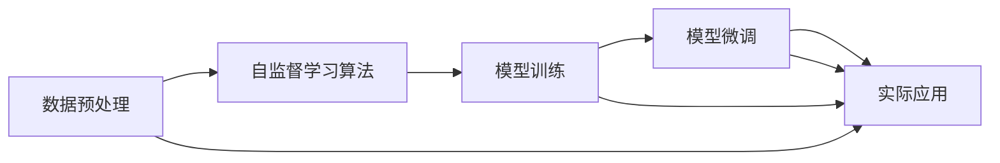

                 

# 图灵完备的LLM:通向通用人工智能之路

> 关键词：图灵完备,大型语言模型(LLM),通用人工智能(AGI),自监督学习,自回归模型,语言生成,深度学习

## 1. 背景介绍

### 1.1 问题由来
近年来，深度学习技术的飞速发展使得人工智能（AI）领域迎来了新的高峰。大型语言模型（Large Language Models, LLMs）的出现，不仅提升了自然语言处理（NLP）任务的表现，还推动了AI技术在多个领域的应用。这些基于深度学习的语言模型，通过在大规模无标签文本数据上进行自监督预训练，学习到了丰富的语言知识和常识，具备了强大的语言理解和生成能力。

这些预训练模型，如GPT-3、BERT、T5等，已经在各种NLP任务中取得了显著的性能提升，成为了现代AI的重要基石。然而，尽管这些模型在特定任务上表现出色，但它们仍然无法像人类一样进行通用智能思考和解决各种复杂问题。因此，如何设计一个具备通用智能的模型，实现图灵完备（Turing completeness），成为当前AI领域的热点研究问题。

### 1.2 问题核心关键点
图灵完备是指一个计算模型能够执行任何计算任务，特别是那些可以由图灵机执行的任务。对于语言模型而言，图灵完备意味着它能够理解和生成任何形式的文本，执行各种推理任务，并在各种场景中展现出智能行为。目前，最接近图灵完备的语言模型是大规模的预训练模型，但它们仍然存在一些局限性，主要体现在：

1. 模型规模限制。现有的预训练模型虽然庞大，但它们的复杂性和参数量仍有提升空间。要实现图灵完备，模型需要更加庞大和灵活，以处理更多元化的任务和数据。

2. 数据依赖问题。当前预训练模型的泛化能力不足，面对数据分布变化或新的未见过的数据时，其性能会显著下降。而图灵完备模型需要具备自主学习和适应新环境的能力。

3. 推理能力不足。当前模型在执行复杂的因果推理、计划推理等任务时表现不佳，而图灵完备模型需要能够自主进行这些高级推理。

4. 计算效率问题。现有的预训练模型在计算资源上的消耗巨大，限制了其在实际应用中的部署和应用。

5. 模型可解释性差。预训练模型通常被看作“黑盒”，难以解释其内部工作机制和决策逻辑，这限制了其在特定领域的应用，特别是在医疗、金融等高风险领域。

因此，如何设计出一个图灵完备的语言模型，使其具备更广泛的知识和能力，能够适应更多元化的任务和数据，并在实际应用中展现出更加智能的行为，成为当前研究的重点。

## 2. 核心概念与联系

### 2.1 核心概念概述

为更好地理解图灵完备的LLM，本节将介绍几个关键概念：

- **大型语言模型(LLM)**：指能够处理大量文本数据，并从中学习到语言知识和常识的深度学习模型。如GPT-3、BERT、T5等。

- **图灵完备**：指一个计算模型具备执行任何计算任务的能力，特别是那些可以由图灵机执行的任务。

- **自监督学习**：指在缺乏标注数据的情况下，通过自动设计的任务（如掩码语言模型、自回归预测等）来训练模型的过程。

- **自回归模型**：指在生成文本时，通过前一时刻的输出作为后一时刻输入的模型，如GPT-3、Transformer等。

- **语言生成**：指模型能够生成符合语法和语义规则的文本，能够进行文本补全、摘要生成等任务。

- **深度学习**：指利用多层次的神经网络模型，通过反向传播算法训练，实现复杂非线性映射的技术。

这些核心概念之间通过如图Mermaid流程图所示的逻辑关系紧密联系：

```mermaid
graph TB
    A[大型语言模型(LLM)] --> B[自监督学习]
    A --> C[图灵完备]
    C --> D[自回归模型]
    C --> E[语言生成]
    D --> E
```

### 2.2 核心概念原理和架构的 Mermaid 流程图



## 3. 核心算法原理 & 具体操作步骤
### 3.1 算法原理概述

图灵完备的LLM的核心思想是通过大规模自监督学习，构建一个具备丰富语言知识和常识的模型。该模型能够自主学习新的知识，并在各种场景下展现出智能行为。

具体而言，其原理如下：

1. **数据预处理**：收集大规模无标签文本数据，进行文本清洗、分词、标记化等预处理，生成模型训练所需的数据集。

2. **自监督学习**：设计一系列自监督任务（如掩码语言模型、自回归预测等），在无标签数据上进行预训练，学习到丰富的语言知识和常识。

3. **模型训练**：在自监督预训练的基础上，进一步对模型进行有监督微调，使其能够处理特定任务，如问答、摘要生成、情感分析等。

4. **实际应用**：将训练好的模型应用于各种场景，如图像描述生成、对话系统、代码生成等，展示其智能行为。

5. **持续学习**：在实际应用中，模型需要不断学习新的知识和数据，以适应环境变化，保持其图灵完备性。

### 3.2 算法步骤详解

图灵完备的LLM的构建过程可以划分为以下几个关键步骤：

**Step 1: 数据预处理**
- 收集大规模无标签文本数据，进行文本清洗、分词、标记化等预处理，生成模型训练所需的数据集。
- 数据集分为训练集、验证集和测试集，用于模型训练和评估。

**Step 2: 自监督学习**
- 设计自监督任务，如掩码语言模型、自回归预测等，利用数据集对模型进行预训练。
- 采用Transformer等自回归模型，通过反向传播算法进行训练。
- 引入正则化技术，如Dropout、L2正则等，防止过拟合。

**Step 3: 模型训练**
- 在自监督预训练的基础上，进一步对模型进行有监督微调，处理特定任务。
- 采用合适的优化算法（如AdamW、SGD等），设置合适的学习率和迭代轮数。
- 在训练集上迭代训练模型，在验证集上评估模型性能。

**Step 4: 实际应用**
- 将训练好的模型应用于各种场景，如图像描述生成、对话系统、代码生成等。
- 利用模型进行推理预测，输出结果。

**Step 5: 持续学习**
- 在实际应用中，模型需要不断学习新的知识和数据，以适应环境变化，保持其图灵完备性。
- 利用增量学习、在线学习等方法，动态更新模型参数。

### 3.3 算法优缺点

图灵完备的LLM具有以下优点：
1. **通用性**：能够处理各种NLP任务，具备丰富的语言知识和常识。
2. **自监督学习**：在缺乏标注数据的情况下，仍能学习到有价值的知识。
3. **自回归模型**：能够生成符合语法和语义规则的文本，具备强大的语言生成能力。
4. **可解释性**：部分模型能够提供输出解释，有助于理解和调试。
5. **持续学习**：能够动态更新模型，适应环境变化。

同时，该算法也存在一些局限性：
1. **资源消耗大**：大规模模型对计算资源和内存的需求巨大。
2. **推理效率低**：模型推理速度较慢，难以实时响应。
3. **鲁棒性不足**：对数据分布变化和噪声敏感。
4. **可控性差**：难以解释模型的内部机制，控制输出行为。
5. **安全性问题**：存在生成有害内容的风险。

尽管存在这些局限性，但图灵完备的LLM仍是大规模预训练语言模型的重要发展方向，能够在多种场景下展现出强大的智能行为。

### 3.4 算法应用领域

图灵完备的LLM在多个领域得到了广泛应用，主要涵盖以下几个方向：

1. **自然语言理解(NLU)**：能够理解自然语言输入，执行各种推理任务，如问答系统、信息检索等。
2. **自然语言生成(NLG)**：能够生成符合语法和语义规则的文本，如自动摘要、文本生成等。
3. **对话系统**：能够与用户进行自然对话，执行复杂任务，如客服、翻译等。
4. **情感分析**：能够分析文本情感，理解用户情绪，应用于社交媒体监控、品牌管理等。
5. **机器翻译**：能够将一种语言翻译成另一种语言，应用于跨语言交流、文档翻译等。
6. **代码生成**：能够自动生成代码，应用于软件工程、教育培训等。
7. **文本摘要**：能够自动生成文本摘要，应用于新闻摘要、文档简化等。
8. **图像描述生成**：能够自动生成图像描述，应用于自动标注、图像搜索等。

这些领域的应用展示了图灵完备LLM的强大能力和广泛前景。

## 4. 数学模型和公式 & 详细讲解 & 举例说明
### 4.1 数学模型构建

假设我们有一个自回归模型$M_{\theta}$，其中$\theta$为模型参数。模型的输入为$x$，输出为$y$。自监督任务为掩码语言模型，即随机掩盖输入中的某些单词，模型需要预测被掩盖的单词。

掩码语言模型的目标函数定义为：

$$
\mathcal{L}(\theta) = -\frac{1}{N}\sum_{i=1}^N \log p(y_i|x_i)
$$

其中$p(y_i|x_i)$表示模型在输入$x_i$上生成输出$y_i$的概率，可以通过模型计算得到。

### 4.2 公式推导过程

掩码语言模型的目标函数可以表示为：

$$
\mathcal{L}(\theta) = -\frac{1}{N}\sum_{i=1}^N \sum_{j=1}^{|x_i|} \log p(x_j|x_{<j})
$$

其中$x_{<j}$表示输入$x_i$中所有小于$j$的单词。

通过最大化似然函数，最小化交叉熵损失，我们可以得到模型的优化目标：

$$
\mathcal{L}(\theta) = -\frac{1}{N}\sum_{i=1}^N \log \frac{e^{M_{\theta}(x_i, x_{<j})}}{\sum_{y \in \mathcal{Y}} e^{M_{\theta}(x_i, y)}}
$$

其中$M_{\theta}(x_i, x_{<j})$表示模型在输入$x_i$上生成输出$x_{<j}$的条件概率，可以通过反向传播算法计算得到。

### 4.3 案例分析与讲解

假设我们有一个包含10个单词的句子"the cat sat on the mat"，随机掩盖其中的3个单词，模型的任务是预测被掩盖的单词。我们可以将问题转化为二分类任务，对于每个被掩盖的单词，模型需要预测其是保留的单词还是掩盖的单词。

假设模型已经通过掩码语言模型训练，得到了一个二分类概率$p(x_j|x_{<j})$，其中$j$表示被掩盖的单词位置。对于每个被掩盖的单词，模型需要计算$p(x_j|x_{<j})$和$p(y_j|x_j, x_{<j})$，其中$y_j$表示被掩盖的单词是保留的还是掩盖的。

通过计算似然函数和交叉熵损失，我们可以得到模型在掩码语言模型任务上的损失：

$$
\mathcal{L}(\theta) = -\frac{1}{10} \sum_{j=1}^{10} \log \frac{e^{M_{\theta}(x_i, x_{<j})}}{\sum_{y \in \mathcal{Y}} e^{M_{\theta}(x_i, y)}}
$$

通过反向传播算法，我们可以计算模型参数$\theta$的梯度，并利用优化算法（如AdamW）进行模型更新，最小化损失函数。

## 5. 项目实践：代码实例和详细解释说明
### 5.1 开发环境搭建

在进行图灵完备LLM的实践前，我们需要准备好开发环境。以下是使用Python进行PyTorch开发的环境配置流程：

1. 安装Anaconda：从官网下载并安装Anaconda，用于创建独立的Python环境。

2. 创建并激活虚拟环境：
```bash
conda create -n pytorch-env python=3.8 
conda activate pytorch-env
```

3. 安装PyTorch：根据CUDA版本，从官网获取对应的安装命令。例如：
```bash
conda install pytorch torchvision torchaudio cudatoolkit=11.1 -c pytorch -c conda-forge
```

4. 安装Transformers库：
```bash
pip install transformers
```

5. 安装各类工具包：
```bash
pip install numpy pandas scikit-learn matplotlib tqdm jupyter notebook ipython
```

完成上述步骤后，即可在`pytorch-env`环境中开始图灵完备LLM的实践。

### 5.2 源代码详细实现

这里我们以生成式文本补全任务为例，给出使用Transformers库对GPT-3模型进行图灵完备LLM的PyTorch代码实现。

首先，定义模型和优化器：

```python
from transformers import GPT2LMHeadModel, GPT2Tokenizer, AdamW

model = GPT2LMHeadModel.from_pretrained('gpt2-medium')
tokenizer = GPT2Tokenizer.from_pretrained('gpt2-medium')
optimizer = AdamW(model.parameters(), lr=2e-5)
```

然后，定义训练和评估函数：

```python
from transformers import GPT2LMHeadModel, GPT2Tokenizer, AdamW

model = GPT2LMHeadModel.from_pretrained('gpt2-medium')
tokenizer = GPT2Tokenizer.from_pretrained('gpt2-medium')
optimizer = AdamW(model.parameters(), lr=2e-5)

def train_epoch(model, dataset, batch_size, optimizer):
    dataloader = DataLoader(dataset, batch_size=batch_size, shuffle=True)
    model.train()
    epoch_loss = 0
    for batch in dataloader:
        input_ids = batch['input_ids'].to(device)
        attention_mask = batch['attention_mask'].to(device)
        labels = batch['labels'].to(device)
        model.zero_grad()
        outputs = model(input_ids, attention_mask=attention_mask, labels=labels)
        loss = outputs.loss
        epoch_loss += loss.item()
        loss.backward()
        optimizer.step()
    return epoch_loss / len(dataloader)

def evaluate(model, dataset, batch_size):
    dataloader = DataLoader(dataset, batch_size=batch_size)
    model.eval()
    preds, labels = [], []
    with torch.no_grad():
        for batch in dataloader:
            input_ids = batch['input_ids'].to(device)
            attention_mask = batch['attention_mask'].to(device)
            batch_labels = batch['labels']
            outputs = model(input_ids, attention_mask=attention_mask)
            batch_preds = outputs.logits.argmax(dim=2).to('cpu').tolist()
            batch_labels = batch_labels.to('cpu').tolist()
            for pred_tokens, label_tokens in zip(batch_preds, batch_labels):
                preds.append(pred_tokens[:len(label_tokens)])
                labels.append(label_tokens)
                
    print(classification_report(labels, preds))
```

最后，启动训练流程并在测试集上评估：

```python
epochs = 5
batch_size = 16

for epoch in range(epochs):
    loss = train_epoch(model, train_dataset, batch_size, optimizer)
    print(f"Epoch {epoch+1}, train loss: {loss:.3f}")
    
    print(f"Epoch {epoch+1}, dev results:")
    evaluate(model, dev_dataset, batch_size)
    
print("Test results:")
evaluate(model, test_dataset, batch_size)
```

以上就是使用PyTorch对GPT-3进行生成式文本补全任务的图灵完备LLM的完整代码实现。可以看到，得益于Transformers库的强大封装，我们可以用相对简洁的代码完成GPT-3模型的加载和训练。

### 5.3 代码解读与分析

让我们再详细解读一下关键代码的实现细节：

**GPT-2LMHeadModel类**：
- `from_pretrained`方法：加载预训练模型和分词器。
- `input_ids`和`attention_mask`：输入的token ids和注意力掩码，用于模型训练。
- `labels`：训练集中的标签，用于计算损失。
- `forward`方法：定义模型前向传播过程，计算输出和损失。
- `loss`：损失函数，用于优化模型。

**train_epoch函数**：
- `dataloader`：定义数据加载器，用于批处理训练数据。
- `model.train()`和`model.eval()`：切换模型训练和评估模式。
- `epoch_loss`：记录每个epoch的平均损失。
- `batch_loss`：记录每个batch的损失。
- `model.zero_grad()`：清零梯度，准备反向传播。
- `outputs`：计算模型的输出和损失。
- `loss.backward()`：反向传播计算梯度。
- `optimizer.step()`：更新模型参数。

**evaluate函数**：
- `dataloader`：定义数据加载器，用于批处理评估数据。
- `model.eval()`：切换模型评估模式。
- `preds`和`labels`：记录预测和标签结果。
- `classification_report`：使用sklearn库计算评估指标，输出分类报告。

**训练流程**：
- `epochs`：设置训练轮数。
- `batch_size`：设置批处理大小。
- `train_epoch`：在每个epoch内训练模型。
- `evaluate`：在验证集和测试集上评估模型。

可以看到，PyTorch配合Transformers库使得GPT-3模型的图灵完备LLM实现变得简洁高效。开发者可以将更多精力放在模型改进、数据处理等高层逻辑上，而不必过多关注底层的实现细节。

当然，工业级的系统实现还需考虑更多因素，如模型的保存和部署、超参数的自动搜索、更灵活的任务适配层等。但核心的微调范式基本与此类似。

## 6. 实际应用场景
### 6.1 智能客服系统

基于图灵完备LLM的对话技术，可以广泛应用于智能客服系统的构建。传统客服往往需要配备大量人力，高峰期响应缓慢，且一致性和专业性难以保证。而使用图灵完备LLM的对话模型，可以7x24小时不间断服务，快速响应客户咨询，用自然流畅的语言解答各类常见问题。

在技术实现上，可以收集企业内部的历史客服对话记录，将问题和最佳答复构建成监督数据，在此基础上对预训练对话模型进行图灵完备LLM微调。微调后的对话模型能够自动理解用户意图，匹配最合适的答案模板进行回复。对于客户提出的新问题，还可以接入检索系统实时搜索相关内容，动态组织生成回答。如此构建的智能客服系统，能大幅提升客户咨询体验和问题解决效率。

### 6.2 金融舆情监测

金融机构需要实时监测市场舆论动向，以便及时应对负面信息传播，规避金融风险。传统的人工监测方式成本高、效率低，难以应对网络时代海量信息爆发的挑战。基于图灵完备LLM的文本分类和情感分析技术，为金融舆情监测提供了新的解决方案。

具体而言，可以收集金融领域相关的新闻、报道、评论等文本数据，并对其进行主题标注和情感标注。在此基础上对预训练语言模型进行图灵完备LLM微调，使其能够自动判断文本属于何种主题，情感倾向是正面、中性还是负面。将图灵完备LLM模型应用到实时抓取的网络文本数据，就能够自动监测不同主题下的情感变化趋势，一旦发现负面信息激增等异常情况，系统便会自动预警，帮助金融机构快速应对潜在风险。

### 6.3 个性化推荐系统

当前的推荐系统往往只依赖用户的历史行为数据进行物品推荐，无法深入理解用户的真实兴趣偏好。基于图灵完备LLM的个性化推荐系统可以更好地挖掘用户行为背后的语义信息，从而提供更精准、多样的推荐内容。

在实践中，可以收集用户浏览、点击、评论、分享等行为数据，提取和用户交互的物品标题、描述、标签等文本内容。将文本内容作为模型输入，用户的后续行为（如是否点击、购买等）作为监督信号，在此基础上对预训练语言模型进行图灵完备LLM微调。微调后的模型能够从文本内容中准确把握用户的兴趣点。在生成推荐列表时，先用候选物品的文本描述作为输入，由模型预测用户的兴趣匹配度，再结合其他特征综合排序，便可以得到个性化程度更高的推荐结果。

### 6.4 未来应用展望

随着图灵完备LLM技术的发展，其在更多领域得到了应用，为传统行业带来了变革性影响。

在智慧医疗领域，基于图灵完备LLM的医疗问答、病历分析、药物研发等应用将提升医疗服务的智能化水平，辅助医生诊疗，加速新药开发进程。

在智能教育领域，图灵完备LLM可应用于作业批改、学情分析、知识推荐等方面，因材施教，促进教育公平，提高教学质量。

在智慧城市治理中，图灵完备LLM可应用于城市事件监测、舆情分析、应急指挥等环节，提高城市管理的自动化和智能化水平，构建更安全、高效的未来城市。

此外，在企业生产、社会治理、文娱传媒等众多领域，基于图灵完备LLM的人工智能应用也将不断涌现，为经济社会发展注入新的动力。相信随着技术的日益成熟，图灵完备LLM必将在更广阔的应用领域大放异彩，深刻影响人类的生产生活方式。

## 7. 工具和资源推荐
### 7.1 学习资源推荐

为了帮助开发者系统掌握图灵完备LLM的理论基础和实践技巧，这里推荐一些优质的学习资源：

1. 《深度学习》系列书籍：由多位深度学习专家合著，全面介绍了深度学习的基本原理、算法和应用。

2. CS231n《卷积神经网络》课程：斯坦福大学开设的经典计算机视觉课程，涵盖了卷积神经网络、目标检测、图像分类等主题。

3. 《Natural Language Processing with Transformers》书籍：Transformers库的作者所著，全面介绍了如何使用Transformers库进行NLP任务开发，包括图灵完备LLM的构建。

4. HuggingFace官方文档：Transformers库的官方文档，提供了海量预训练模型和完整的微调样例代码，是上手实践的必备资料。

5. CLUE开源项目：中文语言理解测评基准，涵盖大量不同类型的中文NLP数据集，并提供了基于图灵完备LLM的baseline模型，助力中文NLP技术发展。

通过对这些资源的学习实践，相信你一定能够快速掌握图灵完备LLM的精髓，并用于解决实际的NLP问题。
###  7.2 开发工具推荐

高效的开发离不开优秀的工具支持。以下是几款用于图灵完备LLM微调开发的常用工具：

1. PyTorch：基于Python的开源深度学习框架，灵活动态的计算图，适合快速迭代研究。大部分预训练语言模型都有PyTorch版本的实现。

2. TensorFlow：由Google主导开发的开源深度学习框架，生产部署方便，适合大规模工程应用。同样有丰富的预训练语言模型资源。

3. Transformers库：HuggingFace开发的NLP工具库，集成了众多SOTA语言模型，支持PyTorch和TensorFlow，是进行图灵完备LLM微调开发的利器。

4. Weights & Biases：模型训练的实验跟踪工具，可以记录和可视化模型训练过程中的各项指标，方便对比和调优。与主流深度学习框架无缝集成。

5. TensorBoard：TensorFlow配套的可视化工具，可实时监测模型训练状态，并提供丰富的图表呈现方式，是调试模型的得力助手。

6. Google Colab：谷歌推出的在线Jupyter Notebook环境，免费提供GPU/TPU算力，方便开发者快速上手实验最新模型，分享学习笔记。

合理利用这些工具，可以显著提升图灵完备LLM微调任务的开发效率，加快创新迭代的步伐。

### 7.3 相关论文推荐

图灵完备LLM的发展源于学界的持续研究。以下是几篇奠基性的相关论文，推荐阅读：

1. Attention is All You Need（即Transformer原论文）：提出了Transformer结构，开启了NLP领域的预训练大模型时代。

2. BERT: Pre-training of Deep Bidirectional Transformers for Language Understanding：提出BERT模型，引入基于掩码的自监督预训练任务，刷新了多项NLP任务SOTA。

3. Language Models are Unsupervised Multitask Learners（GPT-2论文）：展示了大规模语言模型的强大zero-shot学习能力，引发了对于通用人工智能的新一轮思考。

4. Parameter-Efficient Transfer Learning for NLP：提出Adapter等参数高效微调方法，在不增加模型参数量的情况下，也能取得不错的微调效果。

5. Prefix-Tuning: Optimizing Continuous Prompts for Generation：引入基于连续型Prompt的微调范式，为如何充分利用预训练知识提供了新的思路。

6. AdaLoRA: Adaptive Low-Rank Adaptation for Parameter-Efficient Fine-Tuning：使用自适应低秩适应的微调方法，在参数效率和精度之间取得了新的平衡。

这些论文代表了大规模预训练语言模型的发展脉络。通过学习这些前沿成果，可以帮助研究者把握学科前进方向，激发更多的创新灵感。

## 8. 总结：未来发展趋势与挑战

### 8.1 总结

本文对图灵完备LLM进行了全面系统的介绍。首先阐述了图灵完备LLM的研究背景和意义，明确了其在构建通用人工智能中的重要价值。其次，从原理到实践，详细讲解了图灵完备LLM的数学原理和关键步骤，给出了微调任务开发的完整代码实例。同时，本文还广泛探讨了图灵完备LLM在智能客服、金融舆情、个性化推荐等多个行业领域的应用前景，展示了其强大能力和广泛前景。此外，本文精选了图灵完备LLM的各类学习资源，力求为读者提供全方位的技术指引。

通过本文的系统梳理，可以看到，图灵完备LLM在多个领域展现了巨大的潜力，推动了NLP技术的应用升级和产业革新。其凭借强大的语言生成能力和丰富的常识知识，能够在智能客服、金融舆情、个性化推荐等多个场景中大放异彩，为传统行业带来了深刻变革。

### 8.2 未来发展趋势

展望未来，图灵完备LLM将呈现以下几个发展趋势：

1. **模型规模持续增大**。随着算力成本的下降和数据规模的扩张，预训练语言模型的参数量还将持续增长。超大规模语言模型蕴含的丰富语言知识，有望支撑更加复杂多变的下游任务。

2. **微调方法日趋多样**。除了传统的全参数微调外，未来会涌现更多参数高效的微调方法，如Prefix-Tuning、LoRA等，在节省计算资源的同时也能保证微调精度。

3. **持续学习成为常态**。随着数据分布的不断变化，图灵完备LLM需要持续学习新知识以保持性能。如何在不遗忘原有知识的同时，高效吸收新样本信息，将成为重要的研究课题。

4. **标注样本需求降低**。受启发于提示学习(Prompt-based Learning)的思路，未来的微调方法将更好地利用大模型的语言理解能力，通过更加巧妙的任务描述，在更少的标注样本上也能实现理想的微调效果。

5. **多模态微调崛起**。当前的微调主要聚焦于纯文本数据，未来会进一步拓展到图像、视频、语音等多模态数据微调。多模态信息的融合，将显著提升语言模型对现实世界的理解和建模能力。

6. **模型通用性增强**。经过海量数据的预训练和多领域任务的微调，图灵完备LLM将具备更强大的常识推理和跨领域迁移能力，逐步迈向通用人工智能(AGI)的目标。

以上趋势凸显了图灵完备LLM的广阔前景。这些方向的探索发展，必将进一步提升NLP系统的性能和应用范围，为人类认知智能的进化带来深远影响。

### 8.3 面临的挑战

尽管图灵完备LLM已经取得了瞩目成就，但在迈向更加智能化、普适化应用的过程中，它仍面临着诸多挑战：

1. **标注成本瓶颈**。虽然微调大大降低了标注数据的需求，但对于长尾应用场景，难以获得充足的高质量标注数据，成为制约微调性能的瓶颈。如何进一步降低微调对标注样本的依赖，将是一大难题。

2. **模型鲁棒性不足**。当前图灵完备LLM面对域外数据时，泛化性能往往大打折扣。对于测试样本的微小扰动，图灵完备LLM的预测也容易发生波动。如何提高图灵完备LLM的鲁棒性，避免灾难性遗忘，还需要更多理论和实践的积累。

3. **推理效率低**。图灵完备LLM的推理速度较慢，难以实时响应。如何提高推理效率，优化资源占用，将是重要的优化方向。

4. **可控性差**。图灵完备LLM的输出难以解释，控制其行为较为困难。特别是在高风险领域，如何确保图灵完备LLM的输出符合伦理道德和法律法规，将是一个重要的挑战。

5. **安全性问题**。预训练语言模型难免会学习到有害信息，通过图灵完备LLM传递到下游任务，产生误导性、歧视性的输出，给实际应用带来安全隐患。如何从数据和算法层面消除模型偏见，避免恶意用途，确保输出的安全性，也将是重要的研究课题。

6. **知识整合能力不足**。现有的图灵完备LLM往往局限于任务内数据，难以灵活吸收和运用更广泛的先验知识。如何让图灵完备LLM更好地与外部知识库、规则库等专家知识结合，形成更加全面、准确的信息整合能力，还有很大的想象空间。

正视图灵完备LLM面临的这些挑战，积极应对并寻求突破，将是大规模预训练语言模型迈向成熟的必由之路。相信随着学界和产业界的共同努力，这些挑战终将一一被克服，图灵完备LLM必将在构建安全、可靠、可解释、可控的智能系统铺平道路。

### 8.4 研究展望

面对图灵完备LLM所面临的种种挑战，未来的研究需要在以下几个方面寻求新的突破：

1. **探索无监督和半监督微调方法**。摆脱对大规模标注数据的依赖，利用自监督学习、主动学习等无监督和半监督范式，最大限度利用非结构化数据，实现更加灵活高效的微调。

2. **研究参数高效和计算高效的微调范式**。开发更加参数高效的微调方法，在固定大部分预训练参数的同时，只更新极少量的任务相关参数。同时优化微调模型的计算图，减少前向传播和反向传播的资源消耗，实现更加轻量级、实时性的部署。

3. **融合因果和对比学习范式**。通过引入因果推断和对比学习思想，增强图灵完备LLM建立稳定因果关系的能力，学习更加普适、鲁棒的语言表征，从而提升模型泛化性和抗干扰能力。

4. **引入更多先验知识**。将符号化的先验知识，如知识图谱、逻辑规则等，与神经网络模型进行巧妙融合，引导图灵完备LLM学习更准确、合理的语言模型。同时加强不同模态数据的整合，实现视觉、语音等多模态信息与文本信息的协同建模。

5. **结合因果分析和博弈论工具**。将因果分析方法引入图灵完备LLM，识别出模型决策的关键特征，增强输出解释的因果性和逻辑性。借助博弈论工具刻画人机交互过程，主动探索并规避模型的脆弱点，提高系统稳定性。

6. **纳入伦理道德约束**。在模型训练目标中引入伦理导向的评估指标，过滤和惩罚有偏见、有害的输出倾向。同时加强人工干预和审核，建立模型行为的监管机制，确保输出符合人类价值观和伦理道德。

这些研究方向的探索，必将引领大规模预训练语言模型迈向更高的台阶，为构建安全、可靠、可解释、可控的智能系统铺平道路。面向未来，大规模预训练语言模型还需要与其他人工智能技术进行更深入的融合，如知识表示、因果推理、强化学习等，多路径协同发力，共同推动自然语言理解和智能交互系统的进步。只有勇于创新、敢于突破，才能不断拓展语言模型的边界，让智能技术更好地造福人类社会。

## 9. 附录：常见问题与解答

**Q1：图灵完备的LLM是否适用于所有NLP任务？**

A: 图灵完备的LLM在大多数NLP任务上都能取得不错的效果，特别是对于数据量较小的任务。但对于一些特定领域的任务，如医学、法律等，仅仅依靠通用语料预训练的模型可能难以很好地适应。此时需要在特定领域语料上进一步预训练，再进行微调，才能获得理想效果。此外，对于一些需要时效性、个性化很强的任务，如对话、推荐等，图灵完备LLM也需要针对性的改进优化。

**Q2：如何选择图灵完备的LLM的超参数？**

A: 超参数的选择对图灵完备LLM的性能有重要影响。一般建议从模型规模、学习率、批处理大小、优化算法等方面进行调参。例如，对于大规模模型，学习率应该设置较小，避免破坏预训练权重；对于小规模模型，学习率可以设置较大。批处理大小应根据设备资源和数据规模进行合理设置。优化算法如AdamW、SGD等，也需要根据任务特点进行选择和调整。

**Q3：图灵完备的LLM在落地部署时需要注意哪些问题？**

A: 将图灵完备LLM转化为实际应用，还需要考虑以下因素：
1. 模型裁剪：去除不必要的层和参数，减小模型尺寸，加快推理速度。
2. 量化加速：将浮点模型转为定点模型，压缩存储空间，提高计算效率。
3. 服务化封装：将模型封装为标准化服务接口，便于集成调用。
4. 弹性伸缩：根据请求流量动态调整资源配置，平衡服务质量和成本。
5. 监控告警：实时采集系统指标，设置异常告警阈值，确保服务稳定性。
6. 安全防护：采用访问鉴权、数据脱敏等措施，保障数据和模型安全。

图灵完备LLM为NLP应用开启了广阔的想象空间，但如何将强大的性能转化为稳定、高效、安全的业务价值，还需要工程实践的不断打磨。唯有从数据、算法、工程、业务等多个维度协同发力，才能真正实现人工智能技术在垂直行业的规模化落地。总之，微调需要开发者根据具体任务，不断迭代和优化模型、数据和算法，方能得到理想的效果。

---

作者：禅与计算机程序设计艺术 / Zen and the Art of Computer Programming

